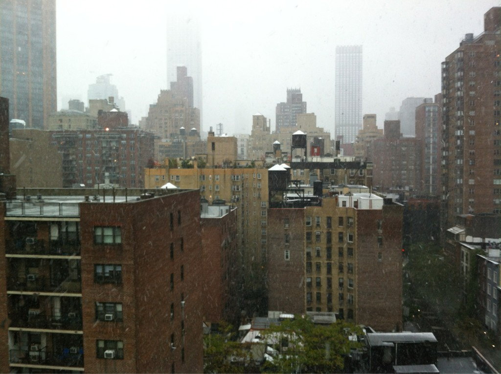
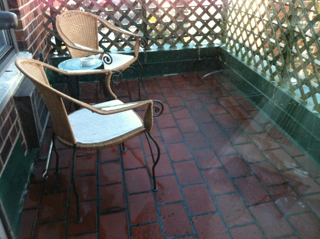

> Another episode of Sports Night\. Josh Charles just described someone as "a total nutbar\." No wonder I love this show\.

 [Sun Oct 02 03:41:51 +0000 2011](https://twitter.com/kfitz/status/120342707313967105)

----

> Coffee\. NYTimes\. A little morning music\. Sundays in this whole 9 to 5 gig are pretty okay\.

 [Sun Oct 02 14:11:30 +0000 2011](https://twitter.com/kfitz/status/120501163094319104)

----

Replying to [@RohanMaitzen](https://twitter.com/RohanMaitzen/status/120504173509881857)

> I'll have some work to do later today, but a guilt\-free Sunday morning is golden\!

 [Sun Oct 02 14:32:59 +0000 2011](https://twitter.com/kfitz/status/120506567413084160)

----

Replying to [@plragde](https://twitter.com/plragde/status/120513382150447104)

> Oh, there will be writing later today\. But the requirement to be dressed like a grownup 5 days a week is paid for in weekends\.

 [Sun Oct 02 15:05:20 +0000 2011](https://twitter.com/kfitz/status/120514707634401280)

----

> 7\+ buses with police/sheriff escort just convoyed past my building\. \#occupywallstreet

 [Sun Oct 02 17:15:27 +0000 2011](https://twitter.com/kfitz/status/120547453358440448)

----

Replying to [@bill\_easterly and @sivavaid](https://twitter.com/sivavaid/status/120609633869115392)

> I said so that afternoon\! https://twitter\.com/\#\!/kfitz/status/106062983490314241

 [Sun Oct 02 21:49:37 +0000 2011](https://twitter.com/kfitz/status/120616451181772801)

----

Replying to [@rgfeal](https://twitter.com/rgfeal/status/120625587336384513)

> The terrace faces the wrong direction, alas; may have to pop up to the roof deck\!

 [Sun Oct 02 22:31:10 +0000 2011](https://twitter.com/kfitz/status/120626906705035264)

----

> @hollykruse Oh, no\. Holly, I'm so sorry\.

 [Mon Oct 03 00:02:41 +0000 2011](https://twitter.com/kfitz/status/120649937166929920)

----

Replying to [@mmwwah](https://twitter.com/mmwwah/status/120711885808074752)

> A more reasonable concern seems to be what you were doing looking at Michael Arrington's blog?

 [Mon Oct 03 11:08:21 +0000 2011](https://twitter.com/kfitz/status/120817459472236544)

----

Replying to [@mamamusings](https://twitter.com/mamamusings/status/120895807883976704)

> Whoa\. Nice\!

 [Mon Oct 03 16:20:08 +0000 2011](https://twitter.com/kfitz/status/120895921176330240)

----

> I think this next session is meant to be "Whither the Humanities\." That extra h makes a real difference\.

 [Mon Oct 03 18:36:50 +0000 2011](https://twitter.com/kfitz/status/120930321200971776)

----

Replying to [@rgfeal](https://twitter.com/rgfeal/status/120930842045464576)

> Which is better than "wither," which suggests a clear, if undesirable, destination\.

 [Mon Oct 03 18:40:49 +0000 2011](https://twitter.com/kfitz/status/120931326449823746)

----

Replying to [@wynkenhimself and @lincolnmullen](https://twitter.com/wynkenhimself/status/121058891839705088)

> Ha\! Not a generalizable job title, alas\.

 [Tue Oct 04 12:14:03 +0000 2011](https://twitter.com/kfitz/status/121196378729873408)

----

Replying to [@jeanburgess and @halavais](https://twitter.com/jeanburgess/status/121233718932283392)

> Hey, thanks\! Looking forward to seeing you in Seattle\.

 [Tue Oct 04 14:47:42 +0000 2011](https://twitter.com/kfitz/status/121235048845410304)

----

Replying to [@kakennedy](https://twitter.com/kakennedy/status/121259311006625792)

> I have been having real aggravations with my Magic Mouse for the last few days; finally realized it was Bluetooth\. Grr\.

 [Tue Oct 04 16:33:14 +0000 2011](https://twitter.com/kfitz/status/121261606549192705)

----

Replying to [@amandafrench and @sleonchnm](https://twitter.com/amandafrench/status/121275651713015808)

> Hey, that's my specialty\!

 [Tue Oct 04 17:29:51 +0000 2011](https://twitter.com/kfitz/status/121275852372717570)

----

Replying to [@tcarmody](https://twitter.com/tcarmody/status/121284377689853952)

> Okay, I just got interested\.

 [Tue Oct 04 18:08:33 +0000 2011](https://twitter.com/kfitz/status/121285592750374913)

----

> I'm not sure why but today's Apple announcement has made me want a Kindle\.

 [Tue Oct 04 20:14:08 +0000 2011](https://twitter.com/kfitz/status/121317198022184960)

----

Replying to [@brettbobley](https://twitter.com/brettbobley/status/121324774231248897)

> I think the deal may be redirected consumer desire now that I know I don't have to buy a new phone\.

 [Tue Oct 04 20:45:58 +0000 2011](https://twitter.com/kfitz/status/121325210178818050)

----

Replying to [@miaC and @nancybaym](https://twitter.com/nancybaym/status/121325558066974721)

> Hey, now that's an idea: conference minutes cap\-and\-trade\. \#ir12

 [Tue Oct 04 20:48:08 +0000 2011](https://twitter.com/kfitz/status/121325753722863616)

----

Replying to [@midwinter\_](https://twitter.com/midwinter_/status/121327751662809090)

> I'm curious: once we knew we didn't have to beat up the Soviets, we started looking for somebody else to push around?

 [Tue Oct 04 20:57:06 +0000 2011](https://twitter.com/kfitz/status/121328008832364544)

----

Replying to [@brettbobley](https://twitter.com/brettbobley/status/121328804214996992)

> That, in fact, is the one thing that could get me into a 4S\. The rest, I can wait another generation for\.

 [Tue Oct 04 21:01:33 +0000 2011](https://twitter.com/kfitz/status/121329130678652928)

----

Replying to [@midwinter\_](https://twitter.com/midwinter_/status/121329476020875267)

> I hear you\. If only Jeff Bezos had managed to light a fire under the development team a few years sooner\.

 [Tue Oct 04 21:04:35 +0000 2011](https://twitter.com/kfitz/status/121329893983260673)

----

Replying to [@bighandsome](https://twitter.com/bighandsome/status/121332330043412480)

> I \*always\* know the good folks\. Tell them I said hi\.

 [Tue Oct 04 21:15:29 +0000 2011](https://twitter.com/kfitz/status/121332635954970624)

----

Replying to [@rgfeal and @brettbobley](https://twitter.com/rgfeal/status/121404534072426497)

> My only superpower is the uncanny ability to make people standing off to the side step into my path as I approach\.

 [Wed Oct 05 02:05:24 +0000 2011](https://twitter.com/kfitz/status/121405594535067649)

----

Replying to [@rgfeal and @brettbobley](https://twitter.com/rgfeal/status/121404534072426497)

> Which is less useful than you would think\.

 [Wed Oct 05 02:05:40 +0000 2011](https://twitter.com/kfitz/status/121405664890335232)

----

Replying to [@brettbobley and @rgfeal](https://twitter.com/brettbobley/status/121406438668124161)

> Indeed, on both counts\! I'd trade, happily\.

 [Wed Oct 05 02:09:47 +0000 2011](https://twitter.com/kfitz/status/121406700463996928)

----

Replying to [@rgfeal and @brettbobley](https://twitter.com/rgfeal/status/121407703347232768)

> Aw, man\! I think those \*were\* the droids I was looking for\!

 [Wed Oct 05 03:22:16 +0000 2011](https://twitter.com/kfitz/status/121424942364491776)

----

> Hey, registration for the SPARC Open Access meeting \(March 11\-13, 2012\) is now open\! http://www\.arl\.org/sparc/meetings/oa12/

 [Wed Oct 05 13:59:47 +0000 2011](https://twitter.com/kfitz/status/121585377759858688)

----

Replying to [@briancroxall](https://twitter.com/briancroxall/status/121638710914723842)

> The 13" Air screen has the same resolution as the 15" MBPro, so it feels like it's got the real estate of a larger machine\!

 [Wed Oct 05 17:32:39 +0000 2011](https://twitter.com/kfitz/status/121638946093547521)

----

Replying to [@briancroxall](https://twitter.com/briancroxall/status/121638710914723842)

> Which is to say, I vote yes\. But poke at a new one if you can\. I completely love mine\.

 [Wed Oct 05 17:33:06 +0000 2011](https://twitter.com/kfitz/status/121639061533376512)

----

Replying to [@briancroxall](https://twitter.com/briancroxall/status/121640831714205696)

> Just when I'm at a conference or otherwise on the road, for the most part, though sometimes at home, too\. It's so much faster\+

 [Wed Oct 05 17:40:47 +0000 2011](https://twitter.com/kfitz/status/121640992859369473)

----

Replying to [@briancroxall](https://twitter.com/briancroxall/status/121640831714205696)

> than my desktop that it's a breath of fresh air to move to\. And I don't find the screen too restricted, really\.

 [Wed Oct 05 17:41:32 +0000 2011](https://twitter.com/kfitz/status/121641181816963072)

----

Replying to [@amandafrench](https://twitter.com/amandafrench/status/121677871591858176)

> Excellent; thanks, Amanda\!

 [Wed Oct 05 20:23:58 +0000 2011](https://twitter.com/kfitz/status/121682058899750912)

----

> Survived a 7\-meeting day\. This is my reward\!  http://yfrog\.com/h3u2dhqaj

 [Wed Oct 05 21:13:33 +0000 2011](https://twitter.com/kfitz/status/121694539219083265)

----

> Thanks for the nice comments, all; I'm super excited\. \(Excited enough that I'm wondering if I should be more blasé\.\)

 [Wed Oct 05 21:30:05 +0000 2011](https://twitter.com/kfitz/status/121698699075272705)

----

Replying to [@savasavasava](https://twitter.com/savasavasava/status/121706842178072576)

> Backatcha\! So glad you spotted me\.

 [Wed Oct 05 22:06:29 +0000 2011](https://twitter.com/kfitz/status/121707858667642882)

----

> God, what a day\. :\-\( :\-\) :\-\( :\-/

 [Thu Oct 06 01:12:27 +0000 2011](https://twitter.com/kfitz/status/121754660385193986)

----

> I was feeling weirdly squeamish about being so excited to have a print artifact in my hand\. But I celebrated, nonetheless\. And right at \+

 [Thu Oct 06 01:29:35 +0000 2011](https://twitter.com/kfitz/status/121758970321977345)

----

> the end of the celebration, I found out Steve Jobs had died\. I'm not self\-centered enough to think those things are connected\. But I am \+

 [Thu Oct 06 01:29:38 +0000 2011](https://twitter.com/kfitz/status/121758982862942208)

----

> self\-centered enough for both events to have me pondering mortality, and the longing to escape it, and the very different ways of doing so\.

 [Thu Oct 06 01:29:42 +0000 2011](https://twitter.com/kfitz/status/121758998537052161)

----

Replying to [@shanakimball and @moncia](https://twitter.com/shanakimball/status/121730540603850753)

> Thank you both\. The blasé has been banned, in favor, alas, of the sad\. But celebration will resume soon\.

 [Thu Oct 06 01:33:39 +0000 2011](https://twitter.com/kfitz/status/121759996408107008)

----

Replying to [@jasonrhody](https://twitter.com/jasonrhody/status/121746611809427458)

> Thanks, Jason\. That means a lot\!

 [Thu Oct 06 01:34:01 +0000 2011](https://twitter.com/kfitz/status/121760086531121152)

----

Replying to [@sramsay](https://twitter.com/@sramsay/status/121748455185055744)

> I only hope it does some good out there\. Thanks, Steve\.

 [Thu Oct 06 01:34:31 +0000 2011](https://twitter.com/kfitz/status/121760212737724416)

----

Replying to [@briancroxall](https://twitter.com/briancroxall/status/121760154269126657)

> I'm looking forward to it\!

 [Thu Oct 06 01:35:21 +0000 2011](https://twitter.com/kfitz/status/121760421194637312)

----

Replying to [@nickmirzoeff](https://twitter.com/nickmirzoeff/status/121762355158855680)

> Indeed\.

 [Thu Oct 06 01:47:28 +0000 2011](https://twitter.com/kfitz/status/121763470164238336)

----

Replying to [@xina](https://twitter.com/xina/status/121763489772613632)

> Thanks\. It's disconcerting to be so excited and so sad all at once\.

 [Thu Oct 06 01:48:33 +0000 2011](https://twitter.com/kfitz/status/121763745952309249)

----

Replying to [@tcarmody](https://twitter.com/tcarmody/status/121764008213757952)

> It is, isn't it? I'm really happy with how it turned out\.

 [Thu Oct 06 02:04:04 +0000 2011](https://twitter.com/kfitz/status/121767649221939200)

----

Replying to [@midwinter\_](https://twitter.com/midwinter_/status/121767331054624768)

> Ha\.

 [Thu Oct 06 02:09:36 +0000 2011](https://twitter.com/kfitz/status/121769042859130881)

----

> Still excited about my book\. Still sad about Steve Jobs\. Tweeting from my iPhone and working on my MBAir on my way to give a talk at Vassar\.

 [Thu Oct 06 11:56:37 +0000 2011](https://twitter.com/kfitz/status/121916770914271232)

----

> The Hudson, not incidentally, is beautiful on a sunny October morning\.

 [Thu Oct 06 11:57:58 +0000 2011](https://twitter.com/kfitz/status/121917107960156161)

----

Replying to [@veek](https://twitter.com/veek/status/121933490739625984)

> The copies landed in the press office yesterday, and so should start shipping fairly soon \-\- thanks\!

 [Thu Oct 06 15:14:51 +0000 2011](https://twitter.com/kfitz/status/121966654522540032)

----

Replying to [@aperren](https://twitter.com/aperren/status/121934658496765953)

> That's hilarious\! \(And thanks\!\)

 [Thu Oct 06 15:15:33 +0000 2011](https://twitter.com/kfitz/status/121966834114240513)

----

Replying to [@mkirschenbaum](https://twitter.com/mkirschenbaum/status/121961872789487616)

> Thanks, Matt \-\- I hope it can do some good things out there\.

 [Thu Oct 06 15:21:55 +0000 2011](https://twitter.com/kfitz/status/121968435579207681)

----

Replying to [@sherah1918](https://twitter.com/SheilaABrennan/status/121966946005688321)

> Indeed\! Including an ebook TK\.

 [Thu Oct 06 15:22:57 +0000 2011](https://twitter.com/kfitz/status/121968693033959424)

----

Replying to [@newkidonthehall](https://twitter.com/newkidonthehall/status/121969313186975745)

> Congratulations\!\!\!\!

 [Thu Oct 06 15:27:27 +0000 2011](https://twitter.com/kfitz/status/121969824996933632)

----

Replying to [@amndw2](https://twitter.com/amndw2/status/121969429801218048)

> Thanks so much\!

 [Thu Oct 06 15:27:37 +0000 2011](https://twitter.com/kfitz/status/121969868097593344)

----

Replying to [@mmwwah](https://twitter.com/mmwwah/status/121970324395925504)

> Thanks\! Happily, it was only a 7\-meeting day, rather than a 7\-day meeting, which I'm pretty sure would be worse\. :\)

 [Thu Oct 06 15:31:52 +0000 2011](https://twitter.com/kfitz/status/121970936902717440)

----

Replying to [@wynkenhimself](https://twitter.com/wynkenhimself/status/121971106524565505)

> It is, isn't it\! Even after years of blogging there, I still mistype it a huge percentage of the time\.

 [Thu Oct 06 15:33:42 +0000 2011](https://twitter.com/kfitz/status/121971399895158784)

----

Replying to [@wynkenhimself](https://twitter.com/wynkenhimself/status/121971106524565505)

> PS: thanks\!

 [Thu Oct 06 15:33:48 +0000 2011](https://twitter.com/kfitz/status/121971423479734272)

----

Replying to [@jbj and @wynkenhimself](https://twitter.com/jbj/status/121971824568438785)

> You know, I have one of those text expander things\. And keep forgetting to use it\!

 [Thu Oct 06 15:36:11 +0000 2011](https://twitter.com/kfitz/status/121972026499006464)

----

> Fantastic visit with what turns out to be my many friends at Vassar today\! A great set of conversations; thanks to all for your hospitality\.

 [Fri Oct 07 00:05:09 +0000 2011](https://twitter.com/kfitz/status/122100109981908992)

----

> Brain is very tired, though; I expect to sleep well tonight\!

 [Fri Oct 07 00:07:12 +0000 2011](https://twitter.com/kfitz/status/122100627257040896)

----

Replying to [@rgfeal](https://twitter.com/rgfeal/status/122101647752179712)

> Great turnout; excellent discussion\! The talk, you'd have to ask then about\.

 [Fri Oct 07 00:16:05 +0000 2011](https://twitter.com/kfitz/status/122102863349551105)

----

Replying to [@JillScharr](https://twitter.com/JillScharr/status/122117485477642241)

> Thank you for coming\! I had a great time\.

 [Fri Oct 07 01:41:11 +0000 2011](https://twitter.com/kfitz/status/122124279688073216)

----

Replying to [@chouxsalad](https://twitter.com/chouxsalad/status/122137183829229570)

> Thank you\! It was great talking with you yesterday\. That book, incidentally, is by Susan Bielstein & it's really worth reading\.

 [Fri Oct 07 13:10:56 +0000 2011](https://twitter.com/kfitz/status/122297859717599232)

----

Replying to [@briancroxall, @nowviskie and @miriamkp](https://twitter.com/briancroxall/status/122298038453678080)

> Definitely one of the nicest things anyone has said to me\. Thanks, Brian\!

 [Fri Oct 07 13:15:05 +0000 2011](https://twitter.com/kfitz/status/122298902987808768)

----

> I had an excellent blog post in my head this morning\. Even plotted out how to write it and some of the niftier turns of phrase\. Now? Gone\.

 [Fri Oct 07 19:19:25 +0000 2011](https://twitter.com/kfitz/status/122390590737481729)

----

Replying to [@magicandrew and @tcarmody](https://twitter.com/magicandrew/status/122763516347289600)

> Actually, I can't either; I was born in NJ & my father got transferred to BR when I was 3\. But raised there, yes\.

 [Sat Oct 08 20:04:04 +0000 2011](https://twitter.com/kfitz/status/122764217123209216)

----

Replying to [@tcarmody and @magicandrew](https://twitter.com/tcarmody/status/122766555472859136)

> Excellent\! Pleased to meet you, Andrew\.

 [Sat Oct 08 20:16:55 +0000 2011](https://twitter.com/kfitz/status/122767450445053952)

----

Replying to [@jwolman](https://twitter.com/jwolman/status/122768568008982528)

> That's Fewer Miles, Jake\. \(But yeah\. Crazy\.\)

 [Sat Oct 08 20:32:09 +0000 2011](https://twitter.com/kfitz/status/122771281031610369)

----

Replying to [@alothian](https://twitter.com/alothian/status/122777292987564032)

> Wow, I'm sorry I'm going to miss that\! I've taught Delany in my Race, Gender, & SF class for years\!

 [Sat Oct 08 21:01:34 +0000 2011](https://twitter.com/kfitz/status/122778685714604032)

----

Replying to [@alothian](https://twitter.com/alothian/status/122779883742052352)

> Wow, that's amazing\!

 [Sat Oct 08 21:18:53 +0000 2011](https://twitter.com/kfitz/status/122783043609034752)

----

> Okay, have done just about everything on my pre\-\#ir12\-departure list\. See you soon, Seattle\!

 [Sun Oct 09 23:30:26 +0000 2011](https://twitter.com/kfitz/status/123178536474394625)

----

Replying to [@academicdave and @rgfeal](https://twitter.com/academicdave/status/123391013921361920)

> Yeah, aside from that, I don't know what the prob could be\. Don't know the app you're using\.\.\.

 [Mon Oct 10 13:35:56 +0000 2011](https://twitter.com/kfitz/status/123391312799088642)

----

Replying to [@nancybaym](https://twitter.com/nancybaym/status/123468980710162432)

> On my way to the airport myself\. See you in Seattle\!

 [Mon Oct 10 18:59:16 +0000 2011](https://twitter.com/kfitz/status/123472683764678656)

----

Replying to [@savasavasava](https://twitter.com/savasavasava/status/123472945027883008)

> Are you at \#ir12? Will be lovely to see you, if so\!

 [Mon Oct 10 20:34:08 +0000 2011](https://twitter.com/kfitz/status/123496558141517825)

----

> On the plane for Seattle, and not a single moment too soon\. \#ir12

 [Mon Oct 10 21:28:04 +0000 2011](https://twitter.com/kfitz/status/123510129357365248)

----

Replying to [@brettbobley](https://twitter.com/brettbobley/status/123510507956219904)

> Recon is indeed involved, but in the guise of another conference\. Shhh\.

 [Mon Oct 10 21:32:21 +0000 2011](https://twitter.com/kfitz/status/123511208631476224)

----

> Seattle\! Where, I am shocked to report, it is lightly raining\.

 [Tue Oct 11 03:34:13 +0000 2011](https://twitter.com/kfitz/status/123602273250197504)

----

Replying to [@Ed\_Raso](https://twitter.com/Ed_Raso/status/123612718694543360)

> Not yet, but check in with me again in about 8 hours\.

 [Tue Oct 11 04:16:44 +0000 2011](https://twitter.com/kfitz/status/123612972957442049)

----

Replying to [@wynkenhimself](https://twitter.com/wynkenhimself/status/123598363391299585)

> Did you see the one about the woman who went into labor during the bar exam this year? And finished?\!

 [Tue Oct 11 04:17:43 +0000 2011](https://twitter.com/kfitz/status/123613220526239744)

----

> Completely crashed at 9\.30pm\. Wide awake at 4\.30am\. Hello, west coast\.

 [Tue Oct 11 12:17:34 +0000 2011](https://twitter.com/kfitz/status/123733979294740481)

----

Replying to [@jcmeloni](https://twitter.com/jcmeloni/status/123732492783058944)

> Jeez, Julie\. Where've you been? \#sigh

 [Tue Oct 11 12:32:11 +0000 2011](https://twitter.com/kfitz/status/123737658508849152)

----

Replying to [@jbj](https://twitter.com/jbj/status/123734144307036160)

> Hey, on the issue of the review for promotion to full, I have Thoughts\. Which I will share when you like\.

 [Tue Oct 11 12:33:13 +0000 2011](https://twitter.com/kfitz/status/123737920279547904)

----

> Giving an Ignite\-style talk this morning at 9ish\. Now to see if I can get my notes off of my index cards and into my head\.

 [Tue Oct 11 12:41:59 +0000 2011](https://twitter.com/kfitz/status/123740125917220864)

----

> IGNITE\! \#ir12

 [Tue Oct 11 17:09:52 +0000 2011](https://twitter.com/kfitz/status/123807539589689344)

----

Replying to [@alexcho47](https://twitter.com/alexcho47/status/123829353439182851)

> Hey, you're here\! I'll look forward to saying hi in person\.

 [Tue Oct 11 18:42:04 +0000 2011](https://twitter.com/kfitz/status/123830743850950657)

----

Replying to [@alexcho47](https://twitter.com/alexcho47/status/123831063612104704)

> Excellent\! Looking forward to hearing how things are going\.

 [Tue Oct 11 18:45:17 +0000 2011](https://twitter.com/kfitz/status/123831554156920832)

----

> Wait\! Outside the window\! There is a strange yellow glow on everything\!

 [Tue Oct 11 20:21:47 +0000 2011](https://twitter.com/kfitz/status/123855837482582017)

----

Replying to [@mmwwah](https://twitter.com/mmwwah/status/123858915480965121)

> What does it mean???

 [Tue Oct 11 20:53:31 +0000 2011](https://twitter.com/kfitz/status/123863821621280768)

----

> Had to go upstairs during lunch and put on tights and a jacket\. It is downright chilly \(in the air\-conditioned conference space\) at \#ir12\.

 [Tue Oct 11 20:57:25 +0000 2011](https://twitter.com/kfitz/status/123864803914694656)

----

Replying to [@amandafrench](https://twitter.com/amandafrench/status/123873077091237888)

> YOU CAN HAS CARBS\.

 [Tue Oct 11 21:31:06 +0000 2011](https://twitter.com/kfitz/status/123873281127354368)

----

Replying to [@samplereality](https://twitter.com/samplereality/status/123879039386664960)

> WRONG\. They're the ones who took typing class in high school and were A students, thankyouverymuch\.

 [Tue Oct 11 21:54:42 +0000 2011](https://twitter.com/kfitz/status/123879221385891840)

----

Replying to [@annehelen](https://twitter.com/annehelen/status/123877409064890369)

> Actually, I think he flat said it\. But then he also said he's not influenced by anyone other than himself\. So take it as you will

 [Tue Oct 11 21:55:00 +0000 2011](https://twitter.com/kfitz/status/123879295285329921)

----

Replying to [@annehelen](https://twitter.com/annehelen/status/123879444170555392)

> Ah, gotcha\. I had to stop reading that piece \(as I do everything he's involved in\) so as not to break my jaw grinding my teeth\.

 [Tue Oct 11 21:56:21 +0000 2011](https://twitter.com/kfitz/status/123879637930622976)

----

Replying to [@annehelen](https://twitter.com/annehelen/status/123879718746460160)

> Utterly confounding my expectations, I did not hate the NYer piece\. But I can't bear him in almost any other circumstances\.

 [Tue Oct 11 21:58:41 +0000 2011](https://twitter.com/kfitz/status/123880222910193664)

----

Replying to [@mmwwah](https://twitter.com/mmwwah/status/123880086423351296)

> Do me a favor and email that question? I have to dig to come up with the answer, and I'll forget if it gets buried here\.

 [Tue Oct 11 21:59:23 +0000 2011](https://twitter.com/kfitz/status/123880398068531200)

----

> Attempting to tune into \#ir12kiss while moderating a session is difficult\. But you're too fabulous not to, @nancybaym\!

 [Tue Oct 11 23:17:53 +0000 2011](https://twitter.com/kfitz/status/123900156377698304)

----

Replying to [@wynkenhimself and @cjprender](https://twitter.com/wynkenhimself/status/123904917634166784)

> A very good question\. From what I've heard, it was about readability in monospaced type \(& so no longer needed\)\.

 [Tue Oct 11 23:38:14 +0000 2011](https://twitter.com/kfitz/status/123905274472960000)

----

Replying to [@wynkenhimself and @cjprender](https://twitter.com/wynkenhimself/status/123906180132249600)

> Evil research project: what if we take half the US school kids and teach them to put two spaces after a period?

 [Tue Oct 11 23:43:10 +0000 2011](https://twitter.com/kfitz/status/123906519065571328)

----

Replying to [@wynkenhimself and @cjprender](https://twitter.com/wynkenhimself/status/123906180132249600)

> \(Mwa\-ha\-ha\.\)

 [Tue Oct 11 23:43:18 +0000 2011](https://twitter.com/kfitz/status/123906551558836226)

----

Replying to [@danieldriver](https://twitter.com/@danieldriver/status/123960371752083458)

> Personally? I'd look hard at WordPress\. It's an increasingly powerful CMS w/workflow plugins, and it doesn't have to be ugly\.

 [Wed Oct 12 03:25:27 +0000 2011](https://twitter.com/kfitz/status/123962457042583552)

----

> I'm on open wireless, connected to my VPN, and the entirety of @TheAtlantic's website is giving me 403 errors\. Is it the site or my VPN?

 [Wed Oct 12 14:52:14 +0000 2011](https://twitter.com/kfitz/status/124135292016926721)

----

> Things I Am Writing Instead of Writing Blog Posts\. \(Sigh\.\) http://www\.plannedobsolescence\.net/blog/things\-i\-am\-writing\-instead\-of\-writing\-blog\-posts/

 [Wed Oct 12 16:50:37 +0000 2011](https://twitter.com/kfitz/status/124165085697540096)

----

Replying to [@rgfeal](https://twitter.com/rgfeal/status/124165924067606528)

> Oh, I'm glad about some of it, too\. A whole lot less glad about other parts of it\.

 [Wed Oct 12 16:55:17 +0000 2011](https://twitter.com/kfitz/status/124166257133101056)

----

> Five words: Pork belly\. Confit\. Banh mi\.

 [Wed Oct 12 21:36:14 +0000 2011](https://twitter.com/kfitz/status/124236961539047424)

----

Replying to [@veek](https://twitter.com/veek/status/124237487794167808)

> Yes indeed\.

 [Wed Oct 12 23:58:02 +0000 2011](https://twitter.com/kfitz/status/124272647407284224)

----

Replying to [@cscannella](https://twitter.com/cscannella/status/124241197060468738)

> And I have eaten them\. Very tasty\.

 [Wed Oct 12 23:58:43 +0000 2011](https://twitter.com/kfitz/status/124272816811032577)

----

Replying to [@amandafrench](https://twitter.com/amandafrench/status/124450502783148032)

> Wow, that's amazing\. I'm curious what I was up to, not having much to say about poetic form & tradition\.\.\.

 [Thu Oct 13 12:04:26 +0000 2011](https://twitter.com/kfitz/status/124455449260077056)

----

Replying to [@amandafrench](https://twitter.com/amandafrench/status/124489668271144960)

> Heh\.

 [Thu Oct 13 14:24:47 +0000 2011](https://twitter.com/kfitz/status/124490770093846528)

----

> Okay, a morning spent working in the hotel room; calamity of missed deadlines somewhat averted\. Now to pull myself together & go conference\!

 [Thu Oct 13 17:08:33 +0000 2011](https://twitter.com/kfitz/status/124531985858297856)

----

> Books & Publishing session, on the 4th floor, in Marion\! \(Madame Libra\-\-\-rian\.\) \#ir12

 [Thu Oct 13 22:19:01 +0000 2011](https://twitter.com/kfitz/status/124610114169749504)

----

> Starting with Peter Boot on online book discussion sites in the Netherlands\. \#ir12

 [Thu Oct 13 22:21:14 +0000 2011](https://twitter.com/kfitz/status/124610675107565571)

----

Replying to [@moncia](https://twitter.com/moncia/status/124610258411855872)

> Ooh, I'm curious\.

 [Thu Oct 13 22:22:06 +0000 2011](https://twitter.com/kfitz/status/124610892540280834)

----

Replying to [@annettemarkham](https://twitter.com/annettemarkham/status/124610939969474560)

> Aw, man\! I'm up against the kissing booth? Crud\.

 [Thu Oct 13 22:23:18 +0000 2011](https://twitter.com/kfitz/status/124611193934581760)

----

Replying to [@moncia](https://twitter.com/moncia/status/124611781137145856)

> Oh god\. Okay, I get it\. \*sigh\*

 [Thu Oct 13 22:27:14 +0000 2011](https://twitter.com/kfitz/status/124612185593880576)

----

Replying to [@savasavasava](https://twitter.com/savasavasava/status/124612190689951745)

> Is sad\. Always such a difference from the energy of the conference start\. \#ir12

 [Thu Oct 13 22:29:06 +0000 2011](https://twitter.com/kfitz/status/124612651807547392)

----

> Alex Carr on social e\-books\. \#ir12

 [Thu Oct 13 22:32:06 +0000 2011](https://twitter.com/kfitz/status/124613409701507072)

----

> Whoa\. Alex Samuel\. Who works at Emily Carr\. Starting to think I might be a little tired\. \#ir12

 [Thu Oct 13 22:34:42 +0000 2011](https://twitter.com/kfitz/status/124614064214261761)

----

Replying to [@savasavasava](https://twitter.com/savasavasava/status/124614216656224257)

> Good suggestion for the AGM: all sessions during the final time slot should be discussion oriented\.\.\. \#ir12

 [Thu Oct 13 22:36:51 +0000 2011](https://twitter.com/kfitz/status/124614603241029632)

----

Replying to [@savasavasava](https://twitter.com/savasavasava/status/124616249933168640)

> Yes, yes, on all counts\! \#ir12

 [Thu Oct 13 22:44:10 +0000 2011](https://twitter.com/kfitz/status/124616447073857536)

----

> Tim Laquintano on the history of "vanity publishing\." Fascinating\. \#ir12

 [Thu Oct 13 23:12:19 +0000 2011](https://twitter.com/kfitz/status/124623528128548864)

----

Replying to [@emilynussbaum](https://twitter.com/emilynussbaum/status/124623625973276672)

> Hey, congratulations \- fantastic news\!

 [Fri Oct 14 00:04:24 +0000 2011](https://twitter.com/kfitz/status/124636635815092225)

----

Replying to [@mmwwah](https://twitter.com/mmwwah/status/124639696545525761)

> A fascinating 1941 mail fraud case\. But also, around then, the moment when "vanity" first came to be applied to the process\.

 [Fri Oct 14 00:18:19 +0000 2011](https://twitter.com/kfitz/status/124640137345900544)

----

Replying to [@mmwwah](https://twitter.com/mmwwah/status/124640289469112321)

> If he hasn't yet, he will\. It's interesting stuff\.

 [Fri Oct 14 00:22:51 +0000 2011](https://twitter.com/kfitz/status/124641279299698689)

----

> Boarding shortly for the return flight to NYC\. I plan to read a novel\. It feels like playing hooky\.

 [Fri Oct 14 13:03:33 +0000 2011](https://twitter.com/kfitz/status/124832715383111680)

----

Replying to [@mmwwah](https://twitter.com/mmwwah/status/124833612402135040)

> 7am\. And less about nostalgia than about the need to be in NYC before 5pm\. Flying eastward, ugh\.

 [Fri Oct 14 13:08:12 +0000 2011](https://twitter.com/kfitz/status/124833888467025921)

----

Replying to [@noctambulate](https://twitter.com/noctambulate/status/124835656978534400)

> Ooh, but it might be an embarrassing title\!

 [Fri Oct 14 13:22:19 +0000 2011](https://twitter.com/kfitz/status/124837438098116608)

----

Replying to [@mmwwah](https://twitter.com/mmwwah/status/124834234245451776)

> No kidding\. Where's my teleporter?

 [Fri Oct 14 13:22:28 +0000 2011](https://twitter.com/kfitz/status/124837478317309952)

----

> SEA to EWR to AirTrain to NJT to 1 to 7\. Just a few more stops\.

 [Fri Oct 14 19:20:00 +0000 2011](https://twitter.com/kfitz/status/124927454497341440)

----

Replying to [@JenHoward and @rgfeal](https://twitter.com/JenHoward/status/124919695508901888)

> Did you ever find this? On http://www\.mla\.org/convention, there's a link to "presidential theme" under session info\.

 [Sun Oct 16 12:22:03 +0000 2011](https://twitter.com/kfitz/status/125547048480161792)

----

> Hey, happy birthday, @brettbobley\! I hope it was a good one\.

 [Mon Oct 17 01:57:14 +0000 2011](https://twitter.com/kfitz/status/125752195248422912)

----

> Hey, ignore this tweet; I'm just testing something out\. http://www\.plannedobsolescence\.net/

 [Mon Oct 17 18:10:00 +0000 2011](https://twitter.com/kfitz/status/125997001363042305)

----

Replying to [@wynkenhimself and @samplereality](https://twitter.com/wynkenhimself/status/125998275147988992)

> No, weirdly, you two \*were\* the only contrarians\. Coincidence? I think not\.

 [Mon Oct 17 18:29:05 +0000 2011](https://twitter.com/kfitz/status/126001804159877120)

----

Replying to [@sxflynn](https://twitter.com/sxflynn/status/126002323599261698)

> Conveniently, it's also the title of my \(really really imminently\) forthcoming book\! http://www\.amazon\.com/gp/product/0814727883/ref\=as\_li\_ss\_tl?ie\=UTF8&tag\=plannedobsole\-20&linkCode\=as2&camp\=217145&creative\=399373&creativeASIN\=0814727883

 [Mon Oct 17 18:33:54 +0000 2011](https://twitter.com/kfitz/status/126003016011743232)

----

Replying to [@sxflynn](https://twitter.com/sxflynn/status/126003572461682688)

> It's not an unfair characterization, though it is only one small piece of the argument\. :\)

 [Mon Oct 17 18:38:00 +0000 2011](https://twitter.com/kfitz/status/126004048481628160)

----

Replying to [@sxflynn](https://twitter.com/sxflynn/status/126004762708688896)

> Actually, I hadn't come across that\. My argument is mostly focused on university presses\.\.\.

 [Mon Oct 17 18:42:31 +0000 2011](https://twitter.com/kfitz/status/126005184865382400)

----

Replying to [@midwinter\_](https://twitter.com/midwinter_/status/126009553883103232)

> Whatever you do, don't think about an elephant\.

 [Mon Oct 17 19:01:57 +0000 2011](https://twitter.com/kfitz/status/126010075159601152)

----

> RT @mrmauritzen: Reading "Planned Obsolescence" by Kathleen Fitzpatrick @kfitz and have never been more optimistic about the future of t \.\.\.

 [Tue Oct 18 10:05:00 +0000 2011](https://twitter.com/kfitz/status/126237332797014016)

----

Replying to [@nancybaym](https://twitter.com/nancybaym/status/126293579202166784)

> Rats\.

 [Tue Oct 18 13:49:33 +0000 2011](https://twitter.com/kfitz/status/126293843548192769)

----

Replying to [@nancybaym](https://twitter.com/nancybaym/status/126295520133128192)

> I guess we'll have to go to work\.

 [Tue Oct 18 13:57:30 +0000 2011](https://twitter.com/kfitz/status/126295845242015744)

----

Replying to [@nancybaym](https://twitter.com/nancybaym/status/126296379986423808)

> I know\. I've looked for ways around it and just haven't found any\.

 [Tue Oct 18 14:00:36 +0000 2011](https://twitter.com/kfitz/status/126296624338190336)

----

Replying to [@KelliMarshall and @samplereality](https://twitter.com/KelliMarshall/status/126297002941222912)

> It was\. And then there was BTCNew, which tried to keep the functionality alive\. But I think it's gone now too\.

 [Tue Oct 18 14:04:29 +0000 2011](https://twitter.com/kfitz/status/126297602571505664)

----

Replying to [@cscannella](https://twitter.com/cscannella/status/126297502910660608)

> Yes\. Did you have a MobileMe acct before? If so, you actually need to delete the iCloud acct and re\-add it\. Alarming, but works\.

 [Tue Oct 18 14:05:26 +0000 2011](https://twitter.com/kfitz/status/126297842695421952)

----

Replying to [@samplereality and @kellimarshall](https://twitter.com/samplereality/status/126298372998045696)

> I did decide against Disqus, because of accessibility issues\. I also looked at IntenseDebate but haven't used\.

 [Tue Oct 18 14:10:47 +0000 2011](https://twitter.com/kfitz/status/126299185749299200)

----

> RT @laura11D: Stop the illegals with 9% cattle prods 9%laser sharks 9%killer bees\.

 [Wed Oct 19 01:12:50 +0000 2011](https://twitter.com/kfitz/status/126465797202780160)

----

> Sorry to have missed \#cunypie with special appearances by @samplereality & @shannonmattern tonight\! \(Not to mention @mkgold & @savasavasava\)

 [Wed Oct 19 02:32:00 +0000 2011](https://twitter.com/kfitz/status/126485719282761729)

----

> But glad I get to spend the end of the week with @briancroxall @vszabo & @nowviskie\. \(When are the rest of you coming to visit?\)

 [Wed Oct 19 02:34:15 +0000 2011](https://twitter.com/kfitz/status/126486285744484352)

----

Replying to [@briancroxall, @mkgold and @boone](https://twitter.com/briancroxall/status/126496888538136576)

> Tomorrow as in today? Or as in tomorrow? Let's confer\!

 [Wed Oct 19 09:58:48 +0000 2011](https://twitter.com/kfitz/status/126598162675802113)

----

Replying to [@briancroxall, @mkgold and @boone](https://twitter.com/briancroxall/status/126726220258869248)

> Have fun\. Think of me, stuck in a meeting\.

 [Wed Oct 19 18:30:01 +0000 2011](https://twitter.com/kfitz/status/126726814310739968)

----

Replying to [@sivavaid](https://twitter.com/sivavaid/status/126778548085202945)

> I honestly wasn't sure at first if you were arguing about digital humanities or the designated hitter\. Same either way, I guess\.

 [Wed Oct 19 22:02:46 +0000 2011](https://twitter.com/kfitz/status/126780354286727168)

----

Replying to [@sivavaid and @unsworth](https://twitter.com/sivavaid/status/126782178708307970)

> If you take "humanities computing" as an antecedent, it's older, actually\!

 [Wed Oct 19 22:19:32 +0000 2011](https://twitter.com/kfitz/status/126784572871553024)

----

> RT @MLAnews: PDF files of the print version of the MLA Job Information List are now available for free at http://www\.mla\.org\. Browse O \.\.\.

 [Thu Oct 20 13:52:57 +0000 2011](https://twitter.com/kfitz/status/127019476125364224)

----

> RT @nowviskie: This, btw, is how you earn your license to kvetch\. No complaints about the \#dh12 program by people who don't help review\! ;\)

 [Fri Oct 21 12:22:29 +0000 2011](https://twitter.com/kfitz/status/127359096469983232)

----

> The preceding is true about oh so many things\. Or should be, at any rate\.

 [Fri Oct 21 12:22:48 +0000 2011](https://twitter.com/kfitz/status/127359175599722497)

----

Replying to [@alothian](https://twitter.com/alothian/status/127402582506352640)

> Hey\! I want to hear more about this session, needless to say\. I hope you'll blog it later\.\.\.

 [Fri Oct 21 16:11:59 +0000 2011](https://twitter.com/kfitz/status/127416853063671810)

----

Replying to [@alothian](https://twitter.com/alothian/status/127417522839486466)

> Fantastic; thanks \-\- and thanks for the link to the googledoc\!

 [Fri Oct 21 16:16:52 +0000 2011](https://twitter.com/kfitz/status/127418082456109056)

----

> You know, I hear that if you were at \#2011ASA, you'd be able to pick up a copy of Planned Obsolescence from NYU Press\. http://nyupress\.org/books/book\-details\.aspx?bookId\=5008

 [Fri Oct 21 20:29:21 +0000 2011](https://twitter.com/kfitz/status/127481619606020096)

----

Replying to [@farman](https://twitter.com/farman/status/127481863043420160)

> Hey, thanks for the confirmation, and also for using that chapter\! I'd love to hear how it went\.\.\.

 [Fri Oct 21 20:31:18 +0000 2011](https://twitter.com/kfitz/status/127482111509807104)

----

Replying to [@farman](https://twitter.com/farman/status/127482640587702272)

> Very cool\. Thanks for letting me know\!

 [Fri Oct 21 20:34:27 +0000 2011](https://twitter.com/kfitz/status/127482903193063424)

----

> RT @cliotropic: Nick Mirzoeff argues that when you tweet or post to FB rather than commenting on a scholar's blog, you're privatizing th \.\.\.

 [Sat Oct 22 04:15:50 +0000 2011](https://twitter.com/kfitz/status/127599016384008194)

----

Replying to [@emarsh and @believermag](https://twitter.com/emarsh/status/127808986866139136)

> That is amazingly cool\.

 [Sat Oct 22 18:13:17 +0000 2011](https://twitter.com/kfitz/status/127809764980822018)

----

> I'm a little amazed\! RT @emarsh: @kfitz It is nice to see that Jonathan Lethem cites you in this month's @believermag

 [Sat Oct 22 18:16:59 +0000 2011](https://twitter.com/kfitz/status/127810696225370112)

----

Replying to [@emarsh](https://twitter.com/emarsh/status/127811276016582656)

> And from my first book, which… well, made a very very small impact\. Shall we say\.

 [Sat Oct 22 18:22:40 +0000 2011](https://twitter.com/kfitz/status/127812126457868288)

----

> I was supposed to be at this LSU\-Auburn game, but other obligations intervened\. CBS on the big screen is awesome, but it's not the same\.

 [Sat Oct 22 21:56:23 +0000 2011](https://twitter.com/kfitz/status/127865911754502144)

----

Replying to [@loganpoppy](https://twitter.com/loganpoppy/status/127866188926693376)

> But you have a hard time getting her out of Tiger Stadium on a Saturday\.

 [Sat Oct 22 21:58:47 +0000 2011](https://twitter.com/kfitz/status/127866516271140864)

----

> O\. M\. G\.

 [Sat Oct 22 22:01:27 +0000 2011](https://twitter.com/kfitz/status/127867186088910850)

----

Replying to [@mmwwah](https://twitter.com/mmwwah/status/128142866911465472)

> Only 3/4 of them\. For LSU, 'Bama remains PE\#1, thanks to the Great Traitor, Nick Satan\. I mean Saban\.

 [Sun Oct 23 16:50:06 +0000 2011](https://twitter.com/kfitz/status/128151218638946304)

----

Replying to [@mmwwah](https://twitter.com/mmwwah/status/128151712740556800)

> Fascinating\.

 [Sun Oct 23 16:54:12 +0000 2011](https://twitter.com/kfitz/status/128152251700228096)

----

Replying to [@mmwwah](https://twitter.com/mmwwah/status/128152464804413440)

> Yeah, but \*everybody\* except LSU is still interesting\.

 [Sun Oct 23 16:59:43 +0000 2011](https://twitter.com/kfitz/status/128153641956814848)

----

Replying to [@mmwwah](https://twitter.com/mmwwah/status/128154528850771968)

> Tulane isn't SEC, though\. They've never been seen by LSU as enough of a threat to warrant a real rivalry\.

 [Sun Oct 23 17:13:18 +0000 2011](https://twitter.com/kfitz/status/128157057911226368)

----

Replying to [@mmwwah](https://twitter.com/mmwwah/status/128157614721871872)

> Yeah, it's not hard to get LSU fans wound up about anybody\. But everybody's way more than usually touchy about Bama\. Especially now\.

 [Sun Oct 23 17:19:56 +0000 2011](https://twitter.com/kfitz/status/128158728070500352)

----

> BOS\. Up here for a workshop at MSR\.

 [Sun Oct 23 18:43:24 +0000 2011](https://twitter.com/kfitz/status/128179731408486400)

----

> Yup, it's Boston\. The view from my hotel room\. 
> 
> 

 [Sun Oct 23 19:19:48 +0000 2011](https://twitter.com/kfitz/status/128188888861786113)

----

Replying to [@debcha](https://twitter.com/debcha/status/128192840521101312)

> No kidding\!

 [Sun Oct 23 19:38:24 +0000 2011](https://twitter.com/kfitz/status/128193573089849344)

----

Replying to [@amandafrench](https://twitter.com/amandafrench/status/128208413606936577)

> It's possible I'm just across the river from you\!

 [Sun Oct 23 23:32:22 +0000 2011](https://twitter.com/kfitz/status/128252455896088576)

----

Replying to [@amandafrench](https://twitter.com/amandafrench/status/128262331804286977)

> Good for you\! Have a good trip back\.\.\.

 [Mon Oct 24 00:14:02 +0000 2011](https://twitter.com/kfitz/status/128262941156978688)

----

Replying to [@tanyaclement](https://twitter.com/tanyaclement/status/128290066614325248)

> Hey, it could be a whole lot worse\. http://www\.goodreads\.com/quotes/show/335083

 [Mon Oct 24 02:03:52 +0000 2011](https://twitter.com/kfitz/status/128290582220128256)

----

> Morning on the Charles seems not so terrible\. 
> 
> 

 [Mon Oct 24 11:08:10 +0000 2011](https://twitter.com/kfitz/status/128427553500315650)

----

Replying to [@tanyaclement](https://twitter.com/tanyaclement/status/128427754873032704)

> Ah, I wish I could\. I am going to take a good walk, though\!

 [Mon Oct 24 11:29:53 +0000 2011](https://twitter.com/kfitz/status/128433022902083585)

----

Replying to [@foundhistory](https://twitter.com/foundhistory/status/128434609938640896)

> Heh\. Looking forward to seeing you there\!

 [Mon Oct 24 11:36:43 +0000 2011](https://twitter.com/kfitz/status/128434742092775424)

----

> At MSR for a workshop on Transforming Scholarly Communication\. Spotted @foundhistory a while ago\. http://research\.microsoft\.com/en\-us/events/escience2011\-scholarly\-communications/agenda\.aspx

 [Mon Oct 24 13:08:49 +0000 2011](https://twitter.com/kfitz/status/128457921095942144)

----

Replying to [@nancybaym](https://twitter.com/nancybaym/status/128458231696736256)

> Cambridge\! But alas, no @zephoria here today\.

 [Mon Oct 24 13:11:20 +0000 2011](https://twitter.com/kfitz/status/128458554481971200)

----

Replying to [@nancybaym](https://twitter.com/nancybaym/status/128458772074086400)

> Lee Dirks is running the workshop; I think Paul Oka is here; a few others to, I suspect\.\.\.

 [Mon Oct 24 13:14:36 +0000 2011](https://twitter.com/kfitz/status/128459375466651648)

----

Replying to [@katecrawford and @nancybaym](https://twitter.com/katecrawford/status/128458813727711233)

> Hey, excellent\! If I can sneak away, I will\.

 [Mon Oct 24 13:14:53 +0000 2011](https://twitter.com/kfitz/status/128459446790782976)

----

> Seeing some most awesome projects here at \#msrworkshop\. I want some of these for the humanities\. Plz?

 [Mon Oct 24 16:54:00 +0000 2011](https://twitter.com/kfitz/status/128514589766848512)

----

Replying to [@foundhistory](https://twitter.com/foundhistory/status/128514945796161537)

> EXACTLY\. Or for other values of "published" than "in journals\." \#msrworkshop

 [Mon Oct 24 16:56:42 +0000 2011](https://twitter.com/kfitz/status/128515271072817152)

----

Replying to [@katecrawford](https://twitter.com/katecrawford/status/128458813727711233)

> The break I thought I had at 3 did not materialize\. I've got a few minutes now & can pop up, or tomorrow\.\.\.

 [Mon Oct 24 20:18:34 +0000 2011](https://twitter.com/kfitz/status/128566068494082049)

----

Replying to [@katecrawford](https://twitter.com/katecrawford/status/128567721632858112)

> Ack \- headed back in\. How about tomorrow around 11? I'll probably have to make it pretty quick, but I'd love to say hi\.

 [Mon Oct 24 20:31:40 +0000 2011](https://twitter.com/kfitz/status/128569365229613056)

----

Replying to [@katecrawford](https://twitter.com/katecrawford/status/128569640099135488)

> Will do\!

 [Mon Oct 24 20:33:21 +0000 2011](https://twitter.com/kfitz/status/128569790628511744)

----

> Collapsed early last night after a long day of thinking hard at \#msrworkshop\. Up at 5 to get some work done before going back to it\.

 [Tue Oct 25 09:22:35 +0000 2011](https://twitter.com/kfitz/status/128763373046341632)

----

Replying to [@mckenziewark](https://twitter.com/mckenziewark/status/128849157753552896)

> Thanks so much \-\- and thank you for the kind words on the back cover\!

 [Tue Oct 25 15:59:06 +0000 2011](https://twitter.com/kfitz/status/128863161343410177)

----

> Reporting out at \#msrworkshop\. Great stuff \- but I wish we'd gotten more of the great things happening outside the sciences into the mix\.

 [Tue Oct 25 17:51:35 +0000 2011](https://twitter.com/kfitz/status/128891470315913216)

----

> The humanities, for instance, have a lot to contribute around open peer review\. See @mediacommons experiments with ShakesQ\! \#msrworkshop

 [Tue Oct 25 17:53:13 +0000 2011](https://twitter.com/kfitz/status/128891879470284800)

----

Replying to [@kikidotca](https://twitter.com/kikidotca/status/128892530556272640)

> We're very, very good at that, too\.

 [Tue Oct 25 17:56:17 +0000 2011](https://twitter.com/kfitz/status/128892653306781697)

----

> RT @foundhistory: my 100 char take away from \#msrworkshop: Sciences are way ahead on OA\. Humanities are way ahead on reforming institutions\.

 [Tue Oct 25 17:58:44 +0000 2011](https://twitter.com/kfitz/status/128893268686684160)

----

Replying to [@dean\_guy](https://twitter.com/@dean_guy/status/128893915603550209)

> True; it's overwhelmingly a single\-author culture\. But we're working to change that\! \#msrworkshop

 [Tue Oct 25 18:08:22 +0000 2011](https://twitter.com/kfitz/status/128895692885340160)

----

> BOS &gt; PHL &gt; SCE\. Tomorrow, my Open Access Week talk at Penn State\! See you soon, @surlyF and @pmhswe\.

 [Tue Oct 25 20:09:22 +0000 2011](https://twitter.com/kfitz/status/128926144073445376)

----

> Boarding in PHL for SCE, and not a moment too soon\. Ready to get there already\!

 [Wed Oct 26 00:28:45 +0000 2011](https://twitter.com/kfitz/status/128991418277560320)

----

Replying to [@BendProf](https://twitter.com/BendProf/status/128991635001458688)

> No, it's a CRJ\! I get the fun Dash\-8 on the way back tomorrow, though\. :\-/

 [Wed Oct 26 00:31:39 +0000 2011](https://twitter.com/kfitz/status/128992148547829760)

----

Replying to [@BendProf](https://twitter.com/BendProf/status/128992507525734400)

> There is very little like propellers to remind you that we don't live in the future yet\.

 [Wed Oct 26 00:34:50 +0000 2011](https://twitter.com/kfitz/status/128992951228575745)

----

> A repeat for those who don't follow @BendProf: There is very little like propellers to remind you that we don't live in the future yet\.

 [Wed Oct 26 00:37:04 +0000 2011](https://twitter.com/kfitz/status/128993512292229120)

----

> Why are conclusions so freaking hard?

 [Wed Oct 26 13:19:21 +0000 2011](https://twitter.com/kfitz/status/129185345957928960)

----

Replying to [@ayjay](https://twitter.com/ayjay/status/129186652710113280)

> EXACTLY\.

 [Wed Oct 26 13:25:29 +0000 2011](https://twitter.com/kfitz/status/129186891940626432)

----

Replying to [@ayjay](https://twitter.com/ayjay/status/129187231092060161)

> This one is for a talk, and I find myself wanting to just trail off and say "so… what do YOU think?"

 [Wed Oct 26 13:27:49 +0000 2011](https://twitter.com/kfitz/status/129187478509846529)

----

> About to begin my Open Access Week talk at the Penn State University Library\!

 [Wed Oct 26 17:59:34 +0000 2011](https://twitter.com/kfitz/status/129255867576107008)

----

Replying to [@HesterBlum](https://twitter.com/HesterBlum/status/129288700248068096)

> Yay, you did it\!

 [Wed Oct 26 21:43:27 +0000 2011](https://twitter.com/kfitz/status/129312206214004736)

----

> Huge thanks to @pmhswe and @surlyF, and their colleagues, for such a great visit to the PSU library\!

 [Wed Oct 26 22:46:21 +0000 2011](https://twitter.com/kfitz/status/129328036473618433)

----

> Now, SCE &gt; PHL &gt; LGA\. And then home, and sleep\. And back in the office tomorrow\.

 [Wed Oct 26 22:47:25 +0000 2011](https://twitter.com/kfitz/status/129328306419011585)

----

Replying to [@miriamkp](https://twitter.com/miriamkp/status/129330675479359488)

> Oh no\! Feel better\. :\(

 [Wed Oct 26 22:58:51 +0000 2011](https://twitter.com/kfitz/status/129331181908004864)

----

Replying to [@nancybaym](https://twitter.com/nancybaym/status/129356071461588994)

> I was betting you were talking about @verbalboysays\! I am zero percent surprised, but super impressed\.

 [Thu Oct 27 00:47:53 +0000 2011](https://twitter.com/kfitz/status/129358623464894465)

----

> RT @ksmoker: Whenever I see an Awl link that seems worth clicking on, I often find @mariabustillos waiting on the other side  http://t\.c \.\.\.

 [Thu Oct 27 01:41:24 +0000 2011](https://twitter.com/kfitz/status/129372091073052672)

----

Replying to [@ncecire and @tcarmody](https://twitter.com/ncecire/status/129377007606829056)

> Indeed\. I know several toddlers who would benefit from fancified tutus\!

 [Thu Oct 27 02:15:52 +0000 2011](https://twitter.com/kfitz/status/129380765392846848)

----

Replying to [@zachwhalen](https://twitter.com/zachwhalen/status/129385261019832320)

> On this episode of "This Old House," how painting all surfaces a black from which light cannot   
> escape  
> can  
> enlarge  
> your  
> space\."

 [Thu Oct 27 02:41:09 +0000 2011](https://twitter.com/kfitz/status/129387127686434816)

----

Replying to [@fearv](https://twitter.com/@fearv/status/129393147682889728)

> If only there were an actual prize\!

 [Thu Oct 27 03:34:09 +0000 2011](https://twitter.com/kfitz/status/129400465849987072)

----

Replying to [@samplereality](https://twitter.com/samplereality/status/129649689334255616)

> Jobs clearly not your field? No\. A waste of time and $\. Places you'd never move to? Probably\. An open mind is a good thing\.

 [Thu Oct 27 20:54:51 +0000 2011](https://twitter.com/kfitz/status/129662363166187524)

----

Replying to [@wragge](https://twitter.com/wragge/status/129690749519400960)

> Congratulations\!

 [Thu Oct 27 23:34:12 +0000 2011](https://twitter.com/kfitz/status/129702467914039297)

----

Replying to [@nancybaym and @alicetiara](https://twitter.com/nancybaym/status/129931246829707264)

> I was thinking yesterday about Klout's announcement that it has a new, better algorithm\. \+

 [Fri Oct 28 14:47:42 +0000 2011](https://twitter.com/kfitz/status/129932356764176384)

----

Replying to [@nancybaym and @alicetiara](https://twitter.com/nancybaym/status/129931246829707264)

> So now it measures something unfathomable far more sensitively\.

 [Fri Oct 28 14:47:49 +0000 2011](https://twitter.com/kfitz/status/129932385046368256)

----

Replying to [@mariabustillos](https://twitter.com/mariabustillos/status/129941845546508289)

> Dude, it's \*grilled cheese\*\. Whatever klout is, grilled cheese has got it\.

 [Fri Oct 28 15:26:38 +0000 2011](https://twitter.com/kfitz/status/129942155211968515)

----

Replying to [@wpwend42 and @rgfeal](https://twitter.com/wpwend/status/129953834742194176)

> Members can log in at http://www\.mlajournals\.org and access more recent issues\.

 [Fri Oct 28 16:17:10 +0000 2011](https://twitter.com/kfitz/status/129954873008590848)

----

> At least I'm not out in this anymore\. 
> 
> 

 [Sat Oct 29 18:07:42 +0000 2011](https://twitter.com/kfitz/status/130345073681502210)

----

Replying to [@annehelen](https://twitter.com/annehelen/status/130345210722004992)

> Yup\. It's sloppy down here; I'll hope it's more frozen and less "wintry mix" up your way\.

 [Sat Oct 29 18:12:45 +0000 2011](https://twitter.com/kfitz/status/130346347437096960)

----

Replying to [@brettbobley](https://twitter.com/brettbobley/status/130346376860143616)

> I was asking myself more or less the same thing\!

 [Sat Oct 29 18:15:39 +0000 2011](https://twitter.com/kfitz/status/130347075215958017)

----

> Okay, winter is a little early\. The only appropriate response is to hibernate\.

 [Sat Oct 29 18:25:43 +0000 2011](https://twitter.com/kfitz/status/130349611624837120)

----

> The terrace of icesomeness\. 
> 
> 

 [Sun Oct 30 12:36:48 +0000 2011](https://twitter.com/kfitz/status/130624188154261504)

----

> Very sorry not to be at \#thatcamppub today \- but after 10 straight days of reinventing scholarly communication, a day off was in order\.

 [Sun Oct 30 14:31:12 +0000 2011](https://twitter.com/kfitz/status/130652981212356608)

----

> I'll be following \#thatcamp \#pub today, though; everybody make it a great one\!

 [Sun Oct 30 14:32:30 +0000 2011](https://twitter.com/kfitz/status/130653307743109120)

----

Replying to [@surlyF](https://twitter.com/MikeFurlough/status/130653165371654144)

> I know\. Total slacker\.

 [Sun Oct 30 14:32:54 +0000 2011](https://twitter.com/kfitz/status/130653408158957569)

----

Replying to [@shanakimball](https://twitter.com/shanakimball/status/130653321873735680)

> I am so sorry not to get to hang out with you today\. Soon, though, I'll hope\!

 [Sun Oct 30 14:33:44 +0000 2011](https://twitter.com/kfitz/status/130653619040169985)

----

Replying to [@candrews](https://twitter.com/candrews/status/130674118034079745)

> Wow\! You rock \- congrats\!

 [Sun Oct 30 15:58:39 +0000 2011](https://twitter.com/kfitz/status/130674987018371072)

----

> I think my day of rigorously enforced non\-work requires me to order in\. But deciding what to order feels difficult\.

 [Sun Oct 30 16:00:23 +0000 2011](https://twitter.com/kfitz/status/130675424660434944)

----

> The no\-work rule, incidentally, will have to be relaxed a little this afternoon so I can do laundry\.

 [Sun Oct 30 16:01:01 +0000 2011](https://twitter.com/kfitz/status/130675584018812928)

----

Replying to [@tcarmody](https://twitter.com/tcarmody/status/130676768553185280)

> I know\. It's like I can't help myself\.

 [Sun Oct 30 16:06:29 +0000 2011](https://twitter.com/kfitz/status/130676959310131200)

----

> “@moncia: 3 mtgs on open peer review \+ white paper inviting comments\. Due date: Summer 2012 \#thatcamp \#pub” //Mellon grant w/ @mediacommons\!

 [Sun Oct 30 21:12:54 +0000 2011](https://twitter.com/kfitz/status/130754069030633472)

----

> So that laundry thing did not happen\. Instead, there was the newspaper, a bunch of crosswords, futzing with my ebook library, & watching tv\.

 [Mon Oct 31 02:57:22 +0000 2011](https://twitter.com/kfitz/status/130840761011945472)

----

> A successful Sunday all around\. I'm only sorry there's only one of them\.

 [Mon Oct 31 02:57:59 +0000 2011](https://twitter.com/kfitz/status/130840914888376321)

----

> Not to mention better\-looking\. http://www\.businessinsider\.com/mac\-users\-are\-more\-productive\-2011\-10

 [Mon Oct 31 13:12:11 +0000 2011](https://twitter.com/kfitz/status/130995481429028865)

----

Replying to [@rgfeal](https://twitter.com/rgfeal/status/130998418029019136)

> Mais bien sûr\!

 [Mon Oct 31 13:29:22 +0000 2011](https://twitter.com/kfitz/status/130999805592879105)

----

> International Berlin 9 conference on Open Access, Nov 9\-10 in Washington DC\! http://www\.berlin9\.org/news/11\-1031\.shtml

 [Mon Oct 31 15:05:14 +0000 2011](https://twitter.com/kfitz/status/131023932139646978)

----

Replying to [@kylebeachy](https://twitter.com/kylebeachy/status/131036726549430272)

> Hey, thanks\! I really appreciate it\.

 [Mon Oct 31 16:04:15 +0000 2011](https://twitter.com/kfitz/status/131038784102998016)

----

Replying to [@tjdupew](https://twitter.com/tjdupew/status/131057273261916160)

> Hey, I'm a little excited, too\! \(And thanks\!\)

 [Mon Oct 31 17:39:20 +0000 2011](https://twitter.com/kfitz/status/131062713320349696)

----

> Despite an inauspicious start, I am having a Very Good Day today\. I don't think it's the caffeine talking, but it might be the treadmill\.

 [Mon Oct 31 19:25:16 +0000 2011](https://twitter.com/kfitz/status/131089373990096896)

----

Replying to [@jwolman and @googlereader](https://twitter.com/jwolman/status/131112259803021313)

> Tease\!

 [Mon Oct 31 21:23:42 +0000 2011](https://twitter.com/kfitz/status/131119178043232257)

----

Replying to [@jwolman](https://twitter.com/jwolman/status/131130919556882432)

> I'd really been giving them the benefit of the doubt\. I wanted it to work\. I'm now pretty doubtful\.

 [Mon Oct 31 22:20:20 +0000 2011](https://twitter.com/kfitz/status/131133431106113538)

----

> RT @DLind: GUYS I FIGURED IT OUT\. Google Reader just decided to dress up as a newer, crappier site for Halloween\. \.\.\.Right?

 [Mon Oct 31 22:20:54 +0000 2011](https://twitter.com/kfitz/status/131133569765609472)

----

> Okay, I \*was\* having a Very Good Day, until Google Reader had to go and screw it up\.

 [Tue Nov 01 01:09:34 +0000 2011](https://twitter.com/kfitz/status/131176018324103169)

----

> Wait: is this a marketing ploy? Next week they'll be all "oops, we didn't realize how much you loved us" & then introduce Greader Classic\.

 [Tue Nov 01 01:13:26 +0000 2011](https://twitter.com/kfitz/status/131176993235533825)

----

Replying to [@tcarmody](https://twitter.com/tcarmody/status/131192190918606848)

> Oh yeah, they'll replace the sugar with corn syrup\. And the glass with plastic\. But you'll be happy to have it anyway\. \#greader

 [Tue Nov 01 02:16:15 +0000 2011](https://twitter.com/kfitz/status/131192801303076865)

----

> I just ran my hand through my hair & came away with a blonde hair 4x longer than any of mine\. How did someone else's hair end up IN MY HAIR?

 [Tue Nov 01 03:20:57 +0000 2011](https://twitter.com/kfitz/status/131209083083685888)

----

Replying to [@nancybaym](https://twitter.com/nancybaym/status/131209311748751360)

> I didn't even know I had one of those\. I should pay more attention\.

 [Tue Nov 01 03:25:43 +0000 2011](https://twitter.com/kfitz/status/131210281312464896)

----

Replying to [@rgfeal](https://twitter.com/rgfeal/status/131210065783951360)

> No less alarming for being entirely true\.

 [Tue Nov 01 03:26:50 +0000 2011](https://twitter.com/kfitz/status/131210560544051200)

----

Replying to [@Ed\_Raso](https://twitter.com/Ed_Raso/status/131210273775292416)

> Seriously\! I need some blacklights, moody music, and mysterious chemical jargon, stat\!

 [Tue Nov 01 03:28:00 +0000 2011](https://twitter.com/kfitz/status/131210855097434112)

----

Replying to [@rgfeal](https://twitter.com/rgfeal/status/131211419227131904)

> Possible; there were many trains and a couple of costumes\. There was also the gym, though, which I'm trying not to ponder\. \*shivers\*

 [Tue Nov 01 03:33:23 +0000 2011](https://twitter.com/kfitz/status/131212210239320064)

----

Replying to [@Ed\_Raso](https://twitter.com/Ed_Raso/status/131211668213608449)

> What's been done to that song is nothing short \-\- \*puts on sunglasses\* \-\- of a crime\. \(YEAHHHHH\!\!\!\)

 [Tue Nov 01 03:36:20 +0000 2011](https://twitter.com/kfitz/status/131212951909699584)

----

Replying to [@Ed\_Raso](https://twitter.com/Ed_Raso/status/131213971960250368)

> Whew\. It occured to me 90 seconds too late that, not knowing your role with those series, that may have been an assholish joke\.

 [Tue Nov 01 03:45:40 +0000 2011](https://twitter.com/kfitz/status/131215301130989568)

----

Replying to [@JenHoward](https://twitter.com/JenHoward/status/131212840945201152)

> This is true\. Still mysterious, but true\.

 [Tue Nov 01 03:46:59 +0000 2011](https://twitter.com/kfitz/status/131215633550548994)

----

Replying to [@Ed\_Raso](https://twitter.com/Ed_Raso/status/131215783622742017)

> That's a relief\. Not the bed\-crapping music industry part, of course\. That part sucks\.

 [Tue Nov 01 03:50:02 +0000 2011](https://twitter.com/kfitz/status/131216400814579714)

----

Replying to [@Ed\_Raso](https://twitter.com/Ed_Raso/status/131217440616095744)

> That's actually fantastic to hear\. Are you guys still reading 2666?

 [Tue Nov 01 03:55:49 +0000 2011](https://twitter.com/kfitz/status/131217856892379138)