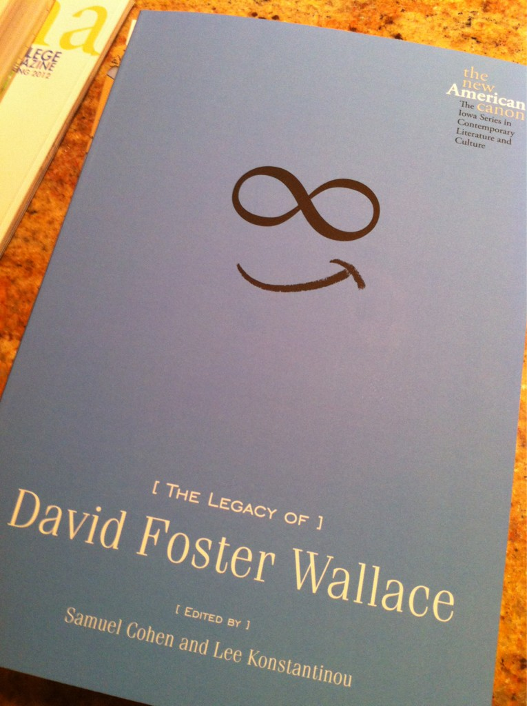

Replying to [@alothian](https://twitter.com/alothian/status/186503704843780098)

> Best to use the "general" category for now\. But there's a large scale review underway\! \#MLA13

 [Sun Apr 01 17:33:53 +0000 2012](https://twitter.com/kfitz/status/186506687082008577)

----

Replying to [@nowviskie and @rgfeal](https://twitter.com/nowviskie/status/186610111882600448)

> Did you? I missed it somehow\. And here I was being sad not to have heard from Stanley today\.

 [Mon Apr 02 00:30:42 +0000 2012](https://twitter.com/kfitz/status/186611579159187456)

----

Replying to [@rgfeal and @nowviskie](https://twitter.com/rgfeal/status/186615199573356544)

> Hey, I have a handwritten note\. Handwritten by\.\.\. someone\.

 [Mon Apr 02 00:53:18 +0000 2012](https://twitter.com/kfitz/status/186617266035630081)

----

> @nowviskie Sadly, no Fish caught in my of my filters, at least that I've uncovered so far\.

 [Mon Apr 02 01:08:41 +0000 2012](https://twitter.com/kfitz/status/186621138313555968)

----

Replying to [@nowviskie](https://twitter.com/nowviskie/status/186626654364385280)

> I can only imagine\! I've enjoyed watching everyone uncover their comments; that and Catblock have made my day\.

 [Mon Apr 02 01:32:03 +0000 2012](https://twitter.com/kfitz/status/186627018090225665)

----

Replying to [@nancybaym](https://twitter.com/nancybaym/status/186788992711274496)

> Enjoy them\! I will continue sending good transitional vibes\.

 [Mon Apr 02 12:17:22 +0000 2012](https://twitter.com/kfitz/status/186789419729158147)

----

Replying to [@samplereality](https://twitter.com/samplereality/status/186797225018527744)

> I'm so sorry: what a horrible weekend\. Here's hoping things take a serious turn for the better\. Immediately\.

 [Mon Apr 02 12:59:02 +0000 2012](https://twitter.com/kfitz/status/186799903287148544)

----

Replying to [@jmittell](https://twitter.com/jmittell/status/186855757973696512)

> Oh, man\. L'As du Falafel is The\. Best\. Ever\. \#jealousy

 [Mon Apr 02 16:43:50 +0000 2012](https://twitter.com/kfitz/status/186856475409383427)

----

Replying to [@jmittell](https://twitter.com/jmittell/status/186857447229620225)

> We ate at Le Komptoir a lot a couple of summers ago \- Rue Quincampoix & Rue de la Reynie, near the Pompidou\. \+

 [Mon Apr 02 16:51:53 +0000 2012](https://twitter.com/kfitz/status/186858502118047744)

----

Replying to [@jmittell](https://twitter.com/jmittell/status/186857447229620225)

> We also had a favorite pizza/pasta place that I cannot find for the life of me\. Something like Pizza San Antonio\.

 [Mon Apr 02 16:59:23 +0000 2012](https://twitter.com/kfitz/status/186860392327290881)

----

> I've started watching Revenge\. I'm 4 episodes in & am mostly enjoying it\. Except for one impossible thing\. Not that no one recognizes her\. \+

 [Tue Apr 03 00:38:43 +0000 2012](https://twitter.com/kfitz/status/186975986900938753)

----

> Not the lifestyles of the 1%\. But that that dog is supposed to be 18 years old\. Really\.

 [Tue Apr 03 00:39:27 +0000 2012](https://twitter.com/kfitz/status/186976168552038401)

----

Replying to [@pmhswe](https://twitter.com/pmhswe/status/186979318247866368)

> It's got some interesting points\. Hard to say right now whether it'll hold up, but people whose taste I trust are into it\.

 [Tue Apr 03 00:59:26 +0000 2012](https://twitter.com/kfitz/status/186981201049952256)

----

Replying to [@rgfeal](https://twitter.com/rgfeal/status/187007043427774465)

> The ebook is free from UChicago P this month\!

 [Tue Apr 03 02:51:01 +0000 2012](https://twitter.com/kfitz/status/187009281051209730)

----

Replying to [@rgfeal](https://twitter.com/rgfeal/status/187015566727458816)

> Rats\. I misread\.

 [Tue Apr 03 03:21:09 +0000 2012](https://twitter.com/kfitz/status/187016864457691136)

----

> RT @MLAnews: What can you do with our XML? Take up the New Variorum Shakespeare Digital Challenge\! http://www\.mla\.org/nvs\_challenge

 [Tue Apr 03 13:53:01 +0000 2012](https://twitter.com/kfitz/status/187175877140946946)

----

Replying to [@samplereality](https://twitter.com/samplereality/status/187249546588454913)

> Hey, congrats\! \(On the progressive shortening of letters, remind me to tell you the parable of the keys\.\)

 [Tue Apr 03 18:51:36 +0000 2012](https://twitter.com/kfitz/status/187251017304391681)

----

> Freelancing for Academics, with @atrubek: http://annetrubek\.com/2012/04/freelancing\-101\-for\-academics/ \(Looks awesome\!\)

 [Tue Apr 03 20:49:20 +0000 2012](https://twitter.com/kfitz/status/187280648963231745)

----

Replying to [@ftrain and @urschrei](https://twitter.com/ftrain/status/187183754245193729)

> Aw, thanks\! I'm happy to get the opportunity to do such fun stuff\.

 [Tue Apr 03 21:45:10 +0000 2012](https://twitter.com/kfitz/status/187294698342318081)

----

> Just got my author copy\. Really looking forward to digging in\. 
> 
> 

 [Wed Apr 04 00:57:55 +0000 2012](https://twitter.com/kfitz/status/187343202628542464)

----

> \(Will confess to finding it the teeeeniest bit funny that my essay on empathy immediately follows remarks from He Who Shall Not Be Named\.\)

 [Wed Apr 04 00:58:54 +0000 2012](https://twitter.com/kfitz/status/187343450847453184)

----

Replying to [@Ed\_Raso](https://twitter.com/Ed_Raso/status/187349395799420928)

> The before\-the\-colon part is "Infinite Summer\."

 [Wed Apr 04 01:32:54 +0000 2012](https://twitter.com/kfitz/status/187352007378608129)

----

Replying to [@Ed\_Raso](https://twitter.com/Ed_Raso/status/187363383866175489)

> Excellent\!

 [Wed Apr 04 02:26:34 +0000 2012](https://twitter.com/kfitz/status/187365514841042945)

----

Replying to [@ftrain](https://twitter.com/ftrain/status/187516443460513792)

> The tyranny of the month\-by\-month calendar\! Where is our celebration of the week view?

 [Wed Apr 04 13:20:17 +0000 2012](https://twitter.com/kfitz/status/187530027942936576)

----

Replying to [@ftrain](https://twitter.com/ftrain/status/187530917621936128)

> Monthers lack the deep perspective to create functional and productive schedules\. It's no wonder they create conflicting events\.

 [Wed Apr 04 13:25:36 +0000 2012](https://twitter.com/kfitz/status/187531365259026432)

----

Replying to [@ftrain](https://twitter.com/ftrain/status/187534891683037184)

> That your "months" are highly irregular, while weeks have a lovely symmetricality, might be read as a metaphor for your "movement\."

 [Wed Apr 04 13:42:18 +0000 2012](https://twitter.com/kfitz/status/187535566898872320)

----

> Thanks, LGA terminal C, for the totally overpriced but pretty tasty glass of wine\. There's something to be said for not flying Continental\.

 [Wed Apr 04 23:57:09 +0000 2012](https://twitter.com/kfitz/status/187690302801330176)

----

Replying to [@cjprender](https://twitter.com/cjp_still/status/187691007075287040)

> I hear that\. I'm on a USAir turboprop, so the next 1\.5 hours promise to be interesting\.

 [Thu Apr 05 00:03:16 +0000 2012](https://twitter.com/kfitz/status/187691840986808321)

----

Replying to [@BryanAlexander](https://twitter.com/BryanAlexander/status/187691406968623104)

> It's called the Victory Grill\. Nice menu, comfy couches, decent music and lighting \- almost like not being in an airport\.

 [Thu Apr 05 00:05:51 +0000 2012](https://twitter.com/kfitz/status/187692490143436800)

----

Replying to [@cjprender](https://twitter.com/cjp_still/status/187692084873011200)

> A shame I don't have the time\.

 [Thu Apr 05 00:06:55 +0000 2012](https://twitter.com/kfitz/status/187692757211553792)

----

> I intend to read a novel on this flight\. I mean, it's Reamde, so I'll be reading \*some\* of a novel\. But it feels decadent nonetheless\.

 [Thu Apr 05 00:25:07 +0000 2012](https://twitter.com/kfitz/status/187697340885368832)

----

Replying to [@CapitolClio](https://twitter.com/CapitolClio/status/187698044572147713)

> It is\! It feels like forever since I've been able to appreciate reading fiction any way other than furtively\.

 [Thu Apr 05 00:29:56 +0000 2012](https://twitter.com/kfitz/status/187698551021764610)

----

Replying to [@CapitolClio](https://twitter.com/CapitolClio/status/187698044572147713)

> For too long, it was either something I was teaching or something I was escaping with\. So nice to enjoy it again\.

 [Thu Apr 05 00:30:40 +0000 2012](https://twitter.com/kfitz/status/187698733671124993)

----

Replying to [@sshreeves](https://twitter.com/sshreeves/status/187697553029087232)

> So good to hear\! I'm only about 20 pages in but am totally into Stephenson's voice again already\.

 [Thu Apr 05 00:32:09 +0000 2012](https://twitter.com/kfitz/status/187699107748511744)

----

Replying to [@jcmeloni](https://twitter.com/jcmeloni/status/187702985571319809)

> I've been so looking forward to it\.

 [Thu Apr 05 00:51:56 +0000 2012](https://twitter.com/kfitz/status/187704085561094145)

----

> Now I really regret not having had that second glass of wine\.

 [Thu Apr 05 03:07:57 +0000 2012](https://twitter.com/kfitz/status/187738319000580097)

----

Replying to [@tcarmody](https://twitter.com/tcarmody/status/187739368633536512)

> Not at midnight in a b&b in Clinton NY I don't think\.

 [Thu Apr 05 03:29:45 +0000 2012](https://twitter.com/kfitz/status/187743804323926017)

----

Replying to [@tcarmody](https://twitter.com/tcarmody/status/187743853925769217)

> Ayup\.

 [Thu Apr 05 03:32:03 +0000 2012](https://twitter.com/kfitz/status/187744383897059328)

----

Replying to [@karikraus](https://twitter.com/karikraus/status/187743760241803264)

> No, just the table of contents, thankfully\!

 [Thu Apr 05 03:33:14 +0000 2012](https://twitter.com/kfitz/status/187744677989056514)

----

Replying to [@tcarmody](https://twitter.com/tcarmody/status/187744766841196544)

> Looking forward to seeing it when it's not midnight\.

 [Thu Apr 05 03:36:07 +0000 2012](https://twitter.com/kfitz/status/187745407261081600)

----

> Congrats, all\! // MT @dancohen: Delighted about the launch of the Journal of Digital Humanities today: http://journalofdigitalhumanities\.org/

 [Thu Apr 05 19:00:47 +0000 2012](https://twitter.com/kfitz/status/187978107024703488)

----

> Starting the journey home from Hamilton College\. Thanks for a great visit to DHi, esp to my fabulous hosts, Angel Nieves & Janet Simons\!

 [Fri Apr 06 15:16:11 +0000 2012](https://twitter.com/kfitz/status/188283969375186945)

----

Replying to [@bfister](https://twitter.com/@bfister/status/188287529018077184)

> I just started it two days ago, but am thoroughly enjoying it so far\.

 [Fri Apr 06 15:56:13 +0000 2012](https://twitter.com/kfitz/status/188294047264288768)

----

Replying to [@pfyfe and @rgfeal](https://twitter.com/pfyfe/status/188295302090981377)

> ScholComm came about as part of a reorg, bringing together the book pubs program and the web group\.

 [Fri Apr 06 16:29:18 +0000 2012](https://twitter.com/kfitz/status/188302369786834945)

----

Replying to [@sshreeves and @bfister](https://twitter.com/sshreeves/status/188300633160417280)

> I adored Cryptonomicon, so was able to get into the Baroque Cycle fairly easily \(though Cryptonomicon remains my fave\)\.

 [Fri Apr 06 16:31:27 +0000 2012](https://twitter.com/kfitz/status/188302910877220864)

----

Replying to [@briancroxall](https://twitter.com/briancroxall/status/188361433120116737)

> Nice\. A good followup to Planned Obsolescence, focusing in on peer review, I think\.\.\.

 [Fri Apr 06 20:25:48 +0000 2012](https://twitter.com/kfitz/status/188361886658596864)

----

Replying to [@Ed\_Raso](https://twitter.com/Ed_Raso/status/188402625375514625)

> Hey, cool \- thanks\!

 [Sat Apr 07 00:21:30 +0000 2012](https://twitter.com/kfitz/status/188421205831847936)

----

Replying to [@Ed\_Raso](https://twitter.com/Ed_Raso/status/188422717001826304)

> I've heard that\!

 [Sat Apr 07 00:36:55 +0000 2012](https://twitter.com/kfitz/status/188425082199212033)

----

Replying to [@amandafrench and @ed\_raso](https://twitter.com/amandafrench/status/188424407780294656)

> Now\! Not sure why Amazon is saying pre\-order again\.\.\.

 [Sat Apr 07 00:38:31 +0000 2012](https://twitter.com/kfitz/status/188425487838740482)

----

> Friday nights are often comfort food oriented\. Tonight's dinner: homemade kale chips and \(not exactly homemade\) tater tots\. So happy\.

 [Sat Apr 07 00:41:51 +0000 2012](https://twitter.com/kfitz/status/188426324581425153)

----

Replying to [@bonniekyburz](https://twitter.com/bdotshiny/status/188433160340643840)

> Kale chips are crazy easy to make… and then you feel virtuous\! Because they're kale\!

 [Sat Apr 07 13:02:06 +0000 2012](https://twitter.com/kfitz/status/188612615646355456)

----

Replying to [@adelinekoh](https://twitter.com/adelinekoh/status/188438244617240577)

> Mmmm\. I will have to try that next time\!

 [Sat Apr 07 13:02:21 +0000 2012](https://twitter.com/kfitz/status/188612676996440064)

----

> I will finish writing this book review today\. I will finish writing this book review today\. I will finish writing this book review today\.

 [Sat Apr 07 15:48:41 +0000 2012](https://twitter.com/kfitz/status/188654537840660480)

----

Replying to [@jmittell and @crsbecker](https://twitter.com/jmittell/status/188662779480248320)

> I quote you on that rationale often: "If not me, then who?"

 [Sat Apr 07 16:23:35 +0000 2012](https://twitter.com/kfitz/status/188663322739085314)

----

Replying to [@bonniekyburz](https://twitter.com/bdotshiny/status/188678844222414849)

> Very simple: Tear up kale, wash, dry THOROUGHLY, toss w/ a little olive oil & salt; bake until crispy\. \+

 [Sat Apr 07 17:28:08 +0000 2012](https://twitter.com/kfitz/status/188679564111777793)

----

Replying to [@bonniekyburz](https://twitter.com/bdotshiny/status/188678844222414849)

> Different recipes had different temperature recommendations & different baking times, so some experimentation is needed\.

 [Sat Apr 07 17:28:47 +0000 2012](https://twitter.com/kfitz/status/188679726938849281)

----

Replying to [@tcarmody](https://twitter.com/tcarmody/status/189011446775021569)

> I've recently returned to Dropbox\. Was using something more secure \(because of that thing that time\) but found it unreliable\.

 [Sun Apr 08 16:37:59 +0000 2012](https://twitter.com/kfitz/status/189029333778698240)

----

Replying to [@tcarmody](https://twitter.com/tcarmody/status/189011446775021569)

> I still worry about that thing that time, but for syncing I can really count on, I haven't found anything better\.

 [Sun Apr 08 16:38:38 +0000 2012](https://twitter.com/kfitz/status/189029496228290562)

----

> Finally managed to get myself past whatever roadblock I was facing: went to the gym for the first time since late November\.

 [Sun Apr 08 20:08:12 +0000 2012](https://twitter.com/kfitz/status/189082236266614784)

----

> Trying to remember what it feels like to have a body I'm actually taking care of rather than just forcing to be still and do more work\.

 [Sun Apr 08 20:09:28 +0000 2012](https://twitter.com/kfitz/status/189082555671252993)

----

Replying to [@tcarmody](https://twitter.com/tcarmody/status/189085098434502657)

> You got it\.

 [Sun Apr 08 20:25:37 +0000 2012](https://twitter.com/kfitz/status/189086617670123521)

----

Replying to [@Ed\_Raso](https://twitter.com/Ed_Raso/status/189086872247615488)

> That's pretty serious\!

 [Sun Apr 08 20:27:28 +0000 2012](https://twitter.com/kfitz/status/189087084273860609)

----

Replying to [@Ed\_Raso](https://twitter.com/Ed_Raso/status/189087392353882115)

> Ah well\. Lemons, lemonade, etc\.

 [Sun Apr 08 20:29:12 +0000 2012](https://twitter.com/kfitz/status/189087520942854144)

----

Replying to [@rgfeal](https://twitter.com/rgfeal/status/189097128822448130)

> You cannot imagine how much I've been missing the Hudson\. Wish I had easier outdoor activity access…

 [Sun Apr 08 21:10:00 +0000 2012](https://twitter.com/kfitz/status/189097785587539968)

----

Replying to [@savasavasava](https://twitter.com/savasavasava/status/189130841291628548)

> It looks like those might be "forever" stamps \- if they don't have a printed value, they stay good regardless of increases\.

 [Mon Apr 09 00:43:36 +0000 2012](https://twitter.com/kfitz/status/189151540848766976)

----

Replying to [@alothian](https://twitter.com/alothian/status/189402255550709763)

> Congratulations\!\!\!

 [Mon Apr 09 18:20:38 +0000 2012](https://twitter.com/kfitz/status/189417553611866112)

----

> Headed to SFO in the morning, to give a talk at Stanford in the afternoon\. If you're around, come say hi\!

 [Tue Apr 10 01:11:34 +0000 2012](https://twitter.com/kfitz/status/189520966655807489)

----

Replying to [@mccormicktim](https://twitter.com/tmccormick/status/189516649915891712)

> Yes, Tuesday at 4\.30 and Wednesday at noon, I think\. I can't find any info on the web about it either\.

 [Tue Apr 10 01:30:37 +0000 2012](https://twitter.com/kfitz/status/189525760799817728)

----

Replying to [@triproftri](https://twitter.com/triproftri/status/189521358680629249)

> I can't find info on the web, either\. :\( The talk tomorrow is at 4\.15 in Pigott Hall \-\- I hope it's been announced\!

 [Tue Apr 10 01:32:35 +0000 2012](https://twitter.com/kfitz/status/189526257761910786)

----

> @mccormicktim Whoops \-\- that's 4\.15, not 4\.30\. Pigott Hall, apparently\. That's all I know\.

 [Tue Apr 10 01:33:05 +0000 2012](https://twitter.com/kfitz/status/189526384606056448)

----

Replying to [@mccormicktim, @triproftri and @adelinekoh](https://twitter.com/tmccormick/status/189529245410803712)

> I only know that Weds is at noon\. Tues talk is "Planned Obsolescence and the Future of Peer Review\." \+

 [Tue Apr 10 01:55:40 +0000 2012](https://twitter.com/kfitz/status/189532067011375104)

----

Replying to [@mccormicktim, @triproftri and @adelinekoh](https://twitter.com/tmccormick/status/189529245410803712)

> Weds is a workshop called "The Digital Future of the Profession\." More informal, discussion\-oriented\.

 [Tue Apr 10 01:57:58 +0000 2012](https://twitter.com/kfitz/status/189532646265733120)

----

Replying to [@mccormicktim, @triproftri and @adelinekoh](https://twitter.com/tmccormick/status/189536085741801473)

> Thank you\! If I get more info, I'll let you know asap\.

 [Tue Apr 10 02:15:43 +0000 2012](https://twitter.com/kfitz/status/189537110674522113)

----

> RT @nowviskie: This: https://twitter\.com/whitneytrettien/status/189473378044882945 and that: https://twitter\.com/miriamkp/status/189522403234283520 // Exactly\.

 [Tue Apr 10 02:17:13 +0000 2012](https://twitter.com/kfitz/status/189537490120617984)

----

Replying to [@ernestopriego](https://twitter.com/ernestopriego/status/189644348256813057)

> \!\!\! \#itisnt

 [Tue Apr 10 09:30:48 +0000 2012](https://twitter.com/kfitz/status/189646603131420672)

----

> Driver, pulling up in front of my bldg 5min early: "You're not a real New Yorker\. They're always 15 minutes late and telling me to hurry\."

 [Tue Apr 10 09:36:04 +0000 2012](https://twitter.com/kfitz/status/189647927709405184)

----

Replying to [@ernestopriego](https://twitter.com/ernestopriego/status/189655010555072514)

> Even a basic sense of professional self\-censorship would keep one from saying something that stupid, you'd think\.

 [Tue Apr 10 10:12:12 +0000 2012](https://twitter.com/kfitz/status/189657020570406912)

----

> On board my flight to SFO\. Used miles to upgrade\. Suspect that I will have enough legroom\. 
> 
> 

 [Tue Apr 10 11:25:20 +0000 2012](https://twitter.com/kfitz/status/189675421258874880)

----

Replying to [@captain\_primate](https://twitter.com/EthanWatrall/status/189676448724946945)

> Yeah, it's at least seven feet\. I've never seen anything like it\.

 [Tue Apr 10 11:36:11 +0000 2012](https://twitter.com/kfitz/status/189678158914662400)

----

> Hey, awesome\! // RT @ernestopriego: @kfitz we got cited\! :\) http://ir\.lib\.uwo\.ca/cgi/viewcontent\.cgi?article\=1056&context\=entrehojas \[PDF\]

 [Tue Apr 10 11:42:19 +0000 2012](https://twitter.com/kfitz/status/189679699172143104)

----

Replying to [@rgfeal](https://twitter.com/rgfeal/status/189680200718618627)

> Will do\!

 [Tue Apr 10 11:45:46 +0000 2012](https://twitter.com/kfitz/status/189680571247628288)

----

> Okay: power, wifi, and seven feet of legroom\. Once I've got a cup of coffee, my inflight productivity ensemble will be complete\.

 [Tue Apr 10 12:29:36 +0000 2012](https://twitter.com/kfitz/status/189691601528954880)

----

> RT @nowviskie: ACH has a new Executive Secretary\! Welcome, @veek\! \-\- & we're so grateful to @leoba for her years of service: http://t\.co \.\.\.

 [Tue Apr 10 12:57:52 +0000 2012](https://twitter.com/kfitz/status/189698715127255040)

----

Replying to [@eetempleton](https://twitter.com/eetempleton/status/189701059256664064)

> On it\.

 [Tue Apr 10 13:14:05 +0000 2012](https://twitter.com/kfitz/status/189702797053280256)

----

Replying to [@rgfeal](https://twitter.com/rgfeal/status/190079873467949057)

> We were the poster child for consortial cooperation\!

 [Wed Apr 11 14:17:38 +0000 2012](https://twitter.com/kfitz/status/190081175820308480)

----

Replying to [@mkgold and @boone](https://twitter.com/mkgold/status/190180467251752962)

> OY\.

 [Wed Apr 11 21:42:27 +0000 2012](https://twitter.com/kfitz/status/190193118333763584)

----

Replying to [@savasavasava](https://twitter.com/savasavasava/status/190273416408997888)

> AWWW\! Thanks so much\. He looks very regal there\.

 [Thu Apr 12 03:26:33 +0000 2012](https://twitter.com/kfitz/status/190279712793296896)

----

> RT @amandafrench: Okay, we're so having a session on the New Variorum Shakespeare Digital Challenge at \#THATCamp @CHNM: http://bit\.ly/IRUHqm

 [Thu Apr 12 03:46:31 +0000 2012](https://twitter.com/kfitz/status/190284737414311937)

----

Replying to [@triproftri](https://twitter.com/triproftri/status/190281116350025729)

> I'm sorry to have missed you, too\! Another time, I'm sure\.

 [Thu Apr 12 04:48:11 +0000 2012](https://twitter.com/kfitz/status/190300257169575937)

----

> Los Angeles\! You still have sun here\! I am headed toward your burritos\.

 [Thu Apr 12 20:19:30 +0000 2012](https://twitter.com/kfitz/status/190534628359155712)

----

Replying to [@savasavasava](https://twitter.com/savasavasava/status/190535192144912384)

> I'm somewhat jealous of the future me who will actually have a burrito, too\!

 [Thu Apr 12 20:36:56 +0000 2012](https://twitter.com/kfitz/status/190539017782169601)

----

Replying to [@halavais](https://twitter.com/halavais/status/190545191365652480)

> Hey, fantastic\! Thanks so much\.

 [Thu Apr 12 21:07:49 +0000 2012](https://twitter.com/kfitz/status/190546789777162243)

----

> RT @halavais: Quick review of @kfitz 's "Planned Obsolescence" \(50% chanced I spelled that right\) on the blog: http://bit\.ly/HAQWuG

 [Thu Apr 12 21:08:00 +0000 2012](https://twitter.com/kfitz/status/190546835746725889)

----

Replying to [@savasavasava](https://twitter.com/savasavasava/status/190571459050094593)

> Aw\! Serious kitty\!

 [Thu Apr 12 22:47:32 +0000 2012](https://twitter.com/kfitz/status/190571882578329600)

----

> RT @wynkenhimself: @KroweK & @EVisconsi's The Tempest for iPad is now out\. Congrats\!  
> app: http://bit\.ly/HGd6Ja info: http://bit\.ly/HGdgAj

 [Fri Apr 13 15:59:58 +0000 2012](https://twitter.com/kfitz/status/190831703680491520)

----

Replying to [@LibSkrat](https://twitter.com/LibSkrat/status/190850922254057474)

> There are many things I like abt @spideroak \(security the most obvious among them\) but I had terrible trouble with sync failures\.

 [Fri Apr 13 17:39:53 +0000 2012](https://twitter.com/kfitz/status/190856848000290816)

----

Replying to [@LibSkrat](https://twitter.com/LibSkrat/status/190858018362097666)

> Hmmm\. Makes me wonder whether there was something wrong in my setup\. Most of the time it was fine, and then I'd open a doc \+

 [Fri Apr 13 17:46:40 +0000 2012](https://twitter.com/kfitz/status/190858555795058689)

----

Replying to [@LibSkrat](https://twitter.com/LibSkrat/status/190858018362097666)

> only to discover that it was an old version, and that while it claimed sync was working fine, it wasn't actually syncing\.

 [Fri Apr 13 17:47:26 +0000 2012](https://twitter.com/kfitz/status/190858748091318272)

----

Replying to [@LibSkrat](https://twitter.com/LibSkrat/status/190859317971394560)

> Yeah, it actually made me go back to the other guys for most of my basic sync needs, which I didn't want to do\.

 [Fri Apr 13 17:51:37 +0000 2012](https://twitter.com/kfitz/status/190859802736459776)

----

Replying to [@nancybaym](https://twitter.com/nancybaym/status/191133836170637314)

> Congratulations, and best wishes for an equally speedy transaction on the other side\.

 [Sat Apr 14 13:07:26 +0000 2012](https://twitter.com/kfitz/status/191150673126105088)

----

> At what promises to be an amazing meeting today; follow along at \#FemTechNet\.

 [Sat Apr 14 17:26:28 +0000 2012](https://twitter.com/kfitz/status/191215862890512385)

----

Replying to [@nancybaym](https://twitter.com/nancybaym/status/191215784687714304)

> WHOAAAAA WE'RE HALFWAY THE\-YARE

 [Sat Apr 14 17:28:13 +0000 2012](https://twitter.com/kfitz/status/191216301233020928)

----

Replying to [@nancybaym](https://twitter.com/nancybaym/status/191216826368270338)

> I can hear it from here\!

 [Sat Apr 14 17:31:02 +0000 2012](https://twitter.com/kfitz/status/191217010829574144)

----

> RT @tmcphers: \#FemTechNet Can't wait for Fall 2013 to see this open massively collaborative feminist technology course come to life\! Gon \.\.\.

 [Sat Apr 14 22:28:45 +0000 2012](https://twitter.com/kfitz/status/191291934097145858)

----

> I finally adjusted to west coast time, just in time to get up at 3\.30 for my flight back east\. \*sigh\*

 [Sun Apr 15 12:20:22 +0000 2012](https://twitter.com/kfitz/status/191501216122015745)

----

Replying to [@mariabustillos](https://twitter.com/mariabustillos/status/191501804301852672)

> Figures\! Sorry to have missed you \- next time, I hope\.

 [Sun Apr 15 12:28:32 +0000 2012](https://twitter.com/kfitz/status/191503269791662080)

----

> Arlington\! What's up with the summer?

 [Sun Apr 15 19:58:02 +0000 2012](https://twitter.com/kfitz/status/191616389600129024)

----

> Needless to say, not sure I agree entirely with the Ayers claim in the previous RT, but I get what he's driving at\.

 [Sun Apr 15 23:22:22 +0000 2012](https://twitter.com/kfitz/status/191667814493462528)

----

Replying to [@mckenziewark and @pannapacker](https://twitter.com/mckenziewark/status/191669577074221056)

> Srsly, right?

 [Sun Apr 15 23:33:40 +0000 2012](https://twitter.com/kfitz/status/191670656813903872)

----

Replying to [@pannapacker and @mckenziewark](https://twitter.com/pannapacker/status/191671236991008769)

> Actually, that was about the claim that there isn't long\-form digital scholarship, not about metadata\.

 [Sun Apr 15 23:39:15 +0000 2012](https://twitter.com/kfitz/status/191672063445053440)

----

Replying to [@nancybaym](https://twitter.com/nancybaym/status/191675510542188544)

> Sending hugs your way, if only digital ones\.\.\.

 [Sun Apr 15 23:57:13 +0000 2012](https://twitter.com/kfitz/status/191676585282244608)

----

> Completely looking forward to tomorrow's conversations at the \#NITLE Summit, but tonight, completely collapsing\.

 [Mon Apr 16 00:29:45 +0000 2012](https://twitter.com/kfitz/status/191684770776875008)

----

> Slept something like 9\.5 hours\. Have awakened with miserable sore throat\. A little concerned about how today will go\.

 [Mon Apr 16 10:35:10 +0000 2012](https://twitter.com/kfitz/status/191837130945867776)

----

> Back at \#NITLE Summit this morning; awaiting keynote by Alan Kay\.

 [Mon Apr 16 13:08:31 +0000 2012](https://twitter.com/kfitz/status/191875719847096322)

----

Replying to [@LibSkrat](https://twitter.com/LibSkrat/status/191876616320847872)

> Srsly\!

 [Mon Apr 16 13:19:04 +0000 2012](https://twitter.com/kfitz/status/191878375541972992)

----

> Alan Kay, on one of McLuhan's "pithy statements about everything": "If I can't believe it, I can't see it\." \#NITLE

 [Mon Apr 16 13:21:47 +0000 2012](https://twitter.com/kfitz/status/191879059490344960)

----

> Kay: "news" \= stuff that fits with what we already know\. Genuinely "new" \= that which we cannot understand \- profound problem for learning\.

 [Mon Apr 16 13:29:34 +0000 2012](https://twitter.com/kfitz/status/191881020256165889)

----

> Alan Kay: Learning a new idea requires almost as much creativity as the original invention\. \#NITLE

 [Mon Apr 16 13:33:10 +0000 2012](https://twitter.com/kfitz/status/191881924963348482)

----

> Alan Kay on the structure of the liberal arts into separate departments: "That cannot possibly be a good idea\." \#NITLE

 [Mon Apr 16 13:36:43 +0000 2012](https://twitter.com/kfitz/status/191882817184071681)

----

Replying to [@LibSkrat](https://twitter.com/LibSkrat/status/191883130959953920)

> This is in response to which tweet?

 [Mon Apr 16 13:38:47 +0000 2012](https://twitter.com/kfitz/status/191883337206480896)

----

Replying to [@LibSkrat](https://twitter.com/LibSkrat/status/191883400053915650)

> Gotcha\. Was about the segmentation of thinking into separable units, rather than thinking together\.

 [Mon Apr 16 13:40:42 +0000 2012](https://twitter.com/kfitz/status/191883819262025729)

----

Replying to [@LibSkrat](https://twitter.com/LibSkrat/status/191884017518395392)

> Indeed\. When resources are allocated to depts, depts will be in conflict with one another\. Kay's focused on ?s of learning today\.

 [Mon Apr 16 13:43:26 +0000 2012](https://twitter.com/kfitz/status/191884507392114689)

----

> Kay: liberal arts faculty actually poorly educated, bc restricted to their own specialties\. \(Reminds me of http://matt\.might\.net/articles/phd\-school\-in\-pictures/\) \#NITLE

 [Mon Apr 16 13:51:29 +0000 2012](https://twitter.com/kfitz/status/191886533383553024)

----

Replying to [@rgfeal and @amndw2](https://twitter.com/rgfeal/status/191888580472356864)

> 2 separate events in sequence\. But hashtag is \#NITLE for both\.

 [Mon Apr 16 14:01:31 +0000 2012](https://twitter.com/kfitz/status/191889059608670208)

----

Replying to [@FrostDavis](https://twitter.com/FrostDavis/status/191889481585000449)

> I must have misunderstood Bryan's announcement; sounded like 1 hashtag for both\.

 [Mon Apr 16 14:05:25 +0000 2012](https://twitter.com/kfitz/status/191890041558147072)

----

> RT @jmittell: I'll be posting a new chapter of @ComplexTV later this week but pls read/discuss previous chapters now at http://bit\.ly/gcw5hc

 [Mon Apr 16 15:07:03 +0000 2012](https://twitter.com/kfitz/status/191905549221240832)

----

> What do I love about Neal Stephenson? In the middle of a sweaty\-palms action sequence, the phrase "they had perforce arranged\.\.\."

 [Mon Apr 16 22:40:21 +0000 2012](https://twitter.com/kfitz/status/192019627411382274)

----

Replying to [@jbj](https://twitter.com/jbj/status/192018407862972418)

> Thank Emancipation Day\.

 [Mon Apr 16 22:41:17 +0000 2012](https://twitter.com/kfitz/status/192019863852695552)

----

> "When moving about the train, shoes must be worn at all times\." It kills me the things we have to say out loud these days\. \#offamylawn

 [Mon Apr 16 23:01:10 +0000 2012](https://twitter.com/kfitz/status/192024865954476032)

----

> So thoroughly sorry to have missed @dancohen at \#NITLE\. Happy to be following via weirdly functional Amtrak wifi\.

 [Mon Apr 16 23:14:03 +0000 2012](https://twitter.com/kfitz/status/192028107597819904)

----

> RT @swarthmoreburke: Here REALLY agree w/ @dancohen\. My view is that here our technological environment lets us keep our scholarly promi \.\.\.

 [Mon Apr 16 23:51:34 +0000 2012](https://twitter.com/kfitz/status/192037551257829379)

----

Replying to [@swarthmoreburke](https://twitter.com/swarthmoreburke/status/192037872730247169)

> A serious question\. Also how the model will circumvent groupthink, giving voice to those who could go unheard\. \#NITLESym

 [Mon Apr 16 23:55:27 +0000 2012](https://twitter.com/kfitz/status/192038525800153088)

----

Replying to [@swarthmoreburke](https://twitter.com/swarthmoreburke/status/192037872730247169)

> PS: Sorry to have missed you \- left \#NITLE at 4 today…

 [Mon Apr 16 23:55:46 +0000 2012](https://twitter.com/kfitz/status/192038606796365824)

----

Replying to [@savasavasava](https://twitter.com/savasavasava/status/192038536940228609)

> Oh dear\. This does not make me look forward to re\-entry\.

 [Mon Apr 16 23:58:30 +0000 2012](https://twitter.com/kfitz/status/192039297078149120)

----

> RT @GardnerCampbell: My question is how to find community when scholars persistently define rigor as snarky combativeness\. \#nitlesym

 [Tue Apr 17 00:09:17 +0000 2012](https://twitter.com/kfitz/status/192042009068965888)

----

Replying to [@savasavasava](https://twitter.com/savasavasava/status/192049516558561281)

> Oh\. Um\. Great\. \*sigh\*

 [Tue Apr 17 00:43:30 +0000 2012](https://twitter.com/kfitz/status/192050618280579072)

----

Replying to [@Crepuscularsofa](https://twitter.com/@Crepuscularsofa/status/192049393308934144)

> Wait, what? Whose account is getting shut down? Honestly haven't a clue what you mean\. Do tell\!

 [Tue Apr 17 01:02:04 +0000 2012](https://twitter.com/kfitz/status/192055292027084800)

----

Replying to [@Crepuscularsofa](https://twitter.com/@Crepuscularsofa/status/192057215077720064)

> Honestly, I know nothing of either account or complaint\. Will look into\.

 [Tue Apr 17 01:12:01 +0000 2012](https://twitter.com/kfitz/status/192057798123728897)

----

Replying to [@brettbobley](https://twitter.com/brettbobley/status/192062485874999297)

> \*\*sigh\*\*

 [Tue Apr 17 01:32:35 +0000 2012](https://twitter.com/kfitz/status/192062971856424961)

----

> RT @HesterBlum: MLA\-field folks, please contribute to this survey on Academic Workforce Data\-\-see more from @MichaelBerube1 here: http:/ \.\.\.

 [Tue Apr 17 02:55:26 +0000 2012](https://twitter.com/kfitz/status/192083821951332353)

----

Replying to [@joguldi](https://twitter.com/joguldi/status/192372505296633856)

> WOO HOO\! Congrats, Jo\!

 [Tue Apr 17 23:11:50 +0000 2012](https://twitter.com/kfitz/status/192389938510184448)

----

> I spent the day positively sweltering in my office\. It now seems worth it\. 
> 
> 

 [Tue Apr 17 23:12:53 +0000 2012](https://twitter.com/kfitz/status/192390197885939713)

----

Replying to [@jwolman](https://twitter.com/jwolman/status/192385732608917505)

> Very interesting\. I'll be curious to see how that plays out\.\.\.

 [Tue Apr 17 23:22:05 +0000 2012](https://twitter.com/kfitz/status/192392520225927168)

----

Replying to [@savasavasava](https://twitter.com/savasavasava/status/192616727182454784)

> No, you are not\.

 [Wed Apr 18 15:00:11 +0000 2012](https://twitter.com/kfitz/status/192628600674066434)

----

Replying to [@mariabustillos](https://twitter.com/mariabustillos/status/192615570624102400)

> Congrats; it is gorgeous\!

 [Wed Apr 18 15:00:21 +0000 2012](https://twitter.com/kfitz/status/192628641849548801)

----

> You know what would be awesome? Breathing\. I would really like breathing, I think\.

 [Thu Apr 19 03:36:49 +0000 2012](https://twitter.com/kfitz/status/192819009840881667)

----

Replying to [@nick\_maniatis](https://twitter.com/nick_maniatis/status/192826402939207680)

> Hey, thanks\! The comments on the draft site really helped in the revision process\.

 [Thu Apr 19 12:00:40 +0000 2012](https://twitter.com/kfitz/status/192945810432999425)

----

Replying to [@ftrain](https://twitter.com/ftrain/status/193332847032020992)

> Babies are rating you, too; they just wait until early adolescence to tell you\.

 [Fri Apr 20 13:53:07 +0000 2012](https://twitter.com/kfitz/status/193336498345611265)

----

Replying to [@wynkenhimself](https://twitter.com/wynkenhimself/status/193369168022732801)

> It could be\. Fair use is not just about excerpt %, but also about market effect and transformative use… \+

 [Fri Apr 20 16:04:06 +0000 2012](https://twitter.com/kfitz/status/193369461049401345)

----

Replying to [@wynkenhimself](https://twitter.com/wynkenhimself/status/193369168022732801)

> If the excerpt is posted in order to be discussed/explicated/commented upon, that counts as transformative\.

 [Fri Apr 20 16:04:46 +0000 2012](https://twitter.com/kfitz/status/193369627647148033)

----

Replying to [@wynkenhimself](https://twitter.com/wynkenhimself/status/193369922481569792)

> Transformative is good\. It's why quotations in criticism are de facto fair use; they're always included to be commented upon\.

 [Fri Apr 20 16:07:06 +0000 2012](https://twitter.com/kfitz/status/193370214077972481)

----

Replying to [@wynkenhimself](https://twitter.com/wynkenhimself/status/193370061539520512)

> Hmmm\. I take it that it's not available to be linked to?

 [Fri Apr 20 16:07:52 +0000 2012](https://twitter.com/kfitz/status/193370409779998720)

----

Replying to [@wynkenhimself](https://twitter.com/wynkenhimself/status/193370840547594240)

> Sigh\. I think there's a potential fair use claim in that the excerpt won't affect the market value of the collection\. \+

 [Fri Apr 20 16:10:15 +0000 2012](https://twitter.com/kfitz/status/193371005836726272)

----

Replying to [@wynkenhimself](https://twitter.com/wynkenhimself/status/193370840547594240)

> The key thing tho is that fair use is fuzzy, and only a defensive claim rather than a right per se\.

 [Fri Apr 20 16:11:02 +0000 2012](https://twitter.com/kfitz/status/193371202897707008)

----

Replying to [@wynkenhimself](https://twitter.com/wynkenhimself/status/193370840547594240)

> So it's always a judgment call\. Likely the worst that would happen would be a takedown request\.

 [Fri Apr 20 16:11:39 +0000 2012](https://twitter.com/kfitz/status/193371357969530880)

----

Replying to [@jwolman and @tcarmody](https://twitter.com/jwolman/status/193382477522403328)

> It is freaking me out that you are having this conversation in my timeline\. Worlds collide, man\.

 [Fri Apr 20 16:57:51 +0000 2012](https://twitter.com/kfitz/status/193382987784650753)

----

Replying to [@savasavasava](https://twitter.com/savasavasava/status/193387507214323712)

> Yay, you're there\! I'm stuck in a meeting all day so couldn't get there\. Go @mkgold\!

 [Fri Apr 20 17:17:16 +0000 2012](https://twitter.com/kfitz/status/193387873603555328)

----

> RT @MLAconvention: Hundreds of part\-time profs in all fields have documented their working conditions here\. Have you? http://t\.co/OwVSli \.\.\.

 [Sat Apr 21 04:00:46 +0000 2012](https://twitter.com/kfitz/status/193549814607261697)

----

Replying to [@profwernimont](https://twitter.com/profwernimont/status/193718203430608896)

> I'll be thinking about your brother\! My partner was in the navy & I know how odd the military/academic disconnect can feel\.

 [Sat Apr 21 16:36:45 +0000 2012](https://twitter.com/kfitz/status/193740064730263552)

----

> LGA &gt; ORD\. Talk at Northwestern tomorrow, plus panel discussion with  @tmcphers and @KroweK\.

 [Sun Apr 22 13:57:53 +0000 2012](https://twitter.com/kfitz/status/194062472649510912)

----

Replying to [@KelliMarshall](https://twitter.com/KelliMarshall/status/194063871101771776)

> I do fly a lot, but my travel schedule pales by comparison to that of @samplereality\.

 [Sun Apr 22 14:07:51 +0000 2012](https://twitter.com/kfitz/status/194064979664715777)

----

Replying to [@LibSkrat](https://twitter.com/LibSkrat/status/194067847100641281)

> Not this time, alas\. Maybe another time?

 [Sun Apr 22 14:41:19 +0000 2012](https://twitter.com/kfitz/status/194073403815247872)

----

> RT @MLAnews: MLA Commons gets support from the Mellon Foundation: http://www\.mla\.org/news\_from\_mla/news\_topic&topic\=573

 [Mon Apr 23 20:44:42 +0000 2012](https://twitter.com/kfitz/status/194527239096897536)

----

Replying to [@tmcphers](https://twitter.com/tmcphers/status/194527932721532928)

> Why, thank you\. And a well\-timed announcement, no?

 [Mon Apr 23 20:48:38 +0000 2012](https://twitter.com/kfitz/status/194528228604514305)

----

> Thanks, all, for the congrats and good wishes\. Look for lots of MLA Commons excitement at @MLAconvention\!

 [Mon Apr 23 21:22:42 +0000 2012](https://twitter.com/kfitz/status/194536800725893120)

----

> Happy to be on a panel talking about the humanities in the digital age with @tmcphers and @KroweK \- right now, in fact\!

 [Mon Apr 23 21:28:22 +0000 2012](https://twitter.com/kfitz/status/194538228517310464)

----

> RT @tmcphers: @KroweK demos her new Shakespeare app: love the humanist as maker that she models

 [Mon Apr 23 21:39:24 +0000 2012](https://twitter.com/kfitz/status/194541004248981506)

----

Replying to [@literarychica](https://twitter.com/literarychica/status/194764008937619456)

> Ooh, I managed to miss this yesterday\. Congratulations\!

 [Tue Apr 24 12:48:17 +0000 2012](https://twitter.com/kfitz/status/194769734389071873)

----

Replying to [@allistelling and @hybridped](https://twitter.com/allistelling/status/194836464918470656)

> Very cool; thank you\! I'll look forward to reading more\.

 [Tue Apr 24 21:46:06 +0000 2012](https://twitter.com/kfitz/status/194905079504060416)

----

Replying to [@nowviskie, @dancohen, @sramsay and @cforster](https://twitter.com/nowviskie/status/195096065081483264)

> Aw, man\. Now I'm hungry\.

 [Wed Apr 25 10:41:24 +0000 2012](https://twitter.com/kfitz/status/195100190263345152)

----

> Many thanks to @joshhonn @claireystew and everybody at Northwestern who made my visit so engaging\! \(Not to mention @tmcphers and @KroweK\!\)

 [Wed Apr 25 12:45:17 +0000 2012](https://twitter.com/kfitz/status/195131364251668480)

----

> That said, I am sooo happy to be back sitting at my desk today\.

 [Wed Apr 25 13:04:19 +0000 2012](https://twitter.com/kfitz/status/195136153152790528)

----

> Haven't gotten to dive in yet, but some interesting talks from UF symposium on Digital Platforms & the Future of Books: http://bit\.ly/IYJKZv

 [Wed Apr 25 17:52:19 +0000 2012](https://twitter.com/kfitz/status/195208631829012480)

----

> Having experimented with Wunderlist for a bit, am contemplating return to a plaintext to\-do list\. Fewer bells & whistles; life at a glance\.

 [Thu Apr 26 12:26:33 +0000 2012](https://twitter.com/kfitz/status/195489039573467136)

----

Replying to [@acavender](https://twitter.com/acavender/status/195493587956416512)

> Nice; thanks for the suggestion\!

 [Thu Apr 26 12:46:18 +0000 2012](https://twitter.com/kfitz/status/195494010083741696)

----

Replying to [@JenHoward](https://twitter.com/JenHoward/status/195549351853031424)

> How did you know?

 [Thu Apr 26 16:35:17 +0000 2012](https://twitter.com/kfitz/status/195551635882254336)

----

Replying to [@johnmjones](https://twitter.com/johnmjones/status/195597605835784193)

> Aw\! What a doll\. Congrats to all\!

 [Thu Apr 26 21:14:30 +0000 2012](https://twitter.com/kfitz/status/195621901337497600)

----

Replying to [@mkirschenbaum](https://twitter.com/mkirschenbaum/status/195855518940663808)

> That is indeed really cool\.

 [Fri Apr 27 12:51:35 +0000 2012](https://twitter.com/kfitz/status/195857725165539328)

----

Replying to [@dancohen](https://twitter.com/dancohen/status/195866786783166465)

> Hooray\! Very much looking forward to talking with you\.

 [Fri Apr 27 13:29:37 +0000 2012](https://twitter.com/kfitz/status/195867298756698113)

----

> Wait\! What's that? A blog post?   
>   
> A Constant Process of Not\-Falling: http://www\.plannedobsolescence\.net/blog/a\-constant\-process\-of\-not\-falling/

 [Fri Apr 27 13:55:25 +0000 2012](https://twitter.com/kfitz/status/195873788578111489)

----

Replying to [@karikraus](https://twitter.com/karikraus/status/195888755477975041)

> Fantastic news\! Congratulations\!

 [Fri Apr 27 15:05:47 +0000 2012](https://twitter.com/kfitz/status/195891497722327041)

----

Replying to [@laura11D](https://twitter.com/laura11D/status/195889409869086720)

> If this is a certain former blogger, please pass on my good wishes and fond memories\. I still miss her\.

 [Fri Apr 27 15:07:11 +0000 2012](https://twitter.com/kfitz/status/195891850668810240)

----

Replying to [@samplereality](https://twitter.com/samplereality/status/195927051344154625)

> Worried in what direction? Too dry?

 [Fri Apr 27 17:35:18 +0000 2012](https://twitter.com/kfitz/status/195929125448462337)

----

Replying to [@samplereality](https://twitter.com/samplereality/status/195929429459996673)

> You might try soaking it in a glass of water, root end down, for about an hour\. Mine responds well to that after I'm away\.

 [Fri Apr 27 17:37:11 +0000 2012](https://twitter.com/kfitz/status/195929600885403648)

----

Replying to [@eetempleton](https://twitter.com/eetempleton/status/196218587374039041)

> Hey, congratulations\! Well deserved\!

 [Sat Apr 28 13:43:39 +0000 2012](https://twitter.com/kfitz/status/196233219073519616)

----

> Pomona College ITS is seeking an Academic Applications Mgr; see http://www\.pomona\.edu/administration/human\-resources/employment/staff\-jobs\.aspx \(scroll down to the first position under "technical"\)\.

 [Sat Apr 28 14:40:17 +0000 2012](https://twitter.com/kfitz/status/196247470869708801)

----

> By the by, on that Pomona IT gig: the list of skills is a dream list; candidates are not expected to have all of them\. http://www\.pomona\.edu/administration/human\-resources/employment/staff\-jobs\.aspx

 [Sat Apr 28 14:41:09 +0000 2012](https://twitter.com/kfitz/status/196247686083645443)

----

Replying to [@hollykruse](https://twitter.com/hollykruse/status/196306282695770112)

> It's almost as funny to me as the credit card machines at stores that say "Is $37\.68 OK?" An existential question, that\.

 [Sat Apr 28 18:39:26 +0000 2012](https://twitter.com/kfitz/status/196307655093002240)

----

> I'm having RSS difficulties\! Info here: http://www\.plannedobsolescence\.net/blog/placeholder\-2/

 [Sat Apr 28 19:27:16 +0000 2012](https://twitter.com/kfitz/status/196319689834631169)

----

Replying to [@dancohen](https://twitter.com/dancohen/status/196313149790621696)

> They got pharmahacked a while back; I think they cleaned the site but may not have asked the Goog for a recrawl\.

 [Sat Apr 28 19:28:29 +0000 2012](https://twitter.com/kfitz/status/196319996488593411)

----

Replying to [@dancohen](https://twitter.com/dancohen/status/196314563971514368)

> Whoops\. So they didn't clean it all that well after all\.

 [Sat Apr 28 19:28:49 +0000 2012](https://twitter.com/kfitz/status/196320082266300416)

----

Replying to [@noctambulate](https://twitter.com/noctambulate/status/196340525740199936)

> I never knew you spent time in BR\. I'm from there\!

 [Sat Apr 28 21:21:15 +0000 2012](https://twitter.com/kfitz/status/196348376428716032)

----

Replying to [@noctambulate](https://twitter.com/noctambulate/status/196350828121034753)

> Wow, amazing\. I was there from age 3 to 23 so had an adolescence or two myself\.\.\.

 [Sat Apr 28 22:28:47 +0000 2012](https://twitter.com/kfitz/status/196365371857575937)

----

> Most of Fri &amp; all of Sat was in the last \#p2pReview meeting\. Fabulous but exhausting\. Today has been laundry, reading, yoga\. Just fabulous\.

 [Sun Apr 29 22:48:46 +0000 2012](https://twitter.com/kfitz/status/196732786395185152)

----

Replying to [@kfitz](https://twitter.com/nancybaym/status/196764918840705025)

> Oh, @nancybaym, you know that in the land of Facebook there are no strangers \- just people you haven't friended yet\.

 [Mon Apr 30 01:00:20 +0000 2012](https://twitter.com/kfitz/status/196765897837387776)

----

Replying to [@tcarmody](https://twitter.com/tcarmody/status/196785914792513538)

> As if I weren't already sad that I  can't make it to @thatcamp Prime\.\.\.

 [Mon Apr 30 02:23:35 +0000 2012](https://twitter.com/kfitz/status/196786848784318464)

----

Replying to [@dancohen](https://twitter.com/dancohen/status/196787339450793984)

> Not even remotely sick of you\. Alas, I wil be speaking at ElPub, in Portugal\. http://www\.elpub\.net/Elpub\_2012/Main\_Page\.html \#humblebrag

 [Mon Apr 30 02:29:07 +0000 2012](https://twitter.com/kfitz/status/196788240353734656)

----

Replying to [@tcarmody and @dancohen](https://twitter.com/tcarmody/status/196788690205425664)

> I know, right? Where's that jetpack I was promised?

 [Mon Apr 30 02:38:09 +0000 2012](https://twitter.com/kfitz/status/196790516040482818)

----

Replying to [@amandafrench, @rgfeal and @jenhoward](https://twitter.com/amandafrench/status/196973685930864643)

> It is alarmingly easy to spend thousands\. I've done it with both of mine, and couldn't have done otherwise\.

 [Mon Apr 30 14:47:46 +0000 2012](https://twitter.com/kfitz/status/196974126794158082)

----

Replying to [@BendProf](https://twitter.com/BendProf/status/197034325114499072)

> Oh no\. I'm so sorry to hear that\!

 [Mon Apr 30 19:07:08 +0000 2012](https://twitter.com/kfitz/status/197039401652600832)

----

> I am reminded by @mkirschenbaum's recent that this weekend I was telling someone about the floppy disk Imperial March: http://youtube\.com/watch?v\=yHJOz\_y9rZE

 [Tue May 01 02:23:00 +0000 2012](https://twitter.com/kfitz/status/197149091657039872)

----

> It was declared "the geekiest thing ever\."

 [Tue May 01 02:23:21 +0000 2012](https://twitter.com/kfitz/status/197149178428788737)

----

Replying to [@mkirschenbaum](https://twitter.com/mkirschenbaum/status/197149610609868801)

> EXACTLY\.

 [Tue May 01 02:26:05 +0000 2012](https://twitter.com/kfitz/status/197149866563088384)