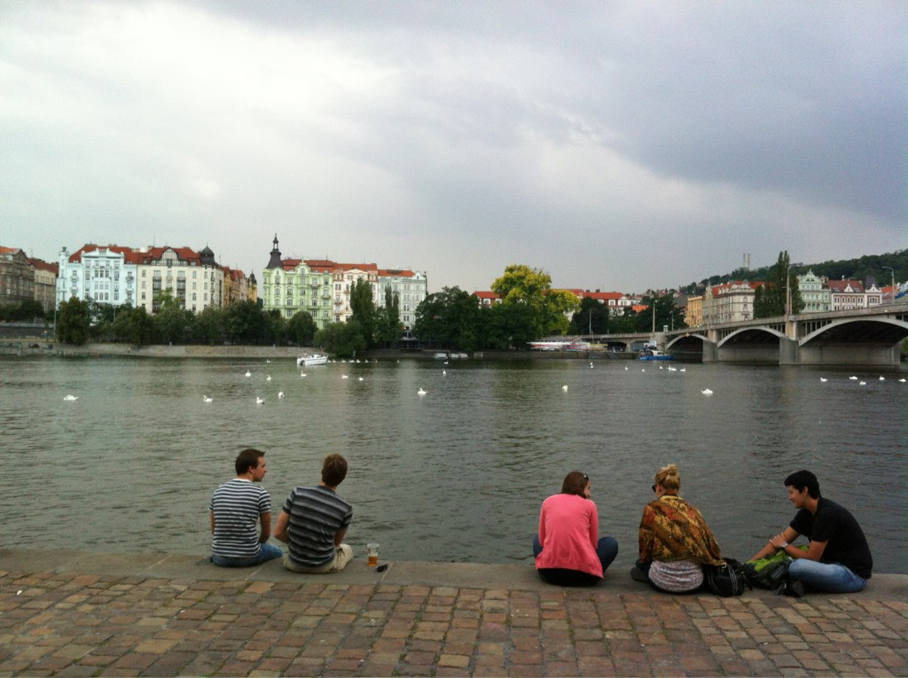

> More thinking about writing, in another new post: Elbow, Wrist, Fingers, Pen, Words\. http://www\.plannedobsolescence\.net/blog/elbow\-wrist\-fingers\-pen\-words/

 [Fri Jun 01 20:27:47 +0000 2012](https://twitter.com/kfitz/status/208656109291053056)

----

Replying to [@boone](https://twitter.com/boone/status/208663870980624385)

> Ha\. Ha ha\.

 [Fri Jun 01 21:00:03 +0000 2012](https://twitter.com/kfitz/status/208664228733779968)

----

> A blog post about a new review of my book, this morning at Planned Obsolescence: http://www\.plannedobsolescence\.net/blog/reviews\-of\-planned\-obsolescence/

 [Sat Jun 02 12:44:42 +0000 2012](https://twitter.com/kfitz/status/208901956876505089)

----

> The review, if you want to cut to the chase, in the Los Angeles Review of Books: http://lareviewofbooks\.org/article\.php?type\=&id\=673&fulltext\=1&media\=

 [Sat Jun 02 12:45:05 +0000 2012](https://twitter.com/kfitz/status/208902055564292098)

----

Replying to [@wynkenhimself](https://twitter.com/wynkenhimself/status/208907065991770112)

> Thanks\! I was pretty excited to see it, needless to say\.

 [Sat Jun 02 13:07:22 +0000 2012](https://twitter.com/kfitz/status/208907661578739712)

----

Replying to [@dancohen](https://twitter.com/dancohen/status/208910547280855041)

> I'm quite pleased: he's clearly really engaged with the book, despite a final difference of standpoint\. \+

 [Sat Jun 02 13:20:18 +0000 2012](https://twitter.com/kfitz/status/208910916664836096)

----

Replying to [@dancohen](https://twitter.com/dancohen/status/208910547280855041)

> But yeah, the "Corey" thing, as well as "Claremont College\." Can't win 'em all, I guess\. \-

 [Sat Jun 02 13:20:55 +0000 2012](https://twitter.com/kfitz/status/208911070868410368)

----

> Beginning session at Now Visual Culture on the future of visual culture publishing, with @tmcphers and other great folks\. \#nvc2012

 [Sat Jun 02 15:53:41 +0000 2012](https://twitter.com/kfitz/status/208949515800150018)

----

> RT @LAReviewofBooks: Houman Barekat \(@HoumanBarekat\) on Kathleen Fitzpatrick \(@kfitz\)'s "Planned Obsolescence": http://bit\.ly/KkMMJi

 [Sat Jun 02 16:03:11 +0000 2012](https://twitter.com/kfitz/status/208951907677519874)

----

> RT @FakeElsevier: Sign now: tell your kids you were there when the walls fell, hunched over your twitter client, w/ a bag of Cheetos: ht \.\.\.

 [Sun Jun 03 01:40:29 +0000 2012](https://twitter.com/kfitz/status/209097188427579394)

----

> New post: Spoilerz\! \(Grrrr\.\) http://www\.plannedobsolescence\.net/blog/spoilerz/

 [Mon Jun 04 12:49:38 +0000 2012](https://twitter.com/kfitz/status/209627976420175872)

----

Replying to [@jmittell](https://twitter.com/jmittell/status/209628315462537216)

> IS ALL I AM SAYING\.

 [Mon Jun 04 12:51:14 +0000 2012](https://twitter.com/kfitz/status/209628379161432064)

----

Replying to [@crsbecker and @jmittell](https://twitter.com/crsbecker/status/209631543013015552)

> I got caught by last week's, too\. That one was bad enough; this one pushes up on unforgivable\.

 [Mon Jun 04 13:04:45 +0000 2012](https://twitter.com/kfitz/status/209631779760521216)

----

Replying to [@crsbecker and @jmittell](https://twitter.com/crsbecker/status/209631543013015552)

> PS: That "unsubscribe" button sure can come in handy\!

 [Mon Jun 04 13:05:26 +0000 2012](https://twitter.com/kfitz/status/209631951697625088)

----

Replying to [@patrick\_mj](https://twitter.com/patrick_mj/status/209632400119050243)

> DAMMIT\!

 [Mon Jun 04 13:11:55 +0000 2012](https://twitter.com/kfitz/status/209633582841479169)

----

> Rock on, you\! // RT @meganeabbott: Hey\! I'm in here\! \(well, my book is\) BEA: 10 Not\-to\-Miss Fiction Books \| Kirkus https://www\.kirkusreviews\.com/blog/fiction/bea\-10\-not\-miss\-fiction\-books/

 [Mon Jun 04 14:29:18 +0000 2012](https://twitter.com/kfitz/status/209653054897782789)

----

Replying to [@savasavasava](https://twitter.com/savasavasava/status/209652253861224448)

> Exclamations are fine, I think\! A nice OMG\! makes me look forward to watching, where details… not so much\.

 [Mon Jun 04 14:37:36 +0000 2012](https://twitter.com/kfitz/status/209655147196989440)

----

Replying to [@dexterauthor](https://twitter.com/dexterauthor/status/209667288801095680)

> BREAKING: Characters on television series experience conflict; episode has dramatic ending\!

 [Mon Jun 04 15:28:11 +0000 2012](https://twitter.com/kfitz/status/209667874934099968)

----

Replying to [@dexterauthor](https://twitter.com/dexterauthor/status/209667288801095680)

> You heard it here first\.

 [Mon Jun 04 15:28:39 +0000 2012](https://twitter.com/kfitz/status/209667991867097088)

----

> Reposted for the afternoon crowd: be careful with those spoilers, folks\. http://www\.plannedobsolescence\.net/blog/spoilerz/

 [Mon Jun 04 19:49:40 +0000 2012](https://twitter.com/kfitz/status/209733677528268800)

----

Replying to [@jwolman](https://twitter.com/jwolman/status/209738217229008896)

> I'm thinking of creating a pool in which folks can choose which connection I miss, where my suitcase gets lost, etc\.

 [Mon Jun 04 20:10:54 +0000 2012](https://twitter.com/kfitz/status/209739024984846337)

----

Replying to [@nancybaym](https://twitter.com/nancybaym/status/209699078664224769)

> Woo\-hoo\! I hope day 1 has been brilliant\.

 [Mon Jun 04 20:36:07 +0000 2012](https://twitter.com/kfitz/status/209745368181784576)

----

> I have just inherited a 1964\-65ish Magnavox Astro\-Sonic Stereo Hi\-Fi with Micromatic Turntable\. Most gorgeous, but need a little repair\. \+

 [Mon Jun 04 22:16:25 +0000 2012](https://twitter.com/kfitz/status/209770610979651587)

----

> Anybody know someone in NYC who might be able to do an in\-home estimate?

 [Mon Jun 04 22:17:29 +0000 2012](https://twitter.com/kfitz/status/209770879993921538)

----

Replying to [@academicdave](https://twitter.com/academicdave/status/209774858899427329)

> The wood is in perfect condition; I just need the electronics part\.

 [Mon Jun 04 22:38:42 +0000 2012](https://twitter.com/kfitz/status/209776216314609666)

----

Replying to [@cscannella](https://twitter.com/cscannella/status/209773980763168770)

> OMG the difficulty involved in getting this thing into the city from NJ\. Delivery finally achieved, however\.

 [Mon Jun 04 22:39:33 +0000 2012](https://twitter.com/kfitz/status/209776433424371712)

----

Replying to [@academicdave](https://twitter.com/academicdave/status/209772555505106946)

> Will post picture as soon as I'm home again\. It's gorgeous\.

 [Mon Jun 04 22:40:21 +0000 2012](https://twitter.com/kfitz/status/209776631680729088)

----

Replying to [@academicdave](https://twitter.com/academicdave/status/209776805895352320)

> That, I don't know\. It may be tubes; it's that era\. I actually got the original documentation\(\!\), so I'll check\.

 [Mon Jun 04 23:09:01 +0000 2012](https://twitter.com/kfitz/status/209783846965751808)

----

Replying to [@BendProf](https://twitter.com/BendProf/status/209782244888416256)

> I got it from FB this morning &amp; wound up railing about spoilers on my blog, I was so mad\.

 [Mon Jun 04 23:11:24 +0000 2012](https://twitter.com/kfitz/status/209784448647045120)

----

> This Magnavox Astro\-Sonic Hi\-Fi isn't mine, but it's the right model\. \(PS: I love saying Magnavox Astro\-Sonic Hi\-Fi\.\) http://www\.google\.com/search?q\=magnavox\+astro\-sonic&ie\=UTF\-8&oe\=UTF\-8&hl\=en&client\=safari\#miuv\=1

 [Mon Jun 04 23:14:56 +0000 2012](https://twitter.com/kfitz/status/209785338556710912)

----

> What the link in the last tweet about the stereo was meant to point to: http://www\.flickr\.com/photos/85364160@N00/3224202271

 [Tue Jun 05 00:01:18 +0000 2012](https://twitter.com/kfitz/status/209797004937805825)

----

> @academicdave According to the documentation \(of which my uncle kept not 1 but 2 pristine copies\), it's solid state\. Phew\.

 [Tue Jun 05 00:10:41 +0000 2012](https://twitter.com/kfitz/status/209799366981074946)

----

> The actual Magnavox Astro\-Sonic Hi\-Fi:  http://yfrog\.com/oem2eafj

 [Tue Jun 05 00:13:52 +0000 2012](https://twitter.com/kfitz/status/209800166713204737)

----

Replying to [@academicdave](https://twitter.com/academicdave/status/209799862005403648)

> Bad buzz in one speaker; turntable needs… to actually turn\. Plus probably a needle\.

 [Tue Jun 05 00:14:45 +0000 2012](https://twitter.com/kfitz/status/209800389950849024)

----

> The interior:  http://yfrog\.com/kkgo1wfdj

 [Tue Jun 05 00:15:20 +0000 2012](https://twitter.com/kfitz/status/209800538005585920)

----

> The brochure:  http://yfrog\.com/nxk2oxij

 [Tue Jun 05 00:15:38 +0000 2012](https://twitter.com/kfitz/status/209800610688671745)

----

Replying to [@wynkenhimself](https://twitter.com/wynkenhimself/status/209803820971208704)

> It is very Don Draper\. I also inherited a trove of amazingly kitschy LPs\.

 [Tue Jun 05 00:29:22 +0000 2012](https://twitter.com/kfitz/status/209804068447731712)

----

Replying to [@wynkenhimself](https://twitter.com/wynkenhimself/status/209805063768637440)

> No one has died \(yet\), happily; much\-beloved aunt and uncle preparing to move to assisted living\.

 [Tue Jun 05 00:34:24 +0000 2012](https://twitter.com/kfitz/status/209805334502572032)

----

Replying to [@surlyF](https://twitter.com/MikeFurlough/status/209805332191522818)

> They're right there, hidden in the living room furniture\!

 [Tue Jun 05 00:35:28 +0000 2012](https://twitter.com/kfitz/status/209805601675546625)

----

Replying to [@surlyF](https://twitter.com/MikeFurlough/status/209805633610989568)

> Actually, according to the brochure, it's solid state\. Has at least one blown speaker and needs turntable work\.

 [Tue Jun 05 00:36:14 +0000 2012](https://twitter.com/kfitz/status/209805795192340480)

----

Replying to [@commish24](https://twitter.com/commish24/status/209805697993543680)

> I have coveted this since I was a little kid\.

 [Tue Jun 05 00:36:53 +0000 2012](https://twitter.com/kfitz/status/209805959462268928)

----

Replying to [@surlyF](https://twitter.com/MikeFurlough/status/209805994602143746)

> Awesome; let's email\. I am still in the market for tips\.

 [Tue Jun 05 00:37:52 +0000 2012](https://twitter.com/kfitz/status/209806205340762112)

----

Replying to [@brettbobley](https://twitter.com/brettbobley/status/209808199921049600)

> I know, right? I've loved this thing since I was a kid, and I had no idea how awesome the name was\.

 [Tue Jun 05 00:47:39 +0000 2012](https://twitter.com/kfitz/status/209808669670518785)

----

Replying to [@triplingual](https://twitter.com/triplingual/status/209808844833042432)

> I most certainly do, once I can get the turntable working\.

 [Tue Jun 05 00:48:48 +0000 2012](https://twitter.com/kfitz/status/209808958196690944)

----

Replying to [@triplingual](https://twitter.com/triplingual/status/209809134974025728)

> It does\!

 [Tue Jun 05 01:02:33 +0000 2012](https://twitter.com/kfitz/status/209812418128379905)

----

Replying to [@melissaterras](https://twitter.com/melissaterras/status/209837608019304448)

> That's what I'm hoping\! Thanks much\.

 [Tue Jun 05 02:44:26 +0000 2012](https://twitter.com/kfitz/status/209838060576325634)

----

> Extremely happy about this\! // RT @MLAnews: New OA\-friendly author agreements from MLA journals: http://www\.mla\.org/news\_from\_mla/news\_topic&topic\=596

 [Tue Jun 05 13:46:59 +0000 2012](https://twitter.com/kfitz/status/210004796101509120)

----

Replying to [@wynkenhimself](https://twitter.com/wynkenhimself/status/210004789508046850)

> This was, as always, a team effort\!

 [Tue Jun 05 13:47:52 +0000 2012](https://twitter.com/kfitz/status/210005018567380992)

----

Replying to [@mkgold](https://twitter.com/mkgold/status/210005199719378945)

> Thanks\!

 [Tue Jun 05 13:48:50 +0000 2012](https://twitter.com/kfitz/status/210005259072962560)

----

Replying to [@wynkenhimself](https://twitter.com/wynkenhimself/status/210005250726305792)

> Will do \-\- and thanks\!

 [Tue Jun 05 13:49:13 +0000 2012](https://twitter.com/kfitz/status/210005358029180930)

----

> In other news, more blogging: Astro\-Sonic\. http://www\.plannedobsolescence\.net/blog/astro\-sonic/

 [Tue Jun 05 13:49:56 +0000 2012](https://twitter.com/kfitz/status/210005535922200577)

----

Replying to [@digitaldante](https://twitter.com/digitaldante/status/210008108175593474)

> You know, that's the funny thing: I don't remember any in particular\. I've got some fascinating 60s\-70s instrumental now, tho\!

 [Tue Jun 05 14:43:36 +0000 2012](https://twitter.com/kfitz/status/210019044731006976)

----

Replying to [@mmwwah](https://twitter.com/mmwwah/status/210020417249878016)

> Thanks\! We're very happy about it, needless to say\.

 [Tue Jun 05 14:50:12 +0000 2012](https://twitter.com/kfitz/status/210020706031910912)

----

Replying to [@digitaldante](https://twitter.com/digitaldante/status/210021273609314304)

> I am 98% certain I now own that\.

 [Tue Jun 05 14:55:04 +0000 2012](https://twitter.com/kfitz/status/210021929405521921)

----

Replying to [@veek](https://twitter.com/veek/status/210033255817297922)

> Hey, thanks\! I'm pretty excited about it all\.

 [Tue Jun 05 15:49:03 +0000 2012](https://twitter.com/kfitz/status/210035512466087936)

----

Replying to [@boone](https://twitter.com/boone/status/210040767736066050)

> WORD\.

 [Tue Jun 05 16:12:01 +0000 2012](https://twitter.com/kfitz/status/210041292393164800)

----

Replying to [@boone](https://twitter.com/boone/status/210048224310984707)

> Super happy about that \- as is my uncle\.

 [Tue Jun 05 16:44:50 +0000 2012](https://twitter.com/kfitz/status/210049554106691584)

----

> I get all the issues folks have with the "unhappy assoc prof" article, but my assoc prof\-hood was in fact the unhappiest part of my career\.

 [Tue Jun 05 16:46:46 +0000 2012](https://twitter.com/kfitz/status/210050040675307520)

----

> And so, well, here I am\.

 [Tue Jun 05 16:47:28 +0000 2012](https://twitter.com/kfitz/status/210050213359005698)

----

> Be the change, as they say\.

 [Tue Jun 05 16:48:12 +0000 2012](https://twitter.com/kfitz/status/210050398898225153)

----

Replying to [@hjoseph](https://twitter.com/hjoseph/status/210049773603012608)

> Thank YOU for the inspiration and support\!

 [Tue Jun 05 16:48:54 +0000 2012](https://twitter.com/kfitz/status/210050575214190592)

----

Replying to [@cjprender](https://twitter.com/cjp_still/status/210050423258750976)

> Amen\.

 [Tue Jun 05 16:49:05 +0000 2012](https://twitter.com/kfitz/status/210050621649334272)

----

> Repost for the afternoon crowd, because I want everyone to know about the wonders of the Magnavox Astro\-Sonic Hi\-Fi: http://www\.plannedobsolescence\.net/blog/astro\-sonic/

 [Tue Jun 05 18:47:12 +0000 2012](https://twitter.com/kfitz/status/210080347248005120)

----

> RT @s2ceball: Rock on @MLAconvention for the new open\-access\-friendly publishing agreements\! http://www\.mla\.org/news\_from\_mla/news\_topic&topic\=596

 [Tue Jun 05 19:04:23 +0000 2012](https://twitter.com/kfitz/status/210084671957114880)

----

Replying to [@GeorgeOnline, @shanakimball, @surlyF and @jambina](https://twitter.com/GeorgeOnline/status/210115771001610241)

> Wow, just tuning back in\. Contracts in production; once 1st are ready, we shd be able to share\.

 [Wed Jun 06 00:48:25 +0000 2012](https://twitter.com/kfitz/status/210171248964153344)

----

> RT @rgfeal: MLA embraces "open access" writer agreements for journals \| Inside Higher Ed: http://bit\.ly/MisKcR

 [Wed Jun 06 11:51:20 +0000 2012](https://twitter.com/kfitz/status/210338080069136385)

----

> A quick post before I go: Departure\. http://www\.plannedobsolescence\.net/blog/departure/

 [Wed Jun 06 12:04:09 +0000 2012](https://twitter.com/kfitz/status/210341302024404992)

----

Replying to [@katinalynn](https://twitter.com/katinalynn/status/210344729991323648)

> Thank you\! A wish I could certainly use\.

 [Wed Jun 06 12:54:51 +0000 2012](https://twitter.com/kfitz/status/210354062439366656)

----

> RT @paoloman: New blog post http://blogs\.library\.duke\.edu/scholcomm/2012/06/06/saying\-the\-right\-things\-then\-doing\-them/ by Kevin Smith on @kfitz &amp; MLA \#openaccess statement\. 2 of my favorite thinkers &am \.\.\.

 [Wed Jun 06 15:20:56 +0000 2012](https://twitter.com/kfitz/status/210390826885451776)

----

> On that last RT, all I can say is thanks\. Kevin Smith, I'm sorry you're not on Twitter so that I could thank you here properly\!

 [Wed Jun 06 15:21:57 +0000 2012](https://twitter.com/kfitz/status/210391081785896960)

----

Replying to [@paoloman and @klsmith4906](https://twitter.com/paoloman/status/210399432213147650)

> Good to know; thanks\!

 [Wed Jun 06 16:35:54 +0000 2012](https://twitter.com/kfitz/status/210409692193767425)

----

> I cannot tell you how happy it makes me that @JennyHolzerMom is back\.

 [Wed Jun 06 16:56:05 +0000 2012](https://twitter.com/kfitz/status/210414770808033282)

----

> RT @profwernimont: very pleased to have generous funding from Mellon to plan regional SoCal digital humanities center in Claremont\. Exci \.\.\.

 [Wed Jun 06 18:36:25 +0000 2012](https://twitter.com/kfitz/status/210440021398921216)

----

> Getting started at \#GöSerial symposium, hosted by @jmittell and others at Georg\-August\-Universität\.

 [Fri Jun 08 08:07:26 +0000 2012](https://twitter.com/kfitz/status/211006507234504707)

----

> I honestly do not know what I was thinking\. http://www\.plannedobsolescence\.net/blog/ha/

 [Fri Jun 08 12:44:12 +0000 2012](https://twitter.com/kfitz/status/211076156919775232)

----

Replying to [@plragde](https://twitter.com/plragde/status/211076441201328129)

> I often work quite well on planes\. But not on planes that take off at 9\.30 pm\.

 [Fri Jun 08 12:47:06 +0000 2012](https://twitter.com/kfitz/status/211076887039066115)

----

Replying to [@jtheibault](https://twitter.com/jtheibault/status/211088411669438464)

> I am\! I will make a point of having someone take me there; thanks for the recommendation\.

 [Fri Jun 08 13:37:18 +0000 2012](https://twitter.com/kfitz/status/211089521394200577)

----

Replying to [@rgfeal and @bfister](https://twitter.com/rgfeal/status/211121220480016385)

> As in, "thank goodness this semester's over; now I can get back to my own work\!"

 [Fri Jun 08 15:44:14 +0000 2012](https://twitter.com/kfitz/status/211121466341720064)

----

> New post: Annals of Comment Spam\. http://www\.plannedobsolescence\.net/blog/annals\-of\-comment\-spam/

 [Sat Jun 09 12:32:54 +0000 2012](https://twitter.com/kfitz/status/211435701726752768)

----

Replying to [@medieninitiativ, @jmittell and @ruthtweetpage](https://twitter.com/medieninitiativ/status/211506177622814723)

> Great meeting you, too\!

 [Sat Jun 09 19:45:21 +0000 2012](https://twitter.com/kfitz/status/211544531085172736)

----

> Yes, Pynchon fans, I am about to give a talk at the IG Farben Haus of Goethe Universität Frankfurt\.

 [Mon Jun 11 16:05:36 +0000 2012](https://twitter.com/kfitz/status/212214005471784960)

----

Replying to [@plragde](https://twitter.com/plragde/status/212215241436700672)

> Totally should have\.

 [Mon Jun 11 20:08:32 +0000 2012](https://twitter.com/kfitz/status/212275143370743808)

----

> Good morning, east coast\! Yesterday I visited the IG Farben Haus; Pynchonesquery ensued\. http://www\.plannedobsolescence\.net/blog/pynchonesque/

 [Tue Jun 12 09:55:56 +0000 2012](https://twitter.com/kfitz/status/212483362630287360)

----

> Reposting IG Farben Haus adventures for the afternoon crowd: http://www\.plannedobsolescence\.net/blog/pynchonesque/

 [Tue Jun 12 18:46:05 +0000 2012](https://twitter.com/kfitz/status/212616779091034112)

----

Replying to [@literarychica](https://twitter.com/literarychica/status/212626466561720322)

> It's very odd to wake up here in the morning and realize that everyone there is going to be asleep for another 6 hours\.

 [Tue Jun 12 20:08:54 +0000 2012](https://twitter.com/kfitz/status/212637622139490304)

----

> I should have gone to sleep two hours ago\. I obviously did not listen to my future self's warnings\.

 [Tue Jun 12 21:44:36 +0000 2012](https://twitter.com/kfitz/status/212661706311217152)

----

> You've already heard about yesterday's talk on digital authorship: http://www\.plannedobsolescence\.net/blog/pynchonesque/\. Today, this: http://mediadecoder\.blogs\.nytimes\.com/2012/06/12/after\-long\-resistance\-pynchon\-allows\-novels\-to\-be\-sold\-as\-e\-books/?hp Coincidence?

 [Tue Jun 12 21:56:17 +0000 2012](https://twitter.com/kfitz/status/212664647797571584)

----

Replying to [@eetempleton](https://twitter.com/eetempleton/status/212955894760214529)

> Oh, no\. I have been slain by cute, and will now be useless for the rest of the evening\.

 [Wed Jun 13 18:55:56 +0000 2012](https://twitter.com/kfitz/status/212981646935326720)

----

Replying to [@savasavasava](https://twitter.com/savasavasava/status/213040337856380929)

> Yay\! Even reluctant love is an improvement\.

 [Thu Jun 14 07:30:29 +0000 2012](https://twitter.com/kfitz/status/213171535442227200)

----

Replying to [@carenmilloy](https://twitter.com/carenmilloy/status/213182697235943424)

> Excellent\! Portions of this talk may sound very familiar to you\. :\) \#elpubconf

 [Thu Jun 14 08:16:27 +0000 2012](https://twitter.com/kfitz/status/213183105853423617)

----

> Keynote accomplished\. Now I get to enjoy others presenting\! \#elpubconf

 [Thu Jun 14 09:57:11 +0000 2012](https://twitter.com/kfitz/status/213208454544891904)

----

> Great pres from Rory Mcgreal of Athabasca UP on study of Amazon sales ranks of volumes from his OA press w/those of trad presses\. \#elpubconf

 [Thu Jun 14 10:37:53 +0000 2012](https://twitter.com/kfitz/status/213218698662653952)

----

> Mcgreal: found no significant difference in sales rankings btw OA press &amp; traditional presses \- plus OA had 200K free downloads\! \#elpubconf

 [Thu Jun 14 10:39:33 +0000 2012](https://twitter.com/kfitz/status/213219117073838080)

----

> Now @Graham\_Stone on moving Huddersfield UP to OA publishing model\. \#elpubconf

 [Thu Jun 14 10:40:23 +0000 2012](https://twitter.com/kfitz/status/213219324343750657)

----

> Now: Pierre Mounier on working to create a robust economic model for "gold" OA publishing of books and journals\. \#elpubconf

 [Thu Jun 14 11:02:08 +0000 2012](https://twitter.com/kfitz/status/213224801324638208)

----

> Mounier: 2 models for gold OA: 100% grant/subsidies model; author\-pay model\. Each presents problems\. \#elpubconf

 [Thu Jun 14 11:02:59 +0000 2012](https://twitter.com/kfitz/status/213225012243595265)

----

> Mounier: 100% subsidy model runs risk of monoculture die\-off: if there is a problem with the subsidy, the publications will die\. \#elpubconf

 [Thu Jun 14 11:04:16 +0000 2012](https://twitter.com/kfitz/status/213225338392690688)

----

> Mounier: author\-pay model shifts financial bias from those who can afford to subscribe to those who can afford to publish\. \#elpubconf

 [Thu Jun 14 11:05:15 +0000 2012](https://twitter.com/kfitz/status/213225582945767425)

----

> FYI, Mounier \= @piotrr70\.

 [Thu Jun 14 11:06:44 +0000 2012](https://twitter.com/kfitz/status/213225958080118784)

----

Replying to [@fkelleter](https://twitter.com/fkelleter/status/213226266961256449)

> Yes, indeed\. Shifts financial burden/crisis from institutions to individuals\.

 [Thu Jun 14 11:09:11 +0000 2012](https://twitter.com/kfitz/status/213226573627801600)

----

> Alternative model suggested by @piotrr70: freemium\. How might such a model work for publishing in humanities and soc sci? \#elpubconf

 [Thu Jun 14 11:11:49 +0000 2012](https://twitter.com/kfitz/status/213227236193607680)

----

> At @piotrr70's http://revues\.org, free access in HTML plus premium versions in PDF/ePub\. \#elpubconf

 [Thu Jun 14 11:14:51 +0000 2012](https://twitter.com/kfitz/status/213227998428676096)

----

> Other premium services: email alerts, services for librarians, integration with library systems, documentation, etc\. \#elpubconf @piotrr70

 [Thu Jun 14 11:16:03 +0000 2012](https://twitter.com/kfitz/status/213228302285025281)

----

> OpenEdition launched in March 2011; 87 journals have adopted; 1000 books by end of 2012; will publish 16,000 by 2020\. @piotrr70 \#elpubconf

 [Thu Jun 14 11:18:48 +0000 2012](https://twitter.com/kfitz/status/213228992520663040)

----

> OpenEdition working with 25 university presses, multi\-lingual platform; 36 research libraries subscribe\. @piotrr70 \#elpubconf

 [Thu Jun 14 11:19:37 +0000 2012](https://twitter.com/kfitz/status/213229199362764801)

----

> Freemium model is both pragmatic and political for OpenEdition\. @piotrr70 \#elpubconf

 [Thu Jun 14 11:20:45 +0000 2012](https://twitter.com/kfitz/status/213229485074554881)

----

> RT @jmittell: Please provide feedback to @MediaCommons about how you're reading \(or not reading\) @ComplexTV with this quick survey: http \.\.\.

 [Thu Jun 14 13:18:00 +0000 2012](https://twitter.com/kfitz/status/213258991134978049)

----

Replying to [@katinalynn and @wynkenhimself](https://twitter.com/katinalynn/status/213259340608581633)

> Go to it for me\!

 [Thu Jun 14 13:22:40 +0000 2012](https://twitter.com/kfitz/status/213260165842079744)

----

Replying to [@katinalynn](https://twitter.com/katinalynn/status/213260827984277505)

> Yeah, things could be worse than this\.

 [Thu Jun 14 13:25:57 +0000 2012](https://twitter.com/kfitz/status/213260991323045890)

----

> I think my eyes may be rejecting my contact lenses\. Or my lenses may be very dirty\. In either case, may have to return to glasses for a bit\.

 [Thu Jun 14 13:29:27 +0000 2012](https://twitter.com/kfitz/status/213261873582317568)

----

Replying to [@rgfeal](https://twitter.com/rgfeal/status/213262648559665152)

> Sim, està tudo bem\!

 [Thu Jun 14 13:35:05 +0000 2012](https://twitter.com/kfitz/status/213263289793265664)

----

> Now, @carenmilloy from JISC on \#oapenuk and its model for open access scholarly monographs in humanities and social sciences\. \#elpubconf

 [Thu Jun 14 13:50:15 +0000 2012](https://twitter.com/kfitz/status/213267105909444608)

----

> \#oapenuk looking at ways policies, processes, mechanisms need to change to enable OA monograph publication\. @carenmilloy \#elpubconf

 [Thu Jun 14 13:57:50 +0000 2012](https://twitter.com/kfitz/status/213269017379610626)

----

> \#oapenuk also studying measurable effects of move to OA, changing perceptions of OA monographs among participants\. @carenmilloy \#elpubconf

 [Thu Jun 14 13:58:38 +0000 2012](https://twitter.com/kfitz/status/213269218576171009)

----

> More on \#oapenuk available at http://oapen\-uk\.jiscebooks\.org/ \#elpubconf

 [Thu Jun 14 14:00:25 +0000 2012](https://twitter.com/kfitz/status/213269665378598912)

----

> RT @pmphlt: New post: More reason to outlaw Impact Factors from personnel discussions http://hvrd\.me/MJ1K7l

 [Thu Jun 14 14:20:32 +0000 2012](https://twitter.com/kfitz/status/213274729736445953)

----

Replying to [@captain\_primate](https://twitter.com/EthanWatrall/status/213305914726416384)

> DUDE\. You need to buy a lottery ticket\. You are seriously lucky today\!

 [Thu Jun 14 16:25:28 +0000 2012](https://twitter.com/kfitz/status/213306167898812417)

----

Replying to [@academicdave and @captain\_primate](https://twitter.com/academicdave/status/213306608556589056)

> Hey, you can't win if you don't play\.

 [Thu Jun 14 16:27:51 +0000 2012](https://twitter.com/kfitz/status/213306770548998144)

----

Replying to [@BendProf and @rgfeal](https://twitter.com/BendProf/status/213429238634778625)

> One will do one's deeply jet lagged best\!

 [Fri Jun 15 05:51:06 +0000 2012](https://twitter.com/kfitz/status/213508913042178048)

----

> Having a sorely difficult time getting myself moving this morning\. Allergic freakout coupled with cumulative exhaustion\. &lt;/whine&gt; \#onward

 [Fri Jun 15 06:51:49 +0000 2012](https://twitter.com/kfitz/status/213524192900034560)

----

Replying to [@ruthtweetpage](https://twitter.com/ruthtweetpage/status/213559966945124352)

> Thank you\! It was great meeting you in Göttingen; I hope your return has gone smoothly\.

 [Fri Jun 15 09:15:10 +0000 2012](https://twitter.com/kfitz/status/213560269929070592)

----

Replying to [@billwolff](https://twitter.com/billwolff/status/213469976064049153)

> Oh, wow \-\- I missed this before\! Congratulations, and enjoy a well\-deserved vacation\.

 [Fri Jun 15 13:46:05 +0000 2012](https://twitter.com/kfitz/status/213628447057125377)

----

Replying to [@wynkenhimself and @sherah1918](https://twitter.com/wynkenhimself/status/213668908329205761)

> OMG, no kidding\. I have that dream All The Time\. Except without the tearing up dollar bills part\.

 [Fri Jun 15 16:44:29 +0000 2012](https://twitter.com/kfitz/status/213673341964402689)

----

> I totally love it when orgs email me to give me directions to something they've put something on their website\. Without, say, linking to it\.

 [Fri Jun 15 16:46:37 +0000 2012](https://twitter.com/kfitz/status/213673881905541120)

----

> On the other hand, it's more than slightly possible that I am too angry to be allowed on the internets right now\.

 [Fri Jun 15 16:48:12 +0000 2012](https://twitter.com/kfitz/status/213674278430834688)

----

Replying to [@savasavasava](https://twitter.com/savasavasava/status/213679849468993538)

> You're totally right\. That and a little whiskey, and I'll be good to go\.

 [Fri Jun 15 17:13:01 +0000 2012](https://twitter.com/kfitz/status/213680523913084929)

----

> I have a pending comment on a blog post that's about comment spam\. The comment starts "Now I'm going to sound like a spammer…" \+

 [Sat Jun 16 10:19:03 +0000 2012](https://twitter.com/kfitz/status/213938734654173185)

----

> and then proceeds to sound like a spammer, if one who's done her homework\. And the commenter's URL belongs to a marketing company\. \+

 [Sat Jun 16 10:20:19 +0000 2012](https://twitter.com/kfitz/status/213939051756126209)

----

> And yet because of that self\-consciousness and that homework\-doing, I feel guilty about hitting "spam\." It's a powerful strategy\! \-

 [Sat Jun 16 10:21:36 +0000 2012](https://twitter.com/kfitz/status/213939373702529025)

----

Replying to [@Ted\_Underwood](https://twitter.com/Ted_Underwood/status/213944651835641856)

> It's much like that\. She says she's looking forward to reading my book but takes the title to be connected to sustainability\.

 [Sat Jun 16 10:48:12 +0000 2012](https://twitter.com/kfitz/status/213946067572637697)

----

Replying to [@shermandorn](https://twitter.com/shermandorn/status/213956137031172097)

> I was contemplating that\. A gray\-area treatment for a gray\-area comment\.

 [Sat Jun 16 11:30:07 +0000 2012](https://twitter.com/kfitz/status/213956619762020354)

----

> It has been a full work day here in Portugal\. On a Saturday\. In Portugal\. Something may be wrong with this picture\. \#sigh

 [Sat Jun 16 16:13:26 +0000 2012](https://twitter.com/kfitz/status/214027918966394880)

----

Replying to [@jmittell and @dancohen](https://twitter.com/jmittell/status/214050258655784960)

> Trust me, you won't miss it\. Dan, do let the \#THATCamp folks know about Jason's survey, tho: http://justtv\.wordpress\.com/2012/06/14/feedback\-on\-complex\-tv\-pre\-publication/

 [Sat Jun 16 18:05:53 +0000 2012](https://twitter.com/kfitz/status/214056214638772224)

----

Replying to [@savasavasava](https://twitter.com/savasavasava/status/214077410591784962)

> I am jealous of all of the above\. But thx for the kitty pix, which made this morning better\!

 [Sat Jun 16 19:32:29 +0000 2012](https://twitter.com/kfitz/status/214078008909246464)

----

> Sitting in outdoor cafe, looking for wifi on aypad\. Waiter approaches, says "let me," and signs me on to encrypted network\. \#likethisplace

 [Sat Jun 16 21:03:34 +0000 2012](https://twitter.com/kfitz/status/214100932181504002)

----

> New post, in which I begin to ponder "unpopular seriality": http://www\.plannedobsolescence\.net/blog/unpopular\-seriality/

 [Sun Jun 17 12:08:23 +0000 2012](https://twitter.com/kfitz/status/214328633907617792)

----

Replying to [@meganeabbott](https://twitter.com/meganeabbott/status/214326004448108544)

> Wow\. The sadness coupled w/the hair\! The thing that most freaks me out tho is the slight lean away from her instructor of \#13\.

 [Sun Jun 17 12:11:57 +0000 2012](https://twitter.com/kfitz/status/214329534567297024)

----

> I dreamed about trying to repair my inherited turntable last night, except instead of http://www\.flickr\.com/photos/kqf/7156143599/in/set\-72157630057468008 it was the one I had as a kid\.

 [Sun Jun 17 12:15:14 +0000 2012](https://twitter.com/kfitz/status/214330359607865344)

----

> Hey, so? Any European countries wanting to win their Cup matches? I'm willing to come visit\. I'm clearly good for the local football\.

 [Sun Jun 17 20:37:34 +0000 2012](https://twitter.com/kfitz/status/214456776559562752)

----

Replying to [@fkelleter](https://twitter.com/fkelleter/status/214457403448627201)

> Actually, the US; you're all safe for the time being\. I pass back through Germany next Sunday morning, so if you're playing then…

 [Sun Jun 17 20:41:17 +0000 2012](https://twitter.com/kfitz/status/214457713223139329)

----

Replying to [@fkelleter](https://twitter.com/fkelleter/status/214458529560539136)

> I'm afraid I can't help you there\. I'll be in LA\. I wonder if they have any teams playing right now?

 [Sun Jun 17 20:47:24 +0000 2012](https://twitter.com/kfitz/status/214459250154545152)

----

Replying to [@publichistorian](https://twitter.com/publichistorian/status/214467653841076224)

> \#fromthegroundihope\!

 [Sun Jun 17 21:21:53 +0000 2012](https://twitter.com/kfitz/status/214467927825596419)

----

> I would say that, given the horns blaring here in Portugal, this promises to be a long night, except that a taxi is picking me up at 4\.15am\.

 [Sun Jun 17 21:24:34 +0000 2012](https://twitter.com/kfitz/status/214468604043853825)

----

Replying to [@colindickey and @publichistorian](https://twitter.com/colindickey/status/214468416709468160)

> Indeed\!

 [Sun Jun 17 21:25:33 +0000 2012](https://twitter.com/kfitz/status/214468852355043329)

----

Replying to [@nowviskie](https://twitter.com/nowviskie/status/214471104834703361)

> Go, B\. So glad you're there\.

 [Sun Jun 17 21:36:08 +0000 2012](https://twitter.com/kfitz/status/214471515981348864)

----

Replying to [@DanConnell](https://twitter.com/DanConnell/status/214470201750728704)

> Rats\. I have to be in Nashville\. At least rest assured that Tennessee will not throw the calculations off\.

 [Sun Jun 17 21:42:36 +0000 2012](https://twitter.com/kfitz/status/214473143937540096)

----

> This should be an interesting day\. Literally have not slept; need to be up in 20 minutes to catch 1st of 3 planes; end in Nashville at 6pm\.

 [Mon Jun 18 02:10:26 +0000 2012](https://twitter.com/kfitz/status/214540543630385152)

----

Replying to [@rgfeal](https://twitter.com/rgfeal/status/214540777324412929)

> You may be right\.

 [Mon Jun 18 02:15:55 +0000 2012](https://twitter.com/kfitz/status/214541923925491712)

----

> RT @mediacommons: We are happy to open the review of "Open Review: A Study of Contexts and Practices\." Please join the discussion\! http: \.\.\.

 [Mon Jun 18 18:16:55 +0000 2012](https://twitter.com/kfitz/status/214783768282669056)

----

> So: flight 1 was totally on\-time, flight 2 got in an hour early, and my forcibly checked bag met me where it should have\. Awaiting flight 3\.

 [Mon Jun 18 18:23:07 +0000 2012](https://twitter.com/kfitz/status/214785327146086400)

----

> Happy to have a moment to announce the open review of our white paper, "Open Review: A Study of Contexts and Practices" http://mediacommons\.futureofthebook\.org/mcpress/open\-review/

 [Mon Jun 18 18:24:24 +0000 2012](https://twitter.com/kfitz/status/214785653064470529)

----

Replying to [@wynkenhimself](https://twitter.com/wynkenhimself/status/214787868843974656)

> Dozed on flight 1; slept hard for a couple of hours on flight 2\. Feel way better than I ought to\!

 [Mon Jun 18 18:35:53 +0000 2012](https://twitter.com/kfitz/status/214788541144776704)

----

> AWESOME\. // RT @nowviskie: Crowd begins to gather on the Lawn\. \#UVa https://twitter\.com/nowviskie/status/214795134066360321/photo/1

 [Mon Jun 18 19:05:03 +0000 2012](https://twitter.com/kfitz/status/214795879977193473)

----

> Marking a milestone I never really believed I'd reach: Ten\. http://www\.plannedobsolescence\.net/blog/ten/

 [Mon Jun 18 19:05:27 +0000 2012](https://twitter.com/kfitz/status/214795983521984512)

----

> Flight 3 now delayed another hour\. Thank goodness it's the last flight of the day, and I have all my stuff with me\.\.\.

 [Mon Jun 18 19:09:21 +0000 2012](https://twitter.com/kfitz/status/214796963621769216)

----

> RT @jmittell: Unmotivated Reading as Work \- some thoughts on open review &amp; academic priorities: http://wp\.me/p3JAa\-g1

 [Mon Jun 18 19:21:50 +0000 2012](https://twitter.com/kfitz/status/214800104933175296)

----

> RT @swarthmoreburke: They need a tank or something for Sullivan to stand on at \#UVA, posed in front of the bldng where the board is meeting\.

 [Mon Jun 18 19:37:27 +0000 2012](https://twitter.com/kfitz/status/214804035532898304)

----

Replying to [@bigjondaniel](https://twitter.com/bigjondaniel/status/214804480368181248)

> Yeah, I do have status, which helps\. But if you knew how much I pressed my luck today, you'd see how much luck I really have\!

 [Mon Jun 18 19:41:29 +0000 2012](https://twitter.com/kfitz/status/214805048662827008)

----

Replying to [@bigjondaniel](https://twitter.com/bigjondaniel/status/214804480368181248)

> By the time I get to Nashville, I will have flown 3 separate tkts on 2 airlines, with 1 bag checked across tkts 1 &amp; 2\.

 [Mon Jun 18 19:42:42 +0000 2012](https://twitter.com/kfitz/status/214805354574385153)

----

Replying to [@bigjondaniel](https://twitter.com/bigjondaniel/status/214805983116005377)

> I know\! It wasn't entirely by choice, &amp; at 4\.45 am, running on no sleep, my resistance was low\. Thankfully, the bag showed up\.

 [Mon Jun 18 19:47:21 +0000 2012](https://twitter.com/kfitz/status/214806526488092672)

----

> Go, @sivavaid\! // RT @Andrew\_Stauffer: \#UVA Siva V\. calling for reinvestment in public higher Ed across the nation

 [Mon Jun 18 19:54:18 +0000 2012](https://twitter.com/kfitz/status/214808275693211649)

----

> @swarthmoreburke @ted\_underwood Certainly better than one saying "We're sorry you're so upset\! Maybe you should go have a nice lie\-down\."

 [Mon Jun 18 19:55:46 +0000 2012](https://twitter.com/kfitz/status/214808643735011328)

----

Replying to [@dancohen](https://twitter.com/dancohen/status/214809544415649793)

> Thanks so much, Dan, for this and all your thoughtful input\.

 [Mon Jun 18 20:01:30 +0000 2012](https://twitter.com/kfitz/status/214810086059675649)

----

> The open review report released today \(http://mediacommons\.futureofthebook\.org/mcpress/open\-review/\) would not have been possible without the input of our amazing advisory group: \+

 [Mon Jun 18 20:05:51 +0000 2012](https://twitter.com/kfitz/status/214811180957564928)

----

> \+ @dancohen @s2ceball @nickmirzoeff @CathyNDavidson and the pretty much Twitter\-free Lisa Gitelman and Sidonie Smith; was a fantastic year\.

 [Mon Jun 18 20:06:30 +0000 2012](https://twitter.com/kfitz/status/214811344636092416)

----

Replying to [@dancohen](https://twitter.com/dancohen/status/214811781804212224)

> Absolutely\! None of the things that I've done in the last ten years could have happened without the blog\. \(And thanks\!\)

 [Mon Jun 18 20:09:00 +0000 2012](https://twitter.com/kfitz/status/214811975115472896)

----

> "For passengers awaiting flight 4159 to Nashville, we're just waiting on an aircraft and a crew, and then we'll be ready to go\." Um\.\.\. yeah\.

 [Mon Jun 18 20:52:11 +0000 2012](https://twitter.com/kfitz/status/214822841974136833)

----

> What was called a "delayed aircraft" apparently arrived at EWR at 12\.45pm\. With maintenance problems\. Departure now tentatively 5\.45pm\. \#hmm

 [Mon Jun 18 21:10:11 +0000 2012](https://twitter.com/kfitz/status/214827371398828034)

----

> Alright, let's go try this go\-to\-the\-gate\-and\-board\-the\-plane thing again\. \#hopespringsetermal

 [Mon Jun 18 21:27:27 +0000 2012](https://twitter.com/kfitz/status/214831718337757188)

----

> I'm on a plane\! \#yay

 [Mon Jun 18 21:47:24 +0000 2012](https://twitter.com/kfitz/status/214836740035321857)

----

Replying to [@rgfeal, @stevegoldenberg, @jenifer\_ward and @bendprof](https://twitter.com/rgfeal/status/214837883721355264)

> Looking forward to getting there\!

 [Mon Jun 18 21:54:39 +0000 2012](https://twitter.com/kfitz/status/214838563664166912)

----

Replying to [@rgfeal, @stevegoldenberg, @jenifer\_ward and @bendprof](https://twitter.com/rgfeal/status/214839399416999936)

> If dinner's late, sure\! But not sure how lucid I'll be after starting in Portugal at 4am\.\.\.

 [Mon Jun 18 22:01:41 +0000 2012](https://twitter.com/kfitz/status/214840333954056192)

----

> A\-and, 24 hours later, I have arrived\. \*\*crashes\*\*

 [Tue Jun 19 00:57:34 +0000 2012](https://twitter.com/kfitz/status/214884594363793409)

----

> Getting started this morning at \#adefl with a plenary session on assessment\.

 [Tue Jun 19 13:38:05 +0000 2012](https://twitter.com/kfitz/status/215075984049848320)

----

> Very, very happy to have had 8\.5 hours of sleep last night, but not quite caught up\. Mildly dizzy in that "when am I?" sense\.

 [Tue Jun 19 13:39:09 +0000 2012](https://twitter.com/kfitz/status/215076252581756928)

----

Replying to [@rgfeal](https://twitter.com/rgfeal/status/215079720012877824)

> Pretty much\! Sooooo needed\.

 [Tue Jun 19 13:53:53 +0000 2012](https://twitter.com/kfitz/status/215079962485596160)

----

Replying to [@rgfeal](https://twitter.com/rgfeal/status/215080425813581826)

> Indeed\! Very excited about the conversations to come at \#adefl\.

 [Tue Jun 19 13:56:34 +0000 2012](https://twitter.com/kfitz/status/215080636967424001)

----

> Bernhardt: How do you get instructors to focus on learning \- that they're teaching \*students\*, not \*texts\*? \#adefl

 [Tue Jun 19 13:57:53 +0000 2012](https://twitter.com/kfitz/status/215080967407288320)

----

> Bernhardt: The better we articulate to students what it is we want them to be able to do, the better they will be able to do it\. \#adefl

 [Tue Jun 19 14:00:29 +0000 2012](https://twitter.com/kfitz/status/215081622767276033)

----

Replying to [@rgfeal](https://twitter.com/rgfeal/status/215081806167408640)

> From my time on the ground, no, they don't\. Too many flinch at term "learning outcomes" and miss how important idea might be\.

 [Tue Jun 19 14:02:54 +0000 2012](https://twitter.com/kfitz/status/215082232510029825)

----

Replying to [@wynkenhimself and @rgfeal](https://twitter.com/wynkenhimself/status/215082591747981313)

> True\. Most of the assessment allergy at my inst\. was about management jargon\. Which, given \#UVA, I understand\. \+

 [Tue Jun 19 14:05:23 +0000 2012](https://twitter.com/kfitz/status/215082855313833985)

----

Replying to [@wynkenhimself and @rgfeal](https://twitter.com/wynkenhimself/status/215082591747981313)

> But it often kept us from really articulating to ourselves what we were doing and why\.

 [Tue Jun 19 14:05:41 +0000 2012](https://twitter.com/kfitz/status/215082932379975681)

----

Replying to [@wynkenhimself and @rgfeal](https://twitter.com/wynkenhimself/status/215082591747981313)

> So we too often left things at "We want them to think critically\!" Yes, sure, but how do you know when they do it?

 [Tue Jun 19 14:06:19 +0000 2012](https://twitter.com/kfitz/status/215083092191350784)

----

Replying to [@swarthmoreburke](https://twitter.com/swarthmoreburke/status/215083216883818496)

> Indeed\.

 [Tue Jun 19 14:08:06 +0000 2012](https://twitter.com/kfitz/status/215083538532413440)

----

> We've got the seeds of a great discussion starting on "Open Review: A Study of Contexts &amp; Practices\." Come join us\! http://mediacommons\.futureofthebook\.org/mcpress/open\-review/

 [Tue Jun 19 14:14:36 +0000 2012](https://twitter.com/kfitz/status/215085175271456772)

----

Replying to [@rgfeal](https://twitter.com/rgfeal/status/215091582112759809)

> EXCELLENT\.

 [Tue Jun 19 14:41:46 +0000 2012](https://twitter.com/kfitz/status/215092010233765890)

----

> Now this is just plain neat: \+

 [Tue Jun 19 21:31:45 +0000 2012](https://twitter.com/kfitz/status/215195186236628992)

----

> RT @NYUpress: "Reading Culture: The gradual extinction of paper" \| @kfitz quoted in Daily Times Nigeria http://bit\.ly/PjVzd3

 [Tue Jun 19 21:31:49 +0000 2012](https://twitter.com/kfitz/status/215195204737703937)

----

Replying to [@elotroalex](https://twitter.com/elotroalex/status/215191619882860546)

> Congratulations\! That's fabulous news\. \(And it'll be great having you in NYC\.\)

 [Tue Jun 19 21:36:51 +0000 2012](https://twitter.com/kfitz/status/215196472558370816)

----

Replying to [@elotroalex](https://twitter.com/elotroalex/status/215196947890446336)

> Even better\!

 [Tue Jun 19 21:39:38 +0000 2012](https://twitter.com/kfitz/status/215197172201824256)

----

Replying to [@LibSkrat and @surlyf](https://twitter.com/LibSkrat/status/215229273085190144)

> I want to RT that comment more than I can tell you\. Propriety insists that I refrain\. Sigh\.

 [Wed Jun 20 01:25:22 +0000 2012](https://twitter.com/kfitz/status/215253980756983808)

----

> So, hypothetically: how much of a problem is it if you're giving a 20\-minute talk, and you only have slides for the first five minutes?

 [Wed Jun 20 01:42:08 +0000 2012](https://twitter.com/kfitz/status/215258198083502083)

----

Replying to [@academicdave](https://twitter.com/academicdave/status/215258334092197888)

> You may be onto something\.

 [Wed Jun 20 01:43:36 +0000 2012](https://twitter.com/kfitz/status/215258566536331266)

----

Replying to [@academicdave](https://twitter.com/academicdave/status/215258656969728000)

> Actually, I bet that would work well\.

 [Wed Jun 20 01:44:46 +0000 2012](https://twitter.com/kfitz/status/215258861710483456)

----

Replying to [@academicdave](https://twitter.com/academicdave/status/215259081173254144)

> I love this idea\. A pool of evocative slides; mix and match\.

 [Wed Jun 20 01:47:14 +0000 2012](https://twitter.com/kfitz/status/215259482450706433)

----

Replying to [@briancroxall](https://twitter.com/briancroxall/status/215259464977219585)

> Dude, have you ever seen me talk? Lessig totally stole my routine\.

 [Wed Jun 20 01:47:40 +0000 2012](https://twitter.com/kfitz/status/215259589397065728)

----

Replying to [@briancroxall](https://twitter.com/briancroxall/status/215259464977219585)

> Plus, that "if you know what you're saying" part… could conceivably be part of the issue\.

 [Wed Jun 20 01:48:11 +0000 2012](https://twitter.com/kfitz/status/215259722884972544)

----

Replying to [@academicdave](https://twitter.com/academicdave/status/215259760218488832)

> Okay, that's AWESOME\. What conf is that from?

 [Wed Jun 20 01:48:58 +0000 2012](https://twitter.com/kfitz/status/215259917819457538)

----

Replying to [@academicdave](https://twitter.com/academicdave/status/215260591592448000)

> Really fantastic stuff\. I completely get why\!

 [Wed Jun 20 01:54:36 +0000 2012](https://twitter.com/kfitz/status/215261337717190657)

----

> That @kjhealy is indeed killing it\.  \#UVa \#BoV http://bit\.ly/KzoAlN // via @wynkenhimself and a whole lot of other folks\.

 [Wed Jun 20 18:44:52 +0000 2012](https://twitter.com/kfitz/status/215515578352418817)

----

Replying to [@gmbritton](https://twitter.com/gmbritton/status/215518636083908610)

> Hey, good advice\. \#aaup12

 [Wed Jun 20 18:58:28 +0000 2012](https://twitter.com/kfitz/status/215518999214178304)

----

Replying to [@s2ceball](https://twitter.com/s2ceball/status/215518812764770304)

> So completely wish I were there\!

 [Wed Jun 20 18:58:51 +0000 2012](https://twitter.com/kfitz/status/215519096442327044)

----

Replying to [@savasavasava](https://twitter.com/savasavasava/status/215616496129409027)

> Ha\! Was talking about those two just a little bit ago\. Hope they \(and you\!\) are holding up in the heat\.

 [Thu Jun 21 01:56:52 +0000 2012](https://twitter.com/kfitz/status/215624293940330498)

----

> Quick note to everyone who's commenting on our Open Review white paper \(http://mediacommons\.futureofthebook\.org/mcpress/open\-review/\): you guys rock\! Will respond to comments ASAP\.

 [Thu Jun 21 02:22:20 +0000 2012](https://twitter.com/kfitz/status/215630702018969600)

----

> For those of you who haven't joined in yet, please do\! Open Review: A Study of Contexts &amp; Practices\. http://mediacommons\.futureofthebook\.org/mcpress/open\-review/

 [Thu Jun 21 02:24:03 +0000 2012](https://twitter.com/kfitz/status/215631136146194433)

----

Replying to [@LibSkrat](https://twitter.com/LibSkrat/status/215631604440244226)

> \*files that away\* \(PS: Thanks\!\)

 [Thu Jun 21 02:26:38 +0000 2012](https://twitter.com/kfitz/status/215631784107450368)

----

> RT @mediacommons: We just crossed the 100\-comment threshold on our Open Review white paper\. Come join the discussion\! http://mediacommons\.futureofthebook\.org/mcpress/open\-review

 [Thu Jun 21 12:23:02 +0000 2012](https://twitter.com/kfitz/status/215781874449129472)

----

Replying to [@samplereality](https://twitter.com/samplereality/status/215801296714870784)

> No LOKE\-a\-tiv adherents in the fray?

 [Thu Jun 21 13:40:56 +0000 2012](https://twitter.com/kfitz/status/215801480316334082)

----

Replying to [@samplereality](https://twitter.com/samplereality/status/215801946563547137)

> Too polite to throw down, one assumes\.

 [Thu Jun 21 13:52:01 +0000 2012](https://twitter.com/kfitz/status/215804269264244738)

----

> The thing that I've been waiting for finally happened\. \+

 [Thu Jun 21 18:37:17 +0000 2012](https://twitter.com/kfitz/status/215876059021840384)

----

> I deplaned into a terminal, and for a second I had no idea what city I was in, or where I was supposed to be going\. \+

 [Thu Jun 21 18:37:21 +0000 2012](https://twitter.com/kfitz/status/215876076117835776)

----

> I don't expect this to have improved by the time I reach Prague on Sunday\. \-

 [Thu Jun 21 18:37:23 +0000 2012](https://twitter.com/kfitz/status/215876084271554561)

----

Replying to [@jmittell](https://twitter.com/jmittell/status/215876329009201152)

> Yeah, I try to be kind to the housekeeping staff\. But I'm thinking I could definitely use that road manager\.

 [Thu Jun 21 18:39:04 +0000 2012](https://twitter.com/kfitz/status/215876506889633792)

----

Replying to [@brettbobley](https://twitter.com/brettbobley/status/215876917017063424)

> Exactly\.

 [Thu Jun 21 18:41:59 +0000 2012](https://twitter.com/kfitz/status/215877241966567424)

----

Replying to [@samplereality](https://twitter.com/samplereality/status/215882297000476672)

> I find myself somewhat torn between "oh god" and "hey cool\!" Definitely a sign I've been on the road too long\.

 [Thu Jun 21 19:05:40 +0000 2012](https://twitter.com/kfitz/status/215883199040061442)

----

Replying to [@katinalynn](https://twitter.com/katinalynn/status/215882750132109312)

> I do\! And yes\! So there's lots of up side\.

 [Thu Jun 21 19:06:04 +0000 2012](https://twitter.com/kfitz/status/215883299334275074)

----

Replying to [@cjprender](https://twitter.com/cjp_still/status/215885032185802752)

> I've been there several times; can't wait to get back\.

 [Thu Jun 21 19:13:38 +0000 2012](https://twitter.com/kfitz/status/215885206203269121)

----

Replying to [@Scrivenings](https://twitter.com/Scrivenings/status/215887377024032768)

> I'm so sorry, and hope that you're able to find some peace as well\.

 [Thu Jun 21 19:22:56 +0000 2012](https://twitter.com/kfitz/status/215887545656016896)

----

> LAX\.

 [Fri Jun 22 00:03:47 +0000 2012](https://twitter.com/kfitz/status/215958224900325376)

----

Replying to [@savasavasava](https://twitter.com/savasavasava/status/215954622232281091)

> YAY\!\!\!

 [Fri Jun 22 00:13:31 +0000 2012](https://twitter.com/kfitz/status/215960672574517249)

----

Replying to [@Ed\_Raso](https://twitter.com/Ed_Raso/status/215958397403668481)

> Heh\.

 [Fri Jun 22 00:14:05 +0000 2012](https://twitter.com/kfitz/status/215960816409776129)

----

> Wow, I completely forgot what Westwood is like\. The restaurant by the pool at the W in Westwood? That x 1000\.

 [Fri Jun 22 01:27:26 +0000 2012](https://twitter.com/kfitz/status/215979274946088960)

----

> As a \(very attractive\) friend of mine said to me on the beach in Santa Monica: "You &amp; I? We're the ugliest people for miles\."

 [Fri Jun 22 01:29:39 +0000 2012](https://twitter.com/kfitz/status/215979832784334848)

----

> This I will say for the poolside restaurant at the W, however: Best\. Salad\. Ever\. Kale, pickled vegetables, light bacon vinaigrette\.

 [Fri Jun 22 01:44:01 +0000 2012](https://twitter.com/kfitz/status/215983449541050369)

----

> I am in a little hotel across from the W\. Some boy band is staying in the W, as witness the mob of teen girls lining my side of the street\.

 [Fri Jun 22 03:01:43 +0000 2012](https://twitter.com/kfitz/status/216003003503738881)

----

Replying to [@wynkenhimself and @jenhoward](https://twitter.com/wynkenhimself/status/216010820059021313)

> It's way better than the headline suggests\. A focus on systemic problems; not saying "don't bother trying\."

 [Fri Jun 22 03:36:39 +0000 2012](https://twitter.com/kfitz/status/216011791388512258)

----

Replying to [@wynkenhimself and @jenhoward](https://twitter.com/wynkenhimself/status/216010820059021313)

> This is not to say that the stiff drink might not be warranted\.

 [Fri Jun 22 03:37:01 +0000 2012](https://twitter.com/kfitz/status/216011886410469377)

----

> The most awesome thing about finding myself on the west coast is going to bed at 9 and waking up at 5, ready to go\.

 [Fri Jun 22 12:36:42 +0000 2012](https://twitter.com/kfitz/status/216147700733837312)

----

> RT @dancohen: In the open review meetings, we actually discussed the importance of not producing something that's a refrigerator\-toaster\.

 [Fri Jun 22 14:22:19 +0000 2012](https://twitter.com/kfitz/status/216174281514692609)

----

> In which I whine about one of the more troublesome aspects of travel: Showers of the World\. http://www\.plannedobsolescence\.net/blog/showers\-of\-the\-world/

 [Fri Jun 22 15:17:19 +0000 2012](https://twitter.com/kfitz/status/216188121656729601)

----

> Hearing fantastic project presentations at \#ucladh today\. Very exciting movement of material &amp; questions across multiple platforms &amp; tools\.

 [Fri Jun 22 18:46:07 +0000 2012](https://twitter.com/kfitz/status/216240669176504321)

----

> Two weeks, three countries, five talks, three panel discussions\. Done\. My brain shall very soon begin a nice long vacation\.

 [Fri Jun 22 18:48:59 +0000 2012](https://twitter.com/kfitz/status/216241391532118017)

----

Replying to [@ryancordell](https://twitter.com/ryancordell/status/216219183078318081)

> "For best results, do not stack the computers" \= the tech version of the doctor joke punchline: "Then don't do that\."

 [Fri Jun 22 19:05:01 +0000 2012](https://twitter.com/kfitz/status/216245426540654592)

----

Replying to [@LibSkrat](https://twitter.com/LibSkrat/status/216291606679138304)

> Very interesting\! \(Though we will always need to acquire theme park rights for everything in PMLA, of course\.\)

 [Fri Jun 22 22:11:42 +0000 2012](https://twitter.com/kfitz/status/216292405987643392)

----

Replying to [@brettbobley and @toddpresner](https://twitter.com/brettbobley/status/216286395071860737)

> They are delish\! Thanks, NEH\!

 [Fri Jun 22 22:22:08 +0000 2012](https://twitter.com/kfitz/status/216295031160573952)

----

Replying to [@brettbobley, @toddpresner and @ucladh](https://twitter.com/brettbobley/status/216325508516937729)

> Exactly\! And there was Nashville in\-between\. I head back to Europe tomorrow\.

 [Sat Jun 23 00:23:52 +0000 2012](https://twitter.com/kfitz/status/216325666382163968)

----

Replying to [@mariabustillos](https://twitter.com/mariabustillos/status/216325526737002496)

> Have great table; see you soon\!

 [Sat Jun 23 00:29:07 +0000 2012](https://twitter.com/kfitz/status/216326985591427073)

----

Replying to [@noctambulate](https://twitter.com/noctambulate/status/216368684585844736)

> Like a dinner party s/he was afraid no one would show up to\!

 [Sat Jun 23 03:17:29 +0000 2012](https://twitter.com/kfitz/status/216369357247352832)

----

> LAX, again\. Today into tomorrow: EWR, FRA, PRG\. Then three weeks of blissful stillness\.

 [Sat Jun 23 12:59:22 +0000 2012](https://twitter.com/kfitz/status/216515791712038913)

----

> Additional good news: yesterday, I managed to get out of the center seat they had me in for EWR &gt; FRA\. Exit row window FTW\!

 [Sat Jun 23 13:00:17 +0000 2012](https://twitter.com/kfitz/status/216516023036297216)

----

> Las Vegas\. Unscheduled stop for medical emergency\. My heart goes out to the gentleman and his wife\.

 [Sat Jun 23 16:03:22 +0000 2012](https://twitter.com/kfitz/status/216562096865943552)

----

> Could somebody with access to a proper size screen let me know if there's a way to get from terminal C to B at EWR w/o leaving security? Thx

 [Sat Jun 23 17:03:06 +0000 2012](https://twitter.com/kfitz/status/216577130002264064)

----

Replying to [@ericdmj](https://twitter.com/ericdmj/status/216577606022201346)

> Okay, I'll hope that's so\! All I've ever seen is the AirTrain, which is outside security\.

 [Sat Jun 23 17:07:01 +0000 2012](https://twitter.com/kfitz/status/216578115911172096)

----

Replying to [@ericdmj](https://twitter.com/ericdmj/status/216578292013207552)

> GAH\. I \*had\* 2\.5 hours\. Now may not make it\.

 [Sat Jun 23 17:08:22 +0000 2012](https://twitter.com/kfitz/status/216578455284891648)

----

Replying to [@naypinya](https://twitter.com/naypinya/status/216579474706268160)

> No, alas, AirTrain is pre\-security\. There's a post security shuttle bus between C &amp; A, but I fear not B\.

 [Sat Jun 23 17:13:35 +0000 2012](https://twitter.com/kfitz/status/216579769637146625)

----

> Well, crap\. Have just landed at EWR; connecting flight already gone\. This should be fun\.

 [Sat Jun 23 22:17:20 +0000 2012](https://twitter.com/kfitz/status/216656211100180481)

----

Replying to [@maximolly](https://twitter.com/maximolly/status/216656742929543169)

> Hi there\! Will let you know should that come to pass\.

 [Sat Jun 23 22:27:25 +0000 2012](https://twitter.com/kfitz/status/216658749866246144)

----

> This? Is not going well\.

 [Sat Jun 23 23:39:19 +0000 2012](https://twitter.com/kfitz/status/216676840197201920)

----

Replying to [@savasavasava](https://twitter.com/savasavasava/status/216678482397237249)

> Thanks\. May be home shortly\.

 [Sat Jun 23 23:48:59 +0000 2012](https://twitter.com/kfitz/status/216679276227989504)

----

> No seats out tonight\. Am \*waitlisted\* for tomorrow\.

 [Sat Jun 23 23:50:01 +0000 2012](https://twitter.com/kfitz/status/216679534110576641)

----

Replying to [@rgfeal](https://twitter.com/rgfeal/status/216680405317844992)

> Dunno\. Am in line again\.

 [Sat Jun 23 23:54:35 +0000 2012](https://twitter.com/kfitz/status/216680684427812865)

----

Replying to [@rgfeal](https://twitter.com/rgfeal/status/216680933376524288)

> is problematic\. will try in a minute

 [Sat Jun 23 23:58:41 +0000 2012](https://twitter.com/kfitz/status/216681715786190849)

----

Replying to [@boone](https://twitter.com/boone/status/216682867005198336)

> It appears that I will, like it or not\!

 [Sun Jun 24 00:03:58 +0000 2012](https://twitter.com/kfitz/status/216683047590961152)

----

Replying to [@unsworth](https://twitter.com/unsworth/status/216689101951340545)

> To Prague? Would be nice\!

 [Sun Jun 24 00:29:56 +0000 2012](https://twitter.com/kfitz/status/216689578415886336)

----

> Heading home\. Not how I hoped this would end\.

 [Sun Jun 24 01:16:34 +0000 2012](https://twitter.com/kfitz/status/216701317874319360)

----

> The best part is that I get to come spend the day in the airport tomorrow waiting to see if I get on an overbooked flight off standby\.

 [Sun Jun 24 01:21:40 +0000 2012](https://twitter.com/kfitz/status/216702599754285056)

----

> Finally on the train headed back into the city\. Home for about 13 hours: sleep, a little laundry, repack, and do it again\.

 [Sun Jun 24 02:07:46 +0000 2012](https://twitter.com/kfitz/status/216714202839138306)

----

> And I just realized I have no house keys\. Thank goodness for the door guys\.

 [Sun Jun 24 02:22:15 +0000 2012](https://twitter.com/kfitz/status/216717846556844032)

----

> Belay that\. I'm less stupid than I thought\. Keys are safely in carry\-on\.

 [Sun Jun 24 02:23:12 +0000 2012](https://twitter.com/kfitz/status/216718082780041217)

----

Replying to [@wynkenhimself](https://twitter.com/wynkenhimself/status/216719493437734913)

> It's been a suck of a day, but I'm trying to keep it in perspective\. Neither I nor a loved one had a stroke on a plane today\.

 [Sun Jun 24 02:37:47 +0000 2012](https://twitter.com/kfitz/status/216721755748835329)

----

Replying to [@wynkenhimself](https://twitter.com/wynkenhimself/status/216719493437734913)

> Which is not to say that I'm not deeply whiny right now\. And there may have been tears\.

 [Sun Jun 24 02:38:36 +0000 2012](https://twitter.com/kfitz/status/216721962041479169)

----

Replying to [@wynkenhimself](https://twitter.com/wynkenhimself/status/216723941354512384)

> Thanks\! It occurs to me that eating might be good too\. Also water\. All systems are screwed\.

 [Sun Jun 24 02:53:03 +0000 2012](https://twitter.com/kfitz/status/216725597731291136)

----

Replying to [@wynkenhimself](https://twitter.com/wynkenhimself/status/216726320539897856)

> R is there waiting for me\. Today was supposed to be the start of the vacation, which is part of what makes it so frustrating\.

 [Sun Jun 24 03:06:53 +0000 2012](https://twitter.com/kfitz/status/216729076235374592)

----

> Happy Pride, from the Terrace of Awesomeness\. \(Kinda happy I didn't miss this, at the moment\.\) 
> 
> 

 [Sun Jun 24 03:48:04 +0000 2012](https://twitter.com/kfitz/status/216739441455280130)

----

> \(Only sorry the camera can't pick up the colors on the top layer of lights: should be green facing me\.\)

 [Sun Jun 24 03:49:53 +0000 2012](https://twitter.com/kfitz/status/216739898378551297)

----

Replying to [@jwolman](https://twitter.com/jwolman/status/216740732348792832)

> Especially when you factor in the part where I'm waitlisted for tomorrow's flights\.

 [Sun Jun 24 03:54:00 +0000 2012](https://twitter.com/kfitz/status/216740934602326017)

----

Replying to [@savasavasava](https://twitter.com/savasavasava/status/216745555114721283)

> I'm so sorry it's lingering\! Hope you find some relief soon\.

 [Sun Jun 24 04:18:12 +0000 2012](https://twitter.com/kfitz/status/216747027084742656)

----

> It's a very weird thing to be transient in your own apartment\. On the one hand, I keep thinking I shouldn't be here\. \+

 [Sun Jun 24 04:20:18 +0000 2012](https://twitter.com/kfitz/status/216747552823980034)

----

> On the other, it's like a second chance at packing\. I keep thinking of things I can grab to make the next four weeks better\!

 [Sun Jun 24 04:21:13 +0000 2012](https://twitter.com/kfitz/status/216747785003876354)

----

> Okay, 9 am\. Laundry done, mail sorted, devices recharging\. A few last things to repack\. Will head back to the airport early, I think\.

 [Sun Jun 24 12:52:46 +0000 2012](https://twitter.com/kfitz/status/216876520323551232)

----

> \(Considering the starting point of the Pride parade lies directly between me &amp; Penn Station, earlier is probably better\.\)

 [Sun Jun 24 12:53:39 +0000 2012](https://twitter.com/kfitz/status/216876741925421059)

----

Replying to [@rgfeal](https://twitter.com/rgfeal/status/216877270831341568)

> Probably your best option\!

 [Sun Jun 24 12:56:28 +0000 2012](https://twitter.com/kfitz/status/216877452058836993)

----

Replying to [@savasavasava](https://twitter.com/savasavasava/status/216906295385669633)

> So glad to hear that\!

 [Sun Jun 24 14:55:23 +0000 2012](https://twitter.com/kfitz/status/216907376329109505)

----

> Penn Station achieved\. Next stop, EWR, and lots of waiting\. Cross your fingers for me\!

 [Sun Jun 24 15:34:43 +0000 2012](https://twitter.com/kfitz/status/216917274567770113)

----

Replying to [@academicdave](https://twitter.com/academicdave/status/216917480881405954)

> If only I had a choice in the matter\. \(See last night's stream\.\)

 [Sun Jun 24 15:37:12 +0000 2012](https://twitter.com/kfitz/status/216917900236292097)

----

Replying to [@academicdave](https://twitter.com/academicdave/status/216918534121472000)

> Exactly\. There's now a shuttle btw C &amp; A, but B remains isolated\.

 [Sun Jun 24 15:41:16 +0000 2012](https://twitter.com/kfitz/status/216918924548255744)

----

Replying to [@mariabustillos](https://twitter.com/mariabustillos/status/216919157185323008)

> Thanks\!

 [Sun Jun 24 15:44:05 +0000 2012](https://twitter.com/kfitz/status/216919634685861889)

----

Replying to [@Ed\_Raso](https://twitter.com/Ed_Raso/status/216923814716645376)

> Bought a round trip yesterday so I'm covered, thanks\!

 [Sun Jun 24 16:07:11 +0000 2012](https://twitter.com/kfitz/status/216925446552559616)

----

Replying to [@lwaltzer](https://twitter.com/lwaltzer/status/216920191706218496)

> No, but it's outside security, so useless for transfers, etc\.

 [Sun Jun 24 16:08:10 +0000 2012](https://twitter.com/kfitz/status/216925695480303617)

----

Replying to [@mmwwah](https://twitter.com/mmwwah/status/216928244803440640)

> Kinda feels that way to me, too\. Here's hoping it has a happy ending\. And soon\.

 [Sun Jun 24 16:19:29 +0000 2012](https://twitter.com/kfitz/status/216928543756660736)

----

> Okay, at the airport, in a line\. Deja vu, man\.

 [Sun Jun 24 16:51:21 +0000 2012](https://twitter.com/kfitz/status/216936560074047488)

----

> Processes thus far are not making me optimistic\. First a colleague was brought in, and now a supervisor, who must rule on whether they can \+

 [Sun Jun 24 17:01:58 +0000 2012](https://twitter.com/kfitz/status/216939232428695552)

----

> "accept" me on this flight\. Plus a request for my paper ticket \(do they still issue those?\)\. Heart not exactly filled with light here\.

 [Sun Jun 24 17:02:54 +0000 2012](https://twitter.com/kfitz/status/216939470216368128)

----

> Cautious optimism\. Have boarding pass, but no seat\.

 [Sun Jun 24 17:12:00 +0000 2012](https://twitter.com/kfitz/status/216941757227745282)

----

Replying to [@eetempleton](https://twitter.com/eetempleton/status/216940971844321281)

> You're right; they did\!

 [Sun Jun 24 17:22:11 +0000 2012](https://twitter.com/kfitz/status/216944321239330817)

----

Replying to [@rgfeal](https://twitter.com/rgfeal/status/216943307241168896)

> EWR to Duesseldorf to Prague, gods willing\. Slept fabulously, did laundry, hung with kitties\. All is okay \- but really want to go\!

 [Sun Jun 24 17:24:27 +0000 2012](https://twitter.com/kfitz/status/216944893090742273)

----

Replying to [@rgfeal](https://twitter.com/rgfeal/status/216945430339141632)

> That is a good life philosophy\.

 [Sun Jun 24 17:28:27 +0000 2012](https://twitter.com/kfitz/status/216945900298321920)

----

Replying to [@rgfeal](https://twitter.com/rgfeal/status/216946085879488513)

> I can and will find the whiskey\.

 [Sun Jun 24 17:29:50 +0000 2012](https://twitter.com/kfitz/status/216946245636325376)

----

> So far, so good\. Desk agent in Lufthansa lounge was sympathetic an helpful \(though he did begin with "so what happened yesterday?"\)\.

 [Sun Jun 24 18:07:59 +0000 2012](https://twitter.com/kfitz/status/216955848914780162)

----

> Cautious optimism continues\. Plus device charging and a beverage\.

 [Sun Jun 24 18:08:33 +0000 2012](https://twitter.com/kfitz/status/216955988148879360)

----

Replying to [@jmittell](https://twitter.com/jmittell/status/216956751164092416)

> I have at times watched that show with a discomfiting sense of familiarity\. I'd probably do well, but for having to stop to tweet\.

 [Sun Jun 24 18:15:10 +0000 2012](https://twitter.com/kfitz/status/216957656487837697)

----

Replying to [@katinalynn](https://twitter.com/katinalynn/status/216962696233484288)

> Thank you\! I hope your weekend is treating you well\.

 [Sun Jun 24 18:39:43 +0000 2012](https://twitter.com/kfitz/status/216963833649045506)

----

> Nearing the one\-hour\-to\-flight point\. The waiting is making me nervous\.

 [Sun Jun 24 19:30:03 +0000 2012](https://twitter.com/kfitz/status/216976500652646400)

----

> BUSINESS CLASS\. \(I may weep\.\)

 [Sun Jun 24 19:48:29 +0000 2012](https://twitter.com/kfitz/status/216981138357493760)

----

Replying to [@jenifer\_ward and @justinpickard](https://twitter.com/jenifer_ward/status/216982875873083392)

> Thanks\!

 [Sun Jun 24 19:57:40 +0000 2012](https://twitter.com/kfitz/status/216983448483667969)

----

Replying to [@amandafrench](https://twitter.com/amandafrench/status/216987596369305600)

> Oh, no\. They are too adorable\! And very wise in their thinking about higher education\.

 [Sun Jun 24 20:18:01 +0000 2012](https://twitter.com/kfitz/status/216988570248941568)

----

> Thanks for all the support, Twitters\. I'm off\. More from Prague\.

 [Sun Jun 24 20:27:52 +0000 2012](https://twitter.com/kfitz/status/216991049762082816)

----

Replying to [@ryancordell](https://twitter.com/ryancordell/status/216998539161645057)

> The bar by the pool has a great menu, including a killer kale salad\. Also, happy hour, 4 to 7\.

 [Sun Jun 24 21:46:58 +0000 2012](https://twitter.com/kfitz/status/217010955928870912)

----

> And there is wifi\.

 [Sun Jun 24 21:47:20 +0000 2012](https://twitter.com/kfitz/status/217011047062704128)

----

Replying to [@ryancordell](https://twitter.com/ryancordell/status/217011975140548609)

> It's pretty intense on the beautiful people meter, I'll admit\. I sat at the bar and read\. Clearly a foreigner\.

 [Sun Jun 24 21:53:53 +0000 2012](https://twitter.com/kfitz/status/217012698435690496)

----

Replying to [@savasavasava](https://twitter.com/savasavasava/status/217014179566071809)

> Is it sinus? That can last until you clear up the problem\.

 [Sun Jun 24 22:10:18 +0000 2012](https://twitter.com/kfitz/status/217016828550070272)

----

> Alright\. 8\.37pm local time here in Prague, where I arrived 12 hours ago, and where my suitcase is set to arrive any minute now\.

 [Mon Jun 25 18:38:25 +0000 2012](https://twitter.com/kfitz/status/217325895642382337)

----

> Not that I'm complaining\! I had a lovely flight, thanks to the very nice desk agent in the Lufthansa lounge\. And I'm here, which is great\.

 [Mon Jun 25 18:39:12 +0000 2012](https://twitter.com/kfitz/status/217326092392992768)

----

> I'm… just saying\. Is all\.

 [Mon Jun 25 18:39:26 +0000 2012](https://twitter.com/kfitz/status/217326150131793920)

----

Replying to [@jmittell, @louisck and @samplereality](https://twitter.com/jmittell/status/217494652725641217)

> Ooh, fun\. It will depend on the timing; I have \#MLA13 responsibilities\.

 [Tue Jun 26 05:50:18 +0000 2012](https://twitter.com/kfitz/status/217494978308472833)

----

Replying to [@jmittell](https://twitter.com/jmittell/status/217495489610911744)

> It's hard to say\. There's stuff going on more or less every night, some formal \(pres address Friday\), some informal\. \+

 [Tue Jun 26 05:55:50 +0000 2012](https://twitter.com/kfitz/status/217496372117647361)

----

Replying to [@jmittell](https://twitter.com/jmittell/status/217495489610911744)

> My bet is that Thursday will be less busy, though\.

 [Tue Jun 26 05:56:19 +0000 2012](https://twitter.com/kfitz/status/217496494197059587)

----

> Resolved: Oops\. Is there discussion? \#UVA \#BOV

 [Tue Jun 26 19:18:51 +0000 2012](https://twitter.com/kfitz/status/217698455609548800)

----

Replying to [@amandafrench](https://twitter.com/amandafrench/status/217698511066644480)

> I think it's three necessary to call a meeting\. \#UVA \#BOV

 [Tue Jun 26 19:19:50 +0000 2012](https://twitter.com/kfitz/status/217698703157379074)

----

> "We look forward to working with President Sullivan…" \#UVA \#BOV

 [Tue Jun 26 19:25:16 +0000 2012](https://twitter.com/kfitz/status/217700072073347072)

----

> RT @wynkenhimself: Someone retweet the lawn stream, please\! \#UVa // Please\! The roar isn't quite reaching Prague\.

 [Tue Jun 26 19:32:43 +0000 2012](https://twitter.com/kfitz/status/217701948688826369)

----

Replying to [@miriamkp](https://twitter.com/miriamkp/status/217994713754648576)

> Yay\!\!\!

 [Wed Jun 27 14:57:31 +0000 2012](https://twitter.com/kfitz/status/217995077920882689)

----

> Those white spots out there? Swans\. At least 40 of them, just hanging\. 
> 
> 

 [Wed Jun 27 17:52:26 +0000 2012](https://twitter.com/kfitz/status/218039093110640640)

----

> A slightly closer view\. 
> 
> 

 [Wed Jun 27 17:53:02 +0000 2012](https://twitter.com/kfitz/status/218039244122370048)

----

> R\. just counted 53\. \#swans\!

 [Wed Jun 27 17:55:29 +0000 2012](https://twitter.com/kfitz/status/218039866817118209)

----

Replying to [@LizClausen](https://twitter.com/LizWhatsherface/status/218042405352521729)

> Fantastic\! I'll look forward to seeing the final version\.

 [Wed Jun 27 18:14:43 +0000 2012](https://twitter.com/kfitz/status/218044703763988481)

----

Replying to [@savasavasava](https://twitter.com/savasavasava/status/218120034504024064)

> Also: "SOON\."

 [Thu Jun 28 02:06:44 +0000 2012](https://twitter.com/kfitz/status/218163490970533888)

----

> This picture brilliantly captures my cats' personalities, once you get to know them: http://instagram\.com/p/MZTXe\-D0IX/ \(My caption: "SOON\."\)

 [Thu Jun 28 16:15:26 +0000 2012](https://twitter.com/kfitz/status/218377074405154816)

----

Replying to [@mmwwah](https://twitter.com/mmwwah/status/218408072958320640)

> You read A\. correctly, but you've got H\. entirely wrong\. He's in full non\-trap rub\-my\-belly mode\.

 [Thu Jun 28 19:23:52 +0000 2012](https://twitter.com/kfitz/status/218424495940177922)

----

Replying to [@mkgold](https://twitter.com/mkgold/status/218741374428790785)

> Aww\! Congrats, Matt, and I hope everyone is resting well\.

 [Fri Jun 29 20:34:08 +0000 2012](https://twitter.com/kfitz/status/218804567448616960)

----

Replying to [@tmcphers](https://twitter.com/tmcphers/status/218753137589223425)

> It never is\. \#sigh

 [Fri Jun 29 20:37:25 +0000 2012](https://twitter.com/kfitz/status/218805393248354305)

----

Replying to [@jbj](https://twitter.com/jbj/status/218796708656726016)

> How awful\. I'm so sorry\.

 [Fri Jun 29 20:55:29 +0000 2012](https://twitter.com/kfitz/status/218809940586938369)

----

Replying to [@tmcphers](https://twitter.com/tmcphers/status/218821117878599680)

> I'm so glad that guy graduated from my high school\.

 [Fri Jun 29 22:38:17 +0000 2012](https://twitter.com/kfitz/status/218835808877154304)

----

> A new blog post, but one with more whining than substance: Not the Post I Want to Be Writing\. http://www\.plannedobsolescence\.net/blog/not\-the\-post\-i\-want\-to\-be\-writing/

 [Sat Jun 30 14:03:02 +0000 2012](https://twitter.com/kfitz/status/219068532703498241)

----

Replying to [@wynkenhimself](https://twitter.com/wynkenhimself/status/219074026826498048)

> I thank you, and send all the positive vibes right back\. Sounds like you guys are having a brutal few days on the east coast\!

 [Sat Jun 30 14:26:46 +0000 2012](https://twitter.com/kfitz/status/219074502330560512)

----

Replying to [@wynkenhimself](https://twitter.com/wynkenhimself/status/219075170600632320)

> No kidding \- I'm so glad to hear it\!

 [Sat Jun 30 14:30:01 +0000 2012](https://twitter.com/kfitz/status/219075320106582016)

----

Replying to [@acavender](https://twitter.com/acavender/status/219080134706208769)

> Thank you \- I'm certain they will\.

 [Sat Jun 30 18:43:01 +0000 2012](https://twitter.com/kfitz/status/219138992044650496)

----

Replying to [@veek](https://twitter.com/veek/status/219143976639410176)

> Are \*you\* going to be in Hamburg?\!? I will look forward to meeting this young'un\!

 [Sat Jun 30 19:04:38 +0000 2012](https://twitter.com/kfitz/status/219144429523566592)

----

Replying to [@veek](https://twitter.com/veek/status/219144850002546688)

> Excellent\! Will look forward to seeing you and to meeting Nico\!

 [Sat Jun 30 19:17:38 +0000 2012](https://twitter.com/kfitz/status/219147703848927232)

----

Replying to [@veek](https://twitter.com/veek/status/219145284704415744)

> Eh, I'm sure I will\. Rotten timing, but teach me not to pie up business travel right before my vacation starts\.

 [Sat Jun 30 19:19:37 +0000 2012](https://twitter.com/kfitz/status/219148203038216192)

----

Replying to [@JenHoward and @libskrat](https://twitter.com/JenHoward/status/219266921772756992)

> How about in\-home day care?

 [Sun Jul 01 03:31:54 +0000 2012](https://twitter.com/kfitz/status/219272088857485313)