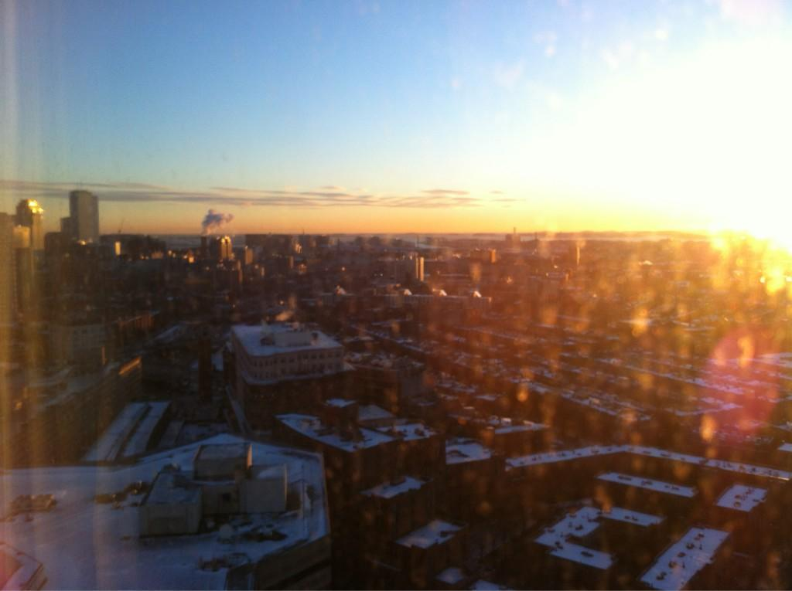
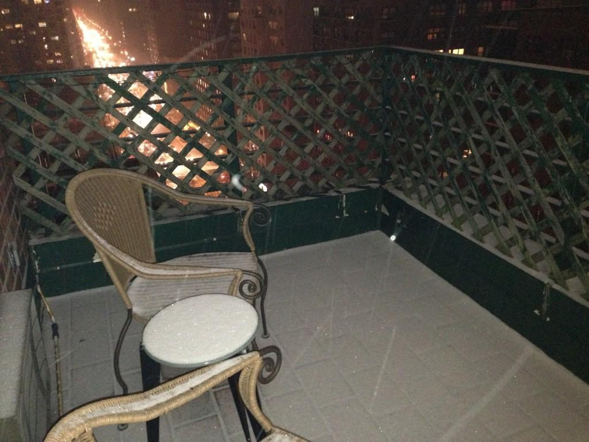

Replying to [@jmittell](https://twitter.com/jmittell/status/286004997831929856)

> Right there with you, six time zones away\. \#insomniasucks

 [Tue Jan 01 07:18:18 +0000 2013](https://twitter.com/kfitz/status/286008432732024832)

----

> Overbooked, overcrowded, overheated plane\. 100% underslept me\. But here we go\.

 [Tue Jan 01 10:14:51 +0000 2013](https://twitter.com/kfitz/status/286052862566469632)

----

Replying to [@whitneytrettien](https://twitter.com/whitneytrettien/status/286142130890604546)

> Just call me Big Sister\.  \(We're trying to make that stop\.\)

 [Tue Jan 01 19:56:40 +0000 2013](https://twitter.com/kfitz/status/286199278844641280)

----

> IAD achieved, after the longest flight ever\.

 [Tue Jan 01 19:58:24 +0000 2013](https://twitter.com/kfitz/status/286199714980966400)

----

Replying to [@patrick\_mj](https://twitter.com/patrick_mj/status/286214015384969219)

> Nature's perfect food\!

 [Tue Jan 01 21:01:10 +0000 2013](https://twitter.com/kfitz/status/286215512080392192)

----

> The positive: upgraded\! The less positive: the 18mo who screamed right behind me all the way across the Atlantic is now 2 rows behind me\.

 [Tue Jan 01 21:28:55 +0000 2013](https://twitter.com/kfitz/status/286222494447333376)

----

> I do not want to be that person who makes with the unsolicited parenting advice\. But\! Row 21 is not a good place to Ferberize your toddler\.

 [Tue Jan 01 21:31:03 +0000 2013](https://twitter.com/kfitz/status/286223034510090240)

----

> Hello, Boston\! I very much look forward to your room service and your hotel bed\.

 [Tue Jan 01 23:17:32 +0000 2013](https://twitter.com/kfitz/status/286249831226277888)

----

Replying to [@readywriting](https://twitter.com/readywriting/status/286250203613380608)

> Absolutely\!

 [Tue Jan 01 23:20:31 +0000 2013](https://twitter.com/kfitz/status/286250582581317632)

----

Replying to [@debcha](https://twitter.com/debcha/status/286254891888963584)

> Thanks\! Lovely to be here\. Wish I were going to see more of the city this time\.

 [Wed Jan 02 00:07:19 +0000 2013](https://twitter.com/kfitz/status/286262358807048192)

----

Replying to [@nancybaym](https://twitter.com/nancybaym/status/286256180370739200)

> Why, thank you\!

 [Wed Jan 02 00:07:56 +0000 2013](https://twitter.com/kfitz/status/286262512998023168)

----

> Yay\! // RT @briancroxall: Creating my first Group at MLA Commons\. Come join us\! http://bit\.ly/12WEHAO \#mla13 \#s270

 [Wed Jan 02 00:57:22 +0000 2013](https://twitter.com/kfitz/status/286274955312766979)

----

> At the Marriott Copley Place\. Trying to figure out when I was here before, and why\.

 [Wed Jan 02 00:58:19 +0000 2013](https://twitter.com/kfitz/status/286275195382157313)

----

> Alternately, the jet lag may be manifesting as deja vu\. Having just come from six hours into the future, and all, it sorta makes sense\.

 [Wed Jan 02 01:00:13 +0000 2013](https://twitter.com/kfitz/status/286275672429719552)

----

Replying to [@wynkenhimself](https://twitter.com/wynkenhimself/status/286275555119230976)

> Ooh, good to know\. I am actually sitting at the bar &amp; have a salad on the way, but will file this away for future reference\.

 [Wed Jan 02 01:01:19 +0000 2013](https://twitter.com/kfitz/status/286275950319136768)

----

Replying to [@jcmeloni](https://twitter.com/jcmeloni/status/286276884814241792)

> Will do\! Very much looking forward to it\.

 [Wed Jan 02 01:09:41 +0000 2013](https://twitter.com/kfitz/status/286278055780032512)

----

> "It's not an upgrade to your phone, it's an upgrade to your self\." The amazing things I miss by not watching regular commercial TV anymore\.

 [Wed Jan 02 01:17:38 +0000 2013](https://twitter.com/kfitz/status/286280055515119616)

----

Replying to [@samplereality](https://twitter.com/samplereality/status/286280911249616898)

> What did you do now?

 [Wed Jan 02 01:21:54 +0000 2013](https://twitter.com/kfitz/status/286281126878781440)

----

Replying to [@CapitolClio](https://twitter.com/CapitolClio/status/286280798947119106)

> ::opens eyes:: "I know Ruby\."

 [Wed Jan 02 01:22:56 +0000 2013](https://twitter.com/kfitz/status/286281388288770048)

----

Replying to [@samplereality](https://twitter.com/samplereality/status/286281306239803392)

> So sorry\! We'll sort it out\. Thanks for helping us uncover unexpected behavior, seriously\.

 [Wed Jan 02 01:24:00 +0000 2013](https://twitter.com/kfitz/status/286281655189123075)

----

Replying to [@captain\_primate and @saaorg](https://twitter.com/EthanWatrall/status/286283836118167553)

> We want to work with other orgs\! Hoping to create a network of networked humanities societies\. \#mlacommons

 [Wed Jan 02 01:36:19 +0000 2013](https://twitter.com/kfitz/status/286284756981776385)

----

Replying to [@wynkenhimself](https://twitter.com/wynkenhimself/status/286284781833043968)

> Very interesting\. Is it that you're the first to post to those groups that's unnerving? Or something else?

 [Wed Jan 02 01:39:45 +0000 2013](https://twitter.com/kfitz/status/286285618726715393)

----

Replying to [@wynkenhimself and @briancroxall](https://twitter.com/wynkenhimself/status/286286286191489024)

> I get that\. I'm hopeful that lots of us will get more comfortable with the audience &amp; mode of address quickly\!

 [Wed Jan 02 01:44:23 +0000 2013](https://twitter.com/kfitz/status/286286784550289409)

----

Replying to [@kegerton and @wynkenhimself](https://twitter.com/kegerton/status/286286341082316801)

> I think that's exactly right\. Looking forward to getting more folks in and walking around\!

 [Wed Jan 02 01:45:42 +0000 2013](https://twitter.com/kfitz/status/286287118517542913)

----

> This coincident w/ @samplereality's toes has me unnerved\. RT @kegerton: MLA Commons looks great, but needs breaking in, just like new shoes\.

 [Wed Jan 02 01:47:41 +0000 2013](https://twitter.com/kfitz/status/286287615030861824)

----

Replying to [@wynkenhimself](https://twitter.com/wynkenhimself/status/286288913138597888)

> It does feel like a new idiom is required\. But I think I felt that way about early Twitter, when I had no sense of audience\.

 [Wed Jan 02 01:54:55 +0000 2013](https://twitter.com/kfitz/status/286289435488813056)

----

Replying to [@HesterBlum and @wynkenhimself](https://twitter.com/HesterBlum/status/286289011109150720)

> No, thank you\! \(And yes, we are grateful for fine\-grained email notifications\.\)

 [Wed Jan 02 01:55:24 +0000 2013](https://twitter.com/kfitz/status/286289559833165824)

----

Replying to [@kegerton and @samplereality](https://twitter.com/kegerton/status/286288219962748928)

> I am of course happy to hear that, though \*somebody else's\* toes have been known to be chatty online\.

 [Wed Jan 02 01:56:30 +0000 2013](https://twitter.com/kfitz/status/286289837256998912)

----

> Okay, this has been fun\. But given that it's 3am in Paris, and that I slept about an hour last night, the time has come for collapse\.

 [Wed Jan 02 02:00:06 +0000 2013](https://twitter.com/kfitz/status/286290741985165312)

----

> Happy new year, all\. See some of you at \#thatcampMLA tomorrow, and many more of you at \#mla13 thereafter\!

 [Wed Jan 02 02:00:58 +0000 2013](https://twitter.com/kfitz/status/286290961330499587)

----

> More such swag available at \#mla13\! RT @brettbobley: MLA Commons swag has been prominently displayed on my MacBook\. 
> 
> 

 [Wed Jan 02 02:05:36 +0000 2013](https://twitter.com/kfitz/status/286292123941212160)

----

Replying to [@briancroxall](https://twitter.com/briancroxall/status/286292435670282240)

> Hmmmm…\.

 [Wed Jan 02 02:07:22 +0000 2013](https://twitter.com/kfitz/status/286292569112059905)

----

Replying to [@epistemographer](https://twitter.com/epistemographer/status/286295404004405248)

> What a concept\!

 [Wed Jan 02 02:18:57 +0000 2013](https://twitter.com/kfitz/status/286295484388216834)

----

Replying to [@brendabethman](https://twitter.com/brendabethman/status/286297895894929408)

> I am indeed\! And definitely hope we cross paths\.\.\.

 [Wed Jan 02 02:28:59 +0000 2013](https://twitter.com/kfitz/status/286298010772705280)

----

> Was super excited about this being the convention where I ran around with only iPad &amp; tiny kbd but then remembered, argh, slides\. \#oklaptop

 [Wed Jan 02 12:10:35 +0000 2013](https://twitter.com/kfitz/status/286444372831113216)

----

Replying to [@jmittell](https://twitter.com/jmittell/status/286444689182298112)

> Nice\.

 [Wed Jan 02 12:12:05 +0000 2013](https://twitter.com/kfitz/status/286444752981876736)

----

Replying to [@BendProf](https://twitter.com/BendProf/status/286393142574465024)

> Oh, no\! I'm so sorry\. Travel safely and we'll look forward to seeing you when you make it here\. :\(

 [Wed Jan 02 12:15:14 +0000 2013](https://twitter.com/kfitz/status/286445543176171520)

----

> Looks like a lovely morning for a little \#thatcamp\! \#mla13 
> 
> 

 [Wed Jan 02 12:26:25 +0000 2013](https://twitter.com/kfitz/status/286448358015504385)

----

Replying to [@ryancordell](https://twitter.com/ryancordell/status/286450763679551488)

> Nice\! See you shortly\.

 [Wed Jan 02 12:44:48 +0000 2013](https://twitter.com/kfitz/status/286452984123109376)

----

Replying to [@plragde](https://twitter.com/plragde/status/286462157246316544)

> This one: http://www\.amazon\.com/Logitech\-Ultrathin\-Keyboard\-generation\-920\-004013/dp/B007PRHNHO/ref\=sr\_1\_2?ie\=UTF8&qid\=1357134818&sr\=8\-2&keywords\=logitech

 [Wed Jan 02 13:54:20 +0000 2013](https://twitter.com/kfitz/status/286470484734910464)

----

Replying to [@samplereality and @jmittell](https://twitter.com/samplereality/status/286465412235943936)

> The whole trick is actually having the projector connector, which I do not\. But this looks AWESOME\.

 [Wed Jan 02 13:56:50 +0000 2013](https://twitter.com/kfitz/status/286471112899035136)

----

Replying to [@plragde](https://twitter.com/plragde/status/286474408023961600)

> The keyboard really changed my relationship to it\.

 [Wed Jan 02 14:11:11 +0000 2013](https://twitter.com/kfitz/status/286474726250008576)

----

> Welcome to \#thatcamp \#mla13 being given by @ryancordell\. Should be an awesome day\!

 [Wed Jan 02 14:23:16 +0000 2013](https://twitter.com/kfitz/status/286477767162339328)

----

> Northeastern U's Snell Library has a gorgeous digital media commons that they're sharing with \#thatcamp \#mla13 today\. Amazing space\!

 [Wed Jan 02 14:24:48 +0000 2013](https://twitter.com/kfitz/status/286478149783523328)

----

Replying to [@samplereality and @jmittell](https://twitter.com/samplereality/status/286473945249611776)

> That may help, indeed\!

 [Wed Jan 02 14:29:53 +0000 2013](https://twitter.com/kfitz/status/286479431889993728)

----

Replying to [@brettbobley](https://twitter.com/brettbobley/status/286479364680474625)

> Did I fail to mention that I was working on the MLA Teleporter?

 [Wed Jan 02 14:30:35 +0000 2013](https://twitter.com/kfitz/status/286479606427566080)

----

Replying to [@brettbobley](https://twitter.com/brettbobley/status/286479364680474625)

> \(Actually, I flew back yesterday, but my computer seemed to think it was still in Paris until this morning\.\)

 [Wed Jan 02 14:31:15 +0000 2013](https://twitter.com/kfitz/status/286479776397553664)

----

Replying to [@AlienWeedMan](https://twitter.com/AlienWeedMan/status/286479727261270017)

> Nice try\.

 [Wed Jan 02 14:31:53 +0000 2013](https://twitter.com/kfitz/status/286479932757012480)

----

Replying to [@AlienWeedMan](https://twitter.com/AlienWeedMan/status/286480038067589120)

> True dat\.

 [Wed Jan 02 14:32:29 +0000 2013](https://twitter.com/kfitz/status/286480083311546368)

----

> RT @MLACommons: Plan your \#mla13 meals with restaurant recommendations from Program Comm\.'s Anjali Prabhu \(and share some of your own\):h \.\.\.

 [Wed Jan 02 14:47:18 +0000 2013](https://twitter.com/kfitz/status/286483813025083392)

----

> I'm leading a \#thatcamp \#mla13 session on \#MLACommons at 4pm, but am happy to get MLA members into the system anytime\! http://commons\.mla\.org

 [Wed Jan 02 14:54:00 +0000 2013](https://twitter.com/kfitz/status/286485498648735744)

----

Replying to [@LibSkrat and @wynkenhimself](https://twitter.com/LibSkrat/status/286489729690660865)

> "Policing" is entirely internal, a hangover from the glam cult studs era\. Everybody trying to keep up w/cool kids\.

 [Wed Jan 02 15:28:04 +0000 2013](https://twitter.com/kfitz/status/286494072229740544)

----

Replying to [@monicafjacobe](https://twitter.com/monicafjacobe/status/286491763722555393)

> Go to http://commons\.mla\.org and click Log In\!

 [Wed Jan 02 15:29:14 +0000 2013](https://twitter.com/kfitz/status/286494366393044992)

----

Replying to [@LibSkrat](https://twitter.com/LibSkrat/status/286494553366745089)

> A very small number of people are jerks\. I mean "internal" as in an internalized response to people who are jerks\.

 [Wed Jan 02 15:31:18 +0000 2013](https://twitter.com/kfitz/status/286494884821614592)

----

Replying to [@LibSkrat](https://twitter.com/LibSkrat/status/286495186136223746)

> Any proportion of jerks is always higher than it should be\. Shame on us if we let them set norms for us\.

 [Wed Jan 02 15:33:40 +0000 2013](https://twitter.com/kfitz/status/286495482757390336)

----

Replying to [@LibSkrat](https://twitter.com/LibSkrat/status/286495962518675456)

> No, I meant shame on all of us; not blaming the victim\.

 [Wed Jan 02 15:36:21 +0000 2013](https://twitter.com/kfitz/status/286496158879199232)

----

Replying to [@monicafjacobe](https://twitter.com/monicafjacobe/status/286498237416865792)

> Nice\! Will look forward to seeing you there\.

 [Wed Jan 02 15:46:31 +0000 2013](https://twitter.com/kfitz/status/286498718331596801)

----

> RT @MLACommons: Read top ten \#mla13 convention tips from @BendProf at http://convention\.commons\.mla\.org/2013/01/02/top\-ten\-tips\-for\-those\-attending\-the\-mla\-convention/\.

 [Wed Jan 02 16:07:28 +0000 2013](https://twitter.com/kfitz/status/286503990286503936)

----

Replying to [@BendProf](https://twitter.com/BendProf/status/286505329435504640)

> :\(

 [Wed Jan 02 16:13:16 +0000 2013](https://twitter.com/kfitz/status/286505446821486592)

----

Replying to [@BendProf](https://twitter.com/BendProf/status/286505803807076352)

> See you then\!

 [Wed Jan 02 16:17:16 +0000 2013](https://twitter.com/kfitz/status/286506453014024192)

----

Replying to [@briancroxall and @loriemerson](https://twitter.com/briancroxall/status/286516973813256193)

> ::looks around, whistles::

 [Wed Jan 02 17:00:15 +0000 2013](https://twitter.com/kfitz/status/286517269943689216)

----

Replying to [@briancroxall and @loriemerson](https://twitter.com/briancroxall/status/286517378152558593)

> It's a poorly kept secret by design\. \(Srsly, the more people in today, the less likely the server will melt tmw\.\)

 [Wed Jan 02 17:01:39 +0000 2013](https://twitter.com/kfitz/status/286517624811171840)

----

Replying to [@briancroxall](https://twitter.com/briancroxall/status/286517985923985408)

> Hey, maybe there's even a group where such discussions can continue after today\! \#thatcamp \#mla13 http://commons\.mla\.org/groups/thatcamp/

 [Wed Jan 02 17:12:27 +0000 2013](https://twitter.com/kfitz/status/286520343827451906)

----

> Hey \#thatcamp \#mla13: if you're an MLA member, pop by http://commons\.mla\.org and log in\. We can make some stuff at 4pm, but you can start now\!

 [Wed Jan 02 18:27:05 +0000 2013](https://twitter.com/kfitz/status/286539124708634624)

----

> There's a THATCamp group on MLA Commons: http://commons\.mla\.org/groups/thatcamp/ \#thatcamp \#mla13

 [Wed Jan 02 18:34:24 +0000 2013](https://twitter.com/kfitz/status/286540966658191361)

----

Replying to [@briancroxall and @nmhouston](https://twitter.com/briancroxall/status/286563449964752896)

> It amazes me periodically to find comments from 2003 on my blog from people I thought I met through Twitter\.

 [Wed Jan 02 20:10:06 +0000 2013](https://twitter.com/kfitz/status/286565050364338176)

----

Replying to [@briancroxall](https://twitter.com/briancroxall/status/286567462927998977)

> That one guy running back &amp; forth with the suitcases is really tired\. Cut him a little slack\.

 [Wed Jan 02 20:21:19 +0000 2013](https://twitter.com/kfitz/status/286567873030287360)

----

> I don't know whether to blame jet lag or insomnia for the TWO hours of sleep I got last night\. I do know this will be an interesting day\.

 [Thu Jan 03 10:55:53 +0000 2013](https://twitter.com/kfitz/status/286787963533291520)

----

Replying to [@moncia](https://twitter.com/moncia/status/286791361091493888)

> Coffee, yes\. Must get through this week before anything slows down, but then\.\.\.

 [Thu Jan 03 11:14:38 +0000 2013](https://twitter.com/kfitz/status/286792680783093761)

----

Replying to [@eetempleton](https://twitter.com/eetempleton/status/286792206688337920)

> So sorry you're in it too\!

 [Thu Jan 03 11:14:50 +0000 2013](https://twitter.com/kfitz/status/286792734675714049)

----

> RT @MLACommons: Did I say swag? Activate your MLA Commons account at registration and get a t\-shirt, while supplies last\. \#mla13 http:// \.\.\.

 [Thu Jan 03 15:39:28 +0000 2013](https://twitter.com/kfitz/status/286859328437227520)

----

> So how is your \#mla13 going so far? Have you activated your \#MLACommons account and picked up your t\-shirt?

 [Thu Jan 03 18:21:38 +0000 2013](https://twitter.com/kfitz/status/286900140759990272)

----

Replying to [@S\_moores](https://twitter.com/S_moores/status/286900637524975616)

> Oh yeah\! Go see Chris at the table in the registration area in the conv ctr\.

 [Thu Jan 03 18:24:17 +0000 2013](https://twitter.com/kfitz/status/286900806152757248)

----

Replying to [@DanConnell](https://twitter.com/DanConnell/status/286908678253187072)

> Tees still there but going fast\. \#mla13 is great so far\!

 [Thu Jan 03 19:24:55 +0000 2013](https://twitter.com/kfitz/status/286916066972692480)

----

> Speaking on a joint LSA/MLA panel on open access, in the Marriott, Fairfield\-Exeter/Dartmouth, starting now\! \#mla13

 [Thu Jan 03 20:59:16 +0000 2013](https://twitter.com/kfitz/status/286939811393200130)

----

Replying to [@alanrauch](https://twitter.com/alanrauch/status/286955988790165504)

> The shirts will never be as smart as those who wear them\!

 [Thu Jan 03 22:06:09 +0000 2013](https://twitter.com/kfitz/status/286956643449704449)

----

> Up first today: Convergent Histories of the Book\. 8\.30am in Hampton, Sheraton\. \#mla13 \#s198

 [Fri Jan 04 11:56:18 +0000 2013](https://twitter.com/kfitz/status/287165557982248960)

----

> After that, the first of three demos of \#MLACommons, 10\.30am in the new Exhibit Hall Theater\! \#mla13 http://www\.mla\.org/exhibit\_theater\_2013

 [Fri Jan 04 11:57:32 +0000 2013](https://twitter.com/kfitz/status/287165864858501120)

----

Replying to [@wynkenhimself](https://twitter.com/wynkenhimself/status/287168605727096832)

> Ooh, I knew I forgot something\.

 [Fri Jan 04 12:08:54 +0000 2013](https://twitter.com/kfitz/status/287168726225260546)

----

Replying to [@wynkenhimself](https://twitter.com/wynkenhimself/status/287169094770372609)

> I will not complain about how little I slept last night\. I will not complain about how little I slept last night\.

 [Fri Jan 04 12:12:06 +0000 2013](https://twitter.com/kfitz/status/287169530445328384)

----

Replying to [@rgfeal and @wynkenhimself](https://twitter.com/rgfeal/status/287170352222728192)

> So true\.

 [Fri Jan 04 12:19:28 +0000 2013](https://twitter.com/kfitz/status/287171387179806720)

----

Replying to [@rgfeal and @wynkenhimself](https://twitter.com/rgfeal/status/287171833344688128)

> Well, sure\! And maybe a nice fruit plate or bagel assortment?

 [Fri Jan 04 12:31:45 +0000 2013](https://twitter.com/kfitz/status/287174476347625472)

----

Replying to [@Brinkmanship, @wynkenhimself, @mkirschenbaum and @amandafrench](https://twitter.com/Brinkmanship/status/287189265216073728)

> So sorry to hear that\! I'll hope to see you in the exhibit hall later this morning

 [Fri Jan 04 13:31:26 +0000 2013](https://twitter.com/kfitz/status/287189495261065216)

----

> Not even very much in the way of standing room at Convergent Histories of the Book\. Not bad for 8\.30am\! \#mla13 \#s198

 [Fri Jan 04 13:33:43 +0000 2013](https://twitter.com/kfitz/status/287190070384009217)

----

Replying to [@rgfeal](https://twitter.com/rgfeal/status/287194526928474112)

> Good advice for life\!

 [Fri Jan 04 13:52:01 +0000 2013](https://twitter.com/kfitz/status/287194675591393280)

----

> RT @rgfeal: MLA parliamentarian says: "If you don't stick your neck out during the meeting, don't stick your tongue out afterwards\." \#mla13

 [Fri Jan 04 13:52:25 +0000 2013](https://twitter.com/kfitz/status/287194775893991425)

----

> People are literally sitting in the hall outside Convergent Histories of the Book\. \#mla13 \#s198

 [Fri Jan 04 13:56:46 +0000 2013](https://twitter.com/kfitz/status/287195873962778624)

----

> RT @MLACommons: We're demoing \#MLACommons in the exhibit hall theater at 10\.30am Fri, Sat, &amp; Sun\. Come see what it's all about\! http \.\.\.

 [Fri Jan 04 14:27:15 +0000 2013](https://twitter.com/kfitz/status/287203545550295041)

----

> 15 minutes to \#MLACommons demo time\! Exhibit Hall Theater, in the back right corner\. \#mla13

 [Fri Jan 04 15:14:00 +0000 2013](https://twitter.com/kfitz/status/287215307590860800)

----

Replying to [@mmwwah](https://twitter.com/mmwwah/status/287218714691121152)

> Will do my best\!

 [Fri Jan 04 15:27:50 +0000 2013](https://twitter.com/kfitz/status/287218789953720320)

----

Replying to [@dllh](https://twitter.com/dllh/status/287222997109059586)

> You are way too nice\. Thanks for coming\! Looking forward to more WordPress fun at \#MLACommons\. \#mla13

 [Fri Jan 04 16:59:15 +0000 2013](https://twitter.com/kfitz/status/287241796365451264)

----

> RT @rgfeal: You shld stop at Hynes 312 for e\-lit exhibit\. It's fascinating, engaging, and inc 6 UG students who flew here\! Please show s \.\.\.

 [Fri Jan 04 17:58:50 +0000 2013](https://twitter.com/kfitz/status/287256789613957120)

----

> Hey, \#mla13\! Have you been by the \#elit exhibit in rm 312 of the Hynes Convention Center yet? Go explore these amazing projects\!

 [Fri Jan 04 18:01:02 +0000 2013](https://twitter.com/kfitz/status/287257343534718977)

----

Replying to [@literarychica](https://twitter.com/literarychica/status/287259205784702976)

> Oh, no\! I just saw this\. I hope you're feeling better, and I'm really glad you got help\. Take care\!

 [Fri Jan 04 19:14:16 +0000 2013](https://twitter.com/kfitz/status/287275773243568128)

----

Replying to [@literarychica](https://twitter.com/literarychica/status/287277569794011138)

> I know you must, but taking care of yourself is much more important\. There will be more conferences\! You only have one jaw\.

 [Fri Jan 04 19:23:28 +0000 2013](https://twitter.com/kfitz/status/287278088088326144)

----

> Make mine a meeting but yeah\. RT @amandafrench: Can't go to \#s270 \#mla13 on \#altac because I have a conf call\. Because I have an \#altac job\.

 [Fri Jan 04 20:17:31 +0000 2013](https://twitter.com/kfitz/status/287291691969421312)

----

Replying to [@wynkenhimself](https://twitter.com/wynkenhimself/status/287304337624014853)

> Oh no\! Take care of yourself\.\.\.

 [Fri Jan 04 21:08:18 +0000 2013](https://twitter.com/kfitz/status/287304469962706944)

----

Replying to [@wynkenhimself](https://twitter.com/wynkenhimself/status/287304925954859008)

> It is possible, indeed\. Actually, if you're sitting along the left wall, those doors open to outside\.

 [Fri Jan 04 21:10:37 +0000 2013](https://twitter.com/kfitz/status/287305053985972224)

----

Replying to [@wynkenhimself](https://twitter.com/wynkenhimself/status/287305341694271488)

> PHEW\.

 [Fri Jan 04 21:11:57 +0000 2013](https://twitter.com/kfitz/status/287305391572914177)

----

Replying to [@katinalynn and @nowviskie](https://twitter.com/katinalynn/status/287309879071350784)

> Indeed\! \#mla13 \#s353

 [Fri Jan 04 21:31:40 +0000 2013](https://twitter.com/kfitz/status/287310352511803392)

----

Replying to [@wynkenhimself](https://twitter.com/wynkenhimself/status/287309901217292288)

> You &amp; me both\. But you TOTALLY rocked this morning\.

 [Fri Jan 04 21:32:00 +0000 2013](https://twitter.com/kfitz/status/287310436045570049)

----

Replying to [@readywriting and @wynkenhimself](https://twitter.com/readywriting/status/287311028604264448)

> I was actually on the panel this morning\. So I suspect that I'm not right behind you now…?

 [Fri Jan 04 21:35:36 +0000 2013](https://twitter.com/kfitz/status/287311342434668545)

----

Replying to [@wynkenhimself](https://twitter.com/wynkenhimself/status/287311628364566528)

> I was, too\. I felt huge gaps between the papers pretty acutely until you brilliantly summed up\. Happy alphabetization\!

 [Fri Jan 04 21:38:14 +0000 2013](https://twitter.com/kfitz/status/287312005021433856)

----

Replying to [@wynkenhimself and @readywriting](https://twitter.com/wynkenhimself/status/287311788637290497)

> I am in the last row before the table, on the far left, one seat in\.

 [Fri Jan 04 21:39:01 +0000 2013](https://twitter.com/kfitz/status/287312202350862337)

----

Replying to [@GeorgeOnline, @mkirschenbaum and @MLACommons](https://twitter.com/GeorgeOnline/status/287314367366721537)

> We are paying attention\. Code delays prevented full attention, but we promise, we're headed there\.

 [Fri Jan 04 21:48:31 +0000 2013](https://twitter.com/kfitz/status/287314590612738050)

----

Replying to [@mkirschenbaum and @wynkenhimself](https://twitter.com/mkirschenbaum/status/287324094389690368)

> Indeed, and an extremely important point\! But a little ouchy, on a couple of levels\. :\)

 [Fri Jan 04 22:29:07 +0000 2013](https://twitter.com/kfitz/status/287324809048760320)

----

Replying to [@mkirschenbaum](https://twitter.com/mkirschenbaum/status/287325376701685760)

> I was glad you did\! The paper was awesome; I'm thrilled you're posting to \#MLACommons\. \+

 [Fri Jan 04 22:33:05 +0000 2013](https://twitter.com/kfitz/status/287325808262004736)

----

Replying to [@mkirschenbaum and @MLACommons](https://twitter.com/mkirschenbaum/status/287325376701685760)

> I will also be enlisting you into helping plan for that obsolescence\.

 [Fri Jan 04 22:33:40 +0000 2013](https://twitter.com/kfitz/status/287325953049370624)

----

Replying to [@mkirschenbaum](https://twitter.com/mkirschenbaum/status/287326379748495361)

> See what happens? ;\-\)

 [Fri Jan 04 22:37:42 +0000 2013](https://twitter.com/kfitz/status/287326969962586113)

----

> RT @briancroxall: \.@RussellBermanSF: We should structure programs around what's best for students and not what's best for our own jobs\.  \.\.\.

 [Fri Jan 04 22:39:55 +0000 2013](https://twitter.com/kfitz/status/287327527729504256)

----

> COOL\. // RT @briancroxall: Looks like Stanford has a job fair to match up industry with humanities PhDs: http://stanford\.io/138SOlL\. \#mla13 \#s394

 [Fri Jan 04 22:56:25 +0000 2013](https://twitter.com/kfitz/status/287331681906597888)

----

Replying to [@briancroxall and @katinalynn](https://twitter.com/briancroxall/status/287333121400127488)

> Yes, definitely\.

 [Fri Jan 04 23:02:26 +0000 2013](https://twitter.com/kfitz/status/287333195660267520)

----

Replying to [@wilbanks](https://twitter.com/wilbanks/status/287344561787908096)

> Aw man\. I grew up with him\. Wonder if we'll get more "live boy or dead girl" amazingness\.

 [Fri Jan 04 23:57:34 +0000 2013](https://twitter.com/kfitz/status/287347067641278464)

----

Replying to [@briancroxall, @katinalynn, @MichaelBerube1 and @ayjay](https://twitter.com/briancroxall/status/287356056366088193)

> It's a gorgeous, thoughtful, generous book\. Definitely read it\.

 [Sat Jan 05 00:38:44 +0000 2013](https://twitter.com/kfitz/status/287357427517636610)

----

Replying to [@briancroxall, @katinalynn, @MichaelBerube1 and @ayjay](https://twitter.com/briancroxall/status/287357506894835713)

> Perhaps\! \(It's from OxfordUP\.\)

 [Sat Jan 05 00:39:29 +0000 2013](https://twitter.com/kfitz/status/287357616462647297)

----

Replying to [@wynkenhimself and @samplereality](https://twitter.com/wynkenhimself/status/287417886765637632)

> Was wondering the same thing\.

 [Sat Jan 05 04:50:22 +0000 2013](https://twitter.com/kfitz/status/287420753694040064)

----

> Looking fwd to today’s \#MLACommons demo\. If you wonder what you might do there, come talk about it: Exhibit Hall Theater, 10\.30am\! \#mla13

 [Sat Jan 05 13:53:49 +0000 2013](https://twitter.com/kfitz/status/287557519402995713)

----

> RT @MLACommons: Today's demo of \#MLACommons starts in 5 minutes in the Exhibit Hall Theater\! Come find out what you can do in this new n \.\.\.

 [Sat Jan 05 15:27:36 +0000 2013](https://twitter.com/kfitz/status/287581118864166912)

----

> RT @MLAconvention: All MLA titles are available for 25% off in the exhibit hall, booth 406 \-\- plus free domestic shipping\! \#mla13

 [Sat Jan 05 16:44:21 +0000 2013](https://twitter.com/kfitz/status/287600436163260416)

----

> Tweeps\! I need examples of non\-monographic dissertations: multimodal, tool\-based, article collects, whatever\. I know @vkuhn's\. What else?

 [Sat Jan 05 20:15:15 +0000 2013](https://twitter.com/kfitz/status/287653507866181632)

----

> RT @MLACommons: Cake is happening now in the MLA booth\! \#mla13 
> 
> 

 [Sat Jan 05 20:30:31 +0000 2013](https://twitter.com/kfitz/status/287657350326800384)

----

> Hey, \#mla13\! Have you been by the \#elit exhibit in rm 312 of the Hynes Convention Center? Srsly, go explore these amazing projects\!

 [Sat Jan 05 20:34:20 +0000 2013](https://twitter.com/kfitz/status/287658312714043393)

----

> The cake was not a lie\! \#MLACommons \#mla13 
> 
> 

 [Sat Jan 05 20:57:26 +0000 2013](https://twitter.com/kfitz/status/287664125230862339)

----

> Last year's awards ceremony was huge fun \- lots of cheering for recipients\! Come make this year's just as lively\. Constitution, now\! \#mla13

 [Sat Jan 05 23:48:33 +0000 2013](https://twitter.com/kfitz/status/287707185922842625)

----

> So great to see the fantastic work being honored with MLA prizes, and the thrilled authors receiving them\. \#mla13

 [Sat Jan 05 23:57:31 +0000 2013](https://twitter.com/kfitz/status/287709444970803200)

----

Replying to [@gravesle](https://twitter.com/gravesle/status/287655782684704768)

> Thanks so much for the references\!

 [Sun Jan 06 04:29:13 +0000 2013](https://twitter.com/kfitz/status/287777818681683969)

----

Replying to [@commish24](https://twitter.com/commish24/status/287656709810421760)

> I haven't talked to @s2ceball about this particular question, but will\!

 [Sun Jan 06 04:29:38 +0000 2013](https://twitter.com/kfitz/status/287777925690953728)

----

Replying to [@ftrain](https://twitter.com/ftrain/status/287753100750626816)

> It's pretty nifty, isn't it? The book is good, too\!

 [Sun Jan 06 04:42:25 +0000 2013](https://twitter.com/kfitz/status/287781141690318849)

----

Replying to [@vkuhn](https://twitter.com/vkuhn/status/287680412564742144)

> Thanks so much\! I knew about Bulbul Tiwari's project but somehow it slipped my mind\.

 [Sun Jan 06 04:45:54 +0000 2013](https://twitter.com/kfitz/status/287782017758818304)

----

Replying to [@sleonchnm and @JenHoward](https://twitter.com/sharonmleon/status/287781590589898752)

> Good grief\. I'm sorry to hear that, but glad you're safe…

 [Sun Jan 06 04:48:35 +0000 2013](https://twitter.com/kfitz/status/287782691330473984)

----

> On my schedule today at \#mla13: a demo exploring how you might use \#MLACommons to start planning for \#mla14\. Exhibit Hall Theater, 10\.30am\.

 [Sun Jan 06 13:11:16 +0000 2013](https://twitter.com/kfitz/status/287909196081532930)

----

> And at 1\.45pm, Rewards &amp; Challenges of Serial Scholarship w/ @samplereality @jmittell @noctambulate @KLeuner and @Ted\_Underwood \#mla13 \#s767

 [Sun Jan 06 13:16:19 +0000 2013](https://twitter.com/kfitz/status/287910469459652608)

----

Replying to [@wynkenhimself](https://twitter.com/wynkenhimself/status/287915283534979072)

> So sorry I won't get to see you again before you leave \- but great catching up a bit here\. Thanks for everything\!

 [Sun Jan 06 13:43:02 +0000 2013](https://twitter.com/kfitz/status/287917191389642753)

----

> Hey, \#mla13\! 10\.30am, Exhibit Hall Theater \-\- come talk about how you might use \#MLACommons to plan sessions for \#mla14\.

 [Sun Jan 06 15:13:59 +0000 2013](https://twitter.com/kfitz/status/287940080075685889)

----

Replying to [@literarychica](https://twitter.com/literarychica/status/287925702966247424)

> So sorry I only got to wave at you \-\- I hope you're feeling much better\!

 [Sun Jan 06 15:23:46 +0000 2013](https://twitter.com/kfitz/status/287942543461740544)

----

Replying to [@nowviskie](https://twitter.com/nowviskie/status/287926992437915648)

> So great to see you here; looking forward to our next opportunity to scheme\! \#mla13

 [Sun Jan 06 15:25:39 +0000 2013](https://twitter.com/kfitz/status/287943015526461441)

----

Replying to [@GeorgeOnline, @katinalynn and @MLACommons](https://twitter.com/GeorgeOnline/status/287952383089205248)

> Pls to submit suggestion via the "Feedback" tab\! We want to gather such requests\. Will test &amp; add\.

 [Sun Jan 06 16:19:10 +0000 2013](https://twitter.com/kfitz/status/287956484329963520)

----

Replying to [@adlewis and @amandafrench](https://twitter.com/adlewis/status/287965450443304962)

> As I told @georgeonline, I'd love for you to submit these suggestions via the Feedback tab; we're aggregating there\.

 [Sun Jan 06 17:15:56 +0000 2013](https://twitter.com/kfitz/status/287970769848385537)

----

Replying to [@kfitz](https://twitter.com/nmhouston/status/287971633157791745)

> Backatcha, @nmhouston\. It was great seeing you, if too briefly\! @rgfeal

 [Sun Jan 06 17:24:46 +0000 2013](https://twitter.com/kfitz/status/287972991441203200)

----

Replying to [@BendProf and @DeltaProf](https://twitter.com/BendProf/status/287981232128675840)

> Thank you\! Looking forward to seeing what you do with \#MLACommons\.

 [Sun Jan 06 18:00:45 +0000 2013](https://twitter.com/kfitz/status/287982047044198400)

----

> Sitting in a suddenly quiet corner of the Sheraton, awaiting \#mla13 \#s767, 1\.45pm, Liberty A\. We're here until the very end \- come join us\!

 [Sun Jan 06 18:11:44 +0000 2013](https://twitter.com/kfitz/status/287984814223675392)

----

> Yes\! \#mla13 \#s767 includes a special appearance by @fkelleter\.

 [Sun Jan 06 18:15:31 +0000 2013](https://twitter.com/kfitz/status/287985764275466240)

----

Replying to [@karikraus](https://twitter.com/karikraus/status/287985948128604160)

> So sorry to have missed you this conv\! Saw you at a distalnce a couple of times, but never got to say hi\. Soon\! Safe trip\. \#mla13

 [Sun Jan 06 18:17:08 +0000 2013](https://twitter.com/kfitz/status/287986170628018176)

----

Replying to [@JenHoward](https://twitter.com/JenHoward/status/287987762844553216)

> Woo hoo\!

 [Sun Jan 06 18:50:21 +0000 2013](https://twitter.com/kfitz/status/287994530857373696)

----

> RT @rgfeal: Interested in non t\-t faculty  and online teaching? Hurry to Back Bay B for last sess of \#mla13\.  http://mla13\.org/794 \#mla1 \.\.\.

 [Sun Jan 06 19:07:22 +0000 2013](https://twitter.com/kfitz/status/287998812281249792)

----

> My experience too\. // RT @mkgold: On cons of open review @jmittell says comments tend to be granular, not sufficiently holistic \#mla13 \#s767

 [Sun Jan 06 19:22:04 +0000 2013](https://twitter.com/kfitz/status/288002512705945601)

----

Replying to [@moncia, @mkgold and @jmittell](https://twitter.com/moncia/status/288002615525113858)

> Yes, exactly; encourages local rather than broad engagement\. \#mla13 \#s767

 [Sun Jan 06 19:23:33 +0000 2013](https://twitter.com/kfitz/status/288002885155950592)

----

Replying to [@LibSkrat](https://twitter.com/LibSkrat/status/288007530364424192)

> Absolutely agreed\.

 [Sun Jan 06 19:42:22 +0000 2013](https://twitter.com/kfitz/status/288007620810383360)

----

> Great thoughts from @fkelleter on need for "partial disconnection" from technologies, for both critical distance and off\-time\. \#mla13 \#s767

 [Sun Jan 06 19:44:41 +0000 2013](https://twitter.com/kfitz/status/288008205957726208)

----

> RT @samplereality: We had \*six\* fantastic talks in \#mla13 \#s767 and still had \*30 minutes\* left for audience discussion\. &lt;drops the m \.\.\.

 [Sun Jan 06 19:45:01 +0000 2013](https://twitter.com/kfitz/status/288008287067176960)

----

Replying to [@kylebeachy](https://twitter.com/kylebeachy/status/288012136381304832)

> Absolutely fantastic to see you, and looking forward to the next opportunity\!

 [Sun Jan 06 20:01:26 +0000 2013](https://twitter.com/kfitz/status/288012419165458433)

----

Replying to [@nowviskie, @briancroxall, @jbj and @vszabo](https://twitter.com/nowviskie/status/288065409498898432)

> Holy moly\. You are not kidding\. I'd sit on my actual seat, too\.

 [Mon Jan 07 02:32:05 +0000 2013](https://twitter.com/kfitz/status/288110729905700864)

----

Replying to [@mkirschenbaum](https://twitter.com/mkirschenbaum/status/288018218348605440)

> Pls to make suggestion via feedback tab?

 [Mon Jan 07 02:47:12 +0000 2013](https://twitter.com/kfitz/status/288114532159741953)

----

> One minute, I was sitting in \#mla13 \#s767\. Suddenly, I'm at a bar in Middlebury VT, eating some pretty amazing shepherd's pie\. \#whathappened

 [Mon Jan 07 02:50:52 +0000 2013](https://twitter.com/kfitz/status/288115455988744192)

----

Replying to [@moncia and @mkgold](https://twitter.com/moncia/status/288022866153332736)

> Aw, shucks\. I remain sad that I couldn't be there to hear\! I hope we can draw you back\.

 [Mon Jan 07 02:53:36 +0000 2013](https://twitter.com/kfitz/status/288116145423261696)

----

> SRSLY\. // RT @rgfeal: @mkgold @kfitz Thank you for all you've done for \#MLACommons\!

 [Mon Jan 07 02:54:13 +0000 2013](https://twitter.com/kfitz/status/288116300595732480)

----

Replying to [@literarychica](https://twitter.com/literarychica/status/288044116401614849)

> So glad to hear\. Will look forward to chatting in happier dental times\!

 [Mon Jan 07 03:03:58 +0000 2013](https://twitter.com/kfitz/status/288118752057364480)

----

Replying to [@jmittell](https://twitter.com/jmittell/status/288119803858804737)

> Yes\! Got directed here by the inn staffer\. Really good option\!

 [Mon Jan 07 03:11:04 +0000 2013](https://twitter.com/kfitz/status/288120538583425024)

----

Replying to [@jmittell](https://twitter.com/jmittell/status/288120890456154113)

> Excellent\. Am about to walk back &amp; crash\. Thanks for the ride &amp; the great convo\!

 [Mon Jan 07 03:16:18 +0000 2013](https://twitter.com/kfitz/status/288121856828010497)

----

Replying to [@mkirschenbaum](https://twitter.com/mkirschenbaum/status/288119743469215744)

> Thanks\!

 [Mon Jan 07 03:53:57 +0000 2013](https://twitter.com/kfitz/status/288131334386356225)

----

> In Middlebury VT, staying in an inn that will only bring you breakfast in bed\. I am complying with their wishes\.

 [Mon Jan 07 14:07:00 +0000 2013](https://twitter.com/kfitz/status/288285609498378240)

----

Replying to [@djp2025](https://twitter.com/djp2025/status/288285877136945154)

> I know, right?

 [Mon Jan 07 14:08:33 +0000 2013](https://twitter.com/kfitz/status/288286002647293952)

----

Replying to [@JenHoward and @GeorgeOnline](https://twitter.com/JenHoward/status/288285953116758016)

> Something akin to the Times Topics would be great, but there's at least one full\-time job in creating those\.

 [Mon Jan 07 14:10:25 +0000 2013](https://twitter.com/kfitz/status/288286471843110912)

----

Replying to [@nancybaym](https://twitter.com/nancybaym/status/288288087434465281)

> I am glad that someone understands\.

 [Mon Jan 07 14:17:09 +0000 2013](https://twitter.com/kfitz/status/288288164915859456)

----

Replying to [@jmittell](https://twitter.com/jmittell/status/288291475647778816)

> Quite\! See you in a bit\.

 [Mon Jan 07 14:33:15 +0000 2013](https://twitter.com/kfitz/status/288292216873574401)

----

Replying to [@mamamusings](https://twitter.com/mamamusings/status/288299355981619200)

> It is not the worst thing that has happened to me this week\.

 [Mon Jan 07 15:10:25 +0000 2013](https://twitter.com/kfitz/status/288301572134428672)

----

> A great opening post from Avi Santo in a @MediaCommons series on creating digital scholarly communities and cohorts: http://mediacommons\.futureofthebook\.org/content/you\-cant\-have\-community\-without\-scholars\-can\-you

 [Mon Jan 07 15:38:20 +0000 2013](https://twitter.com/kfitz/status/288308594980581376)

----

> HOME\. 19 days, 2 holidays, 1 convention, 5 presentations, 3 demos, more meetings than I can count\. But finally home\.

 [Wed Jan 09 03:52:57 +0000 2013](https://twitter.com/kfitz/status/288855857570140160)

----

> And not a moment too soon\. I officially hit the point this morning at which I wanted to burn everything in my suitcase\.

 [Wed Jan 09 03:53:52 +0000 2013](https://twitter.com/kfitz/status/288856087350882304)

----

Replying to [@patrick\_mj](https://twitter.com/patrick_mj/status/288856978195898368)

> Tree pretty\.

 [Wed Jan 09 04:00:49 +0000 2013](https://twitter.com/kfitz/status/288857836019122177)

----

> The power button on my ayphone 4 broke the other day\. Have been debating an upgrade for a while but still can't decide what to do\. \+

 [Thu Jan 10 13:09:30 +0000 2013](https://twitter.com/kfitz/status/289358305367838721)

----

> Would like to move to another platform but pause at the thought of rebuying apps\. Contemplating a carrier change, but are any really better?

 [Thu Jan 10 13:10:26 +0000 2013](https://twitter.com/kfitz/status/289358540198514688)

----

> Total indecision\. Your thoughts are welcome\.

 [Thu Jan 10 13:11:02 +0000 2013](https://twitter.com/kfitz/status/289358691738734594)

----

Replying to [@eetempleton](https://twitter.com/eetempleton/status/289358905266565120)

> I don't mind getting a new case, and I don't use a dock\. The pain for me will be the cable\.

 [Thu Jan 10 13:13:43 +0000 2013](https://twitter.com/kfitz/status/289359367579500544)

----

Replying to [@jwolman](https://twitter.com/jwolman/status/289359229746286592)

> Hmmm\. You find that the other carriers are better in NYC as well? I've been AT&amp;T so long that I honestly don't know\.

 [Thu Jan 10 13:14:36 +0000 2013](https://twitter.com/kfitz/status/289359589714046976)

----

Replying to [@jwolman](https://twitter.com/jwolman/status/289359613764173824)

> Exactly\. I have everything; it works everywhere\. \(Mostly\.\) It's very hard to break one device out of that ecosystem\.

 [Thu Jan 10 13:15:37 +0000 2013](https://twitter.com/kfitz/status/289359844832583683)

----

Replying to [@jwolman](https://twitter.com/jwolman/status/289359911186472961)

> Good to know; my last VZ experience was on an early Razor with a horrible proprietary UX, so I have a knee\-jerk resistance\.

 [Thu Jan 10 13:17:44 +0000 2013](https://twitter.com/kfitz/status/289360378209636352)

----

Replying to [@brettbobley](https://twitter.com/brettbobley/status/289370917107286016)

> Huh\. Good to know\. I'll have to look at that\.

 [Thu Jan 10 15:09:21 +0000 2013](https://twitter.com/kfitz/status/289388466079408128)

----

> RT @mckenziewark: Everybody ignores their precursors for a while, to get started, then 'rediscovers' them later\.

 [Thu Jan 10 17:04:41 +0000 2013](https://twitter.com/kfitz/status/289417490512093184)

----

> RT @NYUpress: 5 NYUP books named CHOICE Outstanding Academic Titles\! http://bit\.ly/WEHMP6 \(Congrats, @kfitz @ericzinner @kleinjessie\)

 [Thu Jan 10 17:59:04 +0000 2013](https://twitter.com/kfitz/status/289431178006654976)

----

> The man was right: the way\-yay\-ting really is the harrrdest parrrt\. \#sigh

 [Thu Jan 10 18:13:00 +0000 2013](https://twitter.com/kfitz/status/289434683748519936)

----

> Hey, folks\! I saw this flash past during \#mla13 but did not capture: can someone link me to @jasonrhody's invention of the term "alt\-ac"?

 [Thu Jan 10 19:33:05 +0000 2013](https://twitter.com/kfitz/status/289454835781214208)

----

Replying to [@MichaelHancher and @jasonrhody](https://twitter.com/MichaelHancher/status/289457675224375296)

> Thank you\!

 [Thu Jan 10 19:50:48 +0000 2013](https://twitter.com/kfitz/status/289459295886643201)

----

Replying to [@nowviskie and @jasonrhody](https://twitter.com/nowviskie/status/289470309319458816)

> Indeed\!

 [Thu Jan 10 21:08:03 +0000 2013](https://twitter.com/kfitz/status/289478737349726210)

----

> After all the shopping around &amp; advice, I’m thinking of just upgrading my phone on my current network, so I can keep my unlimited data\. \+

 [Fri Jan 11 15:00:36 +0000 2013](https://twitter.com/kfitz/status/289748652702982144)

----

> It’s the lowest\-friction option, if not necessarily the best one\. And low friction is good right now\.

 [Fri Jan 11 15:01:52 +0000 2013](https://twitter.com/kfitz/status/289748971507818496)

----

Replying to [@captain\_primate](https://twitter.com/EthanWatrall/status/289750286342426624)

> AT&amp;T, actually\.

 [Fri Jan 11 15:13:49 +0000 2013](https://twitter.com/kfitz/status/289751979356467200)

----

Replying to [@captain\_primate](https://twitter.com/EthanWatrall/status/289752465098809344)

> How utterly irritating\. Good reason for me to stay put and upgrade while AT&amp;T isn’t forcing me to dump the plan\.

 [Fri Jan 11 15:22:33 +0000 2013](https://twitter.com/kfitz/status/289754174873280513)

----

Replying to [@LibSkrat](https://twitter.com/LibSkrat/status/289722651176493056)

> I will now have that song stuck in my head ALL DAY\.

 [Fri Jan 11 15:38:55 +0000 2013](https://twitter.com/kfitz/status/289758296464826369)

----

Replying to [@eetempleton, @digiwonk, @triproftri and @jasonrhody](https://twitter.com/eetempleton/status/289778146247593984)

> Truly\. AT&amp;T, here I come\.

 [Fri Jan 11 17:00:56 +0000 2013](https://twitter.com/kfitz/status/289778933266784256)

----

Replying to [@lportwoodstacer](https://twitter.com/lportwoodstacer/status/289786108491988992)

> No doubt they hear it as “assistant professor who is visiting,” seeing it as description rather than actual title\.

 [Fri Jan 11 17:41:36 +0000 2013](https://twitter.com/kfitz/status/289789168568107008)

----

Replying to [@lportwoodstacer](https://twitter.com/lportwoodstacer/status/289789911140294657)

> Indeed\!

 [Fri Jan 11 17:44:58 +0000 2013](https://twitter.com/kfitz/status/289790016908054528)

----

Replying to [@stephharves](https://twitter.com/stephharves/status/289829594054402049)

> So cannot wait\. About to walk out to the AT&amp;T store and get’er done\.

 [Fri Jan 11 21:10:07 +0000 2013](https://twitter.com/kfitz/status/289841643748732928)

----

> Lovely @chronicle coverage of @MLACommons by @JenHoward: http://chronicle\.com/blogs/wiredcampus/a\-virtual\-meeting\-ground\-for\-language\-and\-literature\-scholars/41595?cid\=pm&utm\_source\=pm&utm\_medium\=en\.

 [Fri Jan 11 21:12:36 +0000 2013](https://twitter.com/kfitz/status/289842266783219712)

----

Replying to [@pgilbert142001](https://twitter.com/PamelaKGilbert/status/289970788939997185)

> Have them write commons at mla dot org with details\.

 [Sat Jan 12 14:22:04 +0000 2013](https://twitter.com/kfitz/status/290101340594651138)

----

> Awful news to wake up to\. I am so sorry to hear about the loss of Aaron Swartz, and send my thoughts to all who knew him\.

 [Sat Jan 12 14:23:34 +0000 2013](https://twitter.com/kfitz/status/290101720984473600)

----

> Today: unpacking, laundry, dry cleaning, alterations, vacuuming, recycling, project proposal\. A maintenance kind of Saturday\.

 [Sat Jan 12 15:43:59 +0000 2013](https://twitter.com/kfitz/status/290121956232151040)

----

> There was laundry\. There were errands\. There was cooking\. There was yoga\. There was even a little work\. It was pretty good, as Saturdays go\.

 [Sat Jan 12 23:37:45 +0000 2013](https://twitter.com/kfitz/status/290241182854950913)

----

> Well, of the five things I had on today’s to\-do list, I’ve accomplished one\. But at least it was the big one\.

 [Sun Jan 13 23:58:10 +0000 2013](https://twitter.com/kfitz/status/290608712106782721)

----

> News flash: coffee that is made in a coffee\-making apparatus that requires a filter will not be quite as good if you forget the filter\.

 [Mon Jan 14 12:18:12 +0000 2013](https://twitter.com/kfitz/status/290794946502483968)

----

Replying to [@capohanka](https://twitter.com/capohanka/status/290798709132914689)

> As @nancybaym told me when I did that a couple of weeks ago, it's cruel to have to make coffee before you've had any coffee\.

 [Mon Jan 14 12:39:34 +0000 2013](https://twitter.com/kfitz/status/290800322388041728)

----

> It is 57 degrees in New York\. At 8 am\. On January 14\. I am very afraid\.

 [Mon Jan 14 13:01:24 +0000 2013](https://twitter.com/kfitz/status/290805817450561536)

----

> PS: High today, 52\.

 [Mon Jan 14 13:01:43 +0000 2013](https://twitter.com/kfitz/status/290805897935081472)

----

Replying to [@ddchamberlain](https://twitter.com/ddchamberlain/status/290903264705257472)

> Missed this earlier\! Probably a good thing, as it just made me even more afraid\.

 [Tue Jan 15 03:01:41 +0000 2013](https://twitter.com/kfitz/status/291017283139149825)

----

Replying to [@JudyMalloy](https://twitter.com/JudyMalloy/status/291299766439141377)

> Thanks for the link\! Unfortunately, that URL is likely to go away soon\. Might want to use http://plannedobsolescence\.net\.

 [Tue Jan 15 22:00:32 +0000 2013](https://twitter.com/kfitz/status/291303884096413696)

----

> The good news: getting a cab in the 4  am sleet was surprisingly easy\!

 [Wed Jan 16 09:06:22 +0000 2013](https://twitter.com/kfitz/status/291471447187136512)

----

> The bad news: there's a 95% chance I'm going to miss my connection in Houston\.

 [Wed Jan 16 09:07:24 +0000 2013](https://twitter.com/kfitz/status/291471706772602881)

----

> The new bad news is that sleet at LGA is keeping us from taking off\. The new good news is that my connection appears to be late too\. \#sigh

 [Wed Jan 16 11:09:57 +0000 2013](https://twitter.com/kfitz/status/291502544679731202)

----

Replying to [@mamamusings and @dancohen](https://twitter.com/mamamusings/status/291564163141074944)

> Strangely, I’ve been working on that\! cf @mediacommons \(esp our Open Review project\) and @MLACommons\.

 [Wed Jan 16 16:14:07 +0000 2013](https://twitter.com/kfitz/status/291579090715148291)

----

> The bad news is I was wrong abt my connex; it’s long gone\. The good news is I’m on the next flt to LAX &amp; shd be there in time for my talk\.

 [Wed Jan 16 16:24:41 +0000 2013](https://twitter.com/kfitz/status/291581749828390912)

----

Replying to [@mamamusings and @swarthmoreburke](https://twitter.com/mamamusings/status/291580442509975552)

> That’s a good question\. Could use help in raising that visibility\! MLA is gathering some, but we need more\.

 [Wed Jan 16 16:25:19 +0000 2013](https://twitter.com/kfitz/status/291581912068268032)

----

> RT @jmittell: Congrats to my colleague @alisonbyerly being named President of Lafayette College \- nice to see a thoughtful \#DH\-sympathiz \.\.\.

 [Wed Jan 16 16:59:06 +0000 2013](https://twitter.com/kfitz/status/291590411611414529)

----

> Hello, Los Angeles\! You're very shiny\.

 [Wed Jan 16 22:08:55 +0000 2013](https://twitter.com/kfitz/status/291668380249894912)

----

> What happened to my inbox? There were 8 messages there yesterday\. I have been answering email nonstop all morning and still have 23 to go\.

 [Thu Jan 17 17:08:04 +0000 2013](https://twitter.com/kfitz/status/291955057367339008)

----

Replying to [@triplingual](https://twitter.com/triplingual/status/291955972233117697)

> Either that or bunny\-like breeding\.

 [Thu Jan 17 17:14:41 +0000 2013](https://twitter.com/kfitz/status/291956722858340354)

----

Replying to [@cscannella](https://twitter.com/cscannella/status/291956815212728321)

> That is a good system\.

 [Thu Jan 17 17:15:30 +0000 2013](https://twitter.com/kfitz/status/291956926005264387)

----

Replying to [@tmccormick and @LSEImpactBlog](https://twitter.com/tmccormick/status/292014993677901824)

> Excellent \-\- thank you for letting me know\!

 [Thu Jan 17 22:49:32 +0000 2013](https://twitter.com/kfitz/status/292040989026160641)

----

Replying to [@mkirschenbaum and @rgfeal](https://twitter.com/mkirschenbaum/status/292041431546216448)

> We’re on that one\. The problem is that it’s baked into BP, so will take a little futzing, but we’re in process\.

 [Thu Jan 17 23:32:12 +0000 2013](https://twitter.com/kfitz/status/292051726129823746)

----

Replying to [@ncecire, @rgfeal and @mkirschenbaum](https://twitter.com/ncecire/status/292052062156492801)

> Again, we’re on it\.

 [Thu Jan 17 23:34:25 +0000 2013](https://twitter.com/kfitz/status/292052285373165570)

----

Replying to [@mkirschenbaum, @ncecire and @rgfeal](https://twitter.com/mkirschenbaum/status/292053380703068160)

> I was kinda thinking “Hott\.”

 [Thu Jan 17 23:40:08 +0000 2013](https://twitter.com/kfitz/status/292053723813908481)

----

Replying to [@mkirschenbaum](https://twitter.com/mkirschenbaum/status/292054340473081857)

> Okay, you win\.

 [Thu Jan 17 23:42:46 +0000 2013](https://twitter.com/kfitz/status/292054386241314818)

----

> I’ve spent the last two days in Claremont, in a little bit of a dream state\. Am I back? Was I gone? How did I get here? \#andthedaysgoby

 [Fri Jan 18 17:24:24 +0000 2013](https://twitter.com/kfitz/status/292321557173370880)

----

Replying to [@noctambulate](https://twitter.com/noctambulate/status/292371563834122240)

> That’s… true\. One wonders anew at the University of California every day\.

 [Fri Jan 18 20:47:01 +0000 2013](https://twitter.com/kfitz/status/292372543925538816)

----

> RT @nowviskie: Checked out the @mediacommons home page recently? Newly revamped, enlivened, as with these 200\-word provocations\. http:// \.\.\.

 [Fri Jan 18 23:39:18 +0000 2013](https://twitter.com/kfitz/status/292415901221937153)

----

> Earlier this morning, I made a Talking Heads joke about feeling oddly disoriented to find myself in Claremont again\. \#howdidigethere

 [Sat Jan 19 00:45:54 +0000 2013](https://twitter.com/kfitz/status/292432660339511296)

----

> I have capped off the disorientation by closing the sale on my condo this afternoon\. \#thisisnotmybeautifulhome

 [Sat Jan 19 00:46:57 +0000 2013](https://twitter.com/kfitz/status/292432926992367616)

----

> I’ll be up at a ludicrous hour tomorrow, flying back to NYC\. Leaving home to go home\.

 [Sat Jan 19 00:48:06 +0000 2013](https://twitter.com/kfitz/status/292433216277716994)

----

Replying to [@Ed\_Raso](https://twitter.com/Ed_Raso/status/292433856110403584)

> The latter\!

 [Sat Jan 19 00:50:53 +0000 2013](https://twitter.com/kfitz/status/292433918483902464)

----

Replying to [@Ed\_Raso](https://twitter.com/Ed_Raso/status/292435226750230529)

> Heh\. It’s been 2\.5, including my sabbatical\. I do feel very much at home, pigeon poop or no\.

 [Sat Jan 19 00:56:49 +0000 2013](https://twitter.com/kfitz/status/292435411668725760)

----

Replying to [@Ed\_Raso](https://twitter.com/Ed_Raso/status/292435226750230529)

> For my next trick, I’ll find a new place to live\. \#sigh

 [Sat Jan 19 00:57:15 +0000 2013](https://twitter.com/kfitz/status/292435517868494848)

----

Replying to [@Ed\_Raso](https://twitter.com/Ed_Raso/status/292435226750230529)

> Wait, let me clarify: for my next trick, I’ll find a new apartment\.

 [Sat Jan 19 00:57:41 +0000 2013](https://twitter.com/kfitz/status/292435626224123904)

----

Replying to [@Ed\_Raso](https://twitter.com/Ed_Raso/status/292435977450946560)

> If I could pick any neighborhood, it would be the west village\. $$\-to\-space wise, that’s unlikely to happen\.

 [Sat Jan 19 00:59:35 +0000 2013](https://twitter.com/kfitz/status/292436106622939137)

----

Replying to [@Ed\_Raso](https://twitter.com/Ed_Raso/status/292436793536692224)

> Hmmm\. That’s good to know\. I’ve begun the search in near\-ish Brooklyn, but may see what’s up there\.\.\.

 [Sat Jan 19 01:03:16 +0000 2013](https://twitter.com/kfitz/status/292437034214236161)

----

Replying to [@Ed\_Raso](https://twitter.com/Ed_Raso/status/292437522636742657)

> That is fascinating\. I can imagine that some lower Manhattan waterfront rents might be a bit of a bargain, these days\.

 [Sat Jan 19 01:06:23 +0000 2013](https://twitter.com/kfitz/status/292437817743781888)

----

Replying to [@rgfeal](https://twitter.com/rgfeal/status/292439972210937856)

> Thank you\! Now to find the next one\.\.\.

 [Sat Jan 19 01:31:02 +0000 2013](https://twitter.com/kfitz/status/292444018812542976)

----

Replying to [@rgfeal](https://twitter.com/rgfeal/status/292444825352028160)

> Indeed\. Much easier\.

 [Sat Jan 19 01:34:48 +0000 2013](https://twitter.com/kfitz/status/292444967866085376)

----

Replying to [@surlyF](https://twitter.com/MikeFurlough/status/292444959624278016)

> Heh\.

 [Sat Jan 19 01:40:26 +0000 2013](https://twitter.com/kfitz/status/292446387768025088)

----

Replying to [@dancohen](https://twitter.com/dancohen/status/292446647139586049)

> Thanks, Dan\! The east coast has felt like home for a while; it's going to be nice to feel like I can put down roots there now\.

 [Sat Jan 19 01:43:29 +0000 2013](https://twitter.com/kfitz/status/292447154348384256)

----

> The wackiest part? It's a total coincidence that I happened to be in town for the closing\.

 [Sat Jan 19 01:44:35 +0000 2013](https://twitter.com/kfitz/status/292447431566712832)

----

Replying to [@tcarmody](https://twitter.com/tcarmody/status/292449958337060865)

> Home \- is where I want to be\.

 [Sat Jan 19 01:56:15 +0000 2013](https://twitter.com/kfitz/status/292450367168475136)

----

Replying to [@dancohen](https://twitter.com/dancohen/status/292452551528439808)

> Oh yeah\. From the Talking Heads to the Beasties\. Feels wholly appropriate\.

 [Sat Jan 19 02:13:50 +0000 2013](https://twitter.com/kfitz/status/292454792419213312)

----

Replying to [@literarychica](https://twitter.com/literarychica/status/292454557697589249)

> Thanks, Liana\!

 [Sat Jan 19 02:14:04 +0000 2013](https://twitter.com/kfitz/status/292454848421584896)

----

> I am glad the world is in such a good state that we can spend news cycles debating @FLOTUS's bangs\.

 [Sat Jan 19 13:22:01 +0000 2013](https://twitter.com/kfitz/status/292622944075673600)

----

Replying to [@jmcclurken](https://twitter.com/jmcclurken/status/292626229859864576)

> Now I know I'm tired; it took me a minute to figure out what was wrong\.

 [Sat Jan 19 13:38:13 +0000 2013](https://twitter.com/kfitz/status/292627021639585792)

----

Replying to [@mamamusings](https://twitter.com/mamamusings/status/292737866457550848)

> Just passed through LGA going the other direction\. I hope SCS was great\!

 [Sat Jan 19 21:01:51 +0000 2013](https://twitter.com/kfitz/status/292738668018401281)

----

Replying to [@mamamusings](https://twitter.com/mamamusings/status/292738828068876288)

> I can imagine\!

 [Sat Jan 19 21:03:40 +0000 2013](https://twitter.com/kfitz/status/292739124073472002)

----

Replying to [@jasonrhody](https://twitter.com/jasonrhody/status/293123292355764225)

> :\(

 [Sun Jan 20 22:42:23 +0000 2013](https://twitter.com/kfitz/status/293126355623768064)

----

Replying to [@jasonrhody](https://twitter.com/jasonrhody/status/293135466310561794)

> :\)

 [Sun Jan 20 23:41:29 +0000 2013](https://twitter.com/kfitz/status/293141225874284545)

----

> The tiniest little bit of snow is falling\. I could use a good blanket of white\.

 [Mon Jan 21 21:48:15 +0000 2013](https://twitter.com/kfitz/status/293475119362347008)

----

Replying to [@annehelen and @jmittell](https://twitter.com/annehelen/status/293758823716495360)

> I tried to listen to it but it freaked me out much too badly\. Amazing how much difference it makes\.

 [Tue Jan 22 17:11:18 +0000 2013](https://twitter.com/kfitz/status/293767810646147072)

----

> OMG with the email deluge\! What is going on lately?

 [Tue Jan 22 18:14:28 +0000 2013](https://twitter.com/kfitz/status/293783707947499520)

----

Replying to [@artistofideas](https://twitter.com/artistofideas/status/293784301332492288)

> Perhaps true \-\- but it’s also hard to make change when you’re THIS busy answering email\.

 [Tue Jan 22 18:17:46 +0000 2013](https://twitter.com/kfitz/status/293784537656328192)

----

> I am seriously considering inviting everyone I am in contact with to join me in \#emailfreefridays\.

 [Tue Jan 22 18:17:57 +0000 2013](https://twitter.com/kfitz/status/293784584078893056)

----

> Rule 1 of \#emailfreefridays: This is not an opportunity to clean out your backlog at the expense of others\.

 [Tue Jan 22 18:21:07 +0000 2013](https://twitter.com/kfitz/status/293785378878541825)

----

> Rule 2 of \#emailfreefridays: Need to send an interoffice message? Walk down the hall\.

 [Tue Jan 22 18:22:33 +0000 2013](https://twitter.com/kfitz/status/293785738930176000)

----

Replying to [@surlyF](https://twitter.com/MikeFurlough/status/293786309280034816)

> Sure\! I’m sure we can find you a soapbox to stand on\.

 [Tue Jan 22 18:25:36 +0000 2013](https://twitter.com/kfitz/status/293786508920496128)

----

Replying to [@surlyF](https://twitter.com/MikeFurlough/status/293786617842380801)

> I think we should go back to morning announcements over the PA, like we had in elementary school\.

 [Tue Jan 22 18:26:56 +0000 2013](https://twitter.com/kfitz/status/293786841897897985)

----

Replying to [@surlyF](https://twitter.com/MikeFurlough/status/293787355268120576)

> Mmmm, tater tots\.

 [Tue Jan 22 18:33:14 +0000 2013](https://twitter.com/kfitz/status/293788430889013248)

----

Replying to [@melissaterras](https://twitter.com/melissaterras/status/293789482069659648)

> No kidding\. Just miserable\. And those 300 responses, once sent, generate 300 more messages in the inbox\.\.\.

 [Tue Jan 22 18:38:08 +0000 2013](https://twitter.com/kfitz/status/293789662122737665)

----

Replying to [@artistofideas](https://twitter.com/artistofideas/status/293809903284400128)

> Nice; thanks\!

 [Tue Jan 22 21:40:39 +0000 2013](https://twitter.com/kfitz/status/293835595308998656)

----

> Um, NYT? "the temperatures across the city are in the low teens and the wind chill makes it feel as if it is hovering just around freezing"?

 [Wed Jan 23 18:30:07 +0000 2013](https://twitter.com/kfitz/status/294150031311773697)

----

> No\. The temperatures are in the low teens and the wind chill is hovering around ZERO\. Freezing is 32\. \#harrumph

 [Wed Jan 23 18:30:56 +0000 2013](https://twitter.com/kfitz/status/294150239743508480)

----

> The last two tweets refer to this\. // RT @NYTOnIt: GUYS, it's cold out, and The Times is ON IT\. http://nyti\.ms/WfVvQt

 [Wed Jan 23 18:31:27 +0000 2013](https://twitter.com/kfitz/status/294150364599570432)

----

Replying to [@wynkenhimself](https://twitter.com/wynkenhimself/status/294150438742278144)

> \#socialism\!

 [Wed Jan 23 18:37:09 +0000 2013](https://twitter.com/kfitz/status/294151803816267777)

----

Replying to [@naypinya](https://twitter.com/naypinya/status/294150699997089792)

> EXACTLY\.

 [Wed Jan 23 18:37:24 +0000 2013](https://twitter.com/kfitz/status/294151864579145728)

----

Replying to [@naypinya](https://twitter.com/naypinya/status/294150699997089792)

> PS: Congrats on the new gig\! Very excited to see how things develop\.

 [Wed Jan 23 18:37:53 +0000 2013](https://twitter.com/kfitz/status/294151989011574784)

----

Replying to [@bighandsome](https://twitter.com/bighandsome/status/294151895830888448)

> A 32 degree difference is hardly semantic, especially not when my soup gets cold during a two\-block walk\.

 [Wed Jan 23 18:39:00 +0000 2013](https://twitter.com/kfitz/status/294152270067662849)

----

Replying to [@tcarmody](https://twitter.com/tcarmody/status/294152275537051649)

> Maybe it's a kind of gentle, warming wind in midtown, but not down here, man\.

 [Wed Jan 23 18:40:16 +0000 2013](https://twitter.com/kfitz/status/294152588977377280)

----

Replying to [@naypinya](https://twitter.com/naypinya/status/294153694893707264)

> I will hope so\.

 [Wed Jan 23 18:55:47 +0000 2013](https://twitter.com/kfitz/status/294156490019831809)

----

> RT @ernestopriego: Hey\! @kfitz is coming to London\! :\) http://www\.jisc\-collections\.ac\.uk/News/OAmonographsconf/ via @alastairdunning @carenmilloy \#MLA13 \#awesomeness

 [Thu Jan 24 14:14:50 +0000 2013](https://twitter.com/kfitz/status/294448177006931968)

----

Replying to [@ernestopriego, @alastairdunning and @carenmilloy](https://twitter.com/ernestopriego/status/294447847636606976)

> I’m pretty excited about it myself\!

 [Thu Jan 24 14:15:05 +0000 2013](https://twitter.com/kfitz/status/294448240869404673)

----

Replying to [@carenmilloy and @ernestopriego](https://twitter.com/carenmilloy/status/294449131123003392)

> That makes me super happy\! \(And I work at a standing desk, so I can add a happy dance anytime\.\)

 [Thu Jan 24 14:23:16 +0000 2013](https://twitter.com/kfitz/status/294450300633370624)

----

> New post at Planned Obsolescence: If You Can't Say Anything Nice\.\.\. http://wp\.me/p2w8Sh\-CU

 [Fri Jan 25 17:02:06 +0000 2013](https://twitter.com/kfitz/status/294852660119609345)

----

Replying to [@katinalynn](https://twitter.com/katinalynn/status/294880562487910400)

> Absolutely\. Thanks for this, Katina; it’s exactly the sort of thing I hope we can become more mindful about\.

 [Fri Jan 25 20:59:54 +0000 2013](https://twitter.com/kfitz/status/294912503715094529)

----

Replying to [@tmccormick](https://twitter.com/tmccormick/status/294878709201108992)

> Thanks for this, Tim\. I will look forward to digging into @openlibhums and imagining ways to work together\!

 [Fri Jan 25 21:01:33 +0000 2013](https://twitter.com/kfitz/status/294912918091362304)

----

> RT @NYUpress: Library forums promote scholarly publishing dialogue \- Cornell Chronicle \| http://bit\.ly/WlHn8w \(featuring @kfitz's PLANNE \.\.\.

 [Fri Jan 25 21:36:41 +0000 2013](https://twitter.com/kfitz/status/294921760640475136)

----

> What’s up with the white\-out in NYC? It’s not precipitation\. Isn’t 21 degrees too cold for fog? \#noreally \#ihavenoidea

 [Fri Jan 25 22:03:47 +0000 2013](https://twitter.com/kfitz/status/294928578334846977)

----

Replying to [@mmwwah](https://twitter.com/mmwwah/status/294930089316085761)

> It’s rolling in from NJ in a weird SF\-like wall\. Not sure what it’s all about\.\.\.

 [Fri Jan 25 22:11:15 +0000 2013](https://twitter.com/kfitz/status/294930460163842048)

----

Replying to [@mmwwah](https://twitter.com/mmwwah/status/294930590485057537)

> Yay, you\! I’m sure you’ll make it\. Happy travels &amp; hi to K\!

 [Fri Jan 25 22:12:18 +0000 2013](https://twitter.com/kfitz/status/294930723457081344)

----

Replying to [@mmwwah](https://twitter.com/mmwwah/status/294931060104523776)

> I love it\.

 [Fri Jan 25 22:14:45 +0000 2013](https://twitter.com/kfitz/status/294931338035867648)

----

Replying to [@mmwwah](https://twitter.com/mmwwah/status/294931721978253312)

> That’s exactly what I love about it \-\- dropping a booty call on a 20\+ year partner\.

 [Fri Jan 25 22:17:25 +0000 2013](https://twitter.com/kfitz/status/294932011087458305)

----

Replying to [@tcarmody](https://twitter.com/tcarmody/status/294932990293835776)

> Dude, is that what the wall of white coming my way is?

 [Fri Jan 25 22:21:35 +0000 2013](https://twitter.com/kfitz/status/294933058950402049)

----

Replying to [@LibSkrat](https://twitter.com/LibSkrat/status/294933827334320128)

> I think all of us can use a reminder every once in a while\.

 [Fri Jan 25 22:26:07 +0000 2013](https://twitter.com/kfitz/status/294934198949642241)

----

Replying to [@mmwwah](https://twitter.com/mmwwah/status/294933756635123712)

> As long as it’s unmixed precipitation, you should be fine\. A little de\-icing, and off you go\.

 [Fri Jan 25 22:26:49 +0000 2013](https://twitter.com/kfitz/status/294934376041574401)

----

> Time I have seen snow on the Terrace of Awesomeness\. 
> 
> 

 [Fri Jan 25 22:52:40 +0000 2013](https://twitter.com/kfitz/status/294940879326691329)

----

> That is, the FIRST time I’ve seen snow on the terrace\. Hmph\. 
> 
> 

 [Fri Jan 25 23:03:27 +0000 2013](https://twitter.com/kfitz/status/294943595335647232)

----

Replying to [@moncia](https://twitter.com/moncia/status/294942474068180992)

> That sounds like a fine pairing indeed\.

 [Fri Jan 25 23:03:42 +0000 2013](https://twitter.com/kfitz/status/294943658715791360)

----

Replying to [@sleonchnm](https://twitter.com/sharonmleon/status/294946589309534208)

> So far, so good\!

 [Fri Jan 25 23:15:48 +0000 2013](https://twitter.com/kfitz/status/294946704279629824)

----

Replying to [@roopikarisam and @adelinekoh](https://twitter.com/roopikarisam/status/294958383499452417)

> You guys, this is a super\-interesting conversation\. Thanks for linking me &amp; my post to it\!

 [Sat Jan 26 00:02:56 +0000 2013](https://twitter.com/kfitz/status/294958563544166400)

----

Replying to [@roopikarisam and @adelinekoh](https://twitter.com/roopikarisam/status/294958383499452417)

> You’re right: the rush to the negative/dismissive in critical work is all part of the same issue\.

 [Sat Jan 26 00:04:11 +0000 2013](https://twitter.com/kfitz/status/294958880365088768)

----

Replying to [@samplereality](https://twitter.com/samplereality/status/294961384268107776)

> Good grief\. How awful\! I’ll hope you get some info \-\- and outta there \-\- very soon\.

 [Sat Jan 26 00:15:30 +0000 2013](https://twitter.com/kfitz/status/294961726967910401)

----

Replying to [@briancroxall](https://twitter.com/briancroxall/status/295031499273682944)

> Thank \*you\*, Brian\.

 [Sat Jan 26 04:56:48 +0000 2013](https://twitter.com/kfitz/status/295032519714291713)

----

Replying to [@LibSkrat and @openlibhums](https://twitter.com/LibSkrat/status/295190533855383552)

> Yay, thanks\! I’m very happy to be able to be involved with such an important project \-\- and great people to boot\.

 [Sat Jan 26 15:27:59 +0000 2013](https://twitter.com/kfitz/status/295191358921138178)

----

Replying to [@radiokath](https://twitter.com/@radiokath/status/295190557045706752)

> Oh no\! Poor toe\.

 [Sat Jan 26 15:28:40 +0000 2013](https://twitter.com/kfitz/status/295191530925330433)

----

Replying to [@martin\_eve, @LibSkrat and @the\_blochian](https://twitter.com/martin_eve/status/295191512143253506)

> Thanks\. I’m looking forward to our conversations\.

 [Sat Jan 26 15:29:17 +0000 2013](https://twitter.com/kfitz/status/295191686311731200)

----

Replying to [@wynkenhimself and @samplereality](https://twitter.com/wynkenhimself/status/295195859275108352)

> Absolutely\. I think it’s the “both” that gets me\.

 [Sat Jan 26 15:48:16 +0000 2013](https://twitter.com/kfitz/status/295196466358648832)

----

Replying to [@wynkenhimself](https://twitter.com/wynkenhimself/status/295196111122079744)

> Or perhaps the deployment of a known persona in a situation that’s both real and not at once\. Someone I care about, caught \+

 [Sat Jan 26 15:49:45 +0000 2013](https://twitter.com/kfitz/status/295196839454576642)

----

Replying to [@wynkenhimself](https://twitter.com/wynkenhimself/status/295196111122079744)

> in a situation that’s both real and imagined\.

 [Sat Jan 26 15:50:06 +0000 2013](https://twitter.com/kfitz/status/295196928549994497)

----

Replying to [@ryancordell and @ETreharne](https://twitter.com/ryancordell/status/295208275501281280)

> Fantastic post, Ryan, and a really positive outcome\. I love the principles you outline\.

 [Sat Jan 26 16:53:59 +0000 2013](https://twitter.com/kfitz/status/295213001974358016)

----

> RT @ryancordell: “Mea Culpa: on Conference Tweeting, Politeness, &amp; Community Building” http://ryan\.cordells\.us/blog/2013/01/26/mea\-culpa\-on\-conference\-tweeting\-politeness\-and\-community\-building/ \+1 to @kfitz http://t\.co \.\.\.

 [Sat Jan 26 16:54:03 +0000 2013](https://twitter.com/kfitz/status/295213021322686464)

----

Replying to [@sramsay, @ryancordell and @steveklabnik](https://twitter.com/@sramsay/status/295212953282678784)

> No, that wasn’t it\. That post had been simmering for a while\.

 [Sat Jan 26 16:56:24 +0000 2013](https://twitter.com/kfitz/status/295213612425949185)

----

Replying to [@sramsay](https://twitter.com/@sramsay/status/295213871126421504)

> Srsly\. I hadn’t even seen that\. There’s been a bunch of incidents like that one lately, though\.

 [Sat Jan 26 17:00:05 +0000 2013](https://twitter.com/kfitz/status/295214539400679424)

----

Replying to [@amandafrench](https://twitter.com/amandafrench/status/295243828741410817)

> Thanks for the links\! Can’t wait to explore\.\.\.

 [Sat Jan 26 19:01:36 +0000 2013](https://twitter.com/kfitz/status/295245119056121856)

----

Replying to [@tmccormick and @openlibhums](https://twitter.com/tmccormick/status/295248960749174784)

> I’m very excited about it\. Thanks\!

 [Sat Jan 26 19:17:34 +0000 2013](https://twitter.com/kfitz/status/295249137094492160)

----

Replying to [@stephharves](https://twitter.com/stephharves/status/295296387845853184)

> I know, right? Very sad turnout\.

 [Sat Jan 26 22:26:54 +0000 2013](https://twitter.com/kfitz/status/295296786497667072)

----

Replying to [@adelinekoh and @ryancordell](https://twitter.com/adelinekoh/status/295369862451195904)

> It's WP's native comments, plus a plugin called Twitter Mentions as Comments\.

 [Sun Jan 27 03:46:24 +0000 2013](https://twitter.com/kfitz/status/295377191087271936)

----

> New post at Planned Obsolescence: Disagreement\. http://wp\.me/p2w8Sh\-CX

 [Sun Jan 27 04:55:34 +0000 2013](https://twitter.com/kfitz/status/295394596589039616)

----

Replying to [@palumboliu](https://twitter.com/palumboliu/status/295395473328582656)

> Excellent\! I would love to hear about the seminar\.

 [Sun Jan 27 05:05:07 +0000 2013](https://twitter.com/kfitz/status/295397001019928576)

----

Replying to [@ibogost](https://twitter.com/ibogost/status/295398078373044224)

> No one thing in particular\. It’s been simmering for a while\.

 [Sun Jan 27 05:10:03 +0000 2013](https://twitter.com/kfitz/status/295398241300799488)

----

Replying to [@readywriting](https://twitter.com/readywriting/status/295398501616087040)

> I apparently have a lot to say\! Who knew?

 [Sun Jan 27 05:11:40 +0000 2013](https://twitter.com/kfitz/status/295398649037479937)

----

Replying to [@tcarmody, @ibogost and @ryancordell](https://twitter.com/tcarmody/status/295399242015596544)

> provided one example in his post\. There was a fair bit of MLA unpleasantness too\. Surely you can imagine?

 [Sun Jan 27 05:15:58 +0000 2013](https://twitter.com/kfitz/status/295399729087524864)

----

Replying to [@tcarmody, @ibogost and @ryancordell](https://twitter.com/tcarmody/status/295399854736293889)

> It does\. Make sense that is\. Honestly, I’m not trying to be coy\.

 [Sun Jan 27 05:17:31 +0000 2013](https://twitter.com/kfitz/status/295400119422033920)

----

Replying to [@tcarmody, @ibogost and @ryancordell](https://twitter.com/tcarmody/status/295399854736293889)

> At the same time, I don’t think that shaming the shamers would be a good move\.

 [Sun Jan 27 05:17:52 +0000 2013](https://twitter.com/kfitz/status/295400207384985601)

----

Replying to [@tcarmody](https://twitter.com/karikraus/status/295400145003085824)

> What @karikraus said\.

 [Sun Jan 27 05:18:09 +0000 2013](https://twitter.com/kfitz/status/295400280281980928)

----

Replying to [@dougreside](https://twitter.com/dougreside/status/295400973436858368)

> Owe you a Coke\!

 [Sun Jan 27 05:27:17 +0000 2013](https://twitter.com/kfitz/status/295402578211139584)

----

Replying to [@palumboliu](https://twitter.com/palumboliu/status/295458572635082752)

> That’s a great lineup\!

 [Sun Jan 27 14:01:10 +0000 2013](https://twitter.com/kfitz/status/295531898690760705)

----

> Re\-tweeting for those of you who weren’t on the Twitters at midnite: first, Tim McCormick’s response to my last post: http://tjm\.org/2013/01/26/if\-you\-cant\-hear\-anything\-nice\-dont\-hear\-anything\-robustness\-vs\-civility\-of\-networks/ \+

 [Sun Jan 27 14:33:18 +0000 2013](https://twitter.com/kfitz/status/295539985493393408)

----

> And next, my response to him: Disagreement\. http://www\.plannedobsolescence\.net/blog/disagreement/

 [Sun Jan 27 14:33:46 +0000 2013](https://twitter.com/kfitz/status/295540106360668162)

----

Replying to [@wgthomas3](https://twitter.com/wgthomas3/status/295545895070597120)

> Exactly\.

 [Sun Jan 27 14:57:31 +0000 2013](https://twitter.com/kfitz/status/295546080681160705)

----

Replying to [@wynkenhimself, @brettbobley, @melissaterras and @lubar](https://twitter.com/wynkenhimself/status/295554666807296000)

> Rumor has it that @aegeller is working on one\. I’ve told her I’m dying to read it\.

 [Sun Jan 27 15:34:07 +0000 2013](https://twitter.com/kfitz/status/295555291930583042)

----

Replying to [@katinalynn](https://twitter.com/katinalynn/status/295555943893192705)

> Thank you\!

 [Sun Jan 27 15:36:55 +0000 2013](https://twitter.com/kfitz/status/295555998830190592)

----

Replying to [@wynkenhimself, @sleonchnm, @parezcoydigo and @jmcclurken](https://twitter.com/wynkenhimself/status/295564566346223616)

> My poison cabinet book? :\)

 [Sun Jan 27 16:12:04 +0000 2013](https://twitter.com/kfitz/status/295564841886814208)

----

Replying to [@parezcoydigo, @wynkenhimself, @sleonchnm and @jmcclurken](https://twitter.com/chad_black_/status/295565107038146560)

> It’s deadly\.

 [Sun Jan 27 16:13:47 +0000 2013](https://twitter.com/kfitz/status/295565273367457792)

----

Replying to [@d\_kompare](https://twitter.com/d_kompare/status/295593116910645248)

> Very good point\. But the internet’s mode of anonymous broadcast has some documented negative effects: http://fishbowl\.pastiche\.org/2004/04/02/penny\_arcades\_greater\_internet\_fuckwad\_theory/

 [Sun Jan 27 18:12:59 +0000 2013](https://twitter.com/kfitz/status/295595273181335553)

----

Replying to [@d\_kompare](https://twitter.com/d_kompare/status/295596344398200832)

> Very interesting\. I had not thought about that connection, but I think you’re right: we still imagine ourselves separated \+

 [Sun Jan 27 18:18:54 +0000 2013](https://twitter.com/kfitz/status/295596759617515520)

----

Replying to [@d\_kompare](https://twitter.com/d_kompare/status/295596344398200832)

> rather than connected by the network somehow, alone in private space rather than together in a public one\.

 [Sun Jan 27 18:19:18 +0000 2013](https://twitter.com/kfitz/status/295596860196921344)

----

> This has been a pretty remarkably productive weekend\. I’ve cleared out my email backlog \(for which I hope I do not pay tomorrow\), finished \+

 [Sun Jan 27 21:59:57 +0000 2013](https://twitter.com/kfitz/status/295652390563090434)

----

> work on two papers I owed people, and written a couple of blog posts\. And I’ve gotten most of the way through putting together my mortgage \+

 [Sun Jan 27 22:00:00 +0000 2013](https://twitter.com/kfitz/status/295652401388613632)

----

> application\. Not bad for one regular\-length weekend\. \#whew

 [Sun Jan 27 22:00:01 +0000 2013](https://twitter.com/kfitz/status/295652408531484673)

----

Replying to [@literarychica](https://twitter.com/literarychica/status/295661438096273408)

> Big time\! Glad you got stuff done, too\. It always feels better going into Monday that way\.

 [Sun Jan 27 22:47:42 +0000 2013](https://twitter.com/kfitz/status/295664408414269440)

----

Replying to [@parezcoydigo](https://twitter.com/chad_black_/status/295927880985227264)

> Thanks for this, Chad; it means a lot\. The criticism is important for us to hear, but keeping lines of comm open is impt too\.

 [Mon Jan 28 17:01:43 +0000 2013](https://twitter.com/kfitz/status/295939724261076994)

----

> Dear WP 3\.5: You’re killing me\. Love, kfitz\.

 [Tue Jan 29 03:52:04 +0000 2013](https://twitter.com/kfitz/status/296103390650449921)

----

Replying to [@BenjaminHarwood](https://twitter.com/BenjaminHarwood/status/296104077262192640)

> I’m using it in two places just fine\. But the upgrade on a third site has totally borked it\. See http://wordpress\.org/support/topic/troubleshooting\-wordpress\-35\-master\-list

 [Tue Jan 29 03:56:27 +0000 2013](https://twitter.com/kfitz/status/296104495967002625)

----

Replying to [@surlyF](https://twitter.com/MikeFurlough/status/296116524794654722)

> Oh yes, on my OS 7\.5 machine\. http://main\.system7today\.com/software/wordperfect/wordperfect\.html

 [Tue Jan 29 05:07:30 +0000 2013](https://twitter.com/kfitz/status/296122373520887810)

----

> I am suddenly avatarless\. What's that all about?

 [Tue Jan 29 05:09:31 +0000 2013](https://twitter.com/kfitz/status/296122881941860352)

----

> And it's back\. Weird\. Probably a sign that I should go to sleep\.

 [Tue Jan 29 05:12:32 +0000 2013](https://twitter.com/kfitz/status/296123641941336064)

----

Replying to [@Ted\_Underwood](https://twitter.com/Ted_Underwood/status/296123826754945024)

> That's deep\.

 [Tue Jan 29 05:15:16 +0000 2013](https://twitter.com/kfitz/status/296124330503467008)

----

> So seriously, I need a WordPress guru\. Anybody but me run up against this problem? http://wordpress\.org/support/topic/dashboard\-problems\-in\-35?replies\=3

 [Tue Jan 29 19:57:12 +0000 2013](https://twitter.com/kfitz/status/296346274821726208)

----

Replying to [@tmccormick](https://twitter.com/tmccormick/status/296347613882630144)

> I’m not sure how easy an option that is; it’s the dev instance of a multi\-site network\. But I may have to go that route\.

 [Tue Jan 29 20:47:05 +0000 2013](https://twitter.com/kfitz/status/296358830609162240)

----

> RT @mediacommons: Kathleen Fitzpatrick responds to our survey on building digital cohorts and academic communities\.\.\. http://fb\.me/1Wk08OuyQ

 [Thu Jan 31 14:28:09 +0000 2013](https://twitter.com/kfitz/status/296988242501324800)

----

> Very happy that the final version of “Open Review: A Study of Contexts and Practices” is now available for download: http://mediacommons\.futureofthebook\.org/mcpress/open\-review/

 [Thu Jan 31 19:04:12 +0000 2013](https://twitter.com/kfitz/status/297057713752526848)

----

Replying to [@wynkenhimself](https://twitter.com/wynkenhimself/status/297080256710447104)

> Thanks\! It’s great to see the final thing getting out there\.

 [Thu Jan 31 20:36:24 +0000 2013](https://twitter.com/kfitz/status/297080917539831809)

----

> OH: "All you got in Murray Hill is stoned young people\. You get out of college, and you move to Murray Hill\."

 [Fri Feb 01 00:42:32 +0000 2013](https://twitter.com/kfitz/status/297142855712010240)