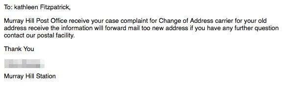

Replying to [@captain\_primate](https://twitter.com/EthanWatrall/status/407173324528054272)

> I know, right? I’m still trying to figure out where October went\.

 [Sun Dec 01 15:50:36 +0000 2013](https://twitter.com/kfitz/status/407174902085865472)

----

> This is apparently the year my warranty ran out\. In the last 2 wks I’ve had 2 moles biopsied, 3 teeth rebonded &amp; a 10\-min glaucoma scare\.

 [Tue Dec 03 01:41:02 +0000 2013](https://twitter.com/kfitz/status/407685876500926464)

----

> The moles came back “weird\-looking” \(the official diagnosis\), the teeth are fine, and I do not actually have glaucoma\. But enough already\.

 [Tue Dec 03 01:42:39 +0000 2013](https://twitter.com/kfitz/status/407686284766109696)

----

Replying to [@briancroxall](https://twitter.com/briancroxall/status/407686214545051648)

> Will they let me keep my unlimited data plan?

 [Tue Dec 03 01:43:25 +0000 2013](https://twitter.com/kfitz/status/407686479843176448)

----

Replying to [@briancroxall](https://twitter.com/briancroxall/status/407686752942718976)

> Classy\!

 [Tue Dec 03 01:46:53 +0000 2013](https://twitter.com/kfitz/status/407687350144495616)

----

Replying to [@jcmeloni](https://twitter.com/jcmeloni/status/407693044545499137)

> Dude\. Am trying\!

 [Tue Dec 03 02:14:11 +0000 2013](https://twitter.com/kfitz/status/407694220447973376)

----

> RT @MLACommons: Wondering how to use Twitter effectively at \#mla14? Guest contributor @roopikarisam shares her tips: http://convention\.commons\.mla\.org/2013/12/03/virtual\-mla\-a\-quick\-guide\-to\-using\-twitter\-at\-the\-mla\-convention/

 [Tue Dec 03 16:26:20 +0000 2013](https://twitter.com/kfitz/status/407908672388730880)

----

Replying to [@nancybaym](https://twitter.com/nancybaym/status/408221193825964032)

> I was excited when I found mine, too\. There’s something great in someone valuing your work enough to make a copy of it available\.

 [Wed Dec 04 13:40:16 +0000 2013](https://twitter.com/kfitz/status/408229266787405824)

----

> Crucial new report from CLIR &amp; National Film Preservation Board, LOC: The Survival of American Silent Feature Films\. http://www\.clir\.org/pubs/reports/pub158

 [Wed Dec 04 14:03:21 +0000 2013](https://twitter.com/kfitz/status/408235074237509632)

----

> Coming to \#MLA14? Join the 2014 MLA Convention group on @MLACommons for announcements, recommendations, and more\. http://commons\.mla\.org/groups/2014\-mla\-convention\-620574474/

 [Wed Dec 04 15:11:26 +0000 2013](https://twitter.com/kfitz/status/408252208992747520)

----

> Will \#MLA14 be your 1st MLA convention? Join the @MLACommons group for first\-time attendees to get advice and ideas\. http://commons\.mla\.org/groups/first\-time\-convention\-attendees/

 [Wed Dec 04 15:12:59 +0000 2013](https://twitter.com/kfitz/status/408252598320631808)

----

Replying to [@the\_blochian and @MLACommons](https://twitter.com/the_blochian/status/408254700069605376)

> Exactly why we created the group\! It’s important to have a human\-sized point of entry\.

 [Wed Dec 04 15:22:49 +0000 2013](https://twitter.com/kfitz/status/408255076382556160)

----

Replying to [@ncecire](https://twitter.com/ncecire/status/408271493035216896)

> Horrible loss\.

 [Wed Dec 04 16:31:08 +0000 2013](https://twitter.com/kfitz/status/408272265881878528)

----

> Devastated to hear of the passing of José Muñoz\. Horrible, horrible loss\.

 [Wed Dec 04 18:45:41 +0000 2013](https://twitter.com/kfitz/status/408306126430957569)

----

Replying to [@rgfeal](https://twitter.com/rgfeal/status/408307878265516032)

> My age\.

 [Wed Dec 04 18:55:09 +0000 2013](https://twitter.com/kfitz/status/408308510414630912)

----

Replying to [@wynkenhimself](https://twitter.com/wynkenhimself/status/408377942499409920)

> Those are some gorgeous kittehs\!

 [Wed Dec 04 23:36:08 +0000 2013](https://twitter.com/kfitz/status/408379221149773824)

----

Replying to [@annehelen](https://twitter.com/annehelen/status/408417437512503296)

> Watched the last three episodes over the last couple of nights and thought exactly the same thing\. \(“Everybody’s happy\!”\)

 [Thu Dec 05 02:46:36 +0000 2013](https://twitter.com/kfitz/status/408427156428320768)

----

> My last few weeks have been one non\-stop medical complaint\. Today’s whine is about the flu shot I got yesterday\. Snif\.

 [Thu Dec 05 13:39:55 +0000 2013](https://twitter.com/kfitz/status/408591564999766016)

----

Replying to [@jwolman](https://twitter.com/jwolman/status/408650206742577152)

> That article, man\. Anybody who thinks Brooklyn is “dripping with authenticity” needs to be sent to a farm town for a year\.

 [Thu Dec 05 17:44:42 +0000 2013](https://twitter.com/kfitz/status/408653170160963584)

----

Replying to [@jwolman](https://twitter.com/jwolman/status/408653280424644608)

> Oh definitely\. I’m just picturing the reporter’s fists clenching when that guy started talking about the values of “my generation\.”

 [Thu Dec 05 17:46:01 +0000 2013](https://twitter.com/kfitz/status/408653500806365185)

----

Replying to [@jwolman](https://twitter.com/jwolman/status/408653625112543232)

> I have been trying not to focus on that\.

 [Thu Dec 05 17:46:48 +0000 2013](https://twitter.com/kfitz/status/408653699087863808)

----

Replying to [@shannonmattern](https://twitter.com/shannonmattern/status/408950123490598912)

> What? Shannon, that’s awful\! I really hope today can behave better than that\.

 [Fri Dec 06 13:43:17 +0000 2013](https://twitter.com/kfitz/status/408954802971103232)

----

Replying to [@shannonmattern](https://twitter.com/shannonmattern/status/408955370921414656)

> Seriously\. I’m getting a bit misanthropic just hearing about it\!

 [Fri Dec 06 13:46:09 +0000 2013](https://twitter.com/kfitz/status/408955524756279297)

----

Replying to [@mkgold and @shannonmattern](https://twitter.com/mkgold/status/408957509257666561)

> No kidding\. People are effing nuts, have I mentioned that before?

 [Fri Dec 06 13:57:19 +0000 2013](https://twitter.com/kfitz/status/408958332301742080)

----

Replying to [@jvinopal and @lettersfromvani](https://twitter.com/jvinopal/status/409057643840692224)

> Jargonesque: it’s from blackjack; if you get dealt a pair, you can split the cards into 2 hands &amp; double your bet

 [Fri Dec 06 20:34:19 +0000 2013](https://twitter.com/kfitz/status/409058241503830016)

----

Replying to [@derivativedos](https://twitter.com/22ss33tt44uu/status/409479617620484096)

> Thanks for the correction\. Will try to remember next time I’m in Vegas\.

 [Sun Dec 08 01:00:46 +0000 2013](https://twitter.com/kfitz/status/409487684223004675)

----

Replying to [@pmhswe](https://twitter.com/pmhswe/status/409705024021733378)

> You might look at Airmail; it’s still in active development and it learned a lot from Sparrow\.

 [Sun Dec 08 16:02:06 +0000 2013](https://twitter.com/kfitz/status/409714511994560512)

----

Replying to [@pmhswe](https://twitter.com/pmhswe/status/409728036460691456)

> You’re welcome\! I’m glad you like it; I’ve found it quite powerful\. Like Sparrow, it gets Gmail labels, which no one else does\.

 [Sun Dec 08 17:32:11 +0000 2013](https://twitter.com/kfitz/status/409737182601936896)

----

Replying to [@surlyF](https://twitter.com/MikeFurlough/status/409821482693324801)

> I’m in DC already &amp; it’s a mess here too\. They’ve closed the NoVa schools tomorrow already\. I’ll hope the flying is ok\!

 [Sun Dec 08 23:22:31 +0000 2013](https://twitter.com/kfitz/status/409825346448814080)

----

Replying to [@surlyF](https://twitter.com/MikeFurlough/status/409821482693324801)

> Oh wait\. You mean you’re already here too\. Duh\. And welcome\.

 [Sun Dec 08 23:22:33 +0000 2013](https://twitter.com/kfitz/status/409825353885302784)

----

Replying to [@surlyF](https://twitter.com/MikeFurlough/status/409825818911596544)

> No kidding\! We came down to spend the weekend in G’town; not terribly looking forward to the taxi\-based hotel switch tomorrow\.

 [Sun Dec 08 23:31:10 +0000 2013](https://twitter.com/kfitz/status/409827522348847104)

----

Replying to [@sleonchnm and @dancohen](https://twitter.com/sharonmleon/status/409829503314444288)

> Fairfax schools are also closed\. It’s pretty sloppy out there\.

 [Sun Dec 08 23:42:17 +0000 2013](https://twitter.com/kfitz/status/409830321413427200)

----

Replying to [@sleonchnm and @dancohen](https://twitter.com/sharonmleon/status/409830658648080384)

> I’ve got to get from Rosslyn/Georgetown to the Capital Hilton about that time\. Not looking forward to the ride\.

 [Sun Dec 08 23:49:06 +0000 2013](https://twitter.com/kfitz/status/409832038091751424)

----

Replying to [@sleonchnm](https://twitter.com/sharonmleon/status/409832219461828608)

> Possibly, though there’s still getting from the hotel to the metro on this end\. I’m sure we’ll sort it out\.

 [Sun Dec 08 23:51:00 +0000 2013](https://twitter.com/kfitz/status/409832512694018048)

----

Replying to [@sleonchnm](https://twitter.com/sharonmleon/status/409832966253473792)

> We walked the Key Bridge in for lunch today\. It was… bracing, I think is the word\.

 [Sun Dec 08 23:53:46 +0000 2013](https://twitter.com/kfitz/status/409833209489547265)

----

Replying to [@sleonchnm](https://twitter.com/sharonmleon/status/409833340905476096)

> We have to move tomorrow, though, because I’ve apparently wiped the hotel out of Irish &amp; have had to move on to bourbon\.

 [Sun Dec 08 23:55:27 +0000 2013](https://twitter.com/kfitz/status/409833635446292480)

----

Replying to [@sleonchnm and @iceskatingbears](https://twitter.com/sharonmleon/status/409842564507140096)

> I think that’s a fair assessment\. \#scholcomm

 [Mon Dec 09 00:32:32 +0000 2013](https://twitter.com/kfitz/status/409842967021887489)

----

Replying to [@dancohen and @iceskatingbears](https://twitter.com/dancohen/status/409843937009221632)

> CNI, of course\! We will converge, weather permitting\.

 [Mon Dec 09 00:45:54 +0000 2013](https://twitter.com/kfitz/status/409846331088179200)

----

Replying to [@epistemographer and @dancohen](https://twitter.com/epistemographer/status/409847466021117952)

> Hey, excellent\. I'll look forward to it\.

 [Mon Dec 09 00:54:47 +0000 2013](https://twitter.com/kfitz/status/409848564752605184)

----

Replying to [@seth\_denbo](https://twitter.com/seth_denbo/status/410054324145119232)

> NEW would be a big detour \(it’s the lakefront airport in New Orleans\)\! I hope they got you closer than that…

 [Mon Dec 09 14:54:16 +0000 2013](https://twitter.com/kfitz/status/410059829286555648)

----

Replying to [@seth\_denbo](https://twitter.com/seth_denbo/status/410060440711233536)

> Ugh\. It was a nasty day to be traveling; glad you’re safely on\.

 [Mon Dec 09 18:17:13 +0000 2013](https://twitter.com/kfitz/status/410110901233393664)

----

> RT @veek: Did you commit to reviewing \#DH2014 proposals? PLEASE submit them before deadline this Sunday\! Please RT, too\.

 [Mon Dec 09 18:46:12 +0000 2013](https://twitter.com/kfitz/status/410118195488755713)

----

Replying to [@JenHoward](https://twitter.com/JenHoward/status/410118489920139264)

> \*waves from the front of the room\*

 [Mon Dec 09 18:52:01 +0000 2013](https://twitter.com/kfitz/status/410119661544833024)

----

Replying to [@JenHoward](https://twitter.com/JenHoward/status/410120097923989504)

> Yes\! I was wondering why Cliff had wind chimes on stage with him\.

 [Mon Dec 09 18:54:33 +0000 2013](https://twitter.com/kfitz/status/410120298303086592)

----

Replying to [@wynkenhimself](https://twitter.com/wynkenhimself/status/410146516003995648)

> \*totally ded of cute\*

 [Mon Dec 09 21:11:42 +0000 2013](https://twitter.com/kfitz/status/410154814187003905)

----

Replying to [@surlyF](https://twitter.com/MikeFurlough/status/410495568730144768)

> What’s a carbon copy?

 [Tue Dec 10 19:47:23 +0000 2013](https://twitter.com/kfitz/status/410495982439526401)

----

> Dear everyone who’s debating the casting of DFW in the forthcoming biopic: Can we start with a huge OH MY GOD PLEASE DON’T MAKE THAT MOVIE?

 [Thu Dec 12 15:23:46 +0000 2013](https://twitter.com/kfitz/status/411154418110050304)

----

> The very thought is painful\.

 [Thu Dec 12 15:24:38 +0000 2013](https://twitter.com/kfitz/status/411154635056230400)

----

> Seriously\. I just want to sit down and cry\.

 [Thu Dec 12 15:27:10 +0000 2013](https://twitter.com/kfitz/status/411155271084679168)

----

Replying to [@ayjay](https://twitter.com/ayjay/status/411156055100383233)

> It is the better course, without question\.

 [Thu Dec 12 15:31:37 +0000 2013](https://twitter.com/kfitz/status/411156392150839296)

----

Replying to [@ayjay](https://twitter.com/ayjay/status/411156524854022145)

> In my case, it’s less my physical heart that is at risk, but the basic principle still holds\.

 [Thu Dec 12 15:33:22 +0000 2013](https://twitter.com/kfitz/status/411156832296898560)

----

Replying to [@briancroxall](https://twitter.com/briancroxall/status/411558315555307520)

> Familiar\-looking, eh? Very nice early Christmas present\!

 [Fri Dec 13 18:09:27 +0000 2013](https://twitter.com/kfitz/status/411558500406681600)

----

Replying to [@samplereality](https://twitter.com/samplereality/status/411587823675133952)

> Woo hoo\! Congratulations\.

 [Fri Dec 13 20:16:25 +0000 2013](https://twitter.com/kfitz/status/411590453067530241)

----

Replying to [@wynkenhimself](https://twitter.com/wynkenhimself/status/411848060483158019)

> Big hugs to you, today and on the 3rd\.

 [Sat Dec 14 13:40:01 +0000 2013](https://twitter.com/kfitz/status/411853081828421632)

----

Replying to [@jmittell](https://twitter.com/jmittell/status/412700268489609216)

> Thanks for the redaction\. For better or for worse, I’m watching it tonight\.

 [Mon Dec 16 21:53:25 +0000 2013](https://twitter.com/kfitz/status/412702026628608000)

----

Replying to [@jmittell](https://twitter.com/jmittell/status/412702140990521344)

> Will do\!

 [Mon Dec 16 21:55:53 +0000 2013](https://twitter.com/kfitz/status/412702648836829184)

----

> RT @samplereality: I have turned  
> off your retweets  
> that were in  
> my face  
>   
> and which  
> you probably thought  
> were so good  
>   
> Block me  
> I subtweet  
> s…

 [Tue Dec 17 13:51:26 +0000 2013](https://twitter.com/kfitz/status/412943120314404864)

----

Replying to [@JenHoward](https://twitter.com/JenHoward/status/413312749297352704)

> That is cold comfort, Jen\. I’m so sorry this happened to you and your family\!

 [Wed Dec 18 14:29:35 +0000 2013](https://twitter.com/kfitz/status/413315110267273217)

----

Replying to [@jcmeloni](https://twitter.com/jcmeloni/status/413333608368472064)

> Tocqueville is one of our faves: http://tocquevillerestaurant\.com

 [Wed Dec 18 15:53:30 +0000 2013](https://twitter.com/kfitz/status/413336226033565696)

----

> I weep for our once\-great system of universal education\. 
> 
> 

 [Thu Dec 19 13:19:52 +0000 2013](https://twitter.com/kfitz/status/413659949387239424)

----

Replying to [@jmittell and @nowviskie](https://twitter.com/jmittell/status/413665169383124992)

> Actually, now that you say that, I have to acknowledge the possibility that the message was spoken rather than typed\.

 [Thu Dec 19 14:16:32 +0000 2013](https://twitter.com/kfitz/status/413674213292380160)

----

Replying to [@nowviskie and @jmittell](https://twitter.com/nowviskie/status/413695962855772160)

> It would certainly be less awful\. A failure to correct poor transcription seems less awful\.

 [Thu Dec 19 15:44:07 +0000 2013](https://twitter.com/kfitz/status/413696253567184896)

----

Replying to [@nowviskie and @jmittell](https://twitter.com/nowviskie/status/413696815167700992)

> Indeed\.

 [Thu Dec 19 15:48:30 +0000 2013](https://twitter.com/kfitz/status/413697355654131712)

----

Replying to [@amandafrench, @nowviskie and @jmittell](https://twitter.com/amandafrench/status/413696925557223424)

> It’s possible, though the name I pixeled out did not encourage that conclusion\.

 [Thu Dec 19 15:49:09 +0000 2013](https://twitter.com/kfitz/status/413697520351858688)

----

> RT @katinalynn: My fave tip from @nmhouston’s \#mla14 post: Speaking up in awkward situations “can be an act of social generosity\.” http://t…

 [Fri Dec 20 20:12:05 +0000 2013](https://twitter.com/kfitz/status/414126078215880704)

----

Replying to [@jcmeloni and @nmhouston](https://twitter.com/jcmeloni/status/414136296513490945)

> You should\! Are you logged in?

 [Fri Dec 20 20:56:41 +0000 2013](https://twitter.com/kfitz/status/414137300957032449)

----

Replying to [@rgfeal, @jcmeloni and @nmhouston](https://twitter.com/rgfeal/status/414137433190440960)

> I believe one is\!

 [Fri Dec 20 20:57:46 +0000 2013](https://twitter.com/kfitz/status/414137571758067712)

----

Replying to [@jcmeloni](https://twitter.com/jcmeloni/status/414137625856208896)

> Srsly, log in, and tell me if you still don’t have commenting privs\. If so, something is wrong\.

 [Fri Dec 20 20:58:35 +0000 2013](https://twitter.com/kfitz/status/414137780143673344)

----

Replying to [@jcmeloni](https://twitter.com/jcmeloni/status/414139339229396992)

> ARGH\. Thanks for letting me know\. We’ll try to see if we can reproduce\. Were you logging in from @nmhouston’s post?

 [Fri Dec 20 21:07:09 +0000 2013](https://twitter.com/kfitz/status/414139935508414464)

----

Replying to [@jcmeloni](https://twitter.com/jcmeloni/status/414139521337667584)

> Oh dude, I know that problem\. It was trying to take you to the dashboard, which you don’t have privs on\. A bit of WP stupidity\.

 [Fri Dec 20 21:07:48 +0000 2013](https://twitter.com/kfitz/status/414140097039433728)

----

Replying to [@jcmeloni](https://twitter.com/jcmeloni/status/414139521337667584)

> We’re trying to work on a fix for that\.

 [Fri Dec 20 21:08:04 +0000 2013](https://twitter.com/kfitz/status/414140164890697728)

----

Replying to [@jcmeloni](https://twitter.com/jcmeloni/status/414179965823774721)

> Yeah, it’s a login redirect problem in multisite WP\. Wants to take you to the dashboard of any blog, whether it’s yours or not\.

 [Sat Dec 21 01:27:58 +0000 2013](https://twitter.com/kfitz/status/414205570305261571)

----

> I moved in at the end of May\. Today, nearly 7 months later, I hung the last of the pictures and dropped off a bunch of stuff for donation\.

 [Sun Dec 22 17:59:34 +0000 2013](https://twitter.com/kfitz/status/414817504243232769)

----

Replying to [@boone](https://twitter.com/boone/status/414820520233013248)

> Five days after I moved I left the country and did not return until the nesting impulse had relented\.

 [Sun Dec 22 18:51:13 +0000 2013](https://twitter.com/kfitz/status/414830502080937984)

----

Replying to [@BendProf](https://twitter.com/BendProf/status/414868241496805376)

> Yes\! Can't speak for the hotel, but the neighborhood is fab\. Good proximity to lots of great stuff\. Quite safe at all hours\.

 [Sun Dec 22 21:36:23 +0000 2013](https://twitter.com/kfitz/status/414872067251904512)

----

Replying to [@captain\_primate](https://twitter.com/EthanWatrall/status/414882091357466624)

> I'm so sorry to hear\! I hope power is back way sooner than it sounds\. :\(

 [Sun Dec 22 22:17:09 +0000 2013](https://twitter.com/kfitz/status/414882325277995008)

----

> New post at Planned Obsolescence: Tools and Values\. http://wp\.me/p2w8Sh\-FD

 [Tue Dec 24 14:23:15 +0000 2013](https://twitter.com/kfitz/status/415487843008794624)

----

Replying to [@jwolman](https://twitter.com/jwolman/status/415557076241620992)

> Those sound\.\.\. vaguely\.\.\. familiar\.\.\.

 [Tue Dec 24 18:59:30 +0000 2013](https://twitter.com/kfitz/status/415557361097789441)

----

> The whole trick to the Christmas Eve gumbo is getting the roux dark enough before the effects of the prosecco kick in\.

 [Tue Dec 24 21:47:29 +0000 2013](https://twitter.com/kfitz/status/415599634929946624)

----

> New post at Planned Obsolescence: The Tree\. http://wp\.me/p2w8Sh\-FH

 [Wed Dec 25 14:18:43 +0000 2013](https://twitter.com/kfitz/status/415849090748915713)

----

Replying to [@dancohen](https://twitter.com/dancohen/status/415862331458211840)

> Thanks\! It’s my favorite\.

 [Wed Dec 25 15:12:48 +0000 2013](https://twitter.com/kfitz/status/415862698065534977)

----

Replying to [@wynkenhimself](https://twitter.com/wynkenhimself/status/415868758968655872)

> Thanks, and to you too\!

 [Wed Dec 25 15:39:50 +0000 2013](https://twitter.com/kfitz/status/415869502258438144)

----

Replying to [@shermandorn](https://twitter.com/shermandorn/status/415869281025273857)

> Thanks so much, and happy holidays\!

 [Wed Dec 25 15:40:36 +0000 2013](https://twitter.com/kfitz/status/415869695552946176)

----

Replying to [@rrkennison](https://twitter.com/rrkennison/status/415875341987872768)

> And to you\!

 [Wed Dec 25 16:08:18 +0000 2013](https://twitter.com/kfitz/status/415876668201664512)

----

Replying to [@shanakimball](https://twitter.com/shanakimball/status/415888722992066560)

> And to you\!

 [Wed Dec 25 16:56:44 +0000 2013](https://twitter.com/kfitz/status/415888854638669824)

----

> An utterly random request: I recently explored a service that gathers citation info about your work &amp; displays it with Altmetric data\. \+

 [Fri Dec 27 13:02:33 +0000 2013](https://twitter.com/kfitz/status/416554698435731456)

----

> It was not ORCID, but it was not unrelated\. And I’m drawing a complete blank on what it was\. Any ideas?

 [Fri Dec 27 13:03:16 +0000 2013](https://twitter.com/kfitz/status/416554877498961920)

----

Replying to [@copystar and @ImpactStory](https://twitter.com/copystar/status/416555075708780544)

> That would make sense, though I have a memory of the little pinwheels…

 [Fri Dec 27 13:05:35 +0000 2013](https://twitter.com/kfitz/status/416555461195096065)

----

Replying to [@jenniferwaller](https://twitter.com/jenniferwaller/status/416560928558432257)

> Possibly Impact Story, but the site used the Altmetric donuts\.

 [Fri Dec 27 13:31:23 +0000 2013](https://twitter.com/kfitz/status/416561951201062912)

----

Replying to [@rogerwhitson](https://twitter.com/RogerWhitson/status/416562673065545728)

> It wasn’t them, but that’s a neat project\.

 [Fri Dec 27 13:35:12 +0000 2013](https://twitter.com/kfitz/status/416562911365304320)

----

Replying to [@jenniferwaller and @papershipapp](https://twitter.com/jenniferwaller/status/416564471352807424)

> Yes\! That’s it\. Thanks\!

 [Fri Dec 27 13:44:58 +0000 2013](https://twitter.com/kfitz/status/416565369542021120)

----

> Phew\. It was @papershipapp\. Thanks, @jenniferwaller\!

 [Fri Dec 27 13:46:36 +0000 2013](https://twitter.com/kfitz/status/416565780130836480)

----

> RT @MLACommons: We’ve created a guide to using \#mla14 resources\. Info about the mobile program, web annotations, groups, &amp; more\! http://t\.c…

 [Fri Dec 27 21:56:03 +0000 2013](https://twitter.com/kfitz/status/416688957800603648)

----

> New post at Planned Obsolescence: Being Wrong\. http://wp\.me/p2w8Sh\-FK

 [Sun Dec 29 13:29:20 +0000 2013](https://twitter.com/kfitz/status/417286211619659776)

----

Replying to [@Ted\_Underwood](https://twitter.com/Ted_Underwood/status/417296606161952768)

> Indeed\. Of course, I could be wrong\.

 [Sun Dec 29 14:20:24 +0000 2013](https://twitter.com/kfitz/status/417299065236647936)

----

Replying to [@Ted\_Underwood](https://twitter.com/Ted_Underwood/status/417296606161952768)

> Not \(just\) being funny there; it could represent a failure of my own experience rather than of grad school itself\.

 [Sun Dec 29 14:21:08 +0000 2013](https://twitter.com/kfitz/status/417299246770323456)

----

> Some very smart questions &amp; thoughts from @brettbobley @elotroalex @jmittell &amp; @cplong on my recent peer review post: http://www\.plannedobsolescence\.net/blog/tools\-and\-values/\#comments

 [Sun Dec 29 14:25:52 +0000 2013](https://twitter.com/kfitz/status/417300440284667904)

----

Replying to [@RohanMaitzen and @Ted\_Underwood](https://twitter.com/RohanMaitzen/status/417303240380669952)

> Absolutely\! Developing an open enough voice as a blogger requires being prepared for your inevitable wrongness\.

 [Sun Dec 29 14:38:46 +0000 2013](https://twitter.com/kfitz/status/417303684478173184)

----

Replying to [@cplong and @PubPhilJ](https://twitter.com/cplong/status/417323051068719105)

> Fantastic\! I’ll look forward to hearing more\.

 [Sun Dec 29 15:56:23 +0000 2013](https://twitter.com/kfitz/status/417323217318338561)

----

Replying to [@Ted\_Underwood, @ayjay and @nowviskie](https://twitter.com/Ted_Underwood/status/417326758900162562)

> I completely agree, but would suggest that there is a quite charged politics around the notion of humility\.

 [Sun Dec 29 16:11:44 +0000 2013](https://twitter.com/kfitz/status/417327080331046912)

----

Replying to [@Ted\_Underwood, @ayjay and @nowviskie](https://twitter.com/Ted_Underwood/status/417326758900162562)

> I also regret that this conversation isn’t being captured in the comments on the post itself…

 [Sun Dec 29 16:12:52 +0000 2013](https://twitter.com/kfitz/status/417327366936219648)

----

Replying to [@ayjay](https://twitter.com/ayjay/status/417327650676281346)

> Interesting\! I really long to drag the conversations back the other direction, where they can play out more ruminatively\.

 [Sun Dec 29 16:14:44 +0000 2013](https://twitter.com/kfitz/status/417327837717487616)

----

Replying to [@KLeuner, @Ted\_Underwood, @ayjay and @nowviskie](https://twitter.com/KLeuner/status/417329124856721408)

> Exactly what I’m working on\. I don’t want to let this slip away\.

 [Sun Dec 29 16:22:34 +0000 2013](https://twitter.com/kfitz/status/417329807480090624)

----

Replying to [@ayjay](https://twitter.com/ayjay/status/417330428450598912)

> Thank you\! I do appreciate it\.

 [Sun Dec 29 16:26:43 +0000 2013](https://twitter.com/kfitz/status/417330853598224384)

----

Replying to [@karikraus](https://twitter.com/karikraus/status/417346705168674817)

> Thanks, Kari\!

 [Sun Dec 29 17:37:08 +0000 2013](https://twitter.com/kfitz/status/417348571953131521)

----

> RT @MLACommons: Want to build something from \#mla14 program data \(XML/JSON\)? Grab the source code for http://mla14\.org at https://t\.c…

 [Mon Dec 30 20:15:40 +0000 2013](https://twitter.com/kfitz/status/417750858110361600)

----

Replying to [@warnick and @briancroxall](https://twitter.com/warnick/status/417757454513233920)

> Looks cool \- like it could handle 95% of what I’m using Evernote for, w/o locking my stuff in a proprietary format\.

 [Mon Dec 30 20:45:10 +0000 2013](https://twitter.com/kfitz/status/417758282800185344)

----

Replying to [@warnick and @briancroxall](https://twitter.com/warnick/status/417759279882715136)

> I’ve sort of adjusted to it, mostly by simplifying \(shutting off the sidebar, going to snippet view\)\.

 [Mon Dec 30 20:50:17 +0000 2013](https://twitter.com/kfitz/status/417759566915719168)

----

Replying to [@warnick and @briancroxall](https://twitter.com/warnick/status/417759544568475648)

> Hmm\. But I assume they’re all exportable \(or drag and droppable\) to plain text?

 [Mon Dec 30 20:50:54 +0000 2013](https://twitter.com/kfitz/status/417759724181147648)

----

Replying to [@warnick and @briancroxall](https://twitter.com/warnick/status/417760105166168064)

> Which is exactly what I hate about Evernote\. Export? Sure\! To ENEX\. Or crap HTML\. Useful, that\.

 [Mon Dec 30 20:53:24 +0000 2013](https://twitter.com/kfitz/status/417760353599365121)

----

Replying to [@warnick and @briancroxall](https://twitter.com/warnick/status/417760433274372096)

> Nice\. I’ll have to test out the demo\.

 [Mon Dec 30 20:54:12 +0000 2013](https://twitter.com/kfitz/status/417760555878076416)

----

Replying to [@briancroxall](https://twitter.com/briancroxall/status/417842808171814912)

> You have no idea how much I envy you that first reading\.

 [Tue Dec 31 02:30:53 +0000 2013](https://twitter.com/kfitz/status/417845284954472448)

----

> RT @MLAconvention: What are your favorite Chicago restaurants? Post your recommendations to the \#mla14 convention attendees group\! http://t…

 [Tue Dec 31 19:04:55 +0000 2013](https://twitter.com/kfitz/status/418095441788809216)

----

> The only thing I wanted to finish and failed in 2013 is Bleeding Edge\. \(About 25% to go\.\) I feel pretty good about that\.

 [Tue Dec 31 22:30:26 +0000 2013](https://twitter.com/kfitz/status/418147160325361664)

----

> \(Okay, there are huge lists of things I didn’t manage to do, but that’s the only thing I swore I’d complete and didn’t\. See?\)

 [Tue Dec 31 22:31:21 +0000 2013](https://twitter.com/kfitz/status/418147389917372416)

----

Replying to [@wynkenhimself](https://twitter.com/wynkenhimself/status/418148140089606145)

> Totally\!

 [Tue Dec 31 22:36:38 +0000 2013](https://twitter.com/kfitz/status/418148721546002432)

----

Replying to [@ricksva](https://twitter.com/ricksva/status/418150073626021888)

> Pynchon’s latest\.

 [Tue Dec 31 22:42:43 +0000 2013](https://twitter.com/kfitz/status/418150252676669441)

----

Replying to [@eetempleton](https://twitter.com/eetempleton/status/418142883917488129)

> Oh no\. I hope you feel better quickly\!

 [Tue Dec 31 22:47:39 +0000 2013](https://twitter.com/kfitz/status/418151491451760640)

----

Replying to [@eetempleton](https://twitter.com/eetempleton/status/418151759966531584)

> Truly\. \*\*knocks wood\*\*

 [Tue Dec 31 22:49:18 +0000 2013](https://twitter.com/kfitz/status/418151907321192449)

----

> Ah, we've hit the point at which having a really great dinner and being home in front of the tv by 7\.45 is the best possible New Year's Eve\.

 [Wed Jan 01 01:11:06 +0000 2014](https://twitter.com/kfitz/status/418187595156586496)