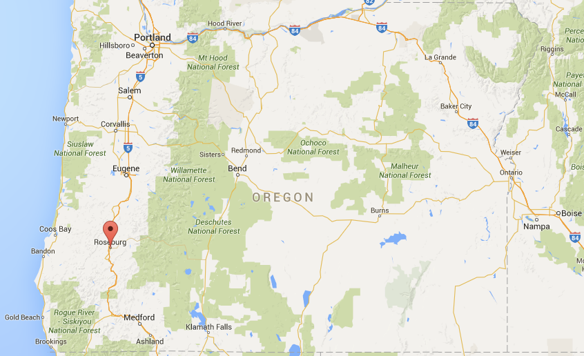

> RT @MLACommons: In the Oct\. issue of the Commons Wire: member updates, developing books online, showcasing your research, &amp; more\! http://t\.…

 [Thu Oct 01 15:20:11 +0000 2015](https://twitter.com/kfitz/status/649604731044696064)

----

Replying to [@captain\_primate](https://twitter.com/EthanWatrall/status/649648134746972160)

> Oh, is @GeorgeOnline here? I have been SO focused…

 [Thu Oct 01 18:16:10 +0000 2015](https://twitter.com/kfitz/status/649649019245973505)

----

Replying to [@mkirschenbaum and @GeorgeOnline](https://twitter.com/mkirschenbaum/status/649649047939252224)

> Salads in this image may be less sad than they appear\.

 [Thu Oct 01 18:17:17 +0000 2015](https://twitter.com/kfitz/status/649649299966529537)

----

> RT @Slate: At least 15 killed in Oregon college massacre, according to police: http://slate\.me/1MKIebT 
> 
> 

 [Thu Oct 01 18:37:11 +0000 2015](https://twitter.com/kfitz/status/649654306124210177)

----

> I just don’t know what to say\.

 [Thu Oct 01 18:38:25 +0000 2015](https://twitter.com/kfitz/status/649654616804737024)

----

Replying to [@cplong](https://twitter.com/cplong/status/649683001400541184)

> Thanks, Chris\. The Commons team is excited about the project\!

 [Fri Oct 02 01:56:40 +0000 2015](https://twitter.com/kfitz/status/649764908503040000)

----

Replying to [@katinalynn and @MLACommons](https://twitter.com/katinalynn/status/649726757831057408)

> Thanks, Katina\!

 [Fri Oct 02 01:57:02 +0000 2015](https://twitter.com/kfitz/status/649764999708151808)

----

> “And trying to explain, ‘We both have blogs’ didn’t help matters\.” \(2003\!\) https://twitter\.com/GeorgeOnline/status/650009701103460352

 [Fri Oct 02 18:40:20 +0000 2015](https://twitter.com/kfitz/status/650017485815681024)

----

Replying to [@GeorgeOnline](https://twitter.com/GeorgeOnline/status/652948946504056833)

> Ugh indeed\. Hoping this passes quickly, and that you and yours are safe\.

 [Sat Oct 10 21:23:22 +0000 2015](https://twitter.com/kfitz/status/652957620886720512)

----

Replying to [@GeorgeOnline](https://twitter.com/GeorgeOnline/status/652971069670866944)

> No kidding\. It’s been awful — and awfully familiar — to watch\.

 [Sat Oct 10 23:41:31 +0000 2015](https://twitter.com/kfitz/status/652992384658243585)

----

> Come join us\! https://twitter\.com/MLACommons/status/654028766830829569

 [Tue Oct 13 21:59:11 +0000 2015](https://twitter.com/kfitz/status/654053797124284416)

----

> Interesting open annotation &amp; social reading project from Digital Culture Books, James Brown’s Ethical Programs: http://blog\.press\.umich\.edu/2015/10/ethical\-programs\-is\-the\-focus\-of\-a\-digital\-book\-club\-next\-week/

 [Fri Oct 16 14:12:07 +0000 2015](https://twitter.com/kfitz/status/655023419826839552)

----

> Still thinking about this\. https://twitter\.com/kfitz/status/391520359495008256

 [Mon Oct 19 11:17:49 +0000 2015](https://twitter.com/kfitz/status/656066716607336448)

----

> A new post for \#oaweek: Opening Up Open Access\. http://www\.plannedobsolescence\.net/opening\-up\-open\-access/

 [Mon Oct 19 13:25:16 +0000 2015](https://twitter.com/kfitz/status/656098791972429824)

----

Replying to [@martin\_eve](https://twitter.com/martin_eve/status/656101682917560324)

> Thanks for the heads\-up\! Repaired\.

 [Mon Oct 19 13:43:30 +0000 2015](https://twitter.com/kfitz/status/656103382931894272)

----

Replying to [@gluejar](https://twitter.com/gluejar/status/656112276412485632)

> It’s a typo\.

 [Mon Oct 19 14:20:25 +0000 2015](https://twitter.com/kfitz/status/656112671566274560)

----

Replying to [@gluejar](https://twitter.com/gluejar/status/656113202862886912)

> Sorry to disappoint\! :\)

 [Mon Oct 19 14:24:05 +0000 2015](https://twitter.com/kfitz/status/656113596036943872)

----

Replying to [@ekansa and @malbooth](https://twitter.com/ekansa/status/656206703851999232)

> Ooh, thanks\! I’ll look forward to reading\.

 [Mon Oct 19 20:35:12 +0000 2015](https://twitter.com/kfitz/status/656206990629281792)

----

> RT @MLACommons: New in CORE for \#OAWeek: "Faithful Witnessing as Practice: Decolonial Readings\.\.\." by Yomaira Figueroa https://t\.co/53iMyyR…

 [Tue Oct 20 01:06:04 +0000 2015](https://twitter.com/kfitz/status/656275153282662402)

----

> RT @MLACommons: Tania Modleski made her work on Boogie Nights openly available with CORE\. What have you shared? http://dx\.doi\.org/10\.17613/M69592 \#OA…

 [Tue Oct 20 21:14:06 +0000 2015](https://twitter.com/kfitz/status/656579166368694272)

----

> RT @MLACommons: Saskia Ziolkowski made "Dreams and Ambiguity on Svevo's European Stage" \#OA with CORE\. What have you shared? https://t\.co/I…

 [Tue Oct 20 22:11:07 +0000 2015](https://twitter.com/kfitz/status/656593514197852161)

----

> Wow, this is a brilliant appointment\! https://twitter\.com/ProfHolloway/status/656892676407717888

 [Wed Oct 21 18:01:56 +0000 2015](https://twitter.com/kfitz/status/656893195066998785)

----

> RT @rrkennison: Am loving watching @MLACommons deposits pour in in response to \#OAWeek outreach\. Go, go, MLA members\!\! \(And, as one, I shou…

 [Wed Oct 21 18:52:57 +0000 2015](https://twitter.com/kfitz/status/656906031981842432)

----

> We hope all MLA members will share their work via @MLACommons CORE during \#OAweek \(and beyond\)\! https://twitter\.com/rrkennison/status/656905811336278016

 [Wed Oct 21 18:54:20 +0000 2015](https://twitter.com/kfitz/status/656906380952150019)

----

Replying to [@JenServenti](https://twitter.com/JenServenti/status/656928864434847744)

> Oh dear\.

 [Wed Oct 21 20:24:06 +0000 2015](https://twitter.com/kfitz/status/656928969690914818)

----

> RT @MLACommons: Yes, http://academia\.edu and institutional \(or disciplinary\) repositories are v far from being the same thing\!  https:/…

 [Fri Oct 23 01:16:24 +0000 2015](https://twitter.com/kfitz/status/657364917306179586)

----

> RT @MLACommons: This essay couldn't join the archive \(sniff\!\), but CORE has lots of really great stuff\. Explore &amp; deposit today\!  https://t…

 [Fri Oct 23 19:46:50 +0000 2015](https://twitter.com/kfitz/status/657644368459866112)

----

> New post on Planned Obsolescence: Academia, Not Edu\. http://www\.plannedobsolescence\.net/academia\-not\-edu/

 [Mon Oct 26 11:56:46 +0000 2015](https://twitter.com/kfitz/status/658613235889737728)

----

> RT @martin\_eve: Gary Hall &amp; @kfitz's recent posts led me to post this, at last:   
> "http://Academia\.edu’s peer\-review experiments" https:…

 [Mon Oct 26 12:35:08 +0000 2015](https://twitter.com/kfitz/status/658622890817028096)

----

> RT @rgfeal: Three ideas for helping adjuncts\. I've done all 3\. http://www\.mla\.org/contribute\_travel &amp; http://precaricorps\.org/about/donate &amp; http://www\.newfacultymajority\.info/join\-nfm …

 [Mon Oct 26 17:54:38 +0000 2015](https://twitter.com/kfitz/status/658703293766610945)

----

> Three excellent ways to help\. https://twitter\.com/rgfeal/status/658699773470470144

 [Mon Oct 26 17:55:57 +0000 2015](https://twitter.com/kfitz/status/658703625783541760)

----

> I posted a thing about academia\-not\-edu this morning\. It seems to have touched a nerve\. http://www\.plannedobsolescence\.net/academia\-not\-edu/

 [Mon Oct 26 17:57:44 +0000 2015](https://twitter.com/kfitz/status/658704075412762624)

----

Replying to [@djp2025](https://twitter.com/djp2025/status/658704556986114048)

> Thanks for letting me know, Daniel\! Enjoy \#dlfforum — wish I could be there\.

 [Mon Oct 26 18:00:30 +0000 2015](https://twitter.com/kfitz/status/658704771789017089)

----

> RT @archaeomap: Worth a read esp to get your work 'out there' &amp; those on the job market; short term gain long term pain \#openaccess  https:…

 [Mon Oct 26 19:37:20 +0000 2015](https://twitter.com/kfitz/status/658729141097861120)

----

> RT @ArSaintMartin: Voilà pourquoi je n'utilise pas ce Facebook pseudo\-académique : "Academia, Not Edu"\. http://www\.plannedobsolescence\.net/academia\-not\-edu/ via @kfitz

 [Mon Oct 26 19:37:24 +0000 2015](https://twitter.com/kfitz/status/658729156591620097)

----

Replying to [@GMUScholComm](https://twitter.com/GMUScholComm/status/658733316389122048)

> We are in the process of building that integration\!

 [Mon Oct 26 19:54:25 +0000 2015](https://twitter.com/kfitz/status/658733439705817088)

----

Replying to [@OldFortunatus](https://twitter.com/OldFortunatus/status/658739504006696960)

> Excellent\! Let us know if we can help\.

 [Tue Oct 27 10:46:20 +0000 2015](https://twitter.com/kfitz/status/658957900476477443)

----

Replying to [@u203d and @j\_w\_baker](https://twitter.com/@u203d/status/658984050280022016)

> The MLA is a membership organization, and participation in the Commons is a member benefit\. However \+

 [Tue Oct 27 12:37:40 +0000 2015](https://twitter.com/kfitz/status/658985914866253824)

----

Replying to [@u203d and @j\_w\_baker](https://twitter.com/@u203d/status/658984050280022016)

> The majority of the Commons is openly readable \(and deposits openly downloadable\) by all\.

 [Tue Oct 27 12:37:43 +0000 2015](https://twitter.com/kfitz/status/658985927876943872)

----

Replying to [@nickmirzoeff](https://twitter.com/nickmirzoeff/status/658985424908451841)

> It is a membership\-based commons, supported by and for its members\. Is a collective less open than a VC\-funded network?

 [Tue Oct 27 12:38:50 +0000 2015](https://twitter.com/kfitz/status/658986211655200772)

----

Replying to [@u203d and @j\_w\_baker](https://twitter.com/@u203d/status/658988140489785344)

> Yes, I think that’s fair\.

 [Tue Oct 27 12:47:51 +0000 2015](https://twitter.com/kfitz/status/658988477841854464)

----

> I was encouraged to republish “Academia, Not Edu” on Medium, so: https://medium\.com/@kfitz/academia\-not\-edu\-91e98702298f?source\=tw\-e5ae2b782b0a\-1445950126883

 [Tue Oct 27 12:49:33 +0000 2015](https://twitter.com/kfitz/status/658988908412313600)

----

Replying to [@nickmirzoeff](https://twitter.com/nickmirzoeff/status/658994566918492161)

> Mellon isn’t a long\-term solution; they require a sustainability model\.

 [Tue Oct 27 13:35:56 +0000 2015](https://twitter.com/kfitz/status/659000581147725824)

----

> RT @rgfeal: The \#MLA Cte on Contingent Labor has launched an action for @CampusEquityWk: https://contingent\.commons\.mla\.org \#CEW2015 \#ActionforAllies

 [Tue Oct 27 19:43:55 +0000 2015](https://twitter.com/kfitz/status/659093184182669313)

----

> RT @rgfeal: RLT: \#MLA is sending letter to dept chairs asking them if they offer multiyr contracts for adjuncts\. If not, what's stopping yo…

 [Tue Oct 27 19:44:07 +0000 2015](https://twitter.com/kfitz/status/659093237941030913)

----

> RT @HillaryClinton: Giving students a world class education also means making sure adjunct faculty are paid fairly\. \#CampusEquityWeek https…

 [Tue Oct 27 19:46:34 +0000 2015](https://twitter.com/kfitz/status/659093853383868417)

----

Replying to [@obrienatrix](https://twitter.com/obrienatrix/status/659103437938778112)

> Thank you\!

 [Tue Oct 27 20:25:11 +0000 2015](https://twitter.com/kfitz/status/659103569111592961)

----

Replying to [@martin\_eve](https://twitter.com/martin_eve/status/659348309329510400)

> Sorry to be slow responding; busy day\! Repo/DOI import is on our roadmap, but it’s going to be a bit before we get there\.

 [Wed Oct 28 18:45:59 +0000 2015](https://twitter.com/kfitz/status/659440993859686400)

----

Replying to [@martin\_eve](https://twitter.com/martin_eve/status/659348309329510400)

> Will keep you posted\!

 [Wed Oct 28 18:46:08 +0000 2015](https://twitter.com/kfitz/status/659441031038017537)

----

Replying to [@martin\_eve](https://twitter.com/martin_eve/status/659442513376387072)

> Yes\! I can get you in touch with our dev if you like\.

 [Wed Oct 28 18:59:39 +0000 2015](https://twitter.com/kfitz/status/659444434677858304)

----

Replying to [@martin\_eve](https://twitter.com/martin_eve/status/659444616060641286)

> Excellent\! More TK\.

 [Wed Oct 28 19:02:52 +0000 2015](https://twitter.com/kfitz/status/659445241045479424)

----

> RT @MLACommons: Interested in \#OpenAccess and 20th C lit? @martin\_eve just overtook @rrkennison as top contributor to our repository https:…

 [Wed Oct 28 19:32:20 +0000 2015](https://twitter.com/kfitz/status/659452657564827648)

----

> RT @MLACommons: Want to attend \#mla16 but need childcare? Let us know by tomorrow \(10/30\): https://news\.commons\.mla\.org/2015/10/20/30\-october\-childcare\-deadline/

 [Thu Oct 29 13:42:57 +0000 2015](https://twitter.com/kfitz/status/659727122798366720)

----

> RT @MLACommons: Wondering about the MLA and \#CEW2015? The Committee on Contingent Labor in the Profession interviewed @rgfeal: https://t\.co…

 [Thu Oct 29 13:43:13 +0000 2015](https://twitter.com/kfitz/status/659727186614726656)

----

> RT @MLACommons: We're delighted so many of our members are sharing scholarship via our \#openaccess repository\. Enjoy—and join them\! https:/…

 [Thu Oct 29 13:53:03 +0000 2015](https://twitter.com/kfitz/status/659729661270732804)

----

> RT @katinalynn: So great to see the new @MLAnews site go live\! Congrats to all involved\. Best professional org website, hands down https://…

 [Thu Oct 29 13:56:11 +0000 2015](https://twitter.com/kfitz/status/659730453109342208)

----

Replying to [@alexcomninos](https://twitter.com/alexcomninos/status/659992751447121920)

> Take a look at http://commons\.mla\.org/core\.

 [Fri Oct 30 10:38:58 +0000 2015](https://twitter.com/kfitz/status/660043207242326016)

----

> RT @dancohen: 1/ It’s Campus Equity Week this week, highlighting the incredibly poor conditions a growing % of faculty work under: https://…

 [Fri Oct 30 12:37:39 +0000 2015](https://twitter.com/kfitz/status/660073077850701824)

----

> RT @dancohen: 2/ It's an issue that affects not just the instructors, who deserve better, but also students &amp; higher ed in general\. Worth s…

 [Fri Oct 30 12:37:47 +0000 2015](https://twitter.com/kfitz/status/660073108649431041)

----

> RT @dancohen: 3/ Otherwise we keep sliding toward this kind of gig economy in univs\. Other prof orgs should support CEW’s efforts\. https://…

 [Fri Oct 30 12:37:55 +0000 2015](https://twitter.com/kfitz/status/660073141708943360)

----

Replying to [@RahawaHaile](https://twitter.com/RahawaHaile/status/660105006524325888)

> YAY\!\!\!\!

 [Fri Oct 30 14:46:53 +0000 2015](https://twitter.com/kfitz/status/660105598487408641)

----

> RT @rgfeal: Excited that past MLA pres Sid Smith's book is open access\! Transforming Doctoral Education in Good Enough Times https://t\.co/P…

 [Fri Oct 30 15:39:33 +0000 2015](https://twitter.com/kfitz/status/660118851007418368)

----

Replying to [@kfitz](https://twitter.com/lmrhody/status/660152662768361473)

> So, so excited about this\. Can’t wait to have you in town, @lmrhody\!  https://twitter\.com/lmrhody/status/660152662768361473

 [Fri Oct 30 18:15:39 +0000 2015](https://twitter.com/kfitz/status/660158136465145857)

----

> RT @MLAconvention: Reminder: If you need childcare for \#mla16, let us know today\! https://www\.mla\.org/Convention/MLA\-2016/Childcare

 [Fri Oct 30 19:05:44 +0000 2015](https://twitter.com/kfitz/status/660170740403150848)

----

> RT @MLACommons: Gaurav Desai's "Oceans Connect: The Indian Ocean and African Identities" is now available \#openaccess via CORE\! https://t\.c…

 [Sat Oct 31 19:08:34 +0000 2015](https://twitter.com/kfitz/status/660533841875046400)