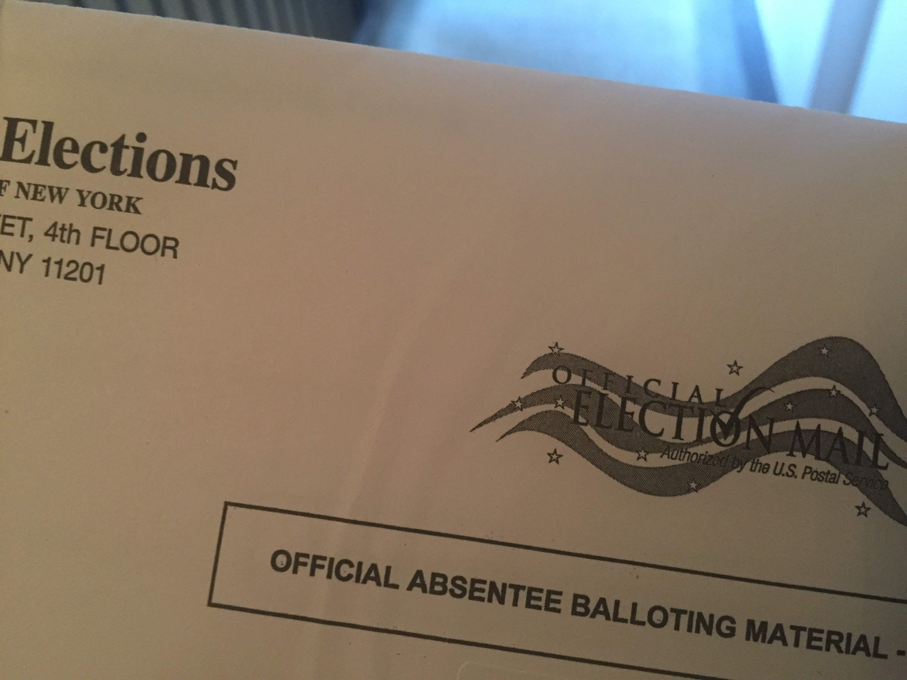

> The start of some new work, at last \-\- Generous Thinking: The University and the Public Good\. http://www\.plannedobsolescence\.net/generous\-thinking\-the\-university\-and\-the\-public\-good/

 [Sun Oct 02 16:23:15 +0000 2016](https://twitter.com/kfitz/status/782616946923626499)

----

Replying to [@commish24](https://twitter.com/commish24/status/782618123719610368)

> That is excellent to hear\!

 [Sun Oct 02 16:30:18 +0000 2016](https://twitter.com/kfitz/status/782618721345015810)

----

Replying to [@martin\_eve](https://twitter.com/martin_eve/status/782629756319723520)

> Ooh, yes — thanks so much\!

 [Sun Oct 02 17:14:43 +0000 2016](https://twitter.com/kfitz/status/782629901937545216)

----

Replying to [@martin\_eve](https://twitter.com/martin_eve/status/782629863974993920)

> Both crucial to ask\.

 [Sun Oct 02 17:15:15 +0000 2016](https://twitter.com/kfitz/status/782630035643572225)

----

Replying to [@pennyb](https://twitter.com/DocPhoenix/status/782629808396173312)

> Yes, exactly\. Thanks so much\!

 [Sun Oct 02 17:15:31 +0000 2016](https://twitter.com/kfitz/status/782630100038803456)

----

> RT @wynkenhimself: This call for generosity as a scholarly practice resonates fiercely\. https://twitter\.com/kfitz/status/782616946923626499

 [Sun Oct 02 17:28:15 +0000 2016](https://twitter.com/kfitz/status/782633306512846848)

----

> This looks fabulous\. https://twitter\.com/rgfeal/status/782633297700589568

 [Sun Oct 02 17:30:31 +0000 2016](https://twitter.com/kfitz/status/782633878079045632)

----

Replying to [@kfitz](https://twitter.com/fraistat/status/782635497873080320)

> Oh, I so wish you could, @fraistat\! \(And thanks\!\) https://twitter\.com/fraistat/status/782635497873080320

 [Sun Oct 02 17:38:16 +0000 2016](https://twitter.com/kfitz/status/782635828510093312)

----

Replying to [@LibSkrat](https://twitter.com/LibSkrat/status/782636743438675969)

> \*Absolutely\.\*

 [Sun Oct 02 17:42:25 +0000 2016](https://twitter.com/kfitz/status/782636870069002240)

----

Replying to [@LibSkrat](https://twitter.com/LibSkrat/status/782637099899949056)

> Ooh, I need to look into that\. Many thanks\!

 [Sun Oct 02 17:43:45 +0000 2016](https://twitter.com/kfitz/status/782637206431264768)

----

Replying to [@MarkSV](https://twitter.com/MarkSV/status/782639568096866305)

> Thank you\!

 [Sun Oct 02 17:53:58 +0000 2016](https://twitter.com/kfitz/status/782639778495954949)

----

Replying to [@nowviskie](https://twitter.com/nowviskie/status/782636631345987584)

> Thanks, Bethany\. Looking forward to seeing where this conversation leads\.

 [Sun Oct 02 17:54:27 +0000 2016](https://twitter.com/kfitz/status/782639899849662464)

----

Replying to [@audreywatters](https://twitter.com/audreywatters/status/782640197745807360)

> That is so, so good to hear — and it’s reassuring to me as well\. Thank you\!

 [Sun Oct 02 17:56:34 +0000 2016](https://twitter.com/kfitz/status/782640431238709252)

----

Replying to [@rgfeal](https://twitter.com/rgfeal/status/782654117823016960)

> That’s great\. I am looking forward to reading it\!

 [Sun Oct 02 18:53:20 +0000 2016](https://twitter.com/kfitz/status/782654719005163521)

----

Replying to [@katinalynn](https://twitter.com/katinalynn/status/782661264266895360)

> Thanks so much, Katina\. I’m pretty excited about it, though there’s a long road ahead\!

 [Sun Oct 02 19:23:19 +0000 2016](https://twitter.com/kfitz/status/782662263094317057)

----

Replying to [@dancohen](https://twitter.com/dancohen/status/782701299741720576)

> Aw, shucks\. Thanks, Dan\!

 [Sun Oct 02 21:59:28 +0000 2016](https://twitter.com/kfitz/status/782701561034178560)

----

Replying to [@RoxanneShirazi](https://twitter.com/RoxanneShirazi/status/782749961263906816)

> Oh, that’s lovely\!

 [Mon Oct 03 01:17:33 +0000 2016](https://twitter.com/kfitz/status/782751409678745600)

----

> RT @RoxanneShirazi: Reminds me of Eco’s academic humility \(1977\): “the knowledge that anyone can teach us something” https://twitter\.com/kfitz/status/782616946923626499

 [Mon Oct 03 01:18:17 +0000 2016](https://twitter.com/kfitz/status/782751595679416320)

----

> RT @eleni\_castro: A positive look on the potential future for studies in the humanities by listening and working with the communities we us…

 [Mon Oct 03 12:38:28 +0000 2016](https://twitter.com/kfitz/status/782922768333627392)

----

> Yesterday, I opened what I hope will be an ongoing conversation about Generous Thinking: http://www\.plannedobsolescence\.net/generous\-thinking\-the\-university\-and\-the\-public\-good/

 [Mon Oct 03 13:09:40 +0000 2016](https://twitter.com/kfitz/status/782930618510348289)

----

> I am moved by the response so far\. I look forward to talking more about the project\. The first real excerpt will go up in a couple of days\.

 [Mon Oct 03 13:09:44 +0000 2016](https://twitter.com/kfitz/status/782930636105453568)

----

> It’s simple and effective\. Support @NEHgov by writing your representatives today\! https://twitter\.com/katinalynn/status/782969907877142528

 [Mon Oct 03 16:18:58 +0000 2016](https://twitter.com/kfitz/status/782978258002411520)

----

> You are indeed a 🌟\! https://twitter\.com/RahawaHaile/status/782974012968148992

 [Mon Oct 03 16:21:37 +0000 2016](https://twitter.com/kfitz/status/782978923839758337)

----

Replying to [@arteagarachel](https://twitter.com/@arteagarachel/status/782989453841174528)

> You are so, so kind\. I wish I could heart this more\!

 [Mon Oct 03 17:45:01 +0000 2016](https://twitter.com/kfitz/status/782999912355098624)

----

> Yes, yes, yes\! https://twitter\.com/ssiperstein/status/782992621581008896

 [Mon Oct 03 17:45:27 +0000 2016](https://twitter.com/kfitz/status/783000021528707072)

----

Replying to [@elotroalex](https://twitter.com/elotroalex/status/783009352387006465)

> Thanks, Alex\!

 [Mon Oct 03 18:34:30 +0000 2016](https://twitter.com/kfitz/status/783012368104222720)

----

Replying to [@lesliekwchan](https://twitter.com/lesliekwchan/status/783021404283371520)

> Thank you, Leslie\! I’m looking forward to developing this conversation\.

 [Mon Oct 03 19:15:53 +0000 2016](https://twitter.com/kfitz/status/783022779004227584)

----

Replying to [@minhyoungsong](https://twitter.com/minhyoungsong/status/783041665963556865)

> Maybe\! Where is your piece coming out? I’ll keep an eye out for it\.

 [Mon Oct 03 20:32:30 +0000 2016](https://twitter.com/kfitz/status/783042060844732416)

----

Replying to [@minhyoungsong and @schlundvials](https://twitter.com/minhyoungsong/status/783043536228904961)

> Fantastic\. Thanks for letting me know\!

 [Mon Oct 03 20:43:57 +0000 2016](https://twitter.com/kfitz/status/783044944617504769)

----

> This is a question I would have liked to have heard\! https://twitter\.com/trevormunoz/status/783358521177964544

 [Tue Oct 04 17:31:38 +0000 2016](https://twitter.com/kfitz/status/783358931565502465)

----

> This morning, the first bit of Generous Thinking\. Comments very much desired\. http://www\.plannedobsolescence\.net/generous\-thinking\-introduction/

 [Wed Oct 05 13:34:13 +0000 2016](https://twitter.com/kfitz/status/783661571708887041)

----

Replying to [@elotroalex](https://twitter.com/elotroalex/status/783678192154468352)

> Thanks, Alex\! Trust me when I say I do too\.

 [Wed Oct 05 15:22:44 +0000 2016](https://twitter.com/kfitz/status/783688881992597504)

----

> I so, so look forward to having more to share\! https://twitter\.com/elotroalex/status/783678440230772736

 [Wed Oct 05 15:25:29 +0000 2016](https://twitter.com/kfitz/status/783689576372133888)

----

> RT @MLAnews: If you support the humanities, let your officials know with this one\-click form\! https://twitter\.com/HumanitiesAll/status/783333237858897920

 [Wed Oct 05 15:26:55 +0000 2016](https://twitter.com/kfitz/status/783689936964837378)

----

> We very much look forward to launching this federated network\! See http://hcommons\.org for more\. https://twitter\.com/humcommons/status/783751465441648640

 [Wed Oct 05 19:55:26 +0000 2016](https://twitter.com/kfitz/status/783757510725566466)

----

> This is exactly right\. I’m enormously grateful for the response, and looking forward to pondering further\. https://twitter\.com/GaviaLib/status/783759131677040640

 [Wed Oct 05 20:18:54 +0000 2016](https://twitter.com/kfitz/status/783763414095126528)

----

> RT @MLAnews: What theses would you add to the 64 Charles Bernstein offers in a new Profession essay? https://profession\.commons\.mla\.org/2016/10/04/95\-theses/

 [Wed Oct 05 21:26:47 +0000 2016](https://twitter.com/kfitz/status/783780499743465473)

----

Replying to [@kfitz](https://twitter.com/@kfitz/status/783812495462977536)

> When the invisible disability suddenly becomes visible\. Thank you so much for this, @sramsay\. https://twitter\.com/sramsay/status/783812495462977536

 [Wed Oct 05 23:50:47 +0000 2016](https://twitter.com/kfitz/status/783816736244137984)

----

Replying to [@shannonmattern](https://twitter.com/shannonmattern/status/783874938822361088)

> Thank you so much, Shannon\! I really appreciate that\.

 [Thu Oct 06 09:01:08 +0000 2016](https://twitter.com/kfitz/status/783955238013337600)

----

Replying to [@Desimumbles](https://twitter.com/Desimumbles/status/784394876280418305)

> Ooh, that’s great\! I’ll hope to have further updates soon\.

 [Fri Oct 07 14:09:48 +0000 2016](https://twitter.com/kfitz/status/784395305840025600)

----

> RT @waxpancake: every day until november 8 
> 
> <video controls><source src="../../media/784729229715988480-VX79K3Anhhr6n5J8.mp4">Your browser does not support the video tag.</video>

 [Sat Oct 08 12:16:42 +0000 2016](https://twitter.com/kfitz/status/784729229715988480)

----

Replying to [@amndw2](https://twitter.com/amndw2/status/785108805306712064)

> Thanks, A\. Let’s do\!

 [Sun Oct 09 13:28:41 +0000 2016](https://twitter.com/kfitz/status/785109733237727233)

----

> RT @notanna1: "It is a call not just for more open critical practices but for more open scholarly selves\." \#highered https://twitter\.com/kfitz/status/782616946923626499

 [Sun Oct 09 13:29:16 +0000 2016](https://twitter.com/kfitz/status/785109877823791104)

----

> I am terrified\.

 [Mon Oct 10 00:22:24 +0000 2016](https://twitter.com/kfitz/status/785274245207187456)

----

Replying to [@wynkenhimself](https://twitter.com/wynkenhimself/status/785277017512181760)

> I cannot imagine\.

 [Mon Oct 10 00:34:13 +0000 2016](https://twitter.com/kfitz/status/785277218238898180)

----

Replying to [@rgfeal](https://twitter.com/rgfeal/status/785277703452823553)

> He is fully prepared to burn everything down tonight\.

 [Mon Oct 10 00:37:09 +0000 2016](https://twitter.com/kfitz/status/785277957828927488)

----

Replying to [@Ted\_Underwood and @rgfeal](https://twitter.com/Ted_Underwood/status/785278489326940160)

> Exactly\.

 [Mon Oct 10 00:39:45 +0000 2016](https://twitter.com/kfitz/status/785278612408766464)

----

Replying to [@rgfeal](https://twitter.com/rgfeal/status/785278601860087808)

> I believe both of those things\. I also believe that he is capable of anything\.

 [Mon Oct 10 00:40:30 +0000 2016](https://twitter.com/kfitz/status/785278800783368192)

----

Replying to [@beecroftaj and @rgfeal](https://twitter.com/beecroftaj/status/785279019617058816)

> No, you’re right: he’ll definitely go down with this\. But I’m afraid he’s just out to inflict maximum damage on the way\.

 [Mon Oct 10 00:49:26 +0000 2016](https://twitter.com/kfitz/status/785281048984875009)

----

Replying to [@rgfeal and @beecroftaj](https://twitter.com/rgfeal/status/785283339682975744)

> Again, I believe she is ready\. And I believe he is going nuclear\.

 [Mon Oct 10 00:59:10 +0000 2016](https://twitter.com/kfitz/status/785283497833459713)

----

> The silence of the NBC stream is both blissful and portentous\.

 [Mon Oct 10 01:00:18 +0000 2016](https://twitter.com/kfitz/status/785283784690237441)

----

> Great first question: remember that kids are — and should be — watching\.

 [Mon Oct 10 01:07:23 +0000 2016](https://twitter.com/kfitz/status/785285566581596160)

----

> Bigly\.

 [Mon Oct 10 01:55:26 +0000 2016](https://twitter.com/kfitz/status/785297657375973376)

----

> So very sorry that I’m not\! https://twitter\.com/terrainsvagues/status/785472489249988608

 [Mon Oct 10 13:40:15 +0000 2016](https://twitter.com/kfitz/status/785475031409254400)

----

Replying to [@CameronNeylon and @terrainsvagues](https://twitter.com/CameronNeylon/status/785477981644939264)

> \*blush\*

 [Mon Oct 10 13:54:10 +0000 2016](https://twitter.com/kfitz/status/785478535095914496)

----

> If you are looking for a way to give, please consider Scholars for Haiti Relief\. http://avidly\.lareviewofbooks\.org/2016/10/10/scholars\-for\-haiti\-relief/

 [Mon Oct 10 21:21:59 +0000 2016](https://twitter.com/kfitz/status/785591230033952768)

----

Replying to [@martin\_eve](https://twitter.com/martin_eve/status/785811299829559296)

> Congratulations\! That’s a great milestone\.

 [Tue Oct 11 12:50:30 +0000 2016](https://twitter.com/kfitz/status/785824899298385920)

----

Replying to [@kfitz](https://twitter.com/melstanfill/status/785815462974197760)

> \.@melstanfill Thanks for this\! I do think that those who have already been heard have a greater responsibility to listen, but I hope \+

 [Tue Oct 11 14:48:05 +0000 2016](https://twitter.com/kfitz/status/785854490356383745)

----

Replying to [@kfitz](https://twitter.com/melstanfill/status/785815462974197760)

> \.@melstanfill that a more generous model of professionalism might shift status away from playing the critical game and toward sthg richer\.

 [Tue Oct 11 14:48:11 +0000 2016](https://twitter.com/kfitz/status/785854514440077312)

----

Replying to [@kfitz](https://twitter.com/melstanfill/status/785815462974197760)

> \.@melstanfill It’s in all of our interests\. We’ve had enough live\-by\-the\-sword &amp; its inevitable outcome\.

 [Tue Oct 11 14:48:18 +0000 2016](https://twitter.com/kfitz/status/785854546383953921)

----

Replying to [@j\_zimms and @colindickey](https://twitter.com/j_zimms/status/785906563684798464)

> I have a recurrent dream in which I discover new rooms in my house, so this is kinda freaking me out\.

 [Tue Oct 11 18:19:12 +0000 2016](https://twitter.com/kfitz/status/785907621106679808)

----

Replying to [@marynmck](https://twitter.com/marynmck/status/785927732215427072)

> I\. Am\. Skeeved\.

 [Tue Oct 11 20:35:52 +0000 2016](https://twitter.com/kfitz/status/785942011517992961)

----

Replying to [@james3neal](https://twitter.com/james3neal/status/786233017870102528)

> Congratulations — fabulous news\! @US\_IMLS

 [Wed Oct 12 16:20:33 +0000 2016](https://twitter.com/kfitz/status/786240146941308929)

----

> 15 years before I told the people I most needed to know\. Publicly, still never, after 41 years\. https://twitter\.com/goldietaylor/status/786364887819661312

 [Thu Oct 13 01:25:22 +0000 2016](https://twitter.com/kfitz/status/786377253206843397)

----

Replying to [@wynkenhimself](https://twitter.com/wynkenhimself/status/786379133114875905)

> Backatcha\. ❤️

 [Thu Oct 13 01:33:45 +0000 2016](https://twitter.com/kfitz/status/786379365688967170)

----

> This has been a sleepless night\. I’ve been awake for hours now, trying to figure out what to say\.

 [Thu Oct 13 09:02:13 +0000 2016](https://twitter.com/kfitz/status/786492225609957376)

----

Replying to [@kfitz](https://twitter.com/kfitz/status/786492225609957376)

> Last night, in response to claims that the women weren’t credible because they didn’t come forward back when, @goldietaylor put out a call\. https://twitter\.com/goldietaylor/status/786364887819661312

 [Thu Oct 13 09:02:22 +0000 2016](https://twitter.com/kfitz/status/786492261731278849)

----

Replying to [@kfitz](https://twitter.com/kfitz/status/786492261731278849)

> Hundreds of women — and men — responded with their own stories\. Most were silent for years\. Many had never said anything until now\.

 [Thu Oct 13 09:02:26 +0000 2016](https://twitter.com/kfitz/status/786492281738129408)

----

Replying to [@kfitz](https://twitter.com/kfitz/status/786492281738129408)

> It is a heartbreaking stream, and one that is all too familiar\.

 [Thu Oct 13 09:02:30 +0000 2016](https://twitter.com/kfitz/status/786492297466765313)

----

Replying to [@kfitz](https://twitter.com/kfitz/status/786492297466765313)

> Why don’t those who have been abused come forward? Sometimes it’s shame\.

 [Thu Oct 13 09:02:37 +0000 2016](https://twitter.com/kfitz/status/786492327166640128)

----

Replying to [@kfitz](https://twitter.com/kfitz/status/786492327166640128)

> Sometimes it’s the fear of reprisal\.

 [Thu Oct 13 09:02:40 +0000 2016](https://twitter.com/kfitz/status/786492340437413888)

----

Replying to [@kfitz](https://twitter.com/kfitz/status/786492340437413888)

> Sometimes it’s the certainty that they won’t be believed\.

 [Thu Oct 13 09:02:44 +0000 2016](https://twitter.com/kfitz/status/786492354333122560)

----

Replying to [@kfitz](https://twitter.com/kfitz/status/786492354333122560)

> Sometimes it’s all three\.

 [Thu Oct 13 09:02:48 +0000 2016](https://twitter.com/kfitz/status/786492371928223744)

----

Replying to [@kfitz](https://twitter.com/kfitz/status/786492371928223744)

> It takes extraordinary courage to go public with private shame, especially when the perpetrator is powerful\.

 [Thu Oct 13 09:02:53 +0000 2016](https://twitter.com/kfitz/status/786492393147301888)

----

Replying to [@kfitz](https://twitter.com/kfitz/status/786492393147301888)

> I honor the courage of these women who are stepping forward now with a story they hoped they’d never have to tell\.

 [Thu Oct 13 09:03:00 +0000 2016](https://twitter.com/kfitz/status/786492421198741504)

----

Replying to [@kfitz](https://twitter.com/kfitz/status/786492421198741504)

> I honor their courage in the face of the onslaught that is now certain to come\.

 [Thu Oct 13 09:03:05 +0000 2016](https://twitter.com/kfitz/status/786492443596390400)

----

Replying to [@kfitz](https://twitter.com/kfitz/status/786492443596390400)

> I stand with them, and with everyone else who has faced such pain, publicly or privately\.

 [Thu Oct 13 09:03:09 +0000 2016](https://twitter.com/kfitz/status/786492460604284928)

----

Replying to [@kfitz](https://twitter.com/kfitz/status/786492460604284928)

> Support is available if you need it\. And if you can provide support, please do\. http://rainn\.org is a good place to begin\.

 [Thu Oct 13 09:03:18 +0000 2016](https://twitter.com/kfitz/status/786492498776580096)

----

Replying to [@sherah1918](https://twitter.com/SheilaABrennan/status/786670802376781824)

> Not unless you get something out of it\.

 [Thu Oct 13 20:53:20 +0000 2016](https://twitter.com/kfitz/status/786671184138166273)

----

Replying to [@sherah1918](https://twitter.com/SheilaABrennan/status/786671408181116928)

> Exactly\. If there were something in it for you \(inclusion in publication, opportunity for your own research\), then ok\. Otherwise

 [Thu Oct 13 21:04:58 +0000 2016](https://twitter.com/kfitz/status/786674109824499712)

----

Replying to [@sherah1918](https://twitter.com/SheilaABrennan/status/786671408181116928)

> you deserve to be paid\.

 [Thu Oct 13 21:05:06 +0000 2016](https://twitter.com/kfitz/status/786674145853640705)

----

Replying to [@sherah1918](https://twitter.com/SheilaABrennan/status/786671408181116928)

> The notion that scholars can do free consulting for commercial entities bothers me, obviously\.

 [Thu Oct 13 21:07:53 +0000 2016](https://twitter.com/kfitz/status/786674844452741121)

----

Replying to [@elotroalex, @seth\_denbo and @mandellc](https://twitter.com/elotroalex/status/786702699706351616)

> Great seeing you too\!

 [Fri Oct 14 01:19:38 +0000 2016](https://twitter.com/kfitz/status/786738201167851520)

----

Replying to [@moncia](https://twitter.com/moncia/status/786914468315922432)

> Sending you &lt;3

 [Fri Oct 14 14:36:26 +0000 2016](https://twitter.com/kfitz/status/786938721383899136)

----

Replying to [@jvinopal](https://twitter.com/jvinopal/status/787997790291030016)

> I am going to miss you tremendously\. But see you in Milwaukee?

 [Mon Oct 17 12:48:31 +0000 2016](https://twitter.com/kfitz/status/787998727210463233)

----

Replying to [@jvinopal](https://twitter.com/jvinopal/status/788001014347628544)

> RATS\. Makes perfect sense, of course, but rats\. I will hope for another crossing of paths soon\!

 [Mon Oct 17 13:14:29 +0000 2016](https://twitter.com/kfitz/status/788005260023463940)

----

Replying to [@sleonchnm](https://twitter.com/sharonmleon/status/788024147922345984)

> Wait, does that mean you’ll be at DLF?

 [Mon Oct 17 14:41:18 +0000 2016](https://twitter.com/kfitz/status/788027110354980865)

----

Replying to [@sleonchnm](https://twitter.com/sharonmleon/status/788027463494492160)

> Oh hey\! That’s great\. Let’s make a plan\.

 [Mon Oct 17 14:43:43 +0000 2016](https://twitter.com/kfitz/status/788027719154036736)

----

Replying to [@sleonchnm](https://twitter.com/sharonmleon/status/788027616527777793)

> \(Great minds\!\)

 [Mon Oct 17 14:44:00 +0000 2016](https://twitter.com/kfitz/status/788027787718324226)

----

Replying to [@RahawaHaile](https://twitter.com/RahawaHaile/status/788037059126722560)

> You are a hero\.

 [Mon Oct 17 15:46:33 +0000 2016](https://twitter.com/kfitz/status/788043529046065153)

----

Replying to [@jvinopal](https://twitter.com/jvinopal/status/788355019481448448)

> This is not the point of your tweet, but when did you receive your absentee ballot? Haven’t gotten mine &amp; am anxious about it\.

 [Tue Oct 18 12:39:50 +0000 2016](https://twitter.com/kfitz/status/788358928614785025)

----

Replying to [@jvinopal](https://twitter.com/jvinopal/status/788359050694131712)

> Phew\. Okay, great\. I hate feedback\-less systems\. It would be good to have some acknowledgment that the request was received\!

 [Tue Oct 18 12:41:08 +0000 2016](https://twitter.com/kfitz/status/788359254939959296)

----

Replying to [@CJ\_Daugherty](https://twitter.com/CJ_Daugherty/status/788411945183481856)

> So serious\!

 [Tue Oct 18 16:15:46 +0000 2016](https://twitter.com/kfitz/status/788413271619538944)

----

Replying to [@CJ\_Daugherty](https://twitter.com/CJ_Daugherty/status/788428272979865601)

> It’s very worrisome: how can you trust a paradigm in which light can be both particle and wave?

 [Tue Oct 18 17:18:07 +0000 2016](https://twitter.com/kfitz/status/788428960208130048)

----

Replying to [@wynkenhimself](https://twitter.com/wynkenhimself/status/788488905351950336)

> Though no doubt annoying in the moment, that is a day well spent\.

 [Tue Oct 18 22:29:13 +0000 2016](https://twitter.com/kfitz/status/788507252340686848)

----

> Friends, I have an all\-day meeting to chair tomorrow, and it’s going to start early and run late\.

 [Wed Oct 19 23:28:34 +0000 2016](https://twitter.com/kfitz/status/788884576353607681)

----

> So I wish those of you who are watching the debate strength, but for the sake of tomorrow I am going into deep avoidance mode tonight\.

 [Wed Oct 19 23:28:36 +0000 2016](https://twitter.com/kfitz/status/788884585241317376)

----

> A Russian seminar on the philosophy of education has been reading Generous Thinking\. I’d love to see your responses\. http://www\.plannedobsolescence\.net/generous\-thinking\-introduction/

 [Thu Oct 20 14:32:31 +0000 2016](https://twitter.com/kfitz/status/789112063528308736)

----

Replying to [@ayjay](https://twitter.com/ayjay/status/789459371868626952)

> Hey, thank you\! I am currently working on the chapter about reading, and you are a key interlocutor there\.

 [Fri Oct 21 13:34:07 +0000 2016](https://twitter.com/kfitz/status/789459752929472516)

----

Replying to [@cwellmon and @meusabsconditus](https://twitter.com/cwellmon/status/789470086461526016)

> That’s great to hear\. I’ll look forward to seeing where that history takes you\.

 [Fri Oct 21 14:16:45 +0000 2016](https://twitter.com/kfitz/status/789470484559638529)

----

> Super excited about this\. Thanks for sharing, @martin\_eve\! https://twitter\.com/MLACommons/status/789490769929314304

 [Fri Oct 21 15:38:22 +0000 2016](https://twitter.com/kfitz/status/789491023151980545)

----

Replying to [@martin\_eve](https://twitter.com/martin_eve/status/789492275613200388)

> Yep on both counts\. We’re working on adding that item type — thanks for pushing us to do so\!

 [Fri Oct 21 15:44:07 +0000 2016](https://twitter.com/kfitz/status/789492469368893440)

----

> FINALLY\. 
> 
> 

 [Fri Oct 21 19:58:01 +0000 2016](https://twitter.com/kfitz/status/789556364754509824)

----

Replying to [@kfitz](https://twitter.com/perrycollins/status/789566425463656448)

> Thanks for mentioning us, @perrycollins\! https://twitter\.com/perrycollins/status/789566425463656448

 [Fri Oct 21 21:16:48 +0000 2016](https://twitter.com/kfitz/status/789576192861044738)

----

Replying to [@marynmck and @knguyen](https://twitter.com/marynmck/status/789587931094593537)

> This needs one of these: https://m\.youtube\.com/watch?v\=OSbqPzRLPY0

 [Fri Oct 21 22:07:01 +0000 2016](https://twitter.com/kfitz/status/789588831720865792)

----

Replying to [@CapitolClio](https://twitter.com/CapitolClio/status/790352110424428544)

> Nope\. \*turns out the light\*

 [Mon Oct 24 00:46:06 +0000 2016](https://twitter.com/kfitz/status/790353638094999552)

----

> Very much looking forward to participating in this discussion of New Options for Sharing Scholarship\. @NYULibraries https://wp\.nyu\.edu/dss/2016/10/17/open\-in\-action\-a\-panel\-discussion\-for\-open\-acces\-week/

 [Mon Oct 24 20:26:50 +0000 2016](https://twitter.com/kfitz/status/790650779560398848)

----

> And remember: others can be negotiated with\. You do not have to sign a standard agreement that doesn’t serve your interests\. \#oaweek2016 https://twitter\.com/MLACommons/status/790943290552160256

 [Tue Oct 25 16:49:26 +0000 2016](https://twitter.com/kfitz/status/790958459080548357)

----

Replying to [@roseveleth](https://twitter.com/roseveleth/status/790989423597019137)

> That is the best\.

 [Tue Oct 25 21:16:51 +0000 2016](https://twitter.com/kfitz/status/791025754842734592)

----

> I’m not saying that I heard laughter in the office today\. https://twitter\.com/terrainsvagues/status/791020498914308096

 [Tue Oct 25 23:19:17 +0000 2016](https://twitter.com/kfitz/status/791056566581661696)

----

Replying to [@hels](https://twitter.com/hels/status/791026581858836480)

> Holy cow\. \(So to speak\.\) \#lifegoals

 [Tue Oct 25 23:23:42 +0000 2016](https://twitter.com/kfitz/status/791057679124926464)

----

> RT @familyunequal: Practicing my lines for today's panel at @NYULibraries w/ @kfitz @libmark @nicholasmwolf @moncia https://t\.co/f6gvQmVUvF

 [Wed Oct 26 15:10:35 +0000 2016](https://twitter.com/kfitz/status/791295969530900482)

----

> One thing I can say with near certainty: by some point on Saturday, this week will be over\.

 [Wed Oct 26 18:21:50 +0000 2016](https://twitter.com/kfitz/status/791344097688715264)

----

Replying to [@TentRocksV](https://twitter.com/TentRocksV/status/791344285702496256)

> ho yeah

 [Wed Oct 26 18:25:17 +0000 2016](https://twitter.com/kfitz/status/791344968623349763)

----

> I’m on my way there\. Hope you are, too\! https://twitter\.com/nyu\_ds/status/788168784762855424

 [Wed Oct 26 19:27:49 +0000 2016](https://twitter.com/kfitz/status/791360704058122240)

----

Replying to [@colindickey and @nytimesbooks](https://twitter.com/colindickey/status/791617915091116036)

> NICE\!

 [Thu Oct 27 12:38:21 +0000 2016](https://twitter.com/kfitz/status/791620049131954176)

----

Replying to [@kfitz](https://twitter.com/ayjay/status/791642400556929024)

> I am so looking forward to this\. @ayjay and I have a lot to talk about\. https://twitter\.com/ayjay/status/791642400556929024

 [Thu Oct 27 19:57:45 +0000 2016](https://twitter.com/kfitz/status/791730625480982528)

----

Replying to [@jvinopal](https://twitter.com/jvinopal/status/791978286012305408)

> Wishing you all the best in this next adventure, and hoping to see you again soon\.

 [Fri Oct 28 12:59:59 +0000 2016](https://twitter.com/kfitz/status/791987878746206209)

----

> Whoa\. https://twitter\.com/JI/status/791915843642732544

 [Fri Oct 28 13:01:32 +0000 2016](https://twitter.com/kfitz/status/791988269667852288)

----

Replying to [@LibSkrat](https://twitter.com/LibSkrat/status/792044845992857600)

> Thanks for sending this\! I’ll look forward to digging into it\.

 [Fri Oct 28 18:22:48 +0000 2016](https://twitter.com/kfitz/status/792069119952637952)

----

> “The people who can stand this kind of honest and open start to look a lot alike\.” On the dangers of strong values: https://mfbt\.ca/are\-strong\-values\-destroying\-your\-company\-b5dabf7f2f72\#\.c65dvp344

 [Sat Oct 29 13:22:44 +0000 2016](https://twitter.com/kfitz/status/792355993602502656)

----

> RLT: h/t @LibSkrat\. Lots to chew on\.

 [Sat Oct 29 13:24:00 +0000 2016](https://twitter.com/kfitz/status/792356312428322816)

----

> RT @MLACommons: It's the last day of \#OAWeek2016\. @MLAnews members, won't you upload one thing \(article, syllabus, chapter, etc\) to https:/…

 [Sun Oct 30 15:55:10 +0000 2016](https://twitter.com/kfitz/status/792756740773339136)

----

Replying to [@hels](https://twitter.com/hels/status/792827880363421696)

> That was super dramatic\.

 [Sun Oct 30 20:47:39 +0000 2016](https://twitter.com/kfitz/status/792830349223002113)

----

Replying to [@dntsqzthchrmn](https://twitter.com/dntsqzthchrmn/status/793083490480885762)

> Re things that will stick in my head, this is up there with Pynchon’s “for De Mille, young fur\-henchmen can’t be rowing\!”

 [Mon Oct 31 13:36:34 +0000 2016](https://twitter.com/kfitz/status/793084249024892928)

----

Replying to [@dntsqzthchrmn](https://twitter.com/dntsqzthchrmn/status/793084405761904640)

> Needless to say, it has a very long set\-up\.

 [Mon Oct 31 13:37:44 +0000 2016](https://twitter.com/kfitz/status/793084541602856961)