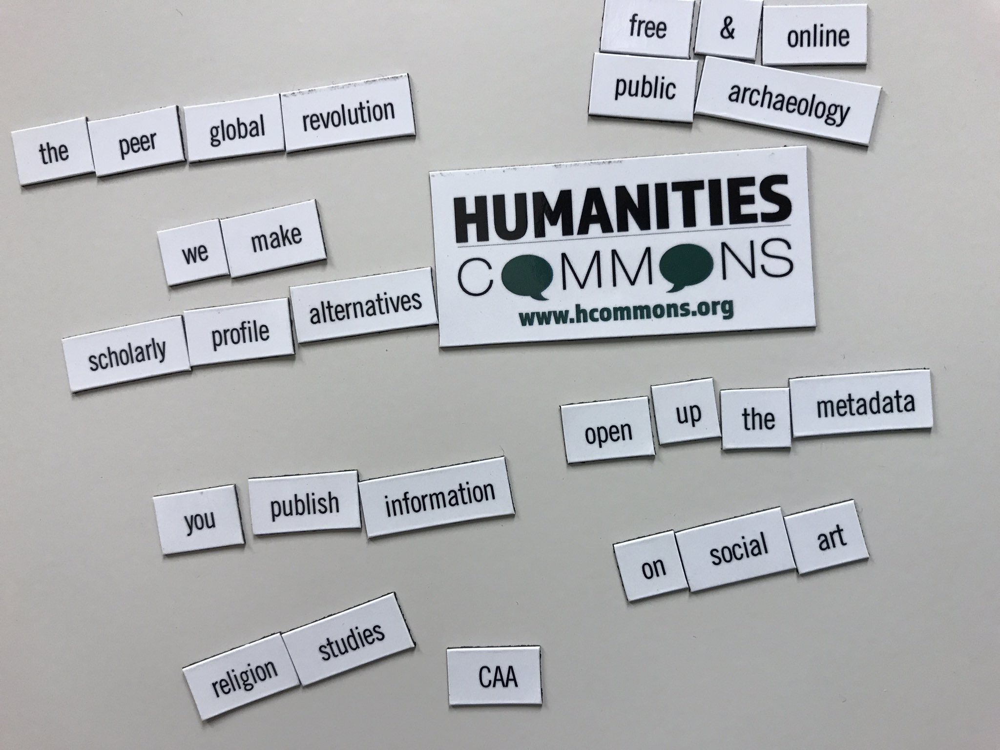
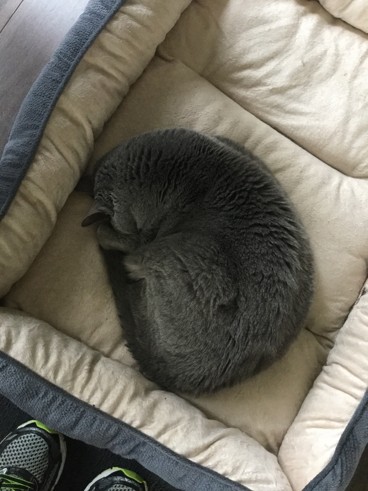
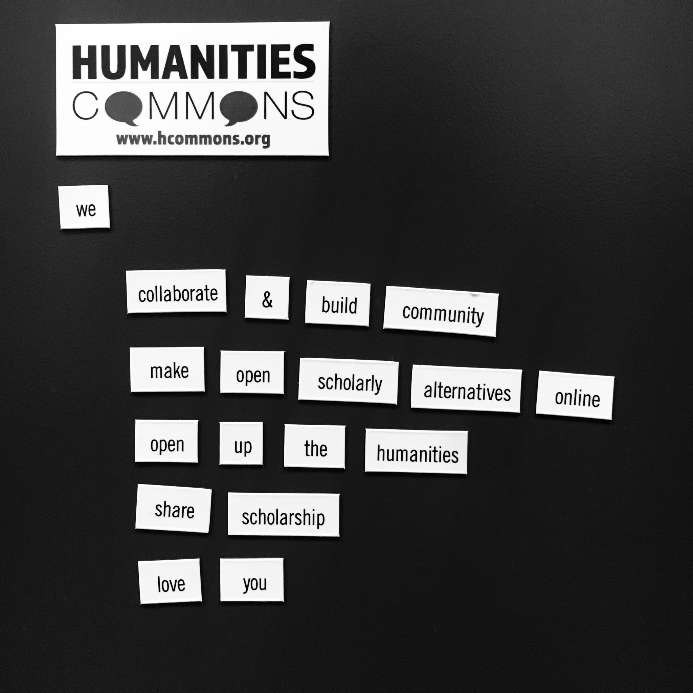

> RT @JamilSmith: If you can’t talk about gun control in the wake of the deadliest mass shooting in modern U\.S\. history, when can you? https:…

 [Mon Oct 02 17:43:04 +0000 2017](https://twitter.com/kfitz/status/914908606587338752)

----

> This day is breaking my damned heart\.

 [Mon Oct 02 19:33:44 +0000 2017](https://twitter.com/kfitz/status/914936454169677825)

----

> And the worst of it is how many days I could have said that of\.

 [Mon Oct 02 19:34:14 +0000 2017](https://twitter.com/kfitz/status/914936583278735360)

----

Replying to [@CameronNeylon](https://twitter.com/CameronNeylon/status/915656540773904384)

> 👋👋👋

 [Wed Oct 04 20:20:53 +0000 2017](https://twitter.com/kfitz/status/915673097424064516)

----

Replying to [@terrainsvagues and @edrabinski](https://twitter.com/terrainsvagues/status/916411564043001862)

> Creepy enough that he opted to freak you out by using it\.

 [Fri Oct 06 21:17:13 +0000 2017](https://twitter.com/kfitz/status/916412051848941569)

----

Replying to [@triproftri and @veek](https://twitter.com/triproftri/status/916695204534587392)

> :\)

 [Sat Oct 07 16:05:08 +0000 2017](https://twitter.com/kfitz/status/916695897832116225)

----

> I am grateful to have gotten to listen to the outcomes of the \#hssvalues Humetrics workshop today, but wish I’d been there for more\!

 [Sat Oct 07 20:32:17 +0000 2017](https://twitter.com/kfitz/status/916763128679010311)

----

Replying to [@kfitz](https://twitter.com/triciamatthew/status/917046194555244544)

> I would not have been able to articulate this, but I so recognize the energy\-protecting moves @triciamatthew describes here\. https://twitter\.com/triciamatthew/status/917046194555244544

 [Sun Oct 08 22:35:33 +0000 2017](https://twitter.com/kfitz/status/917156539634475010)

----

Replying to [@blythe\_white](https://twitter.com/blythe_white/status/917446264811413504)

> You as well\! I’ll look forward to getting the opportunity to talk more\.

 [Mon Oct 09 17:48:54 +0000 2017](https://twitter.com/kfitz/status/917446788847726598)

----

Replying to [@martin\_eve](https://twitter.com/martin_eve/status/917403928379187200)

> Martin\! This is fabulous news, indeed\! I do hope you are recovering well, and I will look forward to hearing more good things\.

 [Mon Oct 09 18:28:45 +0000 2017](https://twitter.com/kfitz/status/917456815977353217)

----

Replying to [@martin\_eve](https://twitter.com/martin_eve/status/917459549640187904)

> Yikes\. I send all my best wishes for a clear answer — and that it’s NOT the worst\.

 [Mon Oct 09 18:40:29 +0000 2017](https://twitter.com/kfitz/status/917459770910617601)

----

Replying to [@CapitolClio](https://twitter.com/CapitolClio/status/917710768757452800)

> Yay, congrats, and happy launch day\!

 [Tue Oct 10 11:39:12 +0000 2017](https://twitter.com/kfitz/status/917716138582249472)

----

> RT @NyashaJunior: Spartans\! I'm on my way\! https://twitter\.com/CFrilingos/status/918092953142390787

 [Wed Oct 11 14:57:09 +0000 2017](https://twitter.com/kfitz/status/918128342364311552)

----

> RT @terrainsvagues: Is my potential new hire a sexist jerk? Are there tells? What if I find out after hiring? Mandy has suggestions; this t…

 [Thu Oct 12 22:57:28 +0000 2017](https://twitter.com/kfitz/status/918611604765401089)

----

> RT @rschon: You mean like @humcommons ? https://twitter\.com/jeroenbosman/status/918507192516534273

 [Thu Oct 12 22:57:42 +0000 2017](https://twitter.com/kfitz/status/918611665108848641)

----

> RT @AngryBlackLady: A lot of WoC are not participating in \#WomenBoycottTwitter and are instead amplifying WoC voices\. I have a list\! https:…

 [Fri Oct 13 13:31:26 +0000 2017](https://twitter.com/kfitz/status/918831548371275776)

----

> RT @SteeleCat717: Looking to \#AmplifyWomenofColor\.\.\. Here's a few to start with @FeministaJones @MsPackyetti @ProfessorCrunk @KishonnaGray…

 [Fri Oct 13 15:08:37 +0000 2017](https://twitter.com/kfitz/status/918856003973677056)

----

> RT @SteeleCat717: @FeministaJones @MsPackyetti @ProfessorCrunk @KishonnaGray @BlackFeministMB And more\.\.\. @jluwrites @AngryBlackLady @Jamil…

 [Fri Oct 13 15:08:39 +0000 2017](https://twitter.com/kfitz/status/918856013591269376)

----

> RT @SteeleCat717: More\.\.\. @amplify285 @tressiemcphd @DrVKPatton @nancywyuen @DWill5 @profgabrielle @afroxmericana @WendyMarieOnly @marisael…

 [Fri Oct 13 15:08:42 +0000 2017](https://twitter.com/kfitz/status/918856026698510337)

----

Replying to [@CJ\_Daugherty](https://twitter.com/CJ_Daugherty/status/919908210370400256)

> This is just not normal\. Sending good wishes your way\.

 [Mon Oct 16 13:45:59 +0000 2017](https://twitter.com/kfitz/status/919922370520940544)

----

Replying to [@melissaterras](https://twitter.com/melissaterras/status/919925245615788032)

> Ugh, what a day for it\. Be safe out there\!

 [Mon Oct 16 15:20:37 +0000 2017](https://twitter.com/kfitz/status/919946187926593536)

----

> RT @humcommons: Did you know you can now upload your CV to your Humanities Commons profile? Well, now you know\. https://hcommons\.org htt…

 [Mon Oct 16 21:30:02 +0000 2017](https://twitter.com/kfitz/status/920039155857543168)

----

> Ah, LGA, we meet again\.

 [Mon Oct 16 23:29:47 +0000 2017](https://twitter.com/kfitz/status/920069289788485632)

----

> RT @PaulaKrebs: Teaching resources, more\. @MLAnews Action Network: Title IX rollback, anti\-racism, fight fake news @projhumanities https://…

 [Tue Oct 17 15:42:14 +0000 2017](https://twitter.com/kfitz/status/920314016291016705)

----

> This is a seriously cool project: ODATE, the Open Digital Archaeology Textbook Environment\. https://electricarchaeology\.ca/2017/10/17/call\-for\-collaborators\-the\-open\-digital\-archaeology\-textbook\-environment\-odate/

 [Tue Oct 17 15:43:07 +0000 2017](https://twitter.com/kfitz/status/920314236370288641)

----

Replying to [@delaubrarian, @terrainsvagues and @humcommons](https://twitter.com/@delaubrarian/status/920762091979632641)

> Thank YOU\! Looking forward to seeing what we can make happen\.

 [Wed Oct 18 22:22:05 +0000 2017](https://twitter.com/kfitz/status/920777027040563201)

----

> A fantastic, energizing, exhausting day brainstorming with a bunch of org leaders about future possibilities for @humcommons\. Stay tuned\!

 [Wed Oct 18 22:28:58 +0000 2017](https://twitter.com/kfitz/status/920778761502588928)

----

> Working toward collective solutions to shared problems: The Commons and the Common Good\. http://www\.plannedobsolescence\.net/the\-commons\-and\-the\-common\-good/ 
> 
> 

 [Fri Oct 20 11:36:58 +0000 2017](https://twitter.com/kfitz/status/921339457088950273)

----

> RT @Infomnivore: Great piece by @kfitz on @humcommons &amp; shared platform development: http://bit\.ly/2yBMJpO

 [Fri Oct 20 14:14:13 +0000 2017](https://twitter.com/kfitz/status/921379027218296833)

----

> RT @Infomnivore: @kfitz @humcommons Reminded me that we need to think in terms of ecosystems, not marketplaces—otherwise we just accept tha…

 [Fri Oct 20 14:14:15 +0000 2017](https://twitter.com/kfitz/status/921379035527221249)

----

Replying to [@Infomnivore and @humcommons](https://twitter.com/Infomnivore/status/921370741798522881)

> Yes, exactly\! And we end up accepting the notion that there \*is\* a bottom line in cases where there’s not, where things are not zero\-sum\.

 [Fri Oct 20 14:15:44 +0000 2017](https://twitter.com/kfitz/status/921379411986968581)

----

> &lt;3 https://twitter\.com/PaulaKrebs/status/921382659137392646

 [Fri Oct 20 14:48:47 +0000 2017](https://twitter.com/kfitz/status/921387725743419392)

----

Replying to [@academicdave and @samplereality](https://twitter.com/academicdave/status/922100726351978496)

> I just checked to be sure I had two\-factor on, and they now allow Google Auth as an option\!

 [Sun Oct 22 14:04:32 +0000 2017](https://twitter.com/kfitz/status/922101369489821698)

----

Replying to [@academicdave and @samplereality](https://twitter.com/academicdave/status/922114307990654977)

> Well, that’s dumb\.

 [Sun Oct 22 15:26:24 +0000 2017](https://twitter.com/kfitz/status/922121971848146946)

----

Replying to [@samplereality and @academicdave](https://twitter.com/samplereality/status/922117002449256448)

> That is a serious problem\!

 [Sun Oct 22 15:29:05 +0000 2017](https://twitter.com/kfitz/status/922122643372986368)

----

> RT @cplong: The infrastructure for 21st c\. scholarship should be shaped &amp; supported by scholars &amp; our institutions\. http://www\.plannedobsolescence\.net/the\-commons\-and\-the\-common\-good/…

 [Sun Oct 22 17:45:45 +0000 2017](https://twitter.com/kfitz/status/922157039094325250)

----

> RT @ShawnaRoss: 
> 
> 

 [Mon Oct 23 15:11:26 +0000 2017](https://twitter.com/kfitz/status/922480592859615232)

----

> My favorite quote of \#m5d, re reducing the project planning phase: “Just go off and \*do\* it, and then iterate on that shit\.” \#DLFforum

 [Mon Oct 23 20:48:15 +0000 2017](https://twitter.com/kfitz/status/922565353770586112)

----

Replying to [@ticklet](https://twitter.com/ticklet/status/922583496811524097)

> Would wear\.

 [Mon Oct 23 22:21:56 +0000 2017](https://twitter.com/kfitz/status/922588928598671360)

----

> This is going to be fantastic\. https://twitter\.com/SGLabDetroit/status/922844381601771526

 [Tue Oct 24 15:24:46 +0000 2017](https://twitter.com/kfitz/status/922846333911945216)

----

> This is a key distinction\. https://twitter\.com/briancroxall/status/923176223936843777

 [Wed Oct 25 13:17:56 +0000 2017](https://twitter.com/kfitz/status/923176802880761857)

----

> I could not possibly agree more\. https://twitter\.com/devinhhi/status/923211585040060416

 [Wed Oct 25 15:42:23 +0000 2017](https://twitter.com/kfitz/status/923213157157494785)

----

> She has been an enormous inspiration for so much of my work\. https://twitter\.com/Purdom\_L/status/923212332557324289

 [Wed Oct 25 15:43:36 +0000 2017](https://twitter.com/kfitz/status/923213460875415552)

----

> This thread\. https://twitter\.com/BerondaM/status/923219320120971264

 [Wed Oct 25 16:16:24 +0000 2017](https://twitter.com/kfitz/status/923221716935020544)

----

Replying to [@LibSkrat](https://twitter.com/LibSkrat/status/923530003740090374)

> Hey, congratulations\! So well\-deserved\.

 [Thu Oct 26 14:44:26 +0000 2017](https://twitter.com/kfitz/status/923560959783919617)

----

Replying to [@veek](https://twitter.com/veek/status/923641531952754688)

> In context, this one was pretty easy to balance: rather than planning to start a reading group, just starting it &amp; iterating was 👍

 [Thu Oct 26 20:08:19 +0000 2017](https://twitter.com/kfitz/status/923642467177680901)

----

Replying to [@meganeabbott and @littlebrown](https://twitter.com/meganeabbott/status/923919471386988545)

> OOOOH\. \*marks calendar\*

 [Fri Oct 27 15:08:56 +0000 2017](https://twitter.com/kfitz/status/923929515348451333)

----

> OOOOOOH\. \*marks calendar\* https://twitter\.com/meganeabbott/status/923919471386988545

 [Fri Oct 27 15:09:19 +0000 2017](https://twitter.com/kfitz/status/923929610852687874)

----

> Come join me &amp; my fab colleagues at MSU\! Assoc/Full Prof in lit studies, digital humanities, &amp; critical diversity\. http://careers\.msu\.edu/cw/en\-us/job/498020/professortenure\-system

 [Fri Oct 27 15:13:41 +0000 2017](https://twitter.com/kfitz/status/923930709768704000)

----

Replying to [@underwatermaya](https://twitter.com/underwatermaya/status/923937528721354752)

> We are super excited about the possibilities ahead\!

 [Fri Oct 27 15:44:27 +0000 2017](https://twitter.com/kfitz/status/923938451807928322)

----

> RT @gmbritton: What to read now: The Great Mistake: How We Wrecked Public Universities and How We Can Fix Them @cnewf https://t\.co/wwJnVncu…

 [Fri Oct 27 21:25:48 +0000 2017](https://twitter.com/kfitz/status/924024356262633472)

----

> Honestly, I just finished this three days ago\. And it’s brilliant\. If you care about the publicness of public universities, read it\. https://twitter\.com/gmbritton/status/923985204695445505

 [Fri Oct 27 21:26:47 +0000 2017](https://twitter.com/kfitz/status/924024604305317889)

----

> Ooh, this is an exciting opportunity\. https://twitter\.com/samplereality/status/923995682943488000

 [Fri Oct 27 21:31:18 +0000 2017](https://twitter.com/kfitz/status/924025740286398469)

----

> Same\. 
> 
> 

 [Sat Oct 28 15:15:19 +0000 2017](https://twitter.com/kfitz/status/924293506444783618)

----

Replying to [@bfister and @edrabinski](https://twitter.com/@bfister/status/924331784829095937)

> I was trying to think of something to say, but have no words\. So yes, this\.

 [Sat Oct 28 17:49:52 +0000 2017](https://twitter.com/kfitz/status/924332403786702848)

----

Replying to [@plragde](https://twitter.com/plragde/status/924422000185102337)

> Ki is the thing I miss most in all of NYC\. If you go back, sit at the bar w/Perry, have the omakase, and tell him Kathleen and Rick say hi\.

 [Sat Oct 28 23:52:59 +0000 2017](https://twitter.com/kfitz/status/924423783099838464)

----

Replying to [@captain\_primate](https://twitter.com/EthanWatrall/status/925304272509722625)

> STOP IT\.

 [Tue Oct 31 11:09:36 +0000 2017](https://twitter.com/kfitz/status/925318836806598658)

----

Replying to [@captain\_primate](https://twitter.com/EthanWatrall/status/925318920839589889)

> I am currently in Palo Alto and need to get back to Michigan today\.

 [Tue Oct 31 11:11:26 +0000 2017](https://twitter.com/kfitz/status/925319298352005120)

----

> RT @humcommons: 
> 
> 

 [Tue Oct 31 19:32:59 +0000 2017](https://twitter.com/kfitz/status/925445513457025024)