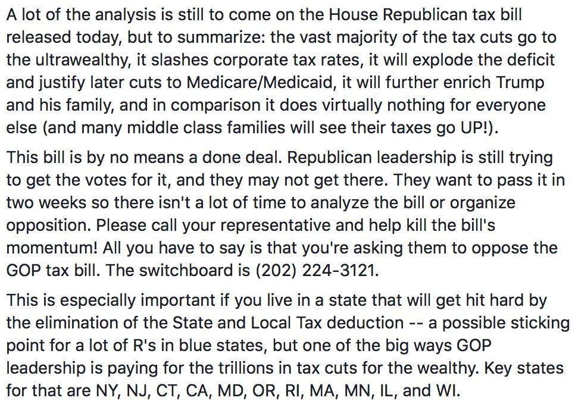
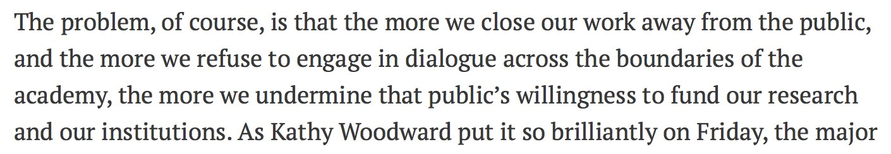

> RT @martin\_eve: True\. But try leaving a book outside\. As @kfitz notes, physical resources would also disappear without vast preservation in…

 [Wed Nov 01 11:33:32 +0000 2017](https://twitter.com/kfitz/status/925687246329610240)

----

Replying to [@wynkenhimself and @martin\_eve](https://twitter.com/wynkenhimself/status/925692391016816640)

> Absolutely\! The thing is just that we need the same investment in infrastructure to support the preservation of digital objects\.

 [Wed Nov 01 11:56:15 +0000 2017](https://twitter.com/kfitz/status/925692961668698112)

----

> We’re searching for an assoc/full prof whose work connects literary studies, DH, and critical diversity\. https://chroniclevitae\.com/jobs/0000396400\-01

 [Wed Nov 01 18:52:59 +0000 2017](https://twitter.com/kfitz/status/925797838931615745)

----

> ARL and COS are surveying DH scholars to find out how libraries can make their work more discoverable: http://www\.share\-research\.org/2017/10/calling\-all\-digital\-humanists\-make\-your\-work\-more\-visible\-citable\-discoverable/

 [Wed Nov 01 20:12:01 +0000 2017](https://twitter.com/kfitz/status/925817726345543681)

----

> “If you read this and think, ‘Yes, this is just how academe has always been’… then you are part of the problem\.” http://www\.chronicle\.com/article/AbusersEnablers\-in/241648?cid\=trend\_right\_a

 [Thu Nov 02 20:10:14 +0000 2017](https://twitter.com/kfitz/status/926179663440941057)

----

> My friend on House Rules has thoughts about the tax bill\. The “justify later cuts” bit is key\. 
> 
> 

 [Thu Nov 02 20:18:41 +0000 2017](https://twitter.com/kfitz/status/926181790418653184)

----

Replying to [@captain\_primate and @CBC](https://twitter.com/EthanWatrall/status/926438973664317440)

> Phew\!

 [Fri Nov 03 13:22:24 +0000 2017](https://twitter.com/kfitz/status/926439417656561666)

----

> RT @tressiemcphd: People think "believe black Women" means we are always right\. It means "assume we are rational"\. That's all I will say ab…

 [Sun Nov 05 23:24:48 +0000 2017](https://twitter.com/kfitz/status/927315792097611776)

----

> RT @humcommons: Are you headed to \#ASEEES17 ? Check out the @aseeestudies Commons group to connect with colleagues &amp; get updates: https://t…

 [Tue Nov 07 15:38:19 +0000 2017](https://twitter.com/kfitz/status/927923176822267910)

----

> RT @msuwrac: We are hiring\! Assistant Professor in Culturally Engaged Digital Humanties/Digital Rhetorics\. @CALmsu Deets: https://t\.co/Wx2C…

 [Tue Nov 07 16:42:30 +0000 2017](https://twitter.com/kfitz/status/927939328856219648)

----

Replying to [@jwolman](https://twitter.com/jwolman/status/927963199390887938)

> In iOS 11, in the Camera app, 2nd icon from the left up top\.

 [Tue Nov 07 18:24:13 +0000 2017](https://twitter.com/kfitz/status/927964925611388928)

----

Replying to [@jwolman](https://twitter.com/jwolman/status/927965512289488896)

> Ahahaha no I don’t think you’re an idiot\! Honestly, I only found that toggle day before yesterday, so\.

 [Tue Nov 07 18:27:41 +0000 2017](https://twitter.com/kfitz/status/927965798999740416)

----

Replying to [@jwolman](https://twitter.com/jwolman/status/927965512289488896)

> But I guess I haven’t sent any in\-iMessages photos, and assumed that that toggle would carry over\. Entirely too logical, I guess\.

 [Tue Nov 07 18:28:46 +0000 2017](https://twitter.com/kfitz/status/927966068043370496)

----

Replying to [@jwolman](https://twitter.com/jwolman/status/927966235010072577)

> Agreed, 100%\.

 [Tue Nov 07 18:29:55 +0000 2017](https://twitter.com/kfitz/status/927966358117277698)

----

> I listen to French and German news podcasts most mornings, trying to build my language skills\. \+

 [Wed Nov 08 14:20:09 +0000 2017](https://twitter.com/kfitz/status/928265889505599489)

----

Replying to [@kfitz](https://twitter.com/kfitz/status/928265889505599489)

> This morning, both reported enthusiastically about last night’s election results\. \+

 [Wed Nov 08 14:20:36 +0000 2017](https://twitter.com/kfitz/status/928266006044266497)

----

Replying to [@kfitz](https://twitter.com/kfitz/status/928266006044266497)

> The Germans also reported on the Twitter 280\. \(Which I happily do not have yet, as @tweetbot has not yet updated\.\)

 [Wed Nov 08 14:21:32 +0000 2017](https://twitter.com/kfitz/status/928266238937194496)

----

Replying to [@tweetbot](https://twitter.com/kfitz/status/928266238937194496)

> But if you have any question about how the current admin is affecting the world’s view of the US, check out yesterday’s Géopolitique\. \+

 [Wed Nov 08 14:22:49 +0000 2017](https://twitter.com/kfitz/status/928266562662010887)

----

Replying to [@kfitz](https://twitter.com/kfitz/status/928266562662010887)

> “Les Etats\-Unis ont toujours des contre\-pouvoirs et remarquablement efficaces mais, maintenant que ce pays s'est donné pour président \+

 [Wed Nov 08 14:23:27 +0000 2017](https://twitter.com/kfitz/status/928266719931633665)

----

Replying to [@kfitz](https://twitter.com/kfitz/status/928266719931633665)

> “un lunatique aux côtés duquel Silvio Berlusconi ferait presque figure de sage, comment pourrait\-il continuer à donner des leçons \+

 [Wed Nov 08 14:24:22 +0000 2017](https://twitter.com/kfitz/status/928266951536857088)

----

Replying to [@kfitz](https://twitter.com/kfitz/status/928266951536857088)

> “au reste du monde ?” The title? “Terminator à la Maison\-Blanche\.” https://www\.franceinter\.fr/emissions/geopolitique/geopolitique\-07\-novembre\-2017

 [Wed Nov 08 14:25:14 +0000 2017](https://twitter.com/kfitz/status/928267169619685378)

----

Replying to [@kfitz](https://twitter.com/kfitz/status/928267169619685378)

> Roughly: “The United States always has remarkably effective counter\-forces but, now that this country has been given as president \+

 [Wed Nov 08 14:26:26 +0000 2017](https://twitter.com/kfitz/status/928267470711947264)

----

Replying to [@kfitz](https://twitter.com/kfitz/status/928267470711947264)

> “a lunatic alongside whom Silvio Berlusconi appears a figure of wisdom, how can it continue to give advice to the rest of the world?”

 [Wed Nov 08 14:27:23 +0000 2017](https://twitter.com/kfitz/status/928267712094228480)

----

Replying to [@CJ\_Daugherty](https://twitter.com/CJ_Daugherty/status/928268273019441152)

> Indeed\.

 [Wed Nov 08 14:32:00 +0000 2017](https://twitter.com/kfitz/status/928268874558115841)

----

Replying to [@kfitz](https://twitter.com/kfitz/status/928267712094228480)

> It’s worth listening to the whole thing\. And it’s worth noting: Bernard Guetta is a polemicist, but he’s not easily classified as a leftist\.

 [Wed Nov 08 14:32:44 +0000 2017](https://twitter.com/kfitz/status/928269056574181376)

----

Replying to [@iantrevor](https://twitter.com/iantrevor/status/928266375738601472)

> Sure\! There are TONS from France Culture and France Inter\. \(I listen to Le journal de 7h00, Géopolitique, and Le reveil culture\.\)

 [Wed Nov 08 14:35:26 +0000 2017](https://twitter.com/kfitz/status/928269736089149441)

----

Replying to [@jimgroom](https://twitter.com/jimgroom/status/928303514354442240)

> How Copyeditors Can Help You Avoid Career Sabatoge\.

 [Wed Nov 08 17:35:22 +0000 2017](https://twitter.com/kfitz/status/928315020932501504)

----

> RT @kmapesy: The third annual Global Digital Humanities Symposium will be at @michiganstateu March 22\-23, 2018\! Submit a proposal to presen…

 [Wed Nov 08 23:23:48 +0000 2017](https://twitter.com/kfitz/status/928402704375824385)

----

Replying to [@davidgraeber and @ekansa](https://twitter.com/davidgraeber/status/928305352784908288)

> Happily, nearly 11,000 of us have long since left that battlefield\. @humcommons https://hcommons\.org

 [Wed Nov 08 23:30:50 +0000 2017](https://twitter.com/kfitz/status/928404476888829952)

----

> Thanks\! We’re excited to have you on board\. Looking forward to seeing what you and your colleagues build\. https://twitter\.com/Mark\_A\_Davidson/status/928434811890528262

 [Thu Nov 09 01:34:38 +0000 2017](https://twitter.com/kfitz/status/928435630887067649)

----

> An appropriate use of 280, at last\. https://twitter\.com/ninaapenzo/status/928081535445504001

 [Thu Nov 09 13:47:31 +0000 2017](https://twitter.com/kfitz/status/928620066731692032)

----

> RT @SMDreller: No need to wait for ScholarHub to get off the ground\. @humcommons is open to all humanists \(incl\. non\-scholars\) &amp; doing impo…

 [Thu Nov 09 15:55:15 +0000 2017](https://twitter.com/kfitz/status/928652211571318784)

----

> I’m thrilled to see that @humcommons is on the edge of 11,000 members\. We’re grateful to our community &amp; to the growing number of scholars \+

 [Thu Nov 09 15:57:38 +0000 2017](https://twitter.com/kfitz/status/928652810467627009)

----

Replying to [@humcommons](https://twitter.com/kfitz/status/928652810467627009)

> and organizations that have chosen to support a genuinely open non\-profit social network for all of us\. \+

 [Thu Nov 09 15:57:51 +0000 2017](https://twitter.com/kfitz/status/928652867703099392)

----

Replying to [@humcommons](https://twitter.com/kfitz/status/928652810467627009)

> We’re nearing our one\-year anniversary — and more exciting things are ahead\!

 [Thu Nov 09 15:58:01 +0000 2017](https://twitter.com/kfitz/status/928652907465052160)

----

> RT @humcommons: Welcome to @humcommons, @CuseKicks\! You're our 11,000th member\!

 [Thu Nov 09 16:47:12 +0000 2017](https://twitter.com/kfitz/status/928665284558376960)

----

> RT @PaulaKrebs: Humanities has one: @humcommons https://twitter\.com/jg\_the/status/928586021717139456

 [Thu Nov 09 21:16:37 +0000 2017](https://twitter.com/kfitz/status/928733084471742464)

----

Replying to [@wynkenhimself](https://twitter.com/wynkenhimself/status/928786069901934599)

> I’m so sorry\. Sending you all the ❤️\. But yes, this\.

 [Fri Nov 10 00:59:48 +0000 2017](https://twitter.com/kfitz/status/928789253873700864)

----

Replying to [@kfitz](https://twitter.com/kfitz/status/763043609277042688)

> I’ve heard this concern expressed a fair bit about @humcommons and have a couple of things to say\. https://twitter\.com/tim\_hutchings/status/928907839183171589

 [Fri Nov 10 13:19:50 +0000 2017](https://twitter.com/kfitz/status/928975489712164865)

----

Replying to [@kfitz](https://twitter.com/kfitz/status/928975489712164865)

> I’m going to leave aside my somewhat knee\-jerk desire to point out that few have complained about the ways that projects with “science” limit their address\.

 [Fri Nov 10 13:19:58 +0000 2017](https://twitter.com/kfitz/status/928975522918555648)

----

Replying to [@kfitz](https://twitter.com/kfitz/status/928975522918555648)

> Because there’s a real point here: naming the humanities limits our reach\. And to a significant extent, that’s purposeful\.

 [Fri Nov 10 13:20:05 +0000 2017](https://twitter.com/kfitz/status/928975550932307968)

----

Replying to [@kfitz](https://twitter.com/kfitz/status/928975550932307968)

> The humanities have long been underserved by digital infrastructure projects\. Scientists have load of open science networks\. Social scientists have had SSRN\.

 [Fri Nov 10 13:20:12 +0000 2017](https://twitter.com/kfitz/status/928975582007832577)

----

Replying to [@kfitz](https://twitter.com/kfitz/status/928975582007832577)

> And as Humanities Commons began with the MLA, and MLA Commons, it seemed only natural that we should serve our own constituency first\.

 [Fri Nov 10 13:20:20 +0000 2017](https://twitter.com/kfitz/status/928975613247021062)

----

Replying to [@kfitz](https://twitter.com/kfitz/status/928975613247021062)

> But: First\. Platforming outward from MLA Commons to Humanities Commons has been one step in a process\. And more steps are to come\.

 [Fri Nov 10 13:20:28 +0000 2017](https://twitter.com/kfitz/status/928975648412094465)

----

Replying to [@kfitz](https://twitter.com/kfitz/status/928975648412094465)

> It’s hard to develop community by simply throwing open the doors\. Much as I resist the Facebook analogy, it’s worth considering how the platform grew\.

 [Fri Nov 10 13:20:35 +0000 2017](https://twitter.com/kfitz/status/928975677948334080)

----

Replying to [@kfitz](https://twitter.com/kfitz/status/928975677948334080)

> First, they established internally\-focused networks within individual institutions, enabling members to connect with people they already knew\.

 [Fri Nov 10 13:20:42 +0000 2017](https://twitter.com/kfitz/status/928975707660783616)

----

Replying to [@kfitz](https://twitter.com/kfitz/status/928975707660783616)

> Then they created means of connecting across those networks\. And only once there was a critical mass of participation did they open the doors to everyone\.

 [Fri Nov 10 13:20:49 +0000 2017](https://twitter.com/kfitz/status/928975735804628992)

----

Replying to [@kfitz](https://twitter.com/kfitz/status/928975735804628992)

> One of the mistakes that’s been made repeatedly in open scholarly communication projects has been the attempt to create the bucket of everything\.

 [Fri Nov 10 13:20:55 +0000 2017](https://twitter.com/kfitz/status/928975762081898496)

----

Replying to [@kfitz](https://twitter.com/kfitz/status/928975762081898496)

> Sometimes that bucket has been journal\-shaped, and sometimes it’s been social network shaped\. But they all face the same challenge:

 [Fri Nov 10 13:21:02 +0000 2017](https://twitter.com/kfitz/status/928975788694818816)

----

Replying to [@kfitz](https://twitter.com/kfitz/status/928975788694818816)

> Getting individual scholars who identify with their field or subfield and who want to speak with their colleagues to recognize themselves in “everybody\.”

 [Fri Nov 10 13:21:08 +0000 2017](https://twitter.com/kfitz/status/928975813432799232)

----

Replying to [@kfitz](https://twitter.com/kfitz/status/928975813432799232)

> So @humcommons has begun with communities of practice — but they’re just a place to start\.

 [Fri Nov 10 13:21:15 +0000 2017](https://twitter.com/kfitz/status/928975843161931777)

----

Replying to [@kfitz](https://twitter.com/kfitz/status/928975843161931777)

> We welcome the involvement of new communities of practice, and we look forward to growing the network in organic, collaborative ways\.

 [Fri Nov 10 13:21:24 +0000 2017](https://twitter.com/kfitz/status/928975883490283521)

----

Replying to [@tim\_hutchings](https://twitter.com/tim_hutchings/status/928989521114550272)

> I completely get that — I’m hoping that we can provide a bridge for such conversations very soon\.

 [Fri Nov 10 15:12:59 +0000 2017](https://twitter.com/kfitz/status/929003962988138496)

----

> RT @winterking07: In addition to this, there's the parallel mistake of trying to implement the One Idea That Will Transform Everything Imme…

 [Fri Nov 10 15:14:53 +0000 2017](https://twitter.com/kfitz/status/929004440711024641)

----

Replying to [@edsu](https://twitter.com/edsu/status/929001993984671745)

> Agreed\! Creating connectors that permit the loose joints is key\.

 [Fri Nov 10 15:17:19 +0000 2017](https://twitter.com/kfitz/status/929005052517330944)

----

> Capturing this morning's thread before it's lost to the sands of time: http://www\.plannedobsolescence\.net/on\-developing\-networked\-communities/

 [Fri Nov 10 15:44:14 +0000 2017](https://twitter.com/kfitz/status/929011829174611969)

----

Replying to [@mrgunn](https://twitter.com/mrgunn/status/929051884630851586)

> I don’t think I’d say that\. Maximal inclusiveness remains an important goal\. But it’s important to know that what counts as “maximal” at any given moment is relative to what’s possible, and to have a clear sense of the necessary steps to get there\.

 [Fri Nov 10 19:17:02 +0000 2017](https://twitter.com/kfitz/status/929065381267898368)

----

Replying to [@mrgunn](https://twitter.com/mrgunn/status/929066523045400576)

> Indeed\.

 [Fri Nov 10 19:24:05 +0000 2017](https://twitter.com/kfitz/status/929067153508192258)

----

Replying to [@eetempleton](https://twitter.com/eetempleton/status/929447469477498880)

> Holy moly, @eetempleton\! That’s fantastic\!

 [Sat Nov 11 21:29:27 +0000 2017](https://twitter.com/kfitz/status/929461091549302784)

----

> RT @jeroenson: Just added this tiny @humcommons sticker on my 💻\. It may be small, but extremely interesting and important initiative in/for…

 [Mon Nov 13 13:44:46 +0000 2017](https://twitter.com/kfitz/status/930068926595321856)

----

Replying to [@micahvandegrift](https://twitter.com/micahvandegrift/status/930074630710288386)

> Hi, Micah\! Thanks to @librarianchimp I just found it: http://www\.plannedobsolescence\.net/giving\-it\-away/\. 
> 
> 

 [Mon Nov 13 20:45:56 +0000 2017](https://twitter.com/kfitz/status/930174917550764033)

----

Replying to [@librarianchimp](https://twitter.com/mariouwow/status/930170118100914176)

> Thank you so much for this\!

 [Mon Nov 13 20:46:28 +0000 2017](https://twitter.com/kfitz/status/930175051512631296)

----

> MSU is hiring an Associate or Full Prof in literary studies, digital humanities, &amp; critical diversity\. Come join us\! http://careers\.msu\.edu/cw/en\-us/job/498020/professortenure\-system

 [Mon Nov 13 21:32:02 +0000 2017](https://twitter.com/kfitz/status/930186517661798401)

----

Replying to [@sherah1918 and @omeka](https://twitter.com/SheilaABrennan/status/930473121584500737)

> Congrats\! It looks fabulous\.

 [Tue Nov 14 16:56:42 +0000 2017](https://twitter.com/kfitz/status/930479613716942848)

----

> Amen\. https://twitter\.com/hels/status/930504637312094209

 [Tue Nov 14 23:04:35 +0000 2017](https://twitter.com/kfitz/status/930572197072162816)

----

> ✋ Was still in grad school at 30\. Published my first book at 39\. Am still just getting going\. https://twitter\.com/casskhaw/status/930541244186427392

 [Tue Nov 14 23:06:14 +0000 2017](https://twitter.com/kfitz/status/930572609716195328)

----

Replying to [@colindickey](https://twitter.com/colindickey/status/930619934887030784)

> YAY\!\!\! This is the best news I’ve seen in eons\.

 [Wed Nov 15 11:06:27 +0000 2017](https://twitter.com/kfitz/status/930753860452446208)

----

> Recommendations get better as you tag your interests and share work\. https://twitter\.com/humcommons/status/931256423111118849

 [Thu Nov 16 21:21:27 +0000 2017](https://twitter.com/kfitz/status/931271017913126912)

----

> RT @terrainsvagues: I’m discovering so much awesome \#openaccess scholarship with the new @humcommons suggestions\! Log in to see what’s reco…

 [Fri Nov 17 13:41:08 +0000 2017](https://twitter.com/kfitz/status/931517565322584065)

----

> RT @cplong: We are looking for a new colleague in the College of Arts &amp; Letters at \#MSU whose research focus is Migration Studies with a cu…

 [Sat Nov 18 15:01:15 +0000 2017](https://twitter.com/kfitz/status/931900115194871809)

----

Replying to [@nancybaym](https://twitter.com/nancybaym/status/932234980473933824)

> I dunno but it’s totally contagious MAKE IT QUIT\.

 [Sun Nov 19 13:36:31 +0000 2017](https://twitter.com/kfitz/status/932241177709109249)

----

> Why, thank you — we of course completely agree: strong coalitions are absolutely necessary\. https://twitter\.com/ScholarlyHub/status/931882183652003843

 [Sun Nov 19 15:14:45 +0000 2017](https://twitter.com/kfitz/status/932265897800142848)

----

> RT @CALmsu: \#MSUCAL Associate Dean of Research and Graduate Education @billhd discusses the proposed U\.S\. tax reform legislation that will…

 [Tue Nov 21 15:41:26 +0000 2017](https://twitter.com/kfitz/status/932997390763724806)

----

Replying to [@jackjewers](https://twitter.com/jackjewers/status/933057531261456384)

> Someone must have told her about the importance of being reflective\.

 [Wed Nov 22 00:38:22 +0000 2017](https://twitter.com/kfitz/status/933132512624283648)

----

> Yet another morning in which I ask myself what exactly it’s going to take for the pathology to become visible enough that the people who could actually do something about it are moved to, say, DO SOMETHING ABOUT IT\.

 [Wed Nov 22 12:35:01 +0000 2017](https://twitter.com/kfitz/status/933312862793199616)

----

> Absolutely\. https://twitter\.com/anniekjohn/status/933341006346539008

 [Wed Nov 22 16:42:17 +0000 2017](https://twitter.com/kfitz/status/933375091034947584)

----

Replying to [@wynkenhimself](https://twitter.com/wynkenhimself/status/933380721783296002)

> The idea that chairs have that kind of authority\.\.\.

 [Wed Nov 22 17:07:20 +0000 2017](https://twitter.com/kfitz/status/933381393446592512)

----

Replying to [@edrabinski](https://twitter.com/edrabinski/status/933475504853848064)

> I’m so sorry\. What a suck\.

 [Thu Nov 23 00:07:18 +0000 2017](https://twitter.com/kfitz/status/933487083221643265)

----

Replying to [@publichistorian](https://twitter.com/publichistorian/status/934200314613370884)

> Oh no\. I’m so sorry\.

 [Fri Nov 24 23:40:04 +0000 2017](https://twitter.com/kfitz/status/934205005694988288)

----

Replying to [@electricarchaeo](https://twitter.com/electricarchaeo/status/934475040053063681)

> See @wynkenhimself’s fab blog posts on negotiating author agreements: http://sarahwerner\.net/blog/2013/10/more\-lessons\-on\-negotiating\-a\-contributors\-contract/

 [Sat Nov 25 17:36:42 +0000 2017](https://twitter.com/kfitz/status/934475946513584128)

----

Replying to [@SarahEBond](https://twitter.com/SarahEBond/status/935248453411713026)

> Ugh, I am so sorry you’re STILL dealing with this\. Or again, maybe, like it’s Groundhog Day or something\. What’s got this and the academia piece recirculating?

 [Mon Nov 27 21:00:15 +0000 2017](https://twitter.com/kfitz/status/935251947300499456)

----

> Help support the non\-profit organizations that support Humanities Commons\. \#givingtuesday https://twitter\.com/humcommons/status/935526485762428929

 [Tue Nov 28 15:19:20 +0000 2017](https://twitter.com/kfitz/status/935528541697007617)

----

Replying to [@triciamatthew](https://twitter.com/triciamatthew/status/935571768189816833)

> Their loss\.

 [Tue Nov 28 23:14:03 +0000 2017](https://twitter.com/kfitz/status/935648010008227840)

----

> My first book was \(uh, now famously; I wrote about it\) declined after 10 months under review, because the marketing guys said it posed “too much financial risk in the current economy\.” https://twitter\.com/tanyaboza/status/935305863102734336

 [Tue Nov 28 23:15:43 +0000 2017](https://twitter.com/kfitz/status/935648430508081153)

----

> RT @kmapesy: Don't forget to get your Global DH Symposium proposals in\! The deadline is Dec 15 \(2\.5 weeks\!\) \#msuglobaldh \#msudh https://t\.c…

 [Wed Nov 29 18:29:43 +0000 2017](https://twitter.com/kfitz/status/935938842229657601)

----

Replying to [@kfitz](https://twitter.com/ShawnaRoss/status/936255131514961920)

> Oooh, this is great\. Working with CIT was one of the highlights of my time at MLA\. Thanks for everything you do\! @ShawnaRoss @beth\_seltzer https://twitter\.com/ShawnaRoss/status/936255131514961920

 [Thu Nov 30 17:59:44 +0000 2017](https://twitter.com/kfitz/status/936293686417281024)