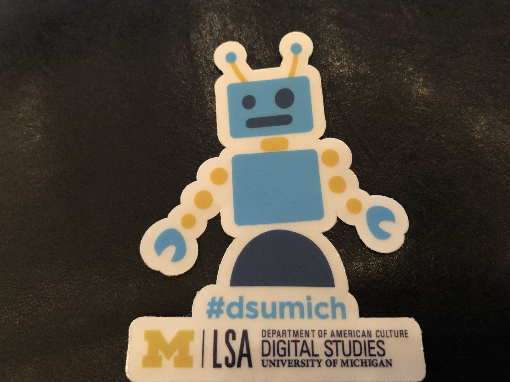
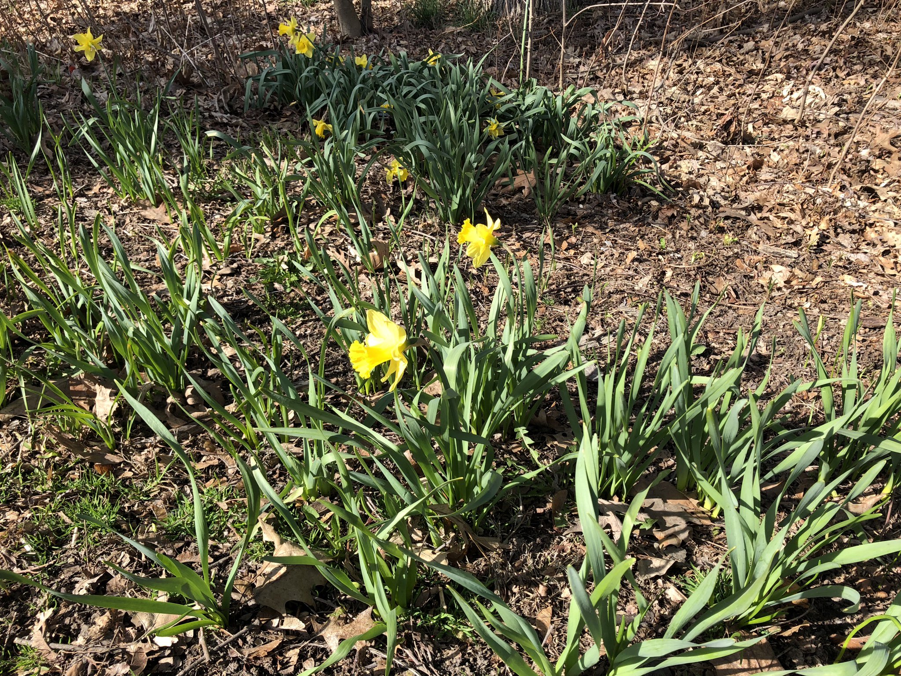

> On beginning the revision process: http://www\.plannedobsolescence\.net/in\-revision/

 [Tue Apr 03 11:35:53 +0000 2018](https://twitter.com/kfitz/status/981133180454490113)

----

> Hey, @IRSnews: Why do all your phone lines say you’re closed today?

 [Tue Apr 03 13:45:49 +0000 2018](https://twitter.com/kfitz/status/981165879273578497)

----

> RT @NSVRC: Today is the \#SAAM Day of Action — your voice has power when you use it to:  
> ✔ End Victim Blaming  
> ✔ Ask for Consent  
> ✔ Respect Bou…

 [Tue Apr 03 14:00:47 +0000 2018](https://twitter.com/kfitz/status/981169647935344640)

----

Replying to [@MaxCMarmor and @IRSnews](https://twitter.com/MaxCMarmor/status/981170904137895936)

> I’d laugh but I fear it would end in tears\.

 [Tue Apr 03 14:32:23 +0000 2018](https://twitter.com/kfitz/status/981177598645501955)

----

> Really looking forward to this\! https://twitter\.com/lnakamur/status/981196317551661057

 [Tue Apr 03 17:31:08 +0000 2018](https://twitter.com/kfitz/status/981222583503937536)

----

> 😭 https://twitter\.com/ranti/status/981521243756269568

 [Wed Apr 04 13:30:17 +0000 2018](https://twitter.com/kfitz/status/981524358983311360)

----

Replying to [@kfitz](https://twitter.com/SheilaABrennan/status/981605912799600641)

> Hooray\! Congratulations @sherah1918 and @NEH\_ODH — this is fabulous news for all of us\! https://twitter\.com/sherah1918/status/981605912799600641

 [Wed Apr 04 19:33:58 +0000 2018](https://twitter.com/kfitz/status/981615882794426369)

----

Replying to [@devoneylooser](https://twitter.com/devoneylooser/status/981897158843498496)

> Huge, huge congratulations, Devoney\! Such a well\-deserved honor\!

 [Thu Apr 05 16:20:54 +0000 2018](https://twitter.com/kfitz/status/981929684261842945)

----

> Delighted to be at U\-M Digital Studies today, talking about \#generousthinking and working in public\. Their stickers speak to me \#dsumich 
> 
> 

 [Fri Apr 06 14:33:14 +0000 2018](https://twitter.com/kfitz/status/982264975610658817)

----

> Thread: care, community, and \#lessonsfromplants\. https://twitter\.com/BerondaM/status/983308534757646336

 [Mon Apr 09 11:56:29 +0000 2018](https://twitter.com/kfitz/status/983312691296133120)

----

> This is enormous\. https://twitter\.com/SSRC\_org/status/983328782068174848

 [Mon Apr 09 13:05:56 +0000 2018](https://twitter.com/kfitz/status/983330170919583744)

----

> This is really exciting\. https://twitter\.com/gmbritton/status/983359009502658561

 [Mon Apr 09 15:17:41 +0000 2018](https://twitter.com/kfitz/status/983363324476821505)

----

> So thrilled about my new \#msudh colleague\! https://twitter\.com/JulianChambliss/status/983715032851795968

 [Tue Apr 10 14:38:37 +0000 2018](https://twitter.com/kfitz/status/983715882462363648)

----

Replying to [@kfitz](https://twitter.com/achdotorg/status/983702447221862400)

> I’m honored to have been elected the incoming vice president of @achdotorg and thrilled to get to work with such an amazing group on the exec and in the membership\. https://twitter\.com/achdotorg/status/983702447221862400

 [Tue Apr 10 17:29:36 +0000 2018](https://twitter.com/kfitz/status/983758913496649728)

----

Replying to [@nolauren, @scott\_bot, @paigecmorgan and @angeldnieves](https://twitter.com/nolauren/status/983758770034696192)

> Indeed\! Looking forward to working with you all\!

 [Tue Apr 10 17:30:23 +0000 2018](https://twitter.com/kfitz/status/983759107017596928)

----

> Friends don’t let friends use academia\-not\-edu\. https://twitter\.com/terrainsvagues/status/983793733597630465

 [Tue Apr 10 20:02:13 +0000 2018](https://twitter.com/kfitz/status/983797319618490368)

----

Replying to [@carolinepennock and @avoiding\_bears](https://twitter.com/carolinepennock/status/983804853901242371)

> This is the reading of the copyright librarian at Columbia\.\.\.

 [Tue Apr 10 20:36:20 +0000 2018](https://twitter.com/kfitz/status/983805903488069632)

----

> RT @ferli90: Please delete your http://academia\.edu account and move to @humcommons, because\.\.\. https://twitter\.com/terrainsvagues/status/983793381586464768

 [Tue Apr 10 21:32:42 +0000 2018](https://twitter.com/kfitz/status/983820088276025344)

----

Replying to [@meganeabbott](https://twitter.com/meganeabbott/status/984437466525585408)

> Woo hoo\!\!\!

 [Thu Apr 12 14:42:03 +0000 2018](https://twitter.com/kfitz/status/984441521113100293)

----

Replying to [@kfitz](https://twitter.com/katiefitzpat/status/984609594243723266)

> An important thread on so many levels: the brokenness of the contemporary academy, the importance of investment in public education, the role of public intellectuals\. Congrats and best wishes on this move, @katiefitzpat \(though I’ll be sorry not to see my name twin at MLA\)\. https://twitter\.com/katiefitzpat/status/984609594243723266

 [Fri Apr 13 12:40:13 +0000 2018](https://twitter.com/kfitz/status/984773251044925440)

----

Replying to [@captain\_primate](https://twitter.com/EthanWatrall/status/985274626161987587)

> I recognize the focus is on the bottle, but all I can see is that the person in the background is OUTDOORS in SHORT SLEEVES\.

 [Sat Apr 14 22:07:23 +0000 2018](https://twitter.com/kfitz/status/985278370840752128)

----

Replying to [@electricarchaeo and @captain\_primate](https://twitter.com/electricarchaeo/status/985279106014220288)

> Weird yellow… something… coming from the sky…

 [Sat Apr 14 22:11:08 +0000 2018](https://twitter.com/kfitz/status/985279312046776322)

----

Replying to [@captain\_primate](https://twitter.com/EthanWatrall/status/986183727956062208)

> NOT OKAY\.

 [Tue Apr 17 10:07:21 +0000 2018](https://twitter.com/kfitz/status/986184331738664960)

----

Replying to [@ManifoldScholar, @noctambulate, @UMinnPress, @cunygcdi, @castironcoding, @MellonFdn, @mkgold, @zdavis and @tremayning](https://twitter.com/ManifoldScholar/status/986257824908021762)

> Congratulations, all\! This is very exciting\.

 [Tue Apr 17 18:48:49 +0000 2018](https://twitter.com/kfitz/status/986315562203697153)

----

> Best\. Tweet\. Ever\. https://twitter\.com/brettbobley/status/986365135995404290

 [Tue Apr 17 22:30:23 +0000 2018](https://twitter.com/kfitz/status/986371322656772108)

----

Replying to [@rebeccaonion, @mznewman, @sparklebliss and @AmandaAnnKlein](https://twitter.com/rebeccaonion/status/986610872041852929)

> You might talk to Francesca Coppa \(@fcoppa\), editor of the Fan Fiction Reader: https://www\.press\.umich\.edu/9479376/fanfiction\_reader

 [Wed Apr 18 14:24:00 +0000 2018](https://twitter.com/kfitz/status/986611307989340161)

----

> Editorial: Trustees, You’re Done\. http://statenews\.com/article/2018/04/editorial\-trustees\-should\-resign

 [Thu Apr 19 14:28:24 +0000 2018](https://twitter.com/kfitz/status/986974800496222236)

----

> RT @ELPUB\_Conf: Kathleen Fitzpatrick is one of this year’s \#ELPUB2018 keynotes\. @kfitz is Director of \#DigitalHumanities and Professor of E…

 [Thu Apr 19 15:31:06 +0000 2018](https://twitter.com/kfitz/status/986990582034849792)

----

> It’s a mic drop kinda morning: “for the love of all that’s good and holy, please stop going to the MLA convention to conduct first\-round job interviews\.” —MLA executive director, @PaulaKrebs\. http://insidehighered\.com/advice/2018/04/19/head\-modern\-language\-assocation\-explains\-why\-she\-prefers\-skype\-over\-convention

 [Thu Apr 19 15:35:34 +0000 2018](https://twitter.com/kfitz/status/986991705265266688)

----

> I was delighted to have this chance to chat\! \#OpenAccess https://twitter\.com/jeroenson/status/987004608546557952

 [Thu Apr 19 16:28:50 +0000 2018](https://twitter.com/kfitz/status/987005110625734656)

----

> What's new? A little virtual move, and hopefully more to come\. http://kfitz\.info/whats\-new/

 [Thu Apr 19 17:11:16 +0000 2018](https://twitter.com/kfitz/status/987015789474697217)

----

Replying to [@wynkenhimself](https://twitter.com/wynkenhimself/status/987017868675047424)

> Why, thank you\! &lt;3

 [Thu Apr 19 17:20:21 +0000 2018](https://twitter.com/kfitz/status/987018074212749312)

----

Replying to [@wynkenhimself](https://twitter.com/wynkenhimself/status/987018272104206342)

> Oof, no kidding\! Not when there are so many other sites demanding to be built\.

 [Thu Apr 19 17:22:14 +0000 2018](https://twitter.com/kfitz/status/987018549209255936)

----

> New thoughts at http://kfitz\.info: Community, Privatization, Efficiency\. https://kfitz\.info/community\-privatization\-efficiency/

 [Fri Apr 20 19:53:42 +0000 2018](https://twitter.com/kfitz/status/987419052023873537)

----

Replying to [@ayjay](https://twitter.com/ayjay/status/987439970888683525)

> Sooooo glad to be back\. I even updated my Feedly follows yesterday\!

 [Fri Apr 20 21:18:21 +0000 2018](https://twitter.com/kfitz/status/987440355254685696)

----

Replying to [@ayjay](https://twitter.com/ayjay/status/987440476604305408)

> The forward\-thinking ancestors knew what was what, ‘round about 2005\.

 [Fri Apr 20 21:20:40 +0000 2018](https://twitter.com/kfitz/status/987440941828136960)

----

Replying to [@ayjay](https://twitter.com/ayjay/status/987440680430686210)

> There are chunks that are hard going, being circa 2002 cultural studies, but by that chapter on nonprofits, I am pretty much interpellated\.

 [Fri Apr 20 21:22:48 +0000 2018](https://twitter.com/kfitz/status/987441477738475521)

----

Replying to [@pmhswe](https://twitter.com/pmhswe/status/987395065441071104)

> I would love to know the answer to this \(both the originating question and the directory bit\) if you uncover one\!

 [Fri Apr 20 21:26:43 +0000 2018](https://twitter.com/kfitz/status/987442461567045632)

----

> RT @jeroenson: “@humcommons is governed by its member societies, which are in turn governed by their members, and so the network and its po…

 [Sat Apr 21 13:38:43 +0000 2018](https://twitter.com/kfitz/status/987687073590206466)

----

> RT @SNawyn: For @michiganstateu supporters sick about what is happening at MSU but want to still give to the school, I’m working on compili…

 [Sat Apr 21 15:02:33 +0000 2018](https://twitter.com/kfitz/status/987708173384650752)

----

> I have only gotten to scratch the surface of things here, but boy does this look amazing\! https://twitter\.com/electricarchaeo/status/988415182958354432

 [Mon Apr 23 20:46:08 +0000 2018](https://twitter.com/kfitz/status/988519414797623300)

----

> I am trying SO HARD to imagine a perspective from which this appeared to be a good idea, but am only coming up with the most ungenerous possibilities\. https://twitter\.com/melissa\_hubbard/status/988511927562272770

 [Tue Apr 24 12:28:30 +0000 2018](https://twitter.com/kfitz/status/988756565317640193)

----

Replying to [@seth\_denbo](https://twitter.com/seth_denbo/status/988760570252943360)

> I think that’s what “zero\-time” implies: paid at zero percent of an FTE\.

 [Tue Apr 24 12:47:04 +0000 2018](https://twitter.com/kfitz/status/988761241740103683)

----

Replying to [@seth\_denbo and @Andrew\_Stauffer](https://twitter.com/seth_denbo/status/988885465649569792)

> I have rarely been this sorry to be right about something\. “Volunteer adjuncts”\!\!\!

 [Tue Apr 24 21:02:05 +0000 2018](https://twitter.com/kfitz/status/988885816121462785)

----

> So many ways I identify\. Especially with the mortified silence\. But 70% of white women and 80% of black women means we \*have to\* talk about this\. https://medium\.com/s/unrulybodies/the\-body\-plagued\-by\-little\-bloodsuckers\-8666b31e2d37

 [Tue Apr 24 21:19:46 +0000 2018](https://twitter.com/kfitz/status/988890263501275136)

----

Replying to [@TheNoisyProf](https://twitter.com/@TheNoisyProf/status/988895277183569920)

> Oh yes, absolutely\. In the midst of reading I did check to see when my next appointment is\.

 [Tue Apr 24 21:54:08 +0000 2018](https://twitter.com/kfitz/status/988898914920288256)

----

Replying to [@amandafrench](https://twitter.com/amandafrench/status/988896042031681537)

> Ooh, thanks\!

 [Tue Apr 24 21:54:26 +0000 2018](https://twitter.com/kfitz/status/988898988064690176)

----

> Continuing to think with Miranda Joseph, this time about the strategic possibilities for “community\.” https://kfitz\.info/strategy\-and\-solidarity/

 [Wed Apr 25 19:01:27 +0000 2018](https://twitter.com/kfitz/status/989217844851281920)

----

Replying to [@veek](https://twitter.com/veek/status/989253654535442432)

> Yes\! That would be great\!

 [Wed Apr 25 22:02:56 +0000 2018](https://twitter.com/kfitz/status/989263514077364225)

----

Replying to [@kfitz](https://twitter.com/micahvandegrift/status/989192197445750784)

> Now that’s a going\-away present\! Carry that with you, @micahvandegrift\. https://twitter\.com/micahvandegrift/status/989192197445750784

 [Wed Apr 25 22:05:42 +0000 2018](https://twitter.com/kfitz/status/989264210969448449)

----

> In the process of revising Generous Thinking, and thinking about the strategic potential of “community” for reimagining the university\. http://kfitz\.info/strategy\-and\-solidarity/

 [Thu Apr 26 11:51:36 +0000 2018](https://twitter.com/kfitz/status/989472057544015872)

----

> Preordered today\. Cannot\. Wait\. https://twitter\.com/reaganart/status/989525252815425536

 [Thu Apr 26 15:41:38 +0000 2018](https://twitter.com/kfitz/status/989529946820407296)

----

> RT @humcommons: Is your academic research centered around \#comics? If so, we think you can benefit from joining the @humcommons \#ComicStudi…

 [Thu Apr 26 18:17:42 +0000 2018](https://twitter.com/kfitz/status/989569220110356485)

----

> Something is happening\. I vaguely remember this but cannot place it\. 
> 
> 

 [Thu Apr 26 21:22:19 +0000 2018](https://twitter.com/kfitz/status/989615680822632449)

----

Replying to [@kfitz](https://twitter.com/LBMcGrath/status/989583669106020352)

> Huge congratulations, @LBMcGrath\! Super excited to see what you do\! https://twitter\.com/LBMcGrath/status/989583669106020352

 [Thu Apr 26 21:24:41 +0000 2018](https://twitter.com/kfitz/status/989616279014305793)

----

> RT @DHandLib: POST: Kathleen Fitzpatrick on Open Scholarship, Humanities Commons, and more  http://acrl\.ala\.org/dh/2018/04/26/post\-kathleen\-fi…commons\-and\-more/

 [Fri Apr 27 00:07:13 +0000 2018](https://twitter.com/kfitz/status/989657181145518080)

----

Replying to [@miriamkp](https://twitter.com/miriamkp/status/989633882789052418)

> This is utter genius, and so important\. I’ve hesitated to do the same thing, but am now contemplating my own list\. Thanks for sharing\!

 [Fri Apr 27 11:37:28 +0000 2018](https://twitter.com/kfitz/status/989830888514039808)

----

> RT @humcommons: Want to be an \#HCSummerCamper? Join the HC Summer Camp group\! https://hcommons\.org/groups/humanities\-commons\-summer\-camp/  https://twitter\.com/SeaSwanSun/status/989895300495085568

 [Fri Apr 27 16:49:24 +0000 2018](https://twitter.com/kfitz/status/989909388260511744)

----

Replying to [@kfitz](https://twitter.com/pfyfe/status/989923464994869248)

> Oh, hey\! I’m in the midst of revising that chapter now, if you/your students have thoughts, @pfyfe\! https://twitter\.com/pfyfe/status/989923464994869248

 [Fri Apr 27 17:57:55 +0000 2018](https://twitter.com/kfitz/status/989926629957931008)

----

Replying to [@brandontlocke](https://twitter.com/brandontlocke/status/990003475697295362)

> Every\. Friday\.

 [Fri Apr 27 23:13:46 +0000 2018](https://twitter.com/kfitz/status/990006115718062081)

----

> The morning I walked into my gym and thought, oh hey, Steve Earle on an elliptical machine\. I have never fully gotten the phrase out of my head\. https://twitter\.com/johnmoe/status/990013756381032448

 [Mon Apr 30 00:53:12 +0000 2018](https://twitter.com/kfitz/status/990755917728796673)

----

Replying to [@kfitz](https://twitter.com/kfitz/status/990755917728796673)

> I mean, periodically, apropos of nothing, “Steve Earle on an elliptical machine\.”

 [Mon Apr 30 00:55:20 +0000 2018](https://twitter.com/kfitz/status/990756451479060480)

----

Replying to [@wynkenhimself](https://twitter.com/wynkenhimself/status/990759081681006594)

> I have sometimes thought that it might make a good swear of surprise\.

 [Mon Apr 30 01:19:58 +0000 2018](https://twitter.com/kfitz/status/990762653650968576)

----

Replying to [@fletcherdurant](https://twitter.com/fletcherdurant/status/990764438411251717)

> In certain ways, it makes more sense\.

 [Mon Apr 30 01:31:49 +0000 2018](https://twitter.com/kfitz/status/990765633083146241)

----

> I’m not at all surprised that it’s so\. I’m only surprised that they put it on paper\. https://apnews\.com/0c87e4318bcc4eb9b8e69f9f54c7b889

 [Mon Apr 30 23:50:53 +0000 2018](https://twitter.com/kfitz/status/991102623494402050)