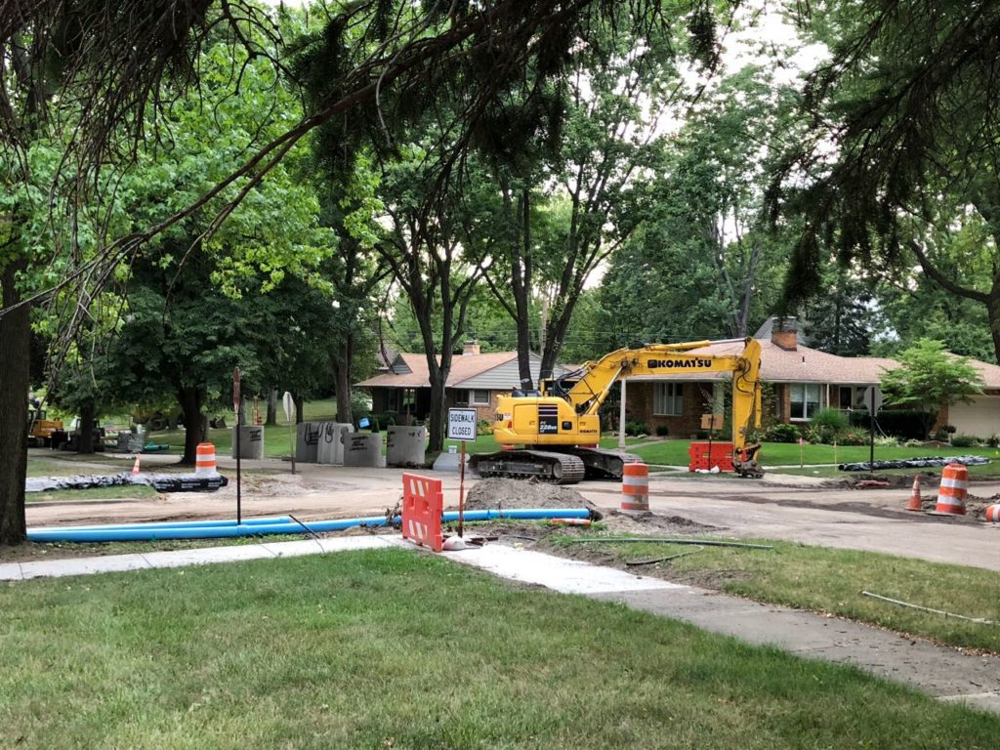
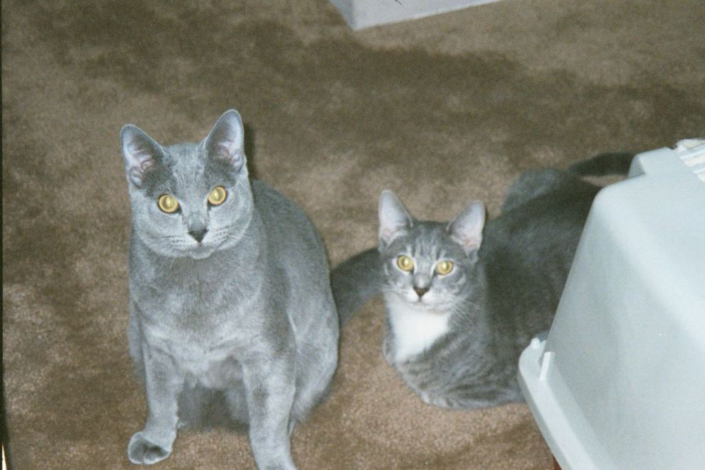

> RT @PaulaKrebs: A good time to check out https://style\.mla\.org/ https://twitter\.com/FL\_EnglishProf/status/1023976300745240577

 [Wed Aug 01 14:52:02 +0000 2018](https://twitter.com/kfitz/status/1024669085383241728)

----

> RT @curtomil: Good point by @kfitz arguing that social sustainability matters\. This is particularly the case IMO for commons projects\. What…

 [Thu Aug 02 13:51:11 +0000 2018](https://twitter.com/kfitz/status/1025016161115750406)

----

> It’s been a good\-news\-bad\-news kinda day\. I got word of two unsuccessful grant proposals, but I also got amazing comments on them: positive, supportive, enthusiastic, and helpful\.  
> I’m putting this out there for two reasons: first, because I think it’s \.\.\. https://kfitz\.info/3278\-2/

 [Fri Aug 03 00:10:41 +0000 2018](https://twitter.com/kfitz/status/1025172064972484609)

----

> Once more for the morning crowd: why I want to talk about my unsuccessful grant applications\. https://kfitz\.info/3278\-2/

 [Fri Aug 03 12:21:00 +0000 2018](https://twitter.com/kfitz/status/1025355855057887233)

----

Replying to [@melissaterras](https://twitter.com/melissaterras/status/1025375127591170048)

> Thank YOU, Melissa\! I was seriously bummed until I saw the reviews, and then realized that maybe I didn’t get the gift I wanted, but I still got a pretty good one\.

 [Fri Aug 03 14:46:54 +0000 2018](https://twitter.com/kfitz/status/1025392570577428480)

----

> RT @achdotorg: We're seeking 1\-2 ACH members to serve on our Nominations committee\! You'd help us assemble a diverse slate of nominees for…

 [Fri Aug 03 16:12:04 +0000 2018](https://twitter.com/kfitz/status/1025414006121611265)

----

Replying to [@kmapesy](https://twitter.com/kmapesy/status/1026455331956764674)

> &lt;whispers&gt; I’ve been able to use Eduroam for the last few months… &lt;/whispers&gt;

 [Mon Aug 06 13:15:16 +0000 2018](https://twitter.com/kfitz/status/1026456675816009729)

----

Replying to [@captain\_primate and @kmapesy](https://twitter.com/EthanWatrall/status/1026457118516432897)

> I… just tried authenticating with my MSU email address &amp; password? And it worked?

 [Mon Aug 06 13:19:05 +0000 2018](https://twitter.com/kfitz/status/1026457635653144577)

----

Replying to [@captain\_primate and @kmapesy](https://twitter.com/EthanWatrall/status/1026457118516432897)

> I cannot swear, however, that my ability to access it has nothing to do with my having whined repeatedly to one of our colleagues…

 [Mon Aug 06 13:20:32 +0000 2018](https://twitter.com/kfitz/status/1026458000066838529)

----

Replying to [@kmapesy and @captain\_primate](https://twitter.com/kmapesy/status/1026458064776515585)

> I just connected directly through Network Preferences, FYI\.

 [Mon Aug 06 13:21:42 +0000 2018](https://twitter.com/kfitz/status/1026458291885490176)

----

Replying to [@captain\_primate and @kmapesy](https://twitter.com/EthanWatrall/status/1026460477226975233)

> It’s been a little slow to connect at times, but every time I’ve tried since the first time it worked, it’s worked\. Fingers crossed that it stays that way\!

 [Mon Aug 06 13:33:16 +0000 2018](https://twitter.com/kfitz/status/1026461202682077184)

----

Replying to [@Doodlebug992, @MDockrayMiller and @humcommons](https://twitter.com/KaySohini/status/1026527369551597571)

> Hi\! You shouldn't need to set anything\. If you're logged in and you visit another member's profile page \(like https://hcommons\.org/members/kay/\) you can click "Follow" under their avatar\.

 [Mon Aug 06 18:02:32 +0000 2018](https://twitter.com/kfitz/status/1026528968718073867)

----

> Cannot wait to see what happens here\! https://twitter\.com/mkirschenbaum/status/1026842755715219456

 [Tue Aug 07 14:58:54 +0000 2018](https://twitter.com/kfitz/status/1026845142911737857)

----

Replying to [@mchris4duke](https://twitter.com/mchris4duke/status/1026876493060874240)

> Woo hoo\!

 [Tue Aug 07 17:42:06 +0000 2018](https://twitter.com/kfitz/status/1026886212798369792)

----

Replying to [@kmapesy and @brandontlocke](https://twitter.com/kmapesy/status/1027295130288644104)

> You didn’t hear it from me but: my understanding is that we were an eduroam campus back in the day, but decided to disable it ON campus, and so eventually got booted\.

 [Wed Aug 08 21:01:01 +0000 2018](https://twitter.com/kfitz/status/1027298658495209473)

----

Replying to [@kmapesy and @brandontlocke](https://twitter.com/kmapesy/status/1027295130288644104)

> Lots of whining by certain new digital administrators may or may not have resulted in conversations that produced on\-campus reactivation, and thus reinstated access when roaming\.

 [Wed Aug 08 21:02:07 +0000 2018](https://twitter.com/kfitz/status/1027298937806438400)

----

Replying to [@billhd and @brandontlocke](https://twitter.com/billhd/status/1027299173266350080)

> Mm\-hmm\.

 [Wed Aug 08 21:03:47 +0000 2018](https://twitter.com/kfitz/status/1027299356947505160)

----

> Really excited to be at Transylvania University tonight to keynote the Transylvania Seminar, running through Saturday\. With this tweet I officially declare the seminar hashtag to be \#transy18\.

 [Fri Aug 10 00:11:56 +0000 2018](https://twitter.com/kfitz/status/1027709095242084360)

----

Replying to [@kfitz](https://twitter.com/kfitz/status/1027709095242084360)

> Of course right after I hit “Tweet” there was a call to make the hashtag \#transysem18\. I bow to that call\. :\)

 [Fri Aug 10 01:47:10 +0000 2018](https://twitter.com/kfitz/status/1027733060194852864)

----

Replying to [@ZCofran](https://twitter.com/ZCofran/status/1027732903994818561)

> Thanks\! Really looking forward to the discussions\.

 [Fri Aug 10 01:47:51 +0000 2018](https://twitter.com/kfitz/status/1027733231549014016)

----

> This has been a rough week: some serious disappointments and a lot of bureaucratic annoyances\. But today I get to participate in a seminar on the history and future of liberal education, and it’s hard to imagine a greater privilege\.

 [Fri Aug 10 12:01:51 +0000 2018](https://twitter.com/kfitz/status/1027887750471725056)

----

Replying to [@rbuurma](https://twitter.com/rbuurma/status/1027915131362000896)

> Nope\! http://www\.transy\.edu/news/transylvania\-hosts\-national\-seminar\-liberal\-arts\-digital\-technology

 [Fri Aug 10 13:51:24 +0000 2018](https://twitter.com/kfitz/status/1027915320378449920)

----

Replying to [@rbuurma](https://twitter.com/rbuurma/status/1027916533975068672)

> It’s pretty fabulous so far\. I’m thrilled to get to be part of it\!

 [Fri Aug 10 13:57:26 +0000 2018](https://twitter.com/kfitz/status/1027916835629555712)

----

Replying to [@ADeRogatis](https://twitter.com/@ADeRogatis/status/1027941978196115458)

> God, I can’t imagine\. &lt;3

 [Fri Aug 10 15:39:23 +0000 2018](https://twitter.com/kfitz/status/1027942493239889920)

----

Replying to [@meganeabbott](https://twitter.com/meganeabbott/status/1027952560903217154)

> Holy\. Moly\!

 [Fri Aug 10 17:28:12 +0000 2018](https://twitter.com/kfitz/status/1027969880572743681)

----

Replying to [@cplong, @jsalem75, @CALMSU and @msulibraries](https://twitter.com/cplong/status/1028277796206981121)

> I will so look forward to more of what’s ahead\.

 [Sat Aug 11 13:53:13 +0000 2018](https://twitter.com/kfitz/status/1028278164081070081)

----

> I’ve thoroughly enjoyed my stay in Lexington for the Transylvania Seminar: fantastic conversations about the principles and practices of liberal education; great new colleagues; a bunch of amazing meals\. But I’m ready to get home now, and ready to get \.\.\. https://kfitz\.info/3297\-2/

 [Sun Aug 12 16:06:27 +0000 2018](https://twitter.com/kfitz/status/1028674081955213312)

----

Replying to [@veek](https://twitter.com/veek/status/1028692258567213057)

> Heh\.

 [Sun Aug 12 17:19:56 +0000 2018](https://twitter.com/kfitz/status/1028692573190348805)

----

Replying to [@CJ\_Daugherty and @meganeabbott](https://twitter.com/CJ_Daugherty/status/1029432562119270400)

> Apropos of nothing other than me\-centricity, I have wanted to introduce you two forever\. But maybe you’ve already met\! My two favorite amazing novelist friends; you ought to have\.

 [Tue Aug 14 18:43:40 +0000 2018](https://twitter.com/kfitz/status/1029438423852040192)

----

> RT @CALMSU: “We’re talking about \[accessibility\] as a social justice issue and a student success initiative,” said @kate\_sonka, \#MSUCAL's A…

 [Wed Aug 15 15:49:29 +0000 2018](https://twitter.com/kfitz/status/1029756973166874624)

----

> Looking Forward: https://kfitz\.info/looking\-forward/

 [Wed Aug 15 18:52:17 +0000 2018](https://twitter.com/kfitz/status/1029802976628617217)

----

> Consider this a sub\-retweet\.

 [Wed Aug 15 23:03:18 +0000 2018](https://twitter.com/kfitz/status/1029866148702154753)

----

> Well, @Twitter has officially broken @Tweetbot, so I’m likely to be around there less\. Look for me on http://micro\.blog; I’m @kfitz there, too\. https://twitter\.com/twitter

 [Wed Aug 15 23:21:57 +0000 2018](https://twitter.com/kfitz/status/1029870843768254464)

----

> Imagine a little GIF of a caution sign displaying a man digging\. Or a cute note asking you to forgive our dust\. There’s a bit of renovation taking place around here, but it doesn’t compare to what’s happening outside my window\. 
> 
> 

 [Thu Aug 16 11:17:59 +0000 2018](https://twitter.com/kfitz/status/1030051039725199360)

----

> It’s not as though I don’t have other things I need to be focusing on now\. But the pile of stuff I need to do often varies directly with my desire to tinker: https://kfitz\.info/themes/

 [Thu Aug 16 15:53:46 +0000 2018](https://twitter.com/kfitz/status/1030120439270592513)

----

> RT @humcommons: We want to improve our network with your feedback\. As a token of our appreciation, anyone who completes our user experience…

 [Thu Aug 16 16:10:52 +0000 2018](https://twitter.com/kfitz/status/1030124742970355712)

----

> She was absolutely everything\.

 [Thu Aug 16 19:29:37 +0000 2018](https://twitter.com/kfitz/status/1030174759865266176)

----

Replying to [@kfitz](https://twitter.com/kfitz/status/1030174759865266176)

> See, this had an embedded link, which would have been nice if it had resolved\.

 [Thu Aug 16 19:47:07 +0000 2018](https://twitter.com/kfitz/status/1030179165692145665)

----

Replying to [@kfitz](https://twitter.com/kfitz/status/1030179165692145665)

> Let’s try this again: She was absolutely everything\. https://youtu\.be/3gCuyrKVDCs

 [Thu Aug 16 19:49:07 +0000 2018](https://twitter.com/kfitz/status/1030179669151281152)

----

> Can’t\. Wait\. https://twitter\.com/cplong/status/1030541904998490112

 [Fri Aug 17 22:20:27 +0000 2018](https://twitter.com/kfitz/status/1030580138952585216)

----

> On the academic star system and the damage done: https://kfitz\.info/stars/

 [Sun Aug 19 14:21:35 +0000 2018](https://twitter.com/kfitz/status/1031184404394270725)

----

Replying to [@elotroalex](https://twitter.com/elotroalex/status/1031272200068886531)

> https://www\.amazon\.com/Talk\-About\-Books\-Havent\-Read/dp/1596915439 ?

 [Sun Aug 19 20:14:21 +0000 2018](https://twitter.com/kfitz/status/1031273182228086786)

----

> One thing I didn’t note in today’s post: the star system has not only distorted the flow of resources through our institutions, but has also deformed our relations with one another by determining what behavior we’ll accept from whom\. http://kfitz\.info/stars/

 [Sun Aug 19 22:42:50 +0000 2018](https://twitter.com/kfitz/status/1031310550830075904)

----

Replying to [@kfitz](https://twitter.com/kfitz/status/1031310550830075904)

> And we wind up replicating those deformed relations\. As a friend of mine said to me, in a culture structured by bullying, it’s all but inevitable that you wind up wanting to be the bully\.

 [Sun Aug 19 22:45:36 +0000 2018](https://twitter.com/kfitz/status/1031311244651847680)

----

> RT @humcommons: Would you take a survey about your experience on Humanities Commons? You'll help us improve the network\. As a token of our…

 [Mon Aug 20 13:33:45 +0000 2018](https://twitter.com/kfitz/status/1031534755437793283)

----

Replying to [@mannahattamamma](https://twitter.com/mannahattamamma/status/1031543311855706112)

> Indeed\.

 [Mon Aug 20 14:23:31 +0000 2018](https://twitter.com/kfitz/status/1031547279759560712)

----

Replying to [@stephenbrauer](https://twitter.com/stephenbrauer/status/1031554281088987136)

> Amen, amen, amen\. If this debacle does nothing else, it’s at least forcing an examination of the broken parts of the system\. Here’s hoping for a revaluation of the parts that work, that we need to invest more in\!

 [Mon Aug 20 14:58:21 +0000 2018](https://twitter.com/kfitz/status/1031556047440437248)

----

Replying to [@BerondaM](https://twitter.com/BerondaM/status/1031877413725188096)

> Wonderful news\! I will so look forward to seeing this\.

 [Tue Aug 21 12:28:16 +0000 2018](https://twitter.com/kfitz/status/1031880663404879872)

----

Replying to [@meganeabbott](https://twitter.com/meganeabbott/status/1032014529927020544)

> Hey, I forgot\! Happy birthday\!

 [Tue Aug 21 21:37:20 +0000 2018](https://twitter.com/kfitz/status/1032018842330058752)

----

Replying to [@JulianChambliss](https://twitter.com/JulianChambliss/status/1032023293660938240)

> Reminds me of the New Yorker’s capsule review for BATMAN FOREVER: “Is that a threat?”

 [Tue Aug 21 21:58:54 +0000 2018](https://twitter.com/kfitz/status/1032024267360231424)

----

> This is the first time in I can’t remember when that I’ve sat in front of a browser refreshing over and over and thinking MOAR NEWS PLS\.

 [Tue Aug 21 23:31:06 +0000 2018](https://twitter.com/kfitz/status/1032047473538342912)

----

> I hope these two are getting the band back together today\. 
> 
> 

 [Wed Aug 22 14:47:26 +0000 2018](https://twitter.com/kfitz/status/1032278075726327810)

----

> How did I miss that my beloved 1Password added 2FA capability over two years ago? Now that iOS 12 is apparently integrating with 1Password — well, I’m excited\. I may spend time today cleaning up my 1P and adding 2FA: a real nerd birthday\. http://1password\.com

 [Thu Aug 23 10:40:17 +0000 2018](https://twitter.com/kfitz/status/1032578266346008581)

----

> Have I got a book for you\. \(Uh, will have, that is, in 2019\.\) https://twitter\.com/Protohedgehog/status/1032921906968637440

 [Fri Aug 24 22:10:57 +0000 2018](https://twitter.com/kfitz/status/1033114464462286849)

----

> I disagreed with him about many things but had such deep respect for him nonetheless\. His passing marks a huge loss for the way politics operates in this country\. https://twitter\.com/MSNBC/status/1033508916393598977

 [Sun Aug 26 00:32:21 +0000 2018](https://twitter.com/kfitz/status/1033512435704053760)

----

> This whole thread, but especially this bit\. Not all publishers are the same\. And many deserve your support — need it, in fact, to survive\. https://twitter\.com/atrubek/status/1034188802217189376

 [Mon Aug 27 21:29:57 +0000 2018](https://twitter.com/kfitz/status/1034191312092884992)

----

> You may notice things looking a little new around @mediacommons this morning — not least, our URL\! http://mediacommons\.org

 [Thu Aug 30 13:10:41 +0000 2018](https://twitter.com/kfitz/status/1035152829030256640)

----

Replying to [@mediacommons](https://twitter.com/kfitz/status/1035152829030256640)

> Huge thanks to the amazing team at NYU’s Digital Library Technology Services, including @cmkassel and the much\-missed @moncia for seeing this project through\.

 [Thu Aug 30 13:13:58 +0000 2018](https://twitter.com/kfitz/status/1035153657216622595)

----

Replying to [@mediacommons](https://twitter.com/kfitz/status/1035152829030256640)

> This has been a major site rebuild, so there may be some small oddnesses as we sweep up\. Thanks for your patience\!

 [Thu Aug 30 13:16:55 +0000 2018](https://twitter.com/kfitz/status/1035154400388493318)

----

> Last year, just about this time, Humanities Commons \(@humcommons\) received its 10,000th member\. This morning, we hit 15,000\. Come join this growing community and share your work with the world\! https://hcommons\.org 
> 
> 

 [Thu Aug 30 15:52:20 +0000 2018](https://twitter.com/kfitz/status/1035193509060530177)

----

> RT @inTransitionCMS: At long last, @mediacommons has undergone a major redesign\! This means that \[in\]Transition has a new look \- and a new…

 [Thu Aug 30 16:08:55 +0000 2018](https://twitter.com/kfitz/status/1035197685274497024)

----

Replying to [@jbj](https://twitter.com/jbj/status/1035201346297847809)

> Do not forget those who start before Labor Day and end up thinking some variant of “so this Wednesday is Monday but then Thursday is Thursday?”

 [Thu Aug 30 16:25:50 +0000 2018](https://twitter.com/kfitz/status/1035201942669197312)

----

> RT @mediacommons: The MediaCommons site has an incredible new look\!  
>   
> Get ready for great new topics and works this year as we roll out more…

 [Thu Aug 30 18:54:59 +0000 2018](https://twitter.com/kfitz/status/1035239474324824064)

----

> RT @pmlogan: The best non\-profit digital repository for humanistic scholarship, IMO\. https://twitter\.com/kfitz/status/1035193509060530177

 [Thu Aug 30 21:51:57 +0000 2018](https://twitter.com/kfitz/status/1035284010363248640)

----

> RT @\_Zeets: One of my favorite learning spaces on the internet https://twitter\.com/kfitz/status/1035193509060530177

 [Thu Aug 30 21:57:26 +0000 2018](https://twitter.com/kfitz/status/1035285390607962112)

----

Replying to [@moncia, @mediacommons and @cmkassel](https://twitter.com/moncia/status/1035273084230676480)

> Indeed\! @cmkassel was heroic in making all of it happen\!

 [Fri Aug 31 00:55:15 +0000 2018](https://twitter.com/kfitz/status/1035330139805151232)

----

> RT @amandalicastro: I was just thinking about adding to my profile today\! https://twitter\.com/kfitz/status/1035193509060530177

 [Fri Aug 31 12:29:52 +0000 2018](https://twitter.com/kfitz/status/1035504947482243072)

----

Replying to [@patrick\_mj and @ClubSnell](https://twitter.com/patrick_mj/status/1035532045055877120)

> Hey, congratulations\!

 [Fri Aug 31 15:39:01 +0000 2018](https://twitter.com/kfitz/status/1035552546734186497)

----

> RT @NancyUm1: I just completed my profile\! https://twitter\.com/kfitz/status/1035193509060530177

 [Fri Aug 31 16:07:07 +0000 2018](https://twitter.com/kfitz/status/1035559618242650112)