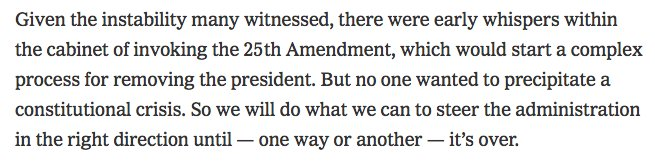
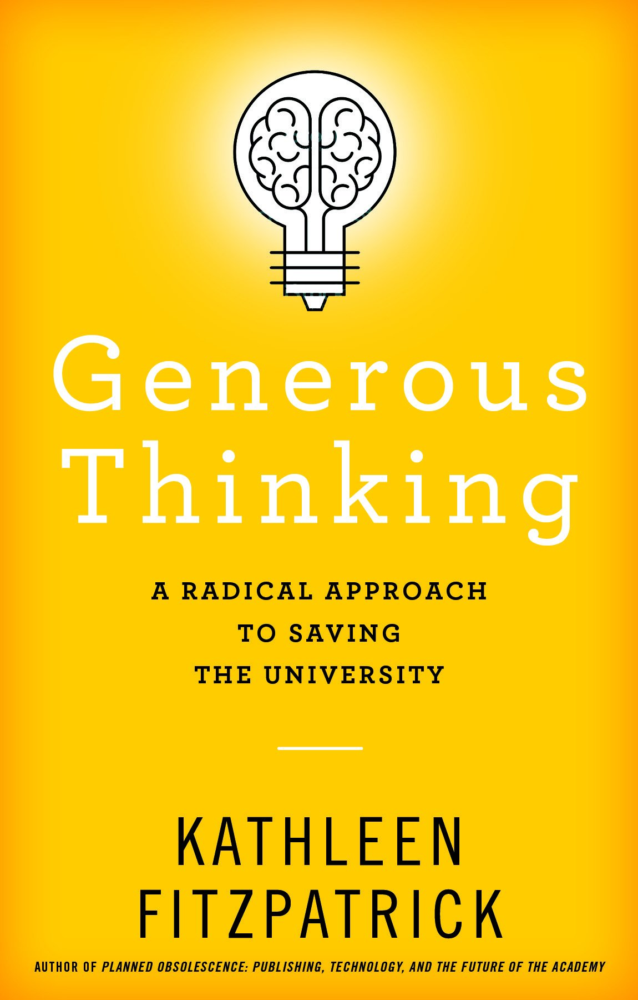
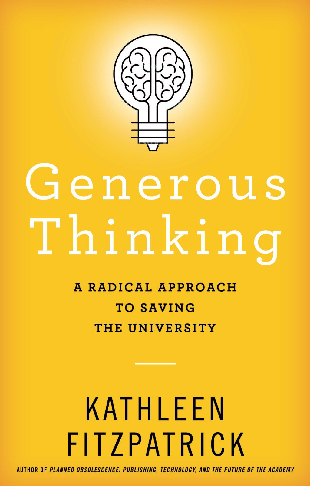

Replying to [@meganeabbott](https://twitter.com/meganeabbott/status/1035961880290971648)

> Huge congrats\!\!\!

 [Sat Sep 01 21:08:21 +0000 2018](https://twitter.com/kfitz/status/1035997812692017153)

----

Replying to [@CJ\_Daugherty](https://twitter.com/CJ_Daugherty/status/1036030590896746496)

> There’s a whole bit about ha\-has in Stoppard’s Arcadia\. It’s brilliant on paper — and was even more brilliant in the Blair Brown/Victor Garber/Robert Sean Leonard production I still can’t believe I got to see\. \(Which is the only reason I have the slightest clue what a ha\-ha is\.\)

 [Sat Sep 01 23:42:56 +0000 2018](https://twitter.com/kfitz/status/1036036714735775745)

----

> I have just finished reviewing the copy edits on a forthcoming project and am moved to send a shout\-out to the awesome copy editors of the world\. It can be painful at moments to see the flaws in what you wrote laid bare, but the process inevitably \.\.\. https://kfitz\.info/2\-september\-2018\-1148/

 [Sun Sep 02 15:54:04 +0000 2018](https://twitter.com/kfitz/status/1036281112039968768)

----

> This is big: open licensing, open platforms, no copyright transfer, and no hybrid \#oa\. https://twitter\.com/LIBEReurope/status/1036866643559890944

 [Tue Sep 04 10:11:39 +0000 2018](https://twitter.com/kfitz/status/1036919714688245760)

----

> More on \#PlanS\. This is enormous\. https://twitter\.com/LIBEReurope/status/1036869247253786626

 [Tue Sep 04 10:29:15 +0000 2018](https://twitter.com/kfitz/status/1036924141973192704)

----

> On 4 September 2018, 11 national research funding organisation, with the support of the European Commission including the European Research Council \(ERC\), announced the launch of cOAlition S, an initiative to make full and immediate Open Access to \.\.\. https://kfitz\.info/4\-september\-2018\-0632/

 [Tue Sep 04 10:39:04 +0000 2018](https://twitter.com/kfitz/status/1036926613756276736)

----

Replying to [@SheilaABrennan and @CapitolClio](https://twitter.com/SheilaABrennan/status/1036931948726427648)

> My favorite part is the clarity with which it says that so\-called hybrid OA is not compliant\. \#takethat

 [Tue Sep 04 11:02:19 +0000 2018](https://twitter.com/kfitz/status/1036932466135760896)

----

> Not true\. There are many journals with traditional process that meet these criteria — see, for instance, @openlibhums https://twitter\.com/ProfDaveAndress/status/1036985999899996160

 [Tue Sep 04 14:46:28 +0000 2018](https://twitter.com/kfitz/status/1036988874407464961)

----

> By \*doing\* it\. Many journals have\. Not to mention that @openlibhums and the editors of its journals might contest your characterization\. https://twitter\.com/ProfDaveAndress/status/1036990606785085440

 [Tue Sep 04 14:56:57 +0000 2018](https://twitter.com/kfitz/status/1036991513211875329)

----

Replying to [@brettbobley](https://twitter.com/brettbobley/status/1036995770426290176)

> Journal articles only at this deadline; the report recognizes that books/monographs “may” take longer to sort out\.

 [Tue Sep 04 15:34:33 +0000 2018](https://twitter.com/kfitz/status/1037000976262201349)

----

Replying to [@mchris4duke](https://twitter.com/mchris4duke/status/1037016386067947521)

> Sending all my best thoughts to you and your family, Chris\.

 [Tue Sep 04 16:50:34 +0000 2018](https://twitter.com/kfitz/status/1037020102619791360)

----

> I think you may be misunderstanding the term “constitutional crisis,” which we have been in repeatedly over the last 21 months\. THIS, on the other hand, is what the constitution is FOR\. 
> 
> 

 [Wed Sep 05 20:29:42 +0000 2018](https://twitter.com/kfitz/status/1037437640910532609)

----

Replying to [@dancohen](https://twitter.com/dancohen/status/1037732993983553537)

> Oh, no, Dan\. I am so, so sorry\. What a loss\.

 [Thu Sep 06 16:06:31 +0000 2018](https://twitter.com/kfitz/status/1037733796223827968)

----

Replying to [@electricarchaeo](https://twitter.com/electricarchaeo/status/1037764012983742464)

> Nice\! Is this hosted or are you running it?

 [Thu Sep 06 18:41:29 +0000 2018](https://twitter.com/kfitz/status/1037772793490944001)

----

Replying to [@electricarchaeo](https://twitter.com/electricarchaeo/status/1037775982923403264)

> I poked around on GitHub and found a repo for an installable version… https://github\.com/hackmdio/codimd

 [Thu Sep 06 19:32:11 +0000 2018](https://twitter.com/kfitz/status/1037785551435386881)

----

Replying to [@electricarchaeo](https://twitter.com/electricarchaeo/status/1037776372247146496)

> Ha, I should read further before replying\!

 [Thu Sep 06 19:32:56 +0000 2018](https://twitter.com/kfitz/status/1037785739386408962)

----

Replying to [@electricarchaeo](https://twitter.com/electricarchaeo/status/1037786363121131520)

> Ahahahaha that sounds SO familiar\.

 [Thu Sep 06 19:42:07 +0000 2018](https://twitter.com/kfitz/status/1037788053455167489)

----

> Another vote\! https://twitter\.com/electricarchaeo/status/1037777650490605568

 [Thu Sep 06 19:43:53 +0000 2018](https://twitter.com/kfitz/status/1037788497204142081)

----

Replying to [@electricarchaeo](https://twitter.com/electricarchaeo/status/1037786151187243008)

> Oh man, the reveal\.js integration\!

 [Thu Sep 06 19:44:12 +0000 2018](https://twitter.com/kfitz/status/1037788576518492160)

----

> Very excited about this new program in my department — MUSE: Mentoring Underrepresented Scholars in English\. All\-expenses\-paid workshop for prospective English graduate students, 11/14\-19\. https://muse\.cal\.msu\.edu/

 [Sun Sep 09 16:18:04 +0000 2018](https://twitter.com/kfitz/status/1038823865554796545)

----

> Thanks for the shout\-out, @schreib100\! https://twitter\.com/DEJPett/status/1039033704721539072

 [Tue Sep 11 12:16:04 +0000 2018](https://twitter.com/kfitz/status/1039487740935581698)

----

> Wait, what? https://twitter\.com/samoore\_/status/1039483048528621569

 [Tue Sep 11 12:29:38 +0000 2018](https://twitter.com/kfitz/status/1039491152360206337)

----

Replying to [@jeroenson](https://twitter.com/jeroenson/status/1039491444401233920)

> I’m at the eye doctor and all dilated so I thought maybe I was reading it wrong?

 [Tue Sep 11 12:36:02 +0000 2018](https://twitter.com/kfitz/status/1039492763576877057)

----

> Looking forward to it\! But on Friday, not today\! \(Please tell me not today\.\) @CALMSU https://twitter\.com/CALMSU/status/1039889605821181952

 [Wed Sep 12 15:35:31 +0000 2018](https://twitter.com/kfitz/status/1039900320657223681)

----

Replying to [@kfitz](https://twitter.com/CALMSU/status/1039896988626640896)

> Phew\. Friday\! @CALMSU https://twitter\.com/CALMSU/status/1039896988626640896

 [Wed Sep 12 15:36:56 +0000 2018](https://twitter.com/kfitz/status/1039900675201802241)

----

> “Thundering Manichean dumbassery” is among the best phrases I have read in recent days\. https://deadspin\.com/there\-is\-nothing\-more\-american\-than\-burning\-your\-dumb\-s\-1828812098

 [Wed Sep 12 20:08:08 +0000 2018](https://twitter.com/kfitz/status/1039968928443916289)

----

Replying to [@firegythia](https://twitter.com/firegythia/status/1039969360188788738)

> Oh, that’s pretty good\!

 [Wed Sep 12 20:10:38 +0000 2018](https://twitter.com/kfitz/status/1039969554632503296)

----

Replying to [@captain\_primate](https://twitter.com/EthanWatrall/status/1040235345177190400)

> I just spent the morning rebuilding \(most of\) my favorite Keynote theme for revealjs…

 [Thu Sep 13 15:51:54 +0000 2018](https://twitter.com/kfitz/status/1040266829522980867)

----

> Really looking forward to this\! https://twitter\.com/Ted\_Underwood/status/1040284526604365824

 [Thu Sep 13 17:33:07 +0000 2018](https://twitter.com/kfitz/status/1040292303611539463)

----

> RT @khetiwe24: \.@quinnanya channeling @kfitz \+ responses to https://kfitz\.info/sustainability\-and\-solidarity/ in conclusion to \#DARIAHBeyondEurope \- "Solidarity, not…

 [Thu Sep 13 17:37:21 +0000 2018](https://twitter.com/kfitz/status/1040293368297914369)

----

> Hey\! It’s me\! In about ten minutes\! https://twitter\.com/CALMSU/status/1039896988626640896

 [Fri Sep 14 15:51:08 +0000 2018](https://twitter.com/kfitz/status/1040629024366751744)

----

Replying to [@kfitz](https://twitter.com/kfitz/status/1040629024366751744)

> I forgot to add: 😬

 [Fri Sep 14 15:53:48 +0000 2018](https://twitter.com/kfitz/status/1040629697409941504)

----

Replying to [@zacharykaiser and @NeoliberalHE](https://twitter.com/zacharykaiser/status/1040646610835922946)

> I am going to be away at a conference, I’m afraid, but very much want to hear/see/read this talk…

 [Fri Sep 14 22:38:14 +0000 2018](https://twitter.com/kfitz/status/1040731475946209280)

----

Replying to [@sfritzsc, @CALMSU, @MSUC4I and @cplong](https://twitter.com/sfritzsc/status/1040778814148804608)

> Thank you, Sonja\! I was so glad you were able to be there\.

 [Sat Sep 15 08:24:57 +0000 2018](https://twitter.com/kfitz/status/1040879128063483904)

----

Replying to [@CJ\_Daugherty](https://twitter.com/CJ_Daugherty/status/1041013483893080064)

> How much do I love that dog\.

 [Sat Sep 15 19:07:59 +0000 2018](https://twitter.com/kfitz/status/1041040955053420544)

----

Replying to [@terrainsvagues](https://twitter.com/terrainsvagues/status/1041031631530799104)

> 9\! Time flies\. Happy birthday to the kiddo\!

 [Sat Sep 15 19:22:30 +0000 2018](https://twitter.com/kfitz/status/1041044605502988288)

----

Replying to [@CJ\_Daugherty](https://twitter.com/CJ_Daugherty/status/1041053026054758401)

> I will contribute to your defense fund\.

 [Sat Sep 15 19:57:35 +0000 2018](https://twitter.com/kfitz/status/1041053435687329797)

----

Replying to [@BerondaM](https://twitter.com/BerondaM/status/1041684799109382144)

> That’s… a really powerful metaphor\!

 [Mon Sep 17 14:27:24 +0000 2018](https://twitter.com/kfitz/status/1041695115876683776)

----

Replying to [@fletcherdurant and @uflib](https://twitter.com/fletcherdurant/status/1041741983893602304)

> Hey, congratulations\! This is fantastic news\.

 [Mon Sep 17 17:34:44 +0000 2018](https://twitter.com/kfitz/status/1041742260025679873)

----

> This thing is actually going to happen, it appears\. And it’s going to be GORGEOUS\! @JHUPress @gmbritton \#GenerousThinking 
> 
> 

 [Mon Sep 17 19:07:51 +0000 2018](https://twitter.com/kfitz/status/1041765694927499264)

----

> In Production https://kfitz\.info/in\-production/ 
> 
> 

 [Mon Sep 17 19:55:53 +0000 2018](https://twitter.com/kfitz/status/1041777781783314432)

----

Replying to [@briancroxall, @JHUPress and @gmbritton](https://twitter.com/briancroxall/status/1041811438648475648)

> It’s just beautiful\. They really outdid themselves\!

 [Mon Sep 17 22:16:12 +0000 2018](https://twitter.com/kfitz/status/1041813093230305280)

----

Replying to [@terrainsvagues, @JHUPress and @gmbritton](https://twitter.com/terrainsvagues/status/1041813361581858819)

> Thank you\! I am super excited about it\.

 [Mon Sep 17 22:18:56 +0000 2018](https://twitter.com/kfitz/status/1041813783289769984)

----

Replying to [@DLind](https://twitter.com/DLind/status/1042137928967880706)

> I still think he didn’t know how to spell “kerfuffle\.”

 [Tue Sep 18 20:01:50 +0000 2018](https://twitter.com/kfitz/status/1042141668147900421)

----

Replying to [@marynmck and @ScienceWriters](https://twitter.com/marynmck/status/1042138603000868864)

> Huge congratulations, Maryn\! A well\-deserved honor\!

 [Tue Sep 18 20:02:40 +0000 2018](https://twitter.com/kfitz/status/1042141877326307328)

----

> I think I’ve attended all of these\. https://twitter\.com/gmbritton/status/1042154634385784832

 [Tue Sep 18 20:59:22 +0000 2018](https://twitter.com/kfitz/status/1042156146046521344)

----

> “What motivates otherwise ordinary people to abandon all pretense of mercy when faced with the abject need for it?” A story that is both horrifying, and horrifyingly familiar\. \(Heads\-up: sexual violence\.\) https://www\.washingtonpost\.com/graphics/2018/opinions/arlington\-texas/

 [Thu Sep 20 18:41:55 +0000 2018](https://twitter.com/kfitz/status/1042846331587440640)

----

Replying to [@martin\_eve](https://twitter.com/martin_eve/status/1044326609191403520)

> Argh, Martin, I am so sorry\. This sounds awful\. Hoping you get some relief soon\.

 [Tue Sep 25 00:17:09 +0000 2018](https://twitter.com/kfitz/status/1044380250157846528)

----

Replying to [@sharonmleon](https://twitter.com/sharonmleon/status/1044663582192017408)

> Here’s mine: https://machines\.kfitz\.info/dossier/\. The theme I used in building this back in 2010 completely broke, alas, so it looked a bit different then, and I can’t swear that everything in it works today, but… there it is\.

 [Tue Sep 25 20:15:58 +0000 2018](https://twitter.com/kfitz/status/1044681939708448772)

----

Replying to [@sharonmleon, @electricarchaeo, @ryancordell and @ACLS1919](https://twitter.com/sharonmleon/status/1044669001576730624)

> Mine was accepted by all except one senior colleague, who demanded printed versions\. I printed everything, but with a semi\-nasty cover note indicating that this was not how things were meant to be read\.

 [Tue Sep 25 20:20:19 +0000 2018](https://twitter.com/kfitz/status/1044683035445260289)

----

Replying to [@sharonmleon](https://twitter.com/sharonmleon/status/1044683408243404801)

> Yep\! Rescued, migrated, and re\-migrated…

 [Tue Sep 25 20:23:01 +0000 2018](https://twitter.com/kfitz/status/1044683712577851392)

----

> Have you started thinking about your \#ACH2019 proposal? Submission deadline November 10\! http://ach2019\.ach\.org/cfp/cfp\-call\-for\-participation\-en/

 [Tue Sep 25 22:44:10 +0000 2018](https://twitter.com/kfitz/status/1044719236998934529)

----

Replying to [@wynkenhimself](https://twitter.com/wynkenhimself/status/1044953775449014283)

> This\. This this this\. I cannot tell you the number of times that I have said some variant of “but at least \*that\* didn’t happen\.” I am so, so sorry\.

 [Wed Sep 26 16:51:20 +0000 2018](https://twitter.com/kfitz/status/1044992830601678854)

----

> Delighted to be at Marquette University today for the 2018 Digital Scholarship Symposium \(with @sharonmleon and @NKHayles\)\.

 [Thu Sep 27 14:34:40 +0000 2018](https://twitter.com/kfitz/status/1045320824939581441)

----

Replying to [@kfitz](https://twitter.com/kfitz/status/1045320824939581441)

> \(Delighted in no small part because it means I can’t drown in the awfulness\. Sending love and strength to survivors today, and every day\.\)

 [Thu Sep 27 14:37:54 +0000 2018](https://twitter.com/kfitz/status/1045321638550679552)

----

Replying to [@LibSkrat](https://twitter.com/LibSkrat/status/1045321337814831105)

> \*waves back\*

 [Thu Sep 27 14:38:28 +0000 2018](https://twitter.com/kfitz/status/1045321782356561921)

----

> RT @SidrahMay: I don't want men to be allies\. I want you to be traitors\. I want you to be traitors to the system that violently holds you u…

 [Fri Sep 28 14:01:57 +0000 2018](https://twitter.com/kfitz/status/1045674980439199744)

----

> I am attempting to proofread this thing about generosity and the public good today, but there’s something interfering with my concentration\. Call it my apoplectic levels of rage\. Yesterday was despair\-inducing, but like @wynkenhimself, I’ve been sent \.\.\. https://kfitz\.info/28\-september\-2018\-1021/

 [Fri Sep 28 14:31:18 +0000 2018](https://twitter.com/kfitz/status/1045682366474334208)

----

Replying to [@wynkenhimself](https://twitter.com/wynkenhimself/status/1045683243763322881)

> Amen\.

 [Fri Sep 28 14:35:52 +0000 2018](https://twitter.com/kfitz/status/1045683513176059905)

----

> RT @wynkenhimself: @kfitz I wish I could gather to me in person all the strong women I love so we can lean on each other today and summon o…

 [Fri Sep 28 14:38:22 +0000 2018](https://twitter.com/kfitz/status/1045684144221638657)

----

> Make plans now to come join us\! https://twitter\.com/kmapesy/status/1045761607849177088

 [Fri Sep 28 19:55:26 +0000 2018](https://twitter.com/kfitz/status/1045763934777741314)

----

> RT @VariabilityBlog: Three reasons to read "GENEROUS THINKING" by @kfitz https://generousthinking\.hcommons\.org/1\-introduction/  
>   
> 1\. The passionate argument for the import…

 [Sat Sep 29 13:18:25 +0000 2018](https://twitter.com/kfitz/status/1046026412682092544)

----

Replying to [@VariabilityBlog](https://twitter.com/VariabilityBlog/status/1046007231509155840)

> Thank you\!

 [Sat Sep 29 13:18:37 +0000 2018](https://twitter.com/kfitz/status/1046026462871121922)

----

Replying to [@tressiemcphd](https://twitter.com/tressiemcphd/status/1046060876959305731)

> I am so sorry for your loss\.

 [Sat Sep 29 17:02:46 +0000 2018](https://twitter.com/kfitz/status/1046082871574896641)

----

Replying to [@terrainsvagues](https://twitter.com/terrainsvagues/status/1046069462556966913)

> Thanks so much for these posts\. It’s so important to be able to be honest and open about who and how we are\. ❤️

 [Sat Sep 29 19:00:59 +0000 2018](https://twitter.com/kfitz/status/1046112621282381824)