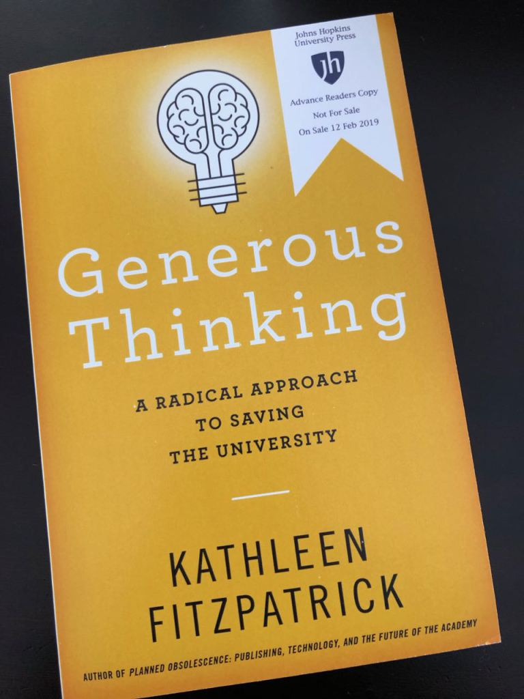
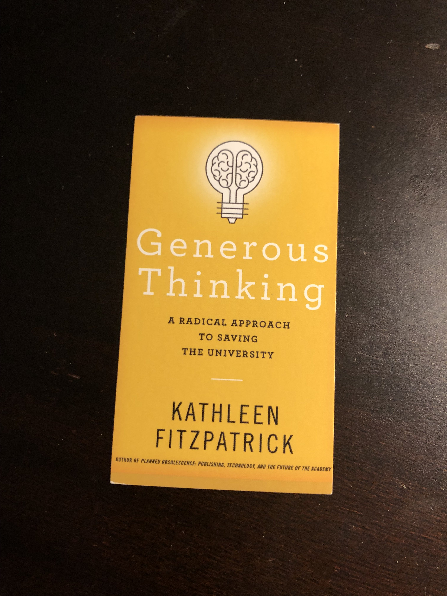

Replying to [@sbanetweiser and @DukePress](https://twitter.com/sbanetweiser/status/1058004308506099717)

> Congratulations\! I can’t wait to read it\.

 [Thu Nov 01 14:42:25 +0000 2018](https://twitter.com/kfitz/status/1058006349878046722)

----

Replying to [@safiyanoble](https://twitter.com/safiyanoble/status/1057277224368271360)

> Congratulations\! This is fantastic news\.

 [Thu Nov 01 15:03:26 +0000 2018](https://twitter.com/kfitz/status/1058011638505320448)

----

Replying to [@wynkenhimself](https://twitter.com/wynkenhimself/status/1058426983431000065)

> Rats\! I am in DC that week but leave on the 12th\!

 [Fri Nov 02 18:49:36 +0000 2018](https://twitter.com/kfitz/status/1058430945659969536)

----

> Johns Hopkins UP’s higher ed catalog:  
> a\. Includes several amazing things I can’t wait to read, and  
> b\. Has a beautiful cover design besides\. https://issuu\.com/johnshopkinsuniversitypress/docs/jhup\-education\_2018?e\=8238820/65372486

 [Sat Nov 03 20:57:02 +0000 2018](https://twitter.com/kfitz/status/1058825403358416896)

----

> Up ludicrously early today and on my way east\. @trinitycollege today; @UConn tomorrow\. See you soon, Connecticut\!

 [Mon Nov 05 12:49:23 +0000 2018](https://twitter.com/kfitz/status/1059427457156214786)

----

> RT @DoughertyJack: Great talk by @kfitz @trinitycollege on her “Generous Thinking” book made me wonder which arguments will persuade more s…

 [Tue Nov 06 10:58:06 +0000 2018](https://twitter.com/kfitz/status/1059761837657460736)

----

Replying to [@rschon, @timelfen, @acorsin, @daniel\_lende, @socarxiv, @humcommons, @OSFramework and @OyaRieger](https://twitter.com/rschon/status/1059941531111563264)

> I’d also add that @humcommons is scholarly society owned and operated, and so committed to the values under which such communities operate\. Let me know if we can help\!

 [Tue Nov 06 23:07:06 +0000 2018](https://twitter.com/kfitz/status/1059945298875875329)

----

Replying to [@jwolman, @robinsloan and @tcarmody](https://twitter.com/jwolman/status/1060006613535182849)

> You have other MI connections too, Jacob\.

 [Wed Nov 07 12:21:08 +0000 2018](https://twitter.com/kfitz/status/1060145123084918789)

----

> Things that are making me happy this morning:  
>   
> Scott Walker\.  
> Dana Rohrabacher\.  
>   
> There is a long, long way to go\. But there are some promising starts\.

 [Wed Nov 07 12:25:11 +0000 2018](https://twitter.com/kfitz/status/1060146143617826816)

----

> RT @HayesBrown: If I were the next Speaker of the House, I’d announce a push to overhaul the nation’s election infrastructure, with a pledg…

 [Wed Nov 07 12:40:46 +0000 2018](https://twitter.com/kfitz/status/1060150062041493504)

----

> RT @booktoss: This is what change looks like\. Get ready Washington DC 
> 
> 

 [Wed Nov 07 13:52:50 +0000 2018](https://twitter.com/kfitz/status/1060168198748889088)

----

Replying to [@BendProf and @nowherenews](https://twitter.com/BendProf/status/1060730428980649986)

> Oh, Stacey\. I am so sorry for your loss\. I’ll be thinking of you\.

 [Fri Nov 09 03:57:24 +0000 2018](https://twitter.com/kfitz/status/1060743129001836544)

----

> If the WH press corps does not band together and refuse to give voice to this authoritarian, there is already no such thing as a free press\. https://twitter\.com/mkraju/status/1060908834657628160

 [Fri Nov 09 20:23:33 +0000 2018](https://twitter.com/kfitz/status/1060991302890872832)

----

Replying to [@safiyanoble](https://twitter.com/safiyanoble/status/1062083526206484480)

> Congratulations\!\!\! So well beyond deserved\!

 [Mon Nov 12 23:32:06 +0000 2018](https://twitter.com/kfitz/status/1062125915231133697)

----

> Anyone who has ever read the comments at the Chron could tell you this is a \*terrible\* idea\. https://twitter\.com/epkaufm/status/1061906262672183297

 [Mon Nov 12 23:33:17 +0000 2018](https://twitter.com/kfitz/status/1062126215945961472)

----

> Eeeeeeee\! 
> 
> 

 [Tue Nov 13 18:27:33 +0000 2018](https://twitter.com/kfitz/status/1062411662848901132)

----

Replying to [@yasmeen\_azadi](https://twitter.com/yasmeen_azadi/status/1062412247019016192)

> Thanks, Yasmeen\!

 [Tue Nov 13 18:36:57 +0000 2018](https://twitter.com/kfitz/status/1062414028717334528)

----

Replying to [@DanicaSavonick](https://twitter.com/DanicaSavonick/status/1062413611451195392)

> You had a huge influence on how it turned out, Danica — I hope it rises to your comments\!

 [Tue Nov 13 18:37:44 +0000 2018](https://twitter.com/kfitz/status/1062414225593851904)

----

Replying to [@bukuwawa](https://twitter.com/bukuwawa/status/1062414582264881152)

> People who bought…

 [Tue Nov 13 18:42:22 +0000 2018](https://twitter.com/kfitz/status/1062415391530606592)

----

Replying to [@jwolman](https://twitter.com/jwolman/status/1062417015309164544)

> Top of my list\! \(But this book might be a little help\.\)

 [Tue Nov 13 18:51:17 +0000 2018](https://twitter.com/kfitz/status/1062417633109270529)

----

> RT @ChrisWalsh05: One for the reading list\! Planned obsolescence made a huge contribution to informing @RCEMLearning ethos https://t\.co/66l…

 [Tue Nov 13 20:34:10 +0000 2018](https://twitter.com/kfitz/status/1062443527123144704)

----

Replying to [@ChrisWalsh05 and @RCEMLearning](https://twitter.com/ChrisWalsh05/status/1062438160347598848)

> Thank you for this — I am thrilled to know about this impact\!

 [Tue Nov 13 20:34:38 +0000 2018](https://twitter.com/kfitz/status/1062443645234765824)

----

Replying to [@laura11D](https://twitter.com/laura11D/status/1062443572581093377)

> Yay\!

 [Tue Nov 13 20:34:49 +0000 2018](https://twitter.com/kfitz/status/1062443691636375553)

----

Replying to [@jeroenson](https://twitter.com/jeroenson/status/1062448049396563968)

> Thank you\!

 [Tue Nov 13 20:54:44 +0000 2018](https://twitter.com/kfitz/status/1062448703536009216)

----

Replying to [@SheilaABrennan](https://twitter.com/SheilaABrennan/status/1062465439199084544)

> It has been a whirlwind\! I’m super excited about it\.

 [Tue Nov 13 22:25:12 +0000 2018](https://twitter.com/kfitz/status/1062471470314590208)

----

Replying to [@peripatesis](https://twitter.com/peripatesis/status/1062469278211878912)

> Thank you\! I really appreciate it\.

 [Tue Nov 13 22:25:29 +0000 2018](https://twitter.com/kfitz/status/1062471538535026689)

----

Replying to [@jesherer](https://twitter.com/jesherer/status/1062469534936915968)

> That is so nice of you to say\! I hope this one can do some good work out there\.

 [Tue Nov 13 22:25:57 +0000 2018](https://twitter.com/kfitz/status/1062471657359581184)

----

Replying to [@lynnegoldstein](https://twitter.com/lynnegoldstein/status/1062480334279761920)

> It was, indeed\. Very much looking forward to setting this thing loose in the world\!

 [Tue Nov 13 23:01:24 +0000 2018](https://twitter.com/kfitz/status/1062480579902558208)

----

Replying to [@LadyLibrarianND](https://twitter.com/LadyLibrarianND/status/1062742708475834368)

> Thank you so much\! I so enjoyed getting to talk with everyone there\.

 [Wed Nov 14 16:49:19 +0000 2018](https://twitter.com/kfitz/status/1062749328924700673)

----

> The deadline for proposals for the 4th annual Global DH Symposium is imminent\! \#msudh https://twitter\.com/kmapesy/status/1062029492456222720

 [Wed Nov 14 18:10:28 +0000 2018](https://twitter.com/kfitz/status/1062769750604988416)

----

> Thanks to all of you who were at least half as excited about the ARC of \#GenerousThinking as I was\! A few of you asked for more info on the book’s argument or on getting review copies; my amazing press can help with both of those\. https://jhupbooks\.press\.jhu\.edu/content/generous\-thinking @JHUPress

 [Wed Nov 14 19:45:13 +0000 2018](https://twitter.com/kfitz/status/1062793596972265472)

----

Replying to [@unsworth](https://twitter.com/unsworth/status/1063121643999035393)

> Whoa\! I hope the recovery goes well\. How could it not, with such Imaging Excellence?

 [Thu Nov 15 19:17:30 +0000 2018](https://twitter.com/kfitz/status/1063149008485580800)

----

Replying to [@gmbritton, @JHUPress and @aupresses](https://twitter.com/gmbritton/status/1063456082868273152)

> Hey, happy UP week\! That looks like a very nice pile of ARCs mid\-video\. :\)

 [Fri Nov 16 16:31:41 +0000 2018](https://twitter.com/kfitz/status/1063469668617342978)

----

Replying to [@martin\_eve](https://twitter.com/martin_eve/status/1063531724401979392)

> Okay, fine, made me click\.

 [Fri Nov 16 20:58:27 +0000 2018](https://twitter.com/kfitz/status/1063536801367891968)

----

Replying to [@laurenfklein, @lmrhody, @sharonmleon, @eetempleton, @kellyreeder\_26, @runningreading1, @SarahsShelves, @TheUncorkedLib, @KaraDiDomizio, @advorkovich, @McFaul, @jflorez, @poetixtrip, @cat\_81491, @anneberrywrites, @AvhleeWrites, @thriftybiblio, @TBibliovert, @HogwartsGrad\_7, @novelvisits, @GilmoreGuide, @itsbooktalk, @TBRetc, @nycbookgirltwt, @MlleBoazBiblio, @shannonkneemer, @reederreads, @RoseRunsOn, @ImTheMarigold, @Frekles827, @cmelchioneadams, @alanna\_cotch, @write2run, @drlesko, @wynkenhimself, @SheilaABrennan, @juliakbrock, @econroykrutz, @EllaKHoward, @katinalynn, @elizabethalsop, @nowviskie and @rgay](https://twitter.com/laurenfklein/status/1064559065781682176)

> So great seeing everyone’s lists\! I recently finished the Ancillary Justice trilogy on the fiction side, and Vilém Flusser’s Does Writing Have a Future? on the nonfiction\.

 [Mon Nov 19 17:15:47 +0000 2018](https://twitter.com/kfitz/status/1064567926395715584)

----

> This is so great, and so deserved\! Congratulations to all at @JHUPress; I’m honored to have had the chance to work with you\! https://twitter\.com/aupresses/status/1064899927476707333

 [Tue Nov 20 22:27:25 +0000 2018](https://twitter.com/kfitz/status/1065008742889136128)

----

Replying to [@kfitz](https://twitter.com/wynkenhimself/status/1065241324633370624)

> This whole thread\. But especially this\. Sending love to all of you \(but especially to you, @wynkenhimself\)\. https://twitter\.com/wynkenhimself/status/1065241324633370624

 [Wed Nov 21 14:02:56 +0000 2018](https://twitter.com/kfitz/status/1065244173501120514)

----

Replying to [@miriamkp](https://twitter.com/miriamkp/status/1066467808517779457)

> Ugh ugh ugh\. I would say that I wish I knew why people feel like it’s okay to comment on anyone else’s body at all, except\.\.\. I do know, and it sucks\.

 [Sat Nov 24 23:11:00 +0000 2018](https://twitter.com/kfitz/status/1066469261277835264)

----

Replying to [@miriamkp](https://twitter.com/miriamkp/status/1066469786677334016)

> That and projecting all of my own body anxieties onto you, who surely must feel them too\.

 [Sat Nov 24 23:15:46 +0000 2018](https://twitter.com/kfitz/status/1066470458521018369)

----

> If you can, consider helping support the network that supports you\. Your donations will help our always free, open, non\-profit scholarly network grow\! https://twitter\.com/humcommons/status/1067445472871268353

 [Tue Nov 27 15:56:31 +0000 2018](https://twitter.com/kfitz/status/1067447081240023041)

----

Replying to [@ProfGeoJustice, @devoneylooser and @JHUPress](https://twitter.com/@ProfGeoJustice/status/1067188295237390337)

> Sweet\! Trade? 
> 
> 

 [Tue Nov 27 16:55:07 +0000 2018](https://twitter.com/kfitz/status/1067461830052851713)

----

> Ridiculously excited about these business cards — not least that they come with a 20% discount on the book\. I’ll be handing these out all over the place\. Thanks, @JHUPress\! 
> 
> 

 [Tue Nov 27 16:58:54 +0000 2018](https://twitter.com/kfitz/status/1067462782130548739)

----

> RT @humcommons: \#GivingTuesday is here\! We invite you to join the movement and support the network that supports you\. We're committed to pr…

 [Tue Nov 27 18:31:33 +0000 2018](https://twitter.com/kfitz/status/1067486097620512769)

----

Replying to [@wynkenhimself](https://twitter.com/wynkenhimself/status/1067422216810192901)

> Those are SO GREAT\!

 [Tue Nov 27 18:33:18 +0000 2018](https://twitter.com/kfitz/status/1067486540727795712)

----

Replying to [@anneperez, @profdgd, @kwazana and @bonni208](https://twitter.com/anneperez/status/1067561579741274113)

> Aw, hey — thank you\!\!\!

 [Tue Nov 27 23:38:42 +0000 2018](https://twitter.com/kfitz/status/1067563395367534592)

----

> RT @humcommons: There are just a few hours left to participate in \#GivingTuesday2018 \! Please consider donating to @humcommons so that we c…

 [Tue Nov 27 23:42:47 +0000 2018](https://twitter.com/kfitz/status/1067564421059350530)

----

Replying to [@sharonmleon, @quinnanya, @thomasgpadilla, @heatherfro, @antimony27, @sgsinclair, @GeoffRockwell, @nowviskie, @elotroalex, @zotero, @omeka and @humcommons](https://twitter.com/sharonmleon/status/1067912480310116352)

> This is a conversation that I have an interest in \(c\.f\. @humcommons\)\. And it's a complicated one\. I very much like the idea of an institute \-\- or of linking up with other projects around community\-supported infrastructure that are surfacing\.\.\.

 [Wed Nov 28 22:51:58 +0000 2018](https://twitter.com/kfitz/status/1067914020500451328)

----

Replying to [@kmapesy, @sharonmleon, @quinnanya, @thomasgpadilla, @heatherfro, @antimony27, @sgsinclair, @GeoffRockwell, @nowviskie, @elotroalex, @zotero, @omeka and @humcommons](https://twitter.com/kmapesy/status/1067915696175280128)

> I suspect that a lot of that is infrastructure at the EU level; the US reliance on private foundation funding leaves projects a bit on their own, sustainability\-wise\.

 [Wed Nov 28 23:02:30 +0000 2018](https://twitter.com/kfitz/status/1067916673871695873)

----

> Three AMAZING digital studies jobs, working with great colleagues, right down the road from me\! https://twitter\.com/niftyc/status/1064168135924822017

 [Thu Nov 29 20:01:24 +0000 2018](https://twitter.com/kfitz/status/1068233484475478016)

----

Replying to [@terrainsvagues and @nisaface](https://twitter.com/terrainsvagues/status/1068245138776961024)

> All those feet\!

 [Thu Nov 29 20:52:55 +0000 2018](https://twitter.com/kfitz/status/1068246451950620674)