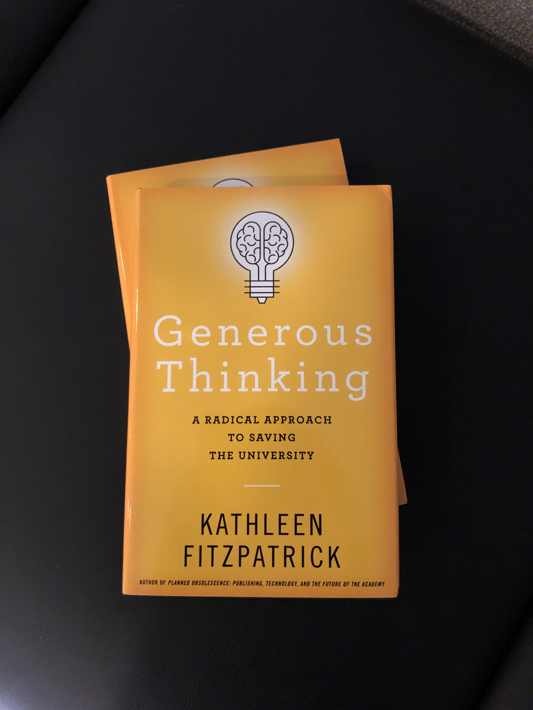
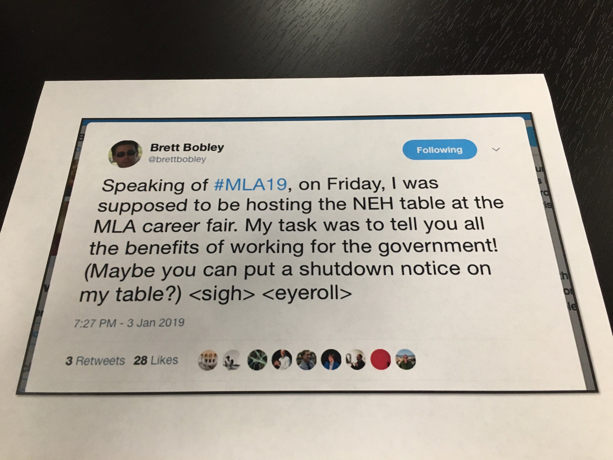
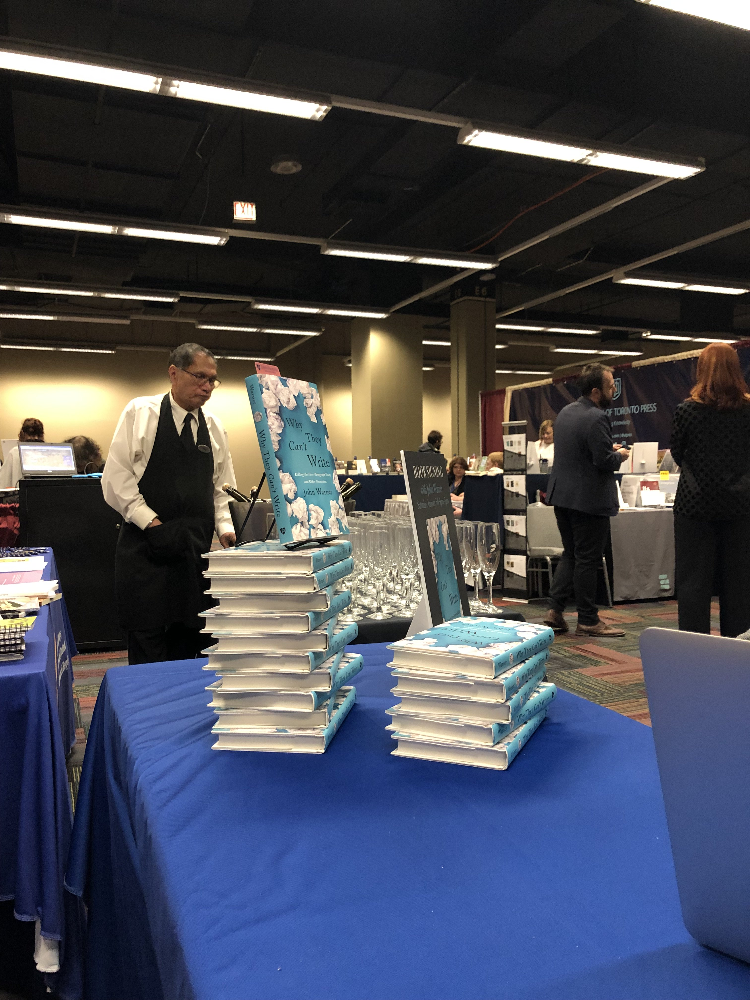
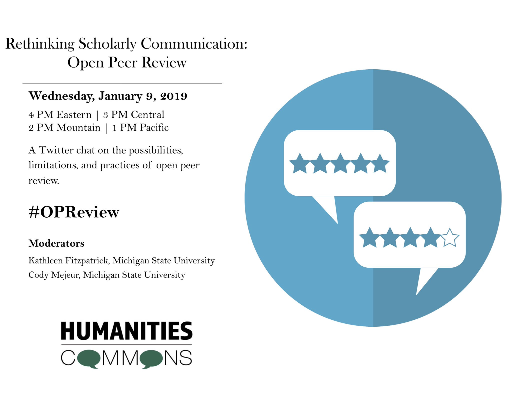
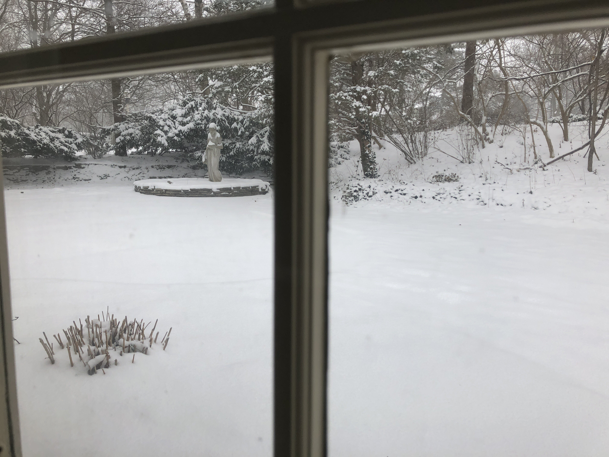
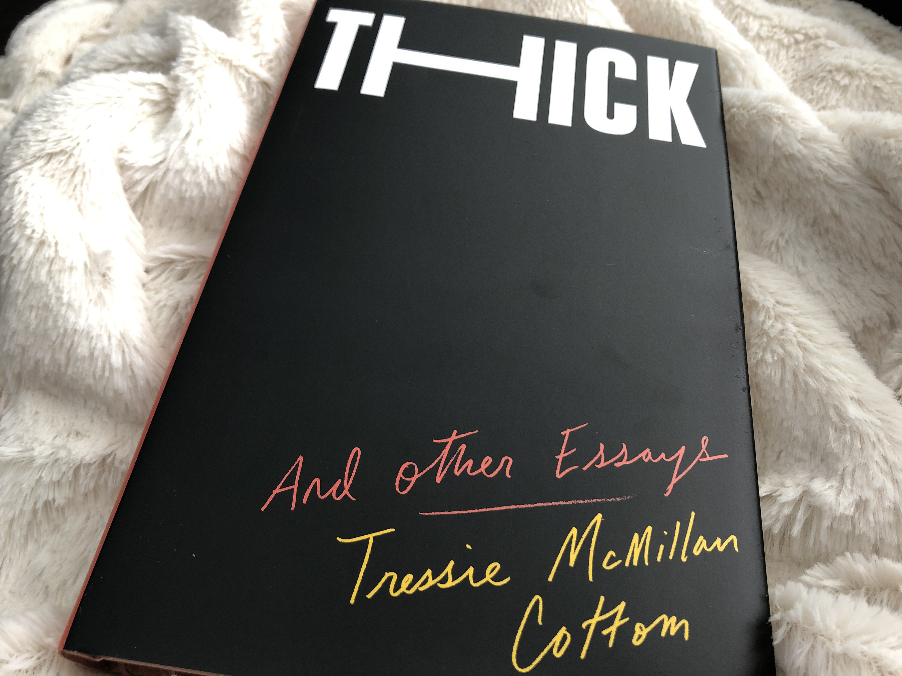
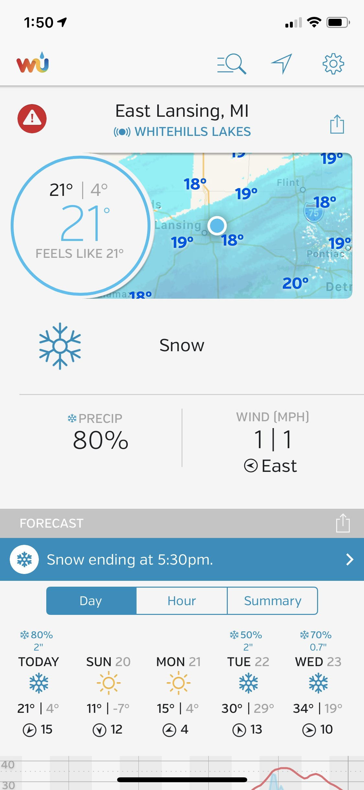
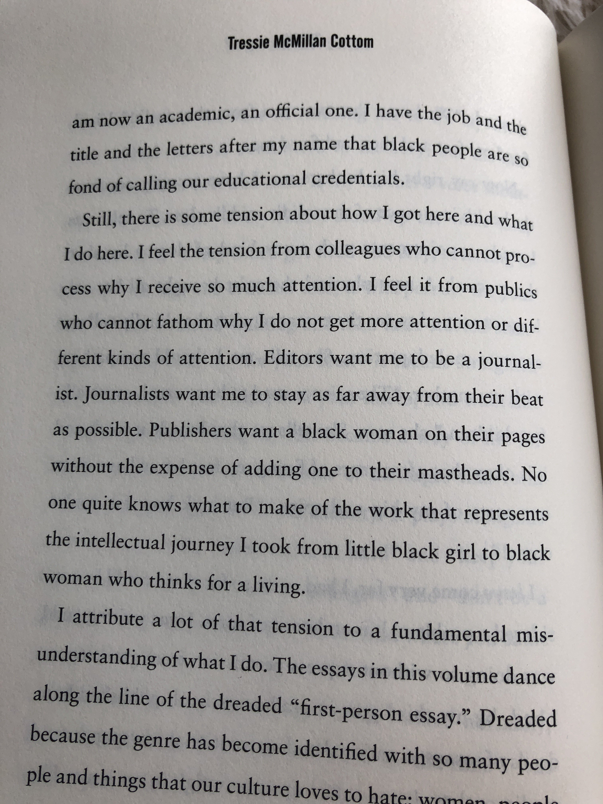
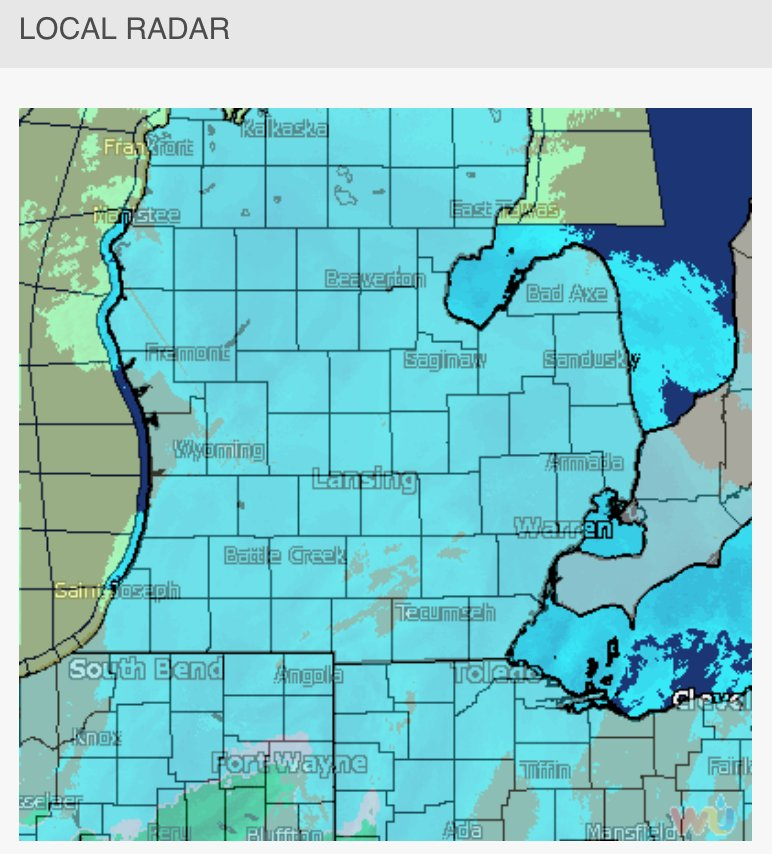

> THIS is worth celebrating\. Thanks, 2019\! https://twitter\.com/MikeFurlough/status/1080120209640280073

 [Tue Jan 01 15:27:23 +0000 2019](https://twitter.com/kfitz/status/1080123326423539712)

----

> The willingness to be vulnerable would probably be the single thing I wish we had more of in this culture, if I had to pick\. https://twitter\.com/JamilSmith/status/1080155189502328832

 [Tue Jan 01 21:39:27 +0000 2019](https://twitter.com/kfitz/status/1080216959474696192)

----

> This\. Whole\. Thread\. https://twitter\.com/sivavaid/status/1080185654502408198

 [Tue Jan 01 22:12:24 +0000 2019](https://twitter.com/kfitz/status/1080225251202646017)

----

> Not unconnected\. https://twitter\.com/rossjonesWXYZ/status/1080174993047252992

 [Tue Jan 01 22:13:13 +0000 2019](https://twitter.com/kfitz/status/1080225457814097922)

----

> Heading to \#MLA19 via Amtrak, which has got me a little disoriented\. \#thoughtiwasinthemidwest

 [Wed Jan 02 13:43:30 +0000 2019](https://twitter.com/kfitz/status/1080459570328363009)

----

> Hoping to see many of you in Chicago for \#MLA19\! You can find me at \#s01A, Designing Community Engaged Research; \#s350, The Impact of Kate Hayles’s NEH Summer Seminar; and \#s487, Transacting DH\.

 [Wed Jan 02 13:51:38 +0000 2019](https://twitter.com/kfitz/status/1080461619929538566)

----

> I’ll also be in the @JHUPress booth in the exhibit hall on Saturday from 4 to 5pm, hanging out with @biblioracle\. \(Rumor has it that there’ll be early copies of \#GenerousThinking on hand\!\)

 [Wed Jan 02 13:54:19 +0000 2019](https://twitter.com/kfitz/status/1080462295329837056)

----

> Also\! My wonderful @humcommons colleagues will be available in MLA PubCentral, but catch me if you have questions or ideas about how Humanities Commons might work for you\. \#MLA19

 [Wed Jan 02 14:09:34 +0000 2019](https://twitter.com/kfitz/status/1080466132375609344)

----

> Another opportunity to pick up some Humanities Commons tips and tricks\! https://twitter\.com/MLAnews/status/1080464018706522112

 [Wed Jan 02 14:36:30 +0000 2019](https://twitter.com/kfitz/status/1080472909594984450)

----

> This is enormously exciting\! Congratulations, all\! https://twitter\.com/MLAnews/status/1080510460305334278

 [Wed Jan 02 17:18:03 +0000 2019](https://twitter.com/kfitz/status/1080513566879432709)

----

Replying to [@ryancordell](https://twitter.com/ryancordell/status/1080600964258762754)

> This is the ONLY good part I have found in the midlife wake up at 4:30am thing\. \#whatelseareyougoingtodo \#mla19

 [Wed Jan 02 23:22:38 +0000 2019](https://twitter.com/kfitz/status/1080605313970118656)

----

> Now even louder: Eeeeeeee\!\!\! \#mla19 \#generousthinking 
> 
> 

 [Thu Jan 03 19:13:30 +0000 2019](https://twitter.com/kfitz/status/1080905007631720450)

----

Replying to [@MGisu82](https://twitter.com/MGisu82/status/1080908007368605696)

> Hooray, and thank you\!

 [Thu Jan 03 19:39:51 +0000 2019](https://twitter.com/kfitz/status/1080911636091654144)

----

Replying to [@CarolynDever](https://twitter.com/CarolynDever/status/1080920999531491328)

> Wonderful — thank you\!\!\!

 [Thu Jan 03 20:18:05 +0000 2019](https://twitter.com/kfitz/status/1080921258202562561)

----

Replying to [@triproftri](https://twitter.com/triproftri/status/1080928302922166273)

> Thank you\! :\)

 [Thu Jan 03 20:47:00 +0000 2019](https://twitter.com/kfitz/status/1080928535806726145)

----

Replying to [@chutry and @triproftri](https://twitter.com/chutry/status/1080932936889843714)

> Thanks, Chuck\! I hope it spurs some helpful conversations\.

 [Thu Jan 03 21:18:42 +0000 2019](https://twitter.com/kfitz/status/1080936516304752641)

----

Replying to [@brettbobley](https://twitter.com/brettbobley/status/1080983248895913985)

> Argh argh argh\. We’ll miss you\. Here’s hoping we have more reasons to celebrate more things soon\.

 [Fri Jan 04 02:34:36 +0000 2019](https://twitter.com/kfitz/status/1081016015209803777)

----

Replying to [@striphas](https://twitter.com/striphas/status/1081232766392385536)

> Thanks so much\!

 [Fri Jan 04 16:57:39 +0000 2019](https://twitter.com/kfitz/status/1081233207549456385)

----

> RT @gmbritton: This \#shutdown touches us all \#mla19 ⁦@brettbobley⁩ — we got your sign posted\. 
> 
> 

 [Fri Jan 04 17:55:43 +0000 2019](https://twitter.com/kfitz/status/1081247820609449984)

----

> RT @humcommons: If you're presenting at \#MLA19 or \#AHA19 this weekend, please consider uploading your paper/presentation to CORE\. Your work…

 [Fri Jan 04 17:57:24 +0000 2019](https://twitter.com/kfitz/status/1081248244942979072)

----

Replying to [@elotroalex, @triproftri, @AdrianWisnicki and @AmandaGailey](https://twitter.com/elotroalex/status/1081257086212808706)

> You are free to stay, as you successfully defined your usage of the term\. 😉

 [Fri Jan 04 18:36:44 +0000 2019](https://twitter.com/kfitz/status/1081258141843705858)

----

> Thrilled to be in such great company\! https://twitter\.com/arbuckle\_alyssa/status/1081268423550734336

 [Fri Jan 04 19:33:52 +0000 2019](https://twitter.com/kfitz/status/1081272519905210368)

----

> RT @SFU\_GradStudies: How can we cultivate more productive relationships between universities and the public? @SFUPublicSquare will be co\-ho…

 [Fri Jan 04 19:34:26 +0000 2019](https://twitter.com/kfitz/status/1081272661383229441)

----

Replying to [@PastryPlate and @triciamatthew](https://twitter.com/PastryPlate/status/1081336419258372097)

> Thank you\! It is indeed pretty awesome :\)

 [Fri Jan 04 23:50:28 +0000 2019](https://twitter.com/kfitz/status/1081337097036935170)

----

Replying to [@tcarmody](https://twitter.com/tcarmody/status/1081347976155578368)

> Oh no\! Tim, I’m so sorry\.

 [Sat Jan 05 00:53:15 +0000 2019](https://twitter.com/kfitz/status/1081352897550606349)

----

> HUUUUGE congratulations, @electricarchaeo &amp; team\! https://twitter\.com/OpenContext/status/1081360473209982986

 [Sat Jan 05 01:35:18 +0000 2019](https://twitter.com/kfitz/status/1081363477682417664)

----

> Good morning, \#mla19\! I’m looking forward to \#s487, Transacting Digital Humanities, today at noon\. Also to signing some copies of this beauty in the @JHUPress booth at 4:00\. Come say hi\! \#generousthinking 
> 
> 

 [Sat Jan 05 16:25:21 +0000 2019](https://twitter.com/kfitz/status/1081587465058729985)

----

Replying to [@LBMcGrath and @JHUPress](https://twitter.com/LBMcGrath/status/1081599712736743425)

> I know\! I am too\.

 [Sat Jan 05 17:16:28 +0000 2019](https://twitter.com/kfitz/status/1081600330016714752)

----

> RT @mkgold: Attendees of \#s487 \(Transacting DH\) may also be interested in \#s613 \(Getting Credit in Digital Publishing &amp; DH Projects\) at 5:1…

 [Sat Jan 05 18:22:27 +0000 2019](https://twitter.com/kfitz/status/1081616933454266368)

----

> RT @sharonmleon: This is generally @lmrhody's stance in the world, and we're all better for it\. https://twitter\.com/laurabrarian/status/1081627135473840128

 [Sat Jan 05 20:54:54 +0000 2019](https://twitter.com/kfitz/status/1081655298824327169)

----

> RT @biblioracle: At 4pm it isn’t just me at the @JHUPress booth\. You can lay hands on the first copies of @kfitz’s Generous Thinking: A Rad…

 [Sat Jan 05 21:48:42 +0000 2019](https://twitter.com/kfitz/status/1081668839170019338)

----

> RT @gmbritton: Meet @KFitz, author of Generous Thinking: A Radical Approach to Saving the University in the Hopkins book exhibit \#MLA19 4:0…

 [Sat Jan 05 21:49:21 +0000 2019](https://twitter.com/kfitz/status/1081669005222559749)

----

> RT @biblioracle: I underplayed the highlight of our 4pm event @JHUPress booth at \#MLA19   In addition to me and @kfitz  there’s 🍾 https://t…

 [Sat Jan 05 21:53:58 +0000 2019](https://twitter.com/kfitz/status/1081670163513118726)

----

> Me, @biblioracle, and bubbles\! Any minute now, in the @JHUPress booth\. \#mla19 \#generousthinking 
> 
> 

 [Sat Jan 05 21:55:41 +0000 2019](https://twitter.com/kfitz/status/1081670597615251456)

----

Replying to [@BerondaM, @cgoldstead, @biblioracle and @JHUPress](https://twitter.com/BerondaM/status/1081698204209565696)

> It was perfect\!

 [Sun Jan 06 00:05:03 +0000 2019](https://twitter.com/kfitz/status/1081703153261793280)

----

> Y’all are the best\. ❤️ https://twitter\.com/helmstreet/status/1081702894217449480

 [Sun Jan 06 00:05:52 +0000 2019](https://twitter.com/kfitz/status/1081703360418463745)

----

> RT @profwernimont: Listen @insidehighered there are ways to share news of \#metoo without putting survivors and our advocates at risk\. The r…

 [Sun Jan 06 14:00:13 +0000 2019](https://twitter.com/kfitz/status/1081913330837663744)

----

> Enormous thanks again to @gmbritton @cgoldstead @pubkat and their many colleagues at @JHUPress for getting this lovely thing to \#mla19 and for giving it such a festive launch\. I’m still bubbling over with yesterday’s fun\! 
> 
> 

 [Sun Jan 06 14:07:54 +0000 2019](https://twitter.com/kfitz/status/1081915262037831682)

----

> RT @humcommons: Hello \#MLA19\! Want to share the work you did for the convention with people who couldn't attend your presentation? Upload i…

 [Sun Jan 06 15:56:55 +0000 2019](https://twitter.com/kfitz/status/1081942698767065090)

----

> Huge thanks and congratulations to all my colleagues from @MLAnews for another fabulous convention\. Can’t wait for Seattle\! \(But take a well\-deserved break first\.\) \#mla20

 [Sun Jan 06 21:19:38 +0000 2019](https://twitter.com/kfitz/status/1082023910906961920)

----

Replying to [@mariashine, @gmbritton, @cgoldstead, @pubkat and @JHUPress](https://twitter.com/mariashine/status/1082096972335628290)

> Many thanks\! I hope it sheds some light in the world\.

 [Mon Jan 07 02:17:13 +0000 2019](https://twitter.com/kfitz/status/1082098801232539648)

----

Replying to [@katinalynn](https://twitter.com/katinalynn/status/1082283441322975233)

> Thanks so much, Katina\! I missed seeing you, too\. I hope you had a good \(if even more hectic than usual\) meeting, and that we can cross paths again soon\!

 [Mon Jan 07 14:57:04 +0000 2019](https://twitter.com/kfitz/status/1082290024203411457)

----

> Oh, hey\! Come join us this Wednesday\. https://twitter\.com/CMejeur/status/1082388133948342272

 [Mon Jan 07 21:48:56 +0000 2019](https://twitter.com/kfitz/status/1082393674724622336)

----

Replying to [@BerondaM and @billhd](https://twitter.com/BerondaM/status/1082414379759489025)

> Open pier review, even\!

 [Tue Jan 08 00:17:45 +0000 2019](https://twitter.com/kfitz/status/1082431124641640448)

----

> RT @sharonmleon: There is still time to get your applications to be Director of @LEADR\_MSU in for our initial review\. We're looking for DH…

 [Tue Jan 08 00:29:05 +0000 2019](https://twitter.com/kfitz/status/1082433978232201216)

----

> Indeed\. 😕 https://twitter\.com/sharonmleon/status/1082417791578316800

 [Tue Jan 08 00:33:30 +0000 2019](https://twitter.com/kfitz/status/1082435089617879040)

----

> The Interface https://kfitz\.info/the\-interface/

 [Tue Jan 08 13:38:47 +0000 2019](https://twitter.com/kfitz/status/1082632712286949378)

----

> Curious about open online peer review processes? @CMejeur and I will be hosting a @humcommons Twitter chat tomorrow at 4pm EST\. 
> 
> 

 [Tue Jan 08 16:17:19 +0000 2019](https://twitter.com/kfitz/status/1082672609484001281)

----

> RT @FCATatSFU: How can we cultivate more productive relationships between universities and the public? @SFUPublicSquare will be co\-hosting…

 [Wed Jan 09 01:39:42 +0000 2019](https://twitter.com/kfitz/status/1082814138106236928)

----

> RT @CMejeur: The Open Peer Review twitter chat hosted by @humcommons starts in 10 minutes\! To participate: follow the chat using \#OPReview\.…

 [Wed Jan 09 20:51:17 +0000 2019](https://twitter.com/kfitz/status/1083103942182162433)

----

> Welcome to today’s @humcommons chat on scholarly communication and open peer review\! I’m Kathleen Fitzpatrick, project director at Humanities Commons, and I’m joined by co\-moderator @CMejeur\. Please introduce yourselves and tell us something about your interest in \#OPReview\!

 [Wed Jan 09 21:00:08 +0000 2019](https://twitter.com/kfitz/status/1083106169898651658)

----

Replying to [@humcommons and @CMejeur](https://twitter.com/kfitz/status/1083106169898651658)

> \(Also, don’t forget to use the hashtag \#OPReview so that folks following us can see your contributions\!\)

 [Wed Jan 09 21:02:59 +0000 2019](https://twitter.com/kfitz/status/1083106888240320531)

----

Replying to [@hkpmcgregor, @humcommons, @CMejeur, @SFU and @wlupress](https://twitter.com/hkpmcgregor/status/1083106579921039361)

> Hi\! I’d love to hear more about how you’re working with podcasts as we go\. \#OPReview

 [Wed Jan 09 21:04:36 +0000 2019](https://twitter.com/kfitz/status/1083107291682037760)

----

Replying to [@s2ceball, @humcommons, @CMejeur and @KairosRTP](https://twitter.com/s2ceball/status/1083107082755297280)

> Ooh, this is a question I’d definitely love to hear more about\. :\) \#OPReview

 [Wed Jan 09 21:05:21 +0000 2019](https://twitter.com/kfitz/status/1083107481482678295)

----

Replying to [@csarven, @humcommons and @CMejeur](https://twitter.com/csarven/status/1083107842889052160)

> The question of what “open” might mean in the context of peer review is a big part of what I hope we’ll explore over the next hour… \#OPReview

 [Wed Jan 09 21:08:33 +0000 2019](https://twitter.com/kfitz/status/1083108286365339650)

----

Replying to [@s2ceball, @humcommons, @CMejeur and @KairosRTP](https://twitter.com/s2ceball/status/1083108250734772226)

> Whoa, that sounds interesting\. I’m curious too what that might look like in the humanities, and without the corporate overlords\. \#OPReview

 [Wed Jan 09 21:10:42 +0000 2019](https://twitter.com/kfitz/status/1083108826184892416)

----

Replying to [@CMejeur and @humcommons](https://twitter.com/CMejeur/status/1083108651932495873)

> My own experiences with OPR have mostly been CommentPress oriented, including the discussions of Planned Obsolescence and Generous Thinking\. But they’ve used a range of definitions for “open,” from open\-to\-the\-world to community\-based discussions\. \#OPReview \#A1

 [Wed Jan 09 21:14:20 +0000 2019](https://twitter.com/kfitz/status/1083109742959046656)

----

Replying to [@s2ceball, @humcommons, @CMejeur and @KairosRTP](https://twitter.com/s2ceball/status/1083109588180914191)

> This sounds very much like something I’ve imagined Humanities Commons working toward: repository as asset manager feeding into journals around the network… \#OPReview \#A1

 [Wed Jan 09 21:16:40 +0000 2019](https://twitter.com/kfitz/status/1083110329981325312)

----

Replying to [@CMejeur and @csarven](https://twitter.com/CMejeur/status/1083109893312270337)

> Absolutely\! OPR creates the possibility for disrupting what we mean when we talk about peer\-reviewed publication\. Making things openly available, with transparent review processes, can take lots of forms\! \#OPReview \#A1

 [Wed Jan 09 21:20:22 +0000 2019](https://twitter.com/kfitz/status/1083111259199950848)

----

> Q2: What values would you argue should guide open peer review? How should these values be enacted and communicated? \#OPReview \#Q2

 [Wed Jan 09 21:20:32 +0000 2019](https://twitter.com/kfitz/status/1083111303714164738)

----

Replying to [@s2ceball, @PassableGhost, @humcommons and @CMejeur](https://twitter.com/s2ceball/status/1083110568540753935)

> Completely agreed\. Many believe that open commenters might be less than candid, but my experience of OPR has been super rigorous — just constructive\! \#OPReview

 [Wed Jan 09 21:21:41 +0000 2019](https://twitter.com/kfitz/status/1083111592651378699)

----

Replying to [@s2ceball](https://twitter.com/s2ceball/status/1083112074648211465)

> I’d second all of that, and would add, per @mkgold’s thread, that caring for that community has to be a top priority\. \#OPReview \#A2 https://twitter\.com/mkgold/status/1082811153993158656

 [Wed Jan 09 21:25:14 +0000 2019](https://twitter.com/kfitz/status/1083112485455126528)

----

Replying to [@rachellstarry, @hkpmcgregor, @CMejeur and @humcommons](https://twitter.com/rachellstarry/status/1083113304686579720)

> I’m curious about this, too — OPR is one area in which “if you build it, they will come” absolutely Does Not Work\. \#OPReview \#A1

 [Wed Jan 09 21:31:59 +0000 2019](https://twitter.com/kfitz/status/1083114185381330945)

----

Replying to [@CMejeur and @humcommons](https://twitter.com/CMejeur/status/1083113685789364225)

> I like to think that OPR made both of my books much better, not least by giving me so many more different perspectives to think though as I revised them\. \#OPReview \#A3

 [Wed Jan 09 21:33:23 +0000 2019](https://twitter.com/kfitz/status/1083114535509204998)

----

Replying to [@CMejeur and @humcommons](https://twitter.com/kfitz/status/1083114535509204998)

> OPR also allowed me to see reviewers in dialogue \(and sometimes disagreement\) with one another\. And it allowed me to give appropriate credit to reviewers for their contributions to my work\! \#OPReview \#A3

 [Wed Jan 09 21:34:40 +0000 2019](https://twitter.com/kfitz/status/1083114860987236356)

----

Replying to [@PassableGhost](https://twitter.com/PassableGhost/status/1083115475767304192)

> Yes, absolutely\! That sense of scholarly conversation has been central to my interest in OPR\. \#OPReview \#A2

 [Wed Jan 09 21:38:44 +0000 2019](https://twitter.com/kfitz/status/1083115882203639808)

----

Replying to [@s2ceball](https://twitter.com/s2ceball/status/1083115759440678912)

> Oh, that’s so great\! \#OPReview \#A3

 [Wed Jan 09 21:40:07 +0000 2019](https://twitter.com/kfitz/status/1083116231467720704)

----

> Q4: What are the limitations of open peer review? What are the barriers to more journals and scholarly communities adopting it? \#OPReview \#Q4

 [Wed Jan 09 21:40:19 +0000 2019](https://twitter.com/kfitz/status/1083116281837031424)

----

Replying to [@s2ceball and @CMejeur](https://twitter.com/s2ceball/status/1083116256583143424)

> Ha, yes, it’s what we do all the time\! We’ve learned how to say politely \(and with evidence\) that Reviewer 2 is full of beans\. Figuring out what advice to take and what to shelve is part of the process\! \#OPReview \#A3

 [Wed Jan 09 21:42:55 +0000 2019](https://twitter.com/kfitz/status/1083116934743379968)

----

Replying to [@K\_Leonard\_PhD](https://twitter.com/K_Leonard_PhD/status/1083116667129995265)

> I’ve run into that as well\. I tend to find that folks who were active bloggers in the early days, when we were all arguing — but all friends — all the time get it in a way that’s harder for those who weren’t in that milieu\. \#OPReview \#A4

 [Wed Jan 09 21:44:33 +0000 2019](https://twitter.com/kfitz/status/1083117345084751879)

----

> Another barrier I’ve run into is time\. Readers have been enormously generous in the time and attention they’ve paid to commenting on my work, but I worry about how scalable that model is\. How many manuscripts can get that level of attention? \#OPReview \#A4

 [Wed Jan 09 21:45:54 +0000 2019](https://twitter.com/kfitz/status/1083117685679013888)

----

Replying to [@s2ceball](https://twitter.com/s2ceball/status/1083117452119154688)

> Commit to it\! This is what OPR is all about\! ;\-\) \#OPReview \#A4

 [Wed Jan 09 21:48:29 +0000 2019](https://twitter.com/kfitz/status/1083118338535030785)

----

Replying to [@CMejeur](https://twitter.com/CMejeur/status/1083118292733186048)

> Oh my word yes\. We need that reorientation quite desperately\. But letting go of publishing MORE MORE MORE is going to require a massive rethinking of academic analytics\. Maybe a focus for our next chat \(eh, @HuMetricsHSS\)? \#OPReview \#A4

 [Wed Jan 09 21:50:34 +0000 2019](https://twitter.com/kfitz/status/1083118859975049217)

----

Replying to [@s2ceball and @CMejeur](https://twitter.com/s2ceball/status/1083119025729744897)

> I don’t know\. I’d love to see us all get off the treadmill a little bit and focus on real engagement and communication with the work we’re doing, rather than just production for production’s sake, which is where I often feel we are\. \#OPReview

 [Wed Jan 09 21:53:07 +0000 2019](https://twitter.com/kfitz/status/1083119503263875072)

----

Replying to [@CMejeur and @humcommons](https://twitter.com/CMejeur/status/1083118717385338880)

> This is such a good question, and I feel myself a little stymied by it\. Part of what we need to improve OPR is a greater sense of conversation and community among scholars\. And the sense that it’s \*valued\*\. \#OPReview \#A5

 [Wed Jan 09 21:54:39 +0000 2019](https://twitter.com/kfitz/status/1083119888531681287)

----

Replying to [@stevermentz](https://twitter.com/stevermentz/status/1083119537095131138)

> I am \*thrilled\* to hear this, and will so look forward to hearing more\!

 [Wed Jan 09 21:55:30 +0000 2019](https://twitter.com/kfitz/status/1083120100536926219)

----

Replying to [@s2ceball, @CMejeur and @humcommons](https://twitter.com/s2ceball/status/1083119882072412160)

> Ooh, I like this idea\! OPR Happy Hour\! \#OPReview \#A5

 [Wed Jan 09 21:57:04 +0000 2019](https://twitter.com/kfitz/status/1083120496496033792)

----

Replying to [@CMejeur, @SheilaABrennan and @humcommons](https://twitter.com/CMejeur/status/1083120765153804288)

> Agreed\! This was one of the conclusions that the @NEH\_ODH \#OPReview study we worked on at @MediaCommons came to: OPR can take many forms; the key bit is being transparent about \*your\* form\.

 [Wed Jan 09 22:00:06 +0000 2019](https://twitter.com/kfitz/status/1083121261205745668)

----

Replying to [@s2ceball, @K\_Leonard\_PhD, @allegraswift and @MellonFdn](https://twitter.com/s2ceball/status/1083121321666637824)

> Whoops, it was @MellonFdn\! Not really guidelines per se, but meta\-guidelines: a whole series of questions that publications needed to answer for themselves and their authors, to be clear and transparent about they values\. \#OPReview

 [Wed Jan 09 22:02:10 +0000 2019](https://twitter.com/kfitz/status/1083121779483308032)

----

> Whew, that was a fast hour\. This was a fantastic conversation, y’all\. Thanks so much to everyone for joining in\! I hope that we can keep this going\. \#OPReview

 [Wed Jan 09 22:03:31 +0000 2019](https://twitter.com/kfitz/status/1083122121931407361)

----

Replying to [@kfitz](https://twitter.com/stevermentz/status/1083119537095131138)

> PSA from your friendly neighborhood book author: A message like this means a LOT\. Thanks, @stevermentz\! https://twitter\.com/stevermentz/status/1083119537095131138

 [Wed Jan 09 22:06:06 +0000 2019](https://twitter.com/kfitz/status/1083122768814706693)

----

Replying to [@PassableGhost, @CMejeur, @SheilaABrennan, @humcommons, @NEH\_ODH and @mediacommons](https://twitter.com/PassableGhost/status/1083122466363490304)

> Absolutely\! Here’s the — appropriately — open review site for the white paper, with a link to the final revised version\. http://mcpress\.media\-commons\.org/open\-review/ \#OPReview

 [Wed Jan 09 22:06:58 +0000 2019](https://twitter.com/kfitz/status/1083122986322984963)

----

Replying to [@kfitz](https://twitter.com/CMejeur/status/1083122590758158337)

> And thanks to my fab co\-host, @CMejeur, and to @humcommons for making it happen\! I’ll look forward to more such conversations\. \#OPReview https://twitter\.com/CMejeur/status/1083122590758158337

 [Wed Jan 09 22:08:34 +0000 2019](https://twitter.com/kfitz/status/1083123392503562240)

----

> RT @CALMSU: The first 3 recipients of the TOME \(Toward an Open Monograph Ecosystem\) Award will receive funding to support an open\-access di…

 [Thu Jan 10 21:15:40 +0000 2019](https://twitter.com/kfitz/status/1083472464879992832)

----

> Indeed\. https://twitter\.com/ekansa/status/1083760985037369346

 [Fri Jan 11 17:42:14 +0000 2019](https://twitter.com/kfitz/status/1083781139947573251)

----

Replying to [@biblioracle](https://twitter.com/biblioracle/status/1083777807694598145)

> Wow, not to mention that I can’t imagine ANY problematic uses to which such a thing could be put\.

 [Fri Jan 11 17:56:37 +0000 2019](https://twitter.com/kfitz/status/1083784761561268226)

----

> I mean, what could possibly go wrong\. https://twitter\.com/mzinshteyn/status/1083448625634586624

 [Fri Jan 11 17:57:19 +0000 2019](https://twitter.com/kfitz/status/1083784935624855552)

----

> RT @gmbritton: This is how you serve your community\. Nice work, @AmericanU:  Furloughed federal workers flock to AU for a day of classes an…

 [Fri Jan 11 18:41:24 +0000 2019](https://twitter.com/kfitz/status/1083796031156948994)

----

> So sorry to have missed your departure, @brandontlocke\! I’ll miss working with you, but hope we’ll cross paths again soon\. https://twitter\.com/EthanWatrall/status/1083802689392312320

 [Fri Jan 11 20:10:03 +0000 2019](https://twitter.com/kfitz/status/1083818342572539904)

----

Replying to [@That\_Kreigh and @audreywatters](https://twitter.com/@That_Kreigh/status/1083809377868541955)

> Absolutely\. 🤦🏻‍♀️

 [Fri Jan 11 20:28:17 +0000 2019](https://twitter.com/kfitz/status/1083822931367612416)

----

> Just talked with an on\-duty TSA agent\. Her husband is also an on\-duty TSA agent\. They have small children\. And neither of them are getting paid today\. Government employees deserve better\. And no one deserves to be used as a political pawn\.

 [Fri Jan 11 21:45:33 +0000 2019](https://twitter.com/kfitz/status/1083842376353886208)

----

Replying to [@terrainsvagues](https://twitter.com/terrainsvagues/status/1083835525235179520)

> Tallulah\! Would boop\.

 [Fri Jan 11 21:46:59 +0000 2019](https://twitter.com/kfitz/status/1083842736900530176)

----

Replying to [@d\_kompare, @chutry and @joshshepperd](https://twitter.com/d_kompare/status/1083848386472800257)

> I may have once worked for an org with dues that were highly progressive by salary level\. And It might be interesting to make visible the number of well\-paid folks who claim a lower salary level in order to pay less\.

 [Fri Jan 11 22:24:28 +0000 2019](https://twitter.com/kfitz/status/1083852169495961601)

----

Replying to [@d\_kompare, @chutry and @joshshepperd](https://twitter.com/d_kompare/status/1083854017749549056)

> Yes\! “X% of members we are confident are earning over $100K are paying dues at the $50K level or below\. And we know who you are\.”

 [Fri Jan 11 22:40:35 +0000 2019](https://twitter.com/kfitz/status/1083856221969547264)

----

Replying to [@melstanfill, @d\_kompare, @chutry and @joshshepperd](https://twitter.com/melstanfill/status/1083857867273371648)

> Right?

 [Fri Jan 11 22:49:17 +0000 2019](https://twitter.com/kfitz/status/1083858412063129600)

----

> This whole thread, to which I’ll add two thoughts: \(1\) The conference is another place in which private enterprise \(hotels, etc\) holds higher education hostage, forcing us to prioritize their profit\-oriented interests rather than our communal interests, and \+ https://twitter\.com/d\_kompare/status/1084140278590697473

 [Sat Jan 12 21:56:08 +0000 2019](https://twitter.com/kfitz/status/1084207423672459265)

----

Replying to [@kfitz](https://twitter.com/kfitz/status/1084207423672459265)

> \(2\) One other thing your academic org might be about is facilitating year\-round, non\-geo\-located conversations via a network like Humanities Commons\. Encourage your organization to support these more sustainable interactions\!

 [Sat Jan 12 21:56:23 +0000 2019](https://twitter.com/kfitz/status/1084207489917353984)

----

> RT @gmbritton: One of the joys of a snow day for a publisher: sitting down with a book you worked on in manuscript and enjoying all over ag…

 [Sat Jan 12 21:56:47 +0000 2019](https://twitter.com/kfitz/status/1084207589473296384)

----

> My copy arrived in the mail yesterday\. I am so looking forward to reading it\! https://twitter\.com/gmbritton/status/1084142504818155520

 [Sat Jan 12 21:57:18 +0000 2019](https://twitter.com/kfitz/status/1084207717919666182)

----

Replying to [@DEJPett](https://twitter.com/DEJPett/status/1084586807914835968)

> Daniel, I am so, so sorry for your loss\. Thinking about you and your family\.

 [Mon Jan 14 19:59:41 +0000 2019](https://twitter.com/kfitz/status/1084902894133014528)

----

> RT @cplong: Congratulations to @kfitz on the publication of “Generous Thinking: A Radical Approach to Saving the University\.” I’m thrilled…

 [Mon Jan 14 23:36:39 +0000 2019](https://twitter.com/kfitz/status/1084957498891792384)

----

Replying to [@cplong, @MSUCitScholars, @PubPhilJ, @HuMetricsHSS, @CALMSU, @jasonrhody, @rrkennison, @MSUEnglish, @Ron\_Hendrick and @jsalem75](https://twitter.com/cplong/status/1084954003140739075)

> Thanks so much, Chris; this means a lot to me\. You, I should note, have an advance copy\! The actual pub date is Feb 12; I’ll be looking for ways to celebrate\.

 [Mon Jan 14 23:38:19 +0000 2019](https://twitter.com/kfitz/status/1084957915872677889)

----

> Ooooh, \#HILT2019 registration is open, and I want to take all the courses\. http://dhtraining\.org/hilt/conferences/hilt\-2019/

 [Tue Jan 15 16:56:29 +0000 2019](https://twitter.com/kfitz/status/1085219179043659776)

----

> RT @juancommander: So excited we are going to host @kfitz for a public lecture: "Generous Thinking: A Radical Approach to Saving the Univer…

 [Tue Jan 15 18:54:33 +0000 2019](https://twitter.com/kfitz/status/1085248892386590728)

----

> RT @laurenfklein: Congratulations, @shannonmattern, on winning the SCMS Anne Friedberg Innovative Scholarship book prize\! Fantastic news, a…

 [Tue Jan 15 18:56:47 +0000 2019](https://twitter.com/kfitz/status/1085249455924883456)

----

Replying to [@mkgold, @shannonmattern and @laurenfklein](https://twitter.com/mkgold/status/1085275502716354564)

> Shannon, this is fanstastic news — and so well\-deserved\! Congratulations\!\!\!

 [Tue Jan 15 22:01:29 +0000 2019](https://twitter.com/kfitz/status/1085295935981264896)

----

Replying to [@brettbobley](https://twitter.com/brettbobley/status/1085281217770074113)

> Argh, Brett, I’m so sorry\. It must be so utterly frustrating\. I will hope for an end to this nonsense — and ideally some preventative measures against future such nonsense — soon\!

 [Tue Jan 15 22:04:32 +0000 2019](https://twitter.com/kfitz/status/1085296701659852805)

----

Replying to [@plragde](https://twitter.com/plragde/status/1085308808115703808)

> The place we stayed in Paris had one of these\. We discovered that if you ran the load of wash without the dry cycle, opened and closed the machine, and then ran the dryer without the wash cycle, it was far faster\. ¯\\\_\(ツ\)\_/¯

 [Tue Jan 15 22:58:42 +0000 2019](https://twitter.com/kfitz/status/1085310334229983232)

----

> Whoa\. https://twitter\.com/quinnanya/status/1085315501704638465

 [Tue Jan 15 23:37:45 +0000 2019](https://twitter.com/kfitz/status/1085320163673673729)

----

Replying to [@quinnanya](https://twitter.com/quinnanya/status/1085315501704638465)

> Next thing, you’ll be telling me that you’re building a major release upgrade/migration path, rather than making users rebuild sites from scratch\.

 [Tue Jan 15 23:39:18 +0000 2019](https://twitter.com/kfitz/status/1085320549792997376)

----

Replying to [@quinnanya](https://twitter.com/quinnanya/status/1085321217182097408)

> Amazing\. Just amazing\.

 [Tue Jan 15 23:46:34 +0000 2019](https://twitter.com/kfitz/status/1085322379994296321)

----

Replying to [@soledadobrien](https://twitter.com/soledadobrien/status/1085322896103432197)

> From a member of the faculty: Amen\.

 [Wed Jan 16 00:17:29 +0000 2019](https://twitter.com/kfitz/status/1085330159740338177)

----

Replying to [@quinnanya](https://twitter.com/quinnanya/status/1085323822016847872)

> Okay, now you’re just putting me on\. :\)

 [Wed Jan 16 00:18:05 +0000 2019](https://twitter.com/kfitz/status/1085330310315823105)

----

> My dean posted this yesterday\. And I’m enormously grateful, but it’s got me thinking, about where we’re really grappling with our failures and where we’re just… not\. https://twitter\.com/cplong/status/1084954003140739075

 [Wed Jan 16 01:30:33 +0000 2019](https://twitter.com/kfitz/status/1085348547657125888)

----

Replying to [@kfitz](https://twitter.com/kfitz/status/1085348547657125888)

> Where we’re waiting, instead\.

 [Wed Jan 16 01:31:11 +0000 2019](https://twitter.com/kfitz/status/1085348709582422016)

----

Replying to [@kfitz](https://twitter.com/kfitz/status/1085348547657125888)

> Here, for instance\. A thread, indeed\. How long do all of us — the survivors, the students, the members of the university community working hard to create a better institution — have to live with this horror looming over everything? https://twitter\.com/TashmicaTorok/status/1085340657558962176

 [Wed Jan 16 01:32:30 +0000 2019](https://twitter.com/kfitz/status/1085349039376384001)

----

Replying to [@TashmicaTorok](https://twitter.com/TashmicaTorok/status/1085349417786503169)

> Thank you\! I’d be happy to have a copy sent your way\.

 [Wed Jan 16 01:35:22 +0000 2019](https://twitter.com/kfitz/status/1085349762583445504)

----

Replying to [@TashmicaTorok](https://twitter.com/TashmicaTorok/status/1085351075610284032)

> The book is here: https://jhupbooks\.press\.jhu\.edu/title/generous\-thinking\. I can send you a card with a discount code in the morning\!

 [Wed Jan 16 02:05:51 +0000 2019](https://twitter.com/kfitz/status/1085357433466294273)

----

Replying to [@TashmicaTorok](https://twitter.com/TashmicaTorok/status/1085358258095833089)

> I would love to hear about the other things you’ve been reading\. This is a shelf that a lot of us could stand to have nearby\!

 [Wed Jan 16 02:11:48 +0000 2019](https://twitter.com/kfitz/status/1085358930426060805)

----

Replying to [@TashmicaTorok](https://twitter.com/TashmicaTorok/status/1085360624316678147)

> I hadn’t seen it\! Thank you so much\. There are great people on and around our campus trying to work toward transformative justice and it’s clear how much I need to learn\.

 [Wed Jan 16 02:28:55 +0000 2019](https://twitter.com/kfitz/status/1085363237019967488)

----

> RT @ReclaimMSU: 👏👏👏   
>   
> "It's not all Engler\. The Board of Trustees has closed the next presidential search to the public\.   
>   
> That's legal but…

 [Wed Jan 16 14:44:11 +0000 2019](https://twitter.com/kfitz/status/1085548273929252864)

----

> On the one hand, AT LAST\. On the other hand, y’all hired him\. And y’all could have fired him\. So there are a lot of people from whom I’m a little more willing to hear relief about the end of the reign of terror\. https://twitter\.com/reporterdavidj/status/1085547370631360514

 [Wed Jan 16 18:03:46 +0000 2019](https://twitter.com/kfitz/status/1085598500971298816)

----

Replying to [@biblioracle](https://twitter.com/biblioracle/status/1085563616890445826)

> This sounds so familiar to me, and I can’t help connect it to the metastasis of the critical I explore in Generous Thinking, in which careful deliberation has been gradually overcome by rejection and refusal, and everything else is assumed to be uncritical and even complicit\.

 [Wed Jan 16 18:46:26 +0000 2019](https://twitter.com/kfitz/status/1085609238666326018)

----

> RT @Ron\_Hendrick: The following letter was just sent to the @michiganstateu Board of Trustees from the Deans Council \#SpartanDeans in respo…

 [Wed Jan 16 19:50:40 +0000 2019](https://twitter.com/kfitz/status/1085625402045931521)

----

> Amen\. Amen, amen, amen\. https://twitter\.com/TashmicaTorok/status/1085631294057431040

 [Wed Jan 16 20:26:49 +0000 2019](https://twitter.com/kfitz/status/1085634500732833792)

----

> RT @ReclaimMSU: It may be useful today, as Engler's time in office comes to an end, to look back at the minutes from the board meeting wher…

 [Wed Jan 16 20:28:13 +0000 2019](https://twitter.com/kfitz/status/1085634850244255749)

----

> RT @ReclaimMSU: This is why we need an open search\.  
> This is why we need an external candidate\.  
> This is why we need shared governance\.

 [Wed Jan 16 20:28:19 +0000 2019](https://twitter.com/kfitz/status/1085634875808497669)

----

> Congratulations Catherine\! cc @CALMSU \#msudh https://twitter\.com/ETCLatUVic/status/1085707057184030720

 [Thu Jan 17 13:41:04 +0000 2019](https://twitter.com/kfitz/status/1085894776916987904)

----

> RT @DNBethLeBlanc: About an hour before the start of today’s meeting to accept the resignation of MSU interim President John Engler and ban…

 [Thu Jan 17 13:54:38 +0000 2019](https://twitter.com/kfitz/status/1085898192342974464)

----

> RT @KateLouiseWells: Byrum has accepted Engler's resignation, "with an accelerated date of January 17 2019\." Satish Udpa will be the new in…

 [Thu Jan 17 13:56:27 +0000 2019](https://twitter.com/kfitz/status/1085898648007987201)

----

> RT @Ron\_Hendrick: Had a short but very encouraging conference call with acting president Udpa, provost Youatt and the \#SpartanDeans earlier…

 [Thu Jan 17 21:19:55 +0000 2019](https://twitter.com/kfitz/status/1086010250891874304)

----

Replying to [@colindickey](https://twitter.com/colindickey/status/1086008353493475328)

> I’m so sorry for your loss, Colin\. Sending you light and comfort\.

 [Thu Jan 17 21:22:55 +0000 2019](https://twitter.com/kfitz/status/1086011003748388864)

----

> RT @kmapesy: Registration \(free\!\) for the Global Digital Humanities Symposium at Michigan State is now open\! Join us March 21\-22 in person…

 [Thu Jan 17 21:27:49 +0000 2019](https://twitter.com/kfitz/status/1086012240749359107)

----

> RT @kmapesy: The full program will be announced in a couple of weeks, and I can assure you, it's going to be awesome\! For now, you can get…

 [Thu Jan 17 21:36:42 +0000 2019](https://twitter.com/kfitz/status/1086014472949501953)

----

> This is amazing\. And utterly, utterly shameful that it’s required\. All of you deserve so much better\. https://twitter\.com/SheilaABrennan/status/1086018914247761921

 [Thu Jan 17 22:17:19 +0000 2019](https://twitter.com/kfitz/status/1086024697618284551)

----

Replying to [@triciamatthew](https://twitter.com/triciamatthew/status/1086276270650839040)

> You’re going to be great\! Have fun\!

 [Fri Jan 18 14:59:46 +0000 2019](https://twitter.com/kfitz/status/1086276968780197889)

----

> These are the projects and the people that make me love my job, and that help me see enormous possibility for our institution\. https://twitter\.com/cplong/status/1086072108872916994

 [Fri Jan 18 18:39:48 +0000 2019](https://twitter.com/kfitz/status/1086332343391055872)

----

> RT @etothczifra: My Sunday read arrived in today's post\. In her new book, @kfitz rethinks the challenges present day's \(American\) higher ed…

 [Sat Jan 19 15:49:28 +0000 2019](https://twitter.com/kfitz/status/1086651863997579265)

----

> One of my resolutions for this year was to get more confident driving in snow, so we’ve made a trip \(a careful trip\! a successful trip\!\) to the grocery store to stock up\. \#snowday \#atlast

 [Sat Jan 19 18:19:31 +0000 2019](https://twitter.com/kfitz/status/1086689629284327425)

----

Replying to [@kfitz](https://twitter.com/kfitz/status/1086689629284327425)

> Now I’m on the sofa with this as my view\. \#snowday 
> 
> 

 [Sat Jan 19 18:20:59 +0000 2019](https://twitter.com/kfitz/status/1086689994385903617)

----

Replying to [@kfitz](https://twitter.com/kfitz/status/1086689994385903617)

> And this for my reading material\. \#snowday 
> 
> 

 [Sat Jan 19 18:21:57 +0000 2019](https://twitter.com/kfitz/status/1086690238653743105)

----

Replying to [@kfitz](https://twitter.com/kfitz/status/1086690238653743105)

> \(Realizing I should have cc’d @tressiemcphd on this to say thanks\!\)

 [Sat Jan 19 18:33:43 +0000 2019](https://twitter.com/kfitz/status/1086693202273452032)

----

Replying to [@billhd](https://twitter.com/billhd/status/1086696719730073600)

> Haaaahahahahahaha\! 
> 
> 

 [Sat Jan 19 18:50:31 +0000 2019](https://twitter.com/kfitz/status/1086697429309763585)

----

> This tension for the public scholar — but especially the black female public scholar — is so real, and so much what we need to work on in the relationship between the academy and the public sphere\. \#thickthebook @tressiemcphd \#generousthinking 
> 
> 

 [Sat Jan 19 18:56:46 +0000 2019](https://twitter.com/kfitz/status/1086699001905336321)

----

Replying to [@electricarchaeo](https://twitter.com/electricarchaeo/status/1086710092937027584)

> Oh man, I cannot wait to read this\!

 [Sat Jan 19 19:41:35 +0000 2019](https://twitter.com/kfitz/status/1086710281886199809)

----

> “I have never wanted to only tell powerfully evocative stories\. I have wanted to tell evocative stories that become a problem for power\.” — @tressiemcphd \#thickthebook

 [Sat Jan 19 19:57:00 +0000 2019](https://twitter.com/kfitz/status/1086714161051127808)

----

> I aspire to sentences like those of @tressiemcphd\. From a freaking \*endnote\*: “I always speak of black institutions like I speak of black people: the highest faith in our humanity is not to imagine us as idyllic gods but beautifully flawed humans\.”

 [Sat Jan 19 20:52:51 +0000 2019](https://twitter.com/kfitz/status/1086728213521412102)

----

Replying to [@billhd and @blythe\_white](https://twitter.com/billhd/status/1086728397768847363)

> Apparently\!

 [Sat Jan 19 20:54:43 +0000 2019](https://twitter.com/kfitz/status/1086728684973842432)

----

> I swear I won’t keep doing this, but I mean holy crap this writing: “my faith becomes a salve for the white women who want to have the right politics while keeping the privilege of never having to live them\.” — @tressiemcphd \#thickthebook

 [Sat Jan 19 21:17:33 +0000 2019](https://twitter.com/kfitz/status/1086734429077340160)

----

> I lied\. I am incapable of stopping\. “Such is the foolishness of wanting to be competent in a political economy that can only sell you ways to \*feel\* competent, but does not offer sufficient ways to enact competency\.” — @tressiemcphd \#thickthebook

 [Sat Jan 19 22:06:49 +0000 2019](https://twitter.com/kfitz/status/1086746827985170432)

----

> RT @cplong: I’ve been asked about excellence in relation to the @HuMetricsHSS initiative in different contexts over the last 6\-months\. Here…

 [Sun Jan 20 13:52:21 +0000 2019](https://twitter.com/kfitz/status/1086984782259675136)

----

> YES\. One of the early Amazon reviews of \#GenerousThinking claims that I am asking us to put aside excellence in favor of generosity\. This is why I am not\. https://twitter\.com/cplong/status/1086980595358539777

 [Sun Jan 20 13:56:13 +0000 2019](https://twitter.com/kfitz/status/1086985754386018304)

----

Replying to [@kfitz](https://twitter.com/kfitz/status/1086985754386018304)

> \(Not entirely incidentally: if you’ve read \#GenerousThinking, I’d be grateful if you posted your thoughts on Amazon, whatever they may be\. Comments make a big difference\!\)

 [Sun Jan 20 13:58:33 +0000 2019](https://twitter.com/kfitz/status/1086986342284836865)

----

> Once more for the folks in the back: “Almost all publishers are ok w/ open dissertations in at least some cases\.” Not least because the distance between the diss and the book is usually greater than it may appear\. And sharing the diss can help you build an audience\! https://twitter\.com/familyunequal/status/1087057902634975232

 [Sun Jan 20 19:53:37 +0000 2019](https://twitter.com/kfitz/status/1087075697800167432)

----

> This is the core argument of \#GenerousThinking, and an enormous part of why I’m grateful to get to work with @cplong\! https://twitter\.com/michaeljgossett/status/1086998712524697601

 [Sun Jan 20 21:39:43 +0000 2019](https://twitter.com/kfitz/status/1087102396986212354)

----

Replying to [@markdsherry and @gmbritton](https://twitter.com/@markdsherry/status/1087101982157033474)

> I would be curious to know how many of those are rejected at the proposal stage\. Which is to say: is it before the diss has really been turned into a book? Because that is a very different judgment\.

 [Sun Jan 20 22:05:05 +0000 2019](https://twitter.com/kfitz/status/1087108780217827329)

----

Replying to [@markdsherry and @gmbritton](https://twitter.com/@markdsherry/status/1087109355982503936)

> For my first book, I didn’t get a contract at the proposal stage\. I don’t know how much of an outlier I was, but I suspect it’s hard for a first\-time author to propose a book sufficiently advanced beyond the diss without strong editorial guidance\. \+

 [Sun Jan 20 22:23:19 +0000 2019](https://twitter.com/kfitz/status/1087113370254364673)

----

Replying to [@markdsherry and @gmbritton](https://twitter.com/@markdsherry/status/1087109355982503936)

> So how much of the issue is the openness and how much of it is the decision that the proposal doesn’t warrant an editorial guiding hand?

 [Sun Jan 20 22:24:09 +0000 2019](https://twitter.com/kfitz/status/1087113580728774656)

----

> RT @OnlineCrsLady: it was because I put my diss\. and supporting materials online \(this was way back in 1999\) that I got my first book contr…

 [Mon Jan 21 13:29:57 +0000 2019](https://twitter.com/kfitz/status/1087341532687024128)

----

> It is 10:15 am here in East Lansing\. It was \-12° F when I got up this morning\. But the sun is shining and it is now a balmy \-2° F\.

 [Mon Jan 21 15:14:03 +0000 2019](https://twitter.com/kfitz/status/1087367727495499776)

----

Replying to [@tcarmody](https://twitter.com/tcarmody/status/1087369398258724864)

> I’ll get the suntan oil\.

 [Mon Jan 21 15:21:27 +0000 2019](https://twitter.com/kfitz/status/1087369591570026502)

----

> I get the email version of cold calls\. 
> 
> 

 [Mon Jan 21 21:23:51 +0000 2019](https://twitter.com/kfitz/status/1087460790712586242)

----

Replying to [@kfitz](https://twitter.com/kfitz/status/1087460790712586242)

> Many, many fewer than I used to get at the last gig, tho\.

 [Mon Jan 21 21:26:16 +0000 2019](https://twitter.com/kfitz/status/1087461399507406849)

----

Replying to [@cantus94](https://twitter.com/cantus94/status/1087462240234676224)

> Indeed\!

 [Mon Jan 21 21:31:09 +0000 2019](https://twitter.com/kfitz/status/1087462629118038016)

----

Replying to [@billhd](https://twitter.com/billhd/status/1087468554021154816)

> That we live in a world in which toner is enough of a problem that toner piracy could become a thing is depressing as heck\.

 [Mon Jan 21 21:59:27 +0000 2019](https://twitter.com/kfitz/status/1087469750014349312)

----

> I am so grateful for this book, and this voice: “When the people we read, even if we only read them to hate them, do not engage black women as thinkers or subjects, we do not feel compelled by our dominant culture to do so either\.” —@tressiemcphd \#thickthebook

 [Mon Jan 21 23:09:56 +0000 2019](https://twitter.com/kfitz/status/1087487488296435717)

----

Replying to [@thomasgpadilla and @OCLC](https://twitter.com/thomasgpadilla/status/1087708569544216577)

> Hey, that’s great\! Congrats\!

 [Tue Jan 22 14:00:05 +0000 2019](https://twitter.com/kfitz/status/1087711502851821568)

----

> RT @captain\_primate: Just two days left to get your application in for Director of @leader gig\.  We’ll start reviewing apps on the 24th\.  C…

 [Tue Jan 22 16:37:40 +0000 2019](https://twitter.com/kfitz/status/1087751161132867585)

----

> Y’all are the best\. Thank you for supporting your fed friends this way, as well as supporting the field\. &lt;3 https://twitter\.com/perrycollins/status/1087796830530867202

 [Tue Jan 22 20:55:49 +0000 2019](https://twitter.com/kfitz/status/1087816123133902848)

----

> I have yet to own a pair of gloves that claim to be touch\-screen friendly that actually are\.  \#winterwhine

 [Tue Jan 22 23:15:34 +0000 2019](https://twitter.com/kfitz/status/1087851292779823106)

----

> The good news is that I finally figured out how to use Siri to text somebody without taking off my gloves\.

 [Tue Jan 22 23:16:48 +0000 2019](https://twitter.com/kfitz/status/1087851602835316737)

----

> Now if only she could scroll through this app for me\.

 [Tue Jan 22 23:17:15 +0000 2019](https://twitter.com/kfitz/status/1087851718795321344)

----

Replying to [@jbj](https://twitter.com/jbj/status/1087851774785007616)

> Perhaps with someone else’s fingers\!

 [Tue Jan 22 23:19:11 +0000 2019](https://twitter.com/kfitz/status/1087852205028397057)

----

Replying to [@jackjewers](https://twitter.com/jackjewers/status/1087853349402222593)

> Whoa, no\. Will try\!

 [Tue Jan 22 23:46:06 +0000 2019](https://twitter.com/kfitz/status/1087858977751400448)

----

Replying to [@wynkenhimself](https://twitter.com/wynkenhimself/status/1088488178678484998)

> The French kill me with this: steps and in\-laws take the same term\. I mean, I get it: kinda related by marriage\. But…?

 [Thu Jan 24 17:35:37 +0000 2019](https://twitter.com/kfitz/status/1088490520488353798)

----

Replying to [@wynkenhimself](https://twitter.com/wynkenhimself/status/1088491337786277894)

> The only thing I can think of is that your brother\-in\-law can be your partner’s brother or your sibling’s partner, but the effective relation is the same\.

 [Thu Jan 24 17:40:16 +0000 2019](https://twitter.com/kfitz/status/1088491688975306753)

----

Replying to [@luciascans and @wynkenhimself](https://twitter.com/luciascans/status/1088498586998890496)

> Huh\! Thanks for this\!

 [Thu Jan 24 18:11:05 +0000 2019](https://twitter.com/kfitz/status/1088499444524425218)

----

> RT @wynkenhimself: The entire thread of responses from federal workers Dara is tweeting is disheartening\. But this one really kills me\. I l…

 [Thu Jan 24 20:19:53 +0000 2019](https://twitter.com/kfitz/status/1088531858202214411)

----

> RT @wynkenhimself: That there are federal workers who don’t feel this support is shameful\. Are there furloughed feds in your community who…

 [Thu Jan 24 20:19:57 +0000 2019](https://twitter.com/kfitz/status/1088531872894910464)

----

> RT @wynkenhimself: I don’t know why we aren’t at the point of a general strike yet\. We can’t function as a democracy without our government…

 [Thu Jan 24 20:20:00 +0000 2019](https://twitter.com/kfitz/status/1088531889160364032)

----

Replying to [@kfitz](https://twitter.com/DLind/status/1088580059735166977)

> If you’re not following @DLind you should be\. She has been documenting the real human cost of the shutdown for much of the day, in a gargantuan, heartbreaking, infuriating thread\. https://twitter\.com/DLind/status/1088580059735166977

 [Fri Jan 25 00:35:30 +0000 2019](https://twitter.com/kfitz/status/1088596184824979457)

----

> Been down with the weirdest migraine most of the day today\. Happily, it seems like it’s been pretty quiet, yeah? 👀

 [Fri Jan 25 19:31:58 +0000 2019](https://twitter.com/kfitz/status/1088882187489947648)

----

Replying to [@MikeFurlough](https://twitter.com/MikeFurlough/status/1088920490352173056)

> So, weak coffee, no decent seafood, soft jazz?

 [Sat Jan 26 00:04:31 +0000 2019](https://twitter.com/kfitz/status/1088950774732939265)

----

> RT @kmapesy: \#alamw19 folks\! Michigan State University is hiring a Digital Archivist\! Review of applications begins Feb 1\. Contact me w/any…

 [Mon Jan 28 01:31:48 +0000 2019](https://twitter.com/kfitz/status/1089697519460909056)

----

> 👇❤️ https://twitter\.com/wynkenhimself/status/1089908772359884806

 [Mon Jan 28 17:32:09 +0000 2019](https://twitter.com/kfitz/status/1089939199271333888)

----

> 👋 
> 
> 

 [Mon Jan 28 17:44:31 +0000 2019](https://twitter.com/kfitz/status/1089942309037322240)

----

> Okay, seriously\. @CityofEL has declared a snow emergency, as has @lansingmichigan\. City offices closed at noon\. But the university is giving us advice on how to stay warm?

 [Mon Jan 28 19:11:12 +0000 2019](https://twitter.com/kfitz/status/1089964125285990400)

----

Replying to [@kfitz](https://twitter.com/kfitz/status/1089964125285990400)

> One way to stay safe and warm might be not to go out in this stupid weather\.

 [Mon Jan 28 19:12:23 +0000 2019](https://twitter.com/kfitz/status/1089964420913078276)

----

Replying to [@kfitz](https://twitter.com/kfitz/status/1089964420913078276)

> Something about the university’s refusal to close under any circumstances reminds me of the boys in third grade who refused to wear winter coats\. They were too tough to be cold\.

 [Mon Jan 28 19:17:08 +0000 2019](https://twitter.com/kfitz/status/1089965615824158720)

----

Replying to [@electricarchaeo](https://twitter.com/electricarchaeo/status/1089967469836582912)

> Yeah, I don’t know either\. It sounds plausible enough, though, and it’s fun to blame Engineering, so let’s go with it\.

 [Mon Jan 28 19:56:12 +0000 2019](https://twitter.com/kfitz/status/1089975448950501376)

----

Replying to [@BerondaM](https://twitter.com/BerondaM/status/1089975184872886273)

> Seriously\! The trip home just completely wore me out\.

 [Mon Jan 28 19:57:04 +0000 2019](https://twitter.com/kfitz/status/1089975667062648832)

----

> RT @captain\_primate: We’ve extended the application deadline for the @LEADR\_MSU Director position\.  We’ll start reviewing application on 2/…

 [Mon Jan 28 20:24:06 +0000 2019](https://twitter.com/kfitz/status/1089982471788204033)

----

> Really excited about this\! Come join us\. \#msudh https://twitter\.com/bbargerstock/status/1089700053667794944

 [Mon Jan 28 21:17:06 +0000 2019](https://twitter.com/kfitz/status/1089995808869699585)

----

Replying to [@kfitz](https://twitter.com/tcarmody/status/1089699084234080257)

> I am super excited about this\. And even more excited to see if the model for unlocking the commons @tcarmody is working with works\! \(PS: I paid\.\) https://twitter\.com/tcarmody/status/1089699084234080257

 [Mon Jan 28 21:21:10 +0000 2019](https://twitter.com/kfitz/status/1089996832653086720)

----

> \(I am apparently excited about many things\. The weather must have gotten to me\.\)

 [Mon Jan 28 21:39:47 +0000 2019](https://twitter.com/kfitz/status/1090001518512742405)

----

Replying to [@kfitz](https://twitter.com/stevermentz/status/1090008052395397125)

> I’m so grateful for this post, and honored — overwhelmed — by the company\! Thank you, @stevermentz\. https://twitter\.com/stevermentz/status/1090008052395397125

 [Mon Jan 28 22:51:41 +0000 2019](https://twitter.com/kfitz/status/1090019611033112576)

----

Replying to [@lnakamur](https://twitter.com/lnakamur/status/1090051157639266304)

> Wonderful news\! We should plot\.

 [Tue Jan 29 01:20:03 +0000 2019](https://twitter.com/kfitz/status/1090056947766870024)

----

Replying to [@AprilHathcock](https://twitter.com/AprilHathcock/status/1090288947228364800)

> God, April\. I am so sorry that you are having to deal with any of this — the attack, the lack of support, and now this\. The work you are doing is so important, and you deserve so much better\.

 [Tue Jan 29 16:55:23 +0000 2019](https://twitter.com/kfitz/status/1090292331738251265)

----

Replying to [@ncecire](https://twitter.com/ncecire/status/1090353771278934016)

> Evergreen\.

 [Tue Jan 29 21:04:46 +0000 2019](https://twitter.com/kfitz/status/1090355092488941574)

----

Replying to [@ncecire](https://twitter.com/ncecire/status/1090355190283321345)

> I can only imagine\.

 [Tue Jan 29 21:05:48 +0000 2019](https://twitter.com/kfitz/status/1090355350690246659)

----

> RT @researchremix: I'm planning to go to this great lecture by @kfitz next week in downtown Vancouver\.  Let me know if you are too and we c…

 [Wed Jan 30 15:31:50 +0000 2019](https://twitter.com/kfitz/status/1090633693058813952)

----

> Not for nothing, but Generous Thinking will be officially released on Feb\. 12\. Just saying\. https://twitter\.com/charliejane/status/1085742572968898560

 [Wed Jan 30 23:40:11 +0000 2019](https://twitter.com/kfitz/status/1090756593694662656)

----

> Excellent news\! Congratulations, @DWill5\! https://twitter\.com/profgabrielle/status/1090950819325886464

 [Thu Jan 31 16:35:27 +0000 2019](https://twitter.com/kfitz/status/1091012090817642497)

----

Replying to [@captain\_primate, @brandontlocke and @archaeology\_aia](https://twitter.com/EthanWatrall/status/1091058294163152897)

> Definitely at a recent classics meeting\.

 [Thu Jan 31 20:29:02 +0000 2019](https://twitter.com/kfitz/status/1091070875204505601)

----

Replying to [@JulianChambliss and @MSUEnglish](https://twitter.com/JulianChambliss/status/1091058606089199617)

> Have I mentioned that you picked the right few days to be back in Florida?

 [Thu Jan 31 20:30:08 +0000 2019](https://twitter.com/kfitz/status/1091071152670289927)

----

Replying to [@ctschroeder, @captain\_primate, @brandontlocke, @archaeology\_aia and @platanoclassics](https://twitter.com/ctschroeder/status/1091071815835824128)

> Yes, all true\. But yes, as to @brandontlocke’s original question, the individual was asked to leave or otherwise sanctioned\.

 [Thu Jan 31 20:36:33 +0000 2019](https://twitter.com/kfitz/status/1091072767875788801)

----

Replying to [@ctschroeder, @captain\_primate, @brandontlocke, @archaeology\_aia and @platanoclassics](https://twitter.com/ctschroeder/status/1091073374749478912)

> Ah, gotcha\. It’s been a long week and I missed that point, which is an important one\!

 [Thu Jan 31 20:40:47 +0000 2019](https://twitter.com/kfitz/status/1091073831362588672)

----

Replying to [@amandalicastro](https://twitter.com/amandalicastro/status/1091076789294850050)

> Thanks, Amanda\!

 [Thu Jan 31 22:48:04 +0000 2019](https://twitter.com/kfitz/status/1091105863249678336)