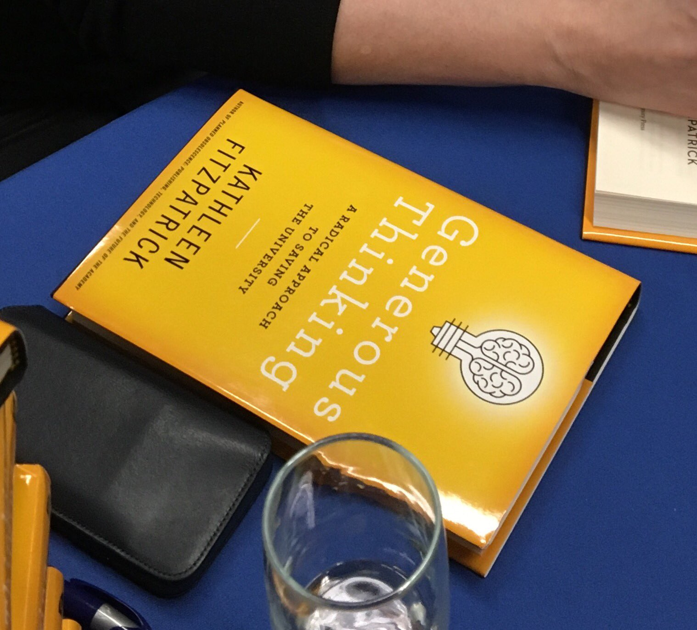
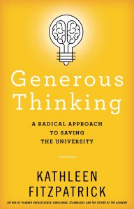
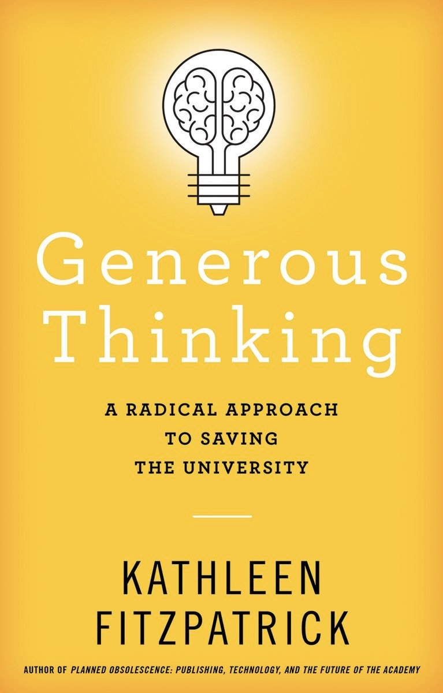
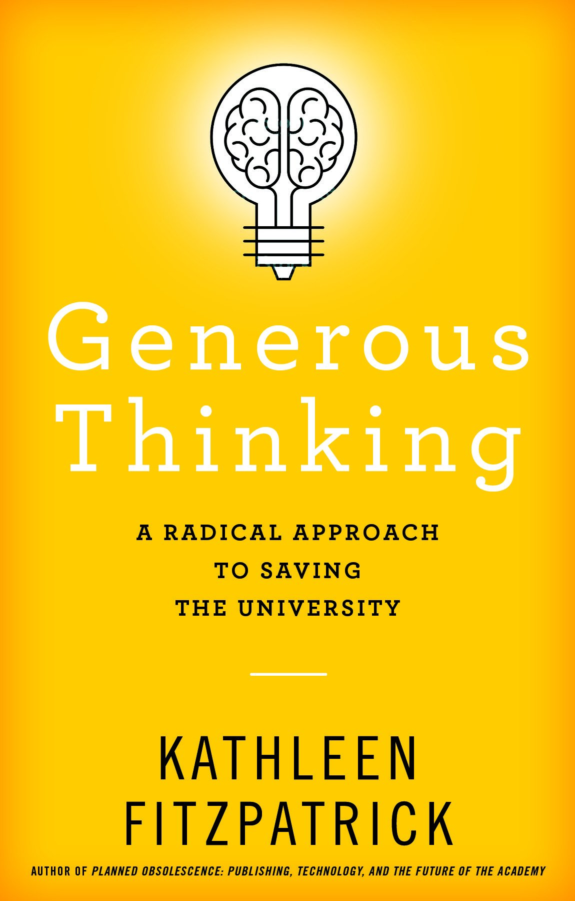
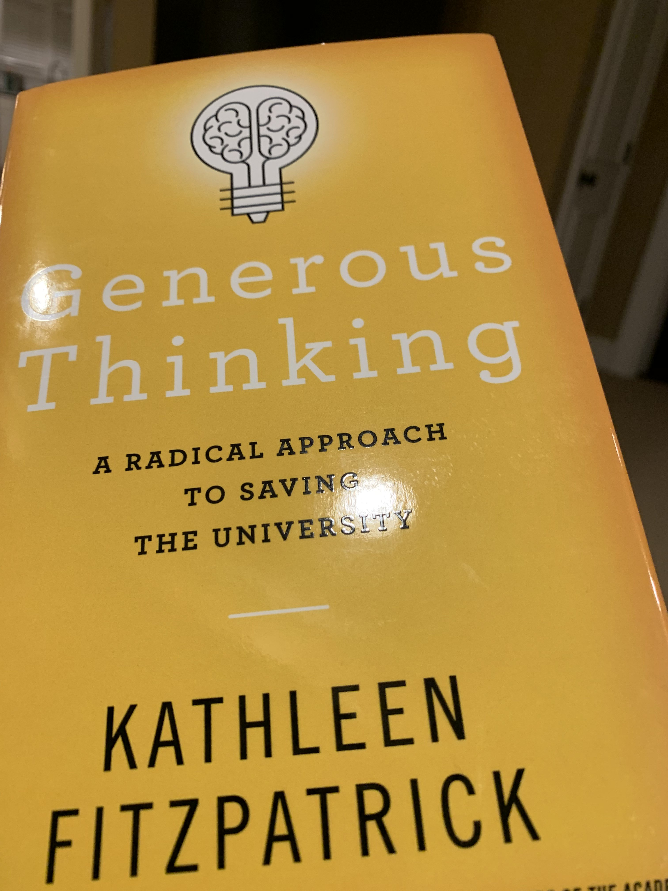

> It’s not just a matter of getting to leave the house and go back to the office today; this day deserves a 👍 on multiple levels\.

 [Fri Feb 01 23:20:58 +0000 2019](https://twitter.com/kfitz/status/1091476532479098882)

----

Replying to [@kfitz](https://twitter.com/kfitz/status/1091476532479098882)

> NB: I am currently about 6 hours behind in my timeline, and so undoubtedly shitty things have happened that I just don’t yet know about\. Let me enjoy my bubble a little longer\. Thx\.

 [Fri Feb 01 23:21:58 +0000 2019](https://twitter.com/kfitz/status/1091476781729792000)

----

Replying to [@sharonmleon](https://twitter.com/sharonmleon/status/1091477200510029825)

> Wait, what was that fourth sentence? SAY IT AGAIN\. https://media\.giphy\.com/media/xUOxf1hL6XOXGRbbuo/giphy\.gif

 [Fri Feb 01 23:29:10 +0000 2019](https://twitter.com/kfitz/status/1091478593631338496)

----

Replying to [@sharonmleon](https://twitter.com/sharonmleon/status/1091478916068503553)

> PS: I love that after the last few days 18F is sufficient to meet our mutual definition of “warm\.”

 [Fri Feb 01 23:35:11 +0000 2019](https://twitter.com/kfitz/status/1091480108391690240)

----

> So\. Many\. Books\. That have come out in the last few months, and that I am dying to read\. I need a month to spend on my sofa, in which there are no meetings and this website ceases functioning\.

 [Sat Feb 02 00:21:35 +0000 2019](https://twitter.com/kfitz/status/1091491788400050182)

----

> RT @mkirschenbaum: Just gonna leave this here\. 
> 
> 

 [Sun Feb 03 22:00:32 +0000 2019](https://twitter.com/kfitz/status/1092181065035329541)

----

> There’s one week and one day to go before Generous Thinking ships\.  
> I\. Am\. Excite\. https://jhupbooks\.press\.jhu\.edu/title/generous\-thinking 
> 
> 

 [Mon Feb 04 21:05:21 +0000 2019](https://twitter.com/kfitz/status/1092529565057073152)

----

Replying to [@researchremix and @juancommander](https://twitter.com/researchremix/status/1092539149821698048)

> Aw, rats\! I’ll hope for another opportunity, too\.

 [Mon Feb 04 21:45:57 +0000 2019](https://twitter.com/kfitz/status/1092539783585374213)

----

> On my way to Vancouver to give the Munro Lecture at Simon Fraser U this evening, on Generous Thinking\. http://www\.sfu\.ca/publicsquare/upcoming\-events/munro\-lecture\-kathleen\-fitzpatrick\.html 
> 
> 

 [Wed Feb 06 15:54:29 +0000 2019](https://twitter.com/kfitz/status/1093176108659367936)

----

Replying to [@MGisu82](https://twitter.com/MGisu82/status/1093176733639921664)

> Thank you\!

 [Wed Feb 06 15:59:31 +0000 2019](https://twitter.com/kfitz/status/1093177376857440256)

----

Replying to [@KennethTD1](https://twitter.com/KennethTD1/status/1093177866001567744)

> They are recording it and have said they should have it posted in about a week\.

 [Wed Feb 06 16:08:00 +0000 2019](https://twitter.com/kfitz/status/1093179510424399872)

----

> Enormous thanks to @SFUPublicSquare and @juancommander for putting together such an energizing conversation around \#GenerousThinking last night\!

 [Thu Feb 07 17:26:48 +0000 2019](https://twitter.com/kfitz/status/1093561730288893953)

----

> RT @hkpmcgregor: I spent today binge\-reading \#GenerousThinking and then seeing @kfitz speak about it and then joining her for dinner to tal…

 [Thu Feb 07 17:27:09 +0000 2019](https://twitter.com/kfitz/status/1093561817819897856)

----

> Hey, it appears that the Canadians have a jump on everyone — http://amazon\.ca is already shipping \#GenerousThinking\! \(I hope y’all will consider using your head start to leave a review there\.\) https://twitter\.com/juancommander/status/1093563609551036420

 [Thu Feb 07 17:39:18 +0000 2019](https://twitter.com/kfitz/status/1093564876650209281)

----

> RT @sharonmleon: Rest well, sir\. https://twitter\.com/detroitnews/status/1093691622146097153

 [Fri Feb 08 03:16:12 +0000 2019](https://twitter.com/kfitz/status/1093710058863513602)

----

> RT @freep: Tonight, we say goodbye to the Dean\.  
>   
> RIP, John Dingell\. 
> 
> 

 [Fri Feb 08 03:21:12 +0000 2019](https://twitter.com/kfitz/status/1093711317175681025)

----

> RT @JohnDingell: Buddy, I think you might want to sit this one out\. https://twitter\.com/realDonaldTrump/status/1091864144071020544

 [Fri Feb 08 03:21:54 +0000 2019](https://twitter.com/kfitz/status/1093711492925448193)

----

Replying to [@nowviskie, @CLIRDLF, @jmulibraries and @EnglishJMU](https://twitter.com/nowviskie/status/1093985544693039104)

> Enormous, enormous congratulations, B\! And good on JMU\. I’ll be delighted to see wonderful things unfold\.

 [Fri Feb 08 21:49:02 +0000 2019](https://twitter.com/kfitz/status/1093990110360551427)

----

> Byron\!\!\! https://twitter\.com/michalmigurski/status/1094674019159203840

 [Sun Feb 10 20:08:47 +0000 2019](https://twitter.com/kfitz/status/1094689658661937152)

----

Replying to [@eetempleton](https://twitter.com/eetempleton/status/1094937769988767744)

> Huge congratulations, Erin, and so well\-deserved\!

 [Mon Feb 11 13:52:49 +0000 2019](https://twitter.com/kfitz/status/1094957432466534400)

----

> It’s launch week for Generous Thinking\! The book’s official ship date is tomorrow, and I’ve got several fun things in the pipeline to accompany it\.  
> Everything except a book party\. I forgot to throw myself one\. Oops\. https://amzn\.to/2TNeQLa

 [Mon Feb 11 16:50:38 +0000 2019](https://twitter.com/kfitz/status/1095002181462343680)

----

Replying to [@ervinmalakaj, @SFU and @JHUPress](https://twitter.com/ervinmalakaj/status/1095017105605316609)

> Thank you so much\! It was great getting to visit @SFU and hear about the amazing community\-centered work happening there\.

 [Mon Feb 11 17:52:56 +0000 2019](https://twitter.com/kfitz/status/1095017858806022144)

----

Replying to [@alison\_mudditt](https://twitter.com/alison_mudditt/status/1095060816125022208)

> Thanks, Alison\!

 [Mon Feb 11 20:48:46 +0000 2019](https://twitter.com/kfitz/status/1095062106402107394)

----

> My students and I were discussing @robinsloan’s Mr\. Penumbra’s 24\-Hour Bookstore today, and one of them suddenly said “hey you’re famous\!” She’d found @rgay’s review, in which she cited my first book\. I gratefully accept that bit of doubly reflected glory\. https://www\.nytimes\.com/2012/12/16/books/review/mr\-penumbras\-24\-hour\-bookstore\-by\-robin\-sloan\.html

 [Mon Feb 11 23:31:46 +0000 2019](https://twitter.com/kfitz/status/1095103129031532545)

----

Replying to [@tcarmody, @rgay and @robinsloan](https://twitter.com/tcarmody/status/1095105143484370945)

> No\. Way\.

 [Mon Feb 11 23:41:05 +0000 2019](https://twitter.com/kfitz/status/1095105472607277056)

----

Replying to [@tcarmody, @bookoisseur, @rgay and @robinsloan](https://twitter.com/tcarmody/status/1095107820142448640)

> Dang\.

 [Mon Feb 11 23:51:41 +0000 2019](https://twitter.com/kfitz/status/1095108138691366912)

----

Replying to [@blythe\_white](https://twitter.com/blythe_white/status/1095105478651232257)

> I’ll have to see if I can pull something together\!

 [Tue Feb 12 00:05:05 +0000 2019](https://twitter.com/kfitz/status/1095111511431880706)

----

Replying to [@wynkenhimself and @tcarmody](https://twitter.com/wynkenhimself/status/1095154711727140865)

> What @wynkenhimself said\. I’m so sorry you’re dealing with all of this\.

 [Tue Feb 12 03:00:14 +0000 2019](https://twitter.com/kfitz/status/1095155591478153218)

----

> Hooray\! It’s shipping\! \(And reviewing at Amazon should be open now; thanks to those of you who tried before\.\) \#GenerousThinking https://amzn\.to/2TNeQLa 
> 
> 

 [Tue Feb 12 16:11:18 +0000 2019](https://twitter.com/kfitz/status/1095354671290613761)

----

> RT @JHUPress: Now available from Johns Hopkins University Press, "Generous Thinking: A Radical Approach to Saving the University," by Kathl…

 [Tue Feb 12 17:16:03 +0000 2019](https://twitter.com/kfitz/status/1095370965943492609)

----

> RT @OxfordPublicity: And you can preorder this @JHUPress @kfitz new book in Europe @AmazonUK https://www\.amazon\.co\.uk/Generous\-Thinking\-Radical\-Approach\-University/dp/1421429462/ref\=sr\_1\_1?ie\=UTF8&qid\=1549992888&sr\=8\-1&keywords\=generous\+thinking \#highered \#highereduca…

 [Tue Feb 12 17:39:45 +0000 2019](https://twitter.com/kfitz/status/1095376929941872642)

----

Replying to [@stephharves](https://twitter.com/stephharves/status/1095457123662733314)

> Thank you\! I’m only sorry not to be celebrating with you\! ❤️🥂

 [Tue Feb 12 23:05:20 +0000 2019](https://twitter.com/kfitz/status/1095458865800454144)

----

> RT @aoife\_macnamara: @SFUResearch, @FCATatSFU, if you read one book about \#HigherEducation this year, make it \#GenerousThinking\! https://t\.…

 [Tue Feb 12 23:28:17 +0000 2019](https://twitter.com/kfitz/status/1095464638924378112)

----

Replying to [@bbargerstock](https://twitter.com/bbargerstock/status/1095468184445087745)

> Hooray\!

 [Wed Feb 13 00:41:28 +0000 2019](https://twitter.com/kfitz/status/1095483054850748416)

----

> RT @bbargerstock: @kfitz Mine arrived\! 
> 
> 

 [Wed Feb 13 00:41:33 +0000 2019](https://twitter.com/kfitz/status/1095483079840415744)

----

Replying to [@ranti](https://twitter.com/ranti/status/1095488564853436416)

> Yay\!

 [Wed Feb 13 01:07:29 +0000 2019](https://twitter.com/kfitz/status/1095489604629790720)

----

> Okay, y’all are the nicest\. &lt;3 https://twitter\.com/aoife\_macnamara/status/1095481285059833857

 [Wed Feb 13 01:10:46 +0000 2019](https://twitter.com/kfitz/status/1095490428772716546)

----

> RT @cplong: Today's release of @kfitz's "Generous Thinking" falls on Founders Day @michiganstateu\. The book ends with a candid reflection o…

 [Wed Feb 13 11:35:17 +0000 2019](https://twitter.com/kfitz/status/1095647596956262407)

----

> Paging @BerondaM\! https://twitter\.com/DumbartonOaks/status/1095434960268419072

 [Wed Feb 13 15:30:58 +0000 2019](https://twitter.com/kfitz/status/1095706905350193152)

----

Replying to [@CJ\_Daugherty](https://twitter.com/CJ_Daugherty/status/1095794511358373895)

> So glad to know you’re on this side\! So sorry to know you’re not coming to Michigan\. \(So glad to know you’re a lot warmer than we are\!\)

 [Wed Feb 13 22:12:21 +0000 2019](https://twitter.com/kfitz/status/1095807917780070401)

----

> RT @CALMSU: \#MSU Director of Digital Humanities and Professor of @MSUEnglish Kathleen Fitzpatrick \(@kfitz\) discusses how digital humanities…

 [Wed Feb 13 22:18:33 +0000 2019](https://twitter.com/kfitz/status/1095809478992281601)

----

> I am honored that my colleagues in the College of Arts &amp; Letters asked me about DH and its role in orienting the university toward the public good\.  
> https://twitter\.com/CALMSU/status/1095808171799650304

 [Wed Feb 13 22:31:07 +0000 2019](https://twitter.com/kfitz/status/1095812639752683521)

----

Replying to [@CJ\_Daugherty](https://twitter.com/CJ_Daugherty/status/1095813948903960576)

> Our version of that was \-10 one day and 45 two days later\. Honestly, it’s a wonder we don’t all have pneumonia\.

 [Wed Feb 13 22:38:04 +0000 2019](https://twitter.com/kfitz/status/1095814388982927360)

----

> Behind the Will https://kfitz\.info/behind\-the\-will/

 [Wed Feb 13 22:50:54 +0000 2019](https://twitter.com/kfitz/status/1095817620467662854)

----

Replying to [@CJ\_Daugherty](https://twitter.com/CJ_Daugherty/status/1095833145566523394)

> At the moment, it feels like it it never not winter\.

 [Thu Feb 14 00:21:10 +0000 2019](https://twitter.com/kfitz/status/1095840337371844614)

----

> RT @JulianChambliss: I’m grateful to @HilaryGreen77 for coming to @michiganstateu and sharing her \#innovative \#dh work with our students an…

 [Thu Feb 14 12:30:51 +0000 2019](https://twitter.com/kfitz/status/1096023965397585925)

----

> RT @PaulaKrebs: A shoutout to @humcommons  in this session on the value or preprint servers here at \#NFAIS2019 Sharing your work on the Com…

 [Thu Feb 14 15:22:54 +0000 2019](https://twitter.com/kfitz/status/1096067262598053889)

----

> RT @juancommander: @kfitz came to @SFU to talk about the Power of \#GenerousThinking last week\. Read about it and listen to the talk\.\.\. but…

 [Thu Feb 14 22:33:52 +0000 2019](https://twitter.com/kfitz/status/1096175722043822080)

----

> RT @kmapesy: The Program for MSU Global DH Symposium is UP \(incl abstracts\)\! check out who is going to join us this year\! https://t\.co/EEcR…

 [Fri Feb 15 00:26:45 +0000 2019](https://twitter.com/kfitz/status/1096204127883821058)

----

> RT @grabill: Here we go @kfitz 
> 
> 

 [Fri Feb 15 03:36:51 +0000 2019](https://twitter.com/kfitz/status/1096251970782781441)

----

> Cool post\-doc opportunity\! https://twitter\.com/pittDHRX/status/1096456183467180033

 [Fri Feb 15 20:46:13 +0000 2019](https://twitter.com/kfitz/status/1096511018509885442)

----

> Beginning the trip home after a fabulous visit to @BYUHumanities\. Thanks to @briancroxall @matt\_wickman  and their many colleagues who took the time to read and talk with me about \#GenerousThinking\!

 [Sat Feb 16 13:31:09 +0000 2019](https://twitter.com/kfitz/status/1096763917961818113)

----

> \(Not incidentally, @BYUHumanities friends, @briancroxall joked about reviewing \#GenerousThinking on Amazon\. I’d be grateful if you did\!\)

 [Sat Feb 16 19:58:57 +0000 2019](https://twitter.com/kfitz/status/1096861511392391168)

----

> RT @SNawyn: Hats off to everyone who worked on this, especially @cplong and current director Glenn Chambers Jr\. https://twitter\.com/wiisaakode/status/1096428633751801856

 [Sat Feb 16 20:56:07 +0000 2019](https://twitter.com/kfitz/status/1096875897460793346)

----

> RT @CALMSU: In the latest episode of the LAE podcast, Dean @cplong discusses generous thinking in higher education and her new novel with D…

 [Sun Feb 17 14:53:16 +0000 2019](https://twitter.com/kfitz/status/1097146970622361600)

----

> One more fun thing for \#GenerousThinking release week\. Thanks to @cplong and the rest of the LAE team for inviting on\! https://twitter\.com/CALMSU/status/1097135288592273410

 [Sun Feb 17 14:54:52 +0000 2019](https://twitter.com/kfitz/status/1097147374676381696)

----

> My dean Chris Long recently invited me to talk about Generous Thinking with him on his podcast, the Liberal Arts Endeavor\. It was a great discussion, and I’m grateful to have had the opportunity\.  
>   
> In the latest episode of the LAE podcast, Dean @cplong \.\.\. https://kfitz\.info/17\-february\-2019\-1006/

 [Sun Feb 17 15:06:43 +0000 2019](https://twitter.com/kfitz/status/1097150353869545473)

----

> I owe that connection to @LibSkrat and @bfister\! https://twitter\.com/quinnanya/status/1097209742374580224

 [Sun Feb 17 19:49:52 +0000 2019](https://twitter.com/kfitz/status/1097221613291032577)

----

> More on GT: Comments Reopened https://kfitz\.info/more\-on\-gt\-comments\-reopened/

 [Sun Feb 17 21:42:36 +0000 2019](https://twitter.com/kfitz/status/1097249984997703681)

----

> This morning, some background on listening as a practice of generous thinking\. https://kfitz\.info/listening\-as\-generous\-thinking/

 [Mon Feb 18 14:00:55 +0000 2019](https://twitter.com/kfitz/status/1097496185370234881)

----

> RT @JHUPress: The latest episode of the Liberal Arts Endeavor podcast from @michiganstateu features an interview with author Kathleen Fitzp…

 [Mon Feb 18 22:33:12 +0000 2019](https://twitter.com/kfitz/status/1097625104408866821)

----

> RT @CALMSU: \.\#MSU Board of Trustees voted to establish a Department of African American and African Studies, which will be part of \#MSUCAL…

 [Tue Feb 19 01:24:52 +0000 2019](https://twitter.com/kfitz/status/1097668306352422917)

----

Replying to [@dan\_rudmann](https://twitter.com/dan_rudmann/status/1097687047547088896)

> Thank you\!

 [Tue Feb 19 10:57:21 +0000 2019](https://twitter.com/kfitz/status/1097812375376461824)

----

Replying to [@booksquirmed](https://twitter.com/rex_nielson/status/1097746133781118977)

> Thank you\! It was great to get the chance to talk with you\.

 [Tue Feb 19 10:58:27 +0000 2019](https://twitter.com/kfitz/status/1097812651965669377)

----

Replying to [@martin\_eve](https://twitter.com/martin_eve/status/1097754375659970560)

> Sending all good wishes, Martin\!

 [Tue Feb 19 12:04:32 +0000 2019](https://twitter.com/kfitz/status/1097829282380947457)

----

> RT @cplong: As I reflect on how to cultivate what @kfitz calls a “listening presence,” this thoughtful post by @sfritzsc is enormously help…

 [Tue Feb 19 13:10:06 +0000 2019](https://twitter.com/kfitz/status/1097845782831611904)

----

> Thank you for this, and for reading\! https://t\.co/hpYoCz6Y3Z

 [Tue Feb 19 13:10:53 +0000 2019](https://twitter.com/kfitz/status/1097845982455386114)

----

> THIS is the public good\. https://twitter\.com/martin\_eve/status/1097852452395761664

 [Tue Feb 19 14:57:51 +0000 2019](https://twitter.com/kfitz/status/1097872898285543425)

----

Replying to [@colindickey](https://twitter.com/colindickey/status/1097893332917895168)

> Aw man\. I miss that voice\! I listened to a LOT of Word Jazz back in the day\.

 [Tue Feb 19 20:22:11 +0000 2019](https://twitter.com/kfitz/status/1097954520750059522)

----

Replying to [@eetempleton](https://twitter.com/eetempleton/status/1097946307036147712)

> Huge, huge congratulations\! I am so excited for you — and even more excited for Converse\!

 [Tue Feb 19 23:02:44 +0000 2019](https://twitter.com/kfitz/status/1097994923054415872)

----

> This is awesome\. https://twitter\.com/quinnanya/status/1098013458413477888

 [Wed Feb 20 00:18:19 +0000 2019](https://twitter.com/kfitz/status/1098013947582730241)

----

Replying to [@katiefitzpat](https://twitter.com/katiefitzpat/status/1098000175727968257)

> Hey, congratulations\! That’s excellent news\.

 [Wed Feb 20 01:06:49 +0000 2019](https://twitter.com/kfitz/status/1098026151707066370)

----

> 👋🏻 https://twitter\.com/mchris4duke/status/1098200642651373568

 [Wed Feb 20 12:45:30 +0000 2019](https://twitter.com/kfitz/status/1098201979439009792)

----

Replying to [@billhd, @insidehighered and @CALMSU](https://twitter.com/billhd/status/1098202923866173440)

> Hey, thanks\!

 [Wed Feb 20 12:51:26 +0000 2019](https://twitter.com/kfitz/status/1098203472011448321)

----

Replying to [@mchris4duke](https://twitter.com/mchris4duke/status/1098202829834063872)

> I’m really glad to have it out there, too\.

 [Wed Feb 20 12:51:40 +0000 2019](https://twitter.com/kfitz/status/1098203532447174657)

----

> Scott Jaschik asked me some great questions about Generous Thinking, and I was happy to answer\. https://www\.insidehighered\.com/news/2019/02/20/author\-discusses\-new\-book\-how\-promote\-generous\-thinking\-higher\-education

 [Wed Feb 20 13:15:43 +0000 2019](https://twitter.com/kfitz/status/1098209584475529216)

----

> Step 1: Have the best editor ever\. https://twitter\.com/gmbritton/status/1098215453355401216

 [Wed Feb 20 13:41:53 +0000 2019](https://twitter.com/kfitz/status/1098216171889934336)

----

> It makes me happy every time I see a picture of that gorgeous cover\. https://twitter\.com/CALMSU/status/1098239445797666816

 [Wed Feb 20 15:15:41 +0000 2019](https://twitter.com/kfitz/status/1098239776443035649)

----

> RT @gmbritton: Generous Thinking by @kfitz may be the antidote to our times https://ihenow\.com/2DWrgJF 
> 
> 

 [Wed Feb 20 17:09:35 +0000 2019](https://twitter.com/kfitz/status/1098268438546530304)

----

> RT @humcommons: In March, we will be hosting \#HCGroupsMonth, which will feature challenges and advice to encourage our users to take advant…

 [Wed Feb 20 17:25:58 +0000 2019](https://twitter.com/kfitz/status/1098272560922411011)

----

> RT @K\_Leonard\_PhD: @humcommons HC groups replaced horribly outdated email listservs for two scholarly orgs I belong to\-\-it's made a huge di…

 [Wed Feb 20 17:43:51 +0000 2019](https://twitter.com/kfitz/status/1098277063167860736)

----

> Never let it be said that digitally\-savvy scholars are above the “please remove me from this list” message sent to the list\. 🤦🏻‍♀️

 [Thu Feb 21 15:20:00 +0000 2019](https://twitter.com/kfitz/status/1098603248783712258)

----

> ❤️❤️❤️ https://twitter\.com/bibliorogue/status/1098640749531295744

 [Thu Feb 21 17:56:08 +0000 2019](https://twitter.com/kfitz/status/1098642541988245504)

----

> Can’t wait\! https://twitter\.com/mchris4duke/status/1098682420474335235

 [Thu Feb 21 20:37:15 +0000 2019](https://twitter.com/kfitz/status/1098683086877925378)

----

Replying to [@mchris4duke](https://twitter.com/mchris4duke/status/1098682420474335235)

> I’m so glad you’ll be there\!

 [Thu Feb 21 20:37:24 +0000 2019](https://twitter.com/kfitz/status/1098683127889870848)

----

> RT @achdotorg: Hey, @achdotorg members: The voting period for electing 3 new members to the ACH Exec Council has started\. Candidate stateme…

 [Thu Feb 21 20:54:59 +0000 2019](https://twitter.com/kfitz/status/1098687550292664321)

----

> RT @SFUPublicSquare: Did you miss @kfitz's lecture on \#GenerousThinking at this year's Munro Lecture? You can now watch it online\! If you'r…

 [Fri Feb 22 00:47:33 +0000 2019](https://twitter.com/kfitz/status/1098746078474719232)

----

Replying to [@Leonardo\_UPRM](https://twitter.com/I_love_epoetry/status/1098885202816966656)

> Isn't it pretty to think so?

 [Fri Feb 22 12:56:26 +0000 2019](https://twitter.com/kfitz/status/1098929508613320704)

----

Replying to [@Leonardo\_UPRM](https://twitter.com/I_love_epoetry/status/1098971089961652226)

> Ha\! :\)

 [Fri Feb 22 15:49:59 +0000 2019](https://twitter.com/kfitz/status/1098973181900214272)

----

> One in a series\* of periodic reminders to all the lovely folks who are saying such nice things about \#GenerousThinking: if you were inclined to say a sentence or two about it on Amazon, it would be an enormous help\! https://amzn\.to/2EqdPmR  
>   
> \*A limited series, I promise\.

 [Fri Feb 22 15:59:19 +0000 2019](https://twitter.com/kfitz/status/1098975532513927168)

----

Replying to [@CLIRDLF and @kshkim](https://twitter.com/CLIRDLF/status/1098980736676196352)

> Congratulations and thanks, @kshkim\! I can’t wait to see what you do next\.

 [Fri Feb 22 16:31:52 +0000 2019](https://twitter.com/kfitz/status/1098983724291624960)

----

Replying to [@CathyNDavidson, @HASTACscholars, @cnewf, @saragoldrickrab, @GC\_CUNY and @stevebrier](https://twitter.com/CathyNDavidson/status/1099053379223982082)

> That is amazing\! The primary policy change I’d argue for is aligning the university’s reward structures with its public mission\. Top to bottom\. If we’re not internally rewarding public service, we cannot be shocked when we fail at it\.

 [Fri Feb 22 21:12:40 +0000 2019](https://twitter.com/kfitz/status/1099054391116644355)

----

> RT @CathyNDavidson: @HASTACscholars @cnewf @kfitz @saragoldrickrab @GC\_CUNY Your ears should have been burning @kfitz   @stevebrier said th…

 [Fri Feb 22 21:13:00 +0000 2019](https://twitter.com/kfitz/status/1099054471403978752)

----

> The change I’d make? Aligning the university’s reward structures with its public mission\. Top to bottom\. If we’re not internally rewarding public service, we cannot be shocked when we fail at it\. https://twitter\.com/CathyNDavidson/status/1099053379223982082

 [Fri Feb 22 21:16:03 +0000 2019](https://twitter.com/kfitz/status/1099055241750855685)

----

Replying to [@CathyNDavidson](https://twitter.com/CathyNDavidson/status/1099058207086034945)

> A really good point\. And I like allowing for variability over the course of a career\. @cplong is working on some similar possibilities here at @CALMSU, including review processes that are fundamentally formative\.

 [Fri Feb 22 21:30:51 +0000 2019](https://twitter.com/kfitz/status/1099058966636740608)

----

> RT @musiclibassoc: Open Access \= More Use\.   
> 24 \#muslib2018 programs have 1700\+ downloads from the MLA @humcommons repository \(so deposit &amp;…

 [Sun Feb 24 19:46:21 +0000 2019](https://twitter.com/kfitz/status/1099757444685799430)

----

> RT @CMejeur: New @humcommons blog post is up about the \#OPReview Twitter chat on scholarly communication and open peer review @kfitz and I…

 [Sun Feb 24 19:52:28 +0000 2019](https://twitter.com/kfitz/status/1099758981956931585)

----

Replying to [@edrabinski, @GC\_CUNY and @CunySLU](https://twitter.com/edrabinski/status/1100054759392841729)

> Huge congratulations\! And good for @GC\_CUNY\!

 [Mon Feb 25 18:50:06 +0000 2019](https://twitter.com/kfitz/status/1100105676460867584)

----

> RT @LangForCareers: Yes, yes\!\!\!    "Generous thinking" in higher education, imagine how it could transform education and the world of acade…

 [Tue Feb 26 13:27:25 +0000 2019](https://twitter.com/kfitz/status/1100386858415124482)

----

> RT @humcommons: Did you get a chance to check out or participate in our \#OPReview Twitter chat last month, hosted by our very own @kfitz &amp;…

 [Tue Feb 26 17:04:20 +0000 2019](https://twitter.com/kfitz/status/1100441445054513158)

----

> I’m happy to stand for the productive potential of failure, as well as of admitting to one’s anxieties in ways that might help others work through them too\. \#GenerousThinking https://twitter\.com/quinnanya/status/1100433250059673600

 [Tue Feb 26 17:06:49 +0000 2019](https://twitter.com/kfitz/status/1100442072526606336)

----

> I’m grateful to have gotten to have such a good conversation with Scott Carlson of the Chronicle of Higher Education\.  
>   
> "We are in a higher\-education system governed by competition from top to bottom\.  And because we're constantly in this competition \.\.\. https://kfitz\.info/26\-february\-2019\-1329/

 [Tue Feb 26 18:33:03 +0000 2019](https://twitter.com/kfitz/status/1100463771993161735)

----

> RT @Carlsonics: "We are in a higher\-education system governed by competition from top to bottom\.  And because we're constantly in this comp…

 [Tue Feb 26 18:34:34 +0000 2019](https://twitter.com/kfitz/status/1100464152823455749)

----

> RT @Carlsonics: A reader from @UMNews on @kfitz column @chronicle: "So true, yet, I fear, it will never happen\. We have become so enmeshed…

 [Tue Feb 26 18:34:40 +0000 2019](https://twitter.com/kfitz/status/1100464176957407235)

----

> RT @gmbritton: What if universities aligned their reward system with their mission? Ask @kfitz https://jhupbooks\.press\.jhu\.edu/title/generous\-thinking  https://t\.co/AvIBoX…

 [Tue Feb 26 21:02:41 +0000 2019](https://twitter.com/kfitz/status/1100501427191984130)

----

> RT @CorpseScholar: A great interview w @kfitz @CALMSU on fostering \#humanity in \#academia \#begenerous https://twitter\.com/chronicle/status/1100742458147774471

 [Wed Feb 27 14:29:20 +0000 2019](https://twitter.com/kfitz/status/1100764826215813121)

----

> RT @andydriska: @Carlsonics @kfitz @chronicle Great piece\. Are faculty encouraged to push original, creative ideas through research, rather…

 [Wed Feb 27 14:29:36 +0000 2019](https://twitter.com/kfitz/status/1100764892561395712)

----

> RT @andydriska: @Carlsonics @kfitz @chronicle I've been thinking lately that faculty should focus less on trying to make the next big innov…

 [Wed Feb 27 14:29:50 +0000 2019](https://twitter.com/kfitz/status/1100764952292442112)

----

> RT @mroth78: Read @kfitz on need to go beyond critical thinking to embrace generosity &amp; public mission of \#highered  “our critical\-thinking…

 [Wed Feb 27 14:30:48 +0000 2019](https://twitter.com/kfitz/status/1100765197428555776)

----

> RT @gmbritton: MLA Gets Practical: Less Theory, More Profession https://www\.chronicle\.com/article/The\-MLA\-Gets\-Practical\-Less/245768/\#\.XHaj3I4d\_gw\.twitter via @chronicle with a shoutout to \#GenerousThinking…

 [Wed Feb 27 14:55:59 +0000 2019](https://twitter.com/kfitz/status/1100771534422097922)

----

> Absolutely\. \#GenerousThinking https://twitter\.com/Ahighervision/status/1100456303246360576

 [Wed Feb 27 15:35:50 +0000 2019](https://twitter.com/kfitz/status/1100781562440925184)

----

> RT @Carlsonics: Key passage re "Generous Thinking" and @kfitz: "Given the demand, why aren't colleges everywhere putting more students on t…

 [Wed Feb 27 16:04:55 +0000 2019](https://twitter.com/kfitz/status/1100788880884879361)

----

> RT @cni\_org: Delighted to announce plenary speakers for the April CNI meeting: Kathleen Fitzpatrick of @michiganstateu and Michael Nelson o…

 [Wed Feb 27 16:06:25 +0000 2019](https://twitter.com/kfitz/status/1100789257361338369)

----

> RT @BerondaM: Great talk by @schopie1 on digitial presence &amp; public scholarship/engagement @ASACMSU Forum\. Introduction to @kfitz's Generou…

 [Wed Feb 27 20:42:01 +0000 2019](https://twitter.com/kfitz/status/1100858616498786304)

----

Replying to [@sbaycheng and @YorkuAMPD](https://twitter.com/sbaycheng/status/1100804610770513921)

> Congratulations, Sarah\!

 [Wed Feb 27 21:18:07 +0000 2019](https://twitter.com/kfitz/status/1100867701461917696)

----

> RT @BerondaM: Insights into Digital Humanities at MSU offered by @kfitz at 'Conversation with Acting President' for leaders\. Awesome DH wor…

 [Thu Feb 28 15:18:10 +0000 2019](https://twitter.com/kfitz/status/1101139505044705282)

----

> RT @jsalem75: It was great to see @kfitz discussing \#digitalhumanities at the Conversation with @michiganstateu President Udpa this morning…

 [Thu Feb 28 17:04:30 +0000 2019](https://twitter.com/kfitz/status/1101166262716166147)

----

Replying to [@kfitz](https://twitter.com/jsalem75/status/1101163233489100800)

> These collaborations with @msulibs are key to the future of DH@MSU — we’re thrilled to have such great collaborators in @jsalem75 and the amazing Libraries team\. Cc @cplong @schopie1 @kmapesy https://twitter\.com/jsalem75/status/1101163233489100800

 [Thu Feb 28 17:07:23 +0000 2019](https://twitter.com/kfitz/status/1101166989492568065)

----

> New ranting from your truly: Scholars, It’s Time to Take Control of Your Online Communities\. https://kfitz\.info/scholars\-its\-time\-to\-take\-control\-of\-your\-online\-communities/

 [Thu Feb 28 18:09:50 +0000 2019](https://twitter.com/kfitz/status/1101182703838416896)

----

> RT @CMejeur: New blog by @kfitz is now up on the @humcommons blog\. Are you frustrated with having to use corporate platforms and compromise…

 [Thu Feb 28 18:26:22 +0000 2019](https://twitter.com/kfitz/status/1101186867758882817)

----

Replying to [@dan\_rudmann and @humcommons](https://twitter.com/dan_rudmann/status/1101197223734530048)

> Absolutely\. I’ve been pondering the relationship between more individually\-controlled, decentered spaces for online academic discourse and spaces that maintain a bit of centralization but provide scholars with control over their data and a voice in the platform’s development\.

 [Thu Feb 28 19:30:34 +0000 2019](https://twitter.com/kfitz/status/1101203020501659648)

----

Replying to [@dan\_rudmann and @humcommons](https://twitter.com/dan_rudmann/status/1101197223734530048)

> And I’m not sure I have a full answer as yet, but I do think there’s something in those connections that bears experimentation\!

 [Thu Feb 28 19:31:00 +0000 2019](https://twitter.com/kfitz/status/1101203132166606850)

----

> You go, @UofCalifornia\.  🙌 https://twitter\.com/UC\_Newsroom/status/1101185521961832448

 [Thu Feb 28 20:35:49 +0000 2019](https://twitter.com/kfitz/status/1101219441302487040)

----

> RT @dancohen: “Kathleen Fitzpatrick’s Generous Thinking” — my review of @kfitz’s important new book on how the university should and must b…

 [Thu Feb 28 23:49:58 +0000 2019](https://twitter.com/kfitz/status/1101268300254846977)

----

Replying to [@dancohen](https://twitter.com/dancohen/status/1101244045349847040)

> Thank you, so, so much\!

 [Thu Feb 28 23:50:24 +0000 2019](https://twitter.com/kfitz/status/1101268411458437120)

----

Replying to [@BerondaM](https://twitter.com/BerondaM/status/1101273807191457792)

> You are the best\! I’m so glad we got a chance to sit down together today\.

 [Fri Mar 01 00:36:38 +0000 2019](https://twitter.com/kfitz/status/1101280047783178240)

----

> RT @CALMSU: \.@MeganNFontenot1, MA student in @msuenglish, published in @tordotcom's new series that dives deep into the characters of J\.R\.R…

 [Fri Mar 01 00:50:52 +0000 2019](https://twitter.com/kfitz/status/1101283626329825280)

----

> I have amazing colleagues\. &lt;3 https://twitter\.com/CALMSU/status/1101240596344303617

 [Fri Mar 01 01:39:32 +0000 2019](https://twitter.com/kfitz/status/1101295877723967490)