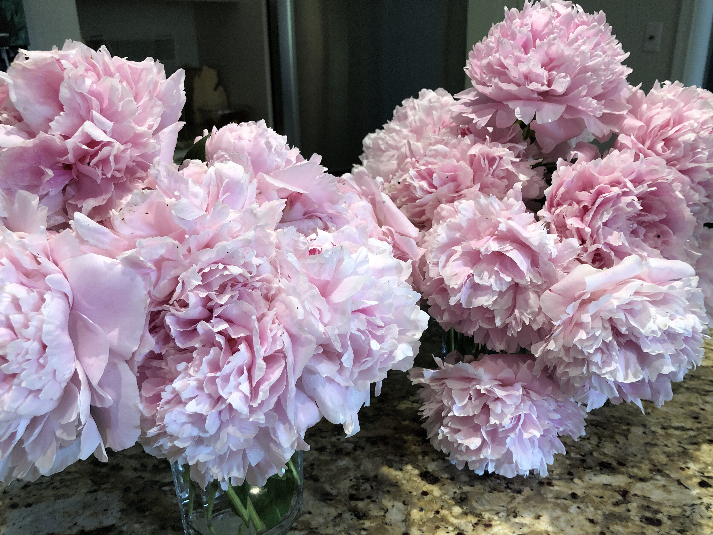

> I’ve just noticed that a whole pile of my iOS contacts — some of whom I’d had birthdays for, and some of whom I hadn’t — all now have January 1, 1601 recorded as their birthdates\. \(1\) Y’all are holding up well\! \(2\) ????

 [Sun Jun 02 15:49:11 +0000 2019](https://twitter.com/kfitz/status/1135211768316252161)

----

> Related: if I miss your birthday this year, I apologize\.

 [Sun Jun 02 15:49:47 +0000 2019](https://twitter.com/kfitz/status/1135211918015258627)

----

> Whoa\. So 40 of my contacts were born at the beginning of time\. https://twitter\.com/arungapatchka/status/1135237338202689536

 [Sun Jun 02 17:42:29 +0000 2019](https://twitter.com/kfitz/status/1135240279710208000)

----

> This is indeed infuriating\. And is part and parcel of the phenomenon I pointed to here: https://twitter\.com/kfitz/status/1131240712362758146 https://twitter\.com/melissa\_hubbard/status/1135161354367770624

 [Sun Jun 02 18:57:05 +0000 2019](https://twitter.com/kfitz/status/1135259056007012352)

----

Replying to [@kfitz](https://twitter.com/kfitz/status/1135259056007012352)

> It’s bait designed to keep us clicking by keeping us blaming one another for the mess we’re in\. It’s the opposite of helpful\. And we can only stop it if we refuse to play\.

 [Sun Jun 02 18:58:46 +0000 2019](https://twitter.com/kfitz/status/1135259479874973696)

----

Replying to [@jenneheise](https://twitter.com/jenneheise/status/1135268469824507905)

> Absolutely true\. And entirely to the point\. Every frame that understands us as in competition with one another fails to contend with the forces that are in fact demanding this agon from us\.

 [Sun Jun 02 19:57:05 +0000 2019](https://twitter.com/kfitz/status/1135274156520542215)

----

> Really looking forward to this\! https://twitter\.com/motolibrarian/status/1135615494071889922

 [Mon Jun 03 19:29:51 +0000 2019](https://twitter.com/kfitz/status/1135629690620841989)

----

> Friends\! Do you teach Introduction to Digital Media Studies \(or something like it\)? It’s been \(checks watch\) 9 years since the last time I taught it, and I suspect things may have changed a little… \+

 [Tue Jun 04 13:55:24 +0000 2019](https://twitter.com/kfitz/status/1135907911606124545)

----

Replying to [@kfitz](https://twitter.com/kfitz/status/1135907911606124545)

> I’d love to see your syllabi, if you’re willing to share\. I’ll of course post what I finally wind up with\.

 [Tue Jun 04 13:56:13 +0000 2019](https://twitter.com/kfitz/status/1135908114270699520)

----

> RT @marklargent: My latest Student Success blog post discusses new books by two MSU authors \- Brendan Cantwell \(with Barrett Taylor\) and Ka…

 [Tue Jun 04 14:21:12 +0000 2019](https://twitter.com/kfitz/status/1135914401796509696)

----

> RT @writeandrevise: Reading @kfitz's Generous Thinking and remembering talking with @ProfL12 about what public engagement looks like in lit…

 [Tue Jun 04 14:21:21 +0000 2019](https://twitter.com/kfitz/status/1135914439998181377)

----

Replying to [@Infoventurer and @CameronNeylon](https://twitter.com/Infoventurer/status/1135911589410877440)

> This sounds super interesting\. I’d love to see your syllabus if you’re willing to share\!

 [Tue Jun 04 14:22:45 +0000 2019](https://twitter.com/kfitz/status/1135914791552180224)

----

> Huge congratulations, @jamespolchin, and happy launch day\! https://twitter\.com/wordbobby/status/1135960200433807362

 [Tue Jun 04 18:13:16 +0000 2019](https://twitter.com/kfitz/status/1135972804548071424)

----

> RT @gmbritton: Bryan Alexander's Future Trends Forum with Kathleen Fitzpatrick, an interactive discussion on "Generous Thinking: A Radical…

 [Wed Jun 05 16:17:32 +0000 2019](https://twitter.com/kfitz/status/1136306064746401794)

----

Replying to [@kfitz](https://twitter.com/BryanAlexander/status/1136322174229327872)

> You are way too nice, @BryanAlexander; the honor is mine\! Looking forward to talking with you and with the \#FTTE community\. https://twitter\.com/BryanAlexander/status/1136322174229327872

 [Wed Jun 05 17:24:43 +0000 2019](https://twitter.com/kfitz/status/1136322974187835392)

----

> Wow, that is a fabulous list\. I’m honored to be included\! https://twitter\.com/amjenner/status/1136323143683829760

 [Wed Jun 05 17:28:27 +0000 2019](https://twitter.com/kfitz/status/1136323912877236225)

----

> Can’t wait\! https://twitter\.com/BryanAlexander/status/1136653501075992576

 [Thu Jun 06 15:22:47 +0000 2019](https://twitter.com/kfitz/status/1136654675577458688)

----

> RT @BryanAlexander: @kfitz @kfitz 's book is   
> Generous Thinking: A Radical Approach to Saving the University\.  Recently out from Johns Hopk…

 [Thu Jun 06 15:23:21 +0000 2019](https://twitter.com/kfitz/status/1136654817961447424)

----

Replying to [@kfitz](https://twitter.com/BryanAlexander/status/1136653501075992576)

> Just about to get started with the Future Trends Forum\. Looking forward to talking with the amazing @BryanAlexander\. https://twitter\.com/BryanAlexander/status/1136653501075992576

 [Thu Jun 06 17:57:40 +0000 2019](https://twitter.com/kfitz/status/1136693654016237568)

----

Replying to [@kfitz](https://twitter.com/ManifoldScholar/status/1136664199692730368)

> This super\-exciting announcement from @ManifoldScholar today leads us to another one… \+ https://twitter\.com/ManifoldScholar/status/1136664199692730368

 [Thu Jun 06 19:18:20 +0000 2019](https://twitter.com/kfitz/status/1136713952765796353)

----

Replying to [@ManifoldScholar](https://twitter.com/kfitz/status/1136713952765796353)

> My colleagues at @CALMSU @msulibraries and I have launched a new collaborative team working on the future of scholarly communication: @meshresearch\.  
>   
> https://twitter\.com/meshresearch/status/1136677955998953472

 [Thu Jun 06 19:19:43 +0000 2019](https://twitter.com/kfitz/status/1136714300913987584)

----

Replying to [@CALMSU, @msulibraries and @meshresearch](https://twitter.com/kfitz/status/1136714300913987584)

> We’re working toward creating a sustainable, collaborative future for academy\-owned, scholar\-led infrastructure\. About which more to follow\. For today, we’re just delighted to get to be part of the @ManifoldScholar pilot program\!

 [Thu Jun 06 19:23:18 +0000 2019](https://twitter.com/kfitz/status/1136715205293928448)

----

> This is a great position working with some great people\! https://twitter\.com/terrainsvagues/status/1136692196944633857

 [Thu Jun 06 19:28:04 +0000 2019](https://twitter.com/kfitz/status/1136716401924816896)

----

> RT @CALMSU: The American @ReligiousSounds Project, developed by researchers at @michiganstateu and @OhioState, is breaking new ground in re…

 [Thu Jun 06 21:33:43 +0000 2019](https://twitter.com/kfitz/status/1136748025668395009)

----

> RT @CALMSU: In a collaboration between \#MSUCAL &amp; @msulibraries comes MESH Research, a collaborative, open\-source team that supports faculty…

 [Fri Jun 07 21:57:29 +0000 2019](https://twitter.com/kfitz/status/1137116393189662720)

----

> We are SUPER excited about welcoming @tophkat to the DH@MSU team\! \#MSUDH https://twitter\.com/ReligiousSounds/status/1137038840256815110

 [Fri Jun 07 22:14:45 +0000 2019](https://twitter.com/kfitz/status/1137120738417217536)

----

> “Troubling” only begins to scratch the surface\. We’ve gradually handed them the entirety of the research workflow, because it’s easy\. And because prestige\. And so nothing we do belongs to us anymore\. https://twitter\.com/metatechne/status/1137026923010371584

 [Fri Jun 07 23:43:45 +0000 2019](https://twitter.com/kfitz/status/1137143135199551488)

----

Replying to [@richove](https://twitter.com/richove/status/1137366147362430978)

> Richard\! Enormous congratulations\! I am delighted for you\!

 [Sat Jun 08 17:24:44 +0000 2019](https://twitter.com/kfitz/status/1137410142188822528)

----

> New ponderings: We Have Never Been Social\. https://kfitz\.info/we\-have\-never\-been\-social/

 [Mon Jun 10 10:54:22 +0000 2019](https://twitter.com/kfitz/status/1138036679439261696)

----

Replying to [@dancohen](https://twitter.com/dancohen/status/1138102095393910786)

> Dang, now that would be a technological advance\. \(PS: Thanks\!\)

 [Mon Jun 10 15:18:14 +0000 2019](https://twitter.com/kfitz/status/1138103081604796416)

----

Replying to [@kfitz](https://twitter.com/elouson/status/1138155848092573697)

> This makes me so enormously happy\. Thanks, @elouson\! https://twitter\.com/elouson/status/1138155848092573697

 [Mon Jun 10 20:37:31 +0000 2019](https://twitter.com/kfitz/status/1138183432851337217)

----

Replying to [@ChrisAldrich, @dancohen and @IndieWebSummit](https://twitter.com/ChrisAldrich/status/1138179593636986880)

> Alas, I’m going to be in Europe then\! Maybe a future iteration?

 [Mon Jun 10 20:38:54 +0000 2019](https://twitter.com/kfitz/status/1138183779611217921)

----

Replying to [@elouson](https://twitter.com/elouson/status/1138186225230196736)

> Ha\! Really, I love the ways you describe what thinking generously can do, and the ways that it’s enacted in your work life\. It’s inspiring, and I’m really grateful for it\!

 [Mon Jun 10 20:53:05 +0000 2019](https://twitter.com/kfitz/status/1138187350184476672)

----

Replying to [@CJ\_Daugherty](https://twitter.com/CJ_Daugherty/status/1138371672908677121)

> It also has what may be my single favorite line in all of filmdom: “Everything happens to me, and now I’m shot by a child\!”

 [Tue Jun 11 10:10:48 +0000 2019](https://twitter.com/kfitz/status/1138388102811176962)

----

> RT @lesliekwchan: @kfitz See our attempt at mapping out the platformization of scholarly infrastructure by Elsevier and other major "publis…

 [Tue Jun 11 10:52:23 +0000 2019](https://twitter.com/kfitz/status/1138398566744043527)

----

> RT @PaulaKrebs: For your fall lit and writing syllabi, consider embedding this free online course \(90 min, self\-paced\) on how to do researc…

 [Tue Jun 11 12:36:54 +0000 2019](https://twitter.com/kfitz/status/1138424868054142976)

----

> RT @achdotorg: \#ach2019 attendees who are veterans of the DH conference circuit — please sign up to LEAD Newcomers’ Art &amp; Dinner groups / T…

 [Tue Jun 11 13:50:45 +0000 2019](https://twitter.com/kfitz/status/1138443454596493314)

----

> RT @biblioracle: So @JHUPress is having a summer sale where the code HHOL gets 40% off every book in the store\. Let me humbly suggest one a…

 [Tue Jun 11 14:35:49 +0000 2019](https://twitter.com/kfitz/status/1138454794425851904)

----

> RT @biblioracle: Assuming the code works for pre\-orders, I had a chance to read College Made Whole by Chris Gallagher in galley and it is p…

 [Tue Jun 11 14:36:04 +0000 2019](https://twitter.com/kfitz/status/1138454857428492288)

----

> RT @biblioracle: It's still a ways off \(pre\-orders ship in Dec\.\) but I'm looking forward to @BryanAlexander's "Academia Next: The Futures o…

 [Tue Jun 11 14:36:10 +0000 2019](https://twitter.com/kfitz/status/1138454884871737345)

----

> RT @biblioracle: \.@HankReichman's essays on "The Future of Academic Freedom" cuts through the culture war B\.S\. and makes some clear points…

 [Tue Jun 11 14:36:16 +0000 2019](https://twitter.com/kfitz/status/1138454909995692038)

----

> RT @biblioracle: "Generous Thinking" by @kfitz will literally make you rethink how you view the work of academia\. It's an extended argument…

 [Tue Jun 11 14:36:20 +0000 2019](https://twitter.com/kfitz/status/1138454927548788736)

----

> RT @biblioracle: Can't do a list like this without @cnewf's "The Great Mistake" which I recommend at least once a week for those who want t…

 [Tue Jun 11 14:36:36 +0000 2019](https://twitter.com/kfitz/status/1138454993940467712)

----

> RT @biblioracle: Reminder, use the code HHOL for 40% on everything ☝️☝️☝️☝️☝️☝️

 [Tue Jun 11 14:36:43 +0000 2019](https://twitter.com/kfitz/status/1138455022709219328)

----

> RT @aupresses: We’re excited to be in Detroit for \#AUPresses19\! It’s the 1st time an Annual Meeting has been held in Michigan, &amp; we’re thri…

 [Tue Jun 11 14:37:58 +0000 2019](https://twitter.com/kfitz/status/1138455337642745861)

----

> RT @LibraryJournal: Provosts From the Big Ten Academic Alliance Issue Statement on Academic Publishing and Advocating for a “Sustainable an…

 [Tue Jun 11 15:46:21 +0000 2019](https://twitter.com/kfitz/status/1138472546435649536)

----

> It suddenly occurs to me: I have never in my life before now really appreciated summer\.

 [Tue Jun 11 23:24:18 +0000 2019](https://twitter.com/kfitz/status/1138587795142905856)

----

Replying to [@kfitz](https://twitter.com/kfitz/status/1138587798183784448)

> I spent five years in 1990s and another seven in the 2010s in NYC, where summer was sweaty and stinky and over air conditioned\.

 [Tue Jun 11 23:24:19 +0000 2019](https://twitter.com/kfitz/status/1138587799500808195)

----

Replying to [@kfitz](https://twitter.com/kfitz/status/1138587796904599553)

> I spent twelve years in the Inland Empire where summer was far and away the worst time of year\. And just wrong: it started in July and ran through October and included week\-long 108 degree stretches\.

 [Tue Jun 11 23:24:19 +0000 2019](https://twitter.com/kfitz/status/1138587798183784448)

----

Replying to [@kfitz](https://twitter.com/kfitz/status/1138587795142905856)

> I grew up in southern Louisiana where, if you missed summer, it was only at worst a couple of weeks away\. \(And with 95 degrees and 95% humidity, you did NOT miss summer\.\)

 [Tue Jun 11 23:24:19 +0000 2019](https://twitter.com/kfitz/status/1138587796904599553)

----

Replying to [@kfitz](https://twitter.com/kfitz/status/1138587799500808195)

> It’s little wonder I have hated summer my whole life, despite all its supposed benefits\. But I finally get it\. Summer was invented for Michigan\.

 [Tue Jun 11 23:24:20 +0000 2019](https://twitter.com/kfitz/status/1138587800855547905)

----

Replying to [@MGisu82](https://twitter.com/MGisu82/status/1138590572157865984)

> We’re probably a little buggier here, but nothing like the Bug\-of\-the\-Month Club in Louisiana\.

 [Tue Jun 11 23:37:51 +0000 2019](https://twitter.com/kfitz/status/1138591202100633601)

----

> RT @amplify285: A few years ago my institution committed to open access for scholarly pubs\. Finally updating my website &amp; in need of an OA…

 [Wed Jun 12 00:37:43 +0000 2019](https://twitter.com/kfitz/status/1138606270758424576)

----

> RT @amplify285: And, if you want to think\-think about this, here's a nice post from @kfitz that outlines what you gain by using a repositor…

 [Wed Jun 12 00:59:58 +0000 2019](https://twitter.com/kfitz/status/1138611868484952064)

----

> I am delighted to be at @RutgersU today, speaking about solidarity and sustainability at their State of the Libraries meeting\. \#GenerousThinking

 [Wed Jun 12 17:00:55 +0000 2019](https://twitter.com/kfitz/status/1138853701005860865)

----

Replying to [@brandontlocke](https://twitter.com/brandontlocke/status/1138870751551877120)

> It’s crazy\! And how much do I love hearing people complain about the heat or the humidity? I laugh and laugh\.

 [Wed Jun 12 19:07:37 +0000 2019](https://twitter.com/kfitz/status/1138885583349174272)

----

> I woke up this morning thinking that for sure my carefully laid plans for today were going to blow up on me\. I mean, in what transportation universe do I think I live, planning to fly to NJ, take the train to New Brunswick, give a talk, and then train and fly back ALL IN ONE DAY?

 [Wed Jun 12 19:52:56 +0000 2019](https://twitter.com/kfitz/status/1138896989263994880)

----

Replying to [@kfitz](https://twitter.com/kfitz/status/1138896989263994880)

> I’m not back home yet, but I am back in the airport in plenty of time to make my flight home\. Travel karma has been on my side, and with NJ Transit involved, that’s not nothing\.

 [Wed Jun 12 19:53:55 +0000 2019](https://twitter.com/kfitz/status/1138897234823720960)

----

Replying to [@seth\_denbo](https://twitter.com/seth_denbo/status/1138898077996257280)

> True\. Very true\.

 [Wed Jun 12 19:59:35 +0000 2019](https://twitter.com/kfitz/status/1138898663252615169)

----

Replying to [@jackjewers](https://twitter.com/jackjewers/status/1138935108499628034)

> Aw, Fulcrum\! My \(slightly derpy\) BFF\.

 [Wed Jun 12 22:27:06 +0000 2019](https://twitter.com/kfitz/status/1138935788098457600)

----

Replying to [@jackjewers](https://twitter.com/jackjewers/status/1138936232136851461)

> CHEESE ROOM\. I am now having the best flashbacks\.

 [Wed Jun 12 22:29:43 +0000 2019](https://twitter.com/kfitz/status/1138936443076825089)

----

Replying to [@jackjewers](https://twitter.com/jackjewers/status/1138936916886392832)

> Aw man\. I need a cheese room\.

 [Wed Jun 12 23:57:08 +0000 2019](https://twitter.com/kfitz/status/1138958444021637121)

----

Replying to [@brockter](https://twitter.com/brockter/status/1138949412162539520)

> That, I completely understand\.

 [Wed Jun 12 23:57:28 +0000 2019](https://twitter.com/kfitz/status/1138958529056858112)

----

> RT @gmbritton: In speaking about values\-based scholarship, @cplong gives a hat tip to @kfitz and her excellent book, Generous Thinking: A R…

 [Thu Jun 13 20:25:20 +0000 2019](https://twitter.com/kfitz/status/1139267532605575171)

----

> RT @tsmullaney: First words out of @Stanford President Marc Tessier\-Lavigne upon arriving &amp; seeing unprecedented size of the crowd for @sta…

 [Thu Jun 13 22:15:40 +0000 2019](https://twitter.com/kfitz/status/1139295298478575621)

----

> RT @dlbookman: Spending the past few days among peers and colleagues at \#AUPresses19 I'm \(as always\) reinvigorated to go home, do good work…

 [Thu Jun 13 22:31:58 +0000 2019](https://twitter.com/kfitz/status/1139299399161516032)

----

> RT @gmbritton: I stand with @stanfordpress and the faculty of @Stanford\. \#SupportSUP @aupresses 
> 
> 

 [Thu Jun 13 22:32:24 +0000 2019](https://twitter.com/kfitz/status/1139299509429817344)

----

> RT @pubkat: It is unacceptable to do anything but \#supportSUP\. 
> 
> 

 [Thu Jun 13 22:32:33 +0000 2019](https://twitter.com/kfitz/status/1139299546645712896)

----

> RT @palumboliu: Hundreds of Stanford faculty insist on being invited to Faculty Senate to hear discussion on Stanford University Press\.  To…

 [Thu Jun 13 22:37:17 +0000 2019](https://twitter.com/kfitz/status/1139300738914574336)

----

> Research universities must support the academy\-owned infrastructure that makes scholarship available to the world\. University presses are a key component of that infrastructure\. \#SupportSUP 
> 
> 

 [Thu Jun 13 22:40:52 +0000 2019](https://twitter.com/kfitz/status/1139301637435088896)

----

> RT @gmbritton: Invest in excellence\. https://twitter\.com/tsmullaney/status/1139305026067636225

 [Thu Jun 13 23:13:46 +0000 2019](https://twitter.com/kfitz/status/1139309917813301248)

----

Replying to [@Openreflections, @jeroenson and @ResEngland](https://twitter.com/Openreflections/status/1139454571451953152)

> HUGE congratulations, Janneke\! I am delighted and looking forward to hearing more\!

 [Fri Jun 14 11:55:11 +0000 2019](https://twitter.com/kfitz/status/1139501536688705537)

----

Replying to [@martin\_eve](https://twitter.com/martin_eve/status/1139440400832315392)

> This is enormously exciting, Martin — I can’t wait to see where it goes\!

 [Fri Jun 14 11:59:29 +0000 2019](https://twitter.com/kfitz/status/1139502615010729984)

----

Replying to [@tressiemcphd, @lisambayer, @aupresses and @ARLnews](https://twitter.com/tressiemcphd/status/1139536967421616129)

> Thank YOU\!

 [Fri Jun 14 15:40:24 +0000 2019](https://twitter.com/kfitz/status/1139558211739107328)

----

Replying to [@GeorgeOnline, @thatcamp, @dancohen, @foundhistory, @chnm and @jbj](https://twitter.com/GeorgeOnline/status/1139553793220206592)

> That, I feel compelled to note, is my favorite t\-shirt, worn so much that it’s falling apart\. I would be willing to pay cash dollars for another one\.

 [Fri Jun 14 15:51:22 +0000 2019](https://twitter.com/kfitz/status/1139560972463550465)

----

> Spent a delightful day today with the P2L group — the directors of university presses that report through libraries, and the ULs they work with — talking about collaboration in scholarly communication, utterly confounding notions like this\. \#ReadUP \#P2L3 https://twitter\.com/boslibrarian/status/1139336306167701505?s\=21

 [Fri Jun 14 21:39:31 +0000 2019](https://twitter.com/kfitz/status/1139648587455979531)

----

> The notion that intelligence is a personal endowment or personal attainment is the great conceit of the intellectual class, as that of the commercial class is that wealth is something which they personally have wrought and possess\. John Dewey, The Public and Its Problems

 [Sat Jun 15 21:39:21 +0000 2019](https://twitter.com/kfitz/status/1140010935211450369)

----

Replying to [@mchris4duke and @caitycaitcake](https://twitter.com/mchris4duke/status/1140347453042040833)

> Sending you all the ❤️ today\!

 [Sun Jun 16 19:58:07 +0000 2019](https://twitter.com/kfitz/status/1140347846618734594)

----

> Father’s Day can be difficult for a lot of reasons\. But I have a lovely life, and a good book to read, a chipmunks going bonkers in my backyard\. I’ll take today\.

 [Sun Jun 16 20:12:14 +0000 2019](https://twitter.com/kfitz/status/1140351398527361024)

----

Replying to [@kfitz](https://twitter.com/kfitz/status/1140351398527361024)

> \(Other than the having to light the fireplace on June 16 bit\. Where you go, summer?\)

 [Sun Jun 16 20:13:22 +0000 2019](https://twitter.com/kfitz/status/1140351681181487104)

----

Replying to [@BerondaM](https://twitter.com/BerondaM/status/1140355417186418691)

> NOT okay\.

 [Sun Jun 16 20:32:42 +0000 2019](https://twitter.com/kfitz/status/1140356547178106883)

----

Replying to [@kfitz](https://twitter.com/cantus94/status/1140643822772162560)

> We are so happy to welcome @cantus94 to @DHatMSU\! Looking forward to seeing what we have ahead\. \#msudh https://twitter\.com/cantus94/status/1140643822772162560

 [Mon Jun 17 21:51:27 +0000 2019](https://twitter.com/kfitz/status/1140738753855668227)

----

> Why is there no chocolate in this house\. \#why

 [Mon Jun 17 23:38:37 +0000 2019](https://twitter.com/kfitz/status/1140765724941672448)

----

Replying to [@roopikarisam](https://twitter.com/roopikarisam/status/1140766481476722688)

> Srsly\!

 [Mon Jun 17 23:46:09 +0000 2019](https://twitter.com/kfitz/status/1140767621001953288)

----

> Oh holy moly this is a generous review\. Thank you, @rich\_greenwald\! https://twitter\.com/danieljbrunson/status/1140946926843703297

 [Tue Jun 18 11:50:19 +0000 2019](https://twitter.com/kfitz/status/1140949861753413632)

----

> RT @pubkat: From @rich\_greenwald: 'GENEROUS THINKING' offers us a plan to move our national thinking about higher education in a way that e…

 [Tue Jun 18 17:20:35 +0000 2019](https://twitter.com/kfitz/status/1141032976106557440)

----

> That is a good\-looking collection of books\! https://twitter\.com/gmbritton/status/1141074874665803777

 [Tue Jun 18 21:34:13 +0000 2019](https://twitter.com/kfitz/status/1141096803615543296)

----

Replying to [@martin\_eve](https://twitter.com/martin_eve/status/1141340607723573248)

> Ah, Martin, I missed this earlier\. I’m so glad you’re getting some answers, though they’re difficult ones\. I hope that you have a good treatment plan ahead\. Take care\!

 [Wed Jun 19 20:25:04 +0000 2019](https://twitter.com/kfitz/status/1141441791486562305)

----

> The past isn’t dead\. It isn’t even past\. https://twitter\.com/NewsHour/status/1141425769299828737

 [Wed Jun 19 21:01:40 +0000 2019](https://twitter.com/kfitz/status/1141451002920472577)

----

> RT @CALMSU: Dean of the College of Arts &amp; Sciences at @fairfieldu @rich\_greenwald discusses @MSUEnglish @kfitz's book "Generous Thinking: A…

 [Thu Jun 20 13:16:42 +0000 2019](https://twitter.com/kfitz/status/1141696378487431168)

----

Replying to [@NdrwLpz, @seandesilets, @kdrabinski, @edrabinski and @MLAnews](https://twitter.com/NdrwLpz/status/1141760273382084610)

> Yep\! Unless it actually conveys needed information \(a less\-known publisher that might be most easily found by city; an edition with some local peculiarity\) it can be left out\.

 [Thu Jun 20 17:54:33 +0000 2019](https://twitter.com/kfitz/status/1141766297686032384)

----

> This ridiculous spring has at least resulted in something nice\. 
> 
> 

 [Thu Jun 20 21:37:10 +0000 2019](https://twitter.com/kfitz/status/1141822323877732352)

----

Replying to [@kfitz](https://twitter.com/kfitz/status/1141822323877732352)

> \(Of course, they’re on my kitchen counter instead of in my yard because the rain yesterday and today so battered them that they were all completely flat on the ground\. A little rescue was required\.\)

 [Thu Jun 20 21:38:51 +0000 2019](https://twitter.com/kfitz/status/1141822746311237632)

----

Replying to [@TeresaMangum and @ObermannCenter](https://twitter.com/TeresaMangum/status/1141826983334223872)

> Thank you, Teresa\!

 [Thu Jun 20 21:58:18 +0000 2019](https://twitter.com/kfitz/status/1141827639876997122)

----

Replying to [@CJ\_Daugherty](https://twitter.com/CJ_Daugherty/status/1142042521343864832)

> Oh, it’s just starting\. Have you seen next week’s forecast? That’s apparently where they’ve been keeping Northern European summer, waiting for me to arrive\.

 [Fri Jun 21 12:25:22 +0000 2019](https://twitter.com/kfitz/status/1142045846994849792)

----

Replying to [@jackjewers and @CJ\_Daugherty](https://twitter.com/jackjewers/status/1142046776662343682)

> TAKE ME WITH YOU\.

 [Fri Jun 21 12:29:36 +0000 2019](https://twitter.com/kfitz/status/1142046910196461569)

----

> RT @MikeFurlough: Today in important jobs:  posting for Senior Program Officer, Scholarly Communications Program, Andrew W\. Mellon Foundati…

 [Fri Jun 21 14:03:45 +0000 2019](https://twitter.com/kfitz/status/1142070605157732352)

----

> RT @actualham: Really chewing on this nugget from @kfitz’s “Generous Thinking”:   
>   
> “Genuine empathy results in self\-questioning rather than…

 [Fri Jun 21 14:36:35 +0000 2019](https://twitter.com/kfitz/status/1142078869647888385)

----

> RT @JHUPress: Read @thebafflermag's review of @kfitz's book "Generous Thinking: A Radical Approach to Saving the University\." The book "off…

 [Fri Jun 21 18:02:33 +0000 2019](https://twitter.com/kfitz/status/1142130702156206081)

----

Replying to [@AprilHathcock and @NYULibraries](https://twitter.com/AprilHathcock/status/1142177076667211781)

> Congratulations\!\!\!\! So excited for you and delighted for @NYULibraries\!

 [Fri Jun 21 21:16:43 +0000 2019](https://twitter.com/kfitz/status/1142179564787032064)

----

> RT @roopikarisam: Tomorrow is the last day for early bird registration for \#ACH2019\. All registration rates will go up $50\. Get your discou…

 [Mon Jun 24 14:36:21 +0000 2019](https://twitter.com/kfitz/status/1143165972905439234)

----

Replying to [@ncecire](https://twitter.com/ncecire/status/1143428208597053440)

> Not petty in the least\. I get Katherined or Fitzgeralded a lot, and while it’s true that those are just slips, more common variants, etc\., it’s hard to shake the sense that I’m not worth the effort of paying proper attention\.

 [Tue Jun 25 10:14:53 +0000 2019](https://twitter.com/kfitz/status/1143462560571756544)

----

> I keep coming back to this\. I work closely with a Kristen and two Kristins, and have a friend named Kirstin\. Taking the time to be sure you’re spelling someone’s name right doesn’t just matter — it says they matter\. https://twitter\.com/ncecire/status/1143428208597053440

 [Tue Jun 25 11:44:20 +0000 2019](https://twitter.com/kfitz/status/1143485068947722240)

----

Replying to [@ncecire](https://twitter.com/ncecire/status/1143489219182153729)

> “Close enough\. You know what I meant\!” Yes, yes I do\.

 [Tue Jun 25 12:06:18 +0000 2019](https://twitter.com/kfitz/status/1143490600119013378)

----

Replying to [@kristinarola](https://twitter.com/kristinarola/status/1143498107814064128)

> I am constantly aware of the possibility of error\! I hope that helps me avoid it\.

 [Tue Jun 25 12:37:37 +0000 2019](https://twitter.com/kfitz/status/1143498481610481665)

----

Replying to [@peripatesis](https://twitter.com/peripatesis/status/1143521569055969281)

> It does hurt, at times surprisingly so\. :\(

 [Tue Jun 25 14:15:08 +0000 2019](https://twitter.com/kfitz/status/1143523020625121282)

----

Replying to [@lynnegoldstein](https://twitter.com/lynnegoldstein/status/1143669498039324677)

> This is amazing\. \(And I’m sorry about the jerky “colleague\.”\)

 [Wed Jun 26 06:18:13 +0000 2019](https://twitter.com/kfitz/status/1143765389572268032)

----

Replying to [@martin\_eve](https://twitter.com/martin_eve/status/1144197204892102658)

> Sending all my best thoughts, Martin\. Take care\!

 [Thu Jun 27 13:16:42 +0000 2019](https://twitter.com/kfitz/status/1144233092548370432)

----

> A thread on the many awesome things you can do with Groups on Humanities Commons\. And you won’t be feeding data to companies undermining everything we care about\! https://twitter\.com/humcommons/status/1144259230448390145

 [Thu Jun 27 15:23:22 +0000 2019](https://twitter.com/kfitz/status/1144264966561763328)

----

Replying to [@TeresaMangum, @MellonFdn, @ObermannCenter, @UI\_HPG, @UIowaCLAS and @UIGradCollege](https://twitter.com/TeresaMangum/status/1144363533376917506)

> Thank you for this, and thanks to Marie\! What a lovely post, and a great project\!

 [Fri Jun 28 05:16:42 +0000 2019](https://twitter.com/kfitz/status/1144474684919967744)

----

Replying to [@roseveleth](https://twitter.com/roseveleth/status/1145025534801391617)

> Wait, how can it be? She’s just a baby\!\!\!

 [Sat Jun 29 17:53:36 +0000 2019](https://twitter.com/kfitz/status/1145027549522735104)

----

Replying to [@robinsloan](https://twitter.com/@robinsloan/status/1145042550287298561)

> This is a serious lesson, and one I took to heart in revising Generous Thinking\. My “we” in the draft started out as a kind of shorthand for my imagined readership — sympathetic academics — and then I realized that that was exactly the problem I was trying to confront\.

 [Sat Jun 29 19:16:49 +0000 2019](https://twitter.com/kfitz/status/1145048493406457858)

----

> This is horrifying\. And it's the reason we — academics — need to find ways to help get the public on our side\. Voters need to know that this is \*their\* university being destroyed\. \#GenerousThinking https://twitter\.com/Sonja\_Drimmer/status/1144800537235398659

 [Sun Jun 30 15:42:21 +0000 2019](https://twitter.com/kfitz/status/1145356907936460800)

----

> RT @SallyLHudson: Yes, agreed — but also \.\.\. academics need to be better voters, too\. ❤️ this tweet if you have a PhD and can name both of…

 [Sun Jun 30 17:46:23 +0000 2019](https://twitter.com/kfitz/status/1145388122550747139)