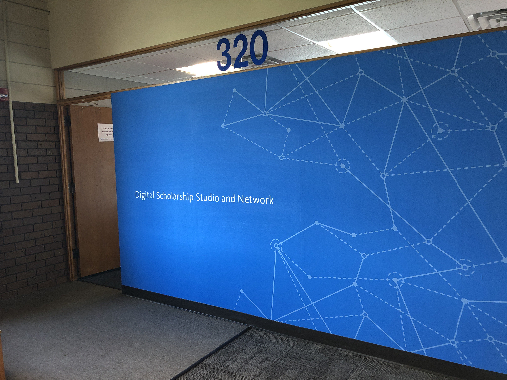
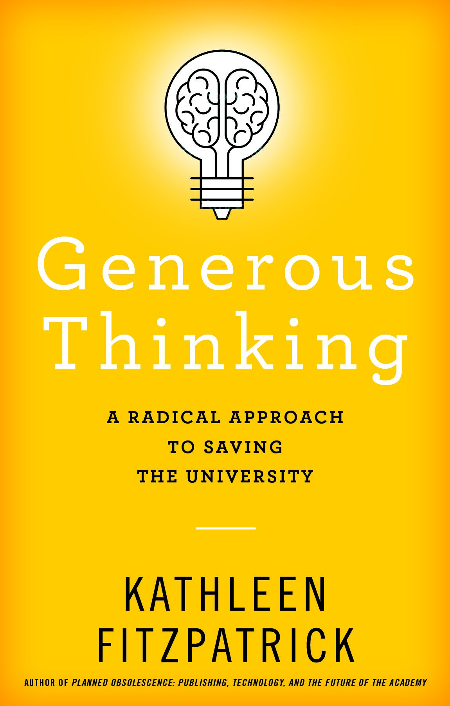

> RT @edifiedlistener: I'm learning a lot here as I go\. The threats to public \#HigherEd are several\. The tension between stated missions rega…

 [Sun Sep 01 12:01:48 +0000 2019](https://twitter.com/kfitz/status/1168131842513559552)

----

> RT @edifiedlistener: 4 years ago, I wrote, "In my dreams my children and grandchildren will not go to college; they will give birth to one\.…

 [Sun Sep 01 12:04:01 +0000 2019](https://twitter.com/kfitz/status/1168132399651328000)

----

Replying to [@edifiedlistener](https://twitter.com/edifiedlistener/status/1168129965059190784)

> Thank you\! I’m grateful to see your response this morning, and hope that we can continue to work toward institutions capable of and committed to fostering community\.

 [Sun Sep 01 12:06:06 +0000 2019](https://twitter.com/kfitz/status/1168132923930959872)

----

Replying to [@meganeabbott](https://twitter.com/meganeabbott/status/1168228436483198976)

> We finished it last night\. Just devastating\.

 [Sun Sep 01 18:47:01 +0000 2019](https://twitter.com/kfitz/status/1168233816764440576)

----

Replying to [@meganeabbott](https://twitter.com/meganeabbott/status/1168235783561654272)

> So much that can’t be known, that can’t be fixed, that can’t be resolved\. It’s going to haunt me, I think\.

 [Sun Sep 01 18:57:49 +0000 2019](https://twitter.com/kfitz/status/1168236535231188992)

----

> I turned 52 last week, and am not exactly sure how that happened\. But it’s time for a new avatar that looks a bit more like the me I’m becoming than the me I used to be\. 
> 
> 

 [Sun Sep 01 19:02:03 +0000 2019](https://twitter.com/kfitz/status/1168237599862992898)

----

> I got some amazing new furniture for my birthday, though, including the best reading chair I’ve ever owned\. I have a new favorite spot in the house\. 
> 
> 

 [Sun Sep 01 19:04:42 +0000 2019](https://twitter.com/kfitz/status/1168238267118080003)

----

Replying to [@d\_kompare](https://twitter.com/d_kompare/status/1168239390193328128)

> Thank you\! :\)

 [Sun Sep 01 19:10:34 +0000 2019](https://twitter.com/kfitz/status/1168239744163164160)

----

Replying to [@martin\_eve](https://twitter.com/martin_eve/status/1168240490573193217)

> Thanks, Martin\! I hope you’re doing well\.

 [Sun Sep 01 19:19:46 +0000 2019](https://twitter.com/kfitz/status/1168242059548995586)

----

Replying to [@jeroenson](https://twitter.com/jeroenson/status/1168240816659271681)

> Thank you, Jeroen\!

 [Sun Sep 01 19:20:04 +0000 2019](https://twitter.com/kfitz/status/1168242136862642176)

----

Replying to [@Jaap\_Kooijman](https://twitter.com/Jaap_Kooijman/status/1168240605031518209)

> It’s the darndest thing\. Congrats to you as well\!

 [Sun Sep 01 19:21:01 +0000 2019](https://twitter.com/kfitz/status/1168242374897741825)

----

Replying to [@triciamatthew](https://twitter.com/triciamatthew/status/1168242732608970753)

> Thank you\! It feels weirdly like a milestone, more than 50 did\. Maybe it’s the reading chair\. :\)

 [Sun Sep 01 19:27:12 +0000 2019](https://twitter.com/kfitz/status/1168243928157609986)

----

Replying to [@elikaortega](https://twitter.com/elikaortega/status/1168242933998354432)

> Aw, thanks Élika\!

 [Sun Sep 01 19:27:36 +0000 2019](https://twitter.com/kfitz/status/1168244029718482944)

----

Replying to [@stephharves](https://twitter.com/stephharves/status/1168265892821688320)

> Love you and miss you, Steph\. You’re the best\. ❤️

 [Sun Sep 01 21:02:10 +0000 2019](https://twitter.com/kfitz/status/1168267827188572160)

----

Replying to [@SheilaABrennan](https://twitter.com/SheilaABrennan/status/1168271959630761985)

> Thanks, Sheila\!

 [Sun Sep 01 21:24:33 +0000 2019](https://twitter.com/kfitz/status/1168273460281434114)

----

Replying to [@james3neal](https://twitter.com/james3neal/status/1168271448978403330)

> Thank you, James\!

 [Sun Sep 01 21:24:56 +0000 2019](https://twitter.com/kfitz/status/1168273556666560512)

----

Replying to [@nowviskie and @MegMulrooney](https://twitter.com/nowviskie/status/1168275328890015745)

> Ooh, warning taken\! 😁

 [Sun Sep 01 22:08:38 +0000 2019](https://twitter.com/kfitz/status/1168284554181926912)

----

Replying to [@kate\_sonka](https://twitter.com/kate_sonka/status/1168337475598725120)

> Art Van\!

 [Mon Sep 02 01:49:46 +0000 2019](https://twitter.com/kfitz/status/1168340205570580480)

----

Replying to [@jillgrogg](https://twitter.com/jillgrogg/status/1168404510596902912)

> Thank you — that is really kind\!

 [Mon Sep 02 12:58:34 +0000 2019](https://twitter.com/kfitz/status/1168508514622431232)

----

Replying to [@ksattler](https://twitter.com/ksattler/status/1168506827442728960)

> Thanks\! :\)

 [Mon Sep 02 12:58:47 +0000 2019](https://twitter.com/kfitz/status/1168508569572040704)

----

Replying to [@drgong](https://twitter.com/drgong/status/1168523187363155974)

> Thanks, Regina\!

 [Mon Sep 02 13:57:54 +0000 2019](https://twitter.com/kfitz/status/1168523445942083589)

----

> This is as fine a description of generous leadership as I’ve seen\. https://twitter\.com/profsamperry/status/1168484409986732038

 [Mon Sep 02 14:02:53 +0000 2019](https://twitter.com/kfitz/status/1168524702530322433)

----

Replying to [@amwhisnant](https://twitter.com/amwhisnant/status/1168639125387403264)

> Thank you\! And backatcha\!

 [Mon Sep 02 22:08:53 +0000 2019](https://twitter.com/kfitz/status/1168647005683499009)

----

Replying to [@adaemmett](https://twitter.com/adaemmett/status/1168907069161988096)

> Thank you\! :\)

 [Tue Sep 03 15:53:46 +0000 2019](https://twitter.com/kfitz/status/1168914994731388928)

----

Replying to [@fkelleter](https://twitter.com/fkelleter/status/1169009806876782592)

> That is serious ice\.

 [Tue Sep 03 23:37:08 +0000 2019](https://twitter.com/kfitz/status/1169031603336699905)

----

Replying to [@JenServenti and @NEHgov](https://twitter.com/JenServenti/status/1169036895956942849)

> Jen, you are the GREATEST\. We all owe you so much — thank you for everything you do, and for 25 years of doing it\!

 [Wed Sep 04 00:07:30 +0000 2019](https://twitter.com/kfitz/status/1169039246189051905)

----

Replying to [@annehelen](https://twitter.com/annehelen/status/1169041985627275264)

> Omg he’s gotten so big\!

 [Wed Sep 04 00:20:13 +0000 2019](https://twitter.com/kfitz/status/1169042446988316672)

----

> The Global Digital Humanities Symposium is going into its fifth year\. The CFP is now available; submit a proposal and join us\! http://www\.msuglobaldh\.org/cfp/ 
> 
> 

 [Wed Sep 04 14:34:02 +0000 2019](https://twitter.com/kfitz/status/1169257317168242690)

----

Replying to [@kfitz](https://twitter.com/kfitz/status/1169257317168242690)

> The deadline for submissions for GlobalDH is 1 November\. Note as well that we do our best to help defray travel expenses for all accepted speakers\!

 [Wed Sep 04 14:38:32 +0000 2019](https://twitter.com/kfitz/status/1169258446702764037)

----

Replying to [@TheMedievalDrK and @humcommons](https://twitter.com/TheMedievalDrK/status/1169225729038569472)

> Hi\! We’re not seeing issues with site creation on our end\. If you’re still having trouble, email hello at hcommons dot org with details\!

 [Wed Sep 04 14:51:59 +0000 2019](https://twitter.com/kfitz/status/1169261831451529216)

----

Replying to [@TheMedievalDrK and @humcommons](https://twitter.com/TheMedievalDrK/status/1169263653830438913)

> Fab, thanks\!

 [Wed Sep 04 15:01:13 +0000 2019](https://twitter.com/kfitz/status/1169264156501061633)

----

> Uh, things could be a whole lot better, too, like say if I were there in person, just saying\. https://twitter\.com/CameronNeylon/status/1169226979557572609

 [Wed Sep 04 15:10:58 +0000 2019](https://twitter.com/kfitz/status/1169266611062300672)

----

> Oh hey\! A bit of me on the radio\. \#GenerousThinking https://twitter\.com/gmbritton/status/1169230378927869952

 [Wed Sep 04 15:25:25 +0000 2019](https://twitter.com/kfitz/status/1169270247351816193)

----

> I’m visiting @UBuffalo today, helping celebrate the launch of their new Digital Scholarship Studio and Network\! 
> 
> 

 [Thu Sep 05 19:33:58 +0000 2019](https://twitter.com/kfitz/status/1169695185984458753)

----

> Fantastic news\! Congratulations, @jsalem75 — looking forward to the possibilities ahead\! https://twitter\.com/Ron\_Hendrick/status/1170130278607667201

 [Sat Sep 07 12:30:06 +0000 2019](https://twitter.com/kfitz/status/1170313292151177217)

----

> Spending the morning doing laundry and reading and fighting down my nausea as the corruption underlying so many institutional narratives about innovation and success is finally brought to light\.

 [Sat Sep 07 15:43:49 +0000 2019](https://twitter.com/kfitz/status/1170362039321157635)

----

Replying to [@mamamusings](https://twitter.com/mamamusings/status/1170394228960169986)

> It’s terrible\. I’m so sorry\.

 [Sat Sep 07 17:58:24 +0000 2019](https://twitter.com/kfitz/status/1170395907956908033)

----

Replying to [@ekansa](https://twitter.com/ekansa/status/1170427896336277504)

> In so many ways\.

 [Sat Sep 07 20:21:24 +0000 2019](https://twitter.com/kfitz/status/1170431897807335424)

----

> All of this, and as Siva says: Lessig first, then thread\. https://twitter\.com/sivavaid/status/1170791391670222849

 [Sun Sep 08 21:37:01 +0000 2019](https://twitter.com/kfitz/status/1170813315548942338)

----

Replying to [@kfitz](https://twitter.com/kfitz/status/1170813315548942338)

> This is what the privatization of higher education has produced: a deep rejection of conscience and desire to evade accountability\.

 [Sun Sep 08 21:40:20 +0000 2019](https://twitter.com/kfitz/status/1170814147338092546)

----

Replying to [@ekansa](https://twitter.com/ekansa/status/1170816705137758208)

> Indeed\. It’s a kind of systemic corruption that uses innovation for cover\.

 [Sun Sep 08 21:59:34 +0000 2019](https://twitter.com/kfitz/status/1170818988756148224)

----

> RT @ananny: To better know Media Lab history &amp; context, check out smart &amp; careful work of these 2 women \(who I also proudly call friends\):…

 [Sun Sep 08 22:24:17 +0000 2019](https://twitter.com/kfitz/status/1170825208338493440)

----

> I am unavoidably watching the MIT debacle play out through the lens of the MSU debacle\. In both cases, institutional advancement has outweighed anything like conscience or responsibility\. It’s a horror\. \+

 [Sun Sep 08 22:33:21 +0000 2019](https://twitter.com/kfitz/status/1170827491067486208)

----

> And it says so much about who and what the donor\-driven, privatized system of public higher education has been led to value, and who and what it has been allowed to ignore\. Or worse\.

 [Sun Sep 08 22:33:39 +0000 2019](https://twitter.com/kfitz/status/1170827565646385162)

----

> RT @ekansa: @kfitz Succinctly put\. Weird how "disruption" never disrupts the people that finance the disruption\.

 [Sun Sep 08 22:54:31 +0000 2019](https://twitter.com/kfitz/status/1170832818487930880)

----

Replying to [@kfitz](https://twitter.com/hels/status/1171146840911171584)

> I wish I could tell you how much I needed this today, @hels\. 🙌 https://twitter\.com/hels/status/1171146840911171584

 [Tue Sep 10 00:24:56 +0000 2019](https://twitter.com/kfitz/status/1171217960993734656)

----

> RT @elouson: Spotted in @lymanbriggs college 
> 
> 

 [Tue Sep 10 14:29:42 +0000 2019](https://twitter.com/kfitz/status/1171430550919249923)

----

> RT @ekansa: I'd like to see this as well, provided we rebuild humane institutions\. FYI @kfitz has some excellent ideas about how: https://t…

 [Tue Sep 10 21:46:56 +0000 2019](https://twitter.com/kfitz/status/1171540584487481344)

----

Replying to [@nowviskie, @katinalynn, @thomasgpadilla, @CathyNDavidson and @epistemographer](https://twitter.com/nowviskie/status/1171548180728729600)

> Same\. Same same same\. 😊

 [Tue Sep 10 22:20:10 +0000 2019](https://twitter.com/kfitz/status/1171548949833904128)

----

Replying to [@hralperta, @SMDreller, @paigecmorgan and @humcommons](https://twitter.com/hralperta/status/1171797715166142469)

> There are a few ways\! You can tag all deposits, which will then be searchable; if you let us know, we can build a collection from that\. Or you can create/join a group and share all deposits with that group; the group then becomes a collection space\.

 [Wed Sep 11 15:00:51 +0000 2019](https://twitter.com/kfitz/status/1171800778782035969)

----

Replying to [@SMDreller, @hralperta, @paigecmorgan and @humcommons](https://twitter.com/SMDreller/status/1171808526014013441)

> Not really\. Collections \(like those highlighted at https://hcommons\.org/core/\) grow as new items get added, I don’t think there’s a way for those additions to generate notifications\.

 [Wed Sep 11 15:45:22 +0000 2019](https://twitter.com/kfitz/status/1171811982476857345)

----

Replying to [@foundhistory, @MellonFdn and @GreenhouseUConn](https://twitter.com/foundhistory/status/1171791751927013376)

> Tom\! Huge congratulations\!\!\! We should talk\. :\) cc @meshresearch

 [Wed Sep 11 16:56:52 +0000 2019](https://twitter.com/kfitz/status/1171829974979866624)

----

Replying to [@hralperta, @SMDreller, @paigecmorgan and @humcommons](https://twitter.com/hralperta/status/1171874932621500416)

> Hmmmm, good question\. CORE really is intended for completed work meant to be publicly shared\. My own inclination would be to share job market materials a bit less publicly, but I’d be interested in hearing from others\!

 [Wed Sep 11 20:20:05 +0000 2019](https://twitter.com/kfitz/status/1171881118024364032)

----

> Super interesting thread\.\.\. https://twitter\.com/CameronNeylon/status/1172137722619629568

 [Thu Sep 12 16:37:57 +0000 2019](https://twitter.com/kfitz/status/1172187604428754950)

----

> I started this morning a good bit earlier than I usually like, but after an excellent coffee with @EthanWatrall and some much\-needed good news in the inbox, I am having an awesome day, and wish all the same for all of you\. 🎉

 [Fri Sep 13 13:42:59 +0000 2019](https://twitter.com/kfitz/status/1172505959807234048)

----

Replying to [@kfitz](https://twitter.com/zephoria/status/1172547697498304513)

> “The goal shouldn’t be to avoid being evil; it should be to actively do good\.” Huge congratulations, @zephoria, and equally huge thanks\. ❤️ https://twitter\.com/zephoria/status/1172547697498304513

 [Fri Sep 13 18:31:38 +0000 2019](https://twitter.com/kfitz/status/1172578600287162370)

----

Replying to [@brandontlocke](https://twitter.com/brandontlocke/status/1172583869108736001)

> I am sooooo delighted about this\! Huge congrats, and very much looking forward to hearing more\.

 [Fri Sep 13 19:06:48 +0000 2019](https://twitter.com/kfitz/status/1172587449899540481)

----

> RT @kate\_sonka: It’s not too late to submit a proposal for @ALC\_MSU\. We want to hear from YOU\! \#a11y \#MSUa11y https://twitter\.com/ALC\_MSU/status/1172563378327314432

 [Fri Sep 13 19:51:25 +0000 2019](https://twitter.com/kfitz/status/1172598680102285317)

----

Replying to [@sharonmleon](https://twitter.com/sharonmleon/status/1172618092469456896)

> That is just rude\.

 [Fri Sep 13 21:10:36 +0000 2019](https://twitter.com/kfitz/status/1172618605944541185)

----

> RT @gmbritton: Academics worried about self\-promotion: as a university press editor, I am looking specifically for authors with a platform\.…

 [Sat Sep 14 22:03:13 +0000 2019](https://twitter.com/kfitz/status/1172994234384814080)

----

> Boy things are interesting on here this morning\.

 [Sun Sep 15 12:56:22 +0000 2019](https://twitter.com/kfitz/status/1173219004158230528)

----

Replying to [@kfitz](https://twitter.com/kfitz/status/1173219004158230528)

> My three cents? \(a\) Don’t let anybody persuade you not to make a gift of your work to the world by calling that self\-promotion\. Use that work in public to connect to others\.

 [Sun Sep 15 12:58:12 +0000 2019](https://twitter.com/kfitz/status/1173219466613862406)

----

Replying to [@kfitz](https://twitter.com/kfitz/status/1173219466613862406)

> \(b\) Saying that work that isn’t immediately communicated in the open form you want is “worthless” is both wrong and rude, especially when you’re punching down\. Grant everyone the space to make their work public in their own way and their own time\.

 [Sun Sep 15 13:00:59 +0000 2019](https://twitter.com/kfitz/status/1173220165334589440)

----

Replying to [@kfitz](https://twitter.com/kfitz/status/1173220165334589440)

> \(b\.2\) And encourage openness rather than demanding\. Don’t be a dick\.

 [Sun Sep 15 13:01:51 +0000 2019](https://twitter.com/kfitz/status/1173220384222715905)

----

> This past week, I finally wrapped up the last of my big summer projects, so this weekend I got to turn my gaze ahead, at last\. \(As well as getting to turn it back to my own projects\.\)

 [Sun Sep 15 17:50:29 +0000 2019](https://twitter.com/kfitz/status/1173293020030091265)

----

Replying to [@kfitz](https://twitter.com/kfitz/status/1173293020030091265)

> That started with doing some reading toward my spring syllabus\. And lo but that reading today helped me zero in on a question in the next big thing I want to write\.

 [Sun Sep 15 17:51:37 +0000 2019](https://twitter.com/kfitz/status/1173293305498611712)

----

Replying to [@kfitz](https://twitter.com/kfitz/status/1173293305498611712)

> Of course that means my reading list just got ten things longer\. But at least I know what I’m reading now, and why\. And I’m super excited about it\.

 [Sun Sep 15 17:52:22 +0000 2019](https://twitter.com/kfitz/status/1173293492862431233)

----

Replying to [@WorldImagining and @Protohedgehog](https://twitter.com/WorldImagining/status/1173292979341135872)

> I’m still not sure I’d go with “worthless,” but “selfish” and “elitist” might not be uncalled for\.

 [Sun Sep 15 18:11:44 +0000 2019](https://twitter.com/kfitz/status/1173298369185439746)

----

Replying to [@brettbobley and @JenServenti](https://twitter.com/brettbobley/status/1173319392781901825)

> Wait, what? I need to know more\.

 [Sun Sep 15 19:39:21 +0000 2019](https://twitter.com/kfitz/status/1173320417618157573)

----

> Same\! https://twitter\.com/profgabrielle/status/1173330927096868866

 [Sun Sep 15 20:22:39 +0000 2019](https://twitter.com/kfitz/status/1173331313685929985)

----

Replying to [@brettbobley, @snonsumr and @JenServenti](https://twitter.com/brettbobley/status/1173351009411883008)

> \*pulls pencil from behind ear; licks point; readies pad\*

 [Sun Sep 15 21:43:29 +0000 2019](https://twitter.com/kfitz/status/1173351658270728194)

----

> RT @aupresses: Welcome to \#PeerRevWk19\! We look forward to exploring Quality in Peer Review all week long, especially in a free webinar w/…

 [Mon Sep 16 14:31:13 +0000 2019](https://twitter.com/kfitz/status/1173605263263162368)

----

> RT @gmbritton: Happy Peer Review Week everyone\! In addition to authors with platforms, we like books that have their quality assured by pee…

 [Mon Sep 16 20:55:35 +0000 2019](https://twitter.com/kfitz/status/1173701988481212418)

----

> RT @mkgold: Getting involved with @achdotorg is one of the most rewarding things I've done in my career\. Please consider nominating yoursel…

 [Mon Sep 16 22:21:03 +0000 2019](https://twitter.com/kfitz/status/1173723500588220416)

----

> Please do nominate yourself or others, and feel free to contact me if you have questions\! https://twitter\.com/achdotorg/status/1173568463895314432

 [Mon Sep 16 22:21:48 +0000 2019](https://twitter.com/kfitz/status/1173723688891551750)

----

> I’ve been thinking this morning about the difference between Planned Obsolescence and Generous Thinking, and why the latter, and the response to it, means so much to me right now\. When I was writing Planned Obsolescence, I thought I had answers to big \.\.\. https://kfitz\.info/17\-september\-2019\-0820/

 [Tue Sep 17 12:45:39 +0000 2019](https://twitter.com/kfitz/status/1173941083715362816)

----

Replying to [@BerondaM](https://twitter.com/BerondaM/status/1173956425162395648)

> This kind of engagement matters so much — thanks, Beronda\!

 [Tue Sep 17 13:49:22 +0000 2019](https://twitter.com/kfitz/status/1173957119273390081)

----

Replying to [@plragde](https://twitter.com/plragde/status/1174330805381824512)

> Bikes can move too quickly into crosswalks for drivers of turning vehicles to register and respond\. We saw this here yesterday — a crosswalk that was clear one second had a bicyclist midway across the next\. Had we looked away or started to turn it would have been terrible\.

 [Wed Sep 18 15:17:37 +0000 2019](https://twitter.com/kfitz/status/1174341713399296007)

----

> RT @wvanwezenbeek: Share knowledge\. Care for your community\. I just wrote another blog with a big thank you to @kfitz \(and @CameronNeylon\)…

 [Wed Sep 18 15:19:25 +0000 2019](https://twitter.com/kfitz/status/1174342168514838528)

----

Replying to [@wvanwezenbeek, @jeroenson and @CameronNeylon](https://twitter.com/wvanwezenbeek/status/1174336944022740992)

> Thank you for this\! What a lovely gift this reading is\!

 [Wed Sep 18 15:19:55 +0000 2019](https://twitter.com/kfitz/status/1174342291336704000)

----

> Migraines are the worst\.

 [Wed Sep 18 15:21:27 +0000 2019](https://twitter.com/kfitz/status/1174342677418192899)

----

Replying to [@kfitz](https://twitter.com/kfitz/status/1174342677418192899)

> I don’t have them terribly often, thank goodness, but alas that means when I do the chances are high that my meds have expired\. As today\.

 [Wed Sep 18 15:24:52 +0000 2019](https://twitter.com/kfitz/status/1174343536864636928)

----

Replying to [@wynkenhimself](https://twitter.com/wynkenhimself/status/1174346135613431808)

> Thanks\. Every time I have one of these I think of you and others of my friends who deal with this frequently\. :\(

 [Wed Sep 18 16:55:52 +0000 2019](https://twitter.com/kfitz/status/1174366441014870017)

----

Replying to [@plragde](https://twitter.com/plragde/status/1174352687493763077)

> Huh\. I guess that makes sense\. I have no idea if cycling on sidewalks is legal here or not, but boy people sure do it…

 [Wed Sep 18 16:58:09 +0000 2019](https://twitter.com/kfitz/status/1174367013453459456)

----

> RT @PubPhilJ: The 5th @PublicPhilNet Conference is right around the corner\! You can preview and sign up for exciting workshops below\. We'll…

 [Wed Sep 18 22:37:45 +0000 2019](https://twitter.com/kfitz/status/1174452476763889671)

----

> RT @aupresses: Ready to explore quality in peer review with @s2ceball, @BBouloukos, @kfitz, @sylviamath &amp; @kwissoker? Join our free webinar…

 [Thu Sep 19 14:19:04 +0000 2019](https://twitter.com/kfitz/status/1174689365378895873)

----

> RT @JHUPress: "Peer review at its finest is an act of extraordinary generosity and is capable of engendering generosity in its wake\." Writi…

 [Thu Sep 19 17:11:14 +0000 2019](https://twitter.com/kfitz/status/1174732695223455744)

----

> ENORMOUS congratulations, @tressiemcphd\! I could not be more delighted for you\!\!\! https://twitter\.com/nationalbook/status/1174695450462629888

 [Thu Sep 19 18:06:32 +0000 2019](https://twitter.com/kfitz/status/1174746610363842560)

----

Replying to [@BerondaM and @ProfKori](https://twitter.com/BerondaM/status/1174757208388558850)

> My thought exactly\. I can’t believe they tried\!

 [Thu Sep 19 19:42:51 +0000 2019](https://twitter.com/kfitz/status/1174770851180204032)

----

> I \*love\* this book and can not wait for all of you to read it\. https://twitter\.com/JHUPress/status/1175047720664522752

 [Fri Sep 20 14:10:20 +0000 2019](https://twitter.com/kfitz/status/1175049557761286146)

----

Replying to [@pubkat](https://twitter.com/pubkat/status/1175112444391370752)

> Oh my word did I need that this afternoon\! :\)

 [Fri Sep 20 18:27:04 +0000 2019](https://twitter.com/kfitz/status/1175114165993836544)

----

> This completely made my afternoon\. https://twitter\.com/pubkat/status/1175112444391370752

 [Fri Sep 20 18:28:07 +0000 2019](https://twitter.com/kfitz/status/1175114431426105344)

----

Replying to [@gmbritton](https://twitter.com/gmbritton/status/1175411941914947585)

> 🤔 https://twitter\.com/EarthWindFire/status/1174915188576813056

 [Sat Sep 21 14:37:48 +0000 2019](https://twitter.com/kfitz/status/1175418857009373184)

----

> This is a crucial question —but we also need to ask how public engagement is rewarded\. Public scholars need to be protected from punishment on and off campus\. https://twitter\.com/SCrichlow/status/1175534741665341445

 [Sun Sep 22 13:54:45 +0000 2019](https://twitter.com/kfitz/status/1175770412371914753)

----

> I’ve only been a Michigander for two years, and even I know what an insult this is\. https://twitter\.com/paulegan4/status/1175485632883363842

 [Sun Sep 22 14:25:54 +0000 2019](https://twitter.com/kfitz/status/1175778249567285249)

----

Replying to [@jadedid](https://twitter.com/jadedid/status/1175525220549091328)

> Oh, Jade\. I missed this yesterday\. I’m so sorry for your loss\.

 [Sun Sep 22 15:56:59 +0000 2019](https://twitter.com/kfitz/status/1175801173795844096)

----

> I am enormously excited to be keynoting Humanities 20/20 at Vanderbilt this Friday, supporting the faculty’s development of a vision for the future of the humanities at the university\. https://events\.vanderbilt\.edu/\#\!view/event/date/20190927/event\_id/16983

 [Mon Sep 23 19:46:17 +0000 2019](https://twitter.com/kfitz/status/1176221266161885189)

----

Replying to [@nancybaym](https://twitter.com/nancybaym/status/1176230034245324800)

> At this point I usually want to go with “and that’s all I have to say about that\!”

 [Mon Sep 23 20:37:34 +0000 2019](https://twitter.com/kfitz/status/1176234170940567553)

----

> It’s been a really rough last four days here on the home front, but you know what would make it better? Seeing congresspeople actually do their jobs\. \(Thanks for stepping up, @RepSlotkin\.\)

 [Tue Sep 24 13:21:29 +0000 2019](https://twitter.com/kfitz/status/1176486815290855424)

----

> Not only is this true, but there’s an additional factor that goes unmentioned: humanities majors are HAPPIER\. https://www\.amacad\.org/sites/default/files/academy/multimedia/pdfs/publications/researchpapersmonographs/HI\_Workforce\-2018\.pdf https://twitter\.com/devoneylooser/status/1176696591408750593

 [Wed Sep 25 12:05:25 +0000 2019](https://twitter.com/kfitz/status/1176830059971338240)

----

> RT @NQuamWickham: Sometimes, too, we find accountants and engineers in our Humanities classes later in life, when they realize how terribly…

 [Wed Sep 25 16:43:09 +0000 2019](https://twitter.com/kfitz/status/1176899953840361473)

----

> Oh HEY\. https://twitter\.com/waynestatelib/status/1176573307451256832

 [Wed Sep 25 19:32:26 +0000 2019](https://twitter.com/kfitz/status/1176942553767137281)

----

> Omg this is GENIUS\. Good on ya, @perrycollins\! https://twitter\.com/shorttage/status/1176884011563548672

 [Wed Sep 25 21:57:13 +0000 2019](https://twitter.com/kfitz/status/1176978992584384512)

----

Replying to [@mchris4duke](https://twitter.com/mchris4duke/status/1176986358554013696)

> 🤬

 [Wed Sep 25 22:33:55 +0000 2019](https://twitter.com/kfitz/status/1176988225526804481)

----

> On my way to Vanderbilt for Humanities 20/20\! https://events\.vanderbilt\.edu/\#\!view/event/date/20190927/event\_id/16983

 [Thu Sep 26 13:21:18 +0000 2019](https://twitter.com/kfitz/status/1177211547015421952)

----

> RT @caromholland: yes, we are happier  
>   
> and by happier I mean ANGRIER AND READY FOR THE REVOLUTION https://twitter\.com/kfitz/status/1176830059971338240

 [Thu Sep 26 19:11:16 +0000 2019](https://twitter.com/kfitz/status/1177299618461126656)

----

Replying to [@RahawaHaile](https://twitter.com/RahawaHaile/status/1177305945963024384)

> Huge congratulations, Rahawa\!

 [Thu Sep 26 20:44:11 +0000 2019](https://twitter.com/kfitz/status/1177323001173303296)

----

> I highly recommend this accompaniment\. https://twitter\.com/MurielSR/status/1177664489027751938

 [Fri Sep 27 19:30:26 +0000 2019](https://twitter.com/kfitz/status/1177666826634854401)

----

> I’m so grateful to have had such a brilliant, energizing day thinking about the future of the humanities with grad students and faculty at the @RPWCenter at @VanderbiltU\. I can’t wait to see where this planning leads them\!

 [Fri Sep 27 23:30:25 +0000 2019](https://twitter.com/kfitz/status/1177727222439919616)

----

Replying to [@goldietaylor](https://twitter.com/goldietaylor/status/1177736843552530433)

> I tend to agree with you\. I would of course prefer to see him go down on real charges that represent the horror of what he’s done\. But I increasingly think, like getting Al Capone on tax\-evasion, whatever works\.

 [Sat Sep 28 00:12:15 +0000 2019](https://twitter.com/kfitz/status/1177737750017118215)

----

> RT @lnakamur: A few days left\!  The Digital Studies Institute at U Michigan is hiring an Ex Director, a lecturer, and 2 postdoc positions\.…

 [Mon Sep 30 12:00:28 +0000 2019](https://twitter.com/kfitz/status/1178640754060779522)

----

> Oy\. There is a whole thing in \#thatpaper to which I’m not going to link\. You’ve seen the agita here\. My response? Please\. https://jhupbooks\.press\.jhu\.edu/title/generous\-thinking 
> 
> 

 [Mon Sep 30 12:42:31 +0000 2019](https://twitter.com/kfitz/status/1178651338302844928)