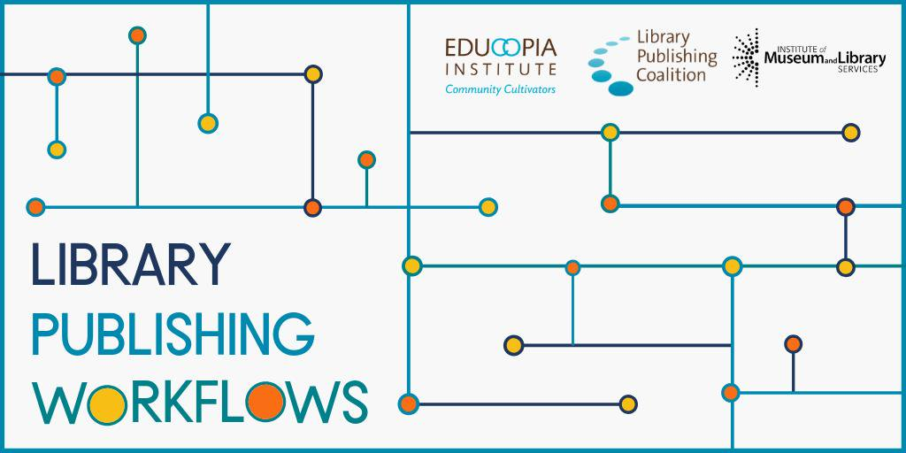

> RT @hkpmcgregor: In this institutional climate, we don’t need a doubling down on conservatism\. We need people like @SaraNAhmed and @kfitz t…

 [Tue Oct 01 21:26:40 +0000 2019](https://twitter.com/kfitz/status/1179145629244755968)

----

Replying to [@tressiemcphd and @AmanpourCoPBS](https://twitter.com/tressiemcphd/status/1179132655843053569)

> Thank you for sharing this; I missed it when it originally aired\. It’s searing and important\.

 [Tue Oct 01 21:40:57 +0000 2019](https://twitter.com/kfitz/status/1179149226523148288)

----

Replying to [@tressiemcphd and @AmanpourCoPBS](https://twitter.com/tressiemcphd/status/1179132655843053569)

> And congratulations on the paperback release — it’s such a brilliant book, and all its success is so well deserved\.

 [Tue Oct 01 21:41:37 +0000 2019](https://twitter.com/kfitz/status/1179149394916052995)

----

Replying to [@paigecmorgan](https://twitter.com/paigecmorgan/status/1179364935702339584)

> Oh Paige\! I am so sorry\. Sending all good thoughts your way\.

 [Wed Oct 02 13:37:05 +0000 2019](https://twitter.com/kfitz/status/1179389844377817088)

----

Replying to [@annehelen](https://twitter.com/annehelen/status/1179381930917277697)

> MOM\. Peggy won’t share the ball\.

 [Wed Oct 02 13:39:35 +0000 2019](https://twitter.com/kfitz/status/1179390475012325377)

----

Replying to [@paigecmorgan](https://twitter.com/paigecmorgan/status/1179393413319417856)

> Poor thing\. I hope she remains comfortable\!

 [Wed Oct 02 14:06:06 +0000 2019](https://twitter.com/kfitz/status/1179397146593910784)

----

> RT @WarwickLanguage: hearing from @actualham that @kfitz wrote a book calling for a more radical way of rethinking intellectual property, e…

 [Wed Oct 02 14:14:26 +0000 2019](https://twitter.com/kfitz/status/1179399245654351874)

----

> RT @jnonfiction: The smallest of points: that we assign value to exclusive venues for publication, and then \(mis\)take that to mean there’s…

 [Thu Oct 03 23:32:15 +0000 2019](https://twitter.com/kfitz/status/1179902010147184640)

----

> RT @anneVirginaTech: Looking forward to @kfitz visit to Virginia Tech, a Beyond Boundaries Event\! https://vtnews\.vt\.edu/articles/2019/10/beyondboundaries\-generous\-thinking\.html @vtnews @Strategi…

 [Thu Oct 03 23:32:32 +0000 2019](https://twitter.com/kfitz/status/1179902079936151552)

----

> This has been an amazingly productive an exciting week so far \(3 days with the fab @humcommons team; 1 day at @waynestatelib\) but All that excitement has left me a leeeetle bit tired\.

 [Thu Oct 03 23:38:32 +0000 2019](https://twitter.com/kfitz/status/1179903591601061888)

----

Replying to [@humcommons and @waynestatelib](https://twitter.com/kfitz/status/1179903591601061888)

> Next week I’m at @virginia\_tech: 3 days, 3 campuses\. More excitement\! So lots of rest this weekend\. https://vtnews\.vt\.edu/articles/2019/10/beyondboundaries\-generous\-thinking\.html

 [Thu Oct 03 23:41:36 +0000 2019](https://twitter.com/kfitz/status/1179904365387292672)

----

> RT @CALMSU: Join us in congratulating Professor Justus Nieland on being appointed the new Chair of the Department of English\. Dr\. Nieland j…

 [Fri Oct 04 01:42:07 +0000 2019](https://twitter.com/kfitz/status/1179934690922381314)

----

Replying to [@martin\_eve](https://twitter.com/martin_eve/status/1180414236721373184)

> Sending love and strength, Martin\!

 [Sat Oct 05 13:16:25 +0000 2019](https://twitter.com/kfitz/status/1180471805108264961)

----

> RT @billhd: I don’t know who needs to hear this but the bad stuff that comes after “academia is \.\.\.” is mostly in your department bylaws th…

 [Sat Oct 05 17:25:54 +0000 2019](https://twitter.com/kfitz/status/1180534590798213121)

----

> I just laughed out loud in the middle of a restaurant\. https://twitter\.com/sivavaid/status/1180601723737391104

 [Sat Oct 05 22:33:35 +0000 2019](https://twitter.com/kfitz/status/1180612023903805440)

----

Replying to [@paigecmorgan](https://twitter.com/paigecmorgan/status/1180966232637497345)

> Oh no\! Sending healing thoughts\!

 [Sun Oct 06 22:09:03 +0000 2019](https://twitter.com/kfitz/status/1180968236453638145)

----

> On my way\! https://twitter\.com/Anne\_Khademian/status/1179821008800190465

 [Mon Oct 07 12:54:51 +0000 2019](https://twitter.com/kfitz/status/1181191155377201152)

----

> What would it be like to assess your work according to your own standards, rather than constantly comparing yourself to others? https://kfitz\.info/self\-assessment/

 [Mon Oct 07 13:20:37 +0000 2019](https://twitter.com/kfitz/status/1181197637690822657)

----

> This is why Beronda is such a good model\. https://kfitz\.info/self\-assessment/ https://twitter\.com/BerondaM/status/1181199297825644545

 [Mon Oct 07 13:32:49 +0000 2019](https://twitter.com/kfitz/status/1181200709213196288)

----

> This is where the death of the public good begins\. https://twitter\.com/DLeonhardt/status/1181004566088814594

 [Mon Oct 07 15:04:41 +0000 2019](https://twitter.com/kfitz/status/1181223826769752064)

----

> Thinking through the ways I unthinking compare myself and my work to others:  https://kfitz\.info/self\-assessment/

 [Mon Oct 07 18:54:45 +0000 2019](https://twitter.com/kfitz/status/1181281728897458177)

----

Replying to [@kfitz](https://twitter.com/kfitz/status/1181281728897458177)

> \*unthinkingLY\. Sheesh\.

 [Mon Oct 07 18:55:38 +0000 2019](https://twitter.com/kfitz/status/1181281951237304320)

----

> RT @cplong: In September I addressed the President's Council of @michiganstateu about the values\-based approach to culture change we've und…

 [Tue Oct 08 01:26:35 +0000 2019](https://twitter.com/kfitz/status/1181380333977161728)

----

Replying to [@tressiemcphd](https://twitter.com/tressiemcphd/status/1181578610072854529)

> Congratulations\!\!\!\!

 [Tue Oct 08 18:38:39 +0000 2019](https://twitter.com/kfitz/status/1181640063513497601)

----

> RT @HuMetricsHSS: Our first Daily Value, with a nod to @kfitz, is generosity\.  How does generosity play into your work today? How are you g…

 [Tue Oct 08 18:39:51 +0000 2019](https://twitter.com/kfitz/status/1181640365721432072)

----

> RT @terrainsvagues: Join us in our new experiment\! Today’s \#dailyvalue is generosity\. Thread here: https://twitter\.com/humetricshss/status/1181574448622837760?s\=12 https://t\.co/oLZ…

 [Tue Oct 08 18:40:22 +0000 2019](https://twitter.com/kfitz/status/1181640493911937025)

----

> RT @TinkeringHuman: So excited to open phase 1 of our Digital Humanities Studio this coming week with special guest @kfitz\! https://t\.co/xh…

 [Wed Oct 09 14:08:31 +0000 2019](https://twitter.com/kfitz/status/1181934470376706049)

----

Replying to [@shannonmattern](https://twitter.com/shannonmattern/status/1182120897139875840)

> Sending you all the best for a quick recovery, Shannon\!

 [Thu Oct 10 09:40:53 +0000 2019](https://twitter.com/kfitz/status/1182229506108641280)

----

> Enormous thanks to all my friends at @virginia\_tech for such a fantastic three days of talks and discussions about generous thinking and the future of the university\!

 [Thu Oct 10 22:07:01 +0000 2019](https://twitter.com/kfitz/status/1182417277976743938)

----

> It was an energizing tour, and I’m filled with ideas about what might come next\. \(I hope you are too\!\)

 [Thu Oct 10 22:07:56 +0000 2019](https://twitter.com/kfitz/status/1182417507078070273)

----

> Regret indeed\. https://twitter\.com/ShoshanaAkabas/status/1182349339705925632

 [Thu Oct 10 22:13:37 +0000 2019](https://twitter.com/kfitz/status/1182418937830662144)

----

Replying to [@quinnanya and @cecilealduy](https://twitter.com/quinnanya/status/1182419880970092544)

> That is so wonderful to hear\! The need is so much in the air; I’m just glad to be part of these discussions\.

 [Thu Oct 10 22:19:50 +0000 2019](https://twitter.com/kfitz/status/1182420502582874112)

----

> This is indeed such an important move that I’ll give it a RT\. Real sustainability lies in the difficult work of cross\-institutional collaboration\. Proud to be a part of the @BigTenAcademic Alliance\! https://twitter\.com/chronicle/status/1182264539775152128

 [Thu Oct 10 22:32:40 +0000 2019](https://twitter.com/kfitz/status/1182423732251516928)

----

> RT @mmfa: News broke yesterday that \*forty\-three\* new women came forward to describe assault and harassment by Trump\. According to a Nexis…

 [Thu Oct 10 22:35:36 +0000 2019](https://twitter.com/kfitz/status/1182424468947394561)

----

> RT @ihaventreadit: It is time\-consuming, finishing a dissertation &amp; looking for a job\. Lately, whenever I had a free moment to read somethi…

 [Fri Oct 11 14:57:35 +0000 2019](https://twitter.com/kfitz/status/1182671591995559937)

----

> RT @wynkenhimself: It’s not just one bookstore or one country\. Again: this die\-hard feminist and women’s college graduate and cis\-woman wil…

 [Sat Oct 12 22:41:42 +0000 2019](https://twitter.com/kfitz/status/1183150781798797314)

----

Replying to [@shannonmattern](https://twitter.com/shannonmattern/status/1183393012283559937)

> Soooooo completely understand\! Congrats on being rid of it\!

 [Sun Oct 13 15:24:08 +0000 2019](https://twitter.com/kfitz/status/1183403051601874945)

----

Replying to [@shannonmattern](https://twitter.com/shannonmattern/status/1183403344452292609)

> I currently have three of those damn things, none of which are large enough to warrant surgical intervention\. YET\. But they’re certainly enough to cause some unwelcome overcrowding\. 😠

 [Sun Oct 13 15:29:24 +0000 2019](https://twitter.com/kfitz/status/1183404375722594304)

----

Replying to [@shannonmattern](https://twitter.com/shannonmattern/status/1183404920273281026)

> Thanks, Shannon, and happy healing to you\!

 [Sun Oct 13 15:36:52 +0000 2019](https://twitter.com/kfitz/status/1183406257128005632)

----

Replying to [@martin\_eve](https://twitter.com/martin_eve/status/1183657238784819200)

> HUGE congratulations, Martin, and so well deserved\!

 [Mon Oct 14 10:12:09 +0000 2019](https://twitter.com/kfitz/status/1183686925712084993)

----

> On my way to Purdue U today for a couple of talks\. Looking forward to seeing folks there\! http://blogs\.lib\.purdue\.edu/news/2019/09/26/dh\-oh\-19/

 [Mon Oct 14 12:27:29 +0000 2019](https://twitter.com/kfitz/status/1183720982525157377)

----

Replying to [@martin\_eve](https://twitter.com/martin_eve/status/1184163082056228864)

> A reasonable request\!

 [Tue Oct 15 23:00:24 +0000 2019](https://twitter.com/kfitz/status/1184242648946749440)

----

> This is the GREATEST news\! https://twitter\.com/openlibhums/status/1184163250616918017

 [Tue Oct 15 23:01:01 +0000 2019](https://twitter.com/kfitz/status/1184242804400238592)

----

> RT @LibPubCoalition: Meet the \#LibPubWorkflows Advisory Board\!  
>   
> https://librarypublishing\.org/meet\-the\-library\-publishing\-workflows\-advisors/ 
> 
> 

 [Tue Oct 15 23:40:29 +0000 2019](https://twitter.com/kfitz/status/1184252736776396800)

----

Replying to [@annehelen](https://twitter.com/annehelen/status/1184179586378035201)

> So serious\!

 [Tue Oct 15 23:40:52 +0000 2019](https://twitter.com/kfitz/status/1184252832406482944)

----

> RT @NEHgov: Come celebrate the opening of the new Center for Arts and Humanities at @WSU\! @NEHChair Jon Parrish Peede will be speaking on O…

 [Wed Oct 16 14:18:37 +0000 2019](https://twitter.com/kfitz/status/1184473728207347712)

----

> Such a loss\. Such a life\. https://twitter\.com/AP/status/1184761275655606272

 [Thu Oct 17 11:12:29 +0000 2019](https://twitter.com/kfitz/status/1184789274006294530)

----

> 🍿🍿🍿 https://twitter\.com/mchris4duke/status/1184966795461046273

 [Thu Oct 17 23:00:17 +0000 2019](https://twitter.com/kfitz/status/1184967396429307906)

----

> Dear Outlook 365 team: Upon double\-clicking an xlsx attachment, the “you haven’t selected an application to open this kind of file” message I got was kind of a surprise\. May I come introduce you to your colleagues down the hall? Love, kfitz\.

 [Fri Oct 18 20:49:48 +0000 2019](https://twitter.com/kfitz/status/1185296947848077312)

----

> Soooo\. I think I may need a trustworthy fan to explain to me the thing about Succession\. Because we watched the first episode and absolutely hated everybody, and not in an enjoyable way\.

 [Fri Oct 18 22:23:34 +0000 2019](https://twitter.com/kfitz/status/1185320542578106371)

----

Replying to [@amandafrench](https://twitter.com/amandafrench/status/1185321339252555776)

> Yeah, I think there’s a relationship here\. We’re a couple of episodes into season 1 of Fleabag and are finding it a little hard going\. But nowhere near as hard as Succession\.

 [Fri Oct 18 22:28:12 +0000 2019](https://twitter.com/kfitz/status/1185321708762402821)

----

> I mean, the pleasure of Succession could well be in imagining them all up against the wall when the revolution comes, who’s to say\.

 [Fri Oct 18 22:29:18 +0000 2019](https://twitter.com/kfitz/status/1185321987960459270)

----

> But otherwise I am not obtaining traction with a bunch of people I could not bear to listen to for one more second\.

 [Fri Oct 18 22:30:02 +0000 2019](https://twitter.com/kfitz/status/1185322169305309186)

----

Replying to [@Greene\_DM](https://twitter.com/Greene_DM/status/1185322204772339712)

> I can see that\. Though: Arrested Development at least had a reasonably sympathetic point of identification\. And even so I wasn’t ever able to watch much\.

 [Fri Oct 18 22:32:51 +0000 2019](https://twitter.com/kfitz/status/1185322880176922625)

----

Replying to [@gworthey, @Ted\_Underwood, @hathitrust and @iSchoolUI](https://twitter.com/gworthey/status/1185259671491203073)

> Huge congratulations, Glen — and good get, HTRC\! Can’t wait to hear more\!

 [Sat Oct 19 00:29:03 +0000 2019](https://twitter.com/kfitz/status/1185352124655382528)

----

Replying to [@bukuwawa and @jwolman](https://twitter.com/bukuwawa/status/1185681647531937794)

> For me it falls into that Seinfeld space of shows about horrible people for whom I feel zero sympathy or interest\. Granted, that’s only after one episode\. But I just don’t see the appeal?

 [Sat Oct 19 23:49:41 +0000 2019](https://twitter.com/kfitz/status/1185704602844487680)

----

Replying to [@brandontlocke](https://twitter.com/brandontlocke/status/1186426982554193921)

> I am more than a little concerned to hear that you have spent time in the facilities of what my colleague refers to as The People’s Kroger, Brandon\.

 [Mon Oct 21 23:49:08 +0000 2019](https://twitter.com/kfitz/status/1186429240935403520)

----

> I’m delighted that the book is out; it’s a fabulous collection\! https://twitter\.com/a\_starre/status/1186598161541939200

 [Tue Oct 22 11:10:36 +0000 2019](https://twitter.com/kfitz/status/1186600739579351040)

----

> So grateful for this work; thanks to the SSRC team\! https://twitter\.com/jasonrhody/status/1186942092397993984

 [Wed Oct 23 11:19:35 +0000 2019](https://twitter.com/kfitz/status/1186965386232827905)

----

> Grateful this morning for this thoughtful review of Generous Thinking in @AcademeBlog @AAUP https://www\.aaup\.org/article/rethinking\-academic\-hunger\-games\#\.XbA9Wy2ZNQI

 [Wed Oct 23 12:01:41 +0000 2019](https://twitter.com/kfitz/status/1186975981753516035)

----

> On my way to @WSU for a couple of workshops and the opening of the Center for Arts and Humanities\! https://twitter\.com/NEHgov/status/1184469650698100737

 [Wed Oct 23 13:17:32 +0000 2019](https://twitter.com/kfitz/status/1186995070484078592)

----

> Hey, hi, been on planes most of the day, any interesting breaches of national security happen while I was out of contact?

 [Wed Oct 23 22:05:35 +0000 2019](https://twitter.com/kfitz/status/1187127956730048512)

----

> Well, surely an armed Marine guard has carted them all off to the brig the same way they would any other federal employee who forcibly violated a secure space, right?

 [Wed Oct 23 22:09:41 +0000 2019](https://twitter.com/kfitz/status/1187128989564862471)

----

Replying to [@gmbritton](https://twitter.com/gmbritton/status/1187119575386771456)

> Right?\!?

 [Wed Oct 23 22:20:49 +0000 2019](https://twitter.com/kfitz/status/1187131793125732352)

----

> RT @MykeCole: Just got the following message from a friend of mine who is a senior NCO handling SCIF duties\.   
>   
> I don’t have an answer for t…

 [Wed Oct 23 22:23:27 +0000 2019](https://twitter.com/kfitz/status/1187132454345199617)

----

> 100%\. This includes asserting your right to share your work via the repository of your choice\. Some publishers permit institutional repo deposit in standard agreements but not disciplinary repositories\. https://twitter\.com/familyunequal/status/1186996450061963264

 [Thu Oct 24 14:15:13 +0000 2019](https://twitter.com/kfitz/status/1187371975712231424)

----

Replying to [@kfitz](https://twitter.com/kfitz/status/1187371975712231424)

> Disciplinary repositories like @humcommons and @socarxiv can connect your work to your community of practice\. Don’t sign that right away\.

 [Thu Oct 24 14:17:52 +0000 2019](https://twitter.com/kfitz/status/1187372641721544704)

----

> On my way home from a lovely, energizing trip to @WSUPullman for the launch of their Center for the Arts and Humanities\. Thanks to everyone there, but especially @toddbutler, for the great conversations\!

 [Fri Oct 25 19:10:45 +0000 2019](https://twitter.com/kfitz/status/1187808733029515264)

----

> Huge congratulations to the Society of Architectural Historians \(@SAH1365\) on the relaunch of SAH Archipedia, now open access and mobile friendly\! https://sah\-archipedia\.org

 [Sun Oct 27 21:13:40 +0000 2019](https://twitter.com/kfitz/status/1188564442113626118)

----

Replying to [@BerondaM](https://twitter.com/BerondaM/status/1188548158193852423)

> I'm so sorry for your loss, Beronda\. Sending you all my best thoughts\.

 [Sun Oct 27 21:15:48 +0000 2019](https://twitter.com/kfitz/status/1188564979282272258)

----

> RT @nytimes: Breaking News: John Conyers Jr\. of Detroit, a liberal stalwart who was the longest\-serving African\-American in Congress, has d…

 [Sun Oct 27 21:17:40 +0000 2019](https://twitter.com/kfitz/status/1188565452034924546)

----

> RT @SAH1365: Thank you\! We're happy that this resource is now freely available to those interested in the built environment history of the…

 [Mon Oct 28 14:28:17 +0000 2019](https://twitter.com/kfitz/status/1188824811650207745)

----

> We are ENORMOUSLY excited about this\! Come join us\. \#msudh https://twitter\.com/SteeleCat717/status/1188816126576345093

 [Mon Oct 28 14:45:41 +0000 2019](https://twitter.com/kfitz/status/1188829192659464192)

----

Replying to [@miriamkp](https://twitter.com/miriamkp/status/1188906604122365952)

> Ahahahahaha I had exactly the same thought this afternoon\!

 [Mon Oct 28 22:20:19 +0000 2019](https://twitter.com/kfitz/status/1188943606360498178)

----

> RT @AAUP: In her review in \#Academe of Kathleen Fitzpatrick’s Generous Thinking, Tina M, Kelleher considers how @kfitz’s book contributes t…

 [Tue Oct 29 20:05:22 +0000 2019](https://twitter.com/kfitz/status/1189272031700881411)

----

> RT @NewBlackMan: and how much are these "not\-for\-profit" institutions taxed for the money they make exploiting these athletes? Glad this du…

 [Tue Oct 29 21:31:23 +0000 2019](https://twitter.com/kfitz/status/1189293678617075712)

----

> We’re hiring in Film/Digital Humanities at MSU\! Please share, and please encourage amazing applicants\. https://careers\.msu\.edu/mob/en\-us/job/502700/assistant\-professortenure\-system \#msudh

 [Tue Oct 29 22:10:21 +0000 2019](https://twitter.com/kfitz/status/1189303485864513536)

----

> I got a warning today that ScholarPress Coins was pulled from http://wordpress\.org\. Does anyone know what’s up, or if there’s a replacement?

 [Wed Oct 30 14:43:26 +0000 2019](https://twitter.com/kfitz/status/1189553400855220230)

----

Replying to [@CJ\_Daugherty](https://twitter.com/CJ_Daugherty/status/1189578593636175872)

> Hey, happy birthday\!\!\! 🎉🎂🎁

 [Wed Oct 30 18:05:03 +0000 2019](https://twitter.com/kfitz/status/1189604138314846212)

----

> There are a few days left; be sure to join us\! \(More in the thread below\.\) https://twitter\.com/kmapesy/status/1189624196155920384

 [Wed Oct 30 19:31:33 +0000 2019](https://twitter.com/kfitz/status/1189625908782608384)

----

> Soooo\. Apparently Outlook for both iOS and macOS decided to stop picking up Gmail at some point in the last 24 hours, and decided it was unnecessary to let know this key fact\.

 [Thu Oct 31 21:47:53 +0000 2019](https://twitter.com/kfitz/status/1190022607132921856)

----

Replying to [@kfitz](https://twitter.com/kfitz/status/1190022607132921856)

> Which is to say, Outlook users, check your Gmail\. Maybe they’re just picking on me\. But maybe not\.

 [Thu Oct 31 21:48:39 +0000 2019](https://twitter.com/kfitz/status/1190022798078611457)

----

Replying to [@jeroenson](https://twitter.com/jeroenson/status/1190026187722166272)

> Outlook for iOS has started picking up again\. No clue what’s going on\.

 [Thu Oct 31 22:38:03 +0000 2019](https://twitter.com/kfitz/status/1190035232533168130)