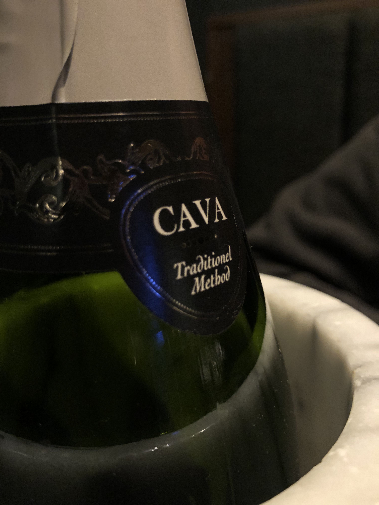

Replying to [@barnlib, @jeninthelib, @marthawells1, @greenjennifer, @DrIbram and @mirdigital](https://twitter.com/barnlib/status/1190287956927483904)

> This thread \(read up and down\) has such a fantastic set of \#FridayReads recommendations, and I’m delighted to be included\!

 [Fri Nov 01 15:32:58 +0000 2019](https://twitter.com/kfitz/status/1190290641755860992)

----

> This week, I cleared a few difficult tasks that have been hanging over my head off my to\-do list\. This weekend, we ran away to a hotel where I’m reading a book and feeling my brain come back to life\. Would recommend\.

 [Sat Nov 02 16:19:18 +0000 2019](https://twitter.com/kfitz/status/1190664691892342786)

----

Replying to [@CJ\_Daugherty](https://twitter.com/CJ_Daugherty/status/1191060695506440193)

> This was once hands\-down my favorite movie ever\.  It hasn’t gotten displaced by anything; it’s just been so long since I’ve seen it that it’s hard to say what my favorite is anymore\.

 [Sun Nov 03 19:28:23 +0000 2019](https://twitter.com/kfitz/status/1191074662131871744)

----

Replying to [@CJ\_Daugherty](https://twitter.com/CJ_Daugherty/status/1191115752545411072)

> Oh, I’m so glad\. I’ll have to put it on the docket\!

 [Sun Nov 03 22:30:45 +0000 2019](https://twitter.com/kfitz/status/1191120556411826178)

----

> Thank you for this hat\-tip and for all your support, @NEH\_ODH\! We have built a community of nearly 19,000 users engaged with humanities scholarship worldwide, sharing work in more than 25 languages\. We could not have done it without you\. https://twitter\.com/NEH\_ODH/status/1191715296865931266

 [Tue Nov 05 14:40:05 +0000 2019](https://twitter.com/kfitz/status/1191726886902210560)

----

> Great indeed\! The work of the university press is generosity made manifest, and its greatness lies in the work it shares, not the profits it might generate\. https://twitter\.com/DeverJustice/status/1192222070521966592

 [Wed Nov 06 23:38:04 +0000 2019](https://twitter.com/kfitz/status/1192224661360300036)

----

Replying to [@ncecire](https://twitter.com/ncecire/status/1192215787806871552)

> Oh fantastic\! Congratulations\!

 [Wed Nov 06 23:43:23 +0000 2019](https://twitter.com/kfitz/status/1192225997824937985)

----

Replying to [@cgoldstead, @ncecire and @JHUPress](https://twitter.com/cgoldstead/status/1192181645786451968)

> This looks so great\!

 [Wed Nov 06 23:43:59 +0000 2019](https://twitter.com/kfitz/status/1192226148866052098)

----

> RT @LAM\_Barrett: \.@usnews lists create just about the most perverse and corrosive incentives possible for schools and this is approximately…

 [Thu Nov 07 00:47:53 +0000 2019](https://twitter.com/kfitz/status/1192242233552068608)

----

> RT @mecanuel: @UICEngagedHuman loved our discussion of @kfitz “Generous Thinking” on Wednesday at @UICHumanities\! Super inspiring book and…

 [Fri Nov 08 21:42:30 +0000 2019](https://twitter.com/kfitz/status/1192920355402321925)

----

> I will confess to having days where I think we’ve more than run our course here, and I wish those that survive our deserved extinction well\. https://twitter\.com/TheDEWLine/status/1192621451179909120

 [Fri Nov 08 21:45:33 +0000 2019](https://twitter.com/kfitz/status/1192921119738748929)

----

Replying to [@sharonmleon](https://twitter.com/sharonmleon/status/1192929980667351041)

> Aaargh no\. I’m so sorry\!

 [Sat Nov 09 01:50:36 +0000 2019](https://twitter.com/kfitz/status/1192982789425119232)

----

> Thank 10 women and keep it going: @nowviskie @terrainsvagues @kmapesy @annetiquate @sharonmleon @BerondaM @katinalynn @moncia @Educopia \(aka Katherine Skinner\) @rrkennison  — genius collaborators and inspirations\. https://twitter\.com/hjoseph/status/1193267163248955393

 [Sat Nov 09 21:24:52 +0000 2019](https://twitter.com/kfitz/status/1193278303639085058)

----

Replying to [@nowviskie, @jmjafrx, @karikraus, @Wribrarian, @LibSkrat, @Mrs\_K, @AnaNdumu, @amplify285, @captain\_maybe, @kshkim, @lmrhody, @wynkenhimself, @aliyareich, @yasmeen\_azadi, @professorcaz, @pmhswe, @mchris4duke, @PetrinaJackso, @pwcdanica and @RPhillipsEsq](https://twitter.com/nowviskie/status/1193299267697426434)

> Such a list\! If only my counting brain had shut itself off for a sec\. ❤️

 [Sat Nov 09 23:02:47 +0000 2019](https://twitter.com/kfitz/status/1193302947251281920)

----

Replying to [@JenHoward, @stanfordpress, @gmbritton and @insidehighered](https://twitter.com/JenHoward/status/1193280414951071744)

> Competitive thinking will be the end of us all\.

 [Sat Nov 09 23:04:12 +0000 2019](https://twitter.com/kfitz/status/1193303302643036162)

----

> RT @cplong: Reflections on October's "Driving Institutional Change for Research Assessment Reform" workshop: No Quality Without Equity\. Tru…

 [Sun Nov 10 15:53:44 +0000 2019](https://twitter.com/kfitz/status/1193557360817721349)

----

> Snow is delightful when you get to watch it from inside\. When I am boss of the world I will decree all snow days to be WFH days\.

 [Mon Nov 11 14:29:33 +0000 2019](https://twitter.com/kfitz/status/1193898562444308483)

----

Replying to [@ekansa, @todrobbins and @ewg118](https://twitter.com/ekansa/status/1193912658816204801)

> Thank you\! Humanities Commons is indeed humming along well: nearly 19,000 users worldwide\. Free, open, not for profit\. We’d be happy to have you there\. http://hcommons\.org

 [Mon Nov 11 15:29:19 +0000 2019](https://twitter.com/kfitz/status/1193913605281857537)

----

Replying to [@ekansa, @todrobbins and @ewg118](https://twitter.com/ekansa/status/1193912658816204801)

> And more exciting things coming soon\. \*cue suspenseful music\*

 [Mon Nov 11 15:30:12 +0000 2019](https://twitter.com/kfitz/status/1193913824136421377)

----

Replying to [@CJ\_Daugherty](https://twitter.com/CJ_Daugherty/status/1193916617689829377)

> You watch those builders, Fulcrum\. ❤️

 [Tue Nov 12 00:03:21 +0000 2019](https://twitter.com/kfitz/status/1194042963753611265)

----

> So looking forward to this visit\! https://twitter\.com/IUImpact/status/1194393231695450117

 [Tue Nov 12 23:24:26 +0000 2019](https://twitter.com/kfitz/status/1194395559441915905)

----

> Christ, what a decade\.

 [Wed Nov 13 00:50:38 +0000 2019](https://twitter.com/kfitz/status/1194417249211310081)

----

Replying to [@lynnegoldstein](https://twitter.com/lynnegoldstein/status/1194417724492931072)

> I wish\.

 [Wed Nov 13 00:54:59 +0000 2019](https://twitter.com/kfitz/status/1194418343966580736)

----

Replying to [@ekansa](https://twitter.com/ekansa/status/1194430904711573504)

> More or less\.

 [Wed Nov 13 01:58:02 +0000 2019](https://twitter.com/kfitz/status/1194434211274510336)

----

Replying to [@annehelen](https://twitter.com/annehelen/status/1194412470569332737)

> Good grief look at the size of Steve\! When did that happen?

 [Wed Nov 13 02:11:31 +0000 2019](https://twitter.com/kfitz/status/1194437606878121989)

----

> RT @gmbritton: @KrisRenn applies @kfitz’s brilliant book, Generous Thinking to the study of Higher Ed studies\. https://jhupbooks\.press\.jhu\.edu/title/generous\-thinking  \#AS…

 [Fri Nov 15 03:31:09 +0000 2019](https://twitter.com/kfitz/status/1195182421374914560)

----

> RT @billhd: Thanks to all who came out for our talk &amp; discussion yesterday\! We are looking forward to the workshop sessions this morning to…

 [Fri Nov 15 16:58:43 +0000 2019](https://twitter.com/kfitz/status/1195385653787320320)

----

> Thanks to everyone at CAHI and IDAH who made this visit so productive and fun\! https://twitter\.com/IUImpact/status/1194393231695450117

 [Fri Nov 15 17:02:01 +0000 2019](https://twitter.com/kfitz/status/1195386484758663168)

----

> Have been thinking about this for two days now\. Would invest in and frequent this establishment\. https://twitter\.com/plragde/status/1195064903243116544

 [Sat Nov 16 22:31:32 +0000 2019](https://twitter.com/kfitz/status/1195831797873086464)

----

Replying to [@plragde and @billhd](https://twitter.com/plragde/status/1195838059796975616)

> Perhaps a plaintive cry from the unconscious, then\.

 [Sat Nov 16 22:57:53 +0000 2019](https://twitter.com/kfitz/status/1195838428799229953)

----

Replying to [@jvinopal](https://twitter.com/jvinopal/status/1195844539979841537)

> Exactly\.

 [Sun Nov 17 00:01:11 +0000 2019](https://twitter.com/kfitz/status/1195854355938844673)

----

Replying to [@jvinopal](https://twitter.com/jvinopal/status/1195860495942737920)

> Yes\! Or maybe even read a book\! \(Looking forward to seeing you\.\)

 [Sun Nov 17 00:31:12 +0000 2019](https://twitter.com/kfitz/status/1195861911050575872)

----

Replying to [@jvinopal](https://twitter.com/kfitz/status/1195861911050575872)

> \(See what devices do? I missed the book in your tweet 😕\)

 [Sun Nov 17 00:32:08 +0000 2019](https://twitter.com/kfitz/status/1195862148603359232)

----

> I often say that I wouldn’t go back to childhood for anything\. I’ve just found an exception\. A friend from high school passed away yesterday\.

 [Sun Nov 17 15:46:06 +0000 2019](https://twitter.com/kfitz/status/1196092153400877057)

----

> He was far and away the most talented of us, but there were aspects of his life that challenged him, and that kept him from living with all the joy he deserved for much too long\.

 [Sun Nov 17 15:46:26 +0000 2019](https://twitter.com/kfitz/status/1196092236372549634)

----

> I don’t know that it would have made a difference, but I wish I had known then what I know now, and that I could go back and be the support I should have been\.

 [Sun Nov 17 15:46:43 +0000 2019](https://twitter.com/kfitz/status/1196092308690735105)

----

> Who is jealous? ME\. https://twitter\.com/Kappadeemom/status/1196515655492755457

 [Mon Nov 18 22:54:31 +0000 2019](https://twitter.com/kfitz/status/1196562355817197568)

----

> RT @ammienoot: An excellent keynote choice in @kfitz If you haven't read her Educause article "Sustainability, Solidarity, and Community in…

 [Tue Nov 19 16:20:06 +0000 2019](https://twitter.com/kfitz/status/1196825484853563394)

----

Replying to [@kfitz](https://twitter.com/mchris4duke/status/1196811386896179200)

> Thanks to both of you for this\! @mchris4duke @juancommander https://twitter\.com/mchris4duke/status/1196811386896179200

 [Tue Nov 19 16:21:04 +0000 2019](https://twitter.com/kfitz/status/1196825729029160960)

----

> RT @terrainsvagues: At \#OpenScienceUN, many mentions of the kind of generous thinking @kfitz puts forward as essential to successful, susta…

 [Tue Nov 19 22:08:47 +0000 2019](https://twitter.com/kfitz/status/1196913236429266944)

----

Replying to [@kristinarola, @Dr\_Poitra, @dlbessette, @msuwrac, @CALMSU, @CANRatMSU and @NativeMSU](https://twitter.com/kristinarola/status/1197187827106222080)

> Congratulations\!\!\! \(That actually deserves a few more exclamation points\!\!\!\!\!\)

 [Wed Nov 20 21:45:35 +0000 2019](https://twitter.com/kfitz/status/1197269784397783043)

----

> RT @jasonrhody: On the 10th anniversary of \#altac, a thread: https://twitter\.com/brettbobley/status/1197165092091125760

 [Thu Nov 21 03:00:45 +0000 2019](https://twitter.com/kfitz/status/1197349096962625537)

----

> RT @nowviskie: Backlash against "\#altac" was always \(I think\) both saddening to folx who used it to build solidarity &amp; push us past "non\-"…

 [Thu Nov 21 14:33:08 +0000 2019](https://twitter.com/kfitz/status/1197523341843693568)

----

> Words come in and out of common usage, sure, but every once in a while I’m caught up short by repeatedly hearing a word that feels otherwise rare\. Lately: “anodyne\.” It’s suddenly everywhere, and I’m curious why\.

 [Thu Nov 21 15:34:19 +0000 2019](https://twitter.com/kfitz/status/1197538739653873666)

----

Replying to [@mannahattamamma](https://twitter.com/mannahattamamma/status/1197540150592593920)

> 🤔

 [Thu Nov 21 16:21:09 +0000 2019](https://twitter.com/kfitz/status/1197550525027209218)

----

Replying to [@ctitusbrown](https://twitter.com/ctitusbrown/status/1197547550171025413)

> \~sigh\~

 [Thu Nov 21 16:21:21 +0000 2019](https://twitter.com/kfitz/status/1197550574767525888)

----

Replying to [@ctitusbrown](https://twitter.com/ctitusbrown/status/1197551296150044673)

> This may be a matter of what I think of as the chartreuse\-VW phenomenon \(i\.e\. you see them everywhere because you’ve started noticing them\)\. This started for me with the Academe review of GT, which used “anodyne” in a way that left me wondering exactly how concerned I should be…

 [Thu Nov 21 16:30:13 +0000 2019](https://twitter.com/kfitz/status/1197552808620199936)

----

> ❤️ https://twitter\.com/micahvandegrift/status/1197558628779118592

 [Thu Nov 21 17:03:06 +0000 2019](https://twitter.com/kfitz/status/1197561085160611841)

----

Replying to [@tressiemcphd](https://twitter.com/tressiemcphd/status/1198731887939850241)

> I’ve been making this with collards and it’s killer\.  
> https://cooking\.nytimes\.com/recipes/1020078\-pressure\-cooker\-lentil\-soup\-with\-sausage?smid\=ck\-recipe\-iOS\-share

 [Sun Nov 24 23:34:49 +0000 2019](https://twitter.com/kfitz/status/1198746824342999040)

----

> RT @humcommons: We've reached a new milestone: 19,000 members\! 
> 
> <video controls><source src="../../media/1198994711089823744-EKOewTyXYAE6DO-.mp4">Your browser does not support the video tag.</video>

 [Mon Nov 25 15:59:50 +0000 2019](https://twitter.com/kfitz/status/1198994711089823744)

----

> Oh my word yes\. This is \(if you’ll forgive me\) part of the argument of Generous Thinking, but leads to a much broader sense in which we would all benefit from SLOWING DOWN and engaging with what’s in front of us rather than always pushing forward to where we’re trying to go\. https://twitter\.com/thiemwork/status/1198988801239990273

 [Mon Nov 25 16:38:01 +0000 2019](https://twitter.com/kfitz/status/1199004322991706112)

----

> Good morning\. A bit of reflection if you can bear it this early in the day: Loss, Shame, Validation, and Work\. https://kfitz\.info/loss\-shame\-validation\-and\-work/

 [Tue Nov 26 12:17:19 +0000 2019](https://twitter.com/kfitz/status/1199301101373313024)

----

Replying to [@martin\_eve](https://twitter.com/martin_eve/status/1199302394946957312)

> Thanks so much, Martin\. That shock and subsequent reflection are really something, in this case coupled with the realization that my peer group is at that age where this starts happening\.

 [Tue Nov 26 12:26:25 +0000 2019](https://twitter.com/kfitz/status/1199303392750899202)

----

Replying to [@BerondaM](https://twitter.com/BerondaM/status/1199306317510385664)

> Thank you, Beronda, and thank you for the crucial model of another way of being\!

 [Tue Nov 26 12:38:51 +0000 2019](https://twitter.com/kfitz/status/1199306522460925952)

----

Replying to [@redbirdred](https://twitter.com/redbirdred/status/1199309885562859520)

> Thank you, Suzanne; I hope sharing this might help someone else as much as thinking through it has helped me\!

 [Tue Nov 26 13:01:01 +0000 2019](https://twitter.com/kfitz/status/1199312101350805505)

----

> RT @jnonfiction: Powerful self\-reflection from @kfitz\. Chasing future \(academic\) validation deadens something necessary to a worthwhile now…

 [Tue Nov 26 17:18:43 +0000 2019](https://twitter.com/kfitz/status/1199376950684291072)

----

> For the post\-noon crowd: a bit of reflection on the ties between the ways I work and the need for external validation, with some hope for better\. https://kfitz\.info/loss\-shame\-validation\-and\-work/

 [Tue Nov 26 17:20:12 +0000 2019](https://twitter.com/kfitz/status/1199377326229745664)

----

Replying to [@profwernimont and @miriamkp](https://twitter.com/profwernimont/status/1199367299582574593)

> Inland Empire\.

 [Tue Nov 26 17:50:14 +0000 2019](https://twitter.com/kfitz/status/1199384883618926592)

----

> I spent a bunch of yesterday thinking about the ways I use work as a source of shame\-escaping validation \(with hat\-tips to @annehelen and @BerondaM\)\. https://kfitz\.info/loss\-shame\-validation\-and\-work/

 [Wed Nov 27 00:33:36 +0000 2019](https://twitter.com/kfitz/status/1199486394768474113)

----

Replying to [@kfitz](https://twitter.com/kfitz/status/1199486394768474113)

> I’m not sure I’m done thinking about it\. Embarking on a long holiday weekend writing retreat; we’ll see what comes\. Happy Thanksgiving, all\.

 [Wed Nov 27 00:35:34 +0000 2019](https://twitter.com/kfitz/status/1199486891344748544)

----

Replying to [@BerondaM](https://twitter.com/BerondaM/status/1199487831258935297)

> Backatcha\!

 [Wed Nov 27 00:40:37 +0000 2019](https://twitter.com/kfitz/status/1199488159098253312)

----

Replying to [@terrainsvagues, @annehelen and @BerondaM](https://twitter.com/terrainsvagues/status/1199514383463911424)

> Thank you\! It’s so hard, but so good to have moments of remembering what it is to slow down enough to let the mess flourish\. ❤️

 [Wed Nov 27 02:35:29 +0000 2019](https://twitter.com/kfitz/status/1199517066568622086)

----

> RT @achdotorg: Looking to publish in the \#digitalhumanities ? The next @DHQuarterly quarterly deadline is January 15th\! https://t\.co/f8QdQd…

 [Wed Nov 27 14:44:37 +0000 2019](https://twitter.com/kfitz/status/1199700558648619009)

----

> We’re looking for great colleagues to help us build the future of ACH\! https://twitter\.com/achdotorg/status/1199674232617213959

 [Wed Nov 27 14:46:08 +0000 2019](https://twitter.com/kfitz/status/1199700943459246080)

----

Replying to [@fraistat](https://twitter.com/fraistat/status/1199717192046120962)

> Thanks so much, Neil\. It means a lot to me\!

 [Wed Nov 27 21:18:03 +0000 2019](https://twitter.com/kfitz/status/1199799571968344064)

----

> Writing retreat has begun as it should\. 
> 
> 

 [Wed Nov 27 22:29:11 +0000 2019](https://twitter.com/kfitz/status/1199817472586723328)

----

Replying to [@BerondaM](https://twitter.com/BerondaM/status/1199818580994469888)

> Yes please\! 😍

 [Wed Nov 27 22:34:11 +0000 2019](https://twitter.com/kfitz/status/1199818729846128640)

----

> I \*really\* look forward to reading this book\! https://twitter\.com/gmbritton/status/1199806888461946880

 [Thu Nov 28 17:03:14 +0000 2019](https://twitter.com/kfitz/status/1200097830188265472)

----

> Reflecting today on the many things for which I am grateful this year, not least the many extremely generous readers which whom I’ve gotten to engage at institutions all over the country\. \+

 [Thu Nov 28 23:08:45 +0000 2019](https://twitter.com/kfitz/status/1200189815020544006)

----

Replying to [@kfitz](https://twitter.com/kfitz/status/1200189815020544006)

> Generous Thinking is only the start of a much\-needed series of conversations\. I’m honored to have gotten to be part of them, and I very much look forward to seeing where we go next\. https://jhupbooks\.press\.jhu\.edu/title/generous\-thinking

 [Thu Nov 28 23:09:14 +0000 2019](https://twitter.com/kfitz/status/1200189937586515976)

----

Replying to [@kfitz](https://twitter.com/kfitz/status/1200189937586515976)

> PS: The discount code HDPD gets you 30% off on anything from my publisher\. Follow @biblioracle’s thread below for many other such small and university press sales\! https://twitter\.com/biblioracle/status/1199321080361562113

 [Thu Nov 28 23:16:30 +0000 2019](https://twitter.com/kfitz/status/1200191766663745536)

----

Replying to [@savasavasava](https://twitter.com/savasavasava/status/1200192230222417920)

> You are the BEST\.

 [Thu Nov 28 23:27:12 +0000 2019](https://twitter.com/kfitz/status/1200194461877309441)

----

Replying to [@savasavasava](https://twitter.com/savasavasava/status/1200196874558414850)

> Oof, sorry :\( I’m glad you have a copy coming, though\!

 [Thu Nov 28 23:42:56 +0000 2019](https://twitter.com/kfitz/status/1200198419396124675)

----

> 💯 https://twitter\.com/roopikarisam/status/1200519624258981889

 [Fri Nov 29 21:03:37 +0000 2019](https://twitter.com/kfitz/status/1200520714392133633)

----

> I \*loved\* this book\. Loved, loved\. loved\. https://twitter\.com/timmaughan/status/1200806084581167105

 [Sat Nov 30 16:12:16 +0000 2019](https://twitter.com/kfitz/status/1200809780635410432)

----

> Those of us who labor in academia have a responsibility and a role to play in the transformation of society, but we are not, and should never aspire to be, Comtian ‘sociological priests,’ giving the people formulas of what the new world should look \.\.\. https://kfitz\.info/30\-november\-2019\-1846/

 [Sun Dec 01 00:39:14 +0000 2019](https://twitter.com/kfitz/status/1200937364119588864)