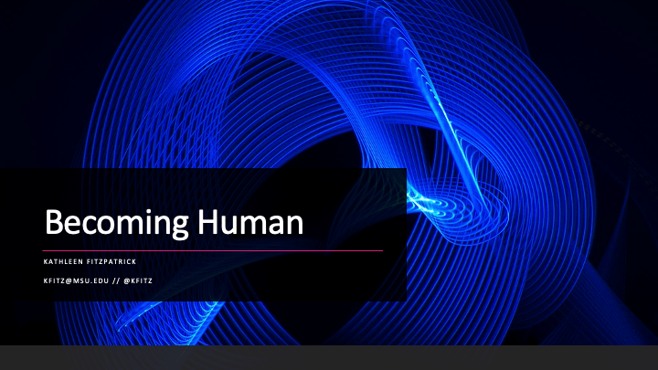
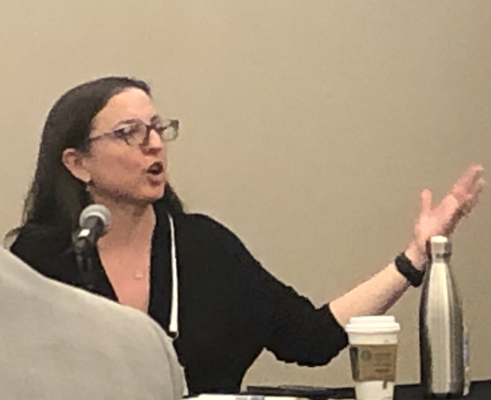
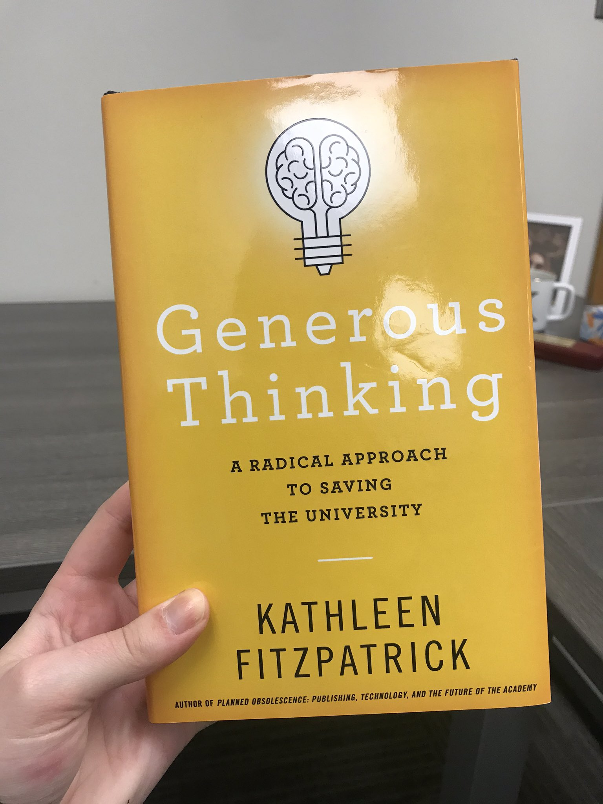

> Headed back into the office tomorrow, briefly at least, for a couple of meetings\. It has been a most delightful break\. Aside from a quick trip south to see some family, DAYS ON END in which I didn’t dress remotely like a grownup\.

 [Thu Jan 02 21:52:52 +0000 2020](https://twitter.com/kfitz/status/1212854296741584896)

----

Replying to [@kfitz](https://twitter.com/kfitz/status/1212854296741584896)

> I worked a lot\! Got a surprise new class planned, wrote a conference presentation and two letters of support, and read a ton\. But all from the comfort of my house, encased in warm stretchy fabrics\.

 [Thu Jan 02 21:55:19 +0000 2020](https://twitter.com/kfitz/status/1212854913979604992)

----

Replying to [@kfitz](https://twitter.com/kfitz/status/1212854913979604992)

> This is my measure of a holiday\.

 [Thu Jan 02 22:00:05 +0000 2020](https://twitter.com/kfitz/status/1212856111843495938)

----

> How amazing it is to get to work in a college with a team of communicators so good at getting the significance of the humanities out into public view\! Huge congratulations, all\. \#MSUCAL https://twitter\.com/CALMSU/status/1212867777591042049

 [Thu Jan 02 22:48:25 +0000 2020](https://twitter.com/kfitz/status/1212868275853516803)

----

Replying to [@billhd and @dot\_soft](https://twitter.com/billhd/status/1212867862601314304)

> Niiiiiice\.

 [Thu Jan 02 22:48:51 +0000 2020](https://twitter.com/kfitz/status/1212868384792166400)

----

Replying to [@plragde](https://twitter.com/plragde/status/1212870933557452801)

> As does not having to talk to people who aren’t also in stretchy fabric mode\.

 [Thu Jan 02 23:04:31 +0000 2020](https://twitter.com/kfitz/status/1212872327249223685)

----

> RT @gmbritton: Looking for a radical approach to saving the university? Check out Generous Thinking by @kfitz https://jhupbooks\.press\.jhu\.edu/title/generous\-thinking @JHUP…

 [Fri Jan 03 02:40:33 +0000 2020](https://twitter.com/kfitz/status/1212926691837980672)

----

> Oh god\. This is really really not good\.

 [Fri Jan 03 03:06:53 +0000 2020](https://twitter.com/kfitz/status/1212933319773560832)

----

> Uh, folks? We can see when someone attempts to game our download counts\. And we can reset them to zero\. \#JustSayNo cc @humcommons

 [Fri Jan 03 18:08:35 +0000 2020](https://twitter.com/kfitz/status/1213160240478334976)

----

Replying to [@mathyawp and @That\_Kreigh](https://twitter.com/mathyawp/status/1213195808947896320)

> Ooh, yours sounds interesting, too\! I’ll have to take a look\. Congratulations on the book’s imminent release \(and 👋🏻 from a former Pomona faculty member\)\!

 [Fri Jan 03 21:15:45 +0000 2020](https://twitter.com/kfitz/status/1213207342038355968)

----

> If you’ll all forgive a little ego\-retweeting…

 [Fri Jan 03 21:17:22 +0000 2020](https://twitter.com/kfitz/status/1213207748835459072)

----

> RT @spinsterofutica: @culanth Kathleen Fitzpatrick \(@kfitz\)'s Generous Thinking reads like a primer for scholarly practice that acknowledge…

 [Fri Jan 03 21:17:25 +0000 2020](https://twitter.com/kfitz/status/1213207760432717826)

----

> RT @JenServenti: \#aha20 \#s43 Scott Libson mentions the work of @kfitz and her new\(ish\) book, "Generous Thinking", in light of how we think…

 [Fri Jan 03 21:17:31 +0000 2020](https://twitter.com/kfitz/status/1213207786399715328)

----

Replying to [@electricarchaeo](https://twitter.com/electricarchaeo/status/1213222846933151748)

> Noooooo\!\!\! \(@ekansa @DEJPett @EthanWatrall We clearly need to do it again\!\)

 [Fri Jan 03 23:27:26 +0000 2020](https://twitter.com/kfitz/status/1213240482274463755)

----

> RT @jonmfrey: Nice to see that @kfitz's books are a frequent reference point in this morning's \#aiascs2020 session in humanities publishing…

 [Sat Jan 04 16:29:59 +0000 2020](https://twitter.com/kfitz/status/1213497814690476035)

----

> I love this\. ❤️ https://twitter\.com/hralperta/status/1213519198636433409

 [Sat Jan 04 19:07:58 +0000 2020](https://twitter.com/kfitz/status/1213537571193708546)

----

> RT @hralperta: Here's how it works: each day, we'll be using quote tweets to share how we're implementing \#GenerousThinking in our teaching…

 [Sat Jan 04 19:08:38 +0000 2020](https://twitter.com/kfitz/status/1213537742321258496)

----

> RT @hralperta: This project is inspired by @kfitz, who calls for a more generous academic practice based on the public good, humanistic val…

 [Sat Jan 04 19:08:45 +0000 2020](https://twitter.com/kfitz/status/1213537768325992452)

----

> RT @hralperta: We invite you to contribute your own generous practices by quote\-tweeting, affirming, and adding to a \#GenerousThinking twee…

 [Sat Jan 04 19:08:49 +0000 2020](https://twitter.com/kfitz/status/1213537787787534336)

----

> RT @hralperta: Today in \#GenerousThinking, I talked with colleagues about the tension between our anger at the academy, and our hope for th…

 [Sat Jan 04 19:09:02 +0000 2020](https://twitter.com/kfitz/status/1213537841965420544)

----

Replying to [@hralperta](https://twitter.com/hralperta/status/1213540885750833153)

> Thank YOU\! I’m excited to see what these conversations surface\.

 [Sat Jan 04 19:38:10 +0000 2020](https://twitter.com/kfitz/status/1213545173579390980)

----

Replying to [@miriamkp](https://twitter.com/miriamkp/status/1213544549374554112)

> My devotion to the cable tie has been overcome by this: https://www\.amazon\.com/Monoprice\-Hook\-Loop\-Fastening\-0\-75\-inch/dp/B004AF9II6/ref\=mp\_s\_a\_1\_6?keywords\=velcro\+tape&qid\=1578166799&sprefix\=velcro\+t&sr\=8\-6

 [Sat Jan 04 19:41:16 +0000 2020](https://twitter.com/kfitz/status/1213545954814709760)

----

> RT @chadhflinn: “I likely have less to teach than I have to learn” what if we took this approach outside of academia and into our whole lif…

 [Sat Jan 04 20:55:04 +0000 2020](https://twitter.com/kfitz/status/1213564523879239680)

----

> RT @EthanWatrall: The United States is a signatory to both The Hague Convention and the Geneva Convention\. Both have stipulations for the p…

 [Sun Jan 05 00:29:00 +0000 2020](https://twitter.com/kfitz/status/1213618364817518600)

----

> RT @EthanWatrall: Guess the open threat of a war crime isn’t covered by Twitter’s TOS

 [Sun Jan 05 00:29:22 +0000 2020](https://twitter.com/kfitz/status/1213618453908774913)

----

> Back in the “this is some serious bullshit” days \(lo, these many days ago\), I never conceived of a  major elected official openly suggesting the imminent commission of war crimes\. Now I don’t even know what to say\.

 [Sun Jan 05 00:47:54 +0000 2020](https://twitter.com/kfitz/status/1213623118046076928)

----

> Keeping unique, distinct passwords on a piece of paper is certainly a better idea than handing them over to a rapacious corporation known for mining user data for profit\. https://twitter\.com/Pinboard/status/1213658750466363392

 [Sun Jan 05 12:30:59 +0000 2020](https://twitter.com/kfitz/status/1213800057574744064)

----

> RT @hralperta: Today in \#GenerousThinking, I'm answering questions in my inbox from graduate students trying to figure out their careers\.…

 [Sun Jan 05 15:36:23 +0000 2020](https://twitter.com/kfitz/status/1213846716279115779)

----

> RT @hralperta: Good morning \#AHA20 and happy conferencing\.   
>   
> I know large humanities conferences can be spaces for anger and fear\. Consider…

 [Sun Jan 05 16:35:55 +0000 2020](https://twitter.com/kfitz/status/1213861695464132610)

----

> This sounds like an amazing class; I’m honored to be included in it\! https://twitter\.com/Desimumbles/status/1213933706601209856

 [Sun Jan 05 21:35:38 +0000 2020](https://twitter.com/kfitz/status/1213937122165563393)

----

> It’s the last day of a brilliant break\. Classes start tomorrow\. So I have spent the afternoon making a fabulous apple\-sweet potato\-caramel pie\. Call it denial if you like\. Delicious denial\.

 [Sun Jan 05 21:42:36 +0000 2020](https://twitter.com/kfitz/status/1213938876223496198)

----

> RT @ava: C’mon, @Jack\. This is a turning point\. You can stop this\. You are now complicit in something much larger if you don’t really look…

 [Sun Jan 05 22:06:25 +0000 2020](https://twitter.com/kfitz/status/1213944867237351425)

----

Replying to [@MaxCMarmor](https://twitter.com/MaxCMarmor/status/1213960033530269703)

> You may\. :\)

 [Sun Jan 05 23:10:35 +0000 2020](https://twitter.com/kfitz/status/1213961018222755840)

----

> RT @hralperta: Collecting and sharing resources to make academic systems less opaque is the primary way I practice \#GenerousThinking\.   
>   
> Opa…

 [Mon Jan 06 18:08:37 +0000 2020](https://twitter.com/kfitz/status/1214247411020791809)

----

> RT @quinnanya: Today in \#GenerousThinking I'm finishing up the reading list for my "Project Management and Ethical Collaboration" course\. S…

 [Mon Jan 06 21:51:55 +0000 2020](https://twitter.com/kfitz/status/1214303609183227905)

----

> RT @hralperta: Contacting ec scholars to tell them you're using their research is generous in the sense of kind \(it makes people feel good\)…

 [Mon Jan 06 21:53:39 +0000 2020](https://twitter.com/kfitz/status/1214304043771793413)

----

> RT @philmiletic: Receiving encouragement for pursuing jobs outside of the professoriate is, I have found, rare\.  
>   
> My \#GenerousThinking pract…

 [Mon Jan 06 21:53:59 +0000 2020](https://twitter.com/kfitz/status/1214304128375173120)

----

> RT @sugaronthegash: April 9th\. CAL's Inaugural Signature Lecture this year\. The esteemed Claudia Rankine\. @CALMSU @MSUEnglish https://t\.co/…

 [Mon Jan 06 21:54:53 +0000 2020](https://twitter.com/kfitz/status/1214304356390096901)

----

> RT @antimony27: @hralperta I've been thinking this through the past few days as I finish up two outlines for my classes this term\. Settled…

 [Tue Jan 07 01:05:54 +0000 2020](https://twitter.com/kfitz/status/1214352424015716352)

----

Replying to [@annehelen](https://twitter.com/annehelen/status/1214634138424102913)

> Ooh, that’s good to know\. Based on a prior tweet of yours I’ve now got reusable produce bags that I love, and have drastically cut down on my paper towel usage with a basket of cheap washcloths\. Plastic wrap is next\!

 [Tue Jan 07 22:42:38 +0000 2020](https://twitter.com/kfitz/status/1214678758990516224)

----

> The Louisiana State Capitol\. Every schoolchild in the state has stuck their fingers in the Huey Long bullet holes\. https://twitter\.com/lorendotorg/status/1214621998040502272

 [Wed Jan 08 13:57:10 +0000 2020](https://twitter.com/kfitz/status/1214908907921039360)

----

Replying to [@LibSkrat, @fletcherdurant and @ZENODO\_ORG](https://twitter.com/LibSkrat/status/1214997802012553218)

> 🤔🤔🤔

 [Wed Jan 08 19:57:07 +0000 2020](https://twitter.com/kfitz/status/1214999494057701377)

----

> RT @humcommons: If you’re in Seattle for \#MLA20, check out the workshop on Humanities Commons and MLA Commons tomorrow, Thursday, 5:15 pm\!…

 [Wed Jan 08 21:02:06 +0000 2020](https://twitter.com/kfitz/status/1215015845275095043)

----

> RT @envynoveritas: I missed yesterday's \#GenerousThinking, so I'm doing two today: for conferences, my answer is always about $$\. So I beg:…

 [Wed Jan 08 21:47:32 +0000 2020](https://twitter.com/kfitz/status/1215027279790776321)

----

Replying to [@terrainsvagues](https://twitter.com/terrainsvagues/status/1215053227491778560)

> It’s pretty amazing, isn’t it? A former student of mine from a million years ago was executive producer on season 1\!

 [Wed Jan 08 23:42:49 +0000 2020](https://twitter.com/kfitz/status/1215056293213491200)

----

Replying to [@terrainsvagues](https://twitter.com/terrainsvagues/status/1215057177087561729)

> Me too\. I was honestly wondering how they’d sustain the structure through season 2, but boy did they\.

 [Wed Jan 08 23:59:31 +0000 2020](https://twitter.com/kfitz/status/1215060497139146759)

----

> RT @mimwinick: Also today beginning to share sessions at \#MLA20 that are doing \#GenerousThinking, like this one from Scholars for Ethical R…

 [Thu Jan 09 11:37:03 +0000 2020](https://twitter.com/kfitz/status/1215236034801303553)

----

> About to board for Seattle and \#mla20\. Looking forward to seeing so many friends, old and new, and participating in all the \#GenerousThinking taking place there\. ❤️

 [Thu Jan 09 12:44:14 +0000 2020](https://twitter.com/kfitz/status/1215252943152254976)

----

> So looking forward to talking with you\! https://twitter\.com/mary\_churchill/status/1215225801781776384

 [Thu Jan 09 18:31:52 +0000 2020](https://twitter.com/kfitz/status/1215340428062609411)

----

> Panelists at \#mla20 \#s76, Being Human in DH Project Management, including @dr\_heil  and @laurabrarian, pointing to the work being done by @hralperta and colleagues in \#GenerousThinking\. ❤️❤️❤️

 [Thu Jan 09 22:29:29 +0000 2020](https://twitter.com/kfitz/status/1215400225663266817)

----

> RT @hralperta: Today's \#GenerousThinking practice is to tweet some of the exciting ideas I'm encountering at \#MLA2020, focusing on a genero…

 [Thu Jan 09 22:31:20 +0000 2020](https://twitter.com/kfitz/status/1215400691755147264)

----

> RT @humcommons: Wondering how you can make the most of the Commons during \#mla20? Here are a few ideas\!

 [Thu Jan 09 22:53:18 +0000 2020](https://twitter.com/kfitz/status/1215406218249830404)

----

> RT @terrainsvagues: Upload your syllabus to http://hcommons\.org/core, urges @triproftri \#MLA20 \(Can’t argue with that\)

 [Thu Jan 09 23:02:29 +0000 2020](https://twitter.com/kfitz/status/1215408528359190530)

----

Replying to [@briancroxall](https://twitter.com/briancroxall/status/1215430371946295296)

> And given the cost of a/v, which is prohibitive\. Maybe mobile mics would be better?

 [Fri Jan 10 00:41:01 +0000 2020](https://twitter.com/kfitz/status/1215433326770548736)

----

Replying to [@briancroxall and @MLAconvention](https://twitter.com/briancroxall/status/1215433615883943936)

> I actually meant getting the a/v folks to provide wireless mics that can move around the room instead of wired ones\.\.\.

 [Fri Jan 10 00:54:57 +0000 2020](https://twitter.com/kfitz/status/1215436831677747202)

----

> Folks, @Educopia is hiring an administrative coordinator\. Please share this with great candidates\! 
> 
> 

 [Fri Jan 10 16:12:07 +0000 2020](https://twitter.com/kfitz/status/1215667644239503361)

----

Replying to [@BerondaM](https://twitter.com/BerondaM/status/1215666466642526208)

> This has got to be hard, Beronda\. Sending you all the best…

 [Fri Jan 10 16:13:54 +0000 2020](https://twitter.com/kfitz/status/1215668096867827712)

----

> Good morning \#mla20\! I am operating on alarmingly little sleep but a lot of caffeine, and so am gearing up for \#s270, The Ethics of Pedagogy: What Do We Owe Our Students? Today at noon in WSCC 607\!

 [Fri Jan 10 18:42:15 +0000 2020](https://twitter.com/kfitz/status/1215705428148908032)

----

> RT @humcommons: In addition to making your work available to those not able to attend, your CORE deposit can serve as a digital access copy…

 [Fri Jan 10 22:23:31 +0000 2020](https://twitter.com/kfitz/status/1215761111351357440)

----

> In WSCC 6A for \#mla20 \#s339, Keywords for the Future\. Amazing lineup talking about the future of ethnic studies, race, and culture\.

 [Fri Jan 10 23:35:11 +0000 2020](https://twitter.com/kfitz/status/1215779148032954368)

----

> RT @amandalicastro: I want the \#hcplatypus but I also want to encourage everyone at \#mla20 to use @humcommons https://hcommons\.org/members/alicastro/ https…

 [Sat Jan 11 00:08:50 +0000 2020](https://twitter.com/kfitz/status/1215787617557499904)

----

> RT @brettbobley: That's an excellent platypus\! Also: Everyone should sign up for a Humanities Commons account\. It is free\. Run by scholars,…

 [Sat Jan 11 00:14:26 +0000 2020](https://twitter.com/kfitz/status/1215789024478224385)

----

> About to get started with \#s388, Being Human, Seeming Human, in Sheraton Metropolitan A\. Come join us and hear about conversational agents, ethics, and the humanities\! \#mla20

 [Sat Jan 11 01:17:09 +0000 2020](https://twitter.com/kfitz/status/1215804809233592320)

----

> RT @alnthomas: Animal lovers of \#MLA20, come see Violet, one of photographer @IsaLeshko’s ELDERLY ANIMALS at the @UChicagoPress exhibit\. \#a…

 [Sat Jan 11 21:46:49 +0000 2020](https://twitter.com/kfitz/status/1216114263862890496)

----

> By request, my presentation from yesterday's \#mla20 \#s388 session: Becoming Human\. https://kfitz\.info/becoming\-human/ 
> 
> 

 [Sat Jan 11 22:02:38 +0000 2020](https://twitter.com/kfitz/status/1216118242877542401)

----

> RT @amandalicastro: I won a \#HCplatypus from @humcommons at \#mla20 😍 
> 
> 

 [Sat Jan 11 23:28:54 +0000 2020](https://twitter.com/kfitz/status/1216139954557837313)

----

> cc \#mla20: Missing a coat? Check with @MLAnews HQ\! https://twitter\.com/TeresaMangum/status/1216136371389075456

 [Sat Jan 11 23:30:38 +0000 2020](https://twitter.com/kfitz/status/1216140391054856192)

----

Replying to [@hralperta](https://twitter.com/hralperta/status/1216363069028220930)

> Oh good grief\. 🤦🏻‍♀️

 [Sun Jan 12 15:27:45 +0000 2020](https://twitter.com/kfitz/status/1216381257753321472)

----

> RT @hralperta: Generous Thinking means a lot more than being nice: it means more serious and productive engagement with serious problems in…

 [Sun Jan 12 15:31:08 +0000 2020](https://twitter.com/kfitz/status/1216382106714005504)

----

> Heading back to Michigan grateful for the conversations I got to have at \#mla20\. Thanks to so many amazing colleagues for your generosity and commitment to forging a better path\. Looking forward to continuing the work at @humcommons and elsewhere\!

 [Sun Jan 12 22:39:44 +0000 2020](https://twitter.com/kfitz/status/1216489967746109440)

----

Replying to [@CathyNDavidson and @humcommons](https://twitter.com/CathyNDavidson/status/1216496180655378432)

> Absolutely\. Sorry I missed you, too\! Safe travels\.

 [Sun Jan 12 23:23:56 +0000 2020](https://twitter.com/kfitz/status/1216501094026809354)

----

Replying to [@tressiemcphd](https://twitter.com/tressiemcphd/status/1216523490930675713)

> They do this in NYC, but there blue mailboxes with logos and labels take outgoing mail and browny\-green ones with no labels are for dropping sacks of mail for carriers to distribute\.

 [Mon Jan 13 00:55:59 +0000 2020](https://twitter.com/kfitz/status/1216524258182078464)

----

> RT @viroviacum: bepress, KU, F1000 Research \- I spent part of Sunday afternoon rewatching @kfitz 's keynote at https://www\.cni\.org/events/membership\-meetings/past\-meetings/spring\-2019/plenary\-sessions\-s19 to r…

 [Mon Jan 13 11:14:27 +0000 2020](https://twitter.com/kfitz/status/1216679900406517761)

----

> 💯 https://twitter\.com/paigecmorgan/status/1216432114909888514

 [Mon Jan 13 14:21:01 +0000 2020](https://twitter.com/kfitz/status/1216726850392731649)

----

Replying to [@martin\_eve](https://twitter.com/martin_eve/status/1216725402472931328)

> I share that incredulity\. :\)

 [Mon Jan 13 14:22:38 +0000 2020](https://twitter.com/kfitz/status/1216727258808967168)

----

Replying to [@katinalynn, @kwissoker and @DukePress](https://twitter.com/katinalynn/status/1216733064673579008)

> You should be proud and excited\! I can’t wait to see how it turned out\. Blow your horn, for all of us whom the book will help\!

 [Mon Jan 13 18:41:32 +0000 2020](https://twitter.com/kfitz/status/1216792412787339264)

----

> 👋🏻 https://twitter\.com/amandalicastro/status/1216745669970493442

 [Mon Jan 13 18:49:32 +0000 2020](https://twitter.com/kfitz/status/1216794423201132544)

----

> Brilliant, and dead on\. “Are you okay, English departments?” https://twitter\.com/kwazana/status/1217134966397554688

 [Wed Jan 15 15:02:14 +0000 2020](https://twitter.com/kfitz/status/1217461998633594880)

----

> I’m honored to be included in this thread on the wonder that is the @JHUPress list\! https://twitter\.com/crystal\_b\_lake/status/1217466360273539073

 [Wed Jan 15 15:27:58 +0000 2020](https://twitter.com/kfitz/status/1217468472994738186)

----

Replying to [@JHUPress](https://twitter.com/kfitz/status/1217468472994738186)

> PS: @crystal\_b\_lake’s Artifacts looks amazing\! https://jhupbooks\.press\.jhu\.edu/title/artifacts

 [Wed Jan 15 15:29:39 +0000 2020](https://twitter.com/kfitz/status/1217468900268486657)

----

Replying to [@jwolman](https://twitter.com/jwolman/status/1217260667465388033)

> We did\! I don’t remember whether Robocop was on the list but the others definitely were\.

 [Wed Jan 15 17:41:55 +0000 2020](https://twitter.com/kfitz/status/1217502183958036480)

----

> RT @James\_A\_Benn: Plenty of room @humcommons for the rest of you cool kids\. https://twitter\.com/djbuddha/status/1217481579292839936

 [Wed Jan 15 19:29:11 +0000 2020](https://twitter.com/kfitz/status/1217529177387094016)

----

> RT @Educopia: NOW HIRING: Community Liaison for the “Developing a Pilot Data Trust for Open Access Ebook Usage” project\!  
>   
> If you excel at b…

 [Wed Jan 15 20:37:23 +0000 2020](https://twitter.com/kfitz/status/1217546340961402882)

----

> RT @christymtidwell: Reading Generous Thinking by @kfitz: "We may no longer promote exclusion and oppression in training state citizens, bu…

 [Wed Jan 15 23:52:20 +0000 2020](https://twitter.com/kfitz/status/1217595400699465729)

----

> With enormous thanks to @NEHgov, we're celebrating our Infrastructure and Capacity Building Challenge grant at Humanities Commons\! @humcommons https://kfitz\.info/infrastructure\-and\-capacity\-building/

 [Thu Jan 16 15:36:45 +0000 2020](https://twitter.com/kfitz/status/1217833073544499201)

----

Replying to [@ekansa, @NEHgov and @humcommons](https://twitter.com/ekansa/status/1217833422644637696)

> Thank you\! If you have advice on that fundraising part, I’d love to talk…

 [Thu Jan 16 15:39:52 +0000 2020](https://twitter.com/kfitz/status/1217833856067178496)

----

Replying to [@dmcampbellwsu, @NEHgov and @humcommons](https://twitter.com/dmcampbellwsu/status/1217835830946828288)

> Thank you\!

 [Thu Jan 16 15:51:58 +0000 2020](https://twitter.com/kfitz/status/1217836903317168128)

----

> My colleagues here at @CALMSU are also helping celebrate the @NEHgov Infrastructure and Capacity Building Challenge grant for @humcommons\! http://www\.cal\.msu\.edu/news/neh\-grant\-supports\-humanities\-commons\-one\-kind\-humanities\-resource

 [Thu Jan 16 16:16:32 +0000 2020](https://twitter.com/kfitz/status/1217843086379737088)

----

> RT @hralperta: When I think about what \#GenerousThinking means to me, I think about work like this: about people organizing for institution…

 [Thu Jan 16 18:12:11 +0000 2020](https://twitter.com/kfitz/status/1217872189002641408)

----

> RT @CALMSU: The @humcommons, led by @MSUEnglish Professor and \#MSU Digital Humanities @kfitz, has received a $500,000 NEH grant to further…

 [Thu Jan 16 18:30:39 +0000 2020](https://twitter.com/kfitz/status/1217876836186591232)

----

Replying to [@tressiemcphd](https://twitter.com/tressiemcphd/status/1217856119038717952)

> Huge congratulations\!

 [Thu Jan 16 19:41:45 +0000 2020](https://twitter.com/kfitz/status/1217894727724359680)

----

Replying to [@kristinarola, @sharonmleon and @humcommons](https://twitter.com/kristinarola/status/1217905617509089281)

> Thank you\!\!\!

 [Thu Jan 16 20:30:02 +0000 2020](https://twitter.com/kfitz/status/1217906880401399810)

----

Replying to [@tressiemcphd](https://twitter.com/tressiemcphd/status/1217906242401775622)

> Wonderful choice\! \(And not incidentally, \*love\* that jacket\.\)

 [Thu Jan 16 20:31:55 +0000 2020](https://twitter.com/kfitz/status/1217907354773049344)

----

Replying to [@tressiemcphd](https://twitter.com/tressiemcphd/status/1217907910908489732)

> Seriously\.

 [Thu Jan 16 20:34:26 +0000 2020](https://twitter.com/kfitz/status/1217907989232775168)

----

Replying to [@pubkat](https://twitter.com/pubkat/status/1217908464627765248)

> Thank you\!

 [Thu Jan 16 21:32:23 +0000 2020](https://twitter.com/kfitz/status/1217922571330564108)

----

Replying to [@mkgold, @NEHgov and @humcommons](https://twitter.com/mkgold/status/1217919776812683272)

> Thank you\! I mean it literally when I say that we could not have done it without you and @cunycommons\!

 [Fri Jan 17 01:27:34 +0000 2020](https://twitter.com/kfitz/status/1217981758295154689)

----

Replying to [@DeanJimBerg, @NEHgov and @humcommons](https://twitter.com/DeanJimBerg/status/1217920012180172807)

> Ahahahaha thank you\!

 [Fri Jan 17 01:27:48 +0000 2020](https://twitter.com/kfitz/status/1217981815174127616)

----

Replying to [@jeroenson, @NEHgov and @humcommons](https://twitter.com/jeroenson/status/1217927044522221568)

> Thank you — we’re super excited\.

 [Fri Jan 17 01:28:24 +0000 2020](https://twitter.com/kfitz/status/1217981965971922946)

----

Replying to [@JustusNieland, @humcommons, @MSUEnglish and @CALMSU](https://twitter.com/JustusNieland/status/1217948635377340416)

> Thank you\!\! Looking forward to seeing what we can do\.

 [Fri Jan 17 01:29:02 +0000 2020](https://twitter.com/kfitz/status/1217982124910960642)

----

Replying to [@TeresaMangum](https://twitter.com/TeresaMangum/status/1217951644173979648)

> Thank you, Teresa\! So good to see you in Seattle, if way too briefly\.

 [Fri Jan 17 01:29:33 +0000 2020](https://twitter.com/kfitz/status/1217982256628805632)

----

Replying to [@brettbobley, @NEHgov and @humcommons](https://twitter.com/brettbobley/status/1217907781665271811)

> Thanks so much for this, Brett\. Our communications team at @CALMSU is amazing\. :\)

 [Fri Jan 17 01:38:33 +0000 2020](https://twitter.com/kfitz/status/1217984519015411712)

----

Replying to [@EthanWatrall](https://twitter.com/EthanWatrall/status/1218185066095890432)

> I am still awaiting the naming of the Vanderwahl Family Three\-Pronged Outlet\.

 [Fri Jan 17 16:55:40 +0000 2020](https://twitter.com/kfitz/status/1218215322542473216)

----

> This is beyond important, and super\-smart\. https://twitter\.com/NBedera/status/1217893350436569088

 [Fri Jan 17 23:34:51 +0000 2020](https://twitter.com/kfitz/status/1218315780720332801)

----

> RT @TimMcKayUM: \#Booksof2020 @kfitz's "Generous Thinking" \- argues convincingly that competition and scarcity are two sides of the same coi…

 [Sun Jan 19 01:04:52 +0000 2020](https://twitter.com/kfitz/status/1218700818867793922)

----

> RT @hralperta: But today in \#GenerousThinking, I'm trying to be sensitive to my faith that the future of the humanities is one that breaks…

 [Sun Jan 19 02:01:19 +0000 2020](https://twitter.com/kfitz/status/1218715024581124096)

----

> RT @quinnanya: @ADHOrg And tying it back to the ideas of public engagement in \#GenerousThinking, what would a Twitter conference look like…

 [Sun Jan 19 19:37:20 +0000 2020](https://twitter.com/kfitz/status/1218980781332344834)

----

> RT @humcommons: The team behind Humanities Commons is looking for ways to facilitate more engagement for more scholars\. We hope you'll tell…

 [Tue Jan 21 14:51:07 +0000 2020](https://twitter.com/kfitz/status/1219633527567929344)

----

> RT @hralperta: Vulnerability is something I've been thinking about a lot too\. \#GenerousThinking  
>   
> In terms of academia, I have never really…

 [Tue Jan 21 20:20:08 +0000 2020](https://twitter.com/kfitz/status/1219716328333832192)

----

> RT @envynoveritas: I have been thinking about vulnerability \(emotional and intellectual\) as a choice that can come from \#GenerousThinking\.…

 [Tue Jan 21 20:20:38 +0000 2020](https://twitter.com/kfitz/status/1219716455500935168)

----

> I have rediscovered something this semester: the beauty of teaching intro classes\. First\-year writing\. Intro to literary studies\. It is \*delightful\*\.

 [Tue Jan 21 21:56:14 +0000 2020](https://twitter.com/kfitz/status/1219740510610427904)

----

Replying to [@kfitz](https://twitter.com/kfitz/status/1219740510610427904)

> It’s also without doubt this particular bunch of students, who are eager, invested, amazing\. But it’s the class, too: getting to walk them slowly into the hows and whys\. I love it\.

 [Tue Jan 21 21:59:23 +0000 2020](https://twitter.com/kfitz/status/1219741303614910465)

----

Replying to [@nancybaym](https://twitter.com/nancybaym/status/1219740903742590977)

> I believe it\. And I believe that class would have been \*amazing\* with your mom\!

 [Tue Jan 21 22:00:03 +0000 2020](https://twitter.com/kfitz/status/1219741471596777472)

----

Replying to [@kfitz](https://twitter.com/kfitz/status/1219741303614910465)

> I may do this every year from now on\. It feels that good to be opening up something new\.

 [Tue Jan 21 22:01:17 +0000 2020](https://twitter.com/kfitz/status/1219741784055734277)

----

Replying to [@nancybaym](https://twitter.com/nancybaym/status/1219746143095197697)

> Argh, so hard\. I have to believe a lot of it osmosised into you\.

 [Tue Jan 21 23:02:44 +0000 2020](https://twitter.com/kfitz/status/1219757248853028865)

----

Replying to [@hralperta](https://twitter.com/hralperta/status/1220002732771356672)

> Not at all\! It’s far better than any condensation I could have come up with\!

 [Wed Jan 22 15:20:42 +0000 2020](https://twitter.com/kfitz/status/1220003361727975425)

----

> RT @hralperta: We're two weeks into \#GenerousThinking, a conversation about the small ways that those of us with relatively limited institu…

 [Wed Jan 22 15:20:50 +0000 2020](https://twitter.com/kfitz/status/1220003396486189056)

----

> On my way to \#AACU20 at last\. I’ve missed a lot there, but I did not want to miss class with my amazing students this afternoon\.

 [Thu Jan 23 22:22:46 +0000 2020](https://twitter.com/kfitz/status/1220471967435972608)

----

Replying to [@miriamkp](https://twitter.com/miriamkp/status/1220505927968645120)

> Oh my god\. I was at a meeting last year with two people from another institution sitting opposite me\. One looked at the other’s laptop screen and shook his head\. So the other turned it around to show me\. SMILING\.

 [Fri Jan 24 00:42:56 +0000 2020](https://twitter.com/kfitz/status/1220507241008242688)

----

Replying to [@miriamkp](https://twitter.com/miriamkp/status/1220505927968645120)

> It was layers and layers of files of all varieties\. I literally gasped aloud, and my heart rate went through the roof\.

 [Fri Jan 24 00:43:47 +0000 2020](https://twitter.com/kfitz/status/1220507453693087746)

----

Replying to [@miriamkp](https://twitter.com/miriamkp/status/1220505927968645120)

> He swore he knew where everything was\. 😳

 [Fri Jan 24 00:44:12 +0000 2020](https://twitter.com/kfitz/status/1220507558198333441)

----

Replying to [@miriamkp](https://twitter.com/miriamkp/status/1220507560165265408)

> EXACTLY\. He took such pleasure in my reaction\!

 [Fri Jan 24 00:45:27 +0000 2020](https://twitter.com/kfitz/status/1220507871005347841)

----

> RT @aacu: "I don't think there are shortcuts to the development of community\. It's hard work\." \-\-@kfitz \#AACU20 
> 
> 

 [Fri Jan 24 20:24:15 +0000 2020](https://twitter.com/kfitz/status/1220804527479234561)

----

> Quoting @jadedid here\! https://twitter\.com/Profrehn/status/1220793163750813696

 [Fri Jan 24 20:24:51 +0000 2020](https://twitter.com/kfitz/status/1220804679019507713)

----

> “Instead, we should fight to ensure that the employment conditions we consider our due — such as just\-cause instead of at\-will dismissal — become the norm for the economy as a whole\.” https://www\.chronicle\.com/interactives/tenure\-is\-not\-worth\-fighting\-for?key\=mi0Bff1vaLHL09\_no2Emg3\-XVCoi\-OHVsPM3TyRC7UCtXCc\-E1W\-TZYkSbCj\-22mZFhVMHNESWJJUHk4Z05GVWIyd0hSYjVxZTFvd2pkc2g2aGJ5cjBfVnN1dw

 [Sat Jan 25 17:23:35 +0000 2020](https://twitter.com/kfitz/status/1221121450628784128)

----

Replying to [@kfitz](https://twitter.com/kfitz/status/1221121450628784128)

> The protections of tenure may well be worth defending, but not for a limited few\. Either we fight to extend those benefits to all categories of academic employment or we are complicit in the current system’s spreading inequities\.

 [Sat Jan 25 17:29:27 +0000 2020](https://twitter.com/kfitz/status/1221122927552335883)

----

Replying to [@martin\_eve](https://twitter.com/martin_eve/status/1221123067793022977)

> Exactly\.

 [Sat Jan 25 17:32:32 +0000 2020](https://twitter.com/kfitz/status/1221123703469223936)

----

> RT @davidstaley8: Just before our session "After the University" at @AACU2020\.  Three minutes later we were standing room only\.  Gratifying…

 [Sun Jan 26 00:04:32 +0000 2020](https://twitter.com/kfitz/status/1221222351884472327)

----

> RT @JulianChambliss: I'm back with another season of Reframing History\. Season 2 grows from conversations in Season 1\. What about Digital H…

 [Sun Jan 26 18:54:52 +0000 2020](https://twitter.com/kfitz/status/1221506810177359878)

----

> RT @jgrrrace: So saddened to hear about the devasting fire @mocanyc archives suffered\. Please consider contributing to their recovery fund:…

 [Sun Jan 26 19:39:39 +0000 2020](https://twitter.com/kfitz/status/1221518077671694336)

----

> RT @K\_Lechman: Excited for my next read\- authored by a fellow spartan\! @kfitz 
> 
> 

 [Mon Jan 27 14:28:35 +0000 2020](https://twitter.com/kfitz/status/1221802184821489665)

----

> RT @davidstaley8: Wonderful writeup in Inside Higher Ed of our AAC&amp;U session on imagining what's next "After the University" @kfitz @Johann…

 [Mon Jan 27 14:28:43 +0000 2020](https://twitter.com/kfitz/status/1221802218992484353)

----

Replying to [@hkpmcgregor and @martin\_eve](https://twitter.com/hkpmcgregor/status/1221704547267014656)

> I’m extremely interested in this conversation\. I’ve wondered recently how a network like @humcommons might provide a space for such alternatives — but even more importantly, how we can get scholars to commit to participating in it\.

 [Mon Jan 27 16:43:47 +0000 2020](https://twitter.com/kfitz/status/1221836208042459136)

----

Replying to [@hkpmcgregor and @martin\_eve](https://twitter.com/hkpmcgregor/status/1221704547267014656)

> We could, for instance, create a conference group and have scholars share papers with that group, but I’d think we’d want a robust mode of discussion\. Not live chat, perhaps, but a commitment to participating in threaded responses…

 [Mon Jan 27 16:45:28 +0000 2020](https://twitter.com/kfitz/status/1221836633101623296)

----

Replying to [@hkpmcgregor and @martin\_eve](https://twitter.com/hkpmcgregor/status/1221844513422921729)

> That’s absolutely right\. There’s also the danger that often crops up when a face\-to\-face conference is in your own town: local requirements can often make it hard to keep the occasion a priority\.

 [Mon Jan 27 17:29:12 +0000 2020](https://twitter.com/kfitz/status/1221847637772533760)

----

Replying to [@hkpmcgregor and @martin\_eve](https://twitter.com/hkpmcgregor/status/1221861935487934464)

> I like this idea as well\! I’d be happy to work on this\.

 [Mon Jan 27 18:34:53 +0000 2020](https://twitter.com/kfitz/status/1221864168015269888)

----

> RT @cplong: As @kfitz reminds us: “‘shortcuts’ to building community don’t exist\.” Building trust through authentic relationships is the lo…

 [Mon Jan 27 18:49:31 +0000 2020](https://twitter.com/kfitz/status/1221867850400292864)

----

Replying to [@crsbecker](https://twitter.com/crsbecker/status/1221817629460946945)

> Oh no\! I’m so sorry\. I have so enjoyed following Gus here\. 🙁

 [Mon Jan 27 18:54:28 +0000 2020](https://twitter.com/kfitz/status/1221869097182359552)

----

> RT @gmbritton: Looking for a Radical Approach for Saving the University? @kfitz has an idea\. https://www\.insidehighered\.com/news/2020/01/27/discussion\-about\-future\-academy\#disqus\_thread https://t\.co/yf0cwBcaG…

 [Mon Jan 27 18:54:50 +0000 2020](https://twitter.com/kfitz/status/1221869188693651458)

----

> I know I said I wasn’t going to say it anymore\. But THIS? Is some serious bullshit\. https://twitter\.com/GregStohr/status/1221861932929601536

 [Mon Jan 27 22:19:49 +0000 2020](https://twitter.com/kfitz/status/1221920775059492864)

----

Replying to [@tressiemcphd](https://twitter.com/tressiemcphd/status/1221939905133260801)

> I was watching you engage with a bunch of folx arguing with you about whether somebody should pay something they considered rent or not and kind of marveled at your ability to maintain\. I will now assume that was Sudafed in action\.

 [Mon Jan 27 23:52:15 +0000 2020](https://twitter.com/kfitz/status/1221944037235662849)

----

Replying to [@pfyfe and @whitneytrettien](https://twitter.com/pfyfe/status/1222226559207010304)

> Ha\! A solid example of me mouthing off on the internet\. Not too long after, I found myself appointed to the MLA’s program committee, and a little bit later employed by it\.\.\.

 [Tue Jan 28 18:42:48 +0000 2020](https://twitter.com/kfitz/status/1222228546845724672)

----

Replying to [@pfyfe and @whitneytrettien](https://twitter.com/pfyfe/status/1222228986031296512)

> I wouldn’t say it changed my mind\. I think it gave me space to change the org, at least a little\.

 [Tue Jan 28 18:47:45 +0000 2020](https://twitter.com/kfitz/status/1222229794550476800)

----

> Oh, wow\. I’m teaching Fairview in a few weeks\. And I’m dying to see this\! https://twitter\.com/obsidiantheatre/status/1222172751932416001

 [Tue Jan 28 18:50:21 +0000 2020](https://twitter.com/kfitz/status/1222230448299864064)

----

Replying to [@whitneytrettien, @pfyfe and @mlmcgill](https://twitter.com/whitneytrettien/status/1222234981902290945)

> That is SUPER kind — thank you\!

 [Tue Jan 28 19:17:00 +0000 2020](https://twitter.com/kfitz/status/1222237156027990016)

----

> I’ve been meaning to share my Foundations of Literary Studies syllabus, and so have at last uploaded it to @humcommons:  http://dx\.doi\.org/10\.17613/yzp3\-zt84\. The class focuses on gender, race, and genre\. And I am having the BEST time\.

 [Tue Jan 28 20:26:40 +0000 2020](https://twitter.com/kfitz/status/1222254688063475712)

----

Replying to [@kfitz](https://twitter.com/kfitz/status/1222254688063475712)

> Includes work by @ClaudRankine @hgravendyk @jackiesdrury @tressiemcphd @jiatolentino @EmilyMandel and @nkjemisin, plus Clare Barron whom I cannot find here\.

 [Tue Jan 28 20:31:36 +0000 2020](https://twitter.com/kfitz/status/1222255927287406592)

----

Replying to [@sharonmleon](https://twitter.com/sharonmleon/status/1222306215751045120)

> Story of my life; or at least my last four months\. I wish you better luck sorting it than I have managed\!

 [Wed Jan 29 00:01:01 +0000 2020](https://twitter.com/kfitz/status/1222308631632322561)

----

> RT @mocanyc: There are indicators we might be able to salvage some of the MOCA archives\. Thank you to all the volunteers who mobilized quic…

 [Wed Jan 29 12:53:30 +0000 2020](https://twitter.com/kfitz/status/1222503032484700160)

----

> RT @gmbritton: I’m excited we’ll be sponsoring the “Rocking the Academy” podcast for its second season\. It’s smart, challenging, and totall…

 [Fri Jan 31 12:42:53 +0000 2020](https://twitter.com/kfitz/status/1223225134124847104)

----

> I had a fabulous conversation with @roopikarisam and @mary\_churchill, which continued with a bit of post\-recording dish\. I can’t wait to hear how it turned out\! \(And perhaps I’ll write about some of that dish soon\.\) https://twitter\.com/roopikarisam/status/1223019045479485447

 [Fri Jan 31 12:48:02 +0000 2020](https://twitter.com/kfitz/status/1223226431456542720)