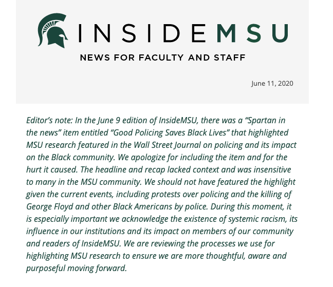
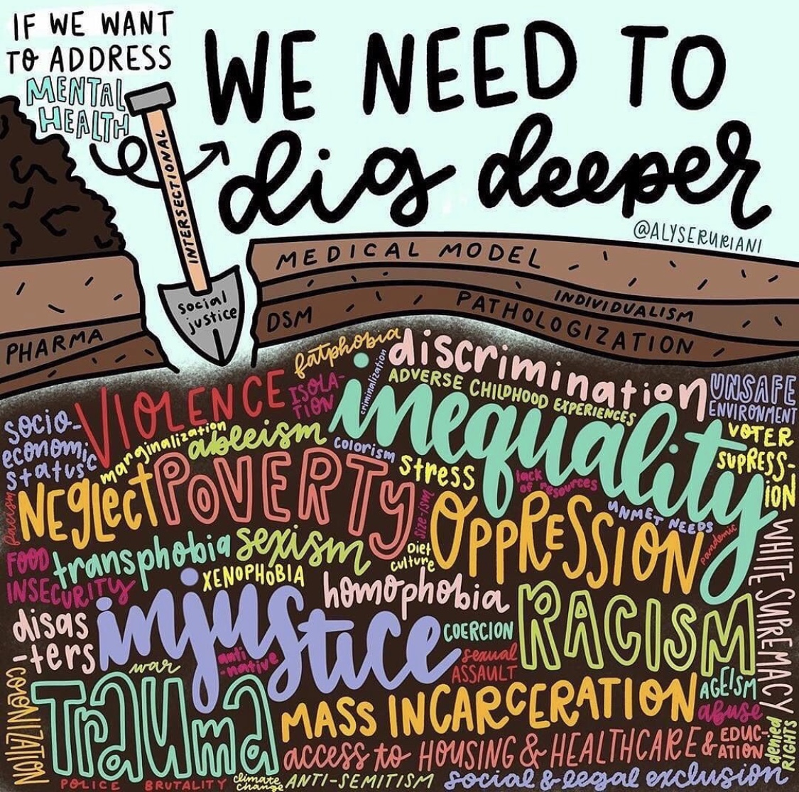

Replying to [@kristinarola](https://twitter.com/kristinarola/status/1267439849302302722)

> Oh, Ms\. Enid\. What a good girl\. 🙁

 [Mon Jun 01 14:28:23 +0000 2020](https://twitter.com/kfitz/status/1267463003877842944)

----

> I am sad, and furious, and despairing\. And I know so many of you are feeling that so much more, and have been for so much longer\. I see you, and I am sorry\. And I am working on ways to do better for us all\.

 [Mon Jun 01 19:36:23 +0000 2020](https://twitter.com/kfitz/status/1267540518256480257)

----

> RT @CarlosLozadaWP: The top two bestselling books on Amazon right now:  
> 1\) WHITE FRAGILITY by Robin DiAngelo  
> 2\) HOW TO BE AN ANTIRACIST by ⁦…

 [Tue Jun 02 21:51:58 +0000 2020](https://twitter.com/kfitz/status/1267937025963032583)

----

> RT @DrIbram: This doesn’t happen everyday\. It is fitting it happens on the day we are Blacking out for Black lives and hopefully supporting…

 [Tue Jun 02 21:54:55 +0000 2020](https://twitter.com/kfitz/status/1267937765892767746)

----

Replying to [@BerondaM](https://twitter.com/BerondaM/status/1267928982168764417)

> Ohhhh I want to read this\!

 [Wed Jun 03 01:02:38 +0000 2020](https://twitter.com/kfitz/status/1267985005961252864)

----

> Are you hosting a virtual meeting, symposium, workshop, or conference on Humanities Commons? We’d love to know about it\! Tweet us @humcommons or email us at hello at hcommons dot org\.

 [Wed Jun 03 14:55:35 +0000 2020](https://twitter.com/kfitz/status/1268194627590520836)

----

> RT @MLAnews: "The Executive Council of the Modern Language Association condemns in the strongest possible terms the wanton destruction of B…

 [Wed Jun 03 15:00:52 +0000 2020](https://twitter.com/kfitz/status/1268195953925935109)

----

> RT @readywriting: Have you taught a particularly interesting, inventive, or just plan awesome online course in the humanities? Please DM me…

 [Thu Jun 04 01:36:20 +0000 2020](https://twitter.com/kfitz/status/1268355877221871623)

----

> RT @readywriting: We are particularly interested in online humanities courses from HBCUs, HSI, Tribal Colleges, and community colleges, and…

 [Thu Jun 04 01:37:51 +0000 2020](https://twitter.com/kfitz/status/1268356258828038144)

----

Replying to [@sharonmleon](https://twitter.com/sharonmleon/status/1268673355361726464)

> YAY\!\!\!

 [Thu Jun 04 23:01:02 +0000 2020](https://twitter.com/kfitz/status/1268679181069627392)

----

> Atypical indeed\. I had a negative royalty contract on my first book, on which I have earned $65 in total\. I received a $2000 advance on my second book, which earned it out in a year\. $0 advance on the most recent one\. https://twitter\.com/sivavaid/status/1269610865206210562

 [Sun Jun 07 13:11:31 +0000 2020](https://twitter.com/kfitz/status/1269617990447837186)

----

> LT following on this\. Because not only do most academics not get paid for their work, they also don’t know what others experience\. https://twitter\.com/sivavaid/status/1269613056763592704

 [Sun Jun 07 13:12:44 +0000 2020](https://twitter.com/kfitz/status/1269618293343748098)

----

> RT @BerondaM: Someone indicated that I recently became outspoken\. No\. Frequently it's not that someone STARTS to speak, but that another BE…

 [Sun Jun 07 17:55:37 +0000 2020](https://twitter.com/kfitz/status/1269689484817334273)

----

> RT @achdotorg: Good morning\! If you haven't taken a peek at your inboxes, @achdotorg members past &amp; present, there's a new issue of our new…

 [Mon Jun 08 13:46:51 +0000 2020](https://twitter.com/kfitz/status/1269989267838828545)

----

> RT @readywriting: I was moved to write a guide to help faculty use Digital Pedagogy in the Humanities to move their courses online, but als…

 [Mon Jun 08 23:04:05 +0000 2020](https://twitter.com/kfitz/status/1270129500500746240)

----

> There are so many more important things happening in the world\. But it’s hard not to succumb to a bit of despair when you start comparing your publishing experiences to others’, even when you’ve been pretty darned successful\.

 [Mon Jun 08 23:50:11 +0000 2020](https://twitter.com/kfitz/status/1270141100477624320)

----

Replying to [@kfitz](https://twitter.com/kfitz/status/1270141100477624320)

> Or maybe that’s just me\.

 [Mon Jun 08 23:50:38 +0000 2020](https://twitter.com/kfitz/status/1270141215498010629)

----

Replying to [@CarlaNappi](https://twitter.com/CarlaNappi/status/1270141358586683392)

> You are enormously kind, and I really appreciate you taking the time to tell me\!

 [Mon Jun 08 23:54:29 +0000 2020](https://twitter.com/kfitz/status/1270142182272442369)

----

> I am working my way back out of yesterday’s demoralized state, slowly but surely\. Because here’s the thing: \+

 [Tue Jun 09 11:50:18 +0000 2020](https://twitter.com/kfitz/status/1270322326949834752)

----

Replying to [@kfitz](https://twitter.com/kfitz/status/1270322326949834752)

> Whatever the value of the books I’ve published — and I do think they have value — the primary goal I’ve committed myself to at this moment in my career is transformation\. \+

 [Tue Jun 09 11:51:30 +0000 2020](https://twitter.com/kfitz/status/1270322628415361027)

----

Replying to [@kfitz](https://twitter.com/kfitz/status/1270322628415361027)

> Transformation of the academy and the systems through which it creates and disciplines knowledge\. But also transformation for those within it seeking to work in new ways\. \+

 [Tue Jun 09 11:53:01 +0000 2020](https://twitter.com/kfitz/status/1270323007299477504)

----

Replying to [@kfitz](https://twitter.com/kfitz/status/1270323007299477504)

> And I can make the argument for that change, or give advice about how to create that change, in a book\. I have, and I will\. \+

 [Tue Jun 09 11:54:03 +0000 2020](https://twitter.com/kfitz/status/1270323267799322624)

----

Replying to [@kfitz](https://twitter.com/kfitz/status/1270323267799322624)

> But I’m also trying to effect the transformation, and to make space for others to do so as well\. And in that, the work I’m doing with the amazing Humanities Commons team has a far deeper potential\. \+

 [Tue Jun 09 11:55:53 +0000 2020](https://twitter.com/kfitz/status/1270323729592180736)

----

Replying to [@kfitz](https://twitter.com/kfitz/status/1270323729592180736)

> There’s something pernicious in the ways that the gold standard of the book has bent my sense of what success in my field looks like\. \+

 [Tue Jun 09 11:57:17 +0000 2020](https://twitter.com/kfitz/status/1270324082479898624)

----

Replying to [@kfitz](https://twitter.com/kfitz/status/1270324082479898624)

> \(And this after I’ve spent years arguing and working to decenter that standard\!\) \+

 [Tue Jun 09 11:58:08 +0000 2020](https://twitter.com/kfitz/status/1270324298432028672)

----

Replying to [@kfitz](https://twitter.com/kfitz/status/1270324298432028672)

> This thread, for what it’s worth, is primarily written for me\. As a reminder that “research” does not just mean working toward my next book\. \+

 [Tue Jun 09 12:00:59 +0000 2020](https://twitter.com/kfitz/status/1270325012906606593)

----

Replying to [@kfitz](https://twitter.com/kfitz/status/1270325012906606593)

> Creating the conditions for a new academy, an academy that deserves to survive the current crisis, is a worthy research outcome\. With a potential audience of millions\. /fin

 [Tue Jun 09 12:01:38 +0000 2020](https://twitter.com/kfitz/status/1270325177189126150)

----

Replying to [@ctitusbrown](https://twitter.com/ctitusbrown/status/1270325137145884673)

> Yes\! And that tension exists in a lot of fields — but I do think there’s something broken in the ways many fields \(like my own\) value and reward writing over other forms of doing\.

 [Tue Jun 09 12:04:49 +0000 2020](https://twitter.com/kfitz/status/1270325979580424193)

----

Replying to [@ctitusbrown](https://twitter.com/ctitusbrown/status/1270327189980852225)

> Oh, thanks for that reference\! This sounds exactly to the point\.

 [Tue Jun 09 12:25:56 +0000 2020](https://twitter.com/kfitz/status/1270331290873737216)

----

Replying to [@ctitusbrown and @epistemographer](https://twitter.com/ctitusbrown/status/1270331952415961094)

> I can absolutely see that\! And can see the connections between ag extensions and other forms of pragmatic, engaged, public work\.\.\.

 [Tue Jun 09 12:32:34 +0000 2020](https://twitter.com/kfitz/status/1270332960949112835)

----

Replying to [@aktange, @digiwonk, @miriamkp, @AdrianWisnicki, @TeresaMangum, @AaronRHanlon, @nathankhensley and @joshua\_r\_eyler](https://twitter.com/aktange/status/1270328809959677953)

> Ooh, this sounds so great, Andrea\! I’m looking forward to digging in\!

 [Tue Jun 09 12:49:28 +0000 2020](https://twitter.com/kfitz/status/1270337215302971393)

----

Replying to [@mannahattamamma](https://twitter.com/mannahattamamma/status/1270337446539075586)

> Indeed\.

 [Tue Jun 09 12:53:47 +0000 2020](https://twitter.com/kfitz/status/1270338303020146688)

----

Replying to [@aktange, @digiwonk, @miriamkp, @AdrianWisnicki, @TeresaMangum, @AaronRHanlon, @nathankhensley and @joshua\_r\_eyler](https://twitter.com/aktange/status/1270328809959677953)

> So it’s taken all day for me to get clear enough to read your post, Andrea — the pitfalls of remote\-but\-synchronous work — but this is BRILLIANT\. I’m going to be mining it \(and the discussion that follows this tweet\) for a while\!

 [Tue Jun 09 22:27:55 +0000 2020](https://twitter.com/kfitz/status/1270482786667819008)

----

Replying to [@msc\_librarian](https://twitter.com/msc_librarian/status/1270447602643935234)

> Not unrelated at all\.

 [Tue Jun 09 22:28:18 +0000 2020](https://twitter.com/kfitz/status/1270482881756819460)

----

Replying to [@aktange, @digiwonk, @miriamkp, @AdrianWisnicki, @TeresaMangum, @AaronRHanlon, @nathankhensley and @joshua\_r\_eyler](https://twitter.com/aktange/status/1270502575742291969)

> I’m so glad to hear — thanks for letting me know\!

 [Tue Jun 09 23:47:06 +0000 2020](https://twitter.com/kfitz/status/1270502716133998592)

----

Replying to [@triciamatthew](https://twitter.com/triciamatthew/status/1270704810828972038)

> I’m quite taken by this one\. https://twitter\.com/WyreDavies/status/1269937147089485824

 [Wed Jun 10 13:31:17 +0000 2020](https://twitter.com/kfitz/status/1270710125414637570)

----

> RT @Apereo: Next Week\! Open Apereo 2020 is June 15\-19\. Keynote,  @kfitz author ‘Generous Thinking: A Radical Approach to Saving the Univers…

 [Wed Jun 10 16:21:59 +0000 2020](https://twitter.com/kfitz/status/1270753083425910784)

----

> RT @hels: The only reason I don’t like the term TERF is they’re not radical and they’re not feminists

 [Wed Jun 10 22:58:36 +0000 2020](https://twitter.com/kfitz/status/1270852898151378945)

----

> RT @cplong: Come work with us at the ⁦@PubPhilJ⁩ at Michigan State University \- we are looking for a developer to help us create the next g…

 [Wed Jun 10 23:40:05 +0000 2020](https://twitter.com/kfitz/status/1270863334959656961)

----

> I believe in the mission my institution claims to espouse\. I will fight for my institution’s ability to do that work\. But there are days when my institution makes it really, really hard\.

 [Wed Jun 10 23:46:31 +0000 2020](https://twitter.com/kfitz/status/1270864955647168520)

----

> This has been one of those days\. https://twitter\.com/ReclaimMSU/status/1270779095006228483

 [Wed Jun 10 23:46:52 +0000 2020](https://twitter.com/kfitz/status/1270865043115008000)

----

> That is from a university communication that went out yesterday\. I have heard from many colleagues who have written to demand an apology\. None has reached us yet\.

 [Wed Jun 10 23:48:33 +0000 2020](https://twitter.com/kfitz/status/1270865466500808706)

----

> And then there’s this\. https://twitter\.com/GradEmpUnion/status/1270829003130261504

 [Thu Jun 11 00:19:41 +0000 2020](https://twitter.com/kfitz/status/1270873301079019521)

----

> There was a moment not long after I arrived when the degree of brokenness in the culture made itself inescapably clear\. Much has been exposed and repair work has begun\. But so much remains\.

 [Thu Jun 11 00:23:02 +0000 2020](https://twitter.com/kfitz/status/1270874144926769155)

----

> It’s not okay\.

 [Thu Jun 11 00:23:25 +0000 2020](https://twitter.com/kfitz/status/1270874243136466944)

----

Replying to [@kate\_sonka](https://twitter.com/kate_sonka/status/1270874069483900929)

> Way too much\.

 [Thu Jun 11 00:23:51 +0000 2020](https://twitter.com/kfitz/status/1270874351622131714)

----

Replying to [@RPR\_Agile](https://twitter.com/RPR_Agile/status/1270868200083898370)

> Thank you so much for this — I really need it right now\.

 [Thu Jun 11 00:24:29 +0000 2020](https://twitter.com/kfitz/status/1270874510678470656)

----

Replying to [@kate\_sonka](https://twitter.com/kate_sonka/status/1270875010635386882)

> Unfortunately so\. I really believe in what the institution ought to be, in what it claims it wants to be\. But I am a bit despairing of its real commitment to getting there\.

 [Thu Jun 11 00:31:18 +0000 2020](https://twitter.com/kfitz/status/1270876224252977152)

----

Replying to [@atrubek](https://twitter.com/atrubek/status/1270877058672009219)

> Not a paleographer, but that looks like Maria Zielinski and Anton \(?\) Pasternak\.

 [Thu Jun 11 00:39:07 +0000 2020](https://twitter.com/kfitz/status/1270878190651793408)

----

Replying to [@atrubek](https://twitter.com/kfitz/status/1270878190651793408)

> Nope, Zielinska\.

 [Thu Jun 11 00:39:32 +0000 2020](https://twitter.com/kfitz/status/1270878296297943041)

----

Replying to [@atrubek and @TerryMetterJr](https://twitter.com/atrubek/status/1270878373397569536)

> Or Antoni?

 [Thu Jun 11 00:40:41 +0000 2020](https://twitter.com/kfitz/status/1270878588636717056)

----

Replying to [@atrubek and @TerryMetterJr](https://twitter.com/atrubek/status/1270878872989569024)

> Exactly\. Why I guessed Anton; it seemed the least incongruous\.

 [Thu Jun 11 00:44:17 +0000 2020](https://twitter.com/kfitz/status/1270879492391735297)

----

Replying to [@sharonmleon and @kate\_sonka](https://twitter.com/sharonmleon/status/1270879243032027137)

> One can hope\.

 [Thu Jun 11 00:44:59 +0000 2020](https://twitter.com/kfitz/status/1270879670586740736)

----

> RT @triciamatthew: My goodness\! https://twitter\.com/thismaya/status/1270877885394534400

 [Thu Jun 11 00:52:35 +0000 2020](https://twitter.com/kfitz/status/1270881582753239040)

----

Replying to [@brandontlocke](https://twitter.com/brandontlocke/status/1270891245716377600)

> 🤔

 [Thu Jun 11 01:37:04 +0000 2020](https://twitter.com/kfitz/status/1270892776159354881)

----

> RT @Fobettarh: An absolutely vital thread\. The backlash is real and it is dangerous\. https://twitter\.com/AcademicFoxhole/status/1270779074391060480

 [Thu Jun 11 11:04:18 +0000 2020](https://twitter.com/kfitz/status/1271035522979377153)

----

Replying to [@hels](https://twitter.com/hels/status/1271029495202537472)

> I’m so sorry, Helen\. 💙

 [Thu Jun 11 13:00:42 +0000 2020](https://twitter.com/kfitz/status/1271064819295309824)

----

Replying to [@kfitz](https://twitter.com/kfitz/status/1270865466500808706)

> The original communication went out 48 hours ago\. Complaints began immediately\. We are still awaiting a response\. https://twitter\.com/kfitz/status/1270865466500808706

 [Thu Jun 11 15:45:27 +0000 2020](https://twitter.com/kfitz/status/1271106280057438208)

----

Replying to [@kate\_sonka](https://twitter.com/kate_sonka/status/1271125102097248258)

> “We should not have featured the highlight given the current events” is a long distance from “we’re really sorry we chose to highlight utter bullshit at the worst possible moment\.”

 [Thu Jun 11 17:04:08 +0000 2020](https://twitter.com/kfitz/status/1271126079453802496)

----

> We should not have featured the highlight given the current events” is a long distance from “we’re really sorry we chose to highlight utter bullshit at the worst possible moment\.” 
> 
> 

 [Thu Jun 11 17:07:55 +0000 2020](https://twitter.com/kfitz/status/1271127032345227271)

----

> RT @MSUEnglish: \#MSUCAL https://twitter\.com/SCMStudies/status/1270407314726703104

 [Thu Jun 11 19:29:29 +0000 2020](https://twitter.com/kfitz/status/1271162659631779846)

----

> RT @Jeffreycwray: @kfitz ‘So sorry IF anyone was offended\.\.\.’ the non\-apology apology\. Not good enough @msu

 [Fri Jun 12 00:21:20 +0000 2020](https://twitter.com/kfitz/status/1271236106261082112)

----

Replying to [@BerondaM](https://twitter.com/BerondaM/status/1271236717413126146)

> I can only imagine\. Here with you\.

 [Fri Jun 12 00:28:51 +0000 2020](https://twitter.com/kfitz/status/1271237995585327104)

----

> RT @BerondaM: @GeoEdResearch @kfitz As Mother would say, do they know what they have stirred up in you? Bless their hearts\.\.\.

 [Fri Jun 12 00:42:39 +0000 2020](https://twitter.com/kfitz/status/1271241468473196544)

----

Replying to [@savasavasava](https://twitter.com/savasavasava/status/1271227162905972736)

> Oh, I’m so sorry, Sava\. What a good boy\.

 [Fri Jun 12 00:52:01 +0000 2020](https://twitter.com/kfitz/status/1271243826166980611)

----

Replying to [@mchris4duke](https://twitter.com/mchris4duke/status/1271421886891732992)

> 🤬

 [Fri Jun 12 12:43:27 +0000 2020](https://twitter.com/kfitz/status/1271422865779326980)

----

> I want this to be the norm at my institution\. Please\. https://twitter\.com/nancybaym/status/1271432275595612161

 [Fri Jun 12 13:24:39 +0000 2020](https://twitter.com/kfitz/status/1271433235084558336)

----

Replying to [@nancybaym](https://twitter.com/nancybaym/status/1271434133743566848)

> Ouch\. That’s awful\.

 [Fri Jun 12 13:31:14 +0000 2020](https://twitter.com/kfitz/status/1271434888420495361)

----

Replying to [@nancybaym](https://twitter.com/nancybaym/status/1271435381398003713)

> I figured as much\. \*sigh\*

 [Fri Jun 12 13:34:51 +0000 2020](https://twitter.com/kfitz/status/1271435800107012097)

----

Replying to [@d\_kompare](https://twitter.com/d_kompare/status/1271435627817508864)

> Same\. But that’s a light day here\. Because it’s a Friday\.

 [Fri Jun 12 13:36:01 +0000 2020](https://twitter.com/kfitz/status/1271436094169645058)

----

> I want someone to invent a means of globally preventing the transmission of work\-related email after 3pm Friday\. Right now getting it out of your inbox before the weekend just dumps it in mine\. So let it hang in the ether until Monday at 9\.

 [Fri Jun 12 19:37:24 +0000 2020](https://twitter.com/kfitz/status/1271527040693555203)

----

Replying to [@ameliaabreu](https://twitter.com/ameliaabreu/status/1271527358625767424)

> It’s exactly what’s needed, except globally on all work\-related systems, so that it doesn’t require your level of thoughtfulness\!

 [Fri Jun 12 19:40:11 +0000 2020](https://twitter.com/kfitz/status/1271527740051767297)

----

Replying to [@kfitz](https://twitter.com/kfitz/status/1271527040693555203)

> What I’m after is a way to break the musical chairs cycle of email: whose box is it in when the music stops?

 [Fri Jun 12 19:47:53 +0000 2020](https://twitter.com/kfitz/status/1271529676477997056)

----

Replying to [@kfitz](https://twitter.com/kfitz/status/1271529676477997056)

> And of course I know about Boomerang/delayed send\. But I want that functionality at a global level, on an automatic timer\. 3:01pm Friday, you hit send, and that message arrives at 9am Monday\.

 [Fri Jun 12 19:49:20 +0000 2020](https://twitter.com/kfitz/status/1271530043106353154)

----

Replying to [@kfitz](https://twitter.com/kfitz/status/1271530043106353154)

> Perhaps with an emergency override\. But make no\-work\-email weekends the default\.

 [Fri Jun 12 19:50:04 +0000 2020](https://twitter.com/kfitz/status/1271530226548445184)

----

Replying to [@kfitz](https://twitter.com/kfitz/status/1271530226548445184)

> \(This thread brought to you by my dread certainty that the colleague I emailed around noon today is going to get back to me with stuff to do just before COB\.\)

 [Fri Jun 12 19:57:01 +0000 2020](https://twitter.com/kfitz/status/1271531974830764033)

----

Replying to [@fourthwaveprof](https://twitter.com/fourthwaveprof/status/1271528136753070080)

> Having email in my inbox that I haven’t dealt with gives me hives\. What I want is that schedule function to be baked in\.

 [Fri Jun 12 19:58:36 +0000 2020](https://twitter.com/kfitz/status/1271532372610240514)

----

Replying to [@billhd](https://twitter.com/billhd/status/1271536382582931458)

> Amen\.

 [Fri Jun 12 20:15:06 +0000 2020](https://twitter.com/kfitz/status/1271536526971883520)

----

> THIS\. https://twitter\.com/tressiemcphd/status/1271544001154383873

 [Fri Jun 12 20:52:20 +0000 2020](https://twitter.com/kfitz/status/1271545896002621440)

----

Replying to [@EthanWatrall, @electricarchaeo, @DEJPett and @ReclaimHosting](https://twitter.com/EthanWatrall/status/1271545901878837253)

> Suuuuuper excited about that\.

 [Fri Jun 12 20:55:31 +0000 2020](https://twitter.com/kfitz/status/1271546695764115457)

----

Replying to [@electricarchaeo, @EthanWatrall, @DEJPett and @ReclaimHosting](https://twitter.com/electricarchaeo/status/1271547198031962113)

> Totally\!

 [Fri Jun 12 20:58:04 +0000 2020](https://twitter.com/kfitz/status/1271547340285980675)

----

Replying to [@EthanWatrall, @timmmmyboy and @electricarchaeo](https://twitter.com/EthanWatrall/status/1271557310155022338)

> So did I, so weird 🤔

 [Fri Jun 12 21:42:18 +0000 2020](https://twitter.com/kfitz/status/1271558470572085252)

----

> This is evil\. https://twitter\.com/NPR/status/1271540773851463681

 [Fri Jun 12 22:35:06 +0000 2020](https://twitter.com/kfitz/status/1271571760400531463)

----

> RT @aprilbakerbell: Join me on June 30th @ 4pm for a webinar conversation about my book “Linguistic Justice\.” Lamar Johnson will be the mod…

 [Sat Jun 13 12:56:23 +0000 2020](https://twitter.com/kfitz/status/1271788506831097857)

----

> RT @JasonOverstreet: The most daring thing said about white supremacy I’ve heard from a politician\. Wanna know why military installations h…

 [Sat Jun 13 18:37:22 +0000 2020](https://twitter.com/kfitz/status/1271874319560462340)

----

> RT @wynkenhimself: And because I knew they were there it felt uncomfortable to go with my little abolish the police sign\. But I did, becaus…

 [Sat Jun 13 18:39:35 +0000 2020](https://twitter.com/kfitz/status/1271874875116982273)

----

> RT @AzieTesfai: I can not stop sobbing\. Black lives matter because only a black man would be pulled over at gun point for MISSING A STOP SI…

 [Sat Jun 13 18:40:44 +0000 2020](https://twitter.com/kfitz/status/1271875166851776512)

----

> This cannot be remedied with reform\. And throwing money at is only makes it worse\. \#abolition https://twitter\.com/nytopinion/status/1271741598771150848

 [Sat Jun 13 19:05:46 +0000 2020](https://twitter.com/kfitz/status/1271881463798079488)

----

> This is what I mean\. https://twitter\.com/greg\_doucette/status/1271638988206604289

 [Sat Jun 13 19:07:26 +0000 2020](https://twitter.com/kfitz/status/1271881886059696130)

----

Replying to [@kfitz](https://twitter.com/kfitz/status/1271881886059696130)

> No amount of training, no rules and regulations can possibly counter that level of ingrained belief in one’s divine right\.

 [Sat Jun 13 19:14:18 +0000 2020](https://twitter.com/kfitz/status/1271883611256520706)

----

> RT @BerondaM: "I’m perceived as radical because my 'affirmation bank' is ever full, and I require deposits into my banks of authentic 'resp…

 [Sat Jun 13 19:15:59 +0000 2020](https://twitter.com/kfitz/status/1271884035481108481)

----

> RT @Lkshumaine: This 👇🏻 It’s not an academic freedom issue\. If Hsu were ‘just’ a faculty member, he would be entitled to his appalling view…

 [Sat Jun 13 19:24:07 +0000 2020](https://twitter.com/kfitz/status/1271886083597504514)

----

> I got a message this week from a reader who wanted to let me know how much Generous Thinking was helping him as he prepares to move into a new leadership role\. \+

 [Sun Jun 14 20:40:27 +0000 2020](https://twitter.com/kfitz/status/1272267681740337157)

----

Replying to [@kfitz](https://twitter.com/kfitz/status/1272267681740337157)

> It meant a TON to hear that, especially right now\. And it made me realize that I need to write and thank the authors whose work is helping me\.

 [Sun Jun 14 20:40:54 +0000 2020](https://twitter.com/kfitz/status/1272267793174605824)

----

> RT @Apereo: Open Apereo keynote, @kfitz author ‘Generous Thinking: A Radical Approach to Saving the University’ on ‘Collaborative Software…

 [Mon Jun 15 14:20:33 +0000 2020](https://twitter.com/kfitz/status/1272534463814291459)

----

Replying to [@AprilHathcock](https://twitter.com/AprilHathcock/status/1272557887685038080)

> Oh, April\. I am so sorry for your loss\. 💔

 [Mon Jun 15 16:19:28 +0000 2020](https://twitter.com/kfitz/status/1272564391360200705)

----

> RT @JulianChambliss: \#ReframingHistory returns with @shree\_thorat\. What can a postcolonial \#DH tells us about our contemporary moment? List…

 [Tue Jun 16 12:32:22 +0000 2020](https://twitter.com/kfitz/status/1272869628558159872)

----

> RT @btopro: Awesome, @kfitz keynote from @Apereo is up already \-\- https://www\.youtube\.com/watch?v\=Yr8rPWTalo0&feature\=youtu\.be  
>   
> Highly recommend to any \#FOSS organization or \#e…

 [Tue Jun 16 13:06:59 +0000 2020](https://twitter.com/kfitz/status/1272878337711640576)

----

> RT @kaythaney: 🚨Call for participation🚨: @InvestInOpen is launching a project on June 29 to support institutions \+ higher ed in planning fo…

 [Thu Jun 18 01:27:05 +0000 2020](https://twitter.com/kfitz/status/1273426978499186694)

----

Replying to [@toddbutler](https://twitter.com/toddbutler/status/1273619096916029441)

> Ye gods, yes\!

 [Thu Jun 18 14:22:41 +0000 2020](https://twitter.com/kfitz/status/1273622163023683585)

----

> RT @toddbutler: @kfitz a complement to your earlier crusade \(quest?\) regarding Friday emails? https://twitter\.com/c\_d\_hewson/status/1273545028837785601

 [Thu Jun 18 14:23:09 +0000 2020](https://twitter.com/kfitz/status/1273622281722478602)

----

> WOW\. https://twitter\.com/peterbakernyt/status/1273617654620790784

 [Thu Jun 18 14:57:24 +0000 2020](https://twitter.com/kfitz/status/1273630903433146368)

----

> RT @SCOTUSblog: \#SCOTUS rules against Trump administration in challenge to decision to end \#DACA program, which allowed noncitizens brought…

 [Thu Jun 18 14:58:04 +0000 2020](https://twitter.com/kfitz/status/1273631069284306944)

----

> RT @mkgold: \.@achdotorg is committing to a concrete set of action steps to address structural racism and anti\-Blackness in our organization…

 [Fri Jun 19 01:32:26 +0000 2020](https://twitter.com/kfitz/status/1273790712262377473)

----

> RT @higgsri: Thought\-provoking \(and annotate\-able\) for \#digitalpedagogy  
> Generous Thinking: Introduction https://kfitz\.info/generous\-thinking\-introduction/ via @kfitz

 [Fri Jun 19 19:16:22 +0000 2020](https://twitter.com/kfitz/status/1274058461983182848)

----

Replying to [@jwolman](https://twitter.com/jwolman/status/1274129743487528960)

> If I did, I’d share\! But I’m hoping for one myself\.

 [Sat Jun 20 00:09:02 +0000 2020](https://twitter.com/kfitz/status/1274132111566540803)

----

> RT @sharonmleon: Yes, yes\. Absolutely\. I couldn't agree more\. Special thanks to the MSU graduate students for their courage\. https://t\.co/V…

 [Sat Jun 20 01:19:53 +0000 2020](https://twitter.com/kfitz/status/1274149943280877568)

----

> RT @kimberkoz: BREAKING\- Stephen Hsu, Michigan State senior vice president, research and innovation, is resigning from his leadership posit…

 [Sat Jun 20 01:20:03 +0000 2020](https://twitter.com/kfitz/status/1274149986469588994)

----

Replying to [@DLind and @ENBrown](https://twitter.com/DLind/status/1274417927484293121)

> Dara\! Congratulations\!\!\! You both look wonderfully happy\!

 [Sat Jun 20 19:59:25 +0000 2020](https://twitter.com/kfitz/status/1274431681345335298)

----

> Ooh, I did not know about this\. Definitely going to check it out\! https://twitter\.com/emilymelissabee/status/1274354191545311232

 [Sat Jun 20 20:03:14 +0000 2020](https://twitter.com/kfitz/status/1274432644042969088)

----

> RT @survivorsarmy: We all need to work to dig deeper\.   
>   
> \(art by @alyseruriani on Instagram\) 
> 
> 

 [Sun Jun 21 13:44:52 +0000 2020](https://twitter.com/kfitz/status/1274699811170791424)

----

> RT @mchris4duke: I would prefer to celebrate people of all genders doing right by the next generation every day\.   
> This hallmark designated…

 [Sun Jun 21 15:15:50 +0000 2020](https://twitter.com/kfitz/status/1274722702293598210)

----

Replying to [@annehelen](https://twitter.com/annehelen/status/1274723298060820480)

> I love how skeptical Steve still looks about this whole picture\-taking business\.

 [Sun Jun 21 15:26:29 +0000 2020](https://twitter.com/kfitz/status/1274725382361661442)

----

> As I pursue some thoughts about the relationship between community, sociality, and solidarity, I find myself reading a bit of political philosophy\. And, well…

 [Sun Jun 21 18:55:06 +0000 2020](https://twitter.com/kfitz/status/1274777883525947396)

----

Replying to [@kfitz](https://twitter.com/kfitz/status/1274777883525947396)

> Anybody who’s read the first chapter of my last book will get my commitment to the importance of getting on the same page by carefully defining one’s terms\. \+

 [Sun Jun 21 18:56:07 +0000 2020](https://twitter.com/kfitz/status/1274778138329915393)

----

Replying to [@kfitz](https://twitter.com/kfitz/status/1274778138329915393)

> But this is some number of angels that can dance on the head of a pin level of term\-defining\.

 [Sun Jun 21 18:58:04 +0000 2020](https://twitter.com/kfitz/status/1274778630787403778)

----

Replying to [@kfitz](https://twitter.com/kfitz/status/1274778630787403778)

> I still regret having refused to take that formal logic class as an undergrad\. But whew\.

 [Sun Jun 21 19:03:24 +0000 2020](https://twitter.com/kfitz/status/1274779971492380675)

----

Replying to [@plragde](https://twitter.com/plragde/status/1274798030621900808)

> I may take you up on that\!

 [Sun Jun 21 20:42:18 +0000 2020](https://twitter.com/kfitz/status/1274804860932763650)

----

> I’m looking forward to participating in the Invest in Open Infrastructure process for developing a coordinated approach to the future of key platforms and projects\. \+

 [Mon Jun 22 15:23:30 +0000 2020](https://twitter.com/kfitz/status/1275087019862089729)

----

Replying to [@kfitz](https://twitter.com/kfitz/status/1275087019862089729)

> IOI is seeking more input — if you’re interested, there’s more info and a link to sign up here: https://investinopen\.org/2020/06/17/reopening\-plans\-open\-scholarship\-call\-for\-participation\.html

 [Mon Jun 22 15:23:49 +0000 2020](https://twitter.com/kfitz/status/1275087102246617090)

----

> Well, this is bracingly terrifying\. https://insidehighered\.com/news/2020/06/22/working\-paper\-models\-covid\-spread\-university

 [Mon Jun 22 22:32:12 +0000 2020](https://twitter.com/kfitz/status/1275194908614295552)

----

> Thread\. https://twitter\.com/BerondaM/status/1275752141714530320

 [Wed Jun 24 15:14:06 +0000 2020](https://twitter.com/kfitz/status/1275809431775821825)

----

> But I’m sure everything will be fine in the fall\. https://twitter\.com/SarahGLehr/status/1275884390833360896

 [Wed Jun 24 21:54:19 +0000 2020](https://twitter.com/kfitz/status/1275910151053217793)

----

Replying to [@kfitz](https://twitter.com/kfitz/status/1275910151053217793)

> If you need me, I’ll be never leaving my house again\.

 [Wed Jun 24 21:56:36 +0000 2020](https://twitter.com/kfitz/status/1275910722363547654)

----

Replying to [@wynkenhimself](https://twitter.com/wynkenhimself/status/1275913046708404227)

> So, so true\. And so dismaying\.

 [Wed Jun 24 23:12:36 +0000 2020](https://twitter.com/kfitz/status/1275929851644588035)

----

Replying to [@elouson](https://twitter.com/elouson/status/1275914334951137280)

> Oh man\. That’s depressing\.

 [Wed Jun 24 23:12:55 +0000 2020](https://twitter.com/kfitz/status/1275929929327292416)

----

Replying to [@wynkenhimself](https://twitter.com/wynkenhimself/status/1275913046708404227)

> And you’re right: the SEC is just as bad\. My old college bar just re\-shut down due to COVID\.

 [Wed Jun 24 23:14:13 +0000 2020](https://twitter.com/kfitz/status/1275930256780791808)

----

Replying to [@wigardju](https://twitter.com/JustinWigard/status/1275949639737528320)

> Oh no\! I am so sorry to hear this\. Sending you ALL the Clorox Wipes\.

 [Thu Jun 25 01:01:35 +0000 2020](https://twitter.com/kfitz/status/1275957275014856704)

----

Replying to [@veek](https://twitter.com/veek/status/1276144439984095241)

> ARGH no no no\.

 [Thu Jun 25 14:57:20 +0000 2020](https://twitter.com/kfitz/status/1276167599034900480)

----

> RT @hralperta: What is failure in digital humanities? I don't know \- but I'm so glad that at @NEH\_ODH learning is fundamental to how we def…

 [Thu Jun 25 23:48:25 +0000 2020](https://twitter.com/kfitz/status/1276301251072983040)

----

Replying to [@kristinarola](https://twitter.com/kristinarola/status/1276291624780402688)

> Oh, I’m so sorry\.  Such a huge loss\. 💔

 [Fri Jun 26 00:45:56 +0000 2020](https://twitter.com/kfitz/status/1276315723766411266)

----

> Generous thinking in the midst of a pandemic cannot come down to “but we must deliver a high\-quality educational experience or we’ll go out of business\!” Health, safety, and equity for the whole community must come first, even if at the institution’s expense\. https://twitter\.com/kevinrmcclure/status/1276468166458322945

 [Fri Jun 26 11:31:08 +0000 2020](https://twitter.com/kfitz/status/1276478097735528449)

----

> So true\. These messages give the lie to everything our institutions claim about community and equity in their mission statements, and make all too evident the aims of the actual mission\. https://twitter\.com/ProfMSCaballero/status/1276481619055063040

 [Fri Jun 26 11:51:00 +0000 2020](https://twitter.com/kfitz/status/1276483094703411200)

----

Replying to [@DrYoFiggy](https://twitter.com/DrYoFiggy/status/1276495022477713408)

> HUGE and enormously well\-deserved congratulations\! @MSUEnglish is so lucky to have you\!

 [Fri Jun 26 12:50:18 +0000 2020](https://twitter.com/kfitz/status/1276498017026179074)

----

> Your Institution Does Not Deserve to Survive\. https://kfitz\.info/your\-institution\-does\-not\-deserve\-to\-survive/

 [Fri Jun 26 14:27:50 +0000 2020](https://twitter.com/kfitz/status/1276522562151944193)

----

> RT @BerondaM: @DefyanTam @DrYoFiggy @MSUEnglish Congrats @DrYoFiggy, @DefyanTam , @aprilbakerbell &amp; others getting the official vote today\!…

 [Fri Jun 26 14:49:49 +0000 2020](https://twitter.com/kfitz/status/1276528097882288133)

----

> ICYMI, I got more than a little annoyed this morning, and this was the result: Your Institution Does Not Deserve to Survive\. https://kfitz\.info/your\-institution\-does\-not\-deserve\-to\-survive/

 [Fri Jun 26 19:57:14 +0000 2020](https://twitter.com/kfitz/status/1276605461895057409)

----

> This is the kind of thing that set me off this morning\. In what universe is this okay\. https://twitter\.com/nonmodernist/status/1276483557200986112

 [Fri Jun 26 23:23:13 +0000 2020](https://twitter.com/kfitz/status/1276657297708716032)

----

> And this\. Caring for the lives of the people that make up your institution means caring for their WHOLE lives, their actual lives as they live them\. https://kfitz\.info/your\-institution\-does\-not\-deserve\-to\-survive/ https://twitter\.com/dr\_tgpeterson/status/1276881915262439426

 [Sat Jun 27 16:25:03 +0000 2020](https://twitter.com/kfitz/status/1276914450591875074)

----

> From today’s campus coronavirus update: “News this week of a spike in positive COVID\-19 cases in the East Lansing area highlight the importance and urgency of our collective work to prepare for reopening campus this fall\.”  
> That news highlights the \.\.\. https://kfitz\.info/27\-june\-2020\-1653/

 [Sat Jun 27 21:14:03 +0000 2020](https://twitter.com/kfitz/status/1276987178107768832)

----

> RT @AstroKatie: This is appalling\. If reopening universities would require changing liability laws such that proving \*negligence\* is no lon…

 [Sun Jun 28 13:37:47 +0000 2020](https://twitter.com/kfitz/status/1277234743021572096)

----

> College and university executives and trustees must face reality: reopening the campus cannot be done safely\. Not now\. Not without a vaccine\. \+

 [Sun Jun 28 13:42:20 +0000 2020](https://twitter.com/kfitz/status/1277235890532814848)

----

Replying to [@kfitz](https://twitter.com/kfitz/status/1277235890532814848)

> If you make the decision to reopen anyway, you will be responsible for the deaths that follow\. Morally responsible, bullshit waivers of liability notwithstanding\.

 [Sun Jun 28 13:43:02 +0000 2020](https://twitter.com/kfitz/status/1277236066609758209)

----

> RT @BerondaM: Moving ahead w/assumed trust rather than the critical step of cultivating trust &amp; checking in for its growth before moving ca…

 [Sun Jun 28 13:44:07 +0000 2020](https://twitter.com/kfitz/status/1277236337947656193)

----

> RT @BerondaM: The "performance" of collegiality does not equal "cultivated" collegiality\.   
>   
> Coda: also see "trust", "reciprocity", "allyshi…

 [Sun Jun 28 13:44:20 +0000 2020](https://twitter.com/kfitz/status/1277236391521456129)

----

> RT @imaniperry: My advice: Share the work you find beautiful and meaningful more often than you announce your rejection of the work you dis…

 [Sun Jun 28 14:36:27 +0000 2020](https://twitter.com/kfitz/status/1277249507386933251)

----

> RT @john\_overholt: We’re really seeing the sickness at the heart of whiteness on full display\. Being asked to do something so simple for th…

 [Mon Jun 29 00:36:55 +0000 2020](https://twitter.com/kfitz/status/1277400620404740096)

----

> Saving this for that moment when I have to explain to my mother why I am not getting on an airplane to come see her\. https://twitter\.com/BrynnTannehill/status/1277211131430535168

 [Mon Jun 29 13:27:16 +0000 2020](https://twitter.com/kfitz/status/1277594486030376961)

----

Replying to [@brettbobley and @airplanereading](https://twitter.com/brettbobley/status/1277596880575385602)

> It’s my right to breathe in a vacuum if I want\!

 [Mon Jun 29 13:38:00 +0000 2020](https://twitter.com/kfitz/status/1277597184586850304)

----

> RT @JulianChambliss: The latest episode of \#ReframingHistory features @roopikarisam\. My thanks to her for taking the time to talk with me a…

 [Tue Jun 30 12:51:30 +0000 2020](https://twitter.com/kfitz/status/1277947874169454594)

----

> A brief but important thread\. https://twitter\.com/BerondaM/status/1277947157627179008

 [Tue Jun 30 23:54:03 +0000 2020](https://twitter.com/kfitz/status/1278114607673081857)

----

> RT @pmhswe: \.@ProfessorEA "We are a problem\-solving foundation looking to address historical inequities in the fields we fund\." Excited for…

 [Wed Jul 01 00:19:16 +0000 2020](https://twitter.com/kfitz/status/1278120952967180288)

----

> RT @pmhswe: Yes, the Scholarly Communications program @MellonFdn is now the Public Knowledge program, and our team is looking forward to re…

 [Wed Jul 01 00:19:39 +0000 2020](https://twitter.com/kfitz/status/1278121051625607170)

----

> RT @dianne\_s\_harris: Pleased to announce that our program's name has changed to "Higher Learning" along with this announcement of @MellonFd…

 [Wed Jul 01 00:21:38 +0000 2020](https://twitter.com/kfitz/status/1278121550345048070)