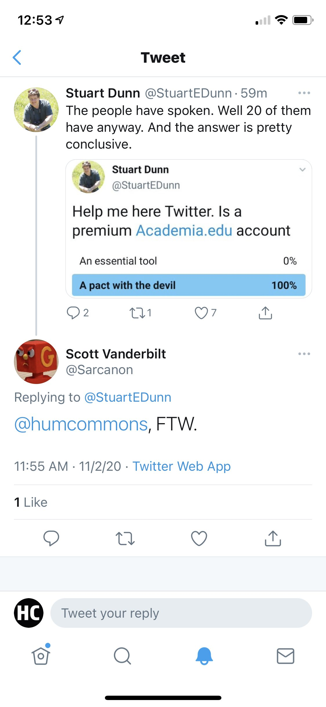
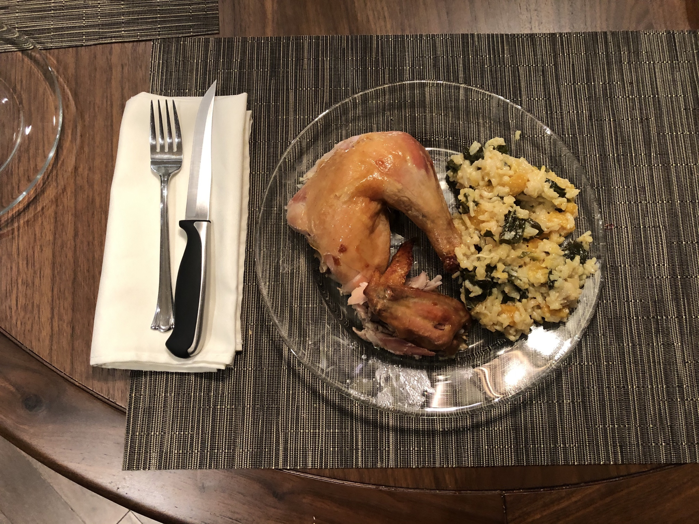

> RT @tressiemcphd: It’s weird to me that many people \#onhere think being concerned about election theft is alarmist\. They’re literally telli…

 [Sun Nov 01 18:14:12 +0000 2020](https://twitter.com/kfitz/status/1322965176749096963)

----

> RT @tressiemcphd: That’s not about poll trauma\. That’s reality\.

 [Sun Nov 01 18:14:16 +0000 2020](https://twitter.com/kfitz/status/1322965194621018114)

----

> I mean, yay\. But that we have gotten ourselves into this position\. I just can’t even\. https://twitter\.com/goldengateblond/status/1322998603212705792

 [Sun Nov 01 22:01:44 +0000 2020](https://twitter.com/kfitz/status/1323022438314266624)

----

> I needed something to keep me focused in the coming days\. This helps\. 
> 
> 

 [Mon Nov 02 17:58:20 +0000 2020](https://twitter.com/kfitz/status/1323323573466005505)

----

> I have thoughts about this\. More in a bit\. :\) https://twitter\.com/BerondaM/status/1323612959000637445

 [Tue Nov 03 13:13:27 +0000 2020](https://twitter.com/kfitz/status/1323614266499452933)

----

> The second draft chapter in Leading Generously is all about You, and your ability to create change\. \(PS: go vote\.\) https://kfitz\.info/lg2\-you/

 [Tue Nov 03 15:05:07 +0000 2020](https://twitter.com/kfitz/status/1323642367887482882)

----

> RT @humcommons: A note to our users: We’re nearing the final stages of the migration of Humanities Commons to MSU, and we expect to conclud…

 [Tue Nov 03 18:38:00 +0000 2020](https://twitter.com/kfitz/status/1323695940805550082)

----

> RT @humcommons: The last steps require a bit of downtime, which we expect to fall between 8:00 and 10:00pm EST\. Thank you for your support…

 [Tue Nov 03 18:38:02 +0000 2020](https://twitter.com/kfitz/status/1323695952121765891)

----

> RT @BerondaM: In "Working in Public" keynote, @kfitz discusses ways for us to increase accessibility to our work by engaging readers &amp; the…

 [Tue Nov 03 21:11:59 +0000 2020](https://twitter.com/kfitz/status/1323734693133647878)

----

> RT @BerondaM: In "Working in Public" keynote, @kfitz discusses powerful concept of an "ethic of generosity"\. I think about this OFTEN: how…

 [Tue Nov 03 21:12:08 +0000 2020](https://twitter.com/kfitz/status/1323734730538274816)

----

> RT @donnaeskye: “Public scholars need to know that their institutions, and the individuals that they work with in their institutions, have…

 [Tue Nov 03 21:12:19 +0000 2020](https://twitter.com/kfitz/status/1323734779712446467)

----

> RT @HikmaStrategies: "What would it be to have a social media platform that was more rigorous in its sociality?" Love this question posed b…

 [Tue Nov 03 21:16:47 +0000 2020](https://twitter.com/kfitz/status/1323735900984061952)

----

> Enormous thanks to the folks at @ubclibrary and @UBC\_PH for hosting me this afternoon, and to everyone who attended for your fantastic questions\!

 [Tue Nov 03 21:28:59 +0000 2020](https://twitter.com/kfitz/status/1323738971155955713)

----

Replying to [@BerondaM](https://twitter.com/BerondaM/status/1323717302064312320)

> Thank you so much for coming, Beronda\! I really look forward to getting to talk directly with you again soon\.

 [Tue Nov 03 21:59:19 +0000 2020](https://twitter.com/kfitz/status/1323746605179305985)

----

> Open, non\-profit infrastructure can transform the academy\. It’s absence can sink us\. Thread 👇🏻 https://twitter\.com/kaythaney/status/1323717468750307334

 [Tue Nov 03 23:36:33 +0000 2020](https://twitter.com/kfitz/status/1323771075763884033)

----

> RT @kaythaney: Our digital infrastructure is already under duress, cobbled together w bubble gum and duct tape levels of investment and sta…

 [Tue Nov 03 23:37:27 +0000 2020](https://twitter.com/kfitz/status/1323771302671429632)

----

Replying to [@kfitz](https://twitter.com/kfitz/status/1323771075763884033)

> \*Its\. It’s\. Stupid autocorrect basically alternates between them which is the worst possible option\.

 [Wed Nov 04 00:20:07 +0000 2020](https://twitter.com/kfitz/status/1323782041012494336)

----

> “Turned down\.” 🤔 https://twitter\.com/kylegriffin1/status/1323761876870705152

 [Wed Nov 04 00:30:06 +0000 2020](https://twitter.com/kfitz/status/1323784552851116032)

----

> This\. It’s devastating that anyone could have seen what we’ve seen over the last four years and still vote for him\. The thing is, though: they haven’t seen what we’ve seen\. They’ve seen what fits their narrative\. https://twitter\.com/paigecmorgan/status/1323951362665779200

 [Wed Nov 04 12:38:05 +0000 2020](https://twitter.com/kfitz/status/1323967755771617289)

----

> After spending most of my adult life in New York and California, I’m going to acknowledge that it’s rather a nail\-biter to live in a state where my vote actually really matters\. Sheesh, y’all\.

 [Wed Nov 04 12:51:23 +0000 2020](https://twitter.com/kfitz/status/1323971102343913474)

----

Replying to [@JulianChambliss](https://twitter.com/JulianChambliss/status/1323972464221790208)

> Oy\.

 [Wed Nov 04 13:02:07 +0000 2020](https://twitter.com/kfitz/status/1323973801961574400)

----

> I recognize that this is likely not a morning on which many of us are feeling replete with individual agency\. But you do have power to begin the process of change where you are\. That’s the focus of this week’s chapter of Leading Generously: https://kfitz\.info/lg2\-you/

 [Wed Nov 04 15:55:00 +0000 2020](https://twitter.com/kfitz/status/1324017308705107971)

----

Replying to [@electricarchaeo](https://twitter.com/electricarchaeo/status/1324017782028034048)

> Thanks so much, Shawn\!

 [Wed Nov 04 15:57:47 +0000 2020](https://twitter.com/kfitz/status/1324018010449944577)

----

> The best reading I’ve seen today of what this election tells us comes from @annehelen: “Regardless of who wins the presidential election, we are still stuck between a highly defensive, individualistic paradigm and a optimistically collectivist one\.” \+

 [Wed Nov 04 23:20:16 +0000 2020](https://twitter.com/kfitz/status/1324129365555318788)

----

Replying to [@annehelen](https://twitter.com/kfitz/status/1324129365555318788)

> “Each paradigm sees the other as anathema, and each paradigm has a media ecosystem built up to convince itself of its righteousness\.” \+

 [Wed Nov 04 23:21:14 +0000 2020](https://twitter.com/kfitz/status/1324129607654744064)

----

Replying to [@annehelen](https://twitter.com/kfitz/status/1324129607654744064)

> Like AHP, I know which side I fall on\. And I’m convinced I’m on the side of good\. But it’s increasingly clear to me that we can’t fix this without a radical change in the ways we communicate across the wall\.

 [Wed Nov 04 23:23:15 +0000 2020](https://twitter.com/kfitz/status/1324130116771975169)

----

> I so look forward to complaining about the administration in a like normal way\.

 [Fri Nov 06 20:04:03 +0000 2020](https://twitter.com/kfitz/status/1324804759971352576)

----

> 👇🏻 https://twitter\.com/goldietaylor/status/1325080506996678656

 [Sat Nov 07 14:28:04 +0000 2020](https://twitter.com/kfitz/status/1325082595374325760)

----

Replying to [@mchris4duke](https://twitter.com/mchris4duke/status/1325090814725414913)

> I could not agree more\.

 [Sat Nov 07 15:05:02 +0000 2020](https://twitter.com/kfitz/status/1325091901234679811)

----

> RT @femmenoire4: Madame Vice President 🤩 
> 
> 

 [Sat Nov 07 16:36:43 +0000 2020](https://twitter.com/kfitz/status/1325114971177496576)

----

> This laughter is the sound of the weight being lifted from all of us\. Thank you\. ❤️ https://twitter\.com/KamalaHarris/status/1325126733482385409

 [Sat Nov 07 17:43:51 +0000 2020](https://twitter.com/kfitz/status/1325131866546921472)

----

Replying to [@jackjewers](https://twitter.com/jackjewers/status/1325151324200112129)

> I have been thinking about the two of you all week, hugely sorry you’re not visiting \*this\* time\!\!\!

 [Sat Nov 07 19:51:06 +0000 2020](https://twitter.com/kfitz/status/1325163892218028032)

----

Replying to [@jackjewers](https://twitter.com/jackjewers/status/1325164618398928898)

> I know\! It’s completely weird\. It’s also 70F and sunny in Michigan in November\. I’m trying to store all of this joy up for the months ahead ❤️

 [Sat Nov 07 19:56:51 +0000 2020](https://twitter.com/kfitz/status/1325165337902370817)

----

> I am verklempt\.

 [Sun Nov 08 01:40:39 +0000 2020](https://twitter.com/kfitz/status/1325251856868794368)

----

> How amazing to be able to look forward to the next four years of hearing from the president rather than flinching every time I  hear is voice\.

 [Sun Nov 08 01:56:01 +0000 2020](https://twitter.com/kfitz/status/1325255723387932672)

----

> Y’all know I’m all about generosity, about reaching out to those who disagree, about listening and trying to understand\. I have also stressed, though, that NO ONE is or should be required to listen to or empathize with those who want to do them harm\.

 [Sun Nov 08 16:40:26 +0000 2020](https://twitter.com/kfitz/status/1325478296470040576)

----

Replying to [@kfitz](https://twitter.com/kfitz/status/1325478296470040576)

> That harm need not be physical or existential\. It can simply be another form of silencing\. Requiring that we extend our generosity to those who want to use it against us by forcing concessions where they offer none is harm\.

 [Sun Nov 08 16:42:19 +0000 2020](https://twitter.com/kfitz/status/1325478771084959745)

----

Replying to [@kfitz](https://twitter.com/kfitz/status/1325478771084959745)

> So at the point when those we’re being asked to be generous toward right now have owned up to and expressed regret for their own long\-standing lack of generosity… Sure, let’s talk\.

 [Sun Nov 08 16:44:16 +0000 2020](https://twitter.com/kfitz/status/1325479260551786499)

----

Replying to [@kfitz](https://twitter.com/kfitz/status/1325479260551786499)

> Until then, I’m happy to work toward a new day with those willing to work alongside\.

 [Sun Nov 08 16:45:21 +0000 2020](https://twitter.com/kfitz/status/1325479533642854400)

----

> I’ve been thinking a good bit lately about what stories can do that data can’t, or won’t\. This thread is going to help complicate that thinking, a lot\. https://twitter\.com/nkjemisin/status/1325545838500843524

 [Sun Nov 08 21:45:35 +0000 2020](https://twitter.com/kfitz/status/1325555087956176896)

----

Replying to [@kfitz](https://twitter.com/kfitz/status/1325555087956176896)

> \(Not to mention sharpening my focus on the need for justice as well as generosity\.\)

 [Sun Nov 08 21:50:04 +0000 2020](https://twitter.com/kfitz/status/1325556216492400642)

----

> The sad, sad moment when the one great big delicious cup of coffee for the day is gone\.

 [Mon Nov 09 12:20:40 +0000 2020](https://twitter.com/kfitz/status/1325775310768517120)

----

Replying to [@matthewisles](https://twitter.com/matthewisles/status/1325786955683160066)

> I mean, it’s really big\. And really strong\. And really good\. 😢

 [Mon Nov 09 13:10:33 +0000 2020](https://twitter.com/kfitz/status/1325787864769175553)

----

Replying to [@plragde](https://twitter.com/plragde/status/1325795299554684930)

> Happily, the 4\-shot Aeropress americano in a super\-insulated mug is too hot to go that quickly\.

 [Mon Nov 09 13:42:57 +0000 2020](https://twitter.com/kfitz/status/1325796016273182721)

----

> Thanks so much for inviting me, @PennPriceLab, and thanks for the great conversation, @whitneytrettien\! https://twitter\.com/PennPriceLab/status/1325887177704812544

 [Mon Nov 09 19:48:26 +0000 2020](https://twitter.com/kfitz/status/1325887994268672001)

----

Replying to [@DianeJakacki](https://twitter.com/DianeJakacki/status/1325944200614064129)

> I’m always fine about half an hour after the coffee is gone\. But the sudden emptiness of the cup is just crushing\.

 [Mon Nov 09 23:34:36 +0000 2020](https://twitter.com/kfitz/status/1325944912370688000)

----

> This week's installment of Leading Generously is all about the object of leadership: people, not institutions\. I'll look forward to hearing your thoughts\! https://kfitz\.info/lg3\-people/

 [Tue Nov 10 14:59:14 +0000 2020](https://twitter.com/kfitz/status/1326177601573023746)

----

> Sorry for the vaguetweet, but I cannot contain myself: I have had a long\-standing goal of changing a terrible bit of infrastructure in one corner of my professional life, and I am spending bits of time today watching the first results of that work\. I\. AM\. EXCITE\.

 [Tue Nov 10 17:28:24 +0000 2020](https://twitter.com/kfitz/status/1326215141009072128)

----

> Friends, a quick reminder that we’re searching for a new technical lead for Humanities Commons\! This position is fully remote\. Application deadline is THURSDAY\. Apply here: https://careers\.msu\.edu/en\-us/job/504100/technical\-lead\-the\-commons\-information\-technologist\-ii And see more info here: https://docs\.google\.com/presentation/d/192YIBDcu53xxkcaAOL0HlMdUS8M7lkB9evZ\-vupr5Zk/edit?usp\=sharing

 [Tue Nov 10 17:30:39 +0000 2020](https://twitter.com/kfitz/status/1326215708506722305)

----

> RT @sbenkorsh: Nice news that Humanities Commons \(@humcommons\) is moving from its originator, the Modern Language Association, to a robust…

 [Tue Nov 10 18:05:33 +0000 2020](https://twitter.com/kfitz/status/1326224489781350400)

----

> RT @kaythaney: great job 🚨 alert 🚨\! https://twitter\.com/kfitz/status/1326215708506722305

 [Tue Nov 10 19:48:25 +0000 2020](https://twitter.com/kfitz/status/1326250378850164739)

----

> RT @s2ceball: Apply by tomorrow for this awesome, remote job with @humcommons https://twitter\.com/kfitz/status/1326215708506722305

 [Wed Nov 11 19:56:37 +0000 2020](https://twitter.com/kfitz/status/1326614829239586817)

----

Replying to [@hels](https://twitter.com/hels/status/1327649066394800128)

> Hard same\.

 [Sat Nov 14 16:32:03 +0000 2020](https://twitter.com/kfitz/status/1327650514444619776)

----

Replying to [@PaulaKrebs](https://twitter.com/PaulaKrebs/status/1328122486597283841)

> Oh no\. I’m so sorry\.

 [Mon Nov 16 00:47:12 +0000 2020](https://twitter.com/kfitz/status/1328137508299952128)

----

Replying to [@tcarmody](https://twitter.com/tcarmody/status/1328222813472362497)

> I just found out last night\. Such a huge loss\.

 [Mon Nov 16 11:39:50 +0000 2020](https://twitter.com/kfitz/status/1328301751762563077)

----

Replying to [@tcarmody](https://twitter.com/tcarmody/status/1328303256490139649)

> I know\. It’s so hard taking the news onboard like this\. Impossible to imagine that place without him\.

 [Mon Nov 16 11:56:10 +0000 2020](https://twitter.com/kfitz/status/1328305861811384320)

----

Replying to [@kylegpsn, @gmbritton and @BasicBooks](https://twitter.com/kylegpsn/status/1328379472626782213)

> Huge congratulations\!

 [Tue Nov 17 00:07:41 +0000 2020](https://twitter.com/kfitz/status/1328489953517596672)

----

> This week's piece of Leading Generously is all about listening\. Looking forward to hearing your thoughts and suggestions\! https://kfitz\.info/lg4\-listening/

 [Tue Nov 17 15:06:12 +0000 2020](https://twitter.com/kfitz/status/1328716071579357186)

----

> Ah, the dreaded ICYMI\. Leading Generously needs your input: stories of successful \(or not so successful\) institutional change; suggestions for expansion; general complaints or questions\. Huge thanks for contributing\! http://kfitz\.info/lg4\-listening https://twitter\.com/kfitz/status/1328716071579357186

 [Tue Nov 17 22:21:38 +0000 2020](https://twitter.com/kfitz/status/1328825650468298753)

----

Replying to [@nicolesjchung](https://twitter.com/nicolesjchung/status/1328794691769339906)

> Oh no\. That is the most adorable puppy\! ❤️❤️❤️

 [Wed Nov 18 00:40:35 +0000 2020](https://twitter.com/kfitz/status/1328860621346115585)

----

> RT @humcommons: As of this very moment, Humanities Commons has 24,992 registered users\. Who will be number 25,000? \(And when will we be abl…

 [Wed Nov 18 18:39:31 +0000 2020](https://twitter.com/kfitz/status/1329132143973462021)

----

> RT @humcommons: We’ve extended the deadline on applications for this position\. Please tell the PHP developers you know about this position;…

 [Wed Nov 18 20:39:59 +0000 2020](https://twitter.com/kfitz/status/1329162457219297281)

----

Replying to [@tcarmody](https://twitter.com/tcarmody/status/1329185860890275840)

> Try going to updates in the app store and then doing cmd\-r?

 [Thu Nov 19 00:16:21 +0000 2020](https://twitter.com/kfitz/status/1329216908340715522)

----

Replying to [@BatsInLavender and @101punks](https://twitter.com/BatsInLavender/status/1329528009821478914)

> I don’t often do this on the open twitters, but this deserves a HOLY SHIT\. 😳

 [Thu Nov 19 22:29:22 +0000 2020](https://twitter.com/kfitz/status/1329552373866504193)

----

> RT @erinroseglass: cool opportunity for php developers — help build the humanities commons with some amazing folks and feel the joy of brin…

 [Sat Nov 21 16:45:05 +0000 2020](https://twitter.com/kfitz/status/1330190506400296967)

----

> \~begins putting together all\-star team to conduct the heist\~ https://twitter\.com/adam\_tooze/status/1330571749100982272

 [Sun Nov 22 21:37:16 +0000 2020](https://twitter.com/kfitz/status/1330626424148025351)

----

Replying to [@JenServenti](https://twitter.com/JenServenti/status/1330627135631921160)

> Done\.

 [Sun Nov 22 23:08:51 +0000 2020](https://twitter.com/kfitz/status/1330649473958211585)

----

Replying to [@plragde](https://twitter.com/plragde/status/1330663851185086466)

> That’s the much more complicated sequel, involving an uncrackable vault in an Alpine fortress\.

 [Mon Nov 23 00:09:33 +0000 2020](https://twitter.com/kfitz/status/1330664749613412352)

----

> RT @humcommons: Sustaining the Commons will take time, so this year we're participating in \#GivingTuesday on 12/1\. Full\-featured accounts w…

 [Mon Nov 23 23:14:03 +0000 2020](https://twitter.com/kfitz/status/1331013169662275584)

----

> This week's chapter of Leading Generously is all about vulnerability, and boy do I feel this one\. Your responses and stories are so much more than welcome\. https://kfitz\.info/lg5\-vulnerability/

 [Tue Nov 24 14:49:05 +0000 2020](https://twitter.com/kfitz/status/1331248477289013263)

----

> RT @amandaelaan: I'd really like to see more of this in action\. It would go a long way in helping to rebuild the broken trust between admin…

 [Tue Nov 24 15:17:41 +0000 2020](https://twitter.com/kfitz/status/1331255676044251136)

----

> RT @Educopia: NEWLY RELEASED: "2019 Census – Case Studies"  
>   
> The case studies highlight a few of the \#ScholComm programs and entities that p…

 [Tue Nov 24 16:19:21 +0000 2020](https://twitter.com/kfitz/status/1331271193865965568)

----

Replying to [@jasonrhody and @EthanWatrall](https://twitter.com/jasonrhody/status/1331277433618763777)

> Hear hear\! I so look forward to seeing what’s ahead for you\!

 [Tue Nov 24 20:40:40 +0000 2020](https://twitter.com/kfitz/status/1331336956568100865)

----

> 1\. Hooray\! Adobe Flash was just removed from my system\.  
>   
> 2\. Adobe Flash was in my system?

 [Tue Nov 24 21:33:58 +0000 2020](https://twitter.com/kfitz/status/1331350371919405059)

----

Replying to [@jackjewers](https://twitter.com/jackjewers/status/1331351874566565890)

> Sheesh, seriously\. That is not the movie in which I’d choose to be the Last Girl\.

 [Tue Nov 24 21:45:37 +0000 2020](https://twitter.com/kfitz/status/1331353301187768326)

----

Replying to [@tcarmody](https://twitter.com/tcarmody/status/1331359811942932480)

> Wait — I had polio?

 [Tue Nov 24 22:12:15 +0000 2020](https://twitter.com/kfitz/status/1331360007024152586)

----

> RT @DEJPett: Tribute due to Ethan for what he achieved in his 11 years\. Onwards to more great things my friend\. 👊 https://twitter\.com/EthanWatrall/status/1331271198047686657

 [Tue Nov 24 22:40:27 +0000 2020](https://twitter.com/kfitz/status/1331367103593652231)

----

Replying to [@BerondaM](https://twitter.com/BerondaM/status/1331291208845459456)

> BERONDA\! I’m sorry I missed this earlier\! Huge congratulations, and so well deserved\!\!\!

 [Tue Nov 24 22:49:44 +0000 2020](https://twitter.com/kfitz/status/1331369438176833536)

----

Replying to [@iphigenie](https://twitter.com/iphigenie/status/1331386204869300229)

> December, apparently\.

 [Wed Nov 25 00:12:04 +0000 2020](https://twitter.com/kfitz/status/1331390156868378630)

----

> RT @humcommons: Why is our mascot a platypus? The Commons is built from a number of disparate open source projects\. The Platypus looks like…

 [Wed Nov 25 00:42:21 +0000 2020](https://twitter.com/kfitz/status/1331397777826467845)

----

> RT @humcommons: Lays eggs but mammal\. Duck bill\. Webbed feet\. Furry\. Beaver tail\. Deadly spur\. Growls\. Releases milk through skin\. They eve…

 [Wed Nov 25 00:42:33 +0000 2020](https://twitter.com/kfitz/status/1331397831656153088)

----

Replying to [@DrYoFiggy](https://twitter.com/DrYoFiggy/status/1331624170086666240)

> Sending love your way, Yomaira\.

 [Wed Nov 25 16:35:28 +0000 2020](https://twitter.com/kfitz/status/1331637641008254977)

----

> RT @humcommons: We have an offer of generous support from the National Endowment for the Humanities, dependent on a fundraising match, so w…

 [Wed Nov 25 18:04:34 +0000 2020](https://twitter.com/kfitz/status/1331660062478229512)

----

> RT @humcommons: All of our features are free for individual users\. Help us sustain the Commons and keep the collaboration going\. Join us 12…

 [Wed Nov 25 20:58:27 +0000 2020](https://twitter.com/kfitz/status/1331703820640927745)

----

> NARRATOR: It doesn’t\. https://twitter\.com/fewstein/status/1331701177373757441

 [Wed Nov 25 21:04:23 +0000 2020](https://twitter.com/kfitz/status/1331705312332685314)

----

> Beware the recipe that begins assuming the winter squash have already been seeded, peeled, and cubed, and the collard greens have already been stemmed and cleaned\.

 [Thu Nov 26 20:43:31 +0000 2020](https://twitter.com/kfitz/status/1332062450431176706)

----

Replying to [@jbj](https://twitter.com/jbj/status/1332081244704747520)

> Right? The results of this one are going to be delightful, but I’d have started this morning if I’d read carefully enough\.

 [Thu Nov 26 22:00:47 +0000 2020](https://twitter.com/kfitz/status/1332081895576891395)

----

Replying to [@tcarmody](https://twitter.com/tcarmody/status/1332080862465286147)

> Truly\.

 [Thu Nov 26 22:00:55 +0000 2020](https://twitter.com/kfitz/status/1332081930389614592)

----

> “If we are to come out of this crisis less selfish than when we went in, we have to let ourselves be touched by others’ pain\.” I have been so grateful for the gift of this pope, but it still never occurred to me that he could make me cry\. https://www\.nytimes\.com/2020/11/26/opinion/pope\-francis\-covid\.html

 [Thu Nov 26 22:03:37 +0000 2020](https://twitter.com/kfitz/status/1332082607077679105)

----

Replying to [@hels](https://twitter.com/hels/status/1332087450701848576)

> I got nothing other than toast\. And I don’t even use it for that\.

 [Thu Nov 26 22:24:34 +0000 2020](https://twitter.com/kfitz/status/1332087882648088578)

----

> Previous temporal caveat aside, this turned out brilliantly\. https://cooking\.nytimes\.com/recipes/1012845\-risotto\-with\-winter\-squash\-and\-collard\-greens?smid\=ck\-recipe\-iOS\-share and https://cooking\.nytimes\.com/recipes/1015770\-zuni\-cafe\-chicken?smid\=ck\-recipe\-iOS\-share 
> 
> 

 [Fri Nov 27 00:33:27 +0000 2020](https://twitter.com/kfitz/status/1332120316362043393)

----

> RT @humcommons: We're participating in \#GivingTuesday this year as part of our move to grow and strengthen the Commons\. For more informatio…

 [Fri Nov 27 20:43:14 +0000 2020](https://twitter.com/kfitz/status/1332424765651488770)

----

Replying to [@jwolman](https://twitter.com/jwolman/status/1332806940661989376)

> \.\.\.do it\.\.\.do it\.\.\.

 [Sat Nov 28 22:07:33 +0000 2020](https://twitter.com/kfitz/status/1332808376238137345)

----

> RT @humcommons: How do you use Humanities Commons? We're looking for stories about how our users network, collaborate, and share their work…

 [Mon Nov 30 14:36:31 +0000 2020](https://twitter.com/kfitz/status/1333419642740756486)

----

> RT @humcommons: At over 25,000 members we're growing\. We're excited about what the future holds\. Help us create more opportunities for coll…

 [Tue Dec 01 02:14:24 +0000 2020](https://twitter.com/kfitz/status/1333595271956221952)

----

> RT @veek: "Strength in leadership\.\.\. requires vulnerability: removing the armor, engaging with difficulties, with changes in the environmen…

 [Tue Dec 01 02:15:12 +0000 2020](https://twitter.com/kfitz/status/1333595471902896128)

----

> RT @veek: And then on leaders building walls around themselves: "Directives and pronouncements emerge, but crucial information that the \[le…

 [Tue Dec 01 02:15:38 +0000 2020](https://twitter.com/kfitz/status/1333595580665356289)

----

> RT @pmhswe: A truly articulate, thoughtful series of posts on leading generously by the amazing @kfitz \- and I'm so glad she's reflected on…

 [Tue Dec 01 02:17:06 +0000 2020](https://twitter.com/kfitz/status/1333595952024854528)