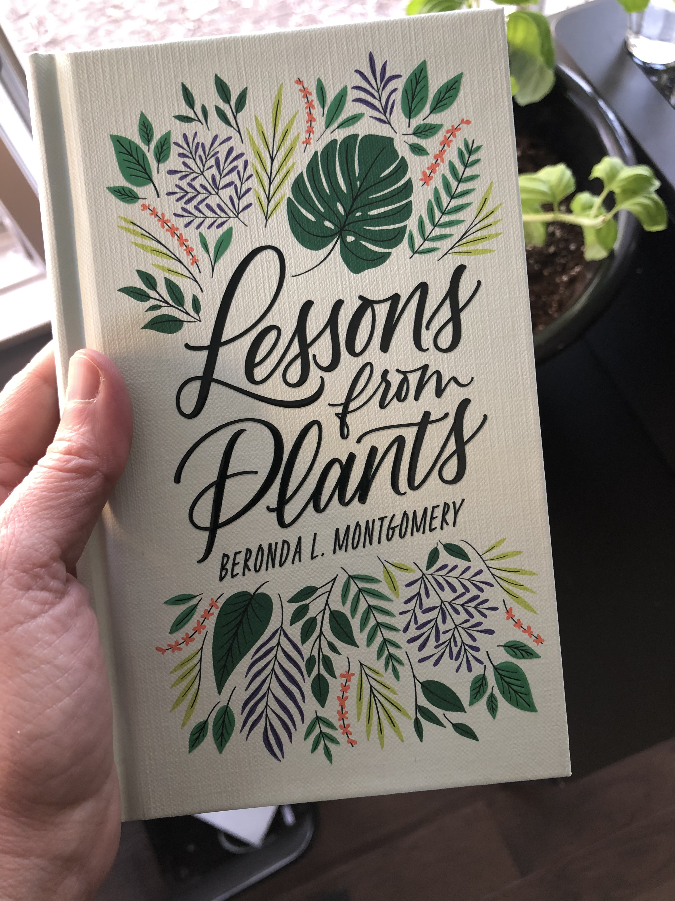

> RT @DHatMSU: REMINDER: Register for the \#MSUGlobalDH Symposium\! Join us April 12\-15, 2021 for a fabulous event\. The program is live at http…

 [Tue Mar 02 00:17:31 +0000 2021](https://twitter.com/kfitz/status/1366543153369595904)

----

> RT @humcommons: Join us on March 30th from 12:00\-1:30pm EDT for Online Communities and Transformative Justice, a conversation and CORE depo…

 [Wed Mar 03 20:27:14 +0000 2021](https://twitter.com/kfitz/status/1367209974963830786)

----

> I’m belatedly reading Johann Neem’s \*What’s the Purpose of College?\*, which begins with a clear statement of a central problem in higher ed today: our institutions have been led to focus on how to deliver more degrees, rather than on what a good college education should be\.

 [Wed Mar 03 23:35:27 +0000 2021](https://twitter.com/kfitz/status/1367257344057425923)

----

Replying to [@kfitz](https://twitter.com/kfitz/status/1367257347077382145)

> That is perhaps overstating the case\. And most folks who work on campus really genuinely believe in the mission\. \*I\* genuinely believe in the mission\. But the institutional mechanics sure look a lot like a pyramid scheme, if you tilt your head right\.

 [Wed Mar 03 23:35:28 +0000 2021](https://twitter.com/kfitz/status/1367257348012732421)

----

Replying to [@kfitz](https://twitter.com/kfitz/status/1367257346007703553)

> It’s taken this long for it to really sink in how much the entire enterprise resembles multi\-level marketing, if with more stirring mission and vision statements\.

 [Wed Mar 03 23:35:28 +0000 2021](https://twitter.com/kfitz/status/1367257347077382145)

----

Replying to [@kfitz](https://twitter.com/kfitz/status/1367257344975986694)

> And, not incidentally, more tuition dollars\. Universities are able to keep themselves solvent by keeping the demand for degrees up, by keeping the sales pitch going\. You too can obtain this credential which can open up a better life\.

 [Wed Mar 03 23:35:28 +0000 2021](https://twitter.com/kfitz/status/1367257346007703553)

----

Replying to [@kfitz](https://twitter.com/kfitz/status/1367257344057425923)

> It’s a straightforward point, but one that made a couple of things fall into place for me\. Universities have to deliver more degrees because they have been tasked with the primary goal of feeding the economy: more credentials, more workers, more growth\.

 [Wed Mar 03 23:35:28 +0000 2021](https://twitter.com/kfitz/status/1367257344975986694)

----

Replying to [@kfitz](https://twitter.com/kfitz/status/1367257348906098693)

> I think I may have to go lie down\.

 [Wed Mar 03 23:35:29 +0000 2021](https://twitter.com/kfitz/status/1367257349774340101)

----

Replying to [@kfitz](https://twitter.com/kfitz/status/1367257348012732421)

> It’s the Education Gospel\. It’s @tressiemcphd’s Lower Ed\. It’s the selling of the degree, rather than the transformative potential of the time spent learning\. It’s Dead Poets Society run by the Wolf of Wall Street\.

 [Wed Mar 03 23:35:29 +0000 2021](https://twitter.com/kfitz/status/1367257348906098693)

----

Replying to [@sharonmleon](https://twitter.com/sharonmleon/status/1367257770555228165)

> Seriously: put me back on the production line and take away my time to think\!

 [Wed Mar 03 23:40:10 +0000 2021](https://twitter.com/kfitz/status/1367258531460751366)

----

> Ooooohhh this is amazing\! https://twitter\.com/stakats/status/1367407872041172996

 [Thu Mar 04 12:13:02 +0000 2021](https://twitter.com/kfitz/status/1367447993306263553)

----

> RT @sharonmleon: Today is great day to show some love to the open source software dev teams who have been knocking it out of the park for w…

 [Thu Mar 04 13:22:51 +0000 2021](https://twitter.com/kfitz/status/1367465562897608705)

----

> RT @dancohen: Incredible update to Zotero \(beta\): fantastic built\-in PDF reader with many annotation features; better notes; a new tabbed i…

 [Thu Mar 04 13:23:13 +0000 2021](https://twitter.com/kfitz/status/1367465656132792321)

----

> We’re hiring\! The College of Arts &amp; Letters at Michigan State University and the MSU Libraries are searching for a WordPress/BuddyPress Developer to join the MESH Research team in supporting Humanities Commons\. https://careers\.msu\.edu/en\-us/job/505980/wpbp\-developer\-humanities\-commons\-information\-technologist\-ii 
> 
> 

 [Thu Mar 04 14:08:46 +0000 2021](https://twitter.com/kfitz/status/1367477121556357124)

----

> RT @achdotorg: Have you renewed your ACH membership? Interested in joining for the first time? To join/renew, visit https://members\.ach\.org/…

 [Thu Mar 04 19:28:11 +0000 2021](https://twitter.com/kfitz/status/1367557502246809602)

----

> This is SO HUGELY exciting\! Enormous congratulations to @DrYoFiggy and @jmjafrx and the rest of the Electronic Marronage community\! @DHatMSU https://twitter\.com/DrYoFiggy/status/1367583759479013379

 [Thu Mar 04 21:20:25 +0000 2021](https://twitter.com/kfitz/status/1367585748715786245)

----

Replying to [@DrYoFiggy, @jmjafrx and @DHatMSU](https://twitter.com/kfitz/status/1367585748715786245)

> Forgive my automatic typing\. \*Electric Marronage\! \(Which this time wanted to come out as “eclectic,” sheesh\.\) @e\_marronage

 [Thu Mar 04 21:24:12 +0000 2021](https://twitter.com/kfitz/status/1367586699920875522)

----

Replying to [@shannonmattern](https://twitter.com/shannonmattern/status/1367669333149814788)

> Oooh, congratulations\! I can’t wait to read this\.

 [Fri Mar 05 14:58:42 +0000 2021](https://twitter.com/kfitz/status/1367852074181025797)

----

Replying to [@DrYoFiggy](https://twitter.com/DrYoFiggy/status/1367969963374505986)

> Ohhhhhh what a cutie\! ❤️

 [Fri Mar 05 23:27:02 +0000 2021](https://twitter.com/kfitz/status/1367980001052790789)

----

Replying to [@toddbutler, @CASatWSU and @CASatWSU\_Dean](https://twitter.com/toddbutler/status/1368242365975068672)

> Fantastic news — congratulations\!

 [Sat Mar 06 17:06:55 +0000 2021](https://twitter.com/kfitz/status/1368246729636802568)

----

> RT @humcommons: Today we're launching Commons Highlights \-\- a new series highlighting groups, sites, and organizations that make the Common…

 [Mon Mar 08 15:21:47 +0000 2021](https://twitter.com/kfitz/status/1368945047622848519)

----

> RT @humcommons: Today we're excited to introduce the @oabooksnetwork  
>  who seek to foster discussion about OA books\. They've developed an ac…

 [Mon Mar 08 15:22:07 +0000 2021](https://twitter.com/kfitz/status/1368945130867224582)

----

> RT @oabooksnetwork: We're thrilled to be featured in this article on @humcommons\! Humanities Commons has been a brilliant platform for us a…

 [Mon Mar 08 15:56:50 +0000 2021](https://twitter.com/kfitz/status/1368953867157856257)

----

> RT @paigecmorgan: There's still time to join or renew your ACH membership, and get all the benefits, including voting in our current electi…

 [Mon Mar 08 18:12:48 +0000 2021](https://twitter.com/kfitz/status/1368988082213711872)

----

> RT @quinnanya: I used to dread ACH renewal time, but thanks to the hard work of the infrastructure committee, now it's a breeze\! And also w…

 [Mon Mar 08 18:18:47 +0000 2021](https://twitter.com/kfitz/status/1368989588996374534)

----

Replying to [@thomasgpadilla and @CRL\_Global](https://twitter.com/thomasgpadilla/status/1368988843420971009)

> HEY\! Congratulations, Thomas — looking forward to seeing what you do\!  
>   
> \(Does this mean you’ll be just down the road here?\)

 [Mon Mar 08 18:19:52 +0000 2021](https://twitter.com/kfitz/status/1368989861353582594)

----

> RT @achdotorg: ACH elections are open\! The ballot closes March 15th\. To vote, visit https://members\.ach\.org/home/ach\-elections/

 [Mon Mar 08 22:45:15 +0000 2021](https://twitter.com/kfitz/status/1369056648153735170)

----

Replying to [@CJ\_Daugherty](https://twitter.com/CJ_Daugherty/status/1369266929882521603)

> My own personal favorite signoff typo is “Beset”\.

 [Tue Mar 09 13:13:02 +0000 2021](https://twitter.com/kfitz/status/1369275031805693954)

----

Replying to [@jtauber and @quinnanya](https://twitter.com/jtauber/status/1369178262019010566)

> Thanks for this\! We’ve got some projects coming up \(spoiler alert: website redesign\) that could use some help if you’re of a mind…

 [Tue Mar 09 13:17:13 +0000 2021](https://twitter.com/kfitz/status/1369276086043959307)

----

> Soooooo looking forward to reading this\! Congrats, Jess\! https://twitter\.com/j\_zimms/status/1369284035546128387

 [Tue Mar 09 17:16:16 +0000 2021](https://twitter.com/kfitz/status/1369336244820447233)

----

> I had the privilege of presenting my work to the board of trustees back in September\. It was a challenge to get everything I wanted to share about the future of the university as a knowledge commons into 8 minutes, but I’m so glad to have had the opportunity\. https://twitter\.com/msuresearch/status/1369332278627868673

 [Tue Mar 09 18:56:28 +0000 2021](https://twitter.com/kfitz/status/1369361459281530881)

----

> RT @kfitz: We’re hiring\! The College of Arts &amp; Letters at Michigan State University and the MSU Libraries are searching for a WordPress/Bud…

 [Thu Mar 11 16:57:06 +0000 2021](https://twitter.com/kfitz/status/1370056198507044868)

----

Replying to [@samplereality](https://twitter.com/samplereality/status/1370753545868353542)

> Sooooo jealous\!

 [Sat Mar 13 16:28:45 +0000 2021](https://twitter.com/kfitz/status/1370773839186173952)

----

> I owe Naomi Klein so many apologies for the number of times I’ve had to remind myself which one of them is which\.

 [Sat Mar 13 20:13:37 +0000 2021](https://twitter.com/kfitz/status/1370830429817860099)

----

Replying to [@mia\_out](https://twitter.com/mia_out/status/1370855174886072325)

> Ahahahhhahahahahaaa

 [Sat Mar 13 22:06:44 +0000 2021](https://twitter.com/kfitz/status/1370858895590187015)

----

> RT @mia\_out: @kfitz I find this really helps https://twitter\.com/iphone\_venez/status/1365325129941737473

 [Sat Mar 13 22:06:47 +0000 2021](https://twitter.com/kfitz/status/1370858908793847811)

----

Replying to [@cplong and @samplereality](https://twitter.com/cplong/status/1370849348452507650)

> Not that I’ve heard\. I’ve been following along at https://forums\.zotero\.org\. @zotero

 [Sat Mar 13 22:21:34 +0000 2021](https://twitter.com/kfitz/status/1370862628009078787)

----

Replying to [@sharonmleon](https://twitter.com/sharonmleon/status/1370865411332395008)

> I have a Synology NAS hooked to our house network, with both of us Time Machining to it\. Plus using it for media storage\. @EthanWatrall pointed me in this direction, and I love it\.

 [Sat Mar 13 22:48:01 +0000 2021](https://twitter.com/kfitz/status/1370869286047207425)

----

Replying to [@dancohen](https://twitter.com/dancohen/status/1371081753444687874)

> Two: the oven and the microwave\.

 [Sun Mar 14 13:27:32 +0000 2021](https://twitter.com/kfitz/status/1371090620077502466)

----

Replying to [@dancohen](https://twitter.com/dancohen/status/1371082225656205313)

> Ha\!

 [Sun Mar 14 13:27:46 +0000 2021](https://twitter.com/kfitz/status/1371090678919335939)

----

> RT @achdotorg: One more day to vote in the ACH elections\!  To learn more about the candidates and vote, visit https://members\.ach\.org/home/ach\-elections/

 [Sun Mar 14 17:04:21 +0000 2021](https://twitter.com/kfitz/status/1371145186080919561)

----

Replying to [@elotroalex, @sharonmleon, @jmjafrx and @roopikarisam](https://twitter.com/elotroalex/status/1371219081429389314)

> I’m pretty sure @s2ceball was my inspiration\!

 [Sun Mar 14 22:12:48 +0000 2021](https://twitter.com/kfitz/status/1371222810379624456)

----

Replying to [@ernestopriego](https://twitter.com/ernestopriego/status/1371357063578783744)

> Oh, Ernesto\. I am so, so sorry to hear of this loss\. Keeping you and your family in my thoughts\.

 [Mon Mar 15 12:49:06 +0000 2021](https://twitter.com/kfitz/status/1371443338453340163)

----

> RT @humcommons: We're looking for a WordPress/BuddyPress Developer to join the MESH Research team in supporting Humanities Commons\. Come jo…

 [Mon Mar 15 23:03:16 +0000 2021](https://twitter.com/kfitz/status/1371597897679179779)

----

> I’ve been testing these and BOY are you in for a treat\. https://twitter\.com/stakats/status/1371758092568965122

 [Tue Mar 16 14:35:14 +0000 2021](https://twitter.com/kfitz/status/1371832436187918346)

----

Replying to [@BerondaM and @PlantLessons](https://twitter.com/BerondaM/status/1371879642462834698)

> OH\! Congratulations\! It’s the most exciting thing\. I can’t wait to get my copy\!

 [Tue Mar 16 21:16:12 +0000 2021](https://twitter.com/kfitz/status/1371933340727644160)

----

Replying to [@JeremiahCoogan, @James\_M\_Tucker, @JAndrewCowan, @ChristophHeilig, @humcommons and @arxiv](https://twitter.com/JeremiahCoogan/status/1372141715184881670)

> Somewhat amusingly, "arXiv for the humanities" is how we pitched Humanities Commons \-\- and especially CORE \-\- in  early grant proposals\. What features or aspects of arXiv would you like to see in the Commons?

 [Wed Mar 17 12:43:09 +0000 2021](https://twitter.com/kfitz/status/1372166615458979849)

----

Replying to [@JeremiahCoogan, @James\_M\_Tucker, @JAndrewCowan, @ChristophHeilig, @humcommons and @arxiv](https://twitter.com/JeremiahCoogan/status/1372172591113371651)

> Ah, this is good to hear\. We’ve got incorporating the FAST schema on our near\-term roadmap\!

 [Wed Mar 17 13:11:32 +0000 2021](https://twitter.com/kfitz/status/1372173760808198144)

----

Replying to [@JeremiahCoogan, @James\_M\_Tucker, @JAndrewCowan, @ChristophHeilig, @humcommons, @arxiv and @ORCID\_Org](https://twitter.com/JeremiahCoogan/status/1372175262750810114)

> Ah, we’re working on that, too\! The key bit of slowdown has to do with our staffing levels at the moment\. But we’re hiring\! Do share this with anyone who might be interested: https://careers\.msu\.edu/en\-us/job/505980/wpbp\-developer\-humanities\-commons\-information\-technologist\-ii

 [Wed Mar 17 13:25:33 +0000 2021](https://twitter.com/kfitz/status/1372177285957234692)

----

> RT @humcommons: Don't forget to register for the Online Communities and Transformative Justice CORE deposit party on March 30th at 12pm EDT…

 [Wed Mar 17 23:02:54 +0000 2021](https://twitter.com/kfitz/status/1372322579411832841)

----

> RT @rokwon: easy things to do:  
>   
> \- if you hear anyone repeat the bullshit that these attacks weren't racist, tell them to shut the fuck up  
> \-…

 [Wed Mar 17 23:51:55 +0000 2021](https://twitter.com/kfitz/status/1372334918362144771)

----

> RT @CALMSU: Don’t miss the 6th annual Global Digital Humanities Symposium, which will be held virtually April 12\-15\! REGISTER for free by A…

 [Thu Mar 18 17:14:54 +0000 2021](https://twitter.com/kfitz/status/1372597392793604102)

----

> OH HEY https://twitter\.com/xina/status/1372607213336883201

 [Thu Mar 18 18:13:53 +0000 2021](https://twitter.com/kfitz/status/1372612233608491008)

----

Replying to [@atrubek, @tcarmody and @wynkenhimself](https://twitter.com/atrubek/status/1372669121037488131)

> Yes yes yes\.

 [Thu Mar 18 22:07:09 +0000 2021](https://twitter.com/kfitz/status/1372670940128161797)

----

Replying to [@atrubek, @tcarmody and @wynkenhimself](https://twitter.com/kfitz/status/1372670940128161797)

> I am on the old end of GenX, and Obama et al are WAY older than me, in many ways beyond the calendrical\. And Winona over Ally Sheedy any day\.

 [Thu Mar 18 22:08:45 +0000 2021](https://twitter.com/kfitz/status/1372671340172484618)

----

Replying to [@atrubek, @tcarmody, @wynkenhimself, @karenmcgrane, @phillydesign and @vcmcguire](https://twitter.com/atrubek/status/1372694355643883520)

> EXACTLY\.

 [Thu Mar 18 23:42:01 +0000 2021](https://twitter.com/kfitz/status/1372694813854814208)

----

> Applications close on Tuesday, March 23 — come join us and help shape the future of the scholarly commons\! https://twitter\.com/humcommons/status/1371548199664693254

 [Fri Mar 19 18:00:15 +0000 2021](https://twitter.com/kfitz/status/1372971193590935552)

----

> Such a great project\! I’m so glad to have gotten to be part of it\. https://twitter\.com/JulianChambliss/status/1373005400824553473

 [Sat Mar 20 00:25:51 +0000 2021](https://twitter.com/kfitz/status/1373068232979066880)

----

Replying to [@loriemerson](https://twitter.com/loriemerson/status/1373753453562843136)

> I honest to god had a moment of not remembering having written that\. I’m glad it resonates\!

 [Sun Mar 21 23:03:08 +0000 2021](https://twitter.com/kfitz/status/1373772189355413504)

----

> Got my first shot today\. HUGE props to Sparrow’s team at Frandor for a ridiculously efficient drive\-through process\. And now I am taking advantage of my mild light\-headedness and lying down for a bit\.

 [Mon Mar 22 16:49:41 +0000 2021](https://twitter.com/kfitz/status/1374040595375779842)

----

Replying to [@jackjewers](https://twitter.com/jackjewers/status/1374040987836760067)

> Ooh, I hadn’t considered ice cream\. That may need to be rectified\! :\)

 [Mon Mar 22 16:54:47 +0000 2021](https://twitter.com/kfitz/status/1374041882767015938)

----

> RT @martin\_eve: Communities, Commoning, Open Access and the Humanities: An Interview with Martin Eve  
>   
> https://www\.westminsterpapers\.org/article/id/919/

 [Mon Mar 22 16:54:55 +0000 2021](https://twitter.com/kfitz/status/1374041916149481478)

----

Replying to [@RahawaHaile](https://twitter.com/RahawaHaile/status/1374071244664885250)

> Sending you all the ❤️, Rahawa\. And here’s to miracles — I can’t wait to read it\.

 [Mon Mar 22 19:03:14 +0000 2021](https://twitter.com/kfitz/status/1374074207844327434)

----

Replying to [@DrYoFiggy and @BerondaM](https://twitter.com/DrYoFiggy/status/1374467963609182220)

> I wish I could tell you how jealous I’ve been watching all these early arrivals\! Still waiting for my preorder to be filled 😥

 [Tue Mar 23 21:48:25 +0000 2021](https://twitter.com/kfitz/status/1374478163284140035)

----

> If you are not reading @tressiemcphd’s ESSAYING you are Missing\. Out\. This morning’s post on theory, “clarity,” and the underpinnings of the fight for control of The Discourse is killer\. https://tressie\.substack\.com/p/resisting\-the\-call\-of\-exceptionalism?r\=f03d&utm\_campaign\=post&utm\_medium\=email&utm\_source\=copy

 [Thu Mar 25 12:58:49 +0000 2021](https://twitter.com/kfitz/status/1375069662099210246)

----

Replying to [@Kelley\_Kreitz, @alanyliu, @roopikarisam, @jsench, @MLAnews, @HumanitiesAll and @EdwardWhitley](https://twitter.com/Kelley_Kreitz/status/1374845817069133833)

> Just to be sure I’m understanding the question: you’re looking for places that have deployed budget models that privilege collaboration rather than competition for majors and butts in seats? Honestly, if you find good examples, I would like to hear about them too\.

 [Thu Mar 25 13:17:19 +0000 2021](https://twitter.com/kfitz/status/1375074318565138434)

----

> I am wearing a pair of blue jeans\. They’re my oldest and softest pair, but nevertheless: this is the equivalent of pre\-pandemic me deciding to put on a cocktail dress just for the heck of it\.

 [Thu Mar 25 16:49:33 +0000 2021](https://twitter.com/kfitz/status/1375127727167143937)

----

Replying to [@Kelley\_Kreitz](https://twitter.com/Kelley_Kreitz/status/1375447968745201670)

> Thanks for that, Kelley\! I’m keeping my ears open for better models, and will hope to hear more from others, too\.

 [Fri Mar 26 20:50:08 +0000 2021](https://twitter.com/kfitz/status/1375550660247162888)

----

> RT @achdotorg: \.@achdotorg is thrilled to announce the results of the 2021 Exec Council elections\! Congrats to our three newest Exec member…

 [Fri Mar 26 21:18:10 +0000 2021](https://twitter.com/kfitz/status/1375557716844875788)

----

> RT @DHatMSU: Join MSU commons in conjunction with @humcommons for Online Communities and Transformative: A conversation and CORE deposit pa…

 [Fri Mar 26 21:43:04 +0000 2021](https://twitter.com/kfitz/status/1375563979771293698)

----

Replying to [@BerondaM](https://twitter.com/BerondaM/status/1376496814698942466)

> Nice\! I got creation, gratitude, self\-care\. I’ll embrace that\. \(And am still eagerly awaiting my pre\-ordered copy\!\)

 [Mon Mar 29 14:26:37 +0000 2021](https://twitter.com/kfitz/status/1376541306667859968)

----

Replying to [@sbanetweiser, @AnnenbergPenn and @USCAnnenberg](https://twitter.com/sbanetweiser/status/1376587270212481025)

> SBW\!\!\! Such amazing news\! Huge congratulations and can’t wait to see you again back on this side\.

 [Mon Mar 29 22:42:12 +0000 2021](https://twitter.com/kfitz/status/1376666024691572736)

----

> And what kind of heartless must you be if your response as a bystander is to close your door? https://twitter\.com/pronounced\_ing/status/1376874222778191878

 [Tue Mar 30 12:53:41 +0000 2021](https://twitter.com/kfitz/status/1376880307010482177)

----

> Enormously important work — I can’t wait to dig into this\! https://twitter\.com/Educopia/status/1376898850422620170

 [Tue Mar 30 14:34:15 +0000 2021](https://twitter.com/kfitz/status/1376905617953132546)

----

Replying to [@DrYoFiggy and @CrazedNYRican](https://twitter.com/DrYoFiggy/status/1376963286059655170)

> Oh, Yomaira, I am so sorry for your loss\. 💙

 [Tue Mar 30 18:54:11 +0000 2021](https://twitter.com/kfitz/status/1376971030065995784)

----

> Hooray, finally\!\!\! So looking forward to reading @BerondaM @PlantLessons 
> 
> 

 [Tue Mar 30 21:27:44 +0000 2021](https://twitter.com/kfitz/status/1377009672666939395)

----

> RT @InvestInOpen: Help us spread the word \(and don’t forget to apply\!\) 👇🏼👇🏼👇🏼  
>   
> \#openinfra \#openscience \#openaccess \#data4good https://t\.co/…

 [Wed Mar 31 15:43:49 +0000 2021](https://twitter.com/kfitz/status/1377285514051608578)

----

> RT @achdotorg: ICYMI \- We have three new Exec Council members in ACH: @BlackDigitalHum @LGauth19 @jenniferisve\. Join us in congratulating t…

 [Wed Mar 31 15:48:45 +0000 2021](https://twitter.com/kfitz/status/1377286752306655238)

----

> Oh, like no one in the previous administration ever pooped on the floor sheesh\. https://twitter\.com/kathrynw5/status/1377269841158103048

 [Wed Mar 31 16:33:08 +0000 2021](https://twitter.com/kfitz/status/1377297922551910400)

----

> This\. It took a professional writer breaking it down for me, sadly, but every time an academic takes on uncompensated labor \(because we can\), we undercut the ability of others to support themselves through their work\. https://twitter\.com/timmaughan/status/1377316682474139654

 [Wed Mar 31 20:55:21 +0000 2021](https://twitter.com/kfitz/status/1377363912174137345)

----

Replying to [@kfitz](https://twitter.com/kfitz/status/1377363912174137345)

> Yes, we’re sort of paid by our institutions to write and give talks and so forth\. But if publications and speaking venues can get us super cheap or even free, why would they consider properly paying those who rely on that income?

 [Wed Mar 31 20:57:04 +0000 2021](https://twitter.com/kfitz/status/1377364343885471748)

----

Replying to [@kfitz](https://twitter.com/kfitz/status/1377364343885471748)

> It’s still work\. And it should be paid\.

 [Wed Mar 31 20:57:53 +0000 2021](https://twitter.com/kfitz/status/1377364548538228736)

----

Replying to [@timmaughan](https://twitter.com/timmaughan/status/1377404947554213888)

> You too\!

 [Wed Mar 31 23:49:32 +0000 2021](https://twitter.com/kfitz/status/1377407745226248195)