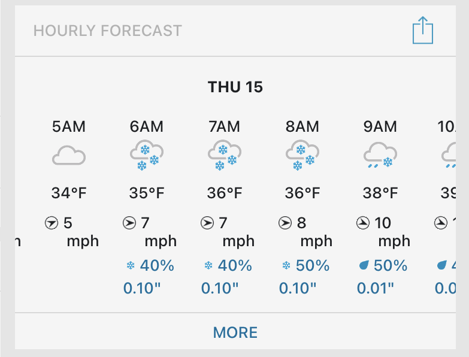

Replying to [@cplong, @fumcog, @valong11 and @UMChurch](https://twitter.com/cplong/status/1378772456689823753)

> Chris, how beautiful\. I’m so sorry for your loss but so glad to know something of the relationships that formed your ways of being in the world\.

 [Sun Apr 04 18:38:54 +0000 2021](https://twitter.com/kfitz/status/1378779123615735810)

----

> RT @InvestInOpen: New series of posts \(\+resources\) on our work over the past few months with @DeEttaMJones \+ @codeforsociety to address the…

 [Mon Apr 05 21:35:17 +0000 2021](https://twitter.com/kfitz/status/1379185900228382723)

----

> My backyard has two random daffodils in it, at opposite ends\. I have no idea how they came to be there, but they make me extremely happy this time each year\. Not least because I forget they’re there in the months inbetween\.

 [Wed Apr 07 13:14:02 +0000 2021](https://twitter.com/kfitz/status/1379784534212939779)

----

Replying to [@kfitz](https://twitter.com/kfitz/status/1379784534212939779)

> There’s a lesson for me in that somewhere, I think\.

 [Wed Apr 07 13:15:01 +0000 2021](https://twitter.com/kfitz/status/1379784778594062340)

----

Replying to [@SheilaABrennan](https://twitter.com/SheilaABrennan/status/1379789452218920963)

> “Welcome the randomness” is an excellent lesson\.  
>   
> Also, if it’s the squirrels, it might begin to make up for the annoying critter I caught gnawing on the trunk of my Japanese maple the other day\.

 [Wed Apr 07 13:38:25 +0000 2021](https://twitter.com/kfitz/status/1379790668495740934)

----

Replying to [@ameckeco](https://twitter.com/ameckeco/status/1379786225284960263)

> I like it\. Also that there’s surprise beauty possible in things you can’t control\.

 [Wed Apr 07 13:39:11 +0000 2021](https://twitter.com/kfitz/status/1379790860922028034)

----

> This is a two\-year position, working with a great team at @meshresearch and other MSU colleagues to imagine new futures for peer review and community\-oriented scholarship\! https://twitter\.com/PubPhilJ/status/1379066302980046850

 [Thu Apr 08 17:15:52 +0000 2021](https://twitter.com/kfitz/status/1380207778338324483)

----

> Delighted to be listening to Chao Tayiana Maina’s keynote, “History Is Hiding,” kicking off @MSUGlobalDH\.

 [Mon Apr 12 13:27:28 +0000 2021](https://twitter.com/kfitz/status/1381599853793452040)

----

Replying to [@jimgroom](https://twitter.com/jimgroom/status/1382316590239211529)

> Wow, that preview\! That looks a bit more exhortative than a riff\.

 [Wed Apr 14 12:59:01 +0000 2021](https://twitter.com/kfitz/status/1382317467612106752)

----

> Dear Michigan,  
> What the \*\*\*\* is this?\!?  
> Love, kfitz 
> 
> 

 [Thu Apr 15 00:35:38 +0000 2021](https://twitter.com/kfitz/status/1382492777011937280)

----

Replying to [@RSilbergleid](https://twitter.com/RSilbergleid/status/1382496825769361409)

> Truly\.

 [Thu Apr 15 12:35:11 +0000 2021](https://twitter.com/kfitz/status/1382673857790816264)

----

> RT @gmbritton: Higher Ed Book Sale at Johns Hopkins\-\-30% off and free shipping starting tomorrow\!  
>   
> https://bit\.ly/3mUz70r https://t\.co/EaX…

 [Thu Apr 15 19:39:43 +0000 2021](https://twitter.com/kfitz/status/1382780697094524931)

----

> The horror of this country\. The shame of this country\. There is no reforming this\. \#abolition https://twitter\.com/JoyAnnReid/status/1382796522774007809

 [Thu Apr 15 21:04:30 +0000 2021](https://twitter.com/kfitz/status/1382802033258946570)

----

> RT @BreeNewsome: All of these cases— Floyd, Wright &amp; Toledo—would be first degree murder cases if the roles were reversed and these were ci…

 [Thu Apr 15 21:14:45 +0000 2021](https://twitter.com/kfitz/status/1382804611640229891)

----

> Someday someone will chronicle all of the hilarious and mortifying things that have happened in Zoom meetings during the pandemic, and surely numbered among them will be the massive coffee spit\-take I did on camera this morning when a colleague cracked a not\-all\-THAT\-funny joke\.

 [Mon Apr 19 14:17:46 +0000 2021](https://twitter.com/kfitz/status/1384149224971853827)

----

Replying to [@kfitz](https://twitter.com/kfitz/status/1384149224971853827)

> I am going to be finding coffee spots on and around my workspace for quite a while\.

 [Mon Apr 19 14:19:06 +0000 2021](https://twitter.com/kfitz/status/1384149563846512644)

----

> It’s not justice, but it’s a small step in that direction\.

 [Tue Apr 20 21:14:23 +0000 2021](https://twitter.com/kfitz/status/1384616460341981186)

----

Replying to [@electricarchaeo](https://twitter.com/electricarchaeo/status/1384621638696665088)

> Have you been following Obsidian’s work on an iOS version?

 [Tue Apr 20 21:38:25 +0000 2021](https://twitter.com/kfitz/status/1384622509476220930)

----

> My lawn desperately needs to be mowed\. And we keep having these passing snow flurries\. Neither of these things is really great, but one is NOT OKAY\.

 [Wed Apr 21 19:21:51 +0000 2021](https://twitter.com/kfitz/status/1384950527205707783)

----

Replying to [@FranoisLachanc2](https://twitter.com/FranoisLachanc2/status/1384967536995876869)

> &lt;3

 [Wed Apr 21 20:35:59 +0000 2021](https://twitter.com/kfitz/status/1384969184191340551)

----

Replying to [@roopikarisam, @elotroalex, @JuliaGaffield, @jenguiliano and @inthewhirld](https://twitter.com/roopikarisam/status/1384937587970920448)

> Also worth checking out Secret Feminist Agenda, peer\-reviewed and published by Wilfrid Laurier University Press\. https://www\.wlupress\.wlu\.ca/Scholarly\-Podcasting\-Open\-Peer\-Review/Secret\-Feminist\-Agenda

 [Wed Apr 21 22:00:55 +0000 2021](https://twitter.com/kfitz/status/1384990559174111244)

----

Replying to [@CJ\_Daugherty and @AvaGlassBooks](https://twitter.com/CJ_Daugherty/status/1385569103361056770)

> Oooooh, exciting\! Congratulations\!

 [Fri Apr 23 12:27:23 +0000 2021](https://twitter.com/kfitz/status/1385570997370294275)

----

Replying to [@CJ\_Daugherty and @AvaGlassBooks](https://twitter.com/CJ_Daugherty/status/1385571785870123014)

> So exciting\! I miss you both so much — hoping that at least some travel comes back before terribly long…

 [Fri Apr 23 12:34:30 +0000 2021](https://twitter.com/kfitz/status/1385572791815114755)

----

Replying to [@sharonmleon](https://twitter.com/sharonmleon/status/1386476424433963008)

> Desirable, necessary, and wholeheartedly approved\.

 [Mon Apr 26 00:44:36 +0000 2021](https://twitter.com/kfitz/status/1386481301541298176)

----

Replying to [@sharonmleon](https://twitter.com/sharonmleon/status/1386483757868322824)

> It was exactly that slip — I meant to include it but my fingers were on autopilot\.

 [Mon Apr 26 01:00:17 +0000 2021](https://twitter.com/kfitz/status/1386485247202693122)

----

> Dang\. This is really the message I want to encounter in my employee handbook: “By its very nature every embodied spirit is doomed to suffer and enjoy in solitude\.” ✊🏻 https://twitter\.com/shanakimball/status/1386759647936253952

 [Mon Apr 26 22:03:51 +0000 2021](https://twitter.com/kfitz/status/1386803233528684544)

----

> Very much looking forward to this\! https://twitter\.com/ProjectMUSE/status/1387030035891118088

 [Tue Apr 27 14:28:15 +0000 2021](https://twitter.com/kfitz/status/1387050966273335296)

----

Replying to [@billhd](https://twitter.com/billhd/status/1387043158849060879)

> Sigh\.

 [Tue Apr 27 18:05:44 +0000 2021](https://twitter.com/kfitz/status/1387105700652929028)

----

> Starting in about 10\! https://twitter\.com/ProjectMUSE/status/1387126946392313861

 [Tue Apr 27 19:50:18 +0000 2021](https://twitter.com/kfitz/status/1387132016118874118)

----

Replying to [@gmbritton](https://twitter.com/gmbritton/status/1387381248176410625)

> I am sensing a theme\.

 [Wed Apr 28 12:28:06 +0000 2021](https://twitter.com/kfitz/status/1387383119670648832)

----

> I’m honored to have gotten to kick off \#MUSEmeets2021 yesterday\! Thanks to all who attended and all who asked such great questions\. https://twitter\.com/ProjectMUSE/status/1387469596400181249

 [Wed Apr 28 19:45:47 +0000 2021](https://twitter.com/kfitz/status/1387493266652794888)

----

Replying to [@caitduffy49](https://twitter.com/caitduffy49/status/1388133059107639296)

> CONGRATULATIONS\!\!\!

 [Fri Apr 30 14:13:26 +0000 2021](https://twitter.com/kfitz/status/1388134404342571009)

----

Replying to [@sharonmleon](https://twitter.com/sharonmleon/status/1388240993292636162)

> Ah, sorry about the stuckness\! Let me know if I can help\.

 [Fri Apr 30 21:21:23 +0000 2021](https://twitter.com/kfitz/status/1388242099737407488)

----

> Sooooo looking forward to this\! https://twitter\.com/SteeleCat717/status/1388160922066198528

 [Fri Apr 30 21:22:27 +0000 2021](https://twitter.com/kfitz/status/1388242369825366016)

----

Replying to [@sharonmleon](https://twitter.com/sharonmleon/status/1388243309320093696)

> Ah, alas, that sounds both relatable and like something I can’t help with\. I hope the focus comes back soon\!

 [Fri Apr 30 21:32:54 +0000 2021](https://twitter.com/kfitz/status/1388244999377145858)

----

> RT @bmwiernik: If you use Mendeley and have wanted to switch to Zotero, but didn’t want to jump through hoops to get around Mendeley’s data…

 [Fri Apr 30 21:41:05 +0000 2021](https://twitter.com/kfitz/status/1388247055282364418)