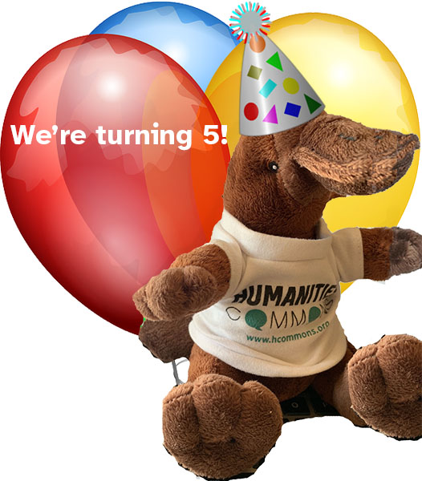
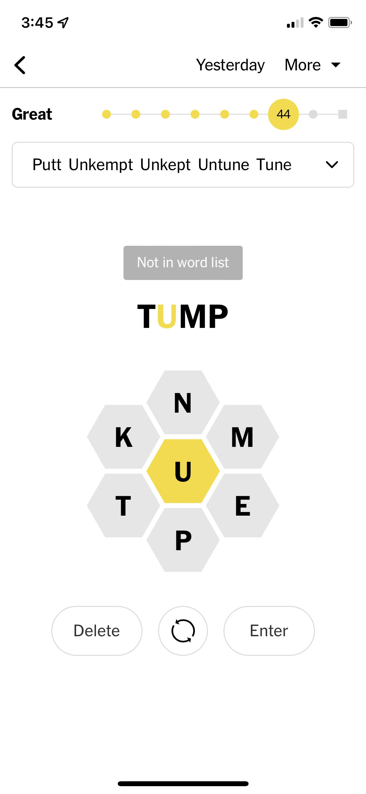

> RT @humcommons: Thank you for all of your support through Giving Tuesday\! Now we're gearing up for celebrations for our 5th Birthday this m…

 [Wed Dec 01 14:36:58 +0000 2021](https://twitter.com/kfitz/status/1466053715165655041)

----

Replying to [@kylebeachy and @nprbooks](https://twitter.com/kylebeachy/status/1466135929299554311)

> HUUUUGE congratulations, Kyle\! This is fantastic, and so well\-deserved\!

 [Wed Dec 01 23:17:44 +0000 2021](https://twitter.com/kfitz/status/1466184771726417922)

----

> RT @humcommons: We can't believe we're turning 5\! Stay tuned for a lot of celebrating this month\. 
> 
> 

 [Fri Dec 03 00:23:05 +0000 2021](https://twitter.com/kfitz/status/1466563605369921541)

----

> RT @humcommons: We've decided to have some fun for our birthday\. We'd love to see our platypus travel\. Take him and put him on your campus,…

 [Fri Dec 03 14:19:16 +0000 2021](https://twitter.com/kfitz/status/1466774036512391175)

----

> RT @humcommons: As an example, here he is partying with Sparty on campus at our home @michiganstateu\. We can't wait to see where he goes\! h…

 [Fri Dec 03 14:19:25 +0000 2021](https://twitter.com/kfitz/status/1466774075498541057)

----

> RT @achdotorg: We're getting the band back together: a virtual conference in 2022 with our friends at @csdhschn\! \#DHUnbound2022 takes place…

 [Fri Dec 03 20:53:38 +0000 2021](https://twitter.com/kfitz/status/1466873283740065795)

----

> I got to attend a workshop in Berlin last month\. Everyone was vaccinated, and the organizers gave everyone home tests to do each day\. This kind of genius meeting swag is only possible where tests cost 1\-2€ each, so I guess I’m skipping domestic conferences for a bit yet\. https://twitter\.com/alison\_mudditt/status/1466888544979283968

 [Sun Dec 05 20:52:29 +0000 2021](https://twitter.com/kfitz/status/1467597770592862209)

----

Replying to [@wynkenhimself](https://twitter.com/wynkenhimself/status/1467665950824701953)

> Miss you, friend\. Sending all the ❤️

 [Mon Dec 06 01:55:35 +0000 2021](https://twitter.com/kfitz/status/1467674046854803457)

----

> RT @achdotorg: Reviewer invitations for \#DHUnbound2022 have gone out\! If you're interested in serving as a reviewer and didn't receive an i…

 [Mon Dec 06 14:25:26 +0000 2021](https://twitter.com/kfitz/status/1467862752815464454)

----

> RT @humcommons: It's our birthday\! While we're celebrating our birthday all month, today is the day\. Check out this blog post from Project…

 [Mon Dec 06 14:29:22 +0000 2021](https://twitter.com/kfitz/status/1467863743522611208)

----

> It has been a privilege getting to work with the @humcommons team to build a new kind of future for scholarly communication\. I’m enormously grateful for what we’ve accomplished in 5 years — and even more so for what we now have ahead\. https://team\.hcommons\.org/2021/12/06/the\-commons\-at\-five/ https://twitter\.com/humcommons/status/1467863030314803200

 [Mon Dec 06 14:31:07 +0000 2021](https://twitter.com/kfitz/status/1467864183026987012)

----

Replying to [@CathyNDavidson](https://twitter.com/CathyNDavidson/status/1467865389317173262)

> Thank you, Cathy\! We’re really looking forward to our next steps\!

 [Mon Dec 06 14:38:47 +0000 2021](https://twitter.com/kfitz/status/1467866113627275273)

----

> RT @FranoisLachanc2: @humcommons @kfitz Congratulations\. And all the best for many years ahead\. Humanities Commons is a treasure not only o…

 [Mon Dec 06 17:04:19 +0000 2021](https://twitter.com/kfitz/status/1467902736847020036)

----

Replying to [@FranoisLachanc2 and @humcommons](https://twitter.com/FranoisLachanc2/status/1467897094044332038)

> Thank you, François\! It’s a delight to have you as part of that community\.

 [Mon Dec 06 17:04:55 +0000 2021](https://twitter.com/kfitz/status/1467902887225352211)

----

> As many of y’all already know, I’m building a course for the spring called Peculiar Forms of Academic Writing, focusing on forms from blog posts to manifestos to grant proposals and more\. \+

 [Mon Dec 06 19:16:50 +0000 2021](https://twitter.com/kfitz/status/1467936085388972034)

----

Replying to [@kfitz](https://twitter.com/kfitz/status/1467936085388972034)

> I’ve asked for suggestions for a couple of those forms already, and have one final ask of you: if you have one of the following you’re willing to share, would you email it to me at kfitz at msu dot edu? \+

 [Mon Dec 06 19:17:25 +0000 2021](https://twitter.com/kfitz/status/1467936233355722754)

----

Replying to [@kfitz](https://twitter.com/kfitz/status/1467936233355722754)

> I am in search of good examples of:  
>   
> 1\. Dissertation or book proposals\.  
> 2\. Letters of recommendation \(with personal info redacted, ofc\)\.  
> 3\. Peer reviews, and ideally responses thereto\. \+

 [Mon Dec 06 19:17:44 +0000 2021](https://twitter.com/kfitz/status/1467936311717908480)

----

Replying to [@kfitz](https://twitter.com/kfitz/status/1467936311717908480)

> Huge, huge thanks for all of this help\. I’ll be posting the syllabus as it stands in a week or two\!

 [Mon Dec 06 19:17:59 +0000 2021](https://twitter.com/kfitz/status/1467936374707867650)

----

Replying to [@katinalynn](https://twitter.com/katinalynn/status/1467937642490773508)

> Thanks for this, Katina\! I’ll look forward to the official sharing\-out tomorrow, but will poke around today\.

 [Mon Dec 06 19:55:17 +0000 2021](https://twitter.com/kfitz/status/1467945763649073156)

----

Replying to [@wynkenhimself](https://twitter.com/wynkenhimself/status/1467970452039606277)

> Oh, that would be fantastic\. Thank you\! Poking to follow\.

 [Mon Dec 06 21:35:41 +0000 2021](https://twitter.com/kfitz/status/1467971028714496006)

----

Replying to [@LibSkrat](https://twitter.com/LibSkrat/status/1467946717907668993)

> Just to be sure \(and apologies if you’ve already done this\), but in iOS Settings &gt; Passwords &gt; AutoFill Passwords have you turned on 1P and turned off Keychain? It works pretty well for me…

 [Mon Dec 06 21:47:27 +0000 2021](https://twitter.com/kfitz/status/1467973988139909120)

----

Replying to [@LibSkrat](https://twitter.com/LibSkrat/status/1467975718718038030)

> I am so glad I said something\. I felt exactly the same level of happiness when I figured it out\!

 [Mon Dec 06 21:55:17 +0000 2021](https://twitter.com/kfitz/status/1467975962813943812)

----

Replying to [@DrYoFiggy](https://twitter.com/DrYoFiggy/status/1467947708002578436)

> Yomaira\!\!\! Huge congratulations, and so well deserved\!

 [Mon Dec 06 23:24:35 +0000 2021](https://twitter.com/kfitz/status/1467998434103906305)

----

Replying to [@hilaryehughes](https://twitter.com/hilaryehughes/status/1468185019415990275)

> I’m really looking for proposals, but if you’re willing to share that I’d love to see it\.

 [Tue Dec 07 13:43:49 +0000 2021](https://twitter.com/kfitz/status/1468214665545146376)

----

Replying to [@Literature\_Geek](https://twitter.com/Literature_Geek/status/1468177006537883655)

> Thank you, Amanda\!

 [Tue Dec 07 13:44:01 +0000 2021](https://twitter.com/kfitz/status/1468214719085432836)

----

Replying to [@s2ceball and @wynkenhimself](https://twitter.com/s2ceball/status/1468077552874967046)

> Awesome\. Will do\!

 [Tue Dec 07 13:44:32 +0000 2021](https://twitter.com/kfitz/status/1468214849587105796)

----

Replying to [@EpistolaryBrown](https://twitter.com/EpistolaryBrown/status/1468215470549770242)

> Yep, have downloaded a ton\.

 [Tue Dec 07 13:49:27 +0000 2021](https://twitter.com/kfitz/status/1468216083781980162)

----

Replying to [@scott\_bot](https://twitter.com/scott_bot/status/1468215795033554950)

> No kidding on the quantity issue\. I’m probably not going to go there precisely because of the ways that email can suck up time for other kinds of writing, but there’s interesting work to be done\!

 [Tue Dec 07 13:50:38 +0000 2021](https://twitter.com/kfitz/status/1468216382286401543)

----

Replying to [@hralperta](https://twitter.com/hralperta/status/1468219994307801094)

> I am\! I have a week on statements \(personal, teaching, etc\) and will be making significant use of the network’s amazing collection of materials\! :\)

 [Tue Dec 07 14:46:10 +0000 2021](https://twitter.com/kfitz/status/1468230357392703510)

----

Replying to [@lesliekwchan and @humcommons](https://twitter.com/lesliekwchan/status/1468244125933883414)

> Thank you so much, Leslie, for this and for all your other ongoing support\!

 [Tue Dec 07 15:53:16 +0000 2021](https://twitter.com/kfitz/status/1468247242880565262)

----

> I \*love\* this project\. And I cannot tell you how happy it makes me that Humanities Commons has \(utterly unbeknownst to me\!\) provided support for it\! @humcommons https://twitter\.com/katinalynn/status/1468290293481062402

 [Tue Dec 07 19:57:04 +0000 2021](https://twitter.com/kfitz/status/1468308599424393216)

----

> I mentioned sometime back that I started swimming — really swimming, laps and laps — for the first time in my life this summer\. I’m slow, and will always be slow, but I’ve gotten modestly less slow over time\. \+

 [Tue Dec 07 21:47:41 +0000 2021](https://twitter.com/kfitz/status/1468336434637688842)

----

Replying to [@kfitz](https://twitter.com/kfitz/status/1468336434637688842)

> I recently decided that I should complement that swimming with a bit of strength work, as it might help me get even a tiny bit less slow still\. \+

 [Tue Dec 07 21:48:30 +0000 2021](https://twitter.com/kfitz/status/1468336642742235137)

----

Replying to [@kfitz](https://twitter.com/kfitz/status/1468336642742235137)

> Yesterday, for the first time in what must be about two years, I did squats\. The rest need not be described\. \#ouch

 [Tue Dec 07 21:49:21 +0000 2021](https://twitter.com/kfitz/status/1468336854135152641)

----

Replying to [@ctschroeder](https://twitter.com/ctschroeder/status/1468337186005078017)

> Good to know\! There’s a masters group where I swim, and I swam with them once and liked it\. The timing of their sessions isn’t ideal, but I should try to get back\.

 [Tue Dec 07 21:52:06 +0000 2021](https://twitter.com/kfitz/status/1468337548049137665)

----

Replying to [@ctschroeder](https://twitter.com/ctschroeder/status/1468337503094468609)

> You too\!

 [Tue Dec 07 21:53:35 +0000 2021](https://twitter.com/kfitz/status/1468337919962275842)

----

Replying to [@CJ\_Daugherty](https://twitter.com/CJ_Daugherty/status/1468347229316517892)

> Egads, as I think y’all say over there\.

 [Tue Dec 07 22:32:50 +0000 2021](https://twitter.com/kfitz/status/1468347800874270726)

----

> RT @quinnanya: ACH has been busy on behalf of DH in the US, from organizing conferences, to advocating for DMCA exemptions, to many kinds o…

 [Wed Dec 08 13:33:38 +0000 2021](https://twitter.com/kfitz/status/1468574493421494281)

----

Replying to [@katinalynn](https://twitter.com/katinalynn/status/1468574256439115778)

> Ugh, so sorry to hear this\!

 [Wed Dec 08 13:58:58 +0000 2021](https://twitter.com/kfitz/status/1468580866276446210)

----

Replying to [@jadedid](https://twitter.com/jadedid/status/1468571549225472001)

> No\. No no no\.

 [Wed Dec 08 13:59:15 +0000 2021](https://twitter.com/kfitz/status/1468580938842005508)

----

Replying to [@kwazana](https://twitter.com/kwazana/status/1468431332686528514)

> I have been thinking about that\! I need to talk to the folks at my club about the various classes they offer\. They also offer individual coaching sessions, which might be good too\.

 [Wed Dec 08 14:58:12 +0000 2021](https://twitter.com/kfitz/status/1468595774892265478)

----

Replying to [@kwazana](https://twitter.com/kwazana/status/1468431332686528514)

> I hope that you do get back to swimming — it’s been a real sanity saver for me, in addition to the physical benefits\. The pool is the one place where I can really leave everything else behind and just be\.

 [Wed Dec 08 14:59:17 +0000 2021](https://twitter.com/kfitz/status/1468596046041333767)

----

> It only just hit me, when I was asked to log in to a new administrative system I’m likely to spend hours on here on campus and it offered me “dark mode,” that dark mode is not a fucking feature\. It’s a means to keep you working past optical capacity\.

 [Wed Dec 08 21:22:51 +0000 2021](https://twitter.com/kfitz/status/1468692576005992454)

----

> RT @achdotorg: Letters from ACH and many of our members successfully made the case for a DMCA exemption that opens up new possibilities for…

 [Wed Dec 08 21:42:36 +0000 2021](https://twitter.com/kfitz/status/1468697543274024962)

----

> I love this 🧵 https://twitter\.com/samplereality/status/1468684343073976320

 [Wed Dec 08 21:54:29 +0000 2021](https://twitter.com/kfitz/status/1468700536904036353)

----

> RT @JoshuaPotash: Everyone should see this\. The workers rejected the contract because it keeps two tiers\. One for people hired in the last…

 [Wed Dec 08 23:21:35 +0000 2021](https://twitter.com/kfitz/status/1468722455237771270)

----

Replying to [@mkirschenbaum](https://twitter.com/mkirschenbaum/status/1468790938743058435)

> I'm not saying it doesn’t work\. I’m saying it works to keep us working\.

 [Thu Dec 09 11:53:49 +0000 2021](https://twitter.com/kfitz/status/1468911762871304193)

----

> This is a fabulous commission, with a great group of folks working on a key set of issues\! I so look forward to seeing what develops\. https://twitter\.com/ACLS1919/status/1468952541295779842

 [Thu Dec 09 16:25:02 +0000 2021](https://twitter.com/kfitz/status/1468980014423195660)

----

> I was yesterday years old when I figured out that pubs got that name by contrast with clubs\.

 [Thu Dec 09 23:41:34 +0000 2021](https://twitter.com/kfitz/status/1469089872724041731)

----

Replying to [@jvinopal](https://twitter.com/jvinopal/status/1469104334159945728)

> Exactly\. “Pubs” from “public houses,” as opposed to clubs, which are members\-only\.

 [Fri Dec 10 00:40:43 +0000 2021](https://twitter.com/kfitz/status/1469104757440749575)

----

Replying to [@FranoisLachanc2](https://twitter.com/FranoisLachanc2/status/1469111713215692817)

> Sadly, no\.  Watching Get Back, though\.

 [Fri Dec 10 01:13:09 +0000 2021](https://twitter.com/kfitz/status/1469112920730738691)

----

Replying to [@BerondaM](https://twitter.com/BerondaM/status/1469396828068192258)

> Sending all the ❤️ — not least because I could use one of those myself\.

 [Fri Dec 10 22:15:02 +0000 2021](https://twitter.com/kfitz/status/1469430481900945409)

----

> Those were the days\. Thanks for this trip down memory lane, @Adam\_Crymble\! https://twitter\.com/Adam\_Crymble/status/1470360703613784070

 [Mon Dec 13 13:39:08 +0000 2021](https://twitter.com/kfitz/status/1470387816194531333)

----

Replying to [@kfitz](https://twitter.com/kfitz/status/1470387816194531333)

> I’m mildly mortified to note that this morning is the first time that the significance of “Ivan Tribble” hit me\. It requires a little Boris &amp; Natasha to parse: “You van tribble? You got tribble\!”

 [Mon Dec 13 13:40:30 +0000 2021](https://twitter.com/kfitz/status/1470388159116632064)

----

> RT @humcommons: In honor of our birthday, members of the Commons community have written guest posts for our blog\! For the first in our seri…

 [Mon Dec 13 14:03:34 +0000 2021](https://twitter.com/kfitz/status/1470393965727866885)

----

> I want an email client plugin that allows you to killfile the senders of messages that arrive after 4pm local on any given Friday, after noon on the day before a holiday weekend, or within a user\-settable window prior to the start of a holiday break\. https://twitter\.com/billhd/status/1470514004082761729

 [Mon Dec 13 22:07:55 +0000 2021](https://twitter.com/kfitz/status/1470515854769115141)

----

Replying to [@kfitz](https://twitter.com/kfitz/status/1470515854769115141)

> And I do mean senders\.

 [Mon Dec 13 22:08:31 +0000 2021](https://twitter.com/kfitz/status/1470516007588478979)

----

Replying to [@kfitz](https://twitter.com/kfitz/status/1470516007588478979)

> Of course, that might mean never getting another message from certain administrators\.

 [Mon Dec 13 22:09:01 +0000 2021](https://twitter.com/kfitz/status/1470516132100587524)

----

Replying to [@kfitz](https://twitter.com/kfitz/status/1470516132100587524)

> Hang on, I’m thinking\. 🤔

 [Mon Dec 13 22:09:20 +0000 2021](https://twitter.com/kfitz/status/1470516211377188868)

----

Replying to [@billhd](https://twitter.com/billhd/status/1470516032351649795)

> Love\. It\.

 [Mon Dec 13 22:10:15 +0000 2021](https://twitter.com/kfitz/status/1470516444391690244)

----

Replying to [@billhd](https://twitter.com/billhd/status/1470517144651808774)

> Ahahahahahaha

 [Mon Dec 13 22:14:27 +0000 2021](https://twitter.com/kfitz/status/1470517498009493505)

----

Replying to [@ut\_english and @tanyaclement](https://twitter.com/ut_english/status/1470844968369639434)

> Tanya\! Huge congratulations\!

 [Tue Dec 14 23:02:48 +0000 2021](https://twitter.com/kfitz/status/1470892056566456324)

----

Replying to [@sugaronthegash, @nightboatbooks and @PENamerica](https://twitter.com/sugaronthegash/status/1471140929226653698)

> Divya\!\!\! Congratulations\! 🎉

 [Wed Dec 15 15:56:11 +0000 2021](https://twitter.com/kfitz/status/1471147079628115974)

----

Replying to [@FeliciaLCarr](https://twitter.com/FeliciaLCarr/status/1471148477518258184)

> Exactly\.

 [Wed Dec 15 16:03:10 +0000 2021](https://twitter.com/kfitz/status/1471148839906254856)

----

> Oh, this is such a loss\. https://twitter\.com/heraldleader/status/1471153804447997952

 [Wed Dec 15 19:27:42 +0000 2021](https://twitter.com/kfitz/status/1471200310110662668)

----

> RT @FeliciaLCarr: @kfitz I agree\. Don’t dump work on your colleagues\. Use the schedule feature and set emails to send the day after we all…

 [Wed Dec 15 21:58:13 +0000 2021](https://twitter.com/kfitz/status/1471238191730597891)

----

> Huge, well\-deserved congrats, @hralperta\! https://twitter\.com/NEH\_ODH/status/1471217808101023757

 [Wed Dec 15 22:53:46 +0000 2021](https://twitter.com/kfitz/status/1471252169538080779)

----

Replying to [@khj5c and @FeliciaLCarr](https://twitter.com/khj5c/status/1471253053282177028)

> Because if it’s in my inbox I have to worry about it\. And I will worry about it, during time when I’m not supposed to have to be thinking about work\. If you don’t want to pass the worry to someone else, use scheduled send\.

 [Wed Dec 15 23:13:45 +0000 2021](https://twitter.com/kfitz/status/1471257198739308551)

----

Replying to [@khj5c and @FeliciaLCarr](https://twitter.com/khj5c/status/1471259770422280198)

> Okay, this has officially gotten rude\. Why is it such a burden on you to consider someone else’s boundaries?

 [Thu Dec 16 00:00:49 +0000 2021](https://twitter.com/kfitz/status/1471269044544319497)

----

> RT @InvestInOpen: "The Conquest of @ProQuest and @KUnlatched : How recent mergers are bad for research and the public” — new post from IOI’…

 [Thu Dec 16 14:43:23 +0000 2021](https://twitter.com/kfitz/status/1471491148237533188)

----

> RT @martin\_eve: Just deposited the full, final version of record of WAREZ in the @humcommons CORE repository\. Another place where you can n…

 [Thu Dec 16 15:02:01 +0000 2021](https://twitter.com/kfitz/status/1471495839856033793)

----

> RT @CLAscholar: \#CLAScholars, let's join together and wish @DWill5 a resounding congratulations\! She has been elected as second vice presid…

 [Thu Dec 16 23:21:30 +0000 2021](https://twitter.com/kfitz/status/1471621537161695237)

----

Replying to [@shannonmattern](https://twitter.com/shannonmattern/status/1471845487938609158)

> WOW, that’s a surprise\. I was flabbergasted when I first saw that store\!

 [Fri Dec 17 14:14:20 +0000 2021](https://twitter.com/kfitz/status/1471846226740002820)

----

> Hear, hear\! https://twitter\.com/JenServenti/status/1471870259896336385

 [Fri Dec 17 17:43:22 +0000 2021](https://twitter.com/kfitz/status/1471898828987109383)

----

Replying to [@DEJPett, @JenServenti, @EthanWatrall, @lynnegoldstein and @NEH\_ODH](https://twitter.com/DEJPett/status/1471890935416041486)

> I’m not an archaeologist\. I don’t even play one on TV\. But \#msudai welcomed me in anyway\. And somehow I never left\!

 [Fri Dec 17 17:47:20 +0000 2021](https://twitter.com/kfitz/status/1471899830440296448)

----

Replying to [@JenServenti, @DEJPett, @EthanWatrall, @lynnegoldstein and @NEH\_ODH](https://twitter.com/JenServenti/status/1471900389880438790)

> Bahahahahahaha\!

 [Fri Dec 17 17:51:07 +0000 2021](https://twitter.com/kfitz/status/1471900781976641542)

----

> RT @humcommons: Next up in our birthday series is a guest blog post from \#AliceLynnMcMichael about "Open Source Announcements"\-\-check it ou…

 [Fri Dec 17 22:16:39 +0000 2021](https://twitter.com/kfitz/status/1471967606450044930)

----

> RT @ByzCapp: I use @humcommons for all sorts of things and was happy to describe how to use it for announcements\. Maybe if you need somethi…

 [Fri Dec 17 22:16:45 +0000 2021](https://twitter.com/kfitz/status/1471967628088553480)

----

> The last several days have felt very first\-week\-of\-March\-2020, except with all exhaustion of the months since then\. We’ve been looking at each other and recognizing that we need to raise our defenses again\. \+

 [Sat Dec 18 21:48:05 +0000 2021](https://twitter.com/kfitz/status/1472322804389396485)

----

Replying to [@kfitz](https://twitter.com/kfitz/status/1472322804389396485)

> The good news is that we know how, better than we did then, and we’re not facing the same kind of run\-on\-toilet\-paper panic out there\. \+

 [Sat Dec 18 21:48:20 +0000 2021](https://twitter.com/kfitz/status/1472322866142142473)

----

Replying to [@kfitz](https://twitter.com/kfitz/status/1472322866142142473)

> The bad news is that in the absence of a real lockdown, there are external requirements\. My family is expecting me next week, for one\. \+

 [Sat Dec 18 21:48:36 +0000 2021](https://twitter.com/kfitz/status/1472322932219252739)

----

Replying to [@kfitz](https://twitter.com/kfitz/status/1472322932219252739)

> I’ve also gotten a bit used to \-\- being fully vaccinated and boosted — my ability to be out and about in a careful and limited way\. But the number of folks I know who have that same status and have gotten sick in the last week is shocking\. \+

 [Sat Dec 18 21:48:49 +0000 2021](https://twitter.com/kfitz/status/1472322987261112329)

----

Replying to [@kfitz](https://twitter.com/kfitz/status/1472322987261112329)

> This is going to be harder than March 2020, I think, in a whole lot of ways\.

 [Sat Dec 18 21:49:09 +0000 2021](https://twitter.com/kfitz/status/1472323071893815296)

----

Replying to [@thelongviewtom](https://twitter.com/@thelongviewtom/status/1472324566999605250)

> Me and the other person in my house\. :\) Probably could have been clearer about that\!

 [Sat Dec 18 21:58:20 +0000 2021](https://twitter.com/kfitz/status/1472325383970332672)

----

Replying to [@kfitz](https://twitter.com/kfitz/status/1472322804389396485)

> NB: “We” here \= me and the other person in my house\. I’d love for that “we” to be more general, but… sigh\.

 [Sat Dec 18 21:59:19 +0000 2021](https://twitter.com/kfitz/status/1472325628758274052)

----

Replying to [@CJ\_Daugherty](https://twitter.com/CJ_Daugherty/status/1472330536022687749)

> Seriously\. Thinking about y’all over there and sending all the best\.

 [Sat Dec 18 22:29:29 +0000 2021](https://twitter.com/kfitz/status/1472333223162269701)

----

Replying to [@CJ\_Daugherty](https://twitter.com/CJ_Daugherty/status/1472334172454854660)

> Yes\! There will be excellent cocktails\.

 [Sat Dec 18 22:39:15 +0000 2021](https://twitter.com/kfitz/status/1472335681859072001)

----

Replying to [@aejolene](https://twitter.com/aejolene/status/1472335024557076485)

> Alas, yes\. For some value of “all of us\.”

 [Sat Dec 18 22:40:25 +0000 2021](https://twitter.com/kfitz/status/1472335974701088770)

----

> RT @DH2022\_Tokyo: \*\*ANNOUNCEMENT\*\* Due to the current COVID situation, local conference organizers have decided DH2022 to be held entirely…

 [Mon Dec 20 16:29:49 +0000 2021](https://twitter.com/kfitz/status/1472967483879534607)

----

> See, this is what I’m talking about\. If you want it off your to\-do list, that’s understandable\. But dropping it in someone else's lap today is rude\. I wish we would default to scheduled send and let the project hang in the ether, with no one burdened, until Jan\. 3\. https://twitter\.com/shannonmattern/status/1473689451297660932

 [Wed Dec 22 16:31:47 +0000 2021](https://twitter.com/kfitz/status/1473692753825603593)

----

Replying to [@martin\_eve](https://twitter.com/martin_eve/status/1473696645829304324)

> Argh, Martin, I’m so sorry\. Sending you healing thoughts\. 💙

 [Wed Dec 22 16:54:41 +0000 2021](https://twitter.com/kfitz/status/1473698516715384840)

----

Replying to [@wynkenhimself](https://twitter.com/wynkenhimself/status/1473703150729183239)

> Omfg that’s unconscionable\.

 [Wed Dec 22 17:18:46 +0000 2021](https://twitter.com/kfitz/status/1473704577715343369)

----

Replying to [@shermandorn](https://twitter.com/shermandorn/status/1473709057282347014)

> Separate Thoughts, indeed\.

 [Wed Dec 22 20:31:45 +0000 2021](https://twitter.com/kfitz/status/1473753146941915144)

----

Replying to [@GeorgeOnline](https://twitter.com/GeorgeOnline/status/1473747013015678985)

> There with you, G, in a lot of respects\. You’ve got a few months on me, and I got through some of those professional processes faster, but it’s still a moment that calls for some serious reflection\. Sending wishes for clarity your way\.

 [Wed Dec 22 20:34:17 +0000 2021](https://twitter.com/kfitz/status/1473753782546841607)

----

> RT @humcommons: For our next birthday blog post, @annetiquate describes her experiences working on the Commons and reminisces on its evolut…

 [Thu Dec 23 14:41:48 +0000 2021](https://twitter.com/kfitz/status/1474027467212001280)

----

Replying to [@mkirschenbaum](https://twitter.com/mkirschenbaum/status/1474060579249831937)

> So little drama, though, as we all know from the outset that they’re just going to poach someone fancy from another institution in the end\.

 [Thu Dec 23 17:13:23 +0000 2021](https://twitter.com/kfitz/status/1474065610443304976)

----

> RT @dancohen: I wrote a small ode to what @humcommons represents, for the Humanities Commons blog on their fifth anniversary https://t\.co/C…

 [Thu Dec 23 18:54:03 +0000 2021](https://twitter.com/kfitz/status/1474090947684278277)

----

> RT @humcommons: The Commons Team is taking a break for the next few days to be with friends and family\. Wishing everyone a safe and healthy…

 [Fri Dec 24 14:21:29 +0000 2021](https://twitter.com/kfitz/status/1474384739356352527)

----

Replying to [@EthanWatrall, @billhd and @sharonmleon](https://twitter.com/EthanWatrall/status/1474414698414030850)

> Ah, the store that an\(other\) associate dean friend of ours refers to as “the People’s Kroger\.” I have less generous nicknames for it\.

 [Fri Dec 24 17:23:50 +0000 2021](https://twitter.com/kfitz/status/1474430631958532100)

----

> For me, this story is the culmination of a long Google Alerts relationship\. I’ve followed her career from high school through both her college teams, and am delighted to know she’s still knocking ‘em down\. You go, Ms\. Fitz\. ❤️ https://twitter\.com/CBSNews/status/1474054747825086469

 [Fri Dec 24 17:30:11 +0000 2021](https://twitter.com/kfitz/status/1474432228205768708)

----

> RT @humcommons: For our final blog post in our birthday series, the Graphic Possibilities team @JulianChambliss, \#NicoleHuff, and @JustinWi…

 [Wed Dec 29 14:26:09 +0000 2021](https://twitter.com/kfitz/status/1476197853731119164)

----

> RT @shannonmattern: Just finished rdg @kfitz’s Generous Thinking, partly abt ways to reimagine higher ed as a public good; now listening to…

 [Fri Dec 31 16:43:14 +0000 2021](https://twitter.com/kfitz/status/1476957129525321734)

----

> NOOOOOOOOOO

 [Fri Dec 31 19:24:28 +0000 2021](https://twitter.com/kfitz/status/1476997703070531587)

----

Replying to [@kfitz](https://twitter.com/kfitz/status/1476997703070531587)

> Betty White was an inspiration in so many ways\. A brilliant example of survival in shitty times\. We have lost an icon\.

 [Fri Dec 31 19:27:48 +0000 2021](https://twitter.com/kfitz/status/1476998540945727489)

----

> The Long 2020: the year that just keeps on fucking giving\.

 [Fri Dec 31 19:38:16 +0000 2021](https://twitter.com/kfitz/status/1477001175962726409)

----

> I implore all of you to celebrate the hell out of this new year’s eve, so that we might actually find out way out of the old one\.

 [Fri Dec 31 19:39:30 +0000 2021](https://twitter.com/kfitz/status/1477001488861999117)

----

> I swear to god: we’re all stuck in some stupid escape room somewhere\.

 [Fri Dec 31 19:40:26 +0000 2021](https://twitter.com/kfitz/status/1477001720693673984)

----

> After everything, everything I kept waiting to break me, this was apparently what it took\. I feel ridiculous, and yet utterly crushed\.

 [Fri Dec 31 19:43:59 +0000 2021](https://twitter.com/kfitz/status/1477002613778522118)

----

Replying to [@wynkenhimself](https://twitter.com/wynkenhimself/status/1477005272044519429)

> EXACTLY

 [Fri Dec 31 19:57:24 +0000 2021](https://twitter.com/kfitz/status/1477005990641942533)

----

> I consider this a slander against the deep south\. 
> 
> 

 [Fri Dec 31 20:47:18 +0000 2021](https://twitter.com/kfitz/status/1477018550917341184)

----

Replying to [@JustinWigard](https://twitter.com/JustinWigard/status/1477020740792856576)

> Oooh\. I’ve been seeing friends tweeting results the last few days\. I’ll check it out\!

 [Fri Dec 31 20:59:48 +0000 2021](https://twitter.com/kfitz/status/1477021696003563533)

----

Replying to [@hkpmcgregor](https://twitter.com/hkpmcgregor/status/1477019231291994115)

> For cryin’ out loud how is that not there???

 [Fri Dec 31 21:02:19 +0000 2021](https://twitter.com/kfitz/status/1477022330148855816)

----

Replying to [@ProfM\_Lindemann](https://twitter.com/ProfM_Lindemann/status/1477046561041522691)

> Exactly\. What does it do if not tump?

 [Fri Dec 31 22:59:47 +0000 2021](https://twitter.com/kfitz/status/1477051888432517123)

----

Replying to [@toddbutler](https://twitter.com/toddbutler/status/1477077050754174977)

> Valentine’s Day\.

 [Sat Jan 01 01:57:09 +0000 2022](https://twitter.com/kfitz/status/1477096525125894151)

----

Replying to [@brettbobley](https://twitter.com/brettbobley/status/1477097147719987200)

> I drew on strengths I never knew I had\! Happy new year, Brett\! 😁

 [Sat Jan 01 02:01:09 +0000 2022](https://twitter.com/kfitz/status/1477097530651459584)

----

> Sheesh, it’s been a day\. There were some really good bits, including an excellent swim, in which I figured out what I’m doing wrong when I try to breathe left, if not exactly how to fix it\. \+

 [Sat Jan 01 02:04:28 +0000 2022](https://twitter.com/kfitz/status/1477098366412771331)

----

Replying to [@kfitz](https://twitter.com/kfitz/status/1477098366412771331)

> I’m choosing to accept that as metaphor for something larger and keep trying to roll rather than turn\. That, and a really good bottle of inexpensive cava, I wish for all of you\. May there be better ahead\. \#HappyNewYear2022

 [Sat Jan 01 02:06:53 +0000 2022](https://twitter.com/kfitz/status/1477098976021299205)