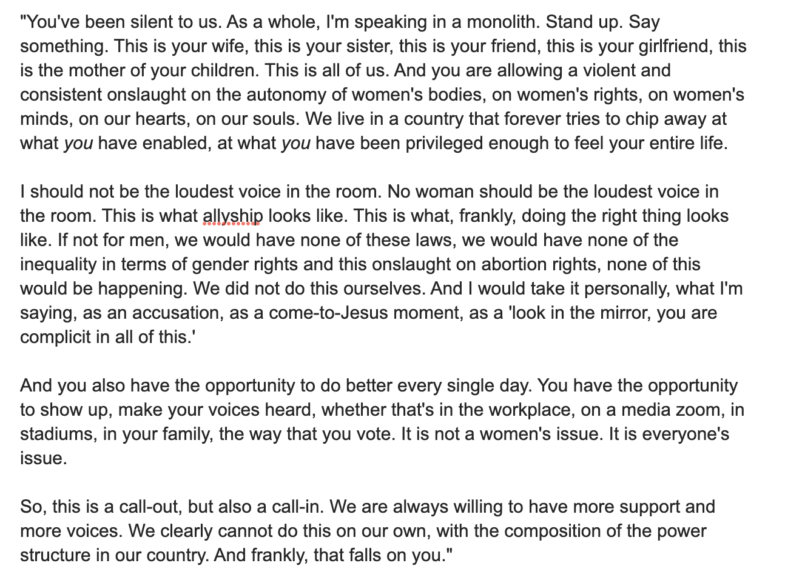

Replying to [@taliaschaffer1, @stewdust and @SaraNAhmed](https://twitter.com/taliaschaffer1/status/1532449812485922816)

> Wow wow wow this sounds like an amazing conversation\. I’m honored to have been part of such a pairing\!

 [Thu Jun 02 20:43:10 +0000 2022](https://twitter.com/kfitz/status/1532462854351245312)

----

Replying to [@annehelen](https://twitter.com/annehelen/status/1532482766431916032)

> Right? I love their meeting poll interface too — so much less awful than any other I’ve used\.

 [Thu Jun 02 22:29:31 +0000 2022](https://twitter.com/kfitz/status/1532489615537340416)

----

> One of the great privileges of having the position I’ve landed in within the academy is getting to write in support of excellent candidates who are being reviewed for tenure and/or promotion in my fields\. \+

 [Sat Jun 04 20:58:17 +0000 2022](https://twitter.com/kfitz/status/1533191433540468736)

----

Replying to [@kfitz](https://twitter.com/kfitz/status/1533191433540468736)

> Writing such letters is an exceedingly time\-consuming process, and it demands a great deal of focus and energy\. Helping more folks achieve the status that I was lucky enough to achieve makes completely worth it\. \+

 [Sat Jun 04 20:58:37 +0000 2022](https://twitter.com/kfitz/status/1533191515882889216)

----

Replying to [@kfitz](https://twitter.com/kfitz/status/1533191515882889216)

> There’s one “but” involved here, and I want to be clear that it has NOTHING WHATSOEVER to do with the candidates, and everything to do with the structures within which they work\. \+

 [Sat Jun 04 20:58:54 +0000 2022](https://twitter.com/kfitz/status/1533191588452638720)

----

Replying to [@kfitz](https://twitter.com/kfitz/status/1533191588452638720)

> But\. In the process of doing these reviews, summer in and summer out, I am presented with a wide array of often oppressive and constraining departmental and college “guidelines” for promotion and tenure that are meant to shape my work\. \+

 [Sat Jun 04 20:59:07 +0000 2022](https://twitter.com/kfitz/status/1533191641808388098)

----

Replying to [@kfitz](https://twitter.com/kfitz/status/1533191641808388098)

> I draw language from and refer to such guidelines where I feel they’re working in the candidate’s interest\. And where they’re not, the department chair and/or review committee should expect to get an earful from me about it\. \+

 [Sat Jun 04 20:59:20 +0000 2022](https://twitter.com/kfitz/status/1533191695130566664)

----

Replying to [@kfitz](https://twitter.com/kfitz/status/1533191695130566664)

> The best part of having gotten to the position I’ve achieved is getting to do whatever I can to undermine the stupid metrics that allow the prestige economy to continue to deform otherwise exciting academic careers\. \+

 [Sat Jun 04 20:59:38 +0000 2022](https://twitter.com/kfitz/status/1533191771475279872)

----

Replying to [@kfitz](https://twitter.com/kfitz/status/1533191771475279872)

> I’m not sure what I’m doing it for, otherwise\. /fin

 [Sat Jun 04 21:00:00 +0000 2022](https://twitter.com/kfitz/status/1533191863062216705)

----

Replying to [@eetempleton](https://twitter.com/eetempleton/status/1534494144017612801)

> We have a Cuisinart stainless steel kettle that’s got multiple temperature settings\. We’ve had it for at least seven years and use it multiple times daily\.

 [Wed Jun 08 13:08:40 +0000 2022](https://twitter.com/kfitz/status/1534522801209606145)

----

> You know what I want? Not the ability to select a default browser, but the ability to assign particular things to particular browsers\. For instance, open any link with “http://google\.com” in it in Chrome\. Open other things elsewhere\. Can that be a thing?

 [Wed Jun 08 15:32:06 +0000 2022](https://twitter.com/kfitz/status/1534558897629016066)

----

Replying to [@jwolman](https://twitter.com/jwolman/status/1534559772082458624)

> I will\. But frankly I was hoping you’d say “duh, Kathleen, how did you know know about this amazing thing that already exists?”

 [Wed Jun 08 15:37:10 +0000 2022](https://twitter.com/kfitz/status/1534560171527118850)

----

Replying to [@jwolman](https://twitter.com/jwolman/status/1534561035415191554)

> Gee, copy and paste\. Why didn’t I think of that\.

 [Wed Jun 08 15:42:50 +0000 2022](https://twitter.com/kfitz/status/1534561599339606017)

----

Replying to [@jwolman](https://twitter.com/jwolman/status/1534561555022434305)

> Huh\! I will do that\.

 [Wed Jun 08 15:45:16 +0000 2022](https://twitter.com/kfitz/status/1534562210151690245)

----

Replying to [@jwolman](https://twitter.com/jwolman/status/1534562855810256897)

> Nice\. Thank you for doing this research for me\!

 [Wed Jun 08 15:50:55 +0000 2022](https://twitter.com/kfitz/status/1534563633258168320)

----

Replying to [@kfitz](https://twitter.com/kfitz/status/1534558897629016066)

> Turns out it can be a thing\. In paid app form: https://www\.choosyosx\.com   
>   
> And in homebrew form: https://github\.com/johnste/finicky   
>   
> \(HT @jwolman\)

 [Wed Jun 08 15:53:34 +0000 2022](https://twitter.com/kfitz/status/1534564300253192192)

----

Replying to [@jwolman](https://twitter.com/jwolman/status/1534567025179209728)

> Ah, good to know\.

 [Wed Jun 08 16:06:48 +0000 2022](https://twitter.com/kfitz/status/1534567631558168577)

----

Replying to [@jwolman](https://twitter.com/jwolman/status/1534567025179209728)

> Okay, I kinda love it\.

 [Wed Jun 08 16:27:57 +0000 2022](https://twitter.com/kfitz/status/1534572950380285955)

----

> Have had this conversation with family members who are not kids\. https://twitter\.com/ryancordell/status/1535315128450785282

 [Fri Jun 10 21:23:02 +0000 2022](https://twitter.com/kfitz/status/1535371989422342145)

----

> I cannot help but note that today the NYT crossword has a very good three\-letter solution for “state fiction as fact\.” Would be awesome if they shared that ever so economical solution with their colleagues in the newsroom\.

 [Sun Jun 12 21:57:07 +0000 2022](https://twitter.com/kfitz/status/1536105342635020289)

----

Replying to [@jwolman](https://twitter.com/jwolman/status/1536105739072131072)

> Ahahahahahaha

 [Sun Jun 12 21:58:59 +0000 2022](https://twitter.com/kfitz/status/1536105811495231488)

----

Replying to [@martin\_eve](https://twitter.com/martin_eve/status/1536301218007498753)

> I’m so sorry to hear this, Martin\. Sending you healing thoughts\!

 [Mon Jun 13 12:24:57 +0000 2022](https://twitter.com/kfitz/status/1536323740124037121)

----

Replying to [@jadedid](https://twitter.com/jadedid/status/1536297636831051777)

> UGH, I am so sorry to hear this, and I hope you’re able to fend it off\! :\(

 [Mon Jun 13 12:25:38 +0000 2022](https://twitter.com/kfitz/status/1536323908806270977)

----

> RT @catherinecronin: honoured to join educators from @amicalnet consortium at AMICAL 2022 this week to explore 'Critical digital literacies…

 [Mon Jun 13 12:28:45 +0000 2022](https://twitter.com/kfitz/status/1536324694827225089)

----

Replying to [@jadedid](https://twitter.com/jadedid/status/1536326679240523778)

> I can only imagine\. Sending &lt;3

 [Mon Jun 13 12:55:06 +0000 2022](https://twitter.com/kfitz/status/1536331325820616704)

----

> Hooray\! This is super exciting\. Congrats, @amandafrench\! https://twitter\.com/amandafrench/status/1536369816658792448

 [Mon Jun 13 16:34:31 +0000 2022](https://twitter.com/kfitz/status/1536386543811710976)

----

Replying to [@caseyjohnston and @darth](https://twitter.com/caseyjohnston/status/1536441045977735169)

> Chaotic is exactly the right word, and I am one of them\. Seriously, if I’m free now let’s do it, or we’ll end up spending the same amount of time negotiating something three weeks from now which I will spend even more time dreading\. Just hit me now and let’s be done\.

 [Mon Jun 13 20:59:40 +0000 2022](https://twitter.com/kfitz/status/1536453271023394818)

----

> Today’s moment of triumph: I reported a problem this morning in a platform I use, and this afternoon they got back to me saying “we were able to reproduce that; it’s going to take us a while to fix it, but thanks for reporting it\!”

 [Mon Jun 13 21:49:55 +0000 2022](https://twitter.com/kfitz/status/1536465916145311746)

----

Replying to [@jadedid](https://twitter.com/jadedid/status/1536675063298150401)

> Nooooooooo\! I hope it stays mild, too\. Healing thoughts your way…

 [Tue Jun 14 15:09:53 +0000 2022](https://twitter.com/kfitz/status/1536727633303674884)

----

Replying to [@eetempleton](https://twitter.com/eetempleton/status/1536696467544748032)

> Also those shoes\! 😍

 [Tue Jun 14 15:14:25 +0000 2022](https://twitter.com/kfitz/status/1536728776423383041)

----

> I have recently had some luck with griping about macOS things I hate and having someone here point me to a fix\. So here’s my next gripe\! \+

 [Tue Jun 14 15:45:32 +0000 2022](https://twitter.com/kfitz/status/1536736605255438336)

----

Replying to [@kfitz](https://twitter.com/kfitz/status/1536736605255438336)

> Frequently when I click on a window to bring it into focus, and then click elsewhere in \(or out\) of the window, the window moves to put the title bar where my second click was\. MAKE IT STOP\.

 [Tue Jun 14 15:48:16 +0000 2022](https://twitter.com/kfitz/status/1536737291233906691)

----

Replying to [@EthanWatrall, @MSU\_dhilab and @Mattermost](https://twitter.com/EthanWatrall/status/1536769305144045568)

> Ooooh\! Time to update my @mattermost installs, too\!

 [Tue Jun 14 18:13:12 +0000 2022](https://twitter.com/kfitz/status/1536773766772322304)

----

Replying to [@martin\_eve](https://twitter.com/martin_eve/status/1537054764902621185)

> Argh this is terrible\. I am so sorry Martin, and hope you’re home safe now\!

 [Wed Jun 15 22:39:32 +0000 2022](https://twitter.com/kfitz/status/1537203180131565570)

----

> Okay, this one gets a holy carp\.   
>   
> Wordle 361 2/6  
>   
> ⬜🟨⬜⬜🟨  
> 🟩🟩🟩🟩🟩

 [Wed Jun 15 22:41:28 +0000 2022](https://twitter.com/kfitz/status/1537203664573681664)

----

Replying to [@BlackDigitalHum, @ssrc\_org and @ssrc\_just\_tech](https://twitter.com/BlackDigitalHum/status/1537109425072357381)

> Congratulations, Kim\! This is so exciting\!

 [Wed Jun 15 23:39:14 +0000 2022](https://twitter.com/kfitz/status/1537218204166402048)

----

> Could it be a portal that opens on the former office of @NEH\_ODH in the Old Post Office? Two birds, one stone? @brettbobley @JenServenti @jasonrhody https://twitter\.com/CapitolClio/status/1537531256178720769

 [Fri Jun 17 00:10:38 +0000 2022](https://twitter.com/kfitz/status/1537588491336372226)

----

Replying to [@profwernimont](https://twitter.com/profwernimont/status/1537836958474444801)

> ARGH, I am so sorry to hear that, Jacque\! I had cause to discover years and years ago that “it’s something autoimmune” \*shrug\* is doctor for “we haven’t a clue\.” I hope they get a clue, and that you get some relief in the meantime\!

 [Fri Jun 17 20:55:50 +0000 2022](https://twitter.com/kfitz/status/1537901859406376961)

----

Replying to [@ryancordell](https://twitter.com/ryancordell/status/1537842254479499264)

> Dude, if whatever “yfrog” was still worked, this tweet would show you much the same picture, and includes the same emotion\. Mine was USAir\-related, and I was in C’ville, but otherwise our sagas so relate\. https://twitter\.com/kfitz/status/18630281862

 [Fri Jun 17 21:19:25 +0000 2022](https://twitter.com/kfitz/status/1537907794505936896)

----

Replying to [@ryancordell](https://twitter.com/kfitz/status/1537907794505936896)

> \(I was at the most important meeting I’d ever attended to that point in my career, and had flown from London to NYC to C’ville, only to get diverted by storms and have my suitcase go AWOL for days\. @nowviskie took me to Old Navy for clean t\-shirts\.\)

 [Fri Jun 17 21:22:03 +0000 2022](https://twitter.com/kfitz/status/1537908457554120704)

----

Replying to [@atrubek](https://twitter.com/atrubek/status/1537879056443510785)

> Ah, this is so great\. I will stand firm in my opinion that the greatest cookbook in the history of cookbooks is the original River Road Recipes, which was one of those spiral\-bound Junior League numbers\. We need more of that\.

 [Fri Jun 17 21:53:09 +0000 2022](https://twitter.com/kfitz/status/1537916281206079488)

----

Replying to [@EthanWatrall](https://twitter.com/EthanWatrall/status/1537902781142425606)

> Please do\!

 [Fri Jun 17 23:03:29 +0000 2022](https://twitter.com/kfitz/status/1537933981735276545)

----

Replying to [@kwazana](https://twitter.com/kwazana/status/1537909131557732355)

> Very effing few R1s have the faculty\-to\-endowment ratio of that SLAC\. So yeah, maybe don’t count on an Ivy salary, but otherwise, I call bullshit\.

 [Fri Jun 17 23:27:12 +0000 2022](https://twitter.com/kfitz/status/1537939949290258432)

----

Replying to [@ryancordell and @nowviskie](https://twitter.com/ryancordell/status/1538086010772287488)

> Awful\.

 [Sat Jun 18 10:46:35 +0000 2022](https://twitter.com/kfitz/status/1538110922635583491)

----

Replying to [@electricarchaeo](https://twitter.com/electricarchaeo/status/1538160532628221952)

> It often does\! And I’ve always been told it’s so that things can be sold in the Canadian market as well\. So the price thing doesn’t make sense\.

 [Sat Jun 18 14:10:56 +0000 2022](https://twitter.com/kfitz/status/1538162349701464064)

----

Replying to [@kwazana](https://twitter.com/kwazana/status/1538218629677867011)

> Yes, please\.

 [Sat Jun 18 17:59:13 +0000 2022](https://twitter.com/kfitz/status/1538219800329129984)

----

Replying to [@BerondaM, @TWeiston, @alwaystheself, @SaraNAhmed, @WinnifredBrown, @profnicolej, @triciamatthew and @deborahrowland](https://twitter.com/BerondaM/status/1538257894642176002)

> Thank you so much for including me, Beronda\! Can’t wait to see what you do from that new office\.

 [Sat Jun 18 21:56:23 +0000 2022](https://twitter.com/kfitz/status/1538279484364836864)

----

Replying to [@jvinopal and @edrabinski](https://twitter.com/jvinopal/status/1538511435684364290)

> Sending ❤️ your way, JV\.

 [Sun Jun 19 13:19:56 +0000 2022](https://twitter.com/kfitz/status/1538511902938103808)

----

> Thank you for explaining to me how endowments work\. Without your help, I might never have known\. https://twitter\.com/aacooper/status/1538556784742481925

 [Sun Jun 19 19:55:59 +0000 2022](https://twitter.com/kfitz/status/1538611570237898754)

----

Replying to [@CJ\_Daugherty](https://twitter.com/CJ_Daugherty/status/1538589767788646402)

> Burn it down\. Don’t look back\.

 [Sun Jun 19 19:56:48 +0000 2022](https://twitter.com/kfitz/status/1538611776996130818)

----

Replying to [@CJ\_Daugherty](https://twitter.com/CJ_Daugherty/status/1539263198171389953)

> That is so great\!\!\!

 [Tue Jun 21 15:15:33 +0000 2022](https://twitter.com/kfitz/status/1539265775231545351)

----

> Dear friends and colleagues: CALENDAR INVITATIONS\. We have the technology\. Please use it\.  
>   
> \(This tweet brought to you by having shown up an hour early for a meeting that I manually transferred to my calendar from an email message\.\)

 [Wed Jun 22 15:38:35 +0000 2022](https://twitter.com/kfitz/status/1539633959700766721)

----

Replying to [@CJ\_Daugherty](https://twitter.com/CJ_Daugherty/status/1539654024278200320)

> That Ava is something\! I can’t wait to read it\.

 [Wed Jun 22 20:15:44 +0000 2022](https://twitter.com/kfitz/status/1539703706454720513)

----

> I just absolutely 💯 cannot\.

 [Wed Jun 22 21:47:28 +0000 2022](https://twitter.com/kfitz/status/1539726789542662149)

----

Replying to [@JenServenti](https://twitter.com/JenServenti/status/1539773543566680065)

> Fascinating\! And I knew that Byzantine Sigillography played a keyrole\! @melissaterras @nowviskie

 [Thu Jun 23 01:04:16 +0000 2022](https://twitter.com/kfitz/status/1539776318912577536)

----

Replying to [@JenServenti, @melissaterras and @nowviskie](https://twitter.com/kfitz/status/1539776318912577536)

> “Pell countered by labeling him an elitist and highlighting past grants issued by the NEH that he hoped would embarrass Dr\. Berman \($35,000 to Harvard for a catalogue of 4,000 byzantine seals\)…”

 [Thu Jun 23 01:05:56 +0000 2022](https://twitter.com/kfitz/status/1539776737751580672)

----

Replying to [@Karnythia](https://twitter.com/Karnythia/status/1539953954930544642)

> I use a TON of minced garlic and buy it in huge jars\. Is it as perfect as freshly minced garlic? Maybe not\. But it does the trick and it cuts a lot of prep time out of cooking, so ¯\\\_\(ツ\)\_/¯

 [Thu Jun 23 12:53:41 +0000 2022](https://twitter.com/kfitz/status/1539954847767793664)

----

> RT @MLAnews: The opening plenary session, “Building Engaged Communities in Disengaged Times,” features @PaulaKrebs, @kfitz, @sfritzsc, @tri…

 [Thu Jun 23 13:20:37 +0000 2022](https://twitter.com/kfitz/status/1539961625922387968)

----

Replying to [@jadedid](https://twitter.com/jadedid/status/1540311275695136769)

> So, so glad to hear this\! Keep feeling better\!

 [Fri Jun 24 13:25:43 +0000 2022](https://twitter.com/kfitz/status/1540325298750857216)

----

Replying to [@jadedid](https://twitter.com/jadedid/status/1540327370967715840)

> So far, but boy that thing does feel at times like it’s closing in\. \*frantically knocks on desktop\*

 [Fri Jun 24 13:37:09 +0000 2022](https://twitter.com/kfitz/status/1540328176966144000)

----

> It’s been clear it was coming\. I knew it was going to hurt\. I somehow prevented myself from realizing it was going to hurt this much\.

 [Fri Jun 24 14:26:04 +0000 2022](https://twitter.com/kfitz/status/1540340485507653632)

----

> JESUS EFFING CHRIST\.

 [Fri Jun 24 14:27:24 +0000 2022](https://twitter.com/kfitz/status/1540340820691533824)

----

> This will not be all\. https://twitter\.com/kylegriffin1/status/1540339085230968834

 [Fri Jun 24 14:28:24 +0000 2022](https://twitter.com/kfitz/status/1540341070919262213)

----

> Except they won’t\. This ruling will not affect health care for the rich\. And it will not affect the ability of Republican politicians to access abortions for their side pieces\. And they do not give one single crap about the rest of us\. https://twitter\.com/NncyRuth/status/1540417476969865225

 [Fri Jun 24 19:55:41 +0000 2022](https://twitter.com/kfitz/status/1540423437126176774)

----

> RT @HenryBushnell: Megan Rapinoe, speaking just now, to men:  
>   
> \(she’s right\) 
> 
> 

 [Fri Jun 24 19:56:40 +0000 2022](https://twitter.com/kfitz/status/1540423685147877378)

----

> As I was saying… https://twitter\.com/CraigDMauger/status/1540468450488877056

 [Sat Jun 25 00:24:11 +0000 2022](https://twitter.com/kfitz/status/1540491005853589509)

----

> RT @JasonKander: If you’re considering moving out of a red state, just know that people like @HawleyMO are counting on it\.  
>   
> Here he is pred…

 [Sat Jun 25 22:22:41 +0000 2022](https://twitter.com/kfitz/status/1540822816349634560)

----

Replying to [@kfitz](https://twitter.com/kfitz/status/1541067156535840768)

> ‘To be a Negro in this country and to be relatively conscious is to be in a rage almost all of the time\. So that the first problem is how to control that rage so it won't destroy you\.’ One way of controlling the rage is to channel it into a love\-fueled resistance” \(159\)\.

 [Sun Jun 26 14:33:36 +0000 2022](https://twitter.com/kfitz/status/1541067157706084353)

----

> This morning, sitting with Farah Jasmine Griffin's READ UNTIL YOU UNDERSTAND\. She writes:  
>   
> “In 1962, during a round table conversation with Lorraine Hansberry, Langston Hughes, Alfred Kazin, and Nat Hentoff on WBAI Radio, Baldwin asserted: \+

 [Sun Jun 26 14:33:36 +0000 2022](https://twitter.com/kfitz/status/1541067156535840768)

----

Replying to [@kfitz](https://twitter.com/kfitz/status/1541067160407130114)

> I am continuing to read, in the hope of one day understanding\.

 [Sun Jun 26 14:33:37 +0000 2022](https://twitter.com/kfitz/status/1541067161774575617)

----

Replying to [@kfitz](https://twitter.com/kfitz/status/1541067159421550593)

> I don’t think the learning, the love, the resistance can come without the atonement\. Figuring out how to make amends out of which real solidarity and transformation can grow is crucial to the work ahead\.

 [Sun Jun 26 14:33:37 +0000 2022](https://twitter.com/kfitz/status/1541067160407130114)

----

Replying to [@kfitz](https://twitter.com/kfitz/status/1541067157706084353)

> We have so, so much to atone for and to learn\. About being the cause of rage\. About being enraged\. About the relationship between love and resistance\.

 [Sun Jun 26 14:33:37 +0000 2022](https://twitter.com/kfitz/status/1541067159421550593)

----

> Not to mention the push, already beginning, for a nationwide ban\. This is a ship we are all in, and better we work together to keep it from sinking than for those of us who can to escape in limited lifeboats\. https://twitter\.com/drjessmaddox/status/1541001198039453696

 [Sun Jun 26 14:38:51 +0000 2022](https://twitter.com/kfitz/status/1541068477146046465)

----

Replying to [@KNConsultants](https://twitter.com/KNConsultants/status/1541247060741062656)

> No, a nationwide abortion ban\.

 [Mon Jun 27 10:11:21 +0000 2022](https://twitter.com/kfitz/status/1541363549280391168)

----

Replying to [@mkirschenbaum and @roopikarisam](https://twitter.com/mkirschenbaum/status/1541568274701369345)

> “The doc to call\.” I understand the words but not in this context…

 [Tue Jun 28 00:39:34 +0000 2022](https://twitter.com/kfitz/status/1541582042420453382)

----

Replying to [@savasavasava and @YorkUeducation](https://twitter.com/savasavasava/status/1542263766104133634)

> Sava\!\!\! Huuuuge congratulations\! This is super exciting\!

 [Thu Jun 30 11:11:57 +0000 2022](https://twitter.com/kfitz/status/1542465961474887682)

----

> Sooooo, as of yesterday I have a full draft of my manuscript\! Now all I have to do is turn my placeholder citations into actual endnotes\. 🎉

 [Thu Jun 30 19:35:26 +0000 2022](https://twitter.com/kfitz/status/1542592668945063936)

----

Replying to [@kfitz](https://twitter.com/kfitz/status/1542592670102683648)

> Do I\.\.\.

 [Thu Jun 30 19:35:27 +0000 2022](https://twitter.com/kfitz/status/1542592672430448640)

----

Replying to [@kfitz](https://twitter.com/kfitz/status/1542592668945063936)

> Except that MS has broken the Zotero connector in the most recent release of Word for Mac\. 🤬

 [Thu Jun 30 19:35:27 +0000 2022](https://twitter.com/kfitz/status/1542592670102683648)

----

> We could have had Elizabeth Warren\. https://twitter\.com/ewarren/status/1542211868231667712

 [Thu Jun 30 22:18:21 +0000 2022](https://twitter.com/kfitz/status/1542633665309642758)

----

> At what point do we call for a vote of no confidence in this government? I seem to recall some provision that has a “when in the course of human events” vibe… https://twitter\.com/\_JoyCastro/status/1542546298557145090

 [Thu Jun 30 22:29:49 +0000 2022](https://twitter.com/kfitz/status/1542636554182705155)

----

Replying to [@mikethicke](https://twitter.com/mikethicke/status/1542652833186693120)

> Ahahahahahaha no\. I wrote it in Scrivener\. Then had to compile it in Word to send to the press\.

 [Fri Jul 01 00:13:04 +0000 2022](https://twitter.com/kfitz/status/1542662536386039808)

----

Replying to [@tcarmody](https://twitter.com/tcarmody/status/1542660664908546048)

> Penn State makes way more sense than Rutgers and Maryland\.

 [Fri Jul 01 00:15:26 +0000 2022](https://twitter.com/kfitz/status/1542663131469578241)