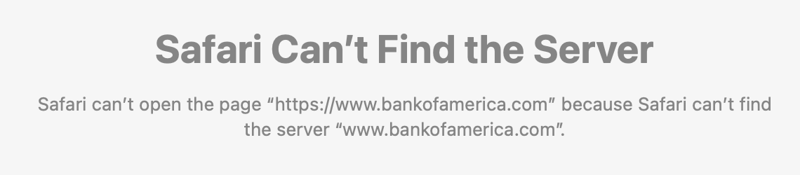

> RT @martin\_eve: Open peer review and its rhythms \- with a couple of extra bits added\.\.\.  
> https://eve\.gd/2022/08/30/open\-peer\-review\-and\-its\-rhythms/

 [Thu Sep 01 10:09:54 +0000 2022](https://twitter.com/kfitz/status/1565280779961335808)

----

Replying to [@sharonmleon](https://twitter.com/sharonmleon/status/1565348866915913730)

> Wow\! Inquiring minds want to know\!

 [Thu Sep 01 21:48:06 +0000 2022](https://twitter.com/kfitz/status/1565456487287226372)

----

Replying to [@sharonmleon](https://twitter.com/sharonmleon/status/1565458281233104900)

> WOO HOO\!\!\!

 [Thu Sep 01 21:55:46 +0000 2022](https://twitter.com/kfitz/status/1565458419502440450)

----

Replying to [@sharonmleon](https://twitter.com/sharonmleon/status/1565458630664650753)

> Totally\. Also yay for unexpected zucchini\!

 [Thu Sep 01 21:58:13 +0000 2022](https://twitter.com/kfitz/status/1565459033305268225)

----

Replying to [@sharonmleon](https://twitter.com/sharonmleon/status/1565459341985062913)

> That get a woo hoo too\!

 [Thu Sep 01 22:00:38 +0000 2022](https://twitter.com/kfitz/status/1565459644478361600)

----

> I had the amazing privilege of spending yesterday at a retreat with the Humanities Commons team\. One member was unable to join us, but 11 of us gathered to begin the process of building our future together\. \+

 [Fri Sep 02 12:37:54 +0000 2022](https://twitter.com/kfitz/status/1565680413984555008)

----

Replying to [@kfitz](https://twitter.com/kfitz/status/1565680413984555008)

> Of the 10 not\-me folks there, I got to see two of them in\-person for the very first time, and another three for the second time\. Our remote work started with the pandemic but it’s become intentional, distributed\. \+

 [Fri Sep 02 12:39:51 +0000 2022](https://twitter.com/kfitz/status/1565680906702135296)

----

Replying to [@kfitz](https://twitter.com/kfitz/status/1565680906702135296)

> We’re coming together for day 2 in just a little bit\. And I so look forward to sharing with the entire @humcommons community the great things to come\. &lt;3

 [Fri Sep 02 12:40:52 +0000 2022](https://twitter.com/kfitz/status/1565681163120828416)

----

Replying to [@BerondaM and @PlantLessons](https://twitter.com/BerondaM/status/1565698268025217025)

> SO beautiful\! Huge congrats, Beronda \(et félicitations \!\)

 [Fri Sep 02 14:27:14 +0000 2022](https://twitter.com/kfitz/status/1565707929277317121)

----

Replying to [@kristinarola](https://twitter.com/kristinarola/status/1565744274985156609)

> Holy COW, Kristin — you are a seal\! I haven’t been swimming very long, but my mile hovers right around 40:00…

 [Fri Sep 02 17:44:25 +0000 2022](https://twitter.com/kfitz/status/1565757552482258945)

----

Replying to [@martin\_eve](https://twitter.com/martin_eve/status/1565770180294221826)

> Aaaargh, Martin, I am so sorry\! Sending you my best thoughts\.

 [Fri Sep 02 18:45:05 +0000 2022](https://twitter.com/kfitz/status/1565772818754699266)

----

> This seems like an issue\. 
> 
> 

 [Sat Sep 03 14:52:53 +0000 2022](https://twitter.com/kfitz/status/1566076773342871552)

----

Replying to [@martin\_eve](https://twitter.com/martin_eve/status/1566445646445518848)

> Ha\! I’ll have to look it up\!

 [Sun Sep 04 16:56:28 +0000 2022](https://twitter.com/kfitz/status/1566470260445908994)

----

Replying to [@debcha](https://twitter.com/debcha/status/1566971550485692416)

> Oh dang\.

 [Tue Sep 06 10:24:29 +0000 2022](https://twitter.com/kfitz/status/1567096390756573185)

----

Replying to [@martin\_eve](https://twitter.com/martin_eve/status/1567162351677329408)

> Ugh, Martin, this just sounds like no fun at all\. Sending you all my best wishes…

 [Tue Sep 06 14:54:12 +0000 2022](https://twitter.com/kfitz/status/1567164268121817088)

----

Replying to [@JenHoward and @quinnanya](https://twitter.com/JenHoward/status/1567173577798991872)

> Wise comments from @quinnanya indeed\. But I also find myself annoyed that she gets referred to as “Quinn” while @benmschmidt is “Schmidt”?

 [Tue Sep 06 15:39:14 +0000 2022](https://twitter.com/kfitz/status/1567175598853787648)

----

Replying to [@colindickey](https://twitter.com/colindickey/status/1567190800731361280)

> The last time I got one of those, it was because the driver had taken a slightly longer route so that he could pitch me and my colleagues his NFTs\. I refrained from asking for help though I did think about it\.

 [Tue Sep 06 16:51:09 +0000 2022](https://twitter.com/kfitz/status/1567193700203208706)

----

Replying to [@colindickey](https://twitter.com/colindickey/status/1567197067784888327)

> Honestly, it was all I could do not to burst into hysterical laughter when the pitch started\. Happily I was in the backseat, directly behind him, and just got very interested in the passing scenery\.

 [Tue Sep 06 17:12:59 +0000 2022](https://twitter.com/kfitz/status/1567199194825236484)

----

Replying to [@PaulaKrebs](https://twitter.com/PaulaKrebs/status/1567205089336606721)

> For authors, it will mean that depositing work in Humanities Commons is of even greater value\! For publishers, I hope it will mean greater embrace of pre\- and postprint deposit\. @humcommons

 [Tue Sep 06 17:41:37 +0000 2022](https://twitter.com/kfitz/status/1567206398848634888)

----

> Here are the slides from my brief opening remarks at the RIT \#OpenWorkSummit: https://docs\.google\.com/presentation/d/1P54rpowZek5qNI9i35EsDZRf0cINAf4BSb\-G88tysWM/edit\#slide\=id\.p

 [Wed Sep 07 14:18:38 +0000 2022](https://twitter.com/kfitz/status/1567517706663993344)

----

Replying to [@jwolman](https://twitter.com/jwolman/status/1567573800073691136)

> The world is a dangerous place, Jacob\.

 [Wed Sep 07 18:04:36 +0000 2022](https://twitter.com/kfitz/status/1567574570172817408)

----

Replying to [@JenServenti](https://twitter.com/JenServenti/status/1567304334378995713)

> So wait\. You started working for the NEH in elementary school? \(Congrats, Jen, and huge thanks for everything you’ve done for all of us\!\)

 [Wed Sep 07 23:11:11 +0000 2022](https://twitter.com/kfitz/status/1567651724956995586)

----

Replying to [@mkgold, @RayS6, @arbuckle\_alyssa and @RSCTheAcademies](https://twitter.com/mkgold/status/1567633757280116736)

> Whoa\! Amazing news, indeed\! Congrats on this huge, well\-deserved honour \(defying US autocorrect feels appropriate\)\!\!\!

 [Wed Sep 07 23:12:49 +0000 2022](https://twitter.com/kfitz/status/1567652136527319041)

----

Replying to [@AprilHathcock](https://twitter.com/AprilHathcock/status/1567602365594738689)

> April, this is so great\! Congratulations, and good for @SPARC\_NA\!

 [Thu Sep 08 03:12:01 +0000 2022](https://twitter.com/kfitz/status/1567712334323322881)

----

Replying to [@EthanWatrall](https://twitter.com/EthanWatrall/status/1567894662253248515)

> Omg I’m getting them now too\. NOT OK\.

 [Thu Sep 08 17:18:56 +0000 2022](https://twitter.com/kfitz/status/1567925465393815552)

----

Replying to [@martin\_eve](https://twitter.com/martin_eve/status/1567920940389998592)

> “Have you been awake the last few years???”  
>   
> Continuing to send you all the best, Martin\.

 [Thu Sep 08 17:22:02 +0000 2022](https://twitter.com/kfitz/status/1567926247727964163)

----

Replying to [@meganeabbott](https://twitter.com/meganeabbott/status/1567944609073975302)

> Whew, movie star\!

 [Thu Sep 08 18:37:59 +0000 2022](https://twitter.com/kfitz/status/1567945357975224321)

----

> They’re playing Elvis Costello in ROC\. Alas, not https://www\.youtube\.com/watch?v\=9t4\-zDem1Sk

 [Fri Sep 09 16:21:11 +0000 2022](https://twitter.com/kfitz/status/1568273320646410240)

----

> RT @ReclaimMSU: Michigan Republican Party comes out swinging against MSU’s Resolution on Voter Suppression… without linking to it\.  
>   
> Read th…

 [Fri Sep 09 16:27:18 +0000 2022](https://twitter.com/kfitz/status/1568274861453185031)

----

> “Stop funding voter suppression” somehow equaling “support our Dem agenda” is super duper saying the quiet part out loud\. https://twitter\.com/ReclaimMSU/status/1568243472792195074

 [Fri Sep 09 16:28:51 +0000 2022](https://twitter.com/kfitz/status/1568275250118287362)

----

> Too soon\. https://twitter\.com/LongFormMath/status/1568253539516030982

 [Fri Sep 09 22:44:05 +0000 2022](https://twitter.com/kfitz/status/1568369682088079360)

----

Replying to [@scott\_bot, @quinnanya, @ryancordell, @nirak, @miriamkp and @hralperta](https://twitter.com/scott_bot/status/1568369904419540995)

> Convections changes things a lot, but is awesome\. I started using convection on my oven to roast chickens this summer, and it needs a lower temp and less time and I always have to look it up\. But also: faster and the house isn’t a million degrees\.

 [Fri Sep 09 22:48:19 +0000 2022](https://twitter.com/kfitz/status/1568370745251602433)

----

Replying to [@scott\_bot, @quinnanya, @ryancordell, @nirak, @miriamkp and @hralperta](https://twitter.com/scott_bot/status/1568369904419540995)

> PS: search for something like “convection oven conversion” and you will find many divergent but not too divergent charts\.

 [Fri Sep 09 22:49:24 +0000 2022](https://twitter.com/kfitz/status/1568371016954687489)

----

> Holy carp I don’t know how this happened\.   
>   
> Wordle 447 2/6\*  
>   
> ⬜⬜🟩⬜⬜  
> 🟩🟩🟩🟩🟩

 [Fri Sep 09 22:56:06 +0000 2022](https://twitter.com/kfitz/status/1568372706185482241)

----

Replying to [@martin\_eve](https://twitter.com/martin_eve/status/1569025606808997895)

> Argh, Martin\! I am so sorry\. Keeping you in my thoughts and really, really hoping they get this sorted soon\!

 [Sun Sep 11 18:11:56 +0000 2022](https://twitter.com/kfitz/status/1569025967011553281)

----

> What\. https://twitter\.com/reporterdavidj/status/1569024361910132739

 [Sun Sep 11 18:24:47 +0000 2022](https://twitter.com/kfitz/status/1569029201478533120)

----

Replying to [@physicistdanny](https://twitter.com/physicistdanny/status/1569041382567813122)

> The eternal damn question\.

 [Sun Sep 11 19:15:58 +0000 2022](https://twitter.com/kfitz/status/1569042083301695490)

----

> There are times when a taking couple of days to ensure a message is exactly right before sending it is the way to go\. And then there are times when trust requires more timeliness than polish\.

 [Sun Sep 11 22:47:38 +0000 2022](https://twitter.com/kfitz/status/1569095348374704129)

----

> Huh fascinating\. Dated exactly ten years ago today\. https://www\.nytimes\.com/2012/09/16/magazine/teresa\-sullivan\-uva\-ouster\.html?smid\=nytcore\-ios\-share&referringSource\=articleShare

 [Mon Sep 12 00:37:49 +0000 2022](https://twitter.com/kfitz/status/1569123079774769153)

----

> Reupping this for the morning crowd\. I have FEELINGS about all this\. https://twitter\.com/kfitz/status/1569123079774769153

 [Mon Sep 12 12:36:08 +0000 2022](https://twitter.com/kfitz/status/1569303848308674561)

----

Replying to [@kfitz](https://twitter.com/kfitz/status/1569303848308674561)

> One key feeling among which is “he ain’t perfect, but he’s SOOOO much better than anyone in recent memory\. And he’s OURS to protest, so back off\.”

 [Mon Sep 12 12:42:02 +0000 2022](https://twitter.com/kfitz/status/1569305334363070465)

----

> An excellent query in Amanda’s thread, below — as well as a convenient reminder that the community review of “Leading Generously is open\! https://leadinggenerously\.hcommons\.org https://twitter\.com/Literature\_Geek/status/1569390008674426882

 [Mon Sep 12 18:28:55 +0000 2022](https://twitter.com/kfitz/status/1569392629636558850)

----

Replying to [@brandontlocke](https://twitter.com/brandontlocke/status/1569391883675398144)

> Not… exactly? It sure looks a lot like the BoT is forcing the president out for \*action\* on RVSM issues\.

 [Mon Sep 12 18:31:08 +0000 2022](https://twitter.com/kfitz/status/1569393185696415744)

----

Replying to [@brandontlocke](https://twitter.com/brandontlocke/status/1569396424005283840)

> Quite the opposite, in fact\.

 [Mon Sep 12 18:50:34 +0000 2022](https://twitter.com/kfitz/status/1569398079908102144)

----

Replying to [@physicistdanny](https://twitter.com/physicistdanny/status/1569437937955385344)

> And now you will have less\. https://www\.lansingstatejournal\.com/story/news/2022/09/12/dianne\-byrum\-condemns\-effort\-remove\-michigan\-state\-university\-president\-samuel\-stanley\-jr/69487626007/

 [Mon Sep 12 21:32:41 +0000 2022](https://twitter.com/kfitz/status/1569438877961826304)

----

Replying to [@physicistdanny](https://twitter.com/physicistdanny/status/1569439040252035073)

> 🤪

 [Mon Sep 12 21:34:07 +0000 2022](https://twitter.com/kfitz/status/1569439235220074497)

----

> Wowza indeed\. https://twitter\.com/jackstripling/status/1569447130695348224

 [Mon Sep 12 23:02:24 +0000 2022](https://twitter.com/kfitz/status/1569461456109707265)

----

> This isn’t embarrassing at all\.

 [Mon Sep 12 23:06:40 +0000 2022](https://twitter.com/kfitz/status/1569462526827724801)

----

Replying to [@tressiemcphd](https://twitter.com/tressiemcphd/status/1569763055193448450)

> The no washcloths thing in European hotels kills me\. I had someone in France explain to me years ago that washcloths are considered “too personal\.” But somehow towels aren’t?

 [Tue Sep 13 22:32:24 +0000 2022](https://twitter.com/kfitz/status/1569816292109983752)

----

Replying to [@martin\_eve](https://twitter.com/martin_eve/status/1570030508553412609)

> I am SO glad to hear you’re going home, Martin\! Sending more good wishes from here\!

 [Wed Sep 14 12:59:24 +0000 2022](https://twitter.com/kfitz/status/1570034481565962240)

----

Replying to [@PaulaKrebs](https://twitter.com/PaulaKrebs/status/1570163311127457793)

> Not that I like what’s happening in the tweet\! But that is a finely crafted tweet\. \(Is a thing I weirdly often feel the need to say\.\)

 [Wed Sep 14 21:49:50 +0000 2022](https://twitter.com/kfitz/status/1570167966473281543)

----

> Trust is far more easy to break than to build\. But finding those places where it can be developed is crucial for a functioning organization\. https://twitter\.com/cplong/status/1570394726292983809

 [Thu Sep 15 13:19:14 +0000 2022](https://twitter.com/kfitz/status/1570401857876500480)

----

Replying to [@martin\_eve](https://twitter.com/martin_eve/status/1570692796696391680)

> I’m sorry to hear this, Martin, but really hope this helps\! Sending good wishes your way\.

 [Fri Sep 16 10:38:27 +0000 2022](https://twitter.com/kfitz/status/1570723784352534531)

----

> The more we find out, the less we know\. https://twitter\.com/kimberkoz/status/1570747397155835905

 [Fri Sep 16 12:53:44 +0000 2022](https://twitter.com/kfitz/status/1570757831619485696)

----

Replying to [@scott\_bot](https://twitter.com/scott_bot/status/1570816444694425601)

> WHOA\. That’s huge news, Scott\! Huge congratulations — and yay, NEH\!\!\!

 [Fri Sep 16 16:54:46 +0000 2022](https://twitter.com/kfitz/status/1570818486263508998)

----

> This is a huge loss\. https://twitter\.com/rhacel/status/1570884815922294785

 [Fri Sep 16 23:33:01 +0000 2022](https://twitter.com/kfitz/status/1570918708423409664)

----

> RT @sharonmleon: Who is going to fill this giant gap left by the Ford Foundation? Those fellowships are essential to all of us moving forwa…

 [Sat Sep 17 12:38:59 +0000 2022](https://twitter.com/kfitz/status/1571116506007625728)

----

Replying to [@wynkenhimself](https://twitter.com/wynkenhimself/status/1571126180245536769)

> “Difficult choices,” from what I can tell\. 😕

 [Sat Sep 17 14:18:35 +0000 2022](https://twitter.com/kfitz/status/1571141571063713793)

----

Replying to [@wynkenhimself](https://twitter.com/wynkenhimself/status/1571143414619729921)

> Completely\. It’s devastating\.

 [Sat Sep 17 14:30:56 +0000 2022](https://twitter.com/kfitz/status/1571144679684538370)

----

> This\. https://twitter\.com/shannonmattern/status/1571194363799080968

 [Sat Sep 17 20:04:50 +0000 2022](https://twitter.com/kfitz/status/1571228706831765504)

----

> RT @Red\_HD: \#Evento \| Asiste al evento "Critical Infraestructure" organizado por @UofTDHN con @kfitz el 20 de septiembre de 12 a 13hrs vía…

 [Sun Sep 18 14:01:45 +0000 2022](https://twitter.com/kfitz/status/1571499721746694148)

----

> RT @UofTDHN: ⚡️SEPT 20 \| 12:00PM \| VIRTUAL  
>   
> Reminder to register\! The first Lightning Lunch of the year features DH scholars Kathleen Fitzp…

 [Mon Sep 19 14:42:36 +0000 2022](https://twitter.com/kfitz/status/1571872390401130496)

----

> 🧵 https://twitter\.com/kwissoker/status/1571915902890942466

 [Mon Sep 19 21:08:47 +0000 2022](https://twitter.com/kfitz/status/1571969575180439553)

----

Replying to [@RPR\_Agile](https://twitter.com/RPR_Agile/status/1572214751173947394)

> Congratulations\! I can’t wait to read it\.

 [Tue Sep 20 14:17:46 +0000 2022](https://twitter.com/kfitz/status/1572228527092813826)

----

> “The board owes it to the university to look competent\.” Actually being competent — and even trustworthy — would be even better\! https://twitter\.com/thesnews/status/1572270537501732868

 [Tue Sep 20 17:36:58 +0000 2022](https://twitter.com/kfitz/status/1572278660211646465)

----

Replying to [@lesliekwchan, @jojokarlin, @UofTDHN and @randaelka](https://twitter.com/lesliekwchan/status/1572320692519182336)

> The both of us, Leslie\! Thanks, Jojo, and thanks to the @UofTDHN team for such an amazing event\!

 [Tue Sep 20 20:37:08 +0000 2022](https://twitter.com/kfitz/status/1572323998238707713)

----

> This, if nothing else, is a call to strengthen the humanities on campus\. Good critical readers would know better\. https://twitter\.com/czmyt/status/1572572674903396353

 [Wed Sep 21 13:24:20 +0000 2022](https://twitter.com/kfitz/status/1572577467705217024)

----

Replying to [@tcarmody and @jadedid](https://twitter.com/tcarmody/status/1572680414375956480)

> They do for me as well, but I’ll say that the thing that makes the difference for me in liking one fish more than another is texture\.

 [Wed Sep 21 21:56:24 +0000 2022](https://twitter.com/kfitz/status/1572706333765341184)

----

Replying to [@kristinarola](https://twitter.com/kristinarola/status/1572970598426460161)

> HOORAY\!\!\!

 [Thu Sep 22 15:56:46 +0000 2022](https://twitter.com/kfitz/status/1572978217073401858)

----

> Oooh\. This is a great looking position\. https://twitter\.com/hathitrust/status/1572966746344022017

 [Thu Sep 22 17:53:59 +0000 2022](https://twitter.com/kfitz/status/1573007715403988993)

----

> It finally hit me that I hate “creatives” for exactly the same reason I hate “females\.” Adjectives are not nouns\. And especially when we’re taking about people\.

 [Thu Sep 22 21:52:13 +0000 2022](https://twitter.com/kfitz/status/1573067670626488320)

----

> Welcome to another episode of WTF, BOT\! https://twitter\.com/thesnews/status/1573039864500850688

 [Thu Sep 22 22:05:04 +0000 2022](https://twitter.com/kfitz/status/1573070903797243906)

----

Replying to [@jilltxt](https://twitter.com/jilltxt/status/1573266173994553345)

> Jill\! Holy cow, this is great news\!

 [Fri Sep 23 12:41:46 +0000 2022](https://twitter.com/kfitz/status/1573291533054386176)

----

> This is super exciting — I can’t wait to see how this unfolds\! https://twitter\.com/jilltxt/status/1573266403083304966

 [Fri Sep 23 12:42:29 +0000 2022](https://twitter.com/kfitz/status/1573291713749213187)

----

Replying to [@tressiemcphd](https://twitter.com/tressiemcphd/status/1573333905440395264)

> I work on a team that is ALL ABOUT the calendar invites \(though we’re an O365 shop\)\. And folks outside my team who just stick meeting info in an email rather than an invite are very, very high on my list of pet peeves\.

 [Fri Sep 23 15:42:06 +0000 2022](https://twitter.com/kfitz/status/1573336915360845825)

----

> RT @zwhnz: Ok, who out there has strong opinions about institutional \(or other\) \#repositories that wants rant about it on a call with me so…

 [Fri Sep 23 15:58:13 +0000 2022](https://twitter.com/kfitz/status/1573340973421273091)

----

> An airline that made a real, systemic commitment to full accessibility could get a lot of, ahem, mileage out of it\. \(I know I'd be a supporter\.\) https://twitter\.com/emily\_ladau/status/1573777634726649857

 [Sat Sep 24 21:10:21 +0000 2022](https://twitter.com/kfitz/status/1573781909431369730)

----

> Hell is being in an office building in which all the coffee machines are behind doors you cannot unlock\. \#whereIsEveryone

 [Mon Sep 26 13:56:43 +0000 2022](https://twitter.com/kfitz/status/1574397558566187008)

----

Replying to [@billhd](https://twitter.com/billhd/status/1574397977879318529)

> So totally not okay\.

 [Mon Sep 26 14:09:33 +0000 2022](https://twitter.com/kfitz/status/1574400786783604741)

----

Replying to [@jackjewers](https://twitter.com/jackjewers/status/1574409758299328513)

> Apparently\!

 [Mon Sep 26 15:07:33 +0000 2022](https://twitter.com/kfitz/status/1574415384207192064)

----

> I’m super grateful for all the comments so far on Leading Generously\. I’m hoping to work through them this week and ask some follow\-up questions\. I’d love  to hear any other thoughts others may have as well, before I start the revision process\. https://leadinggenerously\.hcommons\.org

 [Mon Sep 26 15:46:56 +0000 2022](https://twitter.com/kfitz/status/1574425297100804098)

----

Replying to [@JenHoward](https://twitter.com/JenHoward/status/1574450300425207808)

> Argh, super annoying\! I have one ear that is stuck to my head higher than the other one is\. This is not visible to anyone except when I’m wearing glasses, which are never level\. I am not alone in this configuration — you’d think opticians would be prepared to deal with it\!

 [Mon Sep 26 17:38:26 +0000 2022](https://twitter.com/kfitz/status/1574453353345851392)

----

Replying to [@JenHoward](https://twitter.com/JenHoward/status/1574454133716914183)

> Exactly\! Just do what you need to do to make the glasses level, don’t critique my ear placement, over which I have precious little control, thanks\.

 [Mon Sep 26 17:44:00 +0000 2022](https://twitter.com/kfitz/status/1574454755778187264)

----

> Signed\. I hope you will sign as well\. https://twitter\.com/neuromatch/status/1574756911827787776

 [Tue Sep 27 21:47:31 +0000 2022](https://twitter.com/kfitz/status/1574878427844321285)

----

> RT @jcdrg: You might consider signing: https://ostp\-letter\.github\.io/  
>   
> I just did\! It has to do with the OSTP memo recenly published\.  
>   
> Let us reme…

 [Tue Sep 27 21:53:12 +0000 2022](https://twitter.com/kfitz/status/1574879858626273298)

----

Replying to [@martin\_eve](https://twitter.com/martin_eve/status/1574866850504122377)

> Hoping for option 1\!\!\!

 [Tue Sep 27 21:58:36 +0000 2022](https://twitter.com/kfitz/status/1574881217069154304)

----

Replying to [@profwernimont](https://twitter.com/profwernimont/status/1574922457852440576)

> Argh, I’m so sorry\! Hoping things are better soon\!

 [Wed Sep 28 10:51:03 +0000 2022](https://twitter.com/kfitz/status/1575075610736607238)

----

Replying to [@billhd](https://twitter.com/billhd/status/1575117192135417857)

> External reviews \= of a unit, rather than a person?

 [Wed Sep 28 13:38:44 +0000 2022](https://twitter.com/kfitz/status/1575117806974246912)

----

Replying to [@billhd](https://twitter.com/billhd/status/1575118446211334144)

> I guessed but wanted to be sure of the distinction\!

 [Wed Sep 28 13:49:48 +0000 2022](https://twitter.com/kfitz/status/1575120594655379457)

----

> This is an amazing project led by @betsysneller and @redbirdred at @CALMSU\! https://twitter\.com/NEH\_ODH/status/1575126431092203520

 [Wed Sep 28 14:24:30 +0000 2022](https://twitter.com/kfitz/status/1575129327875792896)

----

> On my first day of work at Universal Television I rode in an elevator with Meryl Streep and Carrie Fisher and did not know I had done so until I was told\. https://twitter\.com/alexeptable/status/1575085189096562688

 [Wed Sep 28 14:46:42 +0000 2022](https://twitter.com/kfitz/status/1575134914139365376)

----

Replying to [@RahawaHaile](https://twitter.com/RahawaHaile/status/1575149729456934912)

> Thinking about you and yours, Rahawa\. 💔

 [Wed Sep 28 16:38:06 +0000 2022](https://twitter.com/kfitz/status/1575162946669449216)

----

> This is why I’m still masking, and why I’ll take any vaccine that comes my way\. I already have a clotting disorder; I do not need more tyvm https://twitter\.com/DFisman/status/1575107797037248513

 [Wed Sep 28 16:45:20 +0000 2022](https://twitter.com/kfitz/status/1575164767270047745)

----

> RT @samplereality: If I could wish for one thing, it'd be for all my academic friends and community to GTFO Facebook\.

 [Wed Sep 28 19:22:35 +0000 2022](https://twitter.com/kfitz/status/1575204342830972946)

----

Replying to [@martin\_eve](https://twitter.com/martin_eve/status/1575459484402696194)

> I had a moment of reading this as an issue with your project manager, and I thought “boy, that’s a hard one to mentor somebody out of\.”  
>   
> And then I realized which PM you meant\. And it got so much worse\. I’m sorry\.

 [Thu Sep 29 13:27:05 +0000 2022](https://twitter.com/kfitz/status/1575477265890246656)

----

> RT @Educopia: News on the Educopia blog: Educopia's new Co\-Directors share the organization's path toward a new model of shared leadership\.…

 [Thu Sep 29 16:19:53 +0000 2022](https://twitter.com/kfitz/status/1575520749695246337)

----

Replying to [@tcarmody](https://twitter.com/tcarmody/status/1575524322440990726)

> Long since done, Tim\. \#RIPGoogleReader, the best thing they’ve ever shut down\.

 [Thu Sep 29 17:02:51 +0000 2022](https://twitter.com/kfitz/status/1575531563785207808)

----

> Some one I love once told me that the appeal of That Horrible Former Guy was that he was willing to say what everyone was thinking\. I blurted “if that’s what everyone is thinking, they should be ashamed\.” https://twitter\.com/Simon\_Whitten/status/1575493569611452431

 [Thu Sep 29 17:05:29 +0000 2022](https://twitter.com/kfitz/status/1575532227684802561)

----

> Oh man, all of this\. https://twitter\.com/saramfung/status/1575142829608804353

 [Fri Sep 30 00:57:46 +0000 2022](https://twitter.com/kfitz/status/1575651080880496641)

----

Replying to [@brandontlocke](https://twitter.com/brandontlocke/status/1575926453564162048)

> Nooooooo\!\!\!

 [Sat Oct 01 00:13:40 +0000 2022](https://twitter.com/kfitz/status/1576002369132920834)

----

Replying to [@DEJPett](https://twitter.com/DEJPett/status/1575928999876136960)

> Oh, I’m so sorry\! 💔

 [Sat Oct 01 00:15:08 +0000 2022](https://twitter.com/kfitz/status/1576002739221549057)

----

> So one of the things that has happened this fall is that my travel schedule has started picking up again\. Have I mentioned that while getting to be other places is sometimes awesome the actual act of travel sucks?

 [Sat Oct 01 00:33:14 +0000 2022](https://twitter.com/kfitz/status/1576007294718025728)

----

Replying to [@kfitz](https://twitter.com/kfitz/status/1576007294718025728)

> On top of which I seem to have aged about 10 years in the last 2, joint\-health\-wise, and I don’t think there’s a single working escalator in all of the New York metro area\.

 [Sat Oct 01 00:34:50 +0000 2022](https://twitter.com/kfitz/status/1576007695395594240)

----

Replying to [@kfitz](https://twitter.com/kfitz/status/1576007695395594240)

> Everything hurts\.

 [Sat Oct 01 00:35:22 +0000 2022](https://twitter.com/kfitz/status/1576007832243167232)

----

Replying to [@katinalynn](https://twitter.com/katinalynn/status/1576015498738810886)

> :waves from the plane headed back to DTW: It was a painfully quick trip\!

 [Sat Oct 01 01:19:16 +0000 2022](https://twitter.com/kfitz/status/1576018878584455168)